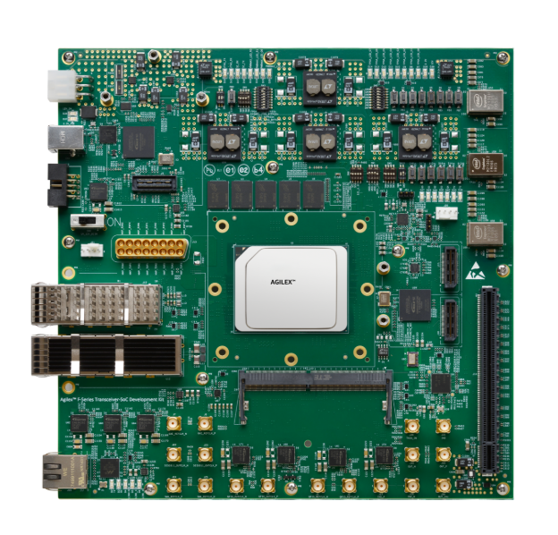
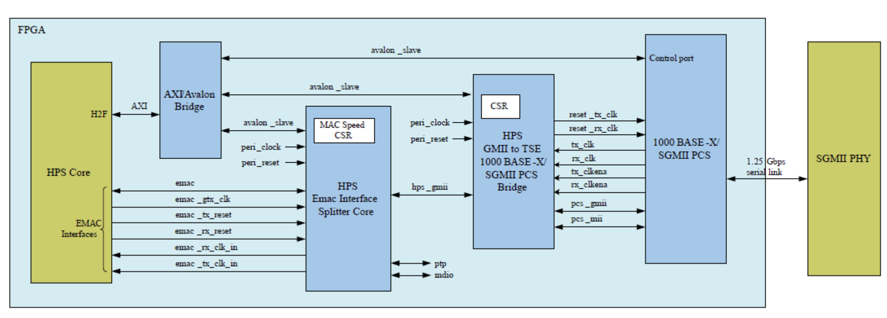
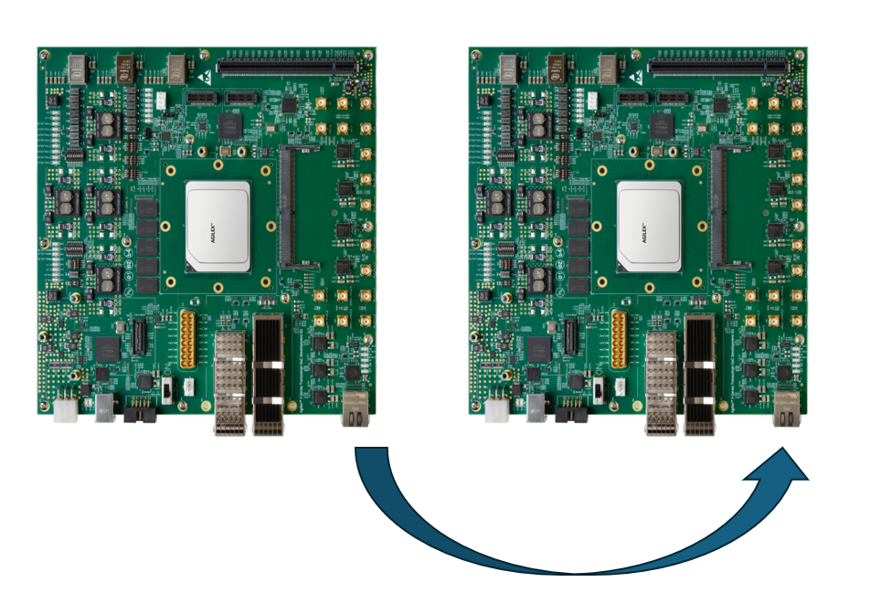
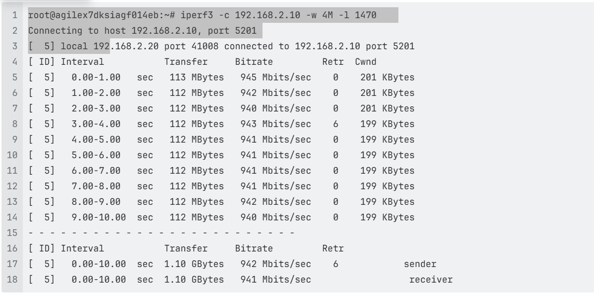

## Introduction

### HPS SGMII System Example Design Overview

Hard Processor System (HPS) SGMII System Example Design (SED) is a reference design running on the [Agilex™ 7 FPGA F-Series Transceiver-SoC Development Kit (P-Tile and E-Tile)](https://www.altera.com/products/devkit/po-3003/agilex-7-fpga-f-series-transceiver-soc-development-kit-p-tile-and-e-tile) ordering code DK-SI-AGF014EB  

This System Example Design comprises the following components:

* Hardware Reference Design
* Reference HPS software including:
  * Arm Trusted Firmware
  * U-Boot
  * Linux Kernel
  * Linux Drivers
  * Sample Applications

Please refer to this pages for more detail.
[HPS Baseline System Example Design (SED) User Guide](https://altera-fpga.github.io/rel-26.1/embedded-designs/agilex-7/f-series/soc/gsrd/ug-gsrd-agx7f-soc/)

### Prerequisites

This system example design is based on the [Agilex™ 7 FPGA F-Series Transceiver-SoC Development Kit (P-Tile and E-Tile)](https://www.altera.com/products/devkit/po-3003/agilex-7-fpga-f-series-transceiver-soc-development-kit-p-tile-and-e-tile). It is recommended that you familiarize yourself with the HPS Baseline System Example Design (SED) development flow before proceeding with this design.
The SGMII System Example Design will be implemented on Agilex™ 7 FPGA F-Series Transceiver-SoC Development Kit.

- SD/MMC HPS Daughtercard
  - SDM QSPI Bootcard
  - Mini USB cable for serial output
  - Micro USB cable for on-board Altera® FPGA Download Cable II
  - Micro SD card (4GB or greater)
- Host PC with
  - Linux - Ubuntu 22.04LTS was used to create this page, other versions and distributions may work too
  - Serial terminal (for example Minicom on Linux and TeraTerm or PuTTY on Windows)
  - Micro SD card slot or Micro SD card writer/reader
  - Altera&reg; Quartus&reg; Prime Pro Edition Version 26.1
  - Local Ethernet network, with DHCP server (will be used to provide IP address to the board)

You can determine your board version by referring to the following table from [https://docs.altera.com/r/docs/683752/current/agilextm-7-fpga-f-series-transceiver-soc-development-kit-user-guide/overview](https://docs.altera.com/r/docs/683752/current/agilextm-7-fpga-f-series-transceiver-soc-development-kit-user-guide/overview)

#### Development Kit

* Altera&reg; Agilex&trade; 7 FPGA F-Series Transceiver-SoC Development Kit (P-Tile and E-Tile)
* HPS Enablement Expansion Board. Included with the development kit.
* Mini USB Cable
* Micro USB Cable
* Ethernet Cable
* Micro SD card and USB card writer

**Altera&reg; Agilex&trade; 7 FPGA F-Series Transceiver-SoC Development Kit (P-Tile and E-Tile):**

#### Development Environment

Host PC with:

*   64 GB of RAM. Less will be fine for only exercising the binaries, and not rebuilding the HPS Baseline System Example Design (SED).
*   Linux OS installed. Ubuntu 22.04LTS was used to create this page, other versions and distributions may work too.
*   Serial terminal (for example GtkTerm or Minicom on Linux and TeraTerm or PuTTY on Windows)
*   Altera&reg; Quartus&reg; Prime Pro Edition version. Used to recompile the hardware design. If only writing binaries is required, then the smaller Altera&reg; Quartus&reg; Prime Pro Edition Programmer is sufficient.
*   The prebuilt binaries were built using Altera&reg; Quartus&reg; 26.1
*   The instructions for rebuilding the binaries use Altera&reg; Quartus&reg; 26.1
*   Local Ethernet network, with DHCP server
*   Internet connection. For downloading the files, especially when rebuilding the HPS Baseline System Example Design (SED).

### Release Contents

This page documents content testing with prebuild binaries flow and testing with complete flow.

### Release Contents

#### Release Notes

The Altera® FPGA HPS Embedded Software release notes can be accessed from the following link: [https://github.com/altera-fpga/gsrd-socfpga/releases/tag/QPDS26.1_REL_GSRD_PR](https://github.com/altera-fpga/gsrd-socfpga/releases/tag/QPDS26.1_REL_GSRD_PR)

#### Prebuilt Binaries

<h5>SD Card Boot</h5>

The release files are accessible at [https://releases.rocketboards.org/2026.04/sgmii/agilex7_dk_si_agf014eb_sgmii/](https://releases.rocketboards.org/2026.04/sgmii/agilex7_dk_si_agf014eb_sgmii/)

* See [HPS Baseline System Example Design (SED) User Guide for the Agilex™ 7 FPGA F-Series Transceiver-SoC Development Kit (P-Tile and E-Tile)](https://altera-fpga.github.io/rel-26.1/embedded-designs/agilex-7/f-series/soc/gsrd/ug-gsrd-agx7f-soc/)
  
  * See Prerequisites
  * See [Prebuild Binaries](https://releases.rocketboards.org/2026.04/sgmii/agilex7_dk_si_agf014eb_sgmii/)
  * See Component Versions
  * See Exercise-prebuilt-binaries

## RGMII Architecture

This reference design adds one Ethernet interfaces by exporting HPS EMAC interfaces to the FPGA fabric. The interfaces are then connected to the HPS EMAC to multirate PHY GMII Adapter IP, which is then sent to the Muti-rate Ethernet PHY IP. Finally the signals are routed to both 88E1111 PHY located on the Altera® Agilex™ 7 FPGA F-Series Transceiver-SoC Development Kit via SGMII.

[End of Introduction]: <>

## User Flow

There are two ways to test the design based on use case.
    

* User Flow 1: [Testing with Prebuilt Binaries](https://altera-fpga.github.io/rel-26.1/embedded-designs/agilex-7/f-series/soc/gsrd/ug-gsrd-agx7f-soc/#exercise-prebuilt-binaries)
  * The release of prebuild binaries are accessible at [https://releases.rocketboards.org/2026.04/sgmii/agilex7_dk_si_agf014eb_sgmii/](https://releases.rocketboards.org/2026.04/sgmii/agilex7_dk_si_agf014eb_sgmii/)

    

* User Flow 2: [Testing Complete Flow Rebuild Binaries](https://altera-fpga.github.io/rel-26.1/embedded-designs/agilex-7/f-series/soc/gsrd/ug-gsrd-agx7f-soc/#rebuild-the-binaries)
  * **Replace "make agf014eb-si-devkit-oobe-baseline-all" > "make agf014eb-si-devkit-oobe-sgmii-all"** at Build Hardware Design flow.

  * The following files are created:
    * `$TOP_FOLDER/agilex7f-ed-gsrd/install/designs/agf014eb_si_devkit_oobe_sgmii.sof` - FPGA configuration file, without HPS FSBL
    * `$TOP_FOLDER/agilex7f-ed-gsrd/install/designs/agf014eb_si_devkit_oobe_sgmii_hps_debug.sof` - FPGA configuration file, with HPS Debug FSBL
    * Continue rebuild until Create QSPI Image.
>[Note:]
>Please refer to Exercise Prebuilt Binaries to Programm the binaries

| User Flow | Description | Required for [Userflow#1](#UserFlow1) | Required for [Userflow#2](#UserFlow2) |
| --- | --- | --- | --- |
|Environment Setup|Tools Download and Installation|Yes|Yes|
||Install dependencies for SW compilation|No|Yes|
 |Compilation|Simulation|No|No|
||Hardware Compilation|No|Yes|
||Software Compilation|No|Yes|
|Programming|Programming the binaries|Yes|Yes|

### Testing

For the purpose of demonstration, 2 development kits (refer to HPS Baseline System Example Design (SED)) will be required with Ethernet connected back to back from one board to another. 

#### Running Ping Test
Use ifconfig to configure the IP address on both the Devkit DUT and start testing.

Example:-

Devkit #1 : $ ifconfig eth0 192.168.1.100

Devkit #2 : $ ifconfig eth0 192.168.1.200

#### Running _iperf_ Test:

1. Execute below command on Devkit #1 DUT.

    `iperf3 -s eth0`

2. Execute below command on Devkit #2 DUT.

    `iperf3 eth0 -c 192.168.1.100 -w 4M -l 1470`

    _Note : Update the Devkit #1 DUT IP address in above command._

[End of ## User Flow]: <>

## Notices & Disclaimers

Altera&reg; Corporation technologies may require enabled hardware, software or service activation.
No product or component can be absolutely secure. 
Performance varies by use, configuration and other factors.
Your costs and results may vary. 
You may not use or facilitate the use of this document in connection with any infringement or other legal analysis concerning Altera or Intel products described herein. You agree to grant Altera Corporation a non-exclusive, royalty-free license to any patent claim thereafter drafted which includes subject matter disclosed herein.
No license (express or implied, by estoppel or otherwise) to any intellectual property rights is granted by this document, with the sole exception that you may publish an unmodified copy. You may create software implementations based on this document and in compliance with the foregoing that are intended to execute on the Altera or Intel product(s) referenced in this document. No rights are granted to create modifications or derivatives of this document.
The products described may contain design defects or errors known as errata which may cause the product to deviate from published specifications.  Current characterized errata are available on request.
Altera disclaims all express and implied warranties, including without limitation, the implied warranties of merchantability, fitness for a particular purpose, and non-infringement, as well as any warranty arising from course of performance, course of dealing, or usage in trade.
You are responsible for safety of the overall system, including compliance with applicable safety-related requirements or standards. 
&copy; Altera Corporation.  Altera, the Altera logo, and other Altera marks are trademarks of Altera Corporation.  Other names and brands may be claimed as the property of others. 

OpenCL* and the OpenCL* logo are trademarks of Apple Inc. used by permission of the Khronos Group™. 
