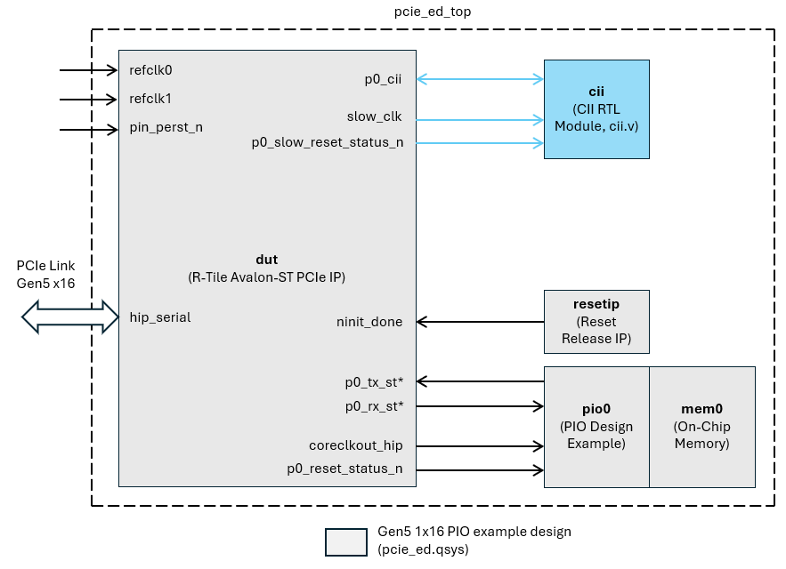
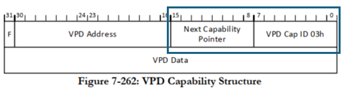
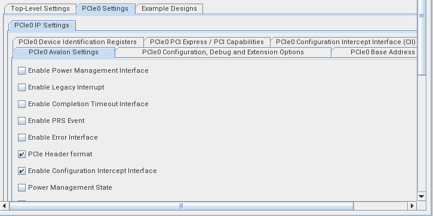
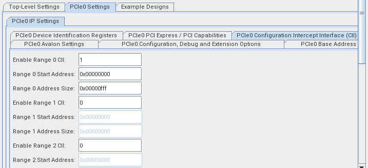
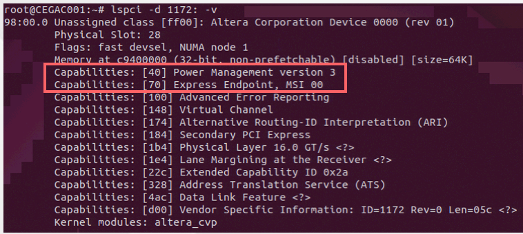
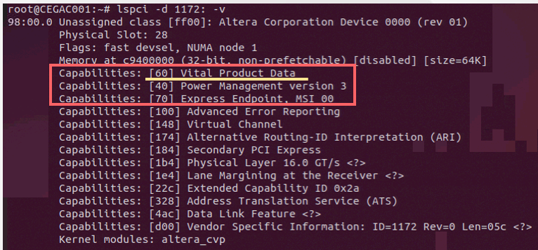
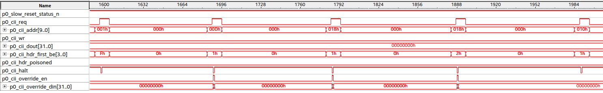

# Agilex 7 R-Tile AVST PCIe Configuration Intercept Interface (CII) example design

## 1.0 About This Document

This document provides information about the R-Tile AVST PCIe CII interface using an example RTL module that adds the VPD capability in the user logic, running the example design on Agilex 7 I-Series FPGA Development Kit board, and view the result. 

### 2.0 Intended Audience

This document is intended for FPGA and system developers to use as a guide for evaluating the R-Tile AVST PCIe IP and CII interface on Agilex 7 I-Series FPGA Development Kit board (Ordering Code: DK-DEV-AGI027-RA, Production Kit)
 
### Table 1: Terms and Acronyms
| Terms | Description |
| :---- | :---------- |
| AVST	| Avalon Streaming |
|  CfgWr   | Configuration Write request. A type of PCIe Transaction Layer Packet (TLP) that the host system generates to write data into the configuration space registers of a PCIe device. |
| CfgRd | Configuration Read request. A type of PCIe TLP that the host system generates to read data from the configuration space registers of a PCIe device. |
| CfgRd Completion | Configuration Read Completion. A type of PCIe TLP that the PCIe device generates in response to a Configuration Read (CfgRd) request from the host. It contains the requested data from the device's configuration space registers. |
| Configuration Space Header | The first 64 bytes of a Function's Configuration Space (Offset 00h - 3Fh). Capabilities Pointer register (Offset 34h) gives location of first register block in the linked list of Capability Structures in PCI-Compatible Configuration Space. |
| Linked list of Capabilities | PCIe Configuration Space Capabilities are linked together as a linked list. This is referred to as a capability chain in this document|
| PCI-Compatible Configuration Space | The first 256 bytes of a Function's Configuration Space (Offset 00h ~ FFh). PCI-Compatible Capability registers are located in this space. E.g., Power Management (ID: 01h), Vital Product Data (ID: 03h), PCI Express (ID: 10h) |
| PCI Express Extended Configuration Space | Configuration Space at offset 256 or greater (Offset 100h ~ FFFh). PCI Express Extended Capability registers are located in this space. E.g., Advance Error Reporting (AER) Capability (ID: 001h). |
| VPD | Vital Product Data Capability register. Includes information that uniquely identifies hardware and , potentially, software elements of a system. |

#### 2.1 Related Information
* [FPGA R-Tile Avalon ® Streaming (Avalon-ST) IP for PCI Express User Guide](https://www.intel.com/content/www/us/en/docs/programmable/683501/24-3/about-the-r-tile-streaming-fpga-ip-for.html)
* [FPGA R-Tile Avalon ® Streaming (Avalon-ST) IP for PCI Express Design Example User Guide](https://www.intel.com/content/www/us/en/docs/programmable/683544/24-3/functional-descriptions-of-the-design.html)
* [Agilex ® 7 FPGA I-Series Development Kit (2x R-Tiles + 1x F-Tile)](https://www.intel.com/content/www/us/en/products/details/fpga/development-kits/agilex/agi027.html)
* [Quartus Prime Pro Signal Tap Logic Analyzer Tool](https://www.intel.com/content/www/us/en/docs/programmable/683819/24-3/logic-analyzer-introduction.html)

## 3.0 Overview

Agilex 7 R-Tile AVST PCIe CII interface allows the application logic to detect the occurrence of a Configuration (CFG) request from the host and modify its behavior. The application logic can use the CII to :

* Delay the processing of a CFG request by the controller. This allows the application to perform any housekeeping task first.
* Overwrite the data payload of a CfgWr request
* Overwrite the data payload of a CfgRd Completion

This example design demonstrates a CII use case where a PCIe capability structure is added to the PCIe IP example design capability chain. It shows how you can modify the PCIe capability chain through the CII. 

Below is the block diagram.

### 4.0 DUT Interface / Signal Description

The following tables describe the **dut** interface/signals. 

#### Table 2: Clocks
| Interface / Signal | Description |
|:-------------------------|:-----------------|
|refclk0, refclk1| 100MHz reference clocks for the PCIe IP core. |
|coreclkout_hip| This clock drives the IP core data link / transaction layers and application layer. |
|slow_clk| Clock for sideband interface (e.g., CII). Divide-by-2 or divide-by-4 clock derived from coreclkout_hip. |

For more info, refer to the IP User Guide.
*  [Clocks] (https://www.intel.com/content/www/us/en/docs/programmable/683501/24-3/clocks.html)

#### Table 3: Resets
| Interface / Signal | Description |
|:-------------------------|:-----------------|
|pin_perst_n| Active low PCIe reset from the board (PERST#). |
|p0_reset_status_n| Active low reset status synchronized to coreclkout_hip. |
|p0_slow_reset_status_n| Active low reset status synchronized to slow_clk. |
|ninit_done| Active low signal indicating the FPGA device has been configured and is in normal operating mode. |

#### Table 4: CII Interface
| Interface / Signal | Description |
|:-----|:-----------------|
|p0_cii| Configuration Intercept Interface. |

For more info, refer to the IP User Guide.

* [CII Interface] (https://www.intel.com/content/www/us/en/docs/programmable/683501/24-3/configuration-intercept-interface.html)

#### Table 5: Avalon Streaming TX Interface
| Interface / Signal | Description |
|:---------------|:-----------------|
|p0_tx_st*| Avalon Streaming TX Interface and TX Flow Control Interface. |

For more info, refer to the IP User Guide.

* [Streaming TX Interface] (https://www.intel.com/content/www/us/en/docs/programmable/683501/24-3/streaming-tx-interface.html)
* [Streaming TX Flow Control Interface] (https://www.intel.com/content/www/us/en/docs/programmable/683501/24-3/tx-flow-control-interface.html)

#### Table 6: Avalon Streaming RX Interface
| Interface / Signal | Description |
|:---------------|:-----------------|
|p0_rx_st*| Avalon Streaming RX Interface and RX Flow Control Interface. |

For more info, refer to the IP User Guide.

* [Streaming RX Interface] (https://www.intel.com/content/www/us/en/docs/programmable/683501/24-3/streaming-rx-interface.html)
* [Streaming RX Flow Control Interface] (https://www.intel.com/content/www/us/en/docs/programmable/683501/24-3/rx-flow-control-interface.html)

#### Table 7: Serial Data Interface
| Interface / Signal | Description |
|:---------------|:-----------------|
|hip_serial| Hard IP transmit and receive serial data interface. |

For more info, refer to the IP User Guide.
* [Serial Data Interafce] (https://www.intel.com/content/www/us/en/docs/programmable/683501/24-3/serial-data-interface.html)

## 5.0 Description

Below is the PCIe IP example design Capability chain before adding the VPD. 

|Config Offset|Description|Capability ID| Nex Cap. Pointer|Notes|
|----|----|----|----|----|
|0x34|Capabilities Pointer|n/a|0x40|PCIe IP \n Points to start of the Capability chain (Offset 0x40) - Power Management Capability|
|0x40|Power Management|0x01|0x70|PCIe IP|
|0x70|PCI Express|0x10|0x00|PCIe IP \n End of Capability chain|

In order to add the VPD Capability register shown below:

1. After reset, the CII module asserts cii_halt to 1.
2. The PCIe IP intercepts the CFG requests and asserts cii_req along with other CII output signals
3. On every CFG request (cii_req = 1), the CII module deasserts cii_halt for 1 clock cycle, allowing the request to completed. 
   With the cii_halt deasserted:
   * If the CFG write (cii_wr = 1) data needs to be overwritten, assert cii_override_en and provide write data via cii_override_din[31:0]
   * If the CFG read (cii_wr = 0) data needs to be overwritten, assert cii_override_en and provide read data via cii_override_din[31:0] 
4. The CII module monitors the cii_addr[9:0] and overwrites the read data as follows:
   * cii_addr == 0x00d (Offset 0x34); cii_override_din = 0x0060
   * cii_addr == 0x018 (Offset 0x60); cii_override_din = 0x4003

For more details, refer to the rtl/cii.v. 

Below is the PCIe IP example design Capability register chain with the VPD.

|Config Offset|Description|Capability ID| Nex Cap. Pointer|Notes|
|----|----|----|----|----|
|0x34|Capabilities Pointer|n/a|0x60|PCIe IP \n Points to start of Capability chain (0x60) - Vital Product Data Capability implemented in user application|
|0x60|Vital Product Data|0x03|0x40|User Application \n Added through the CII|
|0x40|Power Management|0x01|0x70|PCIe IP|
|0x70|PCI Express|0x10|0x00|PCIe IP \n End of Capability chain|

## 6.0 PCIe IP CII Parameter Setting

1. Check Enable Configuration Interface Intercept option
    

2. Set CII Range 0 Parameters
   * Enable Range 0 CII: 1
   * Range 0 Start Address: 0x00000000
   * Range 0 Address Size: 0x00000ff

## 7.0 Project Details
- **Family**: Agilex 7
- **Quartus Version**: Quartus Prime Pro Software v. 24.3.0
- **Development Kit**: Agilex 7 FPGA I-Series Development Kit, Ordering Code: DK-DEV-AGI027-RA (Production Kit)
- **Device Part**: AGIB027R29A1E1VB

## 8.0 Getting Started

### 8.1 Required Components for Hardware Testing
- FPGA Board.
  * Agilex™ 7 FPGA I-Series Development Kit, DK-DEV-AGI027-RA (Production Kit)
- Tools and software
  * Quartus ®Prime Pro Software

Below are the steps to compile the example design, test on hardware and view the result. 

### 8.2 Compilation Steps
1. Open the Quartus project file (.qpf) in Quartus ®Prime Pro Software
   Click File > Open Project, and select pcie_ed.qpf. 
2. Click Processing > Start Compilation 

### 8.3 Hardware Testing Steps
The following instruction shows the steps to run the example design on Agilex 7 FPGA I-Seris Development Kit. 

1. Install Agilex 7 FPGA I-Series Development Kit on a host machine PCIe x16 slot

2. Connect the micro-USB programming cable to J8. See below for J8 location. 

   [Board Overview](https://www.intel.com/content/www/us/en/docs/programmable/683288/current/board-overview.html)

3. Apply power to the Development Kit. See below for details. 

   [Applying Power to the Development Board](https://www.intel.com/content/www/us/en/docs/programmable/683288/current/applying-power-to-the-development-board.html)

4. Download the bitstream (**pcie_ed.sof**). See below for details.

   [FPGA Configuration](https://www.intel.com/content/www/us/en/docs/programmable/683288/current/fpga-configuration.html)

5. Reboot the host machine

6. On the host machine, run lspci command: **sudo lspci -d 1172: -v**

### 8.4 Viewing Results

Verify that the VPD is shown in the lspci command output. 

#### 8.4.1 PCIe IP Example Design Capability List: before adding the VPD

#### 8.4.2 PCIe IP Example Design Capability List: after adding the VPD

#### Signal Tap Logic Analyzer Capture
If you want to observe the CII interface signals in Signal Tap, use the Signal Tap Logic Analyzer file (stp1.stp) provided in the project. Below is the screenshot of the Signal Tap capture. 

For info on Quartus Prime Pro Signal Tap Logic Analyzer, refer to the link provided in Related Information section. 
