<style>
  #tab-sync-controls {
    margin-bottom: 1.5em;
    display: flex;
    gap: 1rem;
  }
  #tab-sync-controls button {
    background-color: #0078d4; /* nice blue */
    color: white;
    border: none;
    padding: 0.5em 1.25em;
    font-size: 1rem;
    font-weight: 600;
    border-radius: 6px;
    cursor: pointer;
    transition: background-color 0.3s ease;
  }
  #tab-sync-controls button:hover {
    background-color: #005a9e;
  }
  #tab-sync-controls button:focus {
    outline: 2px solid #004578;
    outline-offset: 2px;
  }
  #tab-sync-controls button.active {
  background-color: #004578; /* darker blue for active */
  }
</style>

<script>
function setAllTabsTo(labelText) {
  // Remember scroll position
  const scrollY = window.scrollY;

  // Click matching labels in tab sets
  document.querySelectorAll('.tabbed-set').forEach(set => {
    const labels = set.querySelectorAll('label');
    labels.forEach(label => {
      if (label.textContent.trim() === labelText) {
        label.click();
      }
    });
  });

  // Update button active state
  document.querySelectorAll('#tab-sync-controls button').forEach(btn => {
    if (btn.textContent.trim() === labelText) {
      btn.classList.add('active');
    } else {
      btn.classList.remove('active');
    }
  });

  //update the indicator text
  const indicator = document.getElementById('current-selection');
  if (indicator) {
    indicator.textContent = `Currently selected: ${labelText}`;
  }

  window.scrollTo(0, scrollY);
}
</script>

# Precision Time Protocol System Example Design

<center>
This system example design supports multiple Ethernet link data rates. Select the desired link data rate:
</center>

<div id="tab-sync-controls" style="display: flex; justify-content: center; gap: 1em; margin-bottom: 1em;">
  <button onclick="setAllTabsTo('10 GbE')">10 GbE</button>
  <button onclick="setAllTabsTo('25 GbE')">25 GbE</button>
  <button onclick="setAllTabsTo('50 GbE')">50 GbE</button>
  <button onclick="setAllTabsTo('100 GbE')">100 GbE</button>
</div>

<center>
<p id="current-selection">Currently selected: None</p>
</center>

## Introduction

The Precision Time Protocol (PTP) synchronizes clocks across networked devices to maintain a unified and precise time reference. In systems where components must coordinate actions —such as logging, data exchange, or event triggering— PTP ensures consistent timing, enabling deterministic operations and improving overall system integrity.

Agilex&trade; 7 I-Series is designed to operate as a PTP network node configured as an Ordinary Clock, Boundary Clock or Transparent Clock, as defined by IEEE 1588-2008 - Standard for a Precision Clock Synchronization Protocol for Networked Measurement and Control Systems.

The details of Precision Time Protocol are beyond the scope of this document.  For comprehensive information, refer to the [1588-2008 - IEEE Standard for a Precision Clock Synchronization Protocol for Networked Measurement and Control Systems](https://standards.ieee.org/ieee/1588/4355/).

### System Example Design Overview

The Precision Time Protocol System Example Design includes two Ethernet ports with built-in 2-step hardware PTP timestamping capabilities. The integrated Agilex&trade; 7 Hard Processor System (HPS) operates a PTP software stack that complements the hardware-based timestamping functionality.

The System Example Design (SED) provides the necessary drivers and user applications to support the Linux Network stack, the Linux PTP stack, and network Quality of Service (QoS) through the Linux kernel Traffic Control (TC) system.

The system's primary components include:

- Golden Hardware Reference Design (GHRD)
- Reference HPS software including:
  - Arm Trusted Firmware
  - U-Boot
  - Linux Kernel
  - Linux Drivers
  - User Space Applications

The high-level hardware setup for the system example design is shown below:

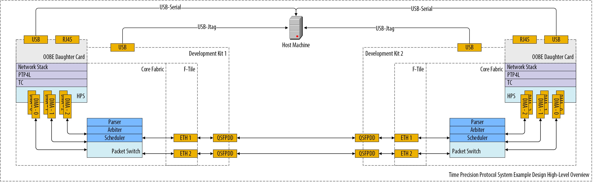

**Figure 1.** Precision Time Protocol System Example Design hardware setup

### Glossary

| _Acronym_ | _Full Form_                        |
|-----------|------------------------------------|
| PTP       | Precision Time Protocol            |
| ANLT      | Auto Negotiation and Link Training |
| SED       | System Example Design              |
| ToD       | Time of Day                        |
| mSGDMA    | Modular Scatter-Gather DMA         |
| QoS       | Quality of Service                 |
| AVST      | Avalon Streaming                   |
| AXI       | Advanced eXtensible Interface      |
| CDC       | Clock Domain Crossing              |
| ETS       | Egress Timestamp                   |
| ITS       | Ingress Timestamp                  |
| TS        | Timestamp                          |
| FP        | Fingerprint                        |
| NVM       | Non Volatile Memory                |
| GHRD      | Golden Hardware Reference Design   |
| GSRD      | Golden Software Reference Design   |
| GbE       | Gigabit Ethernet                   |

### Prerequisites

This system example design builds upon the [Golden System Reference Design (GSRD) for the Agilex&trade; 7 I-Series Transceiver-SoC Development Kit (4x F-Tile)](https://altera-fpga.github.io/rel-24.3/embedded-designs/agilex-7/i-series/soc/gsrd/ug-gsrd-agx7i-soc/). It is recommended to familiarize yourself with the GSRD development flow before proceeding with this document.

The following items are required to fully exercise the SED:

- Agilex&trade; I-Series Transceiver-SoC Development Kit (4x F-Tile) ([DK-SI-AGI027FC](https://www.altera.com/products/devkit/po-3013/agilex-7-fpga-i-series-transceiver-soc-development-kit-4x-f-tile)) x 2.
  - HPS IO48 OOBE daughter card x 2.
  - Micro USB cable for serial output x 2.
  - USB Type B cable for on-board FPGA Download Cable II x 2.
  - Micro SD card (4GB or greater) x 2.
  - Mini USB cable for OOBE daughter card serial port x 2.
  - QSFP Cable x2. 
    - 10G and 25G designs tested with:
      - FS (Q28-PC01) - 1m (3ft)  100G QSFP28 Passive Direct Attach Copper Twinax Cable
      - FS (Q28-PC05) - 3m (10ft) 100G QSFP28 Passive Direct Attach Copper Twinax Cable
    - 50G and 100G designs tested with:
      - FS (Q56-PC02) - 2m (7ft) 200G QSFP56 Passive Direct Attach Copper Twinax Cable
      - Amphenol (NDYYYH-0002) - 2m 400G QSFPDD Direct Attach Copper Twinax Cable
- Host PC with:
  - OS Ubuntu 22.04 LTS. System example design source files were compiled using Ubuntu 22.04 LTS. Other versions and distributions may also be compatible.
  - Serial terminal software (e.g., Minicom on Linux, Tera Term or PuTTY on Windows) is required.
  - Micro SD card slot or Micro SD card writer/reader
  - Altera Quartus Prime Pro 26.1

U-Boot and Linux compilation, Yocto build, and SD card image creation require a Linux host PC. All other operations can be performed on either Windows or Linux.

## Release Contents

### Binaries

Release notes and pre-built binaries are available under the [GitHub repository release](https://github.com/altera-fpga/agilex7-ed-ptp/releases/tag/SED-PTP-agilex7_dk_si_agi027fc-Q25.3.1-Rel-1.1).

| _File_                                        | _Description_                                                   |
|-----------------------------------------------|-----------------------------------------------------------------|
| 10g.zip                                       | Pre-compiled binaries for 10G non-ANLT configuration.           |
| 10g_anlt.zip                                  | Pre-compiled binaries for 10G with ANLT configuration.          |
| 25g.zip                                       | Pre-compiled binaries for 25G non-ANLT configuration.           |
| 25g_anlt.zip                                  | Pre-compiled binaries for 25G with ANLT configuration.          |
| 50g.zip                                       | Pre-compiled binaries for 50G non-ANLT configuration.           |
| 50g_anlt.zip                                  | Pre-compiled binaries for 50G with ANLT configuration.          |
| 100g.zip                                      | Pre-compiled binaries for 100G non-ANLT configuration.          |
| 100g_anlt.zip                                 | Pre-compiled binaries for 100G with ANLT configuration.         |
| max10_system_0002aa4F.pof                     | MAX10 custom bitstream for SED                                  |
| Source code (zip)                             | System example design source files provided as a ZIP archive    |
| Source code (tar.gz)                          | System example design source files provided as a TAR GZ archive |

### Sources

| _Component_                               | _Location_                                                                                                                                                                          | _Branch_                         | _Commit ID/Tag_                                |
|-------------------------------------------|-------------------------------------------------------------------------------------------------------------------------------------------------------------------------------------|----------------------------------|------------------------------------------------|
| **Hardware Design**                       | [https://github.com/altera-fpga/agilex7-ed-ptp.git](https://github.com/altera-fpga/agilex7-ed-ptp.git)                                                                              | rel/25.3.1                       | SED-PTP-agilex7_dk_si_agi027fc-Q25.3.1-Rel-1.1 |
| **Linux**                                 | [https://github.com/altera-fpga/linux-socfpga](https://github.com/altera-fpga/linux-socfpga)                                                                                        | socfpga-6.12.19-lts-ethernet-sed | SED-PTP-agilex7_dk_si_agi027fc-Q25.3.1-Rel-1.1 |
| **Arm Trusted Firmware**                  | [https://github.com/altera-fpga/arm-trusted-firmware](https://github.com/altera-fpga/arm-trusted-firmware)                                                                          | socfpga_v2.13.0                  | 116f2f97fa533e3540be97a2d9ec828f2a2b68aa       |
| **U-Boot**                                | [https://github.com/altera-fpga/u-boot-socfpga](https://github.com/altera-fpga/u-boot-socfpga)                                                                                      | socfpga_v2025.07                 | e5f40a8ed1ec65f20c4e2491bfe8e738efce6d94       |
| **Yocto Project: poky**                   | [https://git.yoctoproject.org/poky/](https://git.yoctoproject.org/poky/)                                                                                                            | scarthgap                        | d1c25a3ce446a23e453e40ac2ba8f22b0e7ccefd       |
| **Yocto Project: meta-intel-fpga**        | [https://git.yoctoproject.org/meta-intel-fpga/](https://git.yoctoproject.org/meta-intel-fpga/)                                                                                      | scarthgap                        | 9714ae1ef8f22302bac60b7d2081bbdf3199ca70       |
| **Yocto Project: meta-intel-fpga-refdes** | [https://github.com/altera-fpga/meta-intel-fpga-refdes/](https://github.com/altera-fpga/meta-intel-fpga-refdes/)                                                                    | scarthgap                        | bffc5bc012f1653beb58878b54b44e74b0f27404       |
| **Yocto Project: meta-agilex7-sed**       | [https://github.com/altera-fpga/agilex7-ed-ptp/tree/rel/25.3.1/...](https://github.com/altera-fpga/agilex7-ed-ptp/tree/rel/25.3.1/agi027fc-si-devkit/src/sw/yocto/meta-agilex7-sed) | rel/25.3.1                       | SED-PTP-agilex7_dk_si_agi027fc-Q25.3.1-Rel-1.1 |
| **Design Build Script: gsrd-socfpga**     | [https://github.com/altera-fpga/agilex7-ed-ptp/tree/rel/25.3.1/...](https://github.com/altera-fpga/agilex7-ed-ptp/tree/rel/25.3.1/agi027fc-si-devkit/src/sw/yocto/build.sh)         | rel/25.3.1                       | SED-PTP-agilex7_dk_si_agi027fc-Q25.3.1-Rel-1.1 |

## Release Notes

[Precision Time Protocol System Example Design Release Notes](https://github.com/altera-fpga/agilex7-ed-ptp/releases/tag/SED-PTP-agilex7_dk_si_agi027fc-Q25.3.1-Rel-1.1).

## Precision Time Protocol System Example Design Architecture

### Hardware Architecture

Figure 2 illustrates the high-level architecture of the system example design. The main components include:

- HPS Subsystem
- DMA Subsystem
- Packet Switch Subsystem (Also referred to as the PTP Bridge Subsystem)
- Ethernet Subsystem (two instances)
- Main Time Of Day Subsystem
- Subordinate Time Of Day Subsystem
- Ethernet Packet Generators

=== "10 GbE"
    

=== "25 GbE"
    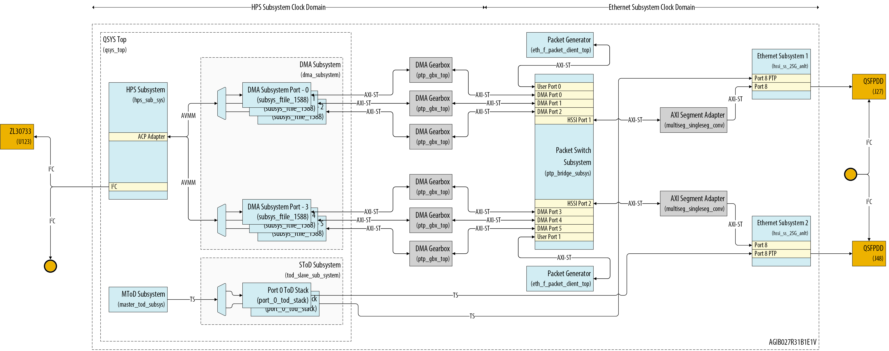

=== "50 GbE"
    

=== "100 GbE"
    

**Figure 2.** Precision Time Protocol SED High Level Hardware Architecture

#### HPS Subsystem

The HPS Subsystem, built around the Agilex&trade; 7 Hard Processor System (HPS) and supporting logic, manages PTP synchronization and handles Time of Day (ToD) adjustments. It also provides access to status and control registers for other system components.

The subsystem communicates with onboard components via its peripherals, using an I2C bus to monitor and configure both QSFP modules. It also controls the Microchip [Microchip ZL30733 PTP & SyncE Network Synchronizer](https://www.microchip.com/en-us/product/zl30733) over the same bus, performing phase and frequency adjustments to maintain system-wide timing accuracy.

#### Ethernet Subsystem (two instances)

These modules instantiate an Ethernet Subsystem FPGA IP. Refer to its [user guide](https://docs.altera.com/r/docs/773413/current) for details.

#### DMA Subsystem

The DMA Subsystem uses mSGDMA engines to transfer data between the HPS and the Ethernet Subsystem. It includes six DMA Ports, each with two Channels for transmit (TX) and receive (RX) traffic. These channels natively handle PTP timestamps and fingerprints.

The subsystem groups DMA Ports into sets of three, assigning each group to one Ethernet port in the Ethernet Subsystem. It also translates protocols between Avalon® Streaming (AVST) and AXI-Stream (AXI-ST) interfaces, and performs clock domain crossing between the HPS Subsystem and Ethernet Subsystem clock domains. Figure 3 shows a high level architecture diagram of one of the DMA Subsystem ports.

=== "10 GbE"
    

=== "25 GbE"
    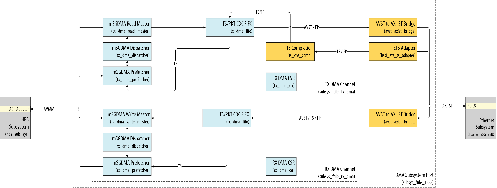

=== "50 GbE"
    

=== "100 GbE"
    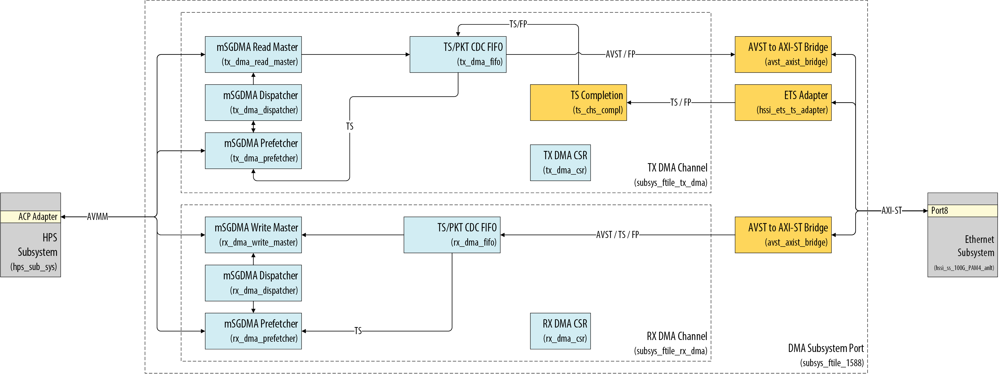

**Figure 3.** DMA Subsystem Port High Level Architecture

#### Packet Switch Subsystem

The Packet Switch Subsystem implements an L2–L4 Ethernet packet switch that arbitrates among four client interfaces per port, connecting three DMA engines and a traffic generator to the transmit path. On the receive path, packet routing between ports and clients is handled by a [Ternary Content-Addressable Memory (TCAM)](https://docs.altera.com/r/docs/789389/24.1/agilextm-7-f-series-and-i-series-fpga-memory-subsystem-ip-user-guide/memory-subsystem-tcam), with rules dynamically configurable via software. By default, packets without a TCAM match are dropped for security reasons. For matched entries, the Packet Switch subsystem routes packets to either a DMA Port or a User Port (Traffic Generator).

The TX datapath arbitration ignores Ethernet packet type and uses a weighted priority round-robin scheme to manage requests from DMA and User Port. Figure 4 illustrates the high-level architecture of the Packet Switch transmitter path. On the transmit path, the Ethernet Subsystem returns the egress timestamp (ETS) for each packet along with its corresponding fingerprint for tracking.
 
The RX datapath does not implement priority-based arbitration. Instead, traffic priority to the HPS is software-defined, with each DMA Port represented as a queue and assigned a configurable priority level. Figure 5 illustrates the high-level architecture of the Packet Switch receiver path.

=== "10 GbE"
    

=== "25 GbE"
    

=== "50 GbE"
    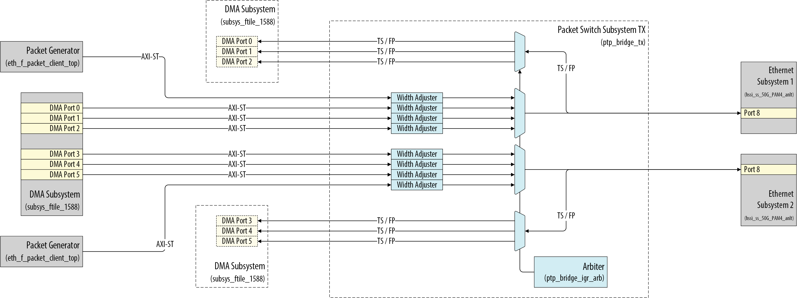

=== "100 GbE"
    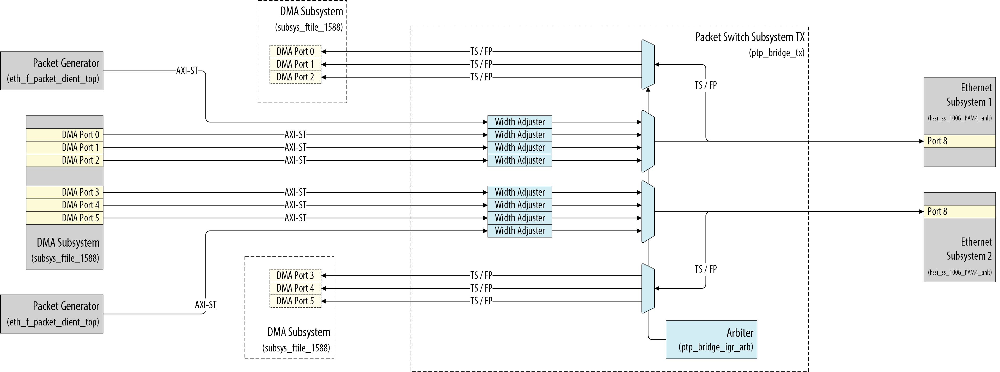

**Figure 4.** Packet Switch Subsystem TX Datapath High Level Architecture

=== "10 GbE"
    

=== "25 GbE"
    

=== "50 GbE"
    

=== "100 GbE"
    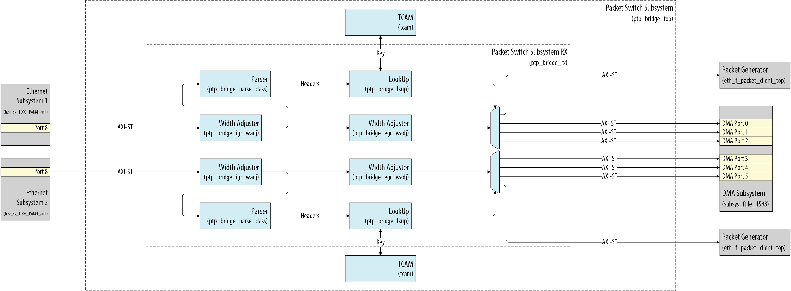

**Figure 5.** Packet Switch Subsystem RX Datapath High Level Architecture

##### TCAM Data Structure

The TCAM supports lookups using Ethernet frame headers, protocol headers, and IEEE 1588-specific fields.

The table below lists the 492-bit TCAM key fields. If a packet lacks a corresponding header field, the key field is set to 0. Otherwise, the Packet Switch parser populates the field with extracted data. Unused bits from shorter headers are also zeroed.

| _Field_     | _Width (bits)_ | _Description_                                                                                                                                                                                                                                                    |
|-------------|:--------------:|------------------------------------------------------------------------------------------------------------------------------------------------------------------------------------------------------------------------------------------------------------------|
| rsvd        |       32       | Reserved.                                                                                                                                                                                                                                                        |
| flagField   |       16       | flagField field in PTP header.                                                                                                                                                                                                                                   |
| messageType |       4        | messageType field in PTP header.                                                                                                                                                                                                                                 |
| ip_protocol |       8        | IP header protocol field, defined as Protocol in IPv4 or next_header in IPv6.                                                                                                                                                                                    |
| ethtype     |       16       | Ethernet header ethtype                                                                                                                                                                                                                                          |
|             |                | **dot2q**: (eth.{da,sa}) / (vlana.{tpid,tci}) / (vlanb.{tpid,tci}) / ethtype <br> **dot1q**: (eth.{da,sa}) / (vlana.{tpid,tci}) / ethtype <br> **eth**:   (eth.{da,sa,ethtype})  <br> - ethtype = ethtype                                                        |
| tci_vlana   |       16       | TCI field for VLAN A in IEEE 802.1Q frames                                                                                                                                                                                                                       |
|             |                | **dot2q**: (eth.{da,sa}) / (vlana.{tpid,tci}) / (vlanb.{tpid,tci}) / ethtype <br> - tci_vlana = vlana.tci <br> **dot1q**: (eth.{da,sa}) / (vlana.{tpid,tci}) / ethtype <br> - tci_vlana = vlana.tci <br> **eth**:   (eth.{da,sa,ethtype}) <br> - tci_vlana = '0  |                                                                                                                                                               |
| tci_vlanb   |       16       | TCI field for VLAN B in IEEE 802.1Q frames                                                                                                                                                                                                                       |
|             |                | **dot2q**: (eth.{da,sa}) / (vlana.{tpid,tci}) / (vlanb.{tpid,tci}) / ethtype <br> - tci_vlanb = vlanb.tci <br> **dot1q**: (eth.{da,sa}) / (vlana.{tpid,tci}) / ethtype <br> - tci_vlanb = '0 <br> **eth**:   (eth.{da,sa,ethtype}) <br> - tci_vlanb = '0         |                                                                                                                                                               |
| l4_src_port |       16       | L4 header source port.                                                                                                                                                                                                                                           |
|             |                | - l4_src_port = udp.sport <br> - l4_src_port = tcp.sport                                                                                                                                                                                                         |
| l4_dst_port |       16       | L4 header destination port.                                                                                                                                                                                                                                      |
|             |                | - l4_dst_port = udp.dport <br> - l4_dst_port = tcp.dport                                                                                                                                                                                                         |
| src_ip      |      128       | L3 source address field.                                                                                                                                                                                                                                         |
|             |                | **IPv4**: <br> - src_ip[31:0] = ipv4.src_ip, src_ip[127:32] = '0 <br> **IPv6**: <br> - src_ip[127:0] = ipv6.src_ip                                                                                                                                               |
| dst_ip      |      128       | L3 destination address field.                                                                                                                                                                                                                                    |
|             |                | **IPv4**: <br> - dst_ip[31:0] = ipv4.dst_ip, dst_ip[127:32] = '0 <br> **IPv6**: <br> - dst_ip[127:0] = ipv6.dst_ip                                                                                                                                               |
| src_mac     |       48       | Ethernet header source MAC address. <br>                                                                                                                                                                                                                         |
|             |                | - src_mac = eth.sa                                                                                                                                                                                                                                               |
| dst_mac     |       48       | Ethernet header destination MAC address.                                                                                                                                                                                                                         |
|             |                | - dst_mac = eth.da                                                                                                                                                                                                                                               |

**Table 1.** TCAM Key Fields

The Linux [`packetswitch`](#packetswitch) user application provides access to the TCAM key registers from the OS, removing the complexity of doing low level access to the Packet Switch IP.

The table below defines the structure of a TCAM query result. This data is used to route in-transit packets to the destination port specified by the matching TCAM rule.

| _Field_  | _Width (bits)_ | _Description_                                                                                                                                                                                         |
|----------|:--------------:|-------------------------------------------------------------------------------------------------------------------------------------------------------------------------------------------------------|
| rsvd     |       27       | Reserved.                                                                                                                                                                                             |
| drop     |       1        | Drop packet.                                                                                                                                                                                          |
| egr_port |       4        | Selects which egress port to send traffic. <br> 4’d0: MSGDMA Channel 0 <br> 4’d1: MSGDMA Channel 1 <br> 4’d2: MSGDMA Channel 2 <br> 4’d3 – 4’d7: reserved <br> 4’d8: User <br> 4’d8 – 4’d15: reserved |

**Table 2.** TCAM Query Result Fields

#### Main Time Of Day Subsystem & Subordinate Time Of Day Subsystem

The Main ToD Subsystem wraps the [Time of Day Clock FPGA IP](https://docs.altera.com/r/docs/683044/25.1/ethernet-design-example-components-user-guide/time-of-day-clock) and its support logic, serving as the system’s local ToD reference. The IP is configured for Accuracy Advanced mode and uses the IOPLL Reconfig FPGA IP, as described in the [IOPLL and TOD Setup using IOPLL Reconfig IP](https://docs.altera.com/r/docs/683044/25.1/ethernet-design-example-components-user-guide/iopll-and-tod-setup-using-iopll-reconfig-ip) chapter of the Ethernet Design Example Components User Guide.

The Subordinate ToD Subsystem instantiates a dedicated Time of Day Clock FPGA IP per Ethernet interface and integrates an [Time of Day Synchronizer FPGA IP](https://docs.altera.com/r/docs/683044/25.1/ethernet-design-example-components-user-guide/time-of-day-synchronizer) to present timestamps in the Ethernet clock domain, as described in the [PTP Timestamp Accuracy in Advanced Mode](https://docs.altera.com/r/docs/683023/25.1.1/f-tile-ethernet-hard-ip-user-guide/ptp-timestamp-accuracy) chapter of the F-Tile Ethernet Hard IP User Guide.

#### Ethernet Packet Generators

Two system blocks can generate Ethernet packets. The HPS produces PTP packets when the ptp4l service is enabled and can optionally generate synthetic traffic via ping or iperf3. Additionally, two hardware traffic generators can saturate Ethernet bandwidth with synthetic traffic when enabled by HPS software.

#### SED Custom IP

| _Block_                  | _Entity Name_                       | _Description_                                                                                                                                                                                                                                                                                           |
|--------------------------|-------------------------------------|---------------------------------------------------------------------------------------------------------------------------------------------------------------------------------------------------------------------------------------------------------------------------------------------------------|
| AVST to AXI Bridge       | avst_axist_bridge                   | AVST to AXI bridge facilitating data transfer between the DMA channels and the Ethernet Subsystem. The bridge operates bidirectionally, providing AXI to AVST translation for data flowing from the Ethernet Subsystem to the DMA channels. It is a single block servicing both TX and RX DMA channels. |
| TX DMA Fifo              | tx_dma_fifo                         | Top-level wrapper for custom blocks in the TX DMA Datapath.                                                                                                                                                                                                                                             |
| TX ETS Adapter           | hssi_ets_ts_adapter                 | Adapts the egress timestamp and fingerprint from the Ethernet Subsystem to a format manageable by the TX DMA channel.                                                                                                                                                                                   |
| TX DMA PKT FIFO          | cdc_packet_fifo                     | Dual clock FIFO for clock domain crossing of packet information from the DMA channel to the Ethernet Subsystem.                                                                                                                                                                                         |
| TX FP Generator          | tx_dma_fifo                         | Sequential fingerprint generator. A fingerprint will be generated for all packet going out of the system. This is combinational logic inside the 'tx_dma_fifo' module.                                                                                                                                  |
| TX TS Valid              | tx_dma_fifo                         | Logic that inserts egress timestamps into the MSGDMA prefetcher. This is combinational logic inside the 'tx_dma_fifo' module.                                                                                                                                                                           |
| TX TS/FP FIFO            | fp_resp_fifo/ts_fifo                | Two independent FIFOs to store the returned egress timestamp and its corresponding fingerprint.                                                                                                                                                                                                         |
| TX Completion            | ts_chs_compl                        | Timestamp completion follow-up module. Captures FP and TS from the HSSI subsystem and forwards them to the TX DMA FIFO module if they are valid.                                                                                                                                                        |
| FP Compare               | ts_chs_compl                        | Combinational logic that tracks fingerprints returned by the HSSI Subsystem to validate and return the associated egress timestamp.                                                                                                                                                                     |
| TX TS FIFO               | ts_fifo                             | FIFO to store the returned egress timestamp.                                                                                                                                                                                                                                                            |
| RX DMA Fifo              | rx_dma_fifo                         | Top-level wrapper for custom blocks in the RX DMA Datapath.                                                                                                                                                                                                                                             |
| RX TS Valid              | rx_dma_fifo                         | Logic that inserts ingress timestamps into the MSGDMA prefetcher. This is combinational logic inside the 'rx_dma_fifo' module.                                                                                                                                                                          |
| RX DMA PKT FIFO          | cdc_packet_fifo                     | Dual clock FIFO for clock domain crossing of packet information from the Ethernet Subsystem to the DMA channel.                                                                                                                                                                                         |
| RX TS FIFO               | ts_fifo                             | Single clock FIFO to store ingress timestamps from the Ethernet Subsystem.                                                                                                                                                                                                                              |
| Main ToD                 | eth_f_mtod_top                      | Wrapper for the Ethernet IEEE 1588 Time of Day Clock FPGA IP. Includes a state machine that flags when the Main ToD Subsystem output is valid for the ToD Subordinate Subsystem to consume.                                                                                                             |
| Packet Generator         | eth_f_packet_client_top             | Generic Ethernet packet generator/checker. Packet generation parameters are configurable at runtime via software.                                                                                                                                                                                       |
| Packet Generator Adaptor | eth_f_packet_client_top_axi_adaptor | Provides translation services between AVST and AXI-ST for the system Packet Generators.                                                                                                                                                                                                                 |
| Packet Switch            | ptp_bridge_subsys                   | Top level wrapper for TCAM, arbitration and routing logic to handle the system TX/RX data path                                                                                                                                                                                                          |
| AXI Segment Adapter      | multiseg_singleseg_conv             | [AXI-ST Multi-Segment to Single-Segment](https://docs.altera.com/r/docs/767516/23.4/macsec-system-design-user-guide/axi-st-multi-segment-to-single-segment-conversion) conversion when the Ethernet Subsystem IP is configured for data rates higher than 50GbE                                                 |
| DMA Gearbox              | ptp_gbx_top                         | Gearbox to align data width between Packet Switch module and the 64 bit wide DMA Subsystem data path. Required when the Ethernet Subsystem IP is configured for data rates higher than 50GbE                                                                                                            |

### Board Level Clocking Architecture

At the board level, the system clocking architecture includes the following components:

- Microchip ZL30733 PTP & SyncE Network Synchronizer (U123)
- Oven Controlled Crystal Oscillator (OCXO) (X2)
- Agilex&trade; 7 AGIB027R31B (U1)
- Si5332 Low-Jitter Clock Generator (U19)
- Si5391-B Low-Jitter Clock Generator (U45)

=== "10 GbE"
    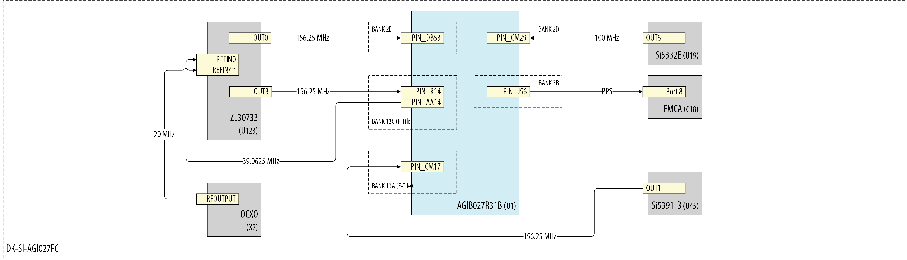

=== "25 GbE"
    

=== "50 GbE"
    

=== "100 GbE"
    

**Figure 6.** Board High Level Clocking Architecture

On power-up, the Microchip ZL30733 PTP & SyncE Network Synchronizer loads its configuration profile from internal non-volatile memory (NVM). The default profile doesn't contain the correct configuration needed for the system example design components. At boot time, the HPS establishes access to the ZL30733 via I2C and proceeds to load the correct profile for the system.

To enable HPS access to the onboard Microchip ZL30733, a custom bitstream must be loaded into the MAX10 device on the development kit. The required bitstream file, `max10_system_0002aa4F.pof`, is available in the [Binaries](#binaries) section.

### FPGA Design Clocking Architecture

The clock frequencies for the Ethernet Subsystem IP ports `i_p8_clk_tx_tod`, `i_p8_clk_rx_tod`,  and `i_p8_clk_ptp_sample` follow the guidelines in the [Ethernet Subsystem FPGA IP User Guide](https://docs.altera.com/r/docs/773413/24.3.1/ethernet-subsystem-ip-user-guide/clocks).

Figure 7 shows the high-level system clock distribution tree. For clarity, only a single Ethernet Subsystem instance and one DMA Subsystem port are shown. All DMA ports share the same clock connections.

=== "10 GbE"
    

=== "25 GbE"
    

=== "50 GbE"
    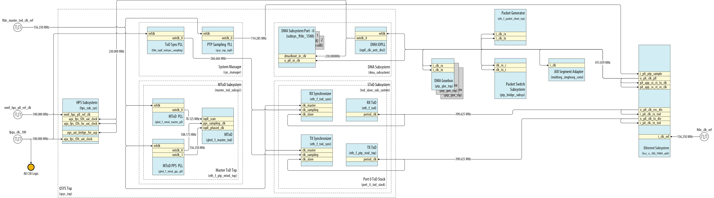

=== "100 GbE"
    

**Figure 7.** FPGA High Level Clocking Architecture Reduced Diagram

### Software Architecture

The system example design uses a [HPS-first](https://docs.altera.com/r/docs/683389/24.3/agilextm-7-soc-fpga-boot-user-guide/boot-flow-overview) boot flow, where the HPS initializes before configuring the FPGA fabric. U-Boot is loaded from SPI flash or via a partial RBF. The [second-stage boot loader](https://docs.altera.com/r/docs/683389/24.3/agilextm-7-soc-fpga-boot-user-guide/second-stage-bootloader?tocId=kgkQ1%7EjXPRwg_5yfZcC6EA) loads the Linux kernel and full FPGA bitstream from the SD card. U-Boot enables the HPS bridges and programs the FPGA via the SDM. Once configured, the HPS boots Linux.

The design includes drivers and user-space tools for the Linux network stack, PTP stack, and QoS via Traffic Control (TC). Ethernet Subsystem IP drivers support standard tools like `ethtool`. Drivers for the IEEE 1588 TOD Clock IP, Microchip ZL30733 synchronizer, and DMA ports interface are also provided.

Egress QoS is managed by the Linux kernel’s Traffic Control (TC) system. The Ethernet driver uses device tree data to enumerate DMA channels for each physical port. For each channel, it registers a TX buffer ring and exposes it as a separate hardware queue. TC applies queue disciplines (`qdiscs`) to control packet enqueue/dequeue behavior per queue. The driver integrates with TC to enable per-queue priority and flow control.

For each DMA ingress channel, the Ethernet driver registers an RX buffer. Ingress QoS is controlled by the Packet Switch IP and the `packetswitch` application, which defines filtering and routing rules. Packets matching a rule are directed to a specific DMA RX channel, queue, or User Port; unmatched packets are dropped by default.

The HPS polls RX queues based on interrupt priority, with higher-priority channels mapped to higher-priority interrupts.

#### Altera Agilex&trade; 7 SoC FPGA F-Tile Drivers

| _Driver_              | _Description_                                                                                                                                                                                                                                       | _File_                                                     |
|-----------------------|-----------------------------------------------------------------------------------------------------------------------------------------------------------------------------------------------------------------------------------------------------|------------------------------------------------------------|
| Ethernet Driver       | The Ethernet driver exposes a standard `netdev` API to the kernel, enabling DMA channel discovery, hardware Time-of-Day (ToD) access, and `ethtool` enabling                                                                                        | `drivers/net/ethernet/altera/intel_fpga_eth_main.c`        |
| ToD Driver            | Provides access to the Ethernet Subsystem IP configuration and status registers of the Ethernet IEEE 1588 Time of Day Clock FPGA IP.                                                                                                                | `drivers/net/ethernet/altera/intel_fpga_tod.c`             |
| HSSI Subsystem Driver | Provides access to the Ethernet Subsystem IP configuration and status registers, as well as the [Subsystem Abstraction Layer (SAL)](https://docs.altera.com/r/docs/773413/24.3.1/ethernet-subsystem-ip-user-guide/subsystem-abstraction-layer-sal). | `drivers/net/ethernet/altera/intel_fpga_hssiss.c`          |
| QSFP Driver           | The QSFP driver interfaces with the onboard QSFP module, handling configuration registers reads and controlling power and interrupt pins.                                                                                                           | `drivers/net/phy/qsfp.c`                                   |
| ZL30733 Driver        | The ZL30733 driver enables frequency steering for Time-of-Day (ToD) adjustment via the onboard ZL30733 SyncE & IEEE 1588 Network Synchronizer.                                                                                                      | `drivers/net/ethernet/altera/intel_freq_control_zl30793.c` |

#### User Space Applications

##### ptp4l

`ptp4l` is the IEEE 1588 PTP software implementation from the [The Linux PTP Project](https://linuxptp.sourceforge.net), included in the HPS image. It offers extensive configuration options for system setup. Refer to the [`ptp4l` man page](https://manpages.ubuntu.com/manpages/xenial/man8/ptp4l.8.html) for details

##### phc2sys

`phc2sys` is an open-source utility that synchronizes system clocks, typically aligning the system clock with a PTP Hardware Clock (PHC) managed by `ptp4l`. For configuration details, refer to the [`phc2sys` man page](https://manpages.ubuntu.com/manpages/xenial/man8/phc2sys.8.html).

##### ethtool

`ethtool` is an open-source utility for querying and configuring network driver and hardware settings. For usage details, refer to the [`ethtool` man page](https://manpages.ubuntu.com/manpages/jammy/man8/ethtool.8.html).

##### packetgenerator

This application configures the Packet Generator IP core in the FPGA to generate synthetic Ethernet traffic for validating data path integrity and line rates. It can also modulate bandwidth to test system QoS policies.

Packet generation is customizable via parameters such as:

- Source and destination MAC addresses
- Frame sizes
- Idle packet gaps

**Syntax**

``` bash
packetgenerator [--device] [/dev/uioX] [options]
```

**Parameters**

- `--help`: Print this help contents
- `--device`: `UIO` device name
- `--dump`: Dump all register contents
- `--register-offset offset`: 32-bit aligned register offset to do direct register read/write
- `--register-value value`: 32-bit value to be written to the register
- `--dest-mac`: Destination MAC address in the packet
- `--src-mac`: Source MAC address in the packet
- `--traffic bool`: Enable or disable traffic
- `--one-shot bool`: Enable or disable one-shot mode
- `--soft-reset`: Trigger a soft reset
- `--packet-checker bool`: Enable or disable packet checker
- `--cntr-snapshot bool`: Take a counter snapshot
- `--cntr-clear bool`: Clear all counter CSRs
- `--cntr-internal-clear bool`: Clear all internal counters
- `--fixed-gap bool`: Enable or disable fixed gap between packets
- `--pkt-len-mode value`: Set packet generation length mode (Fixed/Incremental) [1,2]
- `--num-idle-cycles value`: Number of idle cycles to insert [0...255]
- `--tx-pkt-size value`: TX packet size [64...9216]
- `--tx-max-pkt-size value`: Maximum TX packet size [64...9216]
- `--num-packets value`: Number of packets to generate [0...0xFFFFFFFF]

System example design packet generators are mapped to `/dev/uio0` and `/dev/uio1`.

**Basic Usage**

_Synthetic Traffic Configuration_ – The command below sets up the packet generator with parameters including fixed gap, packet length mode, idle cycles, packet checker, one-shot mode, and packet sizes before initiating traffic generation.

``` bash
packetgenerator --device /dev/uio0 --traffic false --fixed-gap true --pkt-len-mode 0x01 --num-idle-cycles 22 --packet-checker true --one-shot false --tx-pkt-size 1024 --tx-max-pkt-size 1024
```

_Start Packet Generator_ – The command below initiates traffic generation based on the current configuration parameters.

``` bash
packetgenerator --device /dev/uio0 --traffic 1
```

_Configuration and Status Report_ – The command below captures a snapshot of all internal configuration and status registers in the packet generator hardware.

``` bash
packetgenerator --device /dev/uio0 --dump
```

##### packetswitch

The `packetswitch` application configures the hardware Packet Switch IP, which routes incoming packets to one of three DMA channels per Ethernet interface based on user-defined QoS rules. Packets that do not match any rule are dropped by default.

Rule priority is determined by index number, higher index means higher priority. If multiple rules match, the rule with the highest index is applied. To ensure correct behavior, generic rules should be programmed first, followed by more specific rules at higher indices.

A maximum of 32 keys can be programmed (0-31).

**Syntax**

``` bash
packetswitch [--device] [/dev/uioX] [Options]
```

**Parameters**

- `--help`: Print this help contents
- `--device`: *UIO device name
- `--dump`: Dump all register contents
- `--set-key`: Set Key. Requires Key fields to be provided
- `--remove-key`: Remove Key using key-index
- `--flush-all-keys`: Flush all Key entries from the system
- `--flush-all-counters`: Flush all debug counters value to 0
- `--show-key`: Search for Keys fulfilling a search criteria for a port
- `--register-rw`: Do a direct register read write
- `--key-index`: Key index to work on
- `--dest-mac`: Key - Destination MAC. ```packetswitch``` can resolve MAC addresses from Ethernet interface names, e.g. eth1.
- `--src-mac`: Key - Source MAC. ```packetswitch``` can resolve MAC addresses from Ethernet interface names, e.g. eth1.
- `--dest-ip`: Key - Destination IP Address
- `--src-ip`: Key - Source IP address
- `--dest-port`: Key - Destination L4 port
- `--src-port`: Key - Source L4 port
- `--vlanb`: Key - VLANB
- `--vlana`: Key - VLANA
- `--ethtype`: Key - Ethernet type
- `--protocol`: Key - IP Protocol type
- `--message`: Key - IP Message type
- `--flag`: Key - Flag field
- `--result`: Defines the DMA or user port to which the Ethernet packet will be routed if the rule evaluation is true. The mapping for this parameter is as follows:
  - 0x0: route packet to DMA-0
  - 0x1: route packet to DMA-1
  - 0x2: route packet to DMA-2
  - 0x8: route packet to User Port (Packet Generator)
- `port`: Ethernet interface to which the rule will apply.
  - 0: Apply rule to ```eth1``` Ethernet interface
  - 1: Apply rule to ```eth2``` Ethernet interface
- `register-offset`: Register offset to read/write to. Refer to the [PTP Bridge Register Map](#ptp-bridge-register-map) for direct registers base address and offsets.
- `register-value`: Register value to write. Can be comma separated to write multiple values.
- `length`: Number of registers to read
- `mask`: Set Mask properties for fields manually

System example design Packet Switch is mapped to `/dev/uio2`.

**Basic Usage**

_Route all incoming traffic to DMA 0_

```bash
packetswitch --port 0 --set-key --key-index 0 --result 0x0
```

- `--port 0`: This rule applies to Ethernet interface ```eth1```.
- `--key-index 0`: This rule is stored in key index 0, setting the lowest priority for the rule.
- `--result 0x0`: Packets fulfilling the rule will be routed to DMA-0.

The above command defines the following rule:

_Route traffic based on destination MAC address_

``` bash
packetswitch --port 0 --set-key --key-index 0 --dest-mac "eth1" --result 0x2
```

The above command defines the following rule:

- `--port 0`: This rule applies to Ethernet interface ```eth1```.
- `--key-index 0`: This rule is stored in key index 0, setting the lowest priority for the rule.
- `--dest-mac "eth1"`: This is the filter established by the rule. The rule will return a hit if the evaluated Ethernet frame has the ```eth1``` interface MAC address in the MAC address destination field.
- `--result 0x2`: Packets fulfilling the rule will be routed to DMA-2.

_Route traffic based on VLAN and DF flag_

``` bash
packetswitch --port 0 --set-key --key-index 2 --ethtype 0x0800 --protocol 0x01 --vlana 100 --vlanb 200 --flag 0x2 --result 0x2
```

The above command defines the following rule:

- `--port 0`: This rule applies to Ethernet interface eth1.
- `--key-index 2`: This rule is stored in key index 2.
- `--ethtype 0x0800`: Ethernet Type is set to IPv4.
- `--protocol 0x01`: The IP protocol is set to ICMP.
- `--vlana 100`: The primary VLAN ID is 100.
- `--vlanb 200`: The secondary VLAN ID is 200.
- `--flag 0x2`: The fragment flag is set to 0x2.
- `--result 0x2`: Packets fulfilling the rule will be routed to DMA-2.

### Address Map Details

#### Address Map

| _Subordinate Name_                         | _Component_            |      _Agilex&trade; HPS H2F AXI Manager_      | _Register Description_                                                                                             |
|--------------------------------------------|------------------------|:---------------------------------------------:|--------------------------------------------------------------------------------------------------------------------|
| axi4lite_hssi.s0                           | Ethernet Subsystem CSR |           0x0000_0000 - 0x03ff_ffff           | [Link](https://docs.altera.com/r/docs/773413/24.3.1/ethernet-subsystem-ip-user-guide/register-descriptions)        |
| axi4lite_hssi0.s0                          | Ethernet Subsystem CSR |           0x0400_0000 - 0x07ff_ffff           | [Link](https://docs.altera.com/r/docs/773413/24.3.1/ethernet-subsystem-ip-user-guide/register-descriptions)        |
| axi4lite_pktcli_0.s0                       | Generic Packet Client  |           0x0806_0000 - 0x0806_ffff           | [Link](#packet-client-register-description)                                                                        |
| axi4lite_pktcli_1.s0                       | Generic Packet Client  |           0x0807_0000 - 0x0807_ffff           | [Link](#packet-client-register-description)                                                                        |
| axi4lite_ptpb.s0                           | Packet Switch          |           0x0805_0000 - 0x0805_ffff           | [Link](#ptp-bridge-register-map)                                                                                   |
| axi4lite_qsfp_mem_cntrl.s0                 | QSFP Controller Module |           0x084d_0000 - 0x084d_0fff           | [Link](https://docs.altera.com/r/docs/683130/25.3/embedded-peripherals-ip-user-guide/register-description?tocId=cRZrH4uSmIYqojSpFYwOuA)    |
| ftile_debug_status_pio_0.s1                | F-Tile Status Register |           0x0804_0060 - 0x0804_006f           |                                                                                                                    |
| qsfpdd_status_pio.s1                       | QSFP-DD Status PIO     |           0x0804_0050 - 0x0804_005f           |                                                                                                                    |
| sys_ctrl_pio_0.s1                          | QSFP-DD Control PIO    |           0x0804_0040 - 0x0804_004f           |                                                                                                                    |
| dma_subsys.dma_subsys_port0_csr            | DMA Subsystem Port 0   |           0x0848_0000 - 0x0848_00ff           | [Link](#dma-subsystem-port-memory-map)                                                                             |
| dma_subsys.dma_subsys_port1_csr            | DMA Subsystem Port 1   |           0x084c_0000 - 0x084c_00ff           | [Link](#dma-subsystem-port-memory-map)                                                                             |
| dma_subsys.dma_subsys_port2_csr            | DMA Subsystem Port 2   |           0x0850_0000 - 0x0850_00ff           | [Link](#dma-subsystem-port-memory-map)                                                                             |
| dma_subsys.dma_subsys_port3_csr            | DMA Subsystem Port 3   |           0x0854_0000 - 0x0854_00ff           | [Link](#dma-subsystem-port-memory-map)                                                                             |
| dma_subsys.dma_subsys_port4_csr            | DMA Subsystem Port 4   |           0x0858_0000 - 0x0858_00ff           | [Link](#dma-subsystem-port-memory-map)                                                                             |
| dma_subsys.dma_subsys_port5_csr            | DMA Subsystem Port 5   |           0x085c_0000 - 0x085c_00ff           | [Link](#dma-subsystem-port-memory-map)                                                                             |
| hps_sub_sys.agilex_axi_bridge_for_acp_0.s0 | AXI ACP Bridge         | 0x0000_0000_0000_0000 - 0x0000_0003_ffff_ffff |                                                                                                                    |
| mtod_subsys.master_tod_top_0_csr           | Main ToD Subsystem     |           0x0804_0000 - 0x0804_003f           | [Link](#dma-subsystem-port-memory-map)                                                                             |
| mtod_subsys.mtod_subsys_pps_load_tod_0_csr | Main ToD PPS Loader    |           0x0804_0100 - 0x0804_01ff           |                                                                                                                    |
| sys_manager.sysid_control_slave            | System ID Peripheral   |           0x0004_1208 - 0x0004_120f           | [Link](https://docs.altera.com/r/docs/683130/25.3/embedded-peripherals-ip-user-guide/system-id-peripheral-core) |

**Table 3.** qsys_top Platform Designer system address map.

##### Packet Generator Register Description

Refer to section [Packet Client Register Map](https://docs.altera.com/r/docs/767516/23.4/macsec-system-design-user-guide/packet-client-register-map) from the MACsec FPGA System Design User Guide for the register description.

##### QSFPDD Status PIO Register description

| _Address_ | _Name_            | _Bit Offset_ | _Attribute_ | _Description_  |
|-----------|-------------------|:------------:|:-----------:|----------------|
| 0x0       | qsfpdd_status_pio | [0]          | RO          | QSFPDD modprsn |
| ^         | qsfpdd_status_pio | [1]          | RO          | QSFPDD intn    |
| 0x1 - 0xF | Reserved  |

**Table 4.** QSFPDD status PIO register description.

##### F-Tile Status Register Description

| _Bit_ | _Ethernet Subsystem Port_ | _Description_                                                                                                                                                                                                    |
|:-----:|:-------------------------:|------------------------------------------------------------------------------------------------------------------------------------------------------------------------------------------------------------------|
|   0   |          Port 8           | Ethernet Subsystem 1 'o_p8_tx_lanes_stable' signal. For more information consult the following [Link](https://docs.altera.com/r/docs/683023/25.1.1/f-tile-ethernet-hard-ip-user-guide/reset-signals)                 |
|   1   |             ^             | Ethernet Subsystem 1 'o_p8_tx_pll_locked' signal. For more information consult the following [Link](https://docs.altera.com/r/docs/683872/21.1/f-tile-architecture-and-pma-and-fec-direct-phy-ip-user-guide/status-signals-descriptions)     |
|   2   |             ^             | Ethernet Subsystem 1 'o_p8_rx_pcs_ready' signal. For more information consult the following [Link](https://docs.altera.com/r/docs/683023/25.1.1/f-tile-ethernet-hard-ip-user-guide/reset-signals)                    |
|   3   |             ^             | Ethernet Subsystem 1 'o_p8_tx_ptp_ready' signal. For more information consult the following [Link](https://docs.altera.com/r/docs/683023/25.1.1/f-tile-ethernet-hard-ip-user-guide/ptp-status-interface)             |
|   4   |             ^             | Ethernet Subsystem 1 'o_p8_rx_ptp_ready' signal. For more information consult the following [Link](https://docs.altera.com/r/docs/683023/25.1.1/f-tile-ethernet-hard-ip-user-guide/ptp-status-interface)             |
|   5   |             ^             | Ethernet Subsystem 1 'o_p8_rx_ptp_offset_data_valid' signal. For more information consult the following [Link](https://docs.altera.com/r/docs/683023/25.1.1/f-tile-ethernet-hard-ip-user-guide/ptp-status-interface) |
|   6   |             ^             | Ethernet Subsystem 1 'o_p8_tx_ptp_offset_data_valid' signal. For more information consult the following [Link](https://docs.altera.com/r/docs/683023/25.1.1/f-tile-ethernet-hard-ip-user-guide/ptp-status-interface) |
|  10   |          Port 8           | Ethernet Subsystem 2 'o_p8_tx_lanes_stable' signal. For more information consult the following [Link](https://docs.altera.com/r/docs/683023/25.1.1/f-tile-ethernet-hard-ip-user-guide/reset-signals)                 |
|  11   |             ^             | Ethernet Subsystem 2 'o_p8_tx_pll_locked' signal. For more information consult the following [Link](https://docs.altera.com/r/docs/683872/21.1/f-tile-architecture-and-pma-and-fec-direct-phy-ip-user-guide/status-signals-descriptions)     |
|  12   |             ^             | Ethernet Subsystem 2 'o_p8_rx_pcs_ready' signal. For more information consult the following [Link](https://docs.altera.com/r/docs/683023/25.1.1/f-tile-ethernet-hard-ip-user-guide/reset-signals)                    |
|  13   |             ^             | Ethernet Subsystem 2 'o_p8_tx_ptp_ready' signal. For more information consult the following [Link](https://docs.altera.com/r/docs/683023/25.1.1/f-tile-ethernet-hard-ip-user-guide/ptp-status-interface)             |
|  14   |             ^             | Ethernet Subsystem 2 'o_p8_rx_ptp_ready' signal. For more information consult the following [Link](https://docs.altera.com/r/docs/683023/25.1.1/f-tile-ethernet-hard-ip-user-guide/ptp-status-interface)             |
|  15   |             ^             | Ethernet Subsystem 2 'o_p8_rx_ptp_offset_data_valid' signal. For more information consult the following [Link](https://docs.altera.com/r/docs/683023/25.1.1/f-tile-ethernet-hard-ip-user-guide/ptp-status-interface) |
|  16   |             ^             | Ethernet Subsystem 2 'o_p8_tx_ptp_offset_data_valid' signal. For more information consult the following [Link](https://docs.altera.com/r/docs/683023/25.1.1/f-tile-ethernet-hard-ip-user-guide/ptp-status-interface) |

**Table 5.** F-Tile status register description.

##### DMA SubSystem Port Memory Map

| _Subordinate Name_     | _Component_    | _subsys_ftile_25gbe_1588_csr_ | _Register Description_                    |
|------------------------|----------------|:-----------------------------:|-------------------------------------------|
| ftile_25gbe_rx_dma_ch1 | RX DMA channel | 0x0080 - 0x00bf               | [Link](#dma-subsystem-channel-memory-map) |
| ftile_25gbe_tx_dma_ch1 | TX DMA channel | 0x0000 - 0x003f               | [Link](#dma-subsystem-channel-memory-map) |

**Table 6.** DMA Subsystem port memory map.

##### DMA SubSystem Channel Memory Map

| _Subordinate Name_     | _Component_    | _[rx/tx]_dma_csr_ | _Register Description_                                                                                       |
|------------------------|----------------|:-----------------:|--------------------------------------------------------------------------------------------------------------|
| [tx/rx]_dma_dispatcher | DMA dispatcher | 0x0020 - 0x003f   | [Link](https://docs.altera.com/r/docs/683130/25.3/embedded-peripherals-ip-user-guide/register-map-of-msgdma) |
| [tx/rx]_dma_prefetcher | DMA prefetcher | 0x0000 - 0x001f   | [Link](https://docs.altera.com/r/docs/683130/25.3/embedded-peripherals-ip-user-guide/prefetcher-register)    |

**Table 7.** DMA Subsystem channel memory map.

##### Packet Switch Register Map

| _Module_                              | _Start Address_ | _End Address_ |
|---------------------------------------|:---------------:|:-------------:|
| Ingress Arbiter 0                     | 0x0             | 0x8           |
| Ingress Arbiter 1                     | 0xC             | 0x14          |
| Egress RX Demux 0                     | 0x60            | 0x70          |
| Egress RX Demux 1                     | 0x88            | 0x98          |
| Ingress RX Width Adapter 0            | 0x1A0           | 0x1A8         |
| Ingress RX Width Adapter 1            | 0x1AC           | 0x1B4         |
| TCAM_0 (16KB)                         | 0x200           | 0x41FC        |
| TCAM_1 (16KB)                         | 0x4200          | 0x81FC        |
| Egress RX Width Adapter 0 (User port) | 0x8200          | 0x8208        |
| Egress RX Width Adapter 1 (User port) | 0x820C          | 0x8214        |

**Table 8.** Packet Switch Register Description

###### Packet Switch Ingress Arbiter Register Description

| _Register Name_   | _Offset_ | _Field_  | _Width (bits)_ | _Type_ | _HW Reset Value_ | _Description_                                                                                                                                                                                                                                                                             |
|-------------------|:--------:|----------|:--------------:|:------:|:----------------:|-------------------------------------------------------------------------------------------------------------------------------------------------------------------------------------------------------------------------------------------------------------------------------------------|
| scratch_reg       | 0x00     | scratch  | 32             | RW     | 32'h0            | Scratch Register.                                                                                                                                                                                                                                                                         |
| cfg_priority_dma  | 0x04     | reserved | [31:12]        | RO     | 16'h0            | Reserved.                                                                                                                                                                                                                                                                                 |
|                   |          | ch_2     | [11:8]         | RW     | 4'h3             | Configured priority level for DMA channel 2. 0: highest priority, 3: lowest priority, other values are reserved. This register along with cfg_priority_user register (0x8) configures the ingress arbiter priority levels. Values across both registers must have unique priority values. |
|                   |          | ch_1     | [7:4]          | RW     | 4'h2             | Configured priority level for DMA channel 1. 0: highest priority, 3: lowest priority, other values are reserved. This register along with cfg_priority_user register (0x8) configures the ingress arbiter priority levels. Values across both registers must have unique priority values. |
|                   |          | ch_0     | [3:0]          | RW     | 4'h0             | Configured priority level for DMA channel 0. 0: highest priority, 3: lowest priority, other values are reserved. This register along with cfg_priority_user register (0x8) configures the ingress arbiter priority levels. Values across both registers must have unique priority values. |
| cfg_priority_user | 0x08     | reserved | [31:4]         | RO     | 28'h0            | Reserved.                                                                                                                                                                                                                                                                                 |
|                   |          | port_0   | [3:0]          | RW     | 4'h1             | Configured priority level for User_0 port. 0: highest priority, 3: lowest priority, ‘d4-‘d15: reserved. This register along with cfg_priority_dma register (0x4) configures the ingress arbiter priority levels. Values across both registers must have unique priority values.           |

**Table 9.** Packet Switch Ingress Arbiter Register Description.

###### Packet Switch Egress RX Demux Register Description

| _Register Name_          | _Offset_ | _Field_        | _Width (bits)_ | _Type_ | _HW Reset Value_ | _Description_                                  |
|--------------------------|:--------:|----------------|:--------------:|:------:|:----------------:|------------------------------------------------|
| scratch_reg              | 0x00     | scratch        | [31:0]         | RW     | 32'h0            | Scratch Register.                              |
| control_reg              | 0x04     | reserved       | [31:3]         | RO     | 29'h0            | Reserved.                                      |
|                          |          | dma_2_drop_en  | [2]            | RW     | 1'h0             | Enable drop threshold to be used for DMA CH_2. |
|                          |          | dma_1_drop_en  | [1]            | RW     | 1'h0             | Enable drop threshold to be used for DMA CH_1. |
|                          |          | dma_0_drop_en  | [0]            | RW     | 1'h0             | Enable drop threshold to be used for DMA CH_0. |
| dma_0_drop_threshold_reg | 0x08     | reserved       | [31:16]        | RO     | 16'h0            | Reserved.                                      |
|                          |          | drop_threshold | [15:0]         | RW     | 16'd496          | Drop threshold for DMA CH_0.                   |
| dma_1_drop_threshold_reg | 0x0C     | reserved       | [31:16]        | RO     | 16'h0            | Reserved.                                      |
|                          |          | drop_threshold | [15:0]         | RW     | 16'd496          | Drop threshold for DMA CH_1.                   |
| dma_2_drop_threshold_reg | 0x10     | reserved       | [31:16]        | RO     | 16'h0            | Reserved.                                      |
|                          |          | drop_threshold | [15:0]         | RW     | 16'd496          | Drop threshold for DMA CH_2.                   |

**Table 10.** Packet Switch Egress RX Demux Register Description.

###### Packet Switch Ingress RX Width Adjuster Register Description

| _Register Name_   | _Offset_ | _Field_            | _Width (bits)_ | _Type_ | _HW Reset Value_ | _Description_                                   |
|-------------------|:--------:|--------------------|:--------------:|:------:|:----------------:|-------------------------------------------------|
| scratch_reg       | 0x00     | scratch            | [31:0]         | RW     | 32'h0            | Scratch Register.                               |
| control_reg       | 0x04     | Reserved           | [31:1]         | RO     | 31'h0            |                                                 |
|                   |          | cfg_rx_pause_en    | [0]            | RW     | 1'h0             | Enable RX pause.                                |
| cfg_threshold_reg | 0x08     | drop_threshold     | [31:16]        | RW     | 16'd1948         | Configured threshold when packets are dropped.  |
|                   |          | rx_pause_threshold | [15:0]         | RW     | 16'd1024         | Configured threshold when RX pause is asserted. |

**Table 11.** Packet Switch Ingress RX Width Adjuster Register Description.

###### Packet Switch Egress RX Width Adjuster Register Description

| _Register Name_        | _Offset_ | _Field_        | _Width (bits)_ | _Type_ | _HW Reset Value_ | _Description_                                              |
|------------------------|:--------:|----------------|:--------------:|:------:|:----------------:|------------------------------------------------------------|
| scratch_reg            | 0x00     | scratch        | [31:0]         | RW     | 32'h0            | Scratch Register.                                          |
| control_reg            | 0x04     | reserved       | [31:1]         | RO     | 31'h0            | Reserved.                                                  |
|                        |          | drop_en        | [0:0]          | RW     | 1'h0             | Enable drop threshold to be used for egress width adapter. |
| cfg_drop_threshold_reg | 0x08     | reserved       | [31:16]        | RO     | 16'h0            | Reserved.                                                  |
|                        |          | drop_threshold | [15:0]         | RW     | 16'd496          | Drop threshold for egress width adapter.                   |

**Table 12.** Packet Switch Egress RX Width Adjuster Register Description.

###### TCAM Key Register Map

| _Register Field_ | _Register Offset_ | _Register Bit_ | _Key Field_       |
|------------------|:-----------------:|----------------|-------------------|
| Key_15           | 0x103C            | [31:12]        | reserved          |
| Key_15           | 0x103C            | [11:0]         | rsvd[31:20]       |
| Key_14           | 0x1038            | [31:12]        | rsvd[19:0]        |
| Key_14           | 0x1038            | [11:0]         | flagField[15:4]   |
| Key_13           | 0x1034            | [31:28]        | flagField[3:0]    |
| Key_13           | 0x1034            | [27:24]        | messageType[3:0]  |
| Key_13           | 0x1034            | [23:16]        | ip_protocol[7:0]  |
| Key_13           | 0x1034            | [15:0]         | ethtype[15:0]     |
| Key_12           | 0x1030            | [31:16]        | tci_vlana[15:0]   |
| Key_12           | 0x1030            | [15:0]         | tci_vlanb[15:0]   |
| Key_11           | 0x102C            | [31:16]        | l4_src_port[15:0] |
| Key_11           | 0x102C            | [15:0]         | l4_dst_port[15:0] |
| Key_10           | 0x1028            | [31:0]         | src_ip[127:96]    |
| Key_9            | 0x1024            | [31:0]         | src_ip[95:64]     |
| Key_8            | 0x1020            | [31:0]         | src_ip[63:32]     |
| Key_7            | 0x101C            | [31:0]         | src_ip[31:0]      |
| Key_6            | 0x1018            | [31:0]         | dst_ip[127:96]    |
| Key_5            | 0x1014            | [31:0]         | dst_ip[95:64]     |
| Key_4            | 0x1010            | [31:0]         | dst_ip[63:32]     |
| Key_3            | 0x100C            | [31:0]         | dst_ip[31:0]      |
| Key_2            | 0x1008            | [31:0]         | src_mac[47:16]    |
| Key_1            | 0x1004            | [31:16]        | src_mac[15:0]     |
| Key_1            | 0x1004            | [15:0]         | dst_mac[47:32]    |
| Key_0            | 0x1000            | [31:0]         | dst_mac[31:0]     |

**Table 13.** TCAM key register map.

###### Interrupt Map

| _Interrupt_                        | _F2H IRQ_ | _Linux Interrupt_ |
|------------------------------------|:---------:|:-----------------:|
| mtod_subsys_pps_load_tod_0_pps_irq |     2     |                   |
| qsfpdd_status_pio                  |     5     |                   |
| ftile_debug_status_pio             |     6     |                   |
| dma_subsys_port5_tx_dma_ch1_irq    |    13     |        36         |
| dma_subsys_port5_rx_dma_ch1_irq    |    14     |        35         |
| dma_subsys_port4_tx_dma_ch1_irq    |    15     |        34         |
| dma_subsys_port4_rx_dma_ch1_irq    |    16     |        33         |
| dma_subsys_port3_tx_dma_ch1_irq    |    17     |        32         |
| dma_subsys_port3_rx_dma_ch1_irq    |    18     |        31         |
| dma_subsys_port2_tx_dma_ch1_irq    |    19     |        30         |
| dma_subsys_port2_rx_dma_ch1_irq    |    20     |        29         |
| dma_subsys_port1_tx_dma_ch1_irq    |    21     |        28         |
| dma_subsys_port1_rx_dma_ch1_irq    |    22     |        27         |
| dma_subsys_port0_tx_dma_ch1_irq    |    23     |        26         |
| dma_subsys_port0_rx_dma_ch1_irq    |    24     |        25         |

**Table 14.** Interrupt map.

## Hardware Setup


**Figure 8.** Agilex&trade; I-Series Transceiver-SoC Development Kit (4 x F-Tile)

Set up the board default settings, as listed by the the Agilex&trade; I-Series Transceiver-SoC Development Kit User Guide, "[Default Settings](https://docs.altera.com/r/docs/721605/current/agilextm-7-fpga-i-series-transceiver-soc-development-kit-user-guide/default-settings)" section:

| Switch    | Default Position |
|:----------|:-----------------|
| S19 [1:4] | OFF/OFF/ON/ON    |
| S20 [1:4] | ON/ON/ON/ON      |
| S9 [1:4]  | ON/OFF/OFF/X     |
| S10 [1:4] | ON/ON/ON/ON      |
| S15 [1:4] | ON/ON/ON/OFF     |
| S1 [1:4]  | OFF/OFF/OFF/OFF  |
| S6 [1:4]  | OFF/OFF/OFF/OFF  |
| S22 [1:4] | ON/ON/ON/ON      |
| S23 [1:4] | ON/ON/ON/ON      |
| S4 [1:4]  | ON/ON/ON/ON      |

**Table 15.** Factory Default Switch Settings

Connect the Type B USB cable from each development kit to the host for JTAG access.

Connect the two Agilex&trade; I-series Transceiver-SoC Development Kits with a QSFP-DD/28 cable on QSFP-DD cage J27 and J28 (Highlighted in red figure 8) .


**Figure 9.** IO48 OOBE daughter card

Connect the IO48 OOBE Daughter Card to J4 on each development kit.

Connect the mini-USB ports (J7) from each of the IO48 OOBE Daughter Card to your host machine. Both development kits OOBE Daughter Cards are connected to the same host.

Figure 10 shows a high level connectivity diagram for both development kits.

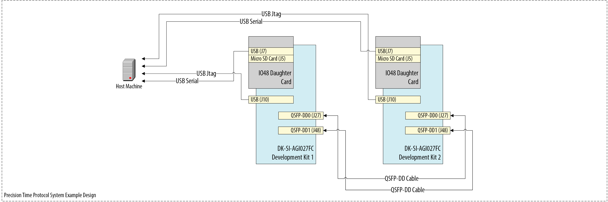

**Figure 10.** High level hardware connectivity diagram

### Configure the Serial Connection

The Embedded Linux OS on the Agilex&trade; 7 Transceiver-SoC Development Kit can be accessed via a serial terminal such as Minicom or PuTTY. First, identify the serial connection IDs between your host and each development kit. On an Ubuntu host, list the most recently connected USB-to-Serial devices using:

``` bash
admin@10.1.23.255:~$ dmesg | grep "ttyUSB*"
[    6.251435] usb 1-1.2: FTDI USB Serial Device converter now attached to ttyUSB1
[    6.255400] usb 1-1.3: FTDI USB Serial Device converter now attached to ttyUSB2
```

In this example, the two detected devices correspond to the serial connections for the Agilex&trade; 7 Transceiver-SoC Development Kits, as no other USB-to-Serial cables are connected to the host.

Start a serial session for each development kit using Minicom. Open separate terminal windows and launch a Minicom instance in each to monitor both kits concurrently.

Development Kit 1 terminal:

``` bash
# Note: Device names may vary depending on your system. Adjust accordingly.
admin@10.1.23.255:~$ minicom -D /dev/ttyUSB1
```

Development Kit 2 terminal:

``` bash
# Note: Device names may vary depending on your system. Adjust accordingly.
admin@10.1.23.255:~$ minicom -D /dev/ttyUSB2
```

Access the Minicom configuration screen using the following key combination:

- `Ctrl + A`, then press `Z` for the Command Summary menu
- `SHIFT + O` for the configuration menu

Configure each serial session with the following parameters:

- Bps/Par/Bits: 115200 8N1
- Hardware Flow Control: No
- Software Flow Control: No

Your 'Serial port setup' screen should resemble the following after adjusting the configuration parameters:

``` bash  
Welcome to minicom 2.7.1                                                                  

OPTI+--------------------------------------------------------------------#             
Comp| A -    Serial Device      : /dev/ttyUSB1                              |             
Port| B - Lockfile Location     : /var/lock                                 |             
    | C -   Callin Program      :                                           |             
Pres| D -  Callout Program      :                                           |             
    | E -    Bps/Par/Bits       : 115200 8N1                                |             
    | F - Hardware Flow Control : No                                        |             
    | G - Software Flow Control : No                                        |             
    |                                                                       |             
    |    Change which setting?                                              |             
    +--------------------------------------------------------------------#             
            | Screen and keyboard      |                                                  
            | Save setup as dfl        |                                                  
            | Save setup as..          |                                                  
            | Exit                     |                                                  
            +-----------------------#
```

Both terminal will remain inactive until the Agilex&trade; 7 device is configured.

## User Flow

There are two ways to test the design based on use case.

- **User Flow 1**: Testing with Pre-build Binaries.

- **User Flow 2**: Testing Complete Flow.

| User Flow                               | Description                                                                                       | Required for User Flow 1 | Required for User Flow 2 |
|-----------------------------------------|---------------------------------------------------------------------------------------------------|--------------------------|--------------------------|
| [Environment Setup](#environment-setup) | [Tools Download and Installation](#tools-download-and-installation)                               | Yes                      | Yes                      |
|                                         | [Install dependency packages for SW compilation](#install-dependency-packages-for-sw-compilation) | No                       | Yes                      |
|                                         | [Package Download](#package-download)                                                             | Yes                      | Yes                      |
| [Compilation](#compilation)             | [HW compilation](#hw-compilation)                                                                 | No                       | Yes                      |
|                                         | [SW compilation](#sw-compilation)                                                                 | No                       | Yes                      |
| [Programming](#programming)             | [Programming the SW binary](#programming-the-sw-binary)                                           | Yes                      | Yes                      |
|                                         | [Programming the HW binary](#programming-the-hw-binary)                                           | Yes                      | Yes                      |
|                                         | [Linux boot](#linux-boot)                                                                         | Yes                      | Yes                      |
| [Testing](#testing)                     | [Initial System Configuration](#initial-system-configuration)                                     | Yes                      | Yes                      |
|                                         | [Run Ping test](#run-ping-test)                                                                   | Yes                      | Yes                      |
|                                         | [Run iPerf3 test](#run-iperf3-test)                                                               | Yes                      | Yes                      |
|                                         | [Run Packet Generator test](#run-packet-generator-test)                                           | Yes                      | Yes                      |
|                                         | [Run ptp4l test](#run-ptp4l-test)                                                                 | Yes                      | Yes                      |

**Table 16.** User Test Flows.

## Environment Setup

### Tools Download and Installation

#### Altera Quartus Prime Pro

Download the Quartus&reg; Prime Pro Edition software version 26.1 from the [FPGA Software Download Center](https://www.altera.com/downloads/fpga-development-tools/quartus-prime-pro-edition-design-software-version-25-3-1-linux). Follow the on-screen instructions to complete the installation process.

Refer to [Altera&reg; FPGA Software Installation and Licensing](https://docs.altera.com/r/docs/683472/25.3/altera-fpga-software-installation-and-licensing/answers-to-top-faqs) for more information on the installation and licensing process.

Set up the Altera&reg; Quartus&reg; tools in the PATH environmental variable.

``` bash
# Adjust QUARTUS_ROOTDIR target to reflect your Quartus installation path  
export QUARTUS_ROOTDIR=~/altera_pro/25.3.1/quartus/
export PATH=$QUARTUS_ROOTDIR/bin:$QUARTUS_ROOTDIR/linux64:$QUARTUS_ROOTDIR/../qsys/bin:$PATH
```

### Install dependency packages for SW compilation

#### Yocto Build Prerequisites

Before building the Yocto-based Linux image, ensure the host system meets the [Yocto system requirements](https://docs.yoctoproject.org/scarthgap/ref-manual/system-requirements.html).

The command to install the required packages and set the environment on Ubuntu 22.04-LTS is:

``` bash
sudo apt-get update
sudo apt-get upgrade
sudo apt-get install openssh-server mc libgmp3-dev libmpc-dev gawk wget git diffstat unzip texinfo gcc \
build-essential chrpath socat cpio python3 python3-pip python3-pexpect xz-utils debianutils iputils-ping \
python3-git python3-jinja2 libegl1-mesa libsdl1.2-dev pylint xterm python3-subunit mesa-common-dev zstd \
liblz4-tool git fakeroot build-essential ncurses-dev xz-utils libssl-dev bc flex libelf-dev bison xinetd \
tftpd tftp nfs-kernel-server libncurses5 libc6-i386 libstdc++6:i386 libgcc++1:i386 lib32z1 \
device-tree-compiler curl mtd-utils u-boot-tools net-tools swig -y
export LC_ALL="en_US.UTF-8"
export LC_CTYPE="en_US.UTF-8"
export LC_NUMERIC="en_US.UTF-8"
export LANG=en_US.UTF-8
export LANGUAGE=en_US.UTF-8
```

#### Bash as Default Command Interpreter

On Ubuntu 22.04, set Bash as the system default command interpreter:

``` bash
sudo ln -sf /bin/bash /bin/sh
```

### Package Download

Clone the GitHub repository to obtain the System Example Design source package.

``` bash
git clone https://github.com/altera-fpga/agilex7-ed-ptp.git
cd agilex7-ed-ptp
git checkout rel25.3.1
cd agi027fc-si-devkit
export TOP_FOLDER=`pwd`
```

Directory Structure Used in This Example Design:

``` bash
  |--- agi027fc-si-devkit
  |   |--- src
  |   |   |--- hw
  |   |   |--- sw

```

Pre-built binaries are available under the [GitHub repository releases](https://github.com/altera-fpga/agilex7-ed-ptp/releases/tag/SED-PTP-agilex7_dk_si_agi027fc-Q25.3.1-Rel-1.1). File descriptions are provided in the [Binaries](#binaries) section.

Extract all files and copy them to $TOP_FOLDER/bin to run hardware tests on the development kit.

## Compilation

The following steps outline the build process for both hardware (HW) and software (SW) components.

### HW compilation

The `src/hw/synth` directory contains the Quartus project and a Makefile with the following build targets:

- `make synth`   - Runs synthesis stage of Altera&reg; Quartus&reg;
- `make compile` - Runs the compile stage of Altera&reg; Quartus&reg;
- `make all`     - Runs a full Altera&reg; Quartus&reg; compilation flow

The project Makefile reads `src/hw/synth/config.txt` to determine the Ethernet data rate for the Ethernet Subsystem IPs. Open `config.txt` and set the configuration to the desired Ethernet data rate with ANLT support as shown in the snippet below.

=== "10 GbE"
    ``` bash
    Configuration=10G_ANLT
    ```
    
    A message with your configuration selection will be printed as part of Quartus compilation standard output messages as shown below.

    ``` bash
    Info: Configuration selected is 10G_ANLT
    ```

    If ANLT support is not required, use `10G_NON_ANLT` configuration as target. Removing ANLT support will require a [Yocto Update](#yocto-update)

=== "25 GbE"
    ``` bash
    Configuration=25G_ANLT
    ```

    A message with your configuration selection will be printed as part of Quartus compilation standard output messages as shown below.

    ``` bash
    Info: Configuration selected is 25G_ANLT
    ```

    If ANLT support is not required, use `25G_NON_ANLT` configuration as target. Removing ANLT support will require a [Yocto Update](#yocto-update)

=== "50 GbE"
    ``` bash
    Configuration=50G_ANLT
    ```

    A message with your configuration selection will be printed as part of Quartus compilation standard output messages as shown below.

    ``` bash
    Info: Configuration selected is 50G_ANLT
    ```

    If ANLT support is not required, use `50G_NON_ANLT` configuration as target. Removing ANLT support will require a [Yocto Update](#yocto-update)

=== "100 GbE"
    ``` bash
    Configuration=100G_ANLT
    ```
    
    A message with your configuration selection will be printed as part of Quartus compilation standard output messages as shown below.

    ``` bash
    Info: Configuration selected is 100G_ANLT
    ```

    If ANLT support is not required, use `100G_NON_ANLT` configuration as target. Removing ANLT support will require a [Yocto Update](#yocto-update)

Run the following command to compile the project:

``` bash
cd $TOP_FOLDER/src/hw/synth/
make all
```

The compilation process generates the `top.sof` bitstream file at `$TOP_FOLDER/src/hw/output_files/`.

#### Build HPS and CORE RBF file

The configuration bitstream generated by Altera&reg; Quartus&reg; Prime includes the FPGA core, I/O, and the HPS First-Stage Bootloader (FSBL). After compiling the project, you must integrate your current U-Boot FSBL (`u-boot-spl-dtb.hex`) into the bitstream.

To embed the .hex file into the bitstream, run the following command:

``` bash
cd $TOP_FOLDER
mkdir bin
quartus_pfg -c -o hps=on -o hps_path=src/sw/artifacts/u-boot-spl-dtb.hex src/hw/synth/output_files/top.sof bin/top.rbf
```

The following files are generated:

- `$TOP_FOLDER/bin/top.hps.rbf`  - HPS First configuration bitstream, phase 1 (HPS and DDR)
- `$TOP_FOLDER/bin/top.core.rbf` - HPS First configuration bitstream, phase 2 (FPGA fabric)


### SW Compilation

#### Build Yocto

Start the Yocto build process by executing the following command:

=== "10 GbE"
    ``` bash
    cd $TOP_FOLDER/src/sw/yocto
    . agilex7_dk_si_agi027fc-PTP_2P10G_MCQ_ANLT-build.sh
    build_default
    ```

    For a non-ANLT configuration, use the next commands instead:

    ``` bash
    cd $TOP_FOLDER/src/sw/yocto
    . agilex7_dk_si_agi027fc-PTP_2P10G_MCQ-build.sh
    build_default
    ```

=== "25 GbE"
    ``` bash
    cd $TOP_FOLDER/src/sw/yocto
    . agilex7_dk_si_agi027fc-PTP_2P25G_MCQ_ANLT-build.sh
    build_default
    ```

    For a non-ANLT configuration, use the next commands instead:

    ``` bash
    cd $TOP_FOLDER/src/sw/yocto
    . agilex7_dk_si_agi027fc-PTP_2P25G_MCQ-build.sh
    build_default
    ```

=== "50 GbE"
    ``` bash
    cd $TOP_FOLDER/src/sw/yocto
    . agilex7_dk_si_agi027fc-PTP_2P50G_MCQ_ANLT-build.sh
    build_default
    ```

    For a non-ANLT configuration, use the next commands instead:

    ``` bash
    cd $TOP_FOLDER/src/sw/yocto
    . agilex7_dk_si_agi027fc-PTP_2P50G_MCQ-build.sh
    build_default
    ```

=== "100 GbE"
    ``` bash
    cd $TOP_FOLDER/src/sw/yocto
    . agilex7_dk_si_agi027fc-PTP_2P100G_MCQ_ANLT-build.sh
    build_default
    ```

    For a non-ANLT configuration, use the next commands instead:

    ``` bash
    cd $TOP_FOLDER/src/sw/yocto
    . agilex7_dk_si_agi027fc-PTP_2P100G_MCQ-build.sh
    build_default
    ```

After a successful build, all required images are stored in the `$TOP_FOLDER/src/sw/yocto/agilex7_dk_si_agi027fc-gsrd-images` directory. Build time varies depending on the host system's resource specifications. Upon successful compilation of the system example design, the following files are generated:

- `$TOP_FOLDER/src/sw/yocto/agilex7_dk_si_agi027fc-gsrd-images/u-boot-spl-dtb.hex`
- `$TOP_FOLDER/src/sw/yocto/agilex7_dk_si_agi027fc-gsrd-images/u-boot.itb`
- `$TOP_FOLDER/src/sw/yocto/agilex7_dk_si_agi027fc-gsrd-images/kernel_sed.itb`
- `$TOP_FOLDER/src/sw/yocto/agilex7_dk_si_agi027fc-gsrd-images/sdimage.tar.gz`

Copy `sdimage.tar.gz` and `kernel_sed.itb` to the bin folder.

``` bash
cp -rf $TOP_FOLDER/src/sw/yocto/agilex7_dk_si_agi027fc-gsrd-images/sdimage.tar.gz $TOP_FOLDER/bin/sdimage.tar.gz
cp -rf $TOP_FOLDER/src/sw/yocto/agilex7_dk_si_agi027fc-gsrd-images/kernel_sed.itb $TOP_FOLDER/bin/kernel_sed.itb
```

#### Yocto Update

If the hardware project is modified, the software must be updated to match the new bitstream. The HPS second-stage bootloader embeds a SHA signature of the FPGA bitstream during compilation. Any change to the bitstream alters the SHA, requiring a bootloader update.

To update the FPGA bitstream SHA signature in the HPS second-stage bootloader, follow these steps:

=== "10 GbE"

    1. Replace `$TOP_FOLDER/src/sw/yocto/meta-agilex7-sed/recipes-bsp/ghrd/files/agilex7_dk_si_agi027fc_gsrd_ghrd_PTP_2P10G_MCQ_ANLT.core.rbf` with the updated `top.core.rbf`
    2. Update the recipe at `$TOP_FOLDER/src/sw/yocto/meta-agilex7-sed/recipes-bsp/ghrd/hw-ref-design.bb` using the following commands

    ``` bash
    cd $TOP_FOLDER
    CORE_RBF=src/sw/yocto/meta-agilex7-sed/recipes-bsp/ghrd/files/agilex7_dk_si_agi027fc_gsrd_ghrd_PTP_2P10G_MCQ_ANLT.core.rbf
    rm -rf $CORE_RBF
    cp -f bin/top.core.rbf $CORE_RBF
    FILE=src/sw/yocto/meta-agilex7-sed/recipes-bsp/ghrd/hw-ref-design.bbappend
    CORE_SHA=$(sha256sum $CORE_RBF | cut -f1 -d" ") 
    OLD_SHA=".*sha256sum_PTP_2P10G_MCQ_ANLT.*"
    NEW_SHA="sha256sum_PTP_2P10G_MCQ_ANLT = \"$CORE_SHA\"" 
    sed -i "s/$OLD_SHA/$NEW_SHA/" "$FILE"
    ```

    For a non-ANLT configuration, For a non-ANLT configuration, use the next steps instead:

    1. Replace `$TOP_FOLDER/src/sw/yocto/meta-agilex7-sed/recipes-bsp/ghrd/files/agilex7_dk_si_agi027fc_gsrd_ghrd_PTP_2P10G_MCQ.core.rbf` with the updated `top.core.rbf`
    2. Update the recipe at `$TOP_FOLDER/src/sw/yocto/meta-agilex7-sed/recipes-bsp/ghrd/hw-ref-design.bb` using the following commands

    ``` bash
    cd $TOP_FOLDER
    CORE_RBF=src/sw/yocto/meta-agilex7-sed/recipes-bsp/ghrd/files/agilex7_dk_si_agi027fc_gsrd_ghrd_PTP_2P10G_MCQ.core.rbf
    rm -rf $CORE_RBF
    cp -f bin/top.core.rbf $CORE_RBF
    FILE=src/sw/yocto/meta-agilex7-sed/recipes-bsp/ghrd/hw-ref-design.bbappend
    CORE_SHA=$(sha256sum $CORE_RBF | cut -f1 -d" ") 
    OLD_SHA=".*sha256sum_PTP_2P10G_MCQ.*"
    NEW_SHA="sha256sum_PTP_2P10G_MCQ = \"$CORE_SHA\"" 
    sed -i "s/$OLD_SHA/$NEW_SHA/" "$FILE"
    ```

=== "25 GbE"

    1. Replace `$TOP_FOLDER/src/sw/yocto/meta-agilex7-sed/recipes-bsp/ghrd/files/agilex7_dk_si_agi027fc_gsrd_ghrd_PTP_2P25G_MCQ_ANLT.core.rbf` with the updated `top.core.rbf`
    2. Update the recipe at `$TOP_FOLDER/src/sw/yocto/meta-agilex7-sed/recipes-bsp/ghrd/hw-ref-design.bb` using the following commands

    ``` bash
    cd $TOP_FOLDER
    CORE_RBF=src/sw/yocto/meta-agilex7-sed/recipes-bsp/ghrd/files/agilex7_dk_si_agi027fc_gsrd_ghrd_PTP_2P25G_MCQ_ANLT.core.rbf
    rm -rf $CORE_RBF
    cp -f bin/top.core.rbf $CORE_RBF
    FILE=src/sw/yocto/meta-agilex7-sed/recipes-bsp/ghrd/hw-ref-design.bbappend
    CORE_SHA=$(sha256sum $CORE_RBF | cut -f1 -d" ") 
    OLD_SHA=".*sha256sum_PTP_2P25G_MCQ_ANLT.*"
    NEW_SHA="sha256sum_PTP_2P25G_MCQ_ANLT = \"$CORE_SHA\"" 
    sed -i "s/$OLD_SHA/$NEW_SHA/" "$FILE"
    ```

    For a non-ANLT configuration, For a non-ANLT configuration, use the next steps instead:

    1. Replace `$TOP_FOLDER/src/sw/yocto/meta-agilex7-sed/recipes-bsp/ghrd/files/agilex7_dk_si_agi027fc_gsrd_ghrd_PTP_2P25G_MCQ.core.rbf` with the updated `top.core.rbf`
    2. Update the recipe at `$TOP_FOLDER/src/sw/yocto/meta-agilex7-sed/recipes-bsp/ghrd/hw-ref-design.bb` using the following commands

    ``` bash
    cd $TOP_FOLDER
    CORE_RBF=src/sw/yocto/meta-agilex7-sed/recipes-bsp/ghrd/files/agilex7_dk_si_agi027fc_gsrd_ghrd_PTP_2P25G_MCQ.core.rbf
    rm -rf $CORE_RBF
    cp -f bin/top.core.rbf $CORE_RBF
    FILE=src/sw/yocto/meta-agilex7-sed/recipes-bsp/ghrd/hw-ref-design.bbappend
    CORE_SHA=$(sha256sum $CORE_RBF | cut -f1 -d" ") 
    OLD_SHA=".*sha256sum_PTP_2P25G_MCQ.*"
    NEW_SHA="sha256sum_PTP_2P25G_MCQ = \"$CORE_SHA\"" 
    sed -i "s/$OLD_SHA/$NEW_SHA/" "$FILE"
    ```

=== "50 GbE"

    1. Replace `$TOP_FOLDER/src/sw/yocto/meta-agilex7-sed/recipes-bsp/ghrd/files/agilex7_dk_si_agi027fc_gsrd_ghrd_PTP_2P50G_MCQ_ANLT.core.rbf` with the updated `top.core.rbf`
    2. Update the recipe at `$TOP_FOLDER/src/sw/yocto/meta-agilex7-sed/recipes-bsp/ghrd/hw-ref-design.bb` using the following commands

    ``` bash
    cd $TOP_FOLDER
    CORE_RBF=src/sw/yocto/meta-agilex7-sed/recipes-bsp/ghrd/files/agilex7_dk_si_agi027fc_gsrd_ghrd_PTP_2P50G_MCQ_ANLT.core.rbf
    rm -rf $CORE_RBF
    cp -f bin/top.core.rbf $CORE_RBF
    FILE=src/sw/yocto/meta-agilex7-sed/recipes-bsp/ghrd/hw-ref-design.bbappend
    CORE_SHA=$(sha256sum $CORE_RBF | cut -f1 -d" ") 
    OLD_SHA=".*sha256sum_PTP_2P50G_MCQ_ANLT.*"
    NEW_SHA="sha256sum_PTP_2P50G_MCQ_ANLT = \"$CORE_SHA\"" 
    sed -i "s/$OLD_SHA/$NEW_SHA/" "$FILE"
    ```

    For a non-ANLT configuration, For a non-ANLT configuration, use the next steps instead:

    1. Replace `$TOP_FOLDER/src/sw/yocto/meta-agilex7-sed/recipes-bsp/ghrd/files/agilex7_dk_si_agi027fc_gsrd_ghrd_PTP_2P50G_MCQ.core.rbf` with the updated `top.core.rbf`
    2. Update the recipe at `$TOP_FOLDER/src/sw/yocto/meta-agilex7-sed/recipes-bsp/ghrd/hw-ref-design.bb` using the following commands

    ``` bash
    cd $TOP_FOLDER
    CORE_RBF=src/sw/yocto/meta-agilex7-sed/recipes-bsp/ghrd/files/agilex7_dk_si_agi027fc_gsrd_ghrd_PTP_2P50G_MCQ.core.rbf
    rm -rf $CORE_RBF
    cp -f bin/top.core.rbf $CORE_RBF
    FILE=src/sw/yocto/meta-agilex7-sed/recipes-bsp/ghrd/hw-ref-design.bbappend
    CORE_SHA=$(sha256sum $CORE_RBF | cut -f1 -d" ") 
    OLD_SHA=".*sha256sum_PTP_2P50G_MCQ.*"
    NEW_SHA="sha256sum_PTP_2P50G_MCQ = \"$CORE_SHA\"" 
    sed -i "s/$OLD_SHA/$NEW_SHA/" "$FILE"
    ```

=== "100 GbE"

    1. Replace `$TOP_FOLDER/src/sw/yocto/meta-agilex7-sed/recipes-bsp/ghrd/files/agilex7_dk_si_agi027fc_gsrd_ghrd_PTP_2P100G_MCQ_ANLT.core.rbf` with the updated `top.core.rbf`
    2. Update the recipe at `$TOP_FOLDER/src/sw/yocto/meta-agilex7-sed/recipes-bsp/ghrd/hw-ref-design.bb` using the following commands

    ``` bash
    cd $TOP_FOLDER
    CORE_RBF=src/sw/yocto/meta-agilex7-sed/recipes-bsp/ghrd/files/agilex7_dk_si_agi027fc_gsrd_ghrd_PTP_2P100G_MCQ_ANLT.core.rbf
    rm -rf $CORE_RBF
    cp -f bin/top.core.rbf $CORE_RBF
    FILE=src/sw/yocto/meta-agilex7-sed/recipes-bsp/ghrd/hw-ref-design.bbappend
    CORE_SHA=$(sha256sum $CORE_RBF | cut -f1 -d" ") 
    OLD_SHA=".*sha256sum_PTP_2P100G_MCQ_ANLT.*"
    NEW_SHA="sha256sum_PTP_2P100G_MCQ_ANLT = \"$CORE_SHA\"" 
    sed -i "s/$OLD_SHA/$NEW_SHA/" "$FILE"
    ```

    For a non-ANLT configuration, For a non-ANLT configuration, use the next steps instead:

    1. Replace `$TOP_FOLDER/src/sw/yocto/meta-agilex7-sed/recipes-bsp/ghrd/files/agilex7_dk_si_agi027fc_gsrd_ghrd_PTP_2P100G_MCQ.core.rbf` with the updated `top.core.rbf`
    2. Update the recipe at `$TOP_FOLDER/src/sw/yocto/meta-agilex7-sed/recipes-bsp/ghrd/hw-ref-design.bb` using the following commands

    ``` bash
    cd $TOP_FOLDER
    CORE_RBF=src/sw/yocto/meta-agilex7-sed/recipes-bsp/ghrd/files/agilex7_dk_si_agi027fc_gsrd_ghrd_PTP_2P100G_MCQ.core.rbf
    rm -rf $CORE_RBF
    cp -f bin/top.core.rbf $CORE_RBF
    FILE=src/sw/yocto/meta-agilex7-sed/recipes-bsp/ghrd/hw-ref-design.bbappend
    CORE_SHA=$(sha256sum $CORE_RBF | cut -f1 -d" ") 
    OLD_SHA=".*sha256sum_PTP_2P100G_MCQ.*"
    NEW_SHA="sha256sum_PTP_2P100G_MCQ = \"$CORE_SHA\"" 
    sed -i "s/$OLD_SHA/$NEW_SHA/" "$FILE"
    ```

After completing the previous step, rebuild the design as described in [Build Yocto](#build-yocto).

Regenerate the HPS configuration file with the new `u-boot-spl-dtb.hex` file.

``` bash
cd $TOP_FOLDER
rm bin/top.hps.rbf
quartus_pfg -c -o hps=on -o hps_path=src/sw/yocto/agilex7_dk_si_agi027fc-gsrd-images/u-boot-agilex7-socdk-gsrd-atf/u-boot-spl-dtb.hex src/hw/synth/output_files/top.sof bin/top.rbf
```

## Programming

If following User Flow 1, download the [Prebuild Binaries](#binaries). Ensure all steps under [Hardware Setup](#hardware-setup) are completed before proceeding.

### Programming the SW binary

The SD card image file `sdimage.tar.gz` is provided in the as part of the [Prebuild Binaries](#binaries), you may refer to [Release Content](#release-contents) for more information.

Follow the instructions under "[Write SD Card](https://altera-fpga.github.io/rel-25.1.1/embedded-designs/agilex-7/i-series/soc/gsrd/ug-gsrd-agx7i-soc/#write-sd-card)" in the HPS GSRD User Guide for the Agilex&trade; 7 FPGA I-Series Transceiver-SoC Development Kit (4x F-Tile) to create two bootable SD cards using the provided image file.

Insert the SD cards into each development kit.

### Programming the HW binary

#### Program the onboard MAX10 device

Using Quartus&reg; Programmer Tool version 26.1 GUI, configure the onboard MAX10 device with `max10_system_0002aa4F.pof` from the [pre-build binaries](#binaries) files.

Alternatively, you can perform this operation via the command line. First, verify that all devices on the development kit are recognized and identify the JTAG cable number using the following command:

``` bash
/home/user$ jtagconfig
1) Agilex I-Series SOC Dev Kit on 10.244.179.132 [USB-1]
  6BA00477   S10HPS/AGILEX_HPS/N5X_HPS
  0343B0DD   AGFB027R24C(.|B|C|R2|R0)/..
  031830DD   10M16S(A|C|L)

2) Agilex I-Series SOC Dev Kit on 10.244.179.132 [USB-2]
  6BA00477   S10HPS/AGILEX_HPS/N5X_HPS
  0343B0DD   AGFB027R24C(.|B|C|R2|R0)/..
  031830DD   10M16S(A|C|L)
```

From the `jtagconfig` output, two Agilex&trade; 7 Transceiver-SoC Development Kits are detected, with devices identified and assigned to cable 1 and cable 2.

Configure the development kits from your host using the following command:

``` bash
cd $TOP_FOLDER/bin
# Update the -c parameter to match the JTAG cable numbers assigned to your development kits
quartus_pgm -c 1 -m jtag -o "p;./max10_system_0002aa4F.pof@3" && quartus_pgm -c 2 -m jtag -o "p;./max10_system_0002aa4F.pof@3"
```

#### Program the onboard Agilex&trade; 7 device

Using Quartus&reg; Programmer Tool version 26.1 GUI, configure the onboard `AGFB027R24C` device with `top.hps.rbf`.

Alternatively, you can perform this operation via the command line. First, verify that all devices on the development kit are recognized and identify the JTAG cable number using the following command:

``` bash
/home/user$ jtagconfig
1) Agilex I-Series SOC Dev Kit on 10.244.179.132 [USB-1]
  6BA00477   S10HPS/AGILEX_HPS/N5X_HPS
  0343B0DD   AGFB027R24C(.|B|C|R2|R0)/..
  031830DD   10M16S(A|C|L)

2) Agilex I-Series SOC Dev Kit on 10.244.179.132 [USB-2]
  6BA00477   S10HPS/AGILEX_HPS/N5X_HPS
  0343B0DD   AGFB027R24C(.|B|C|R2|R0)/..
  031830DD   10M16S(A|C|L)
```

From the `jtagconfig` output, two Agilex&trade; 7 Transceiver-SoC Development Kits are detected, with devices identified and assigned to cable 1 and cable 2.

Configure the development kits from your host using the following command:

``` bash
cd $TOP_FOLDER
# Update the -c parameter to match the JTAG cable numbers assigned to your development kits
# If the Agilex 7 FPGA is in position 1, update the parameter after @ to reflect the correct device index.
quartus_pgm -c 1 -m jtag -o "p;./bin/top.hps.rbf@2" && quartus_pgm -c 2 -m jtag -o "p;./bin/top.hps.rbf@2"
```

## Linux Boot

On the HPS UART (Minicom connection), you’ll observe the HPS booting Linux from the SD card. Once booted, log in with username `root` and no password. The system is now ready for configuration.

If everything is functioning correctly, each Minicom terminal will display boot messages from the HPS running Linux.

=== "10 GbE" 

    ```bash
    agilex7dksiagi027fc login: root

    WARNING: Poky is a reference Yocto Project distribution that should r
    testing and development purposes only. It is recommended that you crr
    own distribution for production use.

    root@agilex7dksiagi027fc:~# uname -a
    Linux agilex7dksiagi027fc 6.12.19-altera-agx7-2x10G-ptp-anlt-sed-Q25.3.1-R1.1 #1 SMP PREEMPT Thu Jan 29 07:47:33 UTC 2026 aarch64 GNU/Linux
    root@agilex7dksiagi027fc:~# cat /etc/os-release
    ID=poky
    NAME="Poky (Yocto Project Reference Distro)"
    VERSION="5.0.5 (scarthgap)"
    VERSION_ID=5.0.5
    VERSION_CODENAME="scarthgap"
    PRETTY_NAME="Poky (Yocto Project Reference Distro) 5.0.5 (scarthgap)"
    CPE_NAME="cpe:/o:openembedded:poky:5.0.5"
    ```

=== "25 GbE"

    ```bash
    agilex7dksiagi027fc login: root

    WARNING: Poky is a reference Yocto Project distribution that should r
    testing and development purposes only. It is recommended that you crr
    own distribution for production use.

    root@agilex7dksiagi027fc:~# uname -a
    Linux agilex7dksiagi027fc 6.12.19-altera-agx7-2x25G-ptp-anlt-sed-Q25.3.1-R1.1 #1 SMP PREEMPT Thu Jan 29 07:47:33 UTC 2026 aarch64 GNU/Linux
    root@agilex7dksiagi027fc:~# cat /etc/os-release
    ID=poky
    NAME="Poky (Yocto Project Reference Distro)"
    VERSION="5.0.5 (scarthgap)"
    VERSION_ID=5.0.5
    VERSION_CODENAME="scarthgap"
    PRETTY_NAME="Poky (Yocto Project Reference Distro) 5.0.5 (scarthgap)"
    CPE_NAME="cpe:/o:openembedded:poky:5.0.5"
    ```

=== "50 GbE"
    ``` bash
    agilex7dksiagi027fc login: root

    WARNING: Poky is a reference Yocto Project distribution that should r
    testing and development purposes only. It is recommended that you crr
    own distribution for production use.

    root@agilex7dksiagi027fc:~# uname -a
    Linux agilex7dksiagi027fc 6.12.19-altera-agx7-2x50G-ptp-anlt-sed-Q25.3.1-R1.1 #1 SMP PREEMPT Thu Jan 29 07:47:33 UTC 2026 aarch64 GNU/Linux
    root@agilex7dksiagi027fc:~# cat /etc/os-release
    ID=poky
    NAME="Poky (Yocto Project Reference Distro)"
    VERSION="5.0.5 (scarthgap)"
    VERSION_ID=5.0.5
    VERSION_CODENAME="scarthgap"
    PRETTY_NAME="Poky (Yocto Project Reference Distro) 5.0.5 (scarthgap)"
    CPE_NAME="cpe:/o:openembedded:poky:5.0.5"
    ```

=== "100 GbE" 

    ``` bash
    agilex7dksiagi027fc login: root

    WARNING: Poky is a reference Yocto Project distribution that should r
    testing and development purposes only. It is recommended that you crr
    own distribution for production use.

    root@agilex7dksiagi027fc:~# uname -a
    Linux agilex7dksiagi027fc 6.12.19-altera-agx7-2x100G-ptp-anlt-sed-Q25.3.1-R1.1 #1 SMP PREEMPT Thu Jan 29 07:47:33 UTC 2026 aarch64 GNU/Linux
    root@agilex7dksiagi027fc:~# cat /etc/os-release
    ID=poky
    NAME="Poky (Yocto Project Reference Distro)"
    VERSION="5.0.5 (scarthgap)"
    VERSION_ID=5.0.5
    VERSION_CODENAME="scarthgap"
    PRETTY_NAME="Poky (Yocto Project Reference Distro) 5.0.5 (scarthgap)"
    CPE_NAME="cpe:/o:openembedded:poky:5.0.5"
    ```


Repeat the same steps for the second Agilex&trade; 7 I-Series Transceiver-SoC Development Kit.

### Ethernet Link Status

Check the network status on each Agilex&trade; 7 I-Series Transceiver-SoC Development Kit using the following command:

``` bash
root@agilex7dksiagi027fc:~# ip addr
1: lo: <LOOPBACK,UP,LOWER_UP> mtu 65536 qdisc noqueue state UNKNOWN 0
    link/loopback 00:00:00:00:00:00 brd 00:00:00:00:00:00
    inet 127.0.0.1/8 scope host lo
       valid_lft forever preferred_lft forever
    inet6 ::1/128 scope host noprefixroute 
       valid_lft forever preferred_lft forever
2: eth0: <NO-CARRIER,BROADCAST,MULTICAST,UP> mtu 1500 qdisc mq state0
    link/ether 66:68:45:23:2d:d3 brd ff:ff:ff:ff:ff:ff
3: teql0: <NOARP> mtu 1500 qdisc noop state DOWN group default qlen 0
    link/void 
4: eth1: <BROADCAST,MULTICAST,UP,LOWER_UP> mtu 1500 qdisc mq state U0
    link/ether 4a:e9:22:7c:86:00 brd ff:ff:ff:ff:ff:ff
    inet 169.254.167.23/16 brd 169.254.255.255 scope global eth1
       valid_lft forever preferred_lft forever
    inet6 fe80::48e9:22ff:fe7c:8600/64 scope link proto kernel_ll 
       valid_lft forever preferred_lft forever
5: eth2: <BROADCAST,MULTICAST,UP,LOWER_UP> mtu 1500 qdisc mq state U0
    link/ether ae:1b:b7:7c:16:d0 brd ff:ff:ff:ff:ff:ff
    inet 169.254.86.21/16 brd 169.254.255.255 scope global eth2
       valid_lft forever preferred_lft forever
    inet6 fe80::ac1b:b7ff:fe7c:16d0/64 scope link proto kernel_ll 
       valid_lft forever preferred_lft forever
root@agilex7dksiagi027fc:~# 
```

Three Ethernet interfaces will be listed in the output of `ip addr`:

=== "10 GbE"
    1. `eth0` : HPS dedicated Ethernet interface (1Gbps)
    2. `eth1` : 10G Ethernet Port (10 Gbps)
    3. `eth2` : 10G Ethernet Port (10 Gbps)

=== "25 GbE"
    1. `eth0` : HPS dedicated Ethernet interface (1Gbps)
    2. `eth1` : 25G Ethernet Port (25Gbps)
    3. `eth2` : 25G Ethernet Port (25Gbps)

=== "50 GbE"
    1. `eth0` : HPS dedicated Ethernet interface (1Gbps)
    2. `eth1` : 50G Ethernet Port (50Gbps)
    3. `eth2` : 50G Ethernet Port (50Gbps)

=== "100 GbE"
    1. `eth0` : HPS dedicated Ethernet interface (1Gbps)
    2. `eth1` : 100G Ethernet Port (100Gbps)
    3. `eth2` : 100G Ethernet Port (100Gbps)

## Initial System Configuration

After booting on both development kits, the System Example design requires initialization of key components: DMA subsystem, User Logic (Packet Generator), Packet Switch, Egress QoS-TC, and Iperf. Two configuration methods are supported.

1. One-step configuration via script
2. Step-by-Step configuration of each interface.

### Configuration Via Script

For [manual configuration](#manual-configuration), skip this section.

The `2PortMCQ.sh` script is included in the Yocto rootfs image at `/home/root/scripts/`. It accepts a single numeric argument specifying the target development kit. Usage:

``` bash
source ./2PortMCQ.sh <development kit number>
```

Valid argument values are `1` or `2`.

Run the following command on Development Kit 1:

``` bash
source ./2PortMCQ.sh 1
```

Expected output:

``` bash
root@agilex7dksiagi027fc:~/scripts# source ./2PortMCQ.sh 1
Programming the Basic IP address...
Clearing old PacketSwitch rules Port - 0...
UIO device file found. Using /dev/uio2
Key Flush successful...
No Filters attached to eth1. Continuing...
Clearing old PacketSwitch rules Port - 1...
UIO device file found. Using /dev/uio2
Key Flush successful...
No Filters attached to eth2. Continuing...
Flushing old IPv4 and IPv6 addresses and routes
Setting DEVKIT to 2.
Running script for Devkit 2.
    link/ether 12:bf:d3:47:23:ed brd ff:ff:ff:ff:ff:ff
    link/ether 46:4f:0d:9c:a0:b5 brd ff:ff:ff:ff:ff:ff
    link/ether 3a:5f:04:da:0b:6d brd ff:ff:ff:ff:ff:ff
Programming the Packet Switch Port - 0...
Programming the Packet Switch Generic rule...
eth1 - 46:4f:0d:9c:a0:b5
UIO device file found. Using /dev/uio2
Setting Entry: Success
Copying Keyfields: Port: 0 Key index: 0 Success
Setting Result Register: 2. Success
Setting Mask Register: Success
Setting Mgmt Cntrl Register: Success
Wait till operation is done: Key Insertion successful...
Programming the Packet Switch - Low priority rules...
UIO device file found. Using /dev/uio2
Setting Entry: Success
Copying Keyfields: Port: 0 Key index: 1 Success
Setting Result Register: 2. Success
Setting Mask Register: Success
Setting Mgmt Cntrl Register: Success
Wait till operation is done: Key Insertion successful...
UIO device file found. Using /dev/uio2
Setting Entry: Success

<-- output truncated -->

Programming the IPV6 rules - Port 1
Setting IPv6 local addresses
RTNETLINK answers: Operation not supported
RTNETLINK answers: Operation not supported
UIO device file found. Using /dev/uio2
Setting Entry: Success
Copying Keyfields: Port: 1 Key index: 20 Success
Setting Result Register: 2. Success
Setting Mask Register: Success
Setting Mgmt Cntrl Register: Success
Wait till operation is done: Key Insertion successful...
UIO device file found. Using /dev/uio2
Setting Entry: Success
Copying Keyfields: Port: 1 Key index: 21 Success
Setting Result Register: 2. Success
Setting Mask Register: Success
Setting Mgmt Cntrl Register: Success
Wait till operation is done: Key Insertion successful...
Traffic Class Egress QOS programming - Port - eth1
Create QDisc...
Create Filters - PTP packets to DMA0...
Create Filters - IPERF 540X packets to DMA0...
Create Filters - IPERF 530X packets to DMA1...
Create Filters - IPERF 520X packets to DMA2...
Create Filters - ICMP packets to DMA2...
Traffic Class Egress QOS programming - Port - eth2
Create QDisc...
Create Filters - PTP packets to DMA0...
Create Filters - IPERF 540X packets to DMA0...
Create Filters - IPERF 530X packets to DMA1...
Create Filters - IPERF 520X packets to DMA2...
Create Filters - ICMP packets to DMA2...
Configuration for Devkit 1 set
```

Configure Development Kit 2:

``` bash
source ./2PortMCQ.sh 2
```

### Manual Configuration

#### Define Interrupt Core Handling

Set up SMP affinity for Ethernet interrupts to distribute handling across different CPUs.

Execute the following commands on both development kits:

``` bash
echo -e "Programming the Basic IP address..."
echo "2" > /proc/irq/25/smp_affinity && echo "2" > /proc/irq/26/smp_affinity && echo "4" > /proc/irq/27/smp_affinity && echo "4" > /proc/irq/28/smp_affinity && echo "8" > /proc/irq/29/smp_affinity && echo "8" > /proc/irq/30/smp_affinity
echo "1" > /proc/irq/31/smp_affinity && echo "1" > /proc/irq/32/smp_affinity && echo "2" > /proc/irq/33/smp_affinity && echo "2" > /proc/irq/34/smp_affinity && echo "4" > /proc/irq/35/smp_affinity && echo "4" > /proc/irq/36/smp_affinity
```

#### Clear Old Configurations

Clear existing Packet Switch TCAM keys, traffic class (TC) configurations, and any pre-existing IPv6 settings.

Execute the following commands on both development kits:

``` bash
echo -e "Clearing old PacketSwitch rules Port - 0..."
packetswitch --port 0 --flush-all-keys

FILTERS=$(tc filter show dev eth1 egress 2>/dev/null)
if [[ -z "$FILTERS" ]]; then
	 echo -e "No Filters attached to eth1. Continuing..."
else
	 echo -e "Clearing old TC rules Port - 0..."
	 tc filter del dev eth1 egress
	 tc qdisc del dev eth1 clsact
fi

echo -e "Clearing old PacketSwitch rules Port - 1..."
packetswitch --port 1 --flush-all-keys

FILTERS=$(tc filter show dev eth2 egress 2>/dev/null)
if [[ -z "$FILTERS" ]]; then
	 echo -e "No Filters attached to eth2. Continuing..."
else
	 echo -e "Clearing old TC rules Port - 1..."
	 tc filter del dev eth2 egress
	 tc qdisc del dev eth2 clsact
fi

echo -e "Flushing old IPv4 and IPv6 addresses and routes"
ip addres flush eth1 && ip route flush dev eth1
ip -6 addres flush eth1 && ip -6 route flush dev eth1
ip addres flush eth2 && ip route flush dev eth2
ip -6 addres flush eth2 && ip -6 route flush dev eth2
```

#### Set IPv4 Addresses

`eth1` and `eth2` are the Linux interface names assigned to Ethernet Subsystem IP ports 8 and 9, respectively. Both interfaces must be in the UP state and have IP addresses assigned. Use the following commands to overwrite the IP addresses and bring the interfaces up.

Execute the following commands on development kit 1:

``` bash
ip link set eth1 up && ip addr add 192.168.121.1 dev eth1 && ip route add 192.168.121.0/24 dev eth1 src 192.168.121.1
ip link set eth2 up && ip addr add 192.168.122.1 dev eth2 && ip route add 192.168.122.0/24 dev eth2 src 192.168.122.1
```

Execute the following commands on development kit 2:

``` bash
ip link set eth1 up && ip addr add 192.168.121.2 dev eth1 && ip route add 192.168.121.0/24 dev eth1 src 192.168.121.2
ip link set eth2 up && ip addr add 192.168.122.2 dev eth2 && ip route add 192.168.122.0/24 dev eth2 src 192.168.122.2
```

#### Packet Switch Rules

##### Generic Traffic Rules

The following rules configure the Packet Switch to route ping requests to the lowest priority DMA (DMA-2) on both Ethernet interfaces.

``` bash
echo -e "Programming the Packet Switch Port - 0..."
echo -e "Programming the Packet Switch Generic rule..."
packetswitch --port 0 --set-key --key-index 0 --dest-mac "eth1"  --result 0x2
echo -e "Programming the Packet Switch - Low priority rules..."
packetswitch --port 0 --set-key --key-index 1 --ethtype 0x0806 --result 0x2
packetswitch --port 0 --set-key --key-index 2 --ethtype 0x0800 --protocol 0x01 --result 0x2

echo -e "Programming the Packet Switch Port - 1..."
echo -e "Programming the Packet Switch Generic rule..."
packetswitch --port 1 --set-key --key-index 0 --dest-mac "eth2"  --result 0x2
echo -e "Programming the Packet Switch - Low priority rules..."
packetswitch --port 1 --set-key --key-index 1 --ethtype 0x0806 --result 0x2
packetswitch --port 1 --set-key --key-index 2 --ethtype 0x0800 --protocol 0x01 --result 0x2
```

The first rule matches packets with a destination MAC address equal to that of the Ethernet interface. The second rule filters Ethernet frames with Ethertype set to IPv4 and the IPv4 protocol field set to ICMP. The final rule filters frames with Ethertype set to ARP.

##### iPerf3 Synthetic Traffic Rules

iPerf3 is a tool for active measurement of maximum achievable bandwidth on IP networks. It can generate traffic between a client and server, with configurable parameters such as the network port used. The following rules assign a target DMA based on the network port of incoming Ethernet packets.

``` bash
echo -e "Programming the Packet Switch Port - 0..."
echo -e "Programming the Packet Switch - IPERF 540X to DMA0..."
packetswitch --port 0 --set-key --key-index 3 --ethtype 0x0800 --dest-port 5401 --result 0x0
packetswitch --port 0 --set-key --key-index 4 --ethtype 0x0800 --dest-port 5402 --result 0x0
packetswitch --port 0 --set-key --key-index 5 --ethtype 0x0800 --src-port 5401 --result 0x0
packetswitch --port 0 --set-key --key-index 6 --ethtype 0x0800 --src-port 5402 --result 0x0
echo -e "Programming the Packet Switch - IPERF 530X to DMA1..."
packetswitch --port 0 --set-key --key-index 7 --ethtype 0x0800 --dest-port 5301 --result 0x1
packetswitch --port 0 --set-key --key-index 8 --ethtype 0x0800 --dest-port 5302 --result 0x1
packetswitch --port 0 --set-key --key-index 9 --ethtype 0x0800 --src-port 5301 --result 0x1
packetswitch --port 0 --set-key --key-index 10 --ethtype 0x0800 --src-port 5302 --result 0x1
echo -e "Programming the Packet Switch - IPERF 520X to DMA2..."
packetswitch --port 0 --set-key --key-index 11 --ethtype 0x0800 --dest-port 5201 --result 0x2
packetswitch --port 0 --set-key --key-index 12 --ethtype 0x0800 --dest-port 5202 --result 0x2
packetswitch --port 0 --set-key --key-index 13 --ethtype 0x0800 --src-port 5201 --result 0x2
packetswitch --port 0 --set-key --key-index 14 --ethtype 0x0800 --src-port 5202 --result 0x2

echo -e "Programming the Packet Switch Port - 1..."
echo -e "Programming the Packet Switch - IPERF 540X to DMA0..."
packetswitch --port 1 --set-key --key-index 3 --ethtype 0x0800 --dest-port 5401 --result 0x0
packetswitch --port 1 --set-key --key-index 4 --ethtype 0x0800 --dest-port 5402 --result 0x0
packetswitch --port 1 --set-key --key-index 5 --ethtype 0x0800 --src-port 5401 --result 0x0
packetswitch --port 1 --set-key --key-index 6 --ethtype 0x0800 --src-port 5402 --result 0x0
echo -e "Programming the Packet Switch - IPERF 530X to DMA1..."
packetswitch --port 1 --set-key --key-index 7 --ethtype 0x0800 --dest-port 5301 --result 0x1
packetswitch --port 1 --set-key --key-index 8 --ethtype 0x0800 --dest-port 5302 --result 0x1
packetswitch --port 1 --set-key --key-index 9 --ethtype 0x0800 --src-port 5301 --result 0x1
packetswitch --port 1 --set-key --key-index 10 --ethtype 0x0800 --src-port 5302 --result 0x1
echo -e "Programming the Packet Switch - IPERF 520X to DMA2..."
packetswitch --port 1 --set-key --key-index 11 --ethtype 0x0800 --dest-port 5201 --result 0x2
packetswitch --port 1 --set-key --key-index 12 --ethtype 0x0800 --dest-port 5202 --result 0x2
packetswitch --port 1 --set-key --key-index 13 --ethtype 0x0800 --src-port 5201 --result 0x2
packetswitch --port 1 --set-key --key-index 14 --ethtype 0x0800 --src-port 5202 --result 0x2
```

The commands above configure the Packet Switch to route all traffic using port 540X to DMA-0, 530X to DMA-1, and 520X to DMA-2.

##### PTP Traffic Rules

PTP Ethernet packets will be routed to the highest priority DMA (DMA-0) to keep the system time synchronized with the network time. Execute the following commands on both development kits to make both Ethernet interfaces prioritize the PTP traffic: 

``` bash
echo -e "Programming the PTP Bridge Port - 0..."
echo -e "Programming the Packet Switch - PTP Packets to DMA0..."
packetswitch --port 0 --set-key --key-index 15 --dest-mac "01:80:C2:00:00:0E" --result 0x0
packetswitch --port 0 --set-key --key-index 16 --dest-mac "01:1B:19:00:00:00" --result 0x0
packetswitch --port 0 --set-key --key-index 17 --ethtype 0x88F7 --result 0x0
packetswitch --port 0 --set-key --key-index 18 --ethtype 0x88F8 --result 0x0

echo -e "Programming the PTP Bridge Port - 1..."
echo -e "Programming the Packet Switch - PTP Packets to DMA0..."
packetswitch --port 1 --set-key --key-index 15 --dest-mac "01:80:C2:00:00:0E" --result 0x0
packetswitch --port 1 --set-key --key-index 16 --dest-mac "01:1B:19:00:00:00" --result 0x0
packetswitch --port 1 --set-key --key-index 17 --ethtype 0x88F7 --result 0x0
packetswitch --port 1 --set-key --key-index 18 --ethtype 0x88F8 --result 0x0

```

The commands above set rules to filter packets based on the destination address used for PTP broadcast messages and the protocol identifier encapsulated in the EtherType field of the Ethernet frame. The rules are applied to both Ethernet interfaces in this example, but there is an independent scheduler for each Ethernet interface, making it possible to have different rules for each one of them.

##### Packet Generator Traffic Rules

The following set of rules defines the routing to the client ports where the system example design packet generators are connected.

The `packetgenerator` commands set the source and destination MAC addresses to be used by each packet generator. Then, the `packetswitch` is used to filter incoming Ethernet frames coming from the opposite development kit and route them to one of the user ports (user ports are represented by '0x8'). There are two additional commands to program the packet generator module with traffic configuration parameters.

Execute the following commands on development kit 1:

``` bash
echo -e "Programming the Packet Switch - Port 0 User packets to User port..."
packetgenerator --device /dev/uio0 --dest-mac "12:34:56:78:0A:2" --src-mac "12:34:56:78:0A:1"
packetswitch --set-key --port 0 --key-index 19 --dest-mac "12:34:56:78:0A:1" --result 0x8
echo -e "Programming the Packet Switch - Port 1 User packets to User port..."
packetgenerator --device /dev/uio1 --dest-mac "12:34:56:78:0A:4" --src-mac "12:34:56:78:0A:3"
packetswitch --set-key --port 1 --key-index 19 --dest-mac "12:34:56:78:0A:3" --result 0x8

echo -e "Programming the Packet Generator - Port 0"
packetgenerator --device /dev/uio0 --traffic false --fixed-gap true --pkt-len-mode 0x01 --num-idle-cycles 22 --packet-checker true --num-packets 0xFFFFFFFF --one-shot false --tx-pkt-size 1024 --tx-max-pkt-size 1024
echo -e "Programming the Packet Generator - Port 1"
packetgenerator --device /dev/uio1 --traffic false --fixed-gap true --pkt-len-mode 0x01 --num-idle-cycles 22 --packet-checker true --num-packets 0xFFFFFFFF --one-shot false --tx-pkt-size 1024 --tx-max-pkt-size 1024
```

Execute the following commands on development kit 2:

``` bash
echo -e "Programming the Packet Switch - Port 0 User packets to User port..."
packetgenerator --device /dev/uio0 --dest-mac "12:34:56:78:0A:1" --src-mac "12:34:56:78:0A:2"
packetswitch --set-key --port 0 --key-index 19 --dest-mac "12:34:56:78:0A:2" --result 0x8
echo -e "Programming the Packet Switch - Port 1 User packets to User port..."
packetgenerator --device /dev/uio1 --dest-mac "12:34:56:78:0A:3" --src-mac "12:34:56:78:0A:4"
packetswitch --set-key --port 1 --key-index 19 --dest-mac "12:34:56:78:0A:4" --result 0x8

echo -e "Programming the Packet Generator - Port 0"
packetgenerator --device /dev/uio0 --traffic false --fixed-gap true --pkt-len-mode 0x01 --num-idle-cycles 22 --packet-checker true --num-packets 0xFFFFFFFF --one-shot false --tx-pkt-size 1024 --tx-max-pkt-size 1024
echo -e "Programming the Packet Generator - Port 1"
packetgenerator --device /dev/uio1 --traffic false --fixed-gap true --pkt-len-mode 0x01 --num-idle-cycles 22 --packet-checker true --num-packets 0xFFFFFFFF --one-shot false --tx-pkt-size 1024 --tx-max-pkt-size 1024
```

##### IPv6 Traffic Rules

The next commands set set IPv6 addresses and update the routing table  for both ethernet interfaces. Then, the `packetswitch` rules define that that IPv6 ping requests needs to be channeled to the lowest-priority DMA (DMA-2) on both Ethernet interfaces.

Execute the following commands on development kit 1:

``` bash
echo -e "Programming the IPV6 rules - Port 0"
echo -e "Setting IPv6 local addresses"
ip -6 addr add 2001:db8:abcd:0012::1/64 dev eth1 && ip link set dev eth1 up
sleep 2
ip -6 route add 2001:db8:abcd:0012::1/64 dev eth1 src 2001:db8:abcd:0012::1

packetswitch --port 0 --set-key --key-index 20 --ethtype 0x86DD --result 0x2
packetswitch --port 0 --set-key --key-index 21 --ethtype 0x86DD --protocol 0x3A  --result 0x2

echo -e "Programming the IPV6 rules - Port 1"
echo -e "Setting IPv6 local addresses"
ip -6 addr add 2001:db8:abcd:0013::1/64 dev eth2 && ip link set dev eth2 up
sleep 2
ip -6 route add 2001:db8:abcd:0013::1/64 dev eth2 src 2001:db8:abcd:0013::1

packetswitch --port 1 --set-key --key-index 20 --ethtype 0x86DD --result 0x2
packetswitch --port 1 --set-key --key-index 21 --ethtype 0x86DD --protocol 0x3A  --result 0x2
```

Execute the following commands on development kit 2:

``` bash
echo -e "Programming the IPV6 rules - Port 0"
echo -e "Setting IPv6 local addresses"
ip -6 addr add 2001:db8:abcd:0012::2/64 dev eth1 && ip link set dev eth1 up
sleep 2
ip -6 route add 2001:db8:abcd:0012::2/64 dev eth1 src 2001:db8:abcd:0012::2

packetswitch --port 0 --set-key --key-index 20 --ethtype 0x86DD --result 0x2
packetswitch --port 0 --set-key --key-index 21 --ethtype 0x86DD --protocol 0x3A  --result 0x2

echo -e "Programming the IPV6 rules - Port 1"
echo -e "Setting IPv6 local addresses"
ip -6 addr add 2001:db8:abcd:0013::2/64 dev eth2 && ip link set dev eth2 up
sleep 2
ip -6 route add 2001:db8:abcd:0013::2/64 dev eth2 src 2001:db8:abcd:0013::2

packetswitch --port 1 --set-key --key-index 20 --ethtype 0x86DD --result 0x2
packetswitch --port 1 --set-key --key-index 21 --ethtype 0x86DD --protocol 0x3A  --result 0x2
```

### Traffic Classes

Egress QoS is implemented using the Linux TC (Traffic Control) subsystem alongside the network stack.

The next steps define a qdisc-based TC configuration, which can be paired with filters to route egress packets to specific DMA paths. Packet routing is determined by the `skb`->priority field, which must be set according to test requirements. Execute the following commands on both development kits.

The `tc` filters define:

tc filters route traffic as follows:

- PTP and iPerf3 on port 540X → DMA 0
- iPerf3 on port 530X → DMA 1
- iPerf3 on port 520X and ICMP (ping) → DMA 2

``` bash
echo -e "Traffic Class Egress QOS programming - Port - eth1"
echo -e "Create QDisc..."
tc qdisc add dev eth1 clsact
echo -e "Create Filters - PTP packets to DMA0..."
MAC1_ADDR="01:80:C2:00:00:0E"
MAC1_HEX=$(echo $MAC1_ADDR | sed 's/://g' | tr 'a-f' 'A-F')
MAC2_ADDR="01:1B:19:00:00:00"
MAC2_HEX=$(echo $MAC2_ADDR | sed 's/://g' | tr 'a-f' 'A-F')
tc filter add dev eth1 egress prio 0 u32 match ip dport 319 0xffff match ip protocol 17 0xff action skbedit priority 0
tc filter add dev eth1 egress prio 0 u32 match ip dport 320 0xffff match ip protocol 17 0xff action skbedit priority 0
tc filter add dev eth1 egress prio 0 u32 match u16 0x${MAC1_HEX:0:4} 0xFFFF at -14 match u32 0x${MAC1_HEX:4:8} 0xFFFFFFFF at -12 action skbedit priority 0
tc filter add dev eth1 egress prio 0 u32 match u16 0x${MAC2_HEX:0:4} 0xFFFF at -14 match u32 0x${MAC2_HEX:4:8} 0xFFFFFFFF at -12 action skbedit priority 0

echo -e "Create Filters - IPERF 540X packets to DMA0..."
tc filter add dev eth1 egress prio 0 u32 match ip dport 5401 0xffff match ip protocol 6 0xff action skbedit priority 0
tc filter add dev eth1 egress prio 0 u32 match ip sport 5401 0xffff match ip protocol 6 0xff action skbedit priority 0
echo -e "Create Filters - IPERF 530X packets to DMA1..."
tc filter add dev eth1 egress prio 0 u32 match ip dport 5301 0xffff match ip protocol 6 0xff action skbedit priority 1
tc filter add dev eth1 egress prio 0 u32 match ip sport 5301 0xffff match ip protocol 6 0xff action skbedit priority 1
echo -e "Create Filters - IPERF 520X packets to DMA2..."
tc filter add dev eth1 egress prio 0 u32 match ip dport 5201 0xffff match ip protocol 6 0xff action skbedit priority 2
tc filter add dev eth1 egress prio 0 u32 match ip sport 5201 0xffff match ip protocol 6 0xff action skbedit priority 2
echo -e "Create Filters - ICMP packets to DMA2..."
tc filter add dev eth1 egress prio 0 u32 match ip protocol 1 0xff action skbedit priority 2

echo -e "Traffic Class Egress QOS programming - Port - eth2"
echo -e "Create QDisc..."
tc qdisc add dev eth2 clsact
echo -e "Create Filters - PTP packets to DMA0..."
tc filter add dev eth2 egress prio 0 u32 match ip dport 319 0xffff match ip protocol 17 0xff action skbedit priority 0
tc filter add dev eth2 egress prio 0 u32 match ip dport 320 0xffff match ip protocol 17 0xff action skbedit priority 0
tc filter add dev eth2 egress prio 0 u32 match u16 0x${MAC1_HEX:0:4} 0xFFFF at -14 match u32 0x${MAC1_HEX:4:8} 0xFFFFFFFF at -12 action skbedit priority 0
tc filter add dev eth2 egress prio 0 u32 match u16 0x${MAC2_HEX:0:4} 0xFFFF at -14 match u32 0x${MAC2_HEX:4:8} 0xFFFFFFFF at -12 action skbedit priority 0

echo -e "Create Filters - IPERF 540X packets to DMA0..."
tc filter add dev eth2 egress prio 0 u32 match ip dport 5401 0xffff match ip protocol 6 0xff action skbedit priority 0
tc filter add dev eth2 egress prio 0 u32 match ip sport 5401 0xffff match ip protocol 6 0xff action skbedit priority 0
echo -e "Create Filters - IPERF 530X packets to DMA1..."
tc filter add dev eth2 egress prio 0 u32 match ip dport 5301 0xffff match ip protocol 6 0xff action skbedit priority 1
tc filter add dev eth2 egress prio 0 u32 match ip sport 5301 0xffff match ip protocol 6 0xff action skbedit priority 1
echo -e "Create Filters - IPERF 520X packets to DMA2..."
tc filter add dev eth2 egress prio 0 u32 match ip dport 5201 0xffff match ip protocol 6 0xff action skbedit priority 2
tc filter add dev eth2 egress prio 0 u32 match ip sport 5201 0xffff match ip protocol 6 0xff action skbedit priority 2
echo -e "Create Filters - ICMP packets to DMA2..."
tc filter add dev eth2 egress prio 0 u32 match ip protocol 1 0xff action skbedit priority 2
```

### Ethernet Connectivity Test

After finishing the [Initial System Configuration](#initial-system-configuration), verify the network connectivity between both development kits with the next steps.

Confirm both Ethernet interfaces are up in both development kits:

Execute the following commands on development kit 1:

``` bash
root@agilex7dksiagi027fc:~# ip addr
1: lo: <LOOPBACK,UP,LOWER_UP> mtu 65536 qdisc noqueue state UNKNOWN group default qlen 1000
    link/loopback 00:00:00:00:00:00 brd 00:00:00:00:00:00
    inet 127.0.0.1/8 scope host lo
       valid_lft forever preferred_lft forever
    inet6 ::1/128 scope host noprefixroute 
       valid_lft forever preferred_lft forever
2: eth0: <NO-CARRIER,BROADCAST,MULTICAST,UP> mtu 1500 qdisc mq state DOWN group default qlen0
    link/ether c2:15:53:59:8b:9f brd ff:ff:ff:ff:ff:ff
3: teql0: <NOARP> mtu 1500 qdisc noop state DOWN group default qlen 100
    link/void 
4: eth1: <BROADCAST,MULTICAST,UP,LOWER_UP> mtu 1500 qdisc mq state UP group default qlen 1000
    link/ether a2:0a:92:62:93:4c brd ff:ff:ff:ff:ff:ff
    inet 192.168.121.1/32 scope global eth1
       valid_lft forever preferred_lft forever
    inet6 2001:db8:abcd:12::1/64 scope global 
       valid_lft forever preferred_lft forever
5: eth2: <BROADCAST,MULTICAST,UP,LOWER_UP> mtu 1500 qdisc mq state UP group default qlen 1000
    link/ether 86:28:4b:90:11:dd brd ff:ff:ff:ff:ff:ff
    inet 192.168.122.1/32 scope global eth2
       valid_lft forever preferred_lft forever
    inet6 2001:db8:abcd:13::1/64 scope global 
       valid_lft forever preferred_lft forever
root@agilex7dksiagi027fc:~#
```

Execute the following commands on development kit 2:

``` bash
root@agilex7dksiagi027fc:~# ip addr
1: lo: <LOOPBACK,UP,LOWER_UP> mtu 65536 qdisc noqueue state UNKNOWN group default qlen 1000
    link/loopback 00:00:00:00:00:00 brd 00:00:00:00:00:00
    inet 127.0.0.1/8 scope host lo
       valid_lft forever preferred_lft forever
    inet6 ::1/128 scope host noprefixroute 
       valid_lft forever preferred_lft forever
2: eth0: <NO-CARRIER,BROADCAST,MULTICAST,UP> mtu 1500 qdisc mq state DOWN group default qlen0
    link/ether fa:06:aa:f6:2b:48 brd ff:ff:ff:ff:ff:ff
3: teql0: <NOARP> mtu 1500 qdisc noop state DOWN group default qlen 100
    link/void 
4: eth1: <BROADCAST,MULTICAST,UP,LOWER_UP> mtu 1500 qdisc mq state UP group default qlen 1000
    link/ether be:3b:79:e1:0d:ac brd ff:ff:ff:ff:ff:ff
    inet 192.168.121.2/32 scope global eth1
       valid_lft forever preferred_lft forever
    inet6 2001:db8:abcd:12::2/64 scope global 
       valid_lft forever preferred_lft forever
5: eth2: <BROADCAST,MULTICAST,UP,LOWER_UP> mtu 1500 qdisc mq state UP group default qlen 1000
    link/ether e2:4c:47:71:75:4c brd ff:ff:ff:ff:ff:ff
    inet 192.168.122.2/32 scope global eth2
       valid_lft forever preferred_lft forever
    inet6 2001:db8:abcd:13::2/64 scope global 
       valid_lft forever preferred_lft forever
root@agilex7dksiagi027fc:~#
```

Verify connectivity between development kits using `ping`:

Execute the following commands on development kit 1:

``` bash
root@agilex7dksiagi027fc:~# ping -c 3 192.168.121.2                             
PING 192.168.121.2 (192.168.121.2): 56 data bytes
64 bytes from 192.168.121.2: seq=0 ttl=64 time=0.298 ms
64 bytes from 192.168.121.2: seq=1 ttl=64 time=0.196 ms
64 bytes from 192.168.121.2: seq=2 ttl=64 time=0.102 ms

--- 192.168.121.2 ping statistics ---
3 packets transmitted, 3 packets received, 0% packet loss
round-trip min/avg/max = 0.102/0.198/0.298 ms
root@agilex7dksiagi027fc:~#
```

Execute the following commands on development kit 2:

``` bash
root@agilex7dksiagi027fc:~# ping -c 3 192.168.121.1                             
PING 192.168.121.1 (192.168.121.1): 56 data bytes
64 bytes from 192.168.121.1: seq=0 ttl=64 time=0.421 ms
64 bytes from 192.168.121.1: seq=1 ttl=64 time=0.124 ms
64 bytes from 192.168.121.1: seq=2 ttl=64 time=0.117 ms

--- 192.168.121.1 ping statistics ---
3 packets transmitted, 3 packets received, 0% packet loss
round-trip min/avg/max = 0.117/0.220/0.421 ms
root@agilex7dksiagi027fc:~#
```

## Testing

Before running a test, ensure the hardware setup matches the [Hardware Setup](#hardware-setup) section, and you have executed the steps listed in [Initial System Configuration](#initial-system-configuration).

### Run Ping Test

The transcript below shows a ping test from development kit 1 serial session. 100,000 pings are sent to development kit 2. DMA-2 handles egress traffic, verified by polling its interrupt count. As shown, all ping requests were correctly filtered to DMA-2.

Execute the following commands on development kit 1:

``` bash
root@agilex7dksiagi027fc:~# ping -i 0.0001 -q -c 100000 -I eth1 192.168.121.2
PING 192.168.121.2 (192.168.121.2): 56 data bytes

--- 192.168.121.2 ping statistics ---
100000 packets transmitted, 100000 packets received, 0% packet loss
round-trip min/avg/max = 0.063/0.073/0.977 ms
root@agilex7dksiagi027fc:~# cat /proc/interrupts | grep eth1
 25:         26         16          0          0     GICv2  72 Level     eth1
 26:          0          0          0          0     GICv2  73 Level     eth1
 27:          0          0          0          0     GICv2  70 Level     eth1
 28:          0          0          0          0     GICv2  71 Level     eth1
 29:          2          0          0     100009     GICv2  68 Level     eth1
 30:          0          0          0     100004     GICv2  69 Level     eth1
```

Test `eth2` interface executing the next commands:

``` bash
root@agilex7dksiagi027fc:~# ping -i 0.0001 -q -c 100000 -I eth2 192.168.122.2
PING 192.168.122.2 (192.168.122.2): 56 data bytes

--- 192.168.122.2 ping statistics ---
100000 packets transmitted, 100000 packets received, 0% packet loss
round-trip min/avg/max = 0.062/0.072/0.821 ms
root@agilex7dksiagi027fc:~# cat /proc/interrupts | grep eth2
 31:         47          0          0          0     GICv2  66 Level     eth2
 32:          0          0          0          0     GICv2  67 Level     eth2
 33:          0          0          0          0     GICv2  64 Level     eth2
 34:          0          0          0          0     GICv2  65 Level     eth2
 35:          2          0     100000          0     GICv2  63 Level     eth2
 36:          0          0      99995          0     GICv2  62 Level     eth2
```

### Run iPerf3 Test

The iPerf3 test uses development kit 2 as the server and development kit 1 as the client. Start the iPerf3 server on kit 2 with parallel instances listening on ports 5201, 5301, and 5401.

Execute the following commands on development kit 2:

``` bash
iperf3 -D -s -B 192.168.121.2 -p 5201 > /var/log/iperf.eth1.1 2>&1 &
iperf3 -D -s -B 192.168.121.2 -p 5301 > /var/log/iperf.eth1.2 2>&1 &
iperf3 -D -s -B 192.168.121.2 -p 5401 > /var/log/iperf.eth1.3 2>&1 &
```

#### iPerf traffic to DMA 0

The transcript below shows an iPerf3 test from development kit 1, targeting port 5401 on the server and using port 5402 locally. DMA-0 usage (highest priority) is confirmed by the interrupt count on its associated queue.

Execute the following commands on development kit 1:

``` bash
root@agilex7dksiagi027fc:~# iperf3 -M 1460 -c 192.168.121.2 -t 80000 -p 5401 --cport 5402
Connecting to host 192.168.121.2, port 5401
[  5] local 192.168.121.1 port 5402 connected to 192.168.121.2 port 5401
[ ID] Interval           Transfer     Bitrate         Retr  Cwnd
[  5]   0.00-1.00   sec   168 MBytes  1.41 Gbits/sec   18    293 KBytes       
[  5]   1.00-2.00   sec   166 MBytes  1.40 Gbits/sec    0    564 KBytes       
[  5]   2.00-3.00   sec   166 MBytes  1.39 Gbits/sec    4    437 KBytes       
[  5]   3.00-4.00   sec   165 MBytes  1.39 Gbits/sec   15    400 KBytes       
[  5]   4.00-5.00   sec   166 MBytes  1.39 Gbits/sec   12    393 KBytes       
[  5]   5.00-6.00   sec   162 MBytes  1.36 Gbits/sec   17    321 KBytes       
[  5]   6.00-7.00   sec   165 MBytes  1.39 Gbits/sec    2    424 KBytes       
[  5]   7.00-8.00   sec   164 MBytes  1.37 Gbits/sec   18    448 KBytes       
[  5]   8.00-9.00   sec   162 MBytes  1.36 Gbits/sec   16    509 KBytes       
[  5]   9.00-10.00  sec   164 MBytes  1.38 Gbits/sec    9    399 KBytes       
- - - - - - - - - - - - - - - - - - - - - - - - -
[ ID] Interval           Transfer     Bitrate         Retr
[  5]   0.00-30.40  sec  4.86 GBytes  1.37 Gbits/sec  290            sender
[  5]   0.00-30.40  sec  0.00 Bytes  0.00 bits/sec                  receiver
iperf3: interrupt - the client has terminated


root@agilex7dksiagi027fc:~# cat /proc/interrupts | grep eth1
 25:         26     593859          0          0     GICv2  72 Level     eth1
 26:          0      85810          0          0     GICv2  73 Level     eth1
 27:          0          0          0          0     GICv2  70 Level     eth1
 28:          0          0          0          0     GICv2  71 Level     eth1
 29:          2          0          0     100009     GICv2  68 Level     eth1
 30:          0          0          0     100005     GICv2  69 Level     eth1
```

#### iPerf traffic to DMA 1

The transcript below shows an iPerf3 test from development kit 1, targeting port 5301 on the server and using port 5302 locally. DMA-1 usage is confirmed by the interrupt count on its associated queue.

``` bash
root@agilex7dksiagi027fc:~# iperf3 -M 1460 -c 192.168.121.2 -t 80000 -p 5301 --cport 5302
Connecting to host 192.168.121.2, port 5301
[  5] local 192.168.121.1 port 5302 connected to 192.168.121.2 port 5301
[ ID] Interval           Transfer     Bitrate         Retr  Cwnd
[  5]   0.00-1.00   sec   166 MBytes  1.39 Gbits/sec   12    696 KBytes       
[  5]   1.00-2.00   sec   164 MBytes  1.37 Gbits/sec   67    618 KBytes       
[  5]   2.00-3.00   sec   164 MBytes  1.38 Gbits/sec   19    549 KBytes       
[  5]   3.00-4.00   sec   165 MBytes  1.38 Gbits/sec    2    624 KBytes       
[  5]   4.00-5.00   sec   165 MBytes  1.39 Gbits/sec    0    730 KBytes       
[  5]   5.00-6.00   sec   165 MBytes  1.38 Gbits/sec    5    550 KBytes       
[  5]   6.00-7.00   sec   164 MBytes  1.38 Gbits/sec    2    494 KBytes       
[  5]   7.00-8.00   sec   165 MBytes  1.38 Gbits/sec    5    574 KBytes       
[  5]   8.00-9.00   sec   164 MBytes  1.37 Gbits/sec   19    431 KBytes       
[  5]   9.00-10.00  sec   165 MBytes  1.38 Gbits/sec    0    624 KBytes       
- - - - - - - - - - - - - - - - - - - - - - - - -
[ ID] Interval           Transfer     Bitrate         Retr
[  5]   0.00-30.01  sec  4.73 GBytes  1.35 Gbits/sec  203            sender
[  5]   0.00-30.01  sec  0.00 Bytes  0.00 bits/sec                  receiver
iperf3: interrupt - the client has terminated


root@agilex7dksiagi027fc:~# cat /proc/interrupts | grep eth1
 25:         26     593866          0          0     GICv2  72 Level     eth1
 26:          0      85810          0          0     GICv2  73 Level     eth1
 27:          0          0     513334          0     GICv2  70 Level     eth1
 28:          0          0      94096          0     GICv2  71 Level     eth1
 29:          2          0          0     100009     GICv2  68 Level     eth1
 30:          0          0          0     100006     GICv2  69 Level     eth1

```

#### iPerf traffic to DMA 2

The transcript below shows an iPerf3 test from development kit 1 using port 5201 on the server and 5202 on the client. DMA-2 usage (lowest priority) is confirmed by the interrupt count on its associated queue.

``` bash
root@agilex7dksiagi027fc:~# iperf3 -M 1460 -c 192.168.121.2 -t 80000 -p 5201 --cport 5202
Connecting to host 192.168.121.2, port 5201
[  5] local 192.168.121.1 port 5202 connected to 192.168.121.2 port 5201
[ ID] Interval           Transfer     Bitrate         Retr  Cwnd
[  5]   0.00-1.00   sec   167 MBytes  1.40 Gbits/sec  115    617 KBytes       
[  5]   1.00-2.00   sec   165 MBytes  1.38 Gbits/sec   10    509 KBytes       
[  5]   2.00-3.00   sec   166 MBytes  1.39 Gbits/sec    0    676 KBytes       
[  5]   3.00-4.00   sec   165 MBytes  1.39 Gbits/sec    8    533 KBytes       
[  5]   4.00-5.00   sec   165 MBytes  1.39 Gbits/sec    0    696 KBytes       
[  5]   5.00-6.00   sec   164 MBytes  1.38 Gbits/sec    0    831 KBytes       
[  5]   6.00-7.00   sec   165 MBytes  1.39 Gbits/sec    5    680 KBytes       
[  5]   7.00-8.00   sec   164 MBytes  1.38 Gbits/sec   24    428 KBytes       
[  5]   8.00-9.00   sec   165 MBytes  1.39 Gbits/sec    0    638 KBytes       
[  5]   9.00-10.00  sec   166 MBytes  1.39 Gbits/sec   14    600 KBytes        
- - - - - - - - - - - - - - - - - - - - - - - - -
[ ID] Interval           Transfer     Bitrate         Retr
[  5]   0.00-18.06  sec  2.93 GBytes  1.39 Gbits/sec  249            sender
[  5]   0.00-18.06  sec  0.00 Bytes  0.00 bits/sec                  receiver
iperf3: interrupt - the client has terminated


root@agilex7dksiagi027fc:~# cat /proc/interrupts | grep eth1
 25:         26     593872          0          0     GICv2  72 Level     eth1
 26:          0      85810          0          0     GICv2  73 Level     eth1
 27:          0          0     513334          0     GICv2  70 Level     eth1
 28:          0          0      94096          0     GICv2  71 Level     eth1
 29:          2          0          0     462759     GICv2  68 Level     eth1
 30:          0          0          0     159291     GICv2  69 Level     eth1
```

### Run Packet Generator Test

System packet generators operate independently of the HPS and DMA engines. Their data path traverses the Packet Switch and can saturate the Ethernet ports. No `tc` filters apply, as they are not HPS-connected and not software-controlled. Bandwidth allocation is managed solely by the Packet Switch arbiter.

Test execution involves configuring traffic parameters for the generators. The transcript below shows initial setup and traffic start. The `--dump` flag captures packet generator status registers, indicating the TX bandwidth utilization.

=== "10 GbE"  
    Execute the following commands on development kit 1:

    ```bash
    packetgenerator --device /dev/uio0 --traffic false --fixed-gap true --pkt-len-mode 0x01 --num-idle-cycles 8 --packet-checker true  --one-shot false --tx-pkt-size 1024 --tx-max-pkt-size 1024
    packetgenerator --device /dev/uio0 --traffic 1
    packetgenerator --device /dev/uio0 --dump
    ```

    The expected output is shown below.

    ``` bash
    root@agilex7dksiagi027fc:~# packetgenerator --device /dev/uio0 --traffic false --fixed-gap true --pkt-len-mode 0x01 --num-idle-cycles 8 --packet-checker true  --one-shot false --tx-pkt-size 1024 --tx-max-pkt-size 1024
    Tx traffic state set: Disabled    
    Fixed Gap set: Enabled
    Packet length mode set: 1
    Number of Idle Cycles set: 8
    Pkt Checker set: Enabled
    One Shot mode set: Disabled
    Tx Packet Size set: 1024
    Max Tx Packet Size set: 1024
    root@agilex7dksiagi027fc:~# packetgenerator --device /dev/uio0 --traffic 1
    Tx traffic state set: Enabled
    root@agilex7dksiagi027fc:~# packetgenerator --device /dev/uio0 --dump
    Config Control: 0x8635
            Tx traffic: Enabled
            Packet Generation Mode: Continuous 
            Soft Reset: Disabled
            Dynamic Mode: Enabled
            Pkt Checker: Enabled
            Counter Snapshot Status: Disabled
            Counter Clear Status: Disabled
            Internal Counter Clear Status: Disabled
            Fixed Gap: Enabled
            Packet Length Mode: Fixed
            Number of Idle Cycles: 8
    Destination Mac Address: 12:34:56:78:0A:02
    Source Mac Address: 12:34:56:78:0A:01
    Number of Packets: 4294967295
    Packet Size Config Control: 0x4000400
            Tx Packet Size: 1024 Tx Max Packet Size: 1024
    Packet Generator Status: 0x1e
            SADB configuration status: Incomplete
            System Reset Sequence status: Complete
            HSSI SS tx_lanes_stable status: Asserted
            HSSI SS tx_pll_locked status: Asserted
            HSSI SS rx_pcs status: Asserted
    Packet Checker Status: 0x0
            Data Mismatch status: Not seen
    TX Start of Packet Count: 17098118
    TX End of Packet Count: 17098203
    TX Error Packet Count: 0
    RX Start of Packet Count: 0
    RX End of Packet Count: 0
    RX Error Packet Count: 0
    Pkt Checker Live Counter: 0
    PKT TX Byte Count: 46159995200
    PKT RX Byte Count: 0
    PKT TX Num Ticks Count: 5770056275
    PKT RX Num Ticks Count: 0
    TX Bandwidth: 1003899872 bps
    RX Bandwidth: 0 bps
    ```

    The transcript above shows that the Ethernet link is reporting a 10.03 Gbps throughput.

    TX bandwidth utilization can be tuned by adjusting packet length and idle cycles. The transcript below modifies the number of idle cycles between packets in flight. The change is verified via a read of the packet generator status registers, which shows a maximum bandwidth of 6.61 Gbps as shown below.

    ``` bash
    root@agilex7dksiagi027fc:~# packetgenerator --device /dev/uio0 --num-idle-cycles 128 --tx-pkt-size 1024 --tx-max-pkt-size 1024
    Number of Idle Cycles set: 128
    Tx Packet Size set: 1024
    Max Tx Packet Size set: 1024
    root@agilex7dksiagi027fc:~# packetgenerator --device /dev/uio0 --dump 
    Config Control: 0x10635
            Tx traffic: Enabled
            Packet Generation Mode: Continuous 
            Soft Reset: Disabled
            Dynamic Mode: Enabled
            Pkt Checker: Enabled
            Counter Snapshot Status: Disabled
            Counter Clear Status: Disabled
            Internal Counter Clear Status: Disabled
            Fixed Gap: Enabled
            Packet Length Mode: Fixed
            Number of Idle Cycles: 16
    Destination Mac Address: 12:34:56:78:0A:02
    Source Mac Address: 12:34:56:78:0A:01
    Number of Packets: 4294967295
    Packet Size Config Control: 0x4000400
            Tx Packet Size: 1024 Tx Max Packet Size: 1024
    Packet Generator Status: 0x1e
            SADB configuration status: Incomplete
            System Reset Sequence status: Complete
            HSSI SS tx_lanes_stable status: Asserted
            HSSI SS tx_pll_locked status: Asserted
            HSSI SS rx_pcs status: Asserted
    Packet Checker Status: 0x0
            Data Mismatch status: Not seen
    TX Start of Packet Count: 523341555
    TX End of Packet Count: 523341643
    TX Error Packet Count: 0
    RX Start of Packet Count: 0
    RX End of Packet Count: 0
    RX Error Packet Count: 0
    Pkt Checker Live Counter: 0
    PKT TX Byte Count: 1403435894648
    PKT RX Byte Count: 0
    PKT TX Num Ticks Count: 175429526527
    PKT RX Num Ticks Count: 0
    TX Bandwidth: 6616897856 bps
    RX Bandwidth: 0 bps
    Number of words: 1
    ```

    Enabling the packet generator on the second development kit starts the integrated packet checker and reports RX bandwidth. The transcript below shows the status change after activation.

    Execute the following commands on development kit 2:

    ``` bash
    root@agilex7dksiagi027fc:~# packetgenerator --device /dev/uio0 --dump
    Config Control: 0x16634
            Tx traffic: Disabled
            Packet Generation Mode: Continuous 
            Soft Reset: Disabled
            Dynamic Mode: Enabled
            Pkt Checker: Enabled
            Counter Snapshot Status: Disabled
            Counter Clear Status: Disabled
            Internal Counter Clear Status: Disabled
            Fixed Gap: Enabled
            Packet Length Mode: Fixed
            Number of Idle Cycles: 22
    Destination Mac Address: 12:34:56:78:0A:01
    Source Mac Address: 12:34:56:78:0A:02
    Number of Packets: 4294967295
    Packet Size Config Control: 0x4000400
            Tx Packet Size: 1024 Tx Max Packet Size: 1024
    Packet Generator Status: 0x1e
            SADB configuration status: Incomplete
            System Reset Sequence status: Complete
            HSSI SS tx_lanes_stable status: Asserted
            HSSI SS tx_pll_locked status: Asserted
            HSSI SS rx_pcs status: Asserted
    Packet Checker Status: 0x0
            Data Mismatch status: Not seen
    TX Start of Packet Count: 0
    TX End of Packet Count: 0
    TX Error Packet Count: 0
    RX Start of Packet Count: 1136848921
    RX End of Packet Count: 1136849121
    RX Error Packet Count: 0
    Pkt Checker Live Counter: 1136849343
    PKT TX Byte Count: 0
    PKT RX Byte Count: 0
    PKT TX Num Ticks Count: 0
    PKT RX Num Ticks Count: 0
    TX Bandwidth: 0 bps
    RX Bandwidth: 9810100736 bps
    ```

    RX bandwidth is reported to be ~9.81 Gbps.

    To fully saturate an Ethernet port, run the following commands on both development kits to enable their respective packet generators:

    ``` bash
    packetgenerator --device /dev/uio0 --num-idle-cycles 8 --tx-pkt-size 1024 --tx-max-pkt-size 1024
    packetgenerator --device /dev/uio0 --traffic 1
    ```

    Both development kits are now transmitting and receiving Ethernet traffic on port 1. Run a status dump on either kit to report bandwidth utilization:

    ``` bash
    root@agilex7dksiagi027fc:~/scripts# packetgenerator --device /dev/uio0 --dump
    Config Control: 0x8635
            Tx traffic: Enabled
            Packet Generation Mode: Continuous 
            Soft Reset: Disabled
            Dynamic Mode: Enabled
            Pkt Checker: Enabled
            Counter Snapshot Status: Disabled
            Counter Clear Status: Disabled
            Internal Counter Clear Status: Disabled
            Fixed Gap: Enabled
            Packet Length Mode: Fixed
            Number of Idle Cycles: 8
    Destination Mac Address: 12:34:56:78:0A:02
    Source Mac Address: 12:34:56:78:0A:01
    Number of Packets: 4294967295
    Packet Size Config Control: 0x4000400
            Tx Packet Size: 1024 Tx Max Packet Size: 1024
    Packet Generator Status: 0x1e
            SADB configuration status: Incomplete
            System Reset Sequence status: Complete
            HSSI SS tx_lanes_stable status: Asserted
            HSSI SS tx_pll_locked status: Asserted
            HSSI SS rx_pcs status: Asserted
    Packet Checker Status: 0x0
            Data Mismatch status: Not seen
    TX Start of Packet Count: 249401806
    TX End of Packet Count: 249402022
    TX Error Packet Count: 0
    RX Start of Packet Count: 43882945
    RX End of Packet Count: 43883143
    RX Error Packet Count: 0
    Pkt Checker Live Counter: 43883467
    PKT TX Byte Count: 264077193064
    PKT RX Byte Count: 44937076872
    PKT TX Num Ticks Count: 33009703937
    PKT RX Num Ticks Count: 6319335403
    TX Bandwidth: 9810100736 bps
    RX Bandwidth: 9810100736 bps
    ```

    Both TX and RX channels are now active and transmitting at a ~9.81 Gpbs.

=== "25 GbE"  
    Execute the following commands on development kit 1:

    ```bash
    packetgenerator --device /dev/uio0 --traffic false --fixed-gap true --pkt-len-mode 0x01 --num-idle-cycles 8 --packet-checker true  --one-shot false --tx-pkt-size 1024 --tx-max-pkt-size 1024
    packetgenerator --device /dev/uio0 --traffic 1
    packetgenerator --device /dev/uio0 --dump
    ```

    The expected output is shown below.

    ``` bash
    root@agilex7dksiagi027fc:~# packetgenerator --device /dev/uio0 --traffic false --fixed-gap true --pkt-len-mode 0x01 --num-idle-cycles 8 --packet-checker true  --one-shot false --tx-pkt-size 1024 --tx-max-pkt-size 1024
    Tx traffic state set: Disabled
    Fixed Gap set: Enabled
    Packet length mode set: 1
    Number of Idle Cycles set: 8
    Pkt Checker set: Enabled
    One Shot mode set: Disabled
    Tx Packet Size set: 1024
    Max Tx Packet Size set: 1024
    root@agilex7dksiagi027fc:~# packetgenerator --device /dev/uio0 --traffic 1
    Tx traffic state set: Enabled
    root@agilex7dksiagi027fc:~# packetgenerator --device /dev/uio0 --dump
    Config Control: 0x8635
            Tx traffic: Enabled
            Packet Generation Mode: Continuous 
            Soft Reset: Disabled
            Dynamic Mode: Enabled
            Pkt Checker: Enabled
            Counter Snapshot Status: Disabled
            Counter Clear Status: Disabled
            Internal Counter Clear Status: Disabled
            Fixed Gap: Enabled
            Packet Length Mode: Fixed
            Number of Idle Cycles: 8
    Destination Mac Address: 12:34:56:78:0A:02
    Source Mac Address: 12:34:56:78:0A:01
    Number of Packets: 4294967295
    Packet Size Config Control: 0x4000400
            Tx Packet Size: 1024 Tx Max Packet Size: 1024
    Packet Generator Status: 0x1e
            SADB configuration status: Incomplete
            System Reset Sequence status: Complete
            HSSI SS tx_lanes_stable status: Asserted
            HSSI SS tx_pll_locked status: Asserted
            HSSI SS rx_pcs status: Asserted
    Packet Checker Status: 0x0
            Data Mismatch status: Not seen
    TX Start of Packet Count: 34650033
    TX End of Packet Count: 34650248
    TX Error Packet Count: 0
    RX Start of Packet Count: 0
    RX End of Packet Count: 0
    RX Error Packet Count: 0
    Pkt Checker Live Counter: 0
    PKT TX Byte Count: 36690296008
    PKT RX Byte Count: 0
    PKT TX Num Ticks Count: 4586342348
    PKT RX Num Ticks Count: 0
    TX Bandwidth: 25358395776 bps
    RX Bandwidth: 0 bps
    Number of words: 1
    ```

    The transcript above shows that the Ethernet link is reporting a ~25.3 Gbps throughput. 

    TX bandwidth utilization can be tuned by adjusting packet length and idle cycles. The transcript below modifies the number of idle cycles between packets in flight. The change is verified via a read of the packet generator status registers, which shows a maximum bandwidth of ~23.61 Gbps as shown below.

    ``` bash
    root@agilex7dksiagi027fc:~# packetgenerator --device /dev/uio0 --num-idle-cycles 16 --tx-pkt-size 1024 --tx-max-pkt-size 1024
    Number of Idle Cycles set: 16
    Tx Packet Size set: 1024
    Max Tx Packet Size set: 1024
    root@agilex7dksiagi027fc:~# packetgenerator --device /dev/uio0 --dump 
    Config Control: 0x10635
            Tx traffic: Enabled
            Packet Generation Mode: Continuous 
            Soft Reset: Disabled
            Dynamic Mode: Enabled
            Pkt Checker: Enabled
            Counter Snapshot Status: Disabled
            Counter Clear Status: Disabled
            Internal Counter Clear Status: Disabled
            Fixed Gap: Enabled
            Packet Length Mode: Fixed
            Number of Idle Cycles: 16
    Destination Mac Address: 12:34:56:78:0A:02
    Source Mac Address: 12:34:56:78:0A:01
    Number of Packets: 4294967295
    Packet Size Config Control: 0x4000400
            Tx Packet Size: 1024 Tx Max Packet Size: 1024
    Packet Generator Status: 0x1e
            SADB configuration status: Incomplete
            System Reset Sequence status: Complete
            HSSI SS tx_lanes_stable status: Asserted
            HSSI SS tx_pll_locked status: Asserted
            HSSI SS rx_pcs status: Asserted
    Packet Checker Status: 0x0
            Data Mismatch status: Not seen
    TX Start of Packet Count: 982755076
    TX End of Packet Count: 982755289
    TX Error Packet Count: 0
    RX Start of Packet Count: 0
    RX End of Packet Count: 0
    RX Error Packet Count: 0
    Pkt Checker Live Counter: 0
    PKT TX Byte Count: 1038984507184
    PKT RX Byte Count: 0
    PKT TX Num Ticks Count: 129873111048
    PKT RX Num Ticks Count: 0
    TX Bandwidth: 23615147264 bps
    RX Bandwidth: 0 bps
    Number of words: 1
    ```

    Enabling the packet generator on the second development kit starts the integrated packet checker and reports RX bandwidth. The transcript below shows the status change after activation.

    Execute the following commands on development kit 2:

    ``` bash
    root@agilex7dksiagi027fc:~# packetgenerator --device /dev/uio0 --dump
    Config Control: 0x16634
            Tx traffic: Disabled
            Packet Generation Mode: Continuous 
            Soft Reset: Disabled
            Dynamic Mode: Enabled
            Pkt Checker: Enabled
            Counter Snapshot Status: Disabled
            Counter Clear Status: Disabled
            Internal Counter Clear Status: Disabled
            Fixed Gap: Enabled
            Packet Length Mode: Fixed
            Number of Idle Cycles: 22
    Destination Mac Address: 12:34:56:78:0A:01
    Source Mac Address: 12:34:56:78:0A:02
    Number of Packets: 4294967295
    Packet Size Config Control: 0x4000400
            Tx Packet Size: 1024 Tx Max Packet Size: 1024
    Packet Generator Status: 0x1e
            SADB configuration status: Incomplete
            System Reset Sequence status: Complete
            HSSI SS tx_lanes_stable status: Asserted
            HSSI SS tx_pll_locked status: Asserted
            HSSI SS rx_pcs status: Asserted
    Packet Checker Status: 0x0
            Data Mismatch status: Not seen
    TX Start of Packet Count: 0
    TX End of Packet Count: 0
    TX Error Packet Count: 0
    RX Start of Packet Count: 1451891802
    RX End of Packet Count: 1451892004
    RX Error Packet Count: 0
    Pkt Checker Live Counter: 1451892227
    PKT TX Byte Count: 0
    PKT RX Byte Count: 0
    PKT TX Num Ticks Count: 0
    PKT RX Num Ticks Count: 0
    TX Bandwidth: 0 bps
    RX Bandwidth: 23615160192 bps
    Number of words: 1
    ```

    RX bandwidth is reported to be ~23.61 Gbps.

    To fully saturate an Ethernet port, run the following commands on both development kits to enable their respective packet generators:

    ``` bash
    packetgenerator --device /dev/uio0 --num-idle-cycles 8 --tx-pkt-size 1024 --tx-max-pkt-size 1024
    packetgenerator --device /dev/uio0 --traffic 1
    ```

    Both development kits are now transmitting and receiving Ethernet traffic on port 1. Run a status dump on either kit to report bandwidth utilization:

    ``` bash
    root@agilex7dksiagi027fc:~/scripts# packetgenerator --device /dev/uio0 --dump
    Config Control: 0x8635
            Tx traffic: Enabled
            Packet Generation Mode: Continuous 
            Soft Reset: Disabled
            Dynamic Mode: Enabled
            Pkt Checker: Enabled
            Counter Snapshot Status: Disabled
            Counter Clear Status: Disabled
            Internal Counter Clear Status: Disabled
            Fixed Gap: Enabled
            Packet Length Mode: Fixed
            Number of Idle Cycles: 8
    Destination Mac Address: 12:34:56:78:0A:02
    Source Mac Address: 12:34:56:78:0A:01
    Number of Packets: 4294967295
    Packet Size Config Control: 0x4000400
            Tx Packet Size: 1024 Tx Max Packet Size: 1024
    Packet Generator Status: 0x1e
            SADB configuration status: Incomplete
            System Reset Sequence status: Complete
            HSSI SS tx_lanes_stable status: Asserted
            HSSI SS tx_pll_locked status: Asserted
            HSSI SS rx_pcs status: Asserted
    Packet Checker Status: 0x0
            Data Mismatch status: Not seen
    TX Start of Packet Count: 2053374726
    TX End of Packet Count: 2053374941
    TX Error Packet Count: 0
    RX Start of Packet Count: 140069556
    RX End of Packet Count: 140069749
    RX Error Packet Count: 0
    Pkt Checker Live Counter: 140069963
    PKT TX Byte Count: 2142544249832
    PKT RX Byte Count: 143432268752
    PKT TX Num Ticks Count: 267818093440
    PKT RX Num Ticks Count: 21010659496
    TX Bandwidth: 25358395968 bps
    RX Bandwidth: 25358595368 bps
    Number of words: 1
    ```

    Both TX and RX channels are now active and transmitting at a ~25.35 Gpbs.

=== "50 GbE"  
    Execute the following commands on development kit 1:

    ```bash
    packetgenerator --device /dev/uio0 --traffic false --fixed-gap true --pkt-len-mode 0x01 --num-idle-cycles 8 --packet-checker true  --one-shot false --tx-pkt-size 1024 --tx-max-pkt-size 1024
    packetgenerator --device /dev/uio0 --traffic 1
    packetgenerator --device /dev/uio0 --dump
    ```

    The expected output is shown below.

    ``` bash
    root@agilex7dksiagi027fc:~# packetgenerator --device /dev/uio0 --traffic false --fixed-gap true --pkt--len-mode 0x01 --num-idle-cycles 8 --packet-checker true  --one-shot false --tx-pkt-size 1024 --tx-maxx-pkt-size 1024
    Tx traffic state set: Disabled
    Fixed Gap set: Enabled
    Packet length mode set: 1
    packeNumber of Idle Cycles set: 8
    Pkt Checker set: Enabled
    One Shot mode set: Disabled
    Tx Packet Size set: 1024
    Max Tx Packet Size set: 1024
    tgenerator --device /dev/uio0 --dumproot@agilex7dksiagi027fc:~# packetgenerator --device /dev/uio0 --traffic 1
    Tx traffic state set: Enabled
    root@agilex7dksiagi027fc:~# packetgenerator --device /dev/uio0 --dump
    Config Control: 0x8635
    	Tx traffic: Enabled
    	Packet Generation Mode: Continuous 
    	Soft Reset: Disabled
    	Dynamic Mode: Enabled
    	Pkt Checker: Enabled
    	Counter Snapshot Status: Disabled
    	Counter Clear Status: Disabled
    	Internal Counter Clear Status: Disabled
    	Fixed Gap: Enabled
    	Packet Length Mode: Fixed
    	Number of Idle Cycles: 8
    Destination Mac Address: 12:34:56:78:0A:02
    Source Mac Address: 12:34:56:78:0A:01
    Number of Packets: 4294967295
    Packet Size Config Control: 0x2000200
    	Tx Packet Size: 1024 Tx Max Packet Size: 1024
    Packet Generator Status: 0x1e
    	SADB configuration status: Incomplete
    	System Reset Sequence status: Complete
    	HSSI SS tx_lanes_stable status: Asserted
    	HSSI SS tx_pll_locked status: Asserted
    	HSSI SS rx_pcs status: Asserted
    Packet Checker Status: 0x0
    	Data Mismatch status: Not seen
    TX Start of Packet Count: 41971660
    TX End of Packet Count: 41972079
    TX Error Packet Count: 0
    RX Start of Packet Count: 0
    RX End of Packet Count: 0
    RX Error Packet Count: 0
    Pkt Checker Live Counter: 0
    PKT TX Byte Count: 21490897032
    PKT RX Byte Count: 0
    PKT TX Num Ticks Count: 2686413058
    PKT RX Num Ticks Count: 0
    TX Bandwidth: 47230293504 bps
    RX Bandwidth: 0 bps
    Number of words: 2
    ```

    The transcript above shows that the Ethernet link is reporting a 47.23 Gbps throughput. 

    TX bandwidth utilization can be tuned by adjusting packet length and idle cycles. The transcript below modifies the number of idle cycles between packets in flight. The change is verified via a read of the packet generator status registers, which shows a maximum bandwidth of ~42.5 Gbps as shown below.

    ``` bash
    root@agilex7dksiagi027fc:~# packetgenerator --device /dev/uio0 --traffic false --fixed-gap true --pkt-len-mode 0x01 ---num-idle-cycles 16 --packet-checker true  --one-shot false --tx-pkt-size 1024 --tx-max-pkt-size 1024
    Tx traffic state set: Disabled
    Fixed Gap set: Enabled
    Packet length mode set: 1
    Number of Idle Cycles set: 16
    Pkt Checker set: Enabled
    One Shot mode set: Disabled
    Tx Packet Size set: 1024
    Max Tx Packet Size set: 1024
    root@agilex7dksiagi027fc:~# packetgenerator --device /dev/uio0 --dump
    Config Control: 0x10635
        Tx traffic: Enabled
        Packet Generation Mode: Continuous 
        Soft Reset: Disabled
        Dynamic Mode: Enabled
        Pkt Checker: Enabled
        Counter Snapshot Status: Disabled
        Counter Clear Status: Disabled
        Internal Counter Clear Status: Disabled
        Fixed Gap: Enabled
        Packet Length Mode: Fixed
        Number of Idle Cycles: 16
    Destination Mac Address: 12:34:56:78:0A:02
    Source Mac Address: 12:34:56:78:0A:01
    Number of Packets: 4294967295
    Packet Size Config Control: 0x2000200
        Tx Packet Size: 1024 Tx Max Packet Size: 1024
    Packet Generator Status: 0x1e
        SADB configuration status: Incomplete
        System Reset Sequence status: Complete
        HSSI SS tx_lanes_stable status: Asserted
        HSSI SS tx_pll_locked status: Asserted
        HSSI SS rx_pcs status: Asserted
    Packet Checker Status: 0x0
        Data Mismatch status: Not seen
    TX Start of Packet Count: 36030811
    TX End of Packet Count: 36031195
    TX Error Packet Count: 0
    RX Start of Packet Count: 0
    RX End of Packet Count: 0
    RX Error Packet Count: 0
    Pkt Checker Live Counter: 0
    PKT TX Byte Count: 18449013168
    PKT RX Byte Count: 0
    PKT TX Num Ticks Count: 2306173162
    PKT RX Num Ticks Count: 0
    TX Bandwidth: 42507264000 bps
    RX Bandwidth: 0 bps
    Number of words: 2
    ```
    Enabling the packet generator on the second development kit starts the integrated packet checker and reports RX bandwidth. The transcript below shows the status change after activation.

    Execute the following commands on development kit 2:

    ``` bash
    root@agilex7dksiagi027fc:~# packetgenerator --device /dev/uio0 --dump
    Config Control: 0x8635
        Tx traffic: Enabled
        Packet Generation Mode: Continuous 
        Soft Reset: Disabled
        Dynamic Mode: Enabled
        Pkt Checker: Enabled
        Counter Snapshot Status: Disabled
        Counter Clear Status: Disabled
        Internal Counter Clear Status: Disabled
        Fixed Gap: Enabled
        Packet Length Mode: Fixed
        Number of Idle Cycles: 8
    Destination Mac Address: 12:34:56:78:0A:01
    Source Mac Address: 12:34:56:78:0A:02
    Number of Packets: 4294967295
    Packet Size Config Control: 0x2000200
        Tx Packet Size: 1024 Tx Max Packet Size: 1024
    Packet Generator Status: 0x1e
        SADB configuration status: Incomplete
        System Reset Sequence status: Complete
        HSSI SS tx_lanes_stable status: Asserted
        HSSI SS tx_pll_locked status: Asserted
        HSSI SS rx_pcs status: Asserted
    Packet Checker Status: 0x0
        Data Mismatch status: Not seen
    TX Start of Packet Count: 0
    TX End of Packet Count: 0
    TX Error Packet Count: 0
    RX Start of Packet Count: 305027103
    RX End of Packet Count: 305027734
    RX Error Packet Count: 0
    Pkt Checker Live Counter: 305028189
    PKT TX Byte Count: 0
    PKT RX Byte Count: 37509758960
    PKT TX Num Ticks Count: 0
    PKT RX Num Ticks Count: 5274868676
    TX Bandwidth: 0 bps
    RX Bandwidth: 42507264512 bps
    Number of words: 2
    ```

    RX bandwidth is reported to be 42.50 Gbps.

    To fully saturate an Ethernet port, run the following commands on both development kits to enable their respective packet generators:

    ``` bash
    packetgenerator --device /dev/uio0 --num-idle-cycles 8 --tx-pkt-size 2048 --tx-max-pkt-size 2048
    packetgenerator --device /dev/uio0 --traffic 1
    ```

    Both development kits are now transmitting and receiving Ethernet traffic on port 1. Run a status dump on either kit to report bandwidth utilization:

    ``` bash
    root@agilex7dksiagi027fc:~# packetgenerator --device /dev/uio0 --dump
    Config Control: 0x8635
        Tx traffic: Enabled
        Packet Generation Mode: Continuous 
        Soft Reset: Disabled
        Dynamic Mode: Enabled
        Pkt Checker: Enabled
        Counter Snapshot Status: Disabled
        Counter Clear Status: Disabled
        Internal Counter Clear Status: Disabled
        Fixed Gap: Enabled
        Packet Length Mode: Fixed
        Number of Idle Cycles: 8
    Destination Mac Address: 12:34:56:78:0A:02
    Source Mac Address: 12:34:56:78:0A:01
    Number of Packets: 4294967295
    Packet Size Config Control: 0x4000400
        Tx Packet Size: 2048 Tx Max Packet Size: 2048
    Packet Generator Status: 0x1e
        SADB configuration status: Incomplete
        System Reset Sequence status: Complete
        HSSI SS tx_lanes_stable status: Asserted
        HSSI SS tx_pll_locked status: Asserted
        HSSI SS rx_pcs status: Asserted
    Packet Checker Status: 0x0
        Data Mismatch status: Not seen
    TX Start of Packet Count: 160497406
    TX End of Packet Count: 160497622
    TX Error Packet Count: 0
    RX Start of Packet Count: 155351477
    RX End of Packet Count: 155351687
    RX Error Packet Count: 0
    Pkt Checker Live Counter: 155352019
    PKT TX Byte Count: 93595807320
    PKT RX Byte Count: 86402931072
    PKT TX Num Ticks Count: 11699529606
    PKT RX Num Ticks Count: 13196720188
    TX Bandwidth: 49522486272 bps
    RX Bandwidth: 49522487680 bps
    Number of words: 2
    ```

    Both TX and RX channels are now active and transmitting at a ~49.5 Gpbs.

=== "100 GbE"  
    Execute the following commands on development kit 1:

    ```bash
    packetgenerator --device /dev/uio0 --traffic false --fixed-gap true --pkt-len-mode 0x01 --num-idle-cycles 8 --packet-checker true  --one-shot false --tx-pkt-size 1024 --tx-max-pkt-size 1024
    packetgenerator --device /dev/uio0 --traffic 1
    packetgenerator --device /dev/uio0 --dump
    ```

    The expected output is shown below.

    ``` bash
    root@agilex7dksiagi027fc:~# packetgenerator --device /dev/uio0 --traffic false --fixed-gap true --pkt-len-mode 0x01 --num-idle-cycles 8 --packet-checker true  --one-shot false --tx-pkt-size 1024 --tx-max-pkt-size 1024
    Tx traffic state set: Disabled
    Fixed Gap set: Enabled
    Packet length mode set: 1
    Number of Idle Cycles set: 8
    Pkt Checker set: Enabled
    One Shot mode set: Disabled
    Tx Packet Size set: 256
    Max Tx Packet Size set: 256
    root@agilex7dksiagi027fc:~# packetgenerator --device /dev/uio0 --traffic 1
    Tx traffic state set: Enabled
    root@agilex7dksiagi027fc:~# packetgenerator --device /dev/uio0 --dump
    Config Control: 0x8635
        Tx traffic: Enabled
        Packet Generation Mode: Continuous 
        Soft Reset: Disabled
        Dynamic Mode: Enabled
        Pkt Checker: Enabled
        Counter Snapshot Status: Disabled
        Counter Clear Status: Disabled
        Internal Counter Clear Status: Disabled
        Fixed Gap: Enabled
        Packet Length Mode: Fixed
        Number of Idle Cycles: 8
    Destination Mac Address: 12:34:56:78:0A:02
    Source Mac Address: 12:34:56:78:0A:01
    Number of Packets: 4294967295
    Packet Size Config Control: 0x2000200
        Tx Packet Size: 2048 Tx Max Packet Size: 2048
    Packet Generator Status: 0x1e
        SADB configuration status: Incomplete
        System Reset Sequence status: Complete
        HSSI SS tx_lanes_stable status: Asserted
        HSSI SS tx_pll_locked status: Asserted
        HSSI SS rx_pcs status: Asserted
    Packet Checker Status: 0x0
        Data Mismatch status: Not seen
    TX Start of Packet Count: 825697638
    TX End of Packet Count: 825698049
    TX Error Packet Count: 0
    RX Start of Packet Count: 804527188
    RX End of Packet Count: 804527589
    RX Error Packet Count: 0
    Pkt Checker Live Counter: 804528163
    PKT TX Byte Count: 189958255736
    PKT RX Byte Count: 186140732408
    PKT TX Num Ticks Count: 23744833183
    PKT RX Num Ticks Count: 28955901644
    TX Bandwidth: 94460587008 bps
    RX Bandwidth: 94460610304 bps
    Number of words: 4
    ```

    The transcript above shows that the Ethernet link is reporting a 94.46 Gbps throughput. 

    TX bandwidth utilization can be tuned by adjusting packet length and idle cycles. The transcript below modifies the number of idle cycles between packets in flight. The change is verified via a read of the packet generator status registers, which shows a maximum bandwidth of ~70.84 Gbps as shown below.

    ``` bash
    root@agilex7dksiagi027fc:~# packetgenerator --device /dev/uio0 --num-idle-cycles 16 --tx-pkt-size 1024 --tx-max-pkt-size 1024
    Tx traffic state set: Enabled
    Fixed Gap set: Enabled
    Packet length mode set: 1
    Number of Idle Cycles set: 22
    Pkt Checker set: Enabled
    One Shot mode set: Disabled
    Tx Packet Size set: 256
    Max Tx Packet Size set: 256
    packetgenerator --device /dev/uio0 --dump
    Config Control: 0x10635
        Tx traffic: Enabled
        Packet Generation Mode: Continuous 
        Soft Reset: Disabled
        Dynamic Mode: Enabled
        Pkt Checker: Enabled
        Counter Snapshot Status: Disabled
        Counter Clear Status: Disabled
        Internal Counter Clear Status: Disabled
        Fixed Gap: Enabled
        Packet Length Mode: Fixed
        Number of Idle Cycles: 16
    Destination Mac Address: 12:34:56:78:0A:02
    Source Mac Address: 12:34:56:78:0A:01
    Number of Packets: 4294967295
    Packet Size Config Control: 0x1000100
        Tx Packet Size: 1024 Tx Max Packet Size: 1024
    Packet Generator Status: 0x1e
        SADB configuration status: Incomplete
        System Reset Sequence status: Complete
        HSSI SS tx_lanes_stable status: Asserted
        HSSI SS tx_pll_locked status: Asserted
        HSSI SS rx_pcs status: Asserted
    Packet Checker Status: 0x0
        Data Mismatch status: Not seen
    TX Start of Packet Count: 58564554
    TX End of Packet Count: 58565191
    TX Error Packet Count: 0
    RX Start of Packet Count: 0
    RX End of Packet Count: 0
    RX Error Packet Count: 0
    Pkt Checker Live Counter: 0
    PKT TX Byte Count: 14993560936
    PKT RX Byte Count: 0
    PKT TX Num Ticks Count: 1874233593
    PKT RX Num Ticks Count: 0
    TX Bandwidth: 70845440000 bps
    RX Bandwidth: 0 bps
    Number of words: 4
    ```
    Enabling the packet generator on the second development kit starts the integrated packet checker and reports RX bandwidth. The transcript below shows the status change after activation.

    Execute the following commands on development kit 2:

    ``` bash
    root@agilex7dksiagi027fc:~# packetgenerator --device /dev/uio0 --dump
    Config Control: 0x16635
        Tx traffic: Enabled
        Packet Generation Mode: Continuous 
        Soft Reset: Disabled
        Dynamic Mode: Enabled
        Pkt Checker: Enabled
        Counter Snapshot Status: Disabled
        Counter Clear Status: Disabled
        Internal Counter Clear Status: Disabled
        Fixed Gap: Enabled
        Packet Length Mode: Fixed
        Number of Idle Cycles: 22
    Destination Mac Address: 12:34:56:78:0A:01
    Source Mac Address: 12:34:56:78:0A:02
    Number of Packets: 4294967295
    Packet Size Config Control: 0x1000100
        Tx Packet Size: 1024 Tx Max Packet Size: 1024
    Packet Generator Status: 0x1e
        SADB configuration status: Incomplete
        System Reset Sequence status: Complete
        HSSI SS tx_lanes_stable status: Asserted
        HSSI SS tx_pll_locked status: Asserted
        HSSI SS rx_pcs status: Asserted
    Packet Checker Status: 0x0
        Data Mismatch status: Not seen
    TX Start of Packet Count: 0
    TX End of Packet Count: 0
    TX Error Packet Count: 0
    RX Start of Packet Count: 146771538
    RX End of Packet Count: 146772307
    RX Error Packet Count: 0
    Pkt Checker Live Counter: 146772917
    PKT TX Byte Count: 0
    PKT RX Byte Count: 32177271968
    PKT TX Num Ticks Count: 0
    PKT RX Num Ticks Count: 6787452491
    TX Bandwidth: 0 bps
    RX Bandwidth: 70845440000 bps
    Number of words: 4    
    ```

    RX bandwidth is reported to be 70.84 Gbps.

    To fully saturate an Ethernet port, run the following commands on both development kits to enable their respective packet generators:

    ``` bash
    packetgenerator --device /dev/uio0 --num-idle-cycles 8 --tx-pkt-size 4096 --tx-max-pkt-size 4096
    packetgenerator --device /dev/uio0 --traffic 1
    ```

    Both development kits are now transmitting and receiving Ethernet traffic on port 1. Run a status dump on either kit to report bandwidth utilization:

    ``` bash
    root@agilex7dksiagi027fc:~/scripts# packetgenerator --device /dev/uio0 --dump
    Config Control: 0x8635
        Tx traffic: Enabled
        Packet Generation Mode: Continuous 
        Soft Reset: Disabled
        Dynamic Mode: Enabled
        Pkt Checker: Enabled
        Counter Snapshot Status: Disabled
        Counter Clear Status: Disabled
        Internal Counter Clear Status: Disabled
        Fixed Gap: Enabled
        Packet Length Mode: Fixed
        Number of Idle Cycles: 8
    Destination Mac Address: 12:34:56:78:0A:02
    Source Mac Address: 12:34:56:78:0A:01
    Number of Packets: 4294967295
    Packet Size Config Control: 0x4000400
        Tx Packet Size: 4096 Tx Max Packet Size: 4096
    Packet Generator Status: 0x1e
        SADB configuration status: Incomplete
        System Reset Sequence status: Complete
        HSSI SS tx_lanes_stable status: Asserted
        HSSI SS tx_pll_locked status: Asserted
        HSSI SS rx_pcs status: Asserted
    Packet Checker Status: 0x0
        Data Mismatch status: Not seen
    TX Start of Packet Count: 269257132
    TX End of Packet Count: 269257352
    TX Error Packet Count: 0
    RX Start of Packet Count: 256421742
    RX End of Packet Count: 256421953
    RX Error Packet Count: 0
    Pkt Checker Live Counter: 256422187
    PKT TX Byte Count: 85126945712
    PKT RX Byte Count: 77800623128
    PKT TX Num Ticks Count: 10640922723
    PKT RX Num Ticks Count: 13711899026
    TX Bandwidth: 99525026304 bps
    RX Bandwidth: 99525028864 bps
    Number of words: 4
    ```

    Both TX and RX channels are now active and transmitting at a ~99.52 Gpbs.

### Run ptp4l Test

Development kit 1 acts as the network master; development kit 2 is the subordinate. Both are configured as ordinary clocks using ptp4l. Configuration files provided by the system example design are located at `/root/cfg/`.

``` bash
root@agilex7dksiagi027fc:~# ls /root/cfg/
boundary.cfg
master.cfg
slave.cfg
```

The transcript below configures development kit 1 as the network master.

Execute the following commands on development kit 1:

``` bash
root@agilex7dksiagi027fc:~# ptp4l -i eth1 -m -f /root/cfg/master.cfg                        
option slaveOnly is deprecated, please use clientOnly instead
option masterOnly is deprecated, please use serverOnly instead
ptp4l[519.676]: selected /dev/ptp0 as PTP clock
ptp4l[519.736]: port 1 (eth1): INITIALIZING to LISTENING on INIT_COMPLETE
ptp4l[519.736]: port 0 (/var/run/ptp4l): INITIALIZING to LISTENING on INIT_COMPLETE
ptp4l[519.736]: port 0 (/var/run/ptp4lro): INITIALIZING to LISTENING on INIT_COMPLETE
ptp4l[520.190]: port 1 (eth1): LISTENING to MASTER on ANNOUNCE_RECEIPT_TIMEOUT_EXPIRES
ptp4l[520.190]: selected local clock 068f63.fffe.21cd77 as best master
ptp4l[520.190]: port 1 (eth1): assuming the grand master role
```

Development kit 2 loads `slave.cfg` to operate as the network slave.

Execute the following commands on development kit 2:

``` bash
root@agilex7dksiagi027fc:~# ptp4l -i eth1 -m -s -f /root/cfg/slave.cfg
option slaveOnly is deprecated, please use clientOnly instead
option masterOnly is deprecated, please use serverOnly instead
ptp4l[193.064]: selected /dev/ptp0 as PTP clock
ptp4l[193.124]: port 1 (eth1): INITIALIZING to LISTENING on INIT_COMPLETE
ptp4l[193.124]: port 0 (/var/run/ptp4l): INITIALIZING to LISTENING on INIT_COMPLETE
ptp4l[193.124]: port 0 (/var/run/ptp4lro): INITIALIZING to LISTENING on INIT_COMPLETE
ptp4l[193.246]: port 1 (eth1): new foreign master 52c803.fffe.45f11c-1
ptp4l[193.496]: selected best master clock 52c803.fffe.45f11c
ptp4l[193.496]: port 1 (eth1): LISTENING to UNCALIBRATED on RS_SLAVE
ptp4l[527.727]: master offset  917676925 s0 freq      -0 path delay         5
ptp4l[527.790]: master offset  917676942 s0 freq      -0 path delay         4
ptp4l[527.852]: master offset  917676949 s0 freq      -0 path delay         4

<-- output truncated -->

ptp4l[540.795]: master offset  917680128 s0 freq      -0 path delay         9
ptp4l[540.857]: master offset  917680148 s0 freq      -0 path delay         5
ptp4l[540.920]: master offset  917680160 s0 freq      -0 path delay         8
ptp4l[540.982]: master offset  917680177 s0 freq      -0 path delay         5
ptp4l[541.045]: master offset  917680185 s0 freq      -0 path delay         5
ptp4l[541.108]: master offset  917680209 s1 freq    +245 path delay         5
ptp4l[541.170]: master offset      -1962 s2 freq   -1032 path delay         5
ptp4l[541.170]: port 1 (eth1): UNCALIBRATED to SLAVE on MASTER_CLOCK_SELECTED
ptp4l[541.233]: master offset      -1923 s2 freq   -1009 path delay         5
ptp4l[541.295]: master offset      -1840 s2 freq    -957 path delay         5
ptp4l[541.358]: master offset      -1742 s2 freq    -896 path delay       -16
ptp4l[541.420]: master offset      -1706 s2 freq    -874 path delay       -16
ptp4l[541.483]: master offset      -1609 s2 freq    -813 path delay        -5
ptp4l[541.545]: master offset      -1529 s2 freq    -763 path delay       -16
ptp4l[541.608]: master offset      -1478 s2 freq    -732 path delay        -2

<-- output truncated -->

ptp4l[616.512]: master offset          1 s2 freq    +238 path delay        10
ptp4l[616.575]: master offset          0 s2 freq    +237 path delay        10
ptp4l[616.637]: master offset          1 s2 freq    +238 path delay        10
ptp4l[616.700]: master offset          0 s2 freq    +237 path delay        10
ptp4l[616.762]: master offset          1 s2 freq    +238 path delay         9
ptp4l[616.825]: master offset          1 s2 freq    +238 path delay        10
ptp4l[616.887]: master offset          0 s2 freq    +237 path delay        10
ptp4l[616.950]: master offset          1 s2 freq    +238 path delay        10
ptp4l[617.012]: master offset          1 s2 freq    +238 path delay        10
ptp4l[617.075]: master offset          0 s2 freq    +237 path delay        10
ptp4l[617.137]: master offset          0 s2 freq    +237 path delay        10
ptp4l[617.200]: master offset          1 s2 freq    +238 path delay         9
ptp4l[617.262]: master offset          1 s2 freq    +238 path delay        10
```

To verify that both systems use DMA-0 for PTP traffic, inspect `/proc/interrupts` and confirm that the highest-priority interrupts are triggered for PTP TX/RX handling.

Execute the following commands on development kit 1:

``` bash
root@agilex7dksiagi027fc:~# cat /proc/interrupts | grep eth1
 25:       1283          0          0          0     GICv2  72 Level     eth1
 26:        175          0          0          0     GICv2  73 Level     eth1
 27:          0          0          0          0     GICv2  70 Level     eth1
 28:          0          0          0          0     GICv2  71 Level     eth1
 29:          9          0         17          0     GICv2  68 Level     eth1
 30:          0          0         10          0     GICv2  69 Level     eth1
root@agilex7dksiagi027fc:~#
```

Execute the following commands on development kit 2:

``` bash
root@agilex7dksiagi027fc:~# cat /proc/interrupts | grep eth1
 25:       1456          0          0          0     GICv2  72 Level     eth1
 26:       5841          0          0          0     GICv2  73 Level     eth1
 27:          0          0          0          0     GICv2  70 Level     eth1
 28:          0          0          0          0     GICv2  71 Level     eth1
 29:         10          0         10          0     GICv2  68 Level     eth1
 30:          0          0         11          0     GICv2  69 Level     eth1
root@agilex7dksiagi027fc:~#
```

## Debug

This section outlines common issues and solutions encountered during system bring-up.

### Ethernet Interfaces are Missing

After login into the HPS, the Ethernet ports are not listed by Linux as shown below.

``` bash
root@agilex7dksiagi027fc:~# ip addr
1: lo: <LOOPBACK,UP,LOWER_UP> mtu 65536 qdisc noqueue state UNKNOWN group default qlen 1000
    link/loopback 00:00:00:00:00:00 brd 00:00:00:00:00:00
    inet 127.0.0.1/8 scope host lo
       valid_lft forever preferred_lft forever
    inet6 ::1/128 scope host noprefixroute 
       valid_lft forever preferred_lft forever
2: eth0: <NO-CARRIER,BROADCAST,MULTICAST,UP> mtu 1500 qdisc mq state DOWN group default qlen0
    link/ether fa:06:aa:f6:2b:48 brd ff:ff:ff:ff:ff:ff
3: teql0: <NOARP> mtu 1500 qdisc noop state DOWN group default qlen 100
    link/void 
root@agilex7dksiagi027fc:~#
```

A common cause of this error are listed below.

#### Incorrect onboard MAX10 bitstream

The custom MAX10 bitstream is not loaded, causing ZL30733 configuration to fail. Check the Linux boot log for the following message:

``` bash
Loading fpga from 0x02840620 to 0x0a000000
.......FPGA reconfiguration OK!
 Initializing Clock Cleaner (ZL30733) via I2C 
zl30733_i2c_init: Could not identify ZL30733 chip on I2C bus 0, address 0x70
.......FPGA reconfiguration OK!
Enable FPGA bridges
```

To solve this issue, load the `max10_system_0002aa4F.pof` as described in the [Program the onboard MAX10 device](#program-the-onboard-max10-device) section. Once the correct MAX10 bitstream is loaded, the boot log will show:

``` bash
Loading fpga from 0x02840620 to 0x0a000000
.......FPGA reconfiguration OK!
 Initializing Clock Cleaner (ZL30733) via I2C 
...Configuring PLL Done!
.......FPGA reconfiguration OK!
Enable FPGA bridges
```

### Ethernet Interfaces are DOWN

After login into the HPS, the Ethernet ports are not listed by Linux as shown below.

``` bash
root@agilex7dksiagi027fc:~# ip addr
1: lo: <LOOPBACK,UP,LOWER_UP> mtu 65536 qdisc noqueue state UNKNOWN group default qlen 1000
    link/loopback 00:00:00:00:00:00 brd 00:00:00:00:00:00
    inet 127.0.0.1/8 scope host lo
       valid_lft forever preferred_lft forever
    inet6 ::1/128 scope host noprefixroute 
       valid_lft forever preferred_lft forever
2: eth0: <NO-CARRIER,BROADCAST,MULTICAST,UP> mtu 1500 qdisc mq state DOWN group default qlen 1000
    link/ether e2:06:d6:88:ef:23 brd ff:ff:ff:ff:ff:ff
3: teql0: <NOARP> mtu 1500 qdisc noop state DOWN group default qlen 100
    link/void 
4: eth1: <NO-CARRIER,BROADCAST,MULTICAST,UP> mtu 1500 qdisc mq state DOWN group default qlen 1000
    link/ether fa:74:c3:a3:30:c1 brd ff:ff:ff:ff:ff:ff
    inet 192.168.121.1/32 scope global eth1
       valid_lft forever preferred_lft forever
5: eth2: <BROADCAST,MULTICAST,UP,LOWER_UP> mtu 1500 qdisc mq state DOWN group default qlen 1000
    link/ether 86:03:88:45:9a:f9 brd ff:ff:ff:ff:ff:ff
    inet 192.168.122.1/32 scope global eth2
       valid_lft forever preferred_lft forever
```

A common cause of this error are listed below.

#### Suboptimal Link Quality

The System Example Design can be configured to remove support for auto-negotiation or link training (refer to [HW compilation](#hw-compilation)). Without ANLT support, the SED uses fixed analog settings optimized for active optical cables (AOC). Validated with FS Q28-AO05 (5 m / 16 ft) 100G QSFP28 AOC and FS Q28-PC01 (1 m / 3 ft) 100G QSFP28 passive DAC. Longer DAC cables or different cable types (length, vendor, optical) may require manual tuning of the Ethernet interface analog settings.

Before debugging, ensure cables are properly connected to both development kits. Begin by assessing link health using the procedure in [Reading the Ethernet Subsystem IP Configuration and Status Registers with the HPS](#reading-the-ethernet-subsystem-ip-configuration-and-status-registers-with-the-hps). If a port shows degraded status and a DAC cable is used, adjust analog settings as described in [Enabling Transceiver Tool Kit for the Ethernet Subsystem](#enabling-transceiver-tool-kit-for-the-ethernet-subsystem). Run BER and Eye Viewer tests; if results are suboptimal, follow the guidance in section [7.2.7 of the F-Tile Architecture and PMA and FEC Direct PHY IP User Guide](https://docs.altera.com/r/docs/683872/25.3/f-tile-architecture-and-pma-and-fec-direct-phy-ip-user-guide/running-link-optimization-tests).

#### Ethernet Interfaces are not Configured

The Ethernet interfaces may not be properly configured by the OS. Execute the script or manual configuration flow described in [Initial System Configuration](#initial_system_configuration) section of this document.

#### Unsuccesful ANLT Process

An unsuccessful ANLT process will prevent the Ethernet interfaces to achieve the UP state.

To review the result of the ANLT process after boot, execute `dmesg` in the console. The transcript below shows the message from a failed ANLT process due to unsupport ANLT from the link partner:  

``` bash
[    8.190559] intel_fpga_eth soc:hssi_1_eth eth2: ANLT already enabled
         Starting Avahi mDNS/DNS-SD Stack...
[    8.206686] intel_fpga_eth soc:hssi_1_eth eth2: msgdma_pref_initialize: RX Desc mem at 0x7cd70000
[    8.217658] intel_fpga_eth soc:hssi_1_eth eth2: msgdma_pref_initialize: TX Desc mem at 0x7cd80000
[    8.230665] intel_fpga_eth soc:hssi_1_eth eth2: msgdma_pref_initialize: RX Desc mem at 0x7cd90000
[    8.239641] intel_fpga_eth soc:hssi_1_eth eth2: msgdma_pref_initialize: TX Desc mem at 0x7cda0000
[    8.250010] intel_fpga_eth soc:hssi_1_eth eth2: msgdma_pref_initialize: RX Desc mem at 0x7cdb0000
[    8.259146] intel_fpga_eth soc:hssi_1_eth eth2: msgdma_pref_initialize: TX Desc mem at 0x7cdc0000
[    8.268121] intel_fpga_eth soc:hssi_1_eth eth2: device MAC address 1a:1c:b9:00:86:8a
[  OK  ] Started Avahi mDNS/DNS-SD Stack.
[    8.278483] Autoneg in progress. Please check LP AN ability
[    8.287657] intel_fpga_eth soc:hssi_1_eth eth2: Device MAC address 1a:1c:b9:00:86:8a
[    8.296257] intel_fpga_eth soc:hssi_1_eth: ANLT :  LP not able to perform AN. Check LP AN abilities.
[    8.305403] intel_fpga_eth soc:hssi_1_eth eth2: Ethernet link monitoring thread started
```

A successful ANLT process log is shown below.

``` bash
[    8.137509] intel_fpga_eth soc:hssi_1_eth eth2: ANLT already enabled
[    8.158737] intel_fpga_eth soc:hssi_1_eth eth2: msgdma_pref_initialize: RX Desc mem at 0x7cd70000
[    8.167764] intel_fpga_eth soc:hssi_1_eth eth2: msgdma_pref_initialize: TX Desc mem at 0x7cd80000
[    8.179162] intel_fpga_eth soc:hssi_1_eth eth2: msgdma_pref_initialize: RX Desc mem at 0x7cd90000
[    8.188149] intel_fpga_eth soc:hssi_1_eth eth2: msgdma_pref_initialize: TX Desc mem at 0x7cda0000
[  OK  ] Started Avahi mDNS/DNS-SD Stack.
[    8.199374] intel_fpga_eth soc:hssi_1_eth eth2: msgdma_pref_initialize: RX Desc mem at 0x7cdb0000
[    8.212241] intel_fpga_eth soc:hssi_1_eth eth2: msgdma_pref_initialize: TX Desc mem at 0x7cdc0000
[    8.221100] intel_fpga_eth soc:hssi_1_eth eth2: device MAC address 9a:89:f7:1b:64:23
[    8.231799] intel_fpga_eth soc:hssi_1_eth eth2: Device MAC address 9a:89:f7:1b:64:23
[    8.240460] intel_fpga_eth soc:hssi_1_eth: ANLT :  ANLT completed successfully
```

Confirm that both development kits have been programmed with an ANLT enabled bitstream.

### System Debug Tools

#### Reading the Ethernet Subsystem IP Configuration and Status Registers with the HPS

The HPS exposes the Ethernet Subsystem IP Configuration and Status Registers (CSR) via the Linux file system, providing real-time visibility into both Ethernet interfaces status. This data is useful for debugging link-related issues.

To capture a CSR snapshot, log into the HPS through a serial session and run the following command for `eth1`:

``` bash
root@agilex7dksiagi027fc:~# cat /sys/kernel/debug/80000000.hssiss_0_hssiss_dbg/dumpcsr 
```

The output will resemble the following transcript:

``` bash
Dumping device feature registers
        0: 10003015
        4: 30000000
        8: 18418b9d
        c: 99a078ad
        10: d9db4a9b
        14: 4118a7cb
        18: c0
        1c: 0
        20: 0
        24: 31c
Dumping other CSR registers
HSSISS_CSR_VER: 20000
HSSISS_CSR_COMMON_FEATURE_LIST: 4003
Dumping port attributes
        0: 0
        1: 0
        2: 0
        3: 0
        4: 0
        5: 0
        6: 0
        7: 0
        8: c40414
        9: 0
        a: 0
        b: 0
        c: 0
        d: 0
        e: 0
        10: 0
        11: 0
        12: 0
        13: 0
HSSISS_CSR_CMDSTS: 5
HSSISS_CSR_CTRLADDR: 48020c06
HSSISS_CSR_RD_DATA: f
HSSISS_CSR_WR_DATA: 18d300c
HSSISS_CSR_GMII_TX_LATENCY: 0
HSSISS_CSR_GMII_RX_LATENCY: 0
Dumping port status
        0: 0
        1: 0
        2: 0
        3: 0
        4: 0
        5: 0
        6: 0
        7: 0
        8: e00194
        9: 0
        a: 0
        b: 0
        c: 0
        d: 0
        e: 0
        10: 0
        11: 0
        12: 0
        13: 0
HSSISS_CSR_TSE_CTRL: 0
HSSISS_CSR_DBG_CTRL: 62000
HSSISS_CSR_HOTPLUG_DBG_CTRL: 9c400000
HSSISS_CSR_HOTPLUG_DBG_STS: 0
```

To interpret the output from dumpcsr, refer to section [7. Register Descriptions](https://docs.altera.com/r/docs/773413/24.3.1/ethernet-subsystem-ip-user-guide/register-descriptions) in the Ethernet Subsystem FPGA IP User Guide. Offsets listed under `Dumping device feature` registers correspond to section [7.1 Subsystem Registers](https://docs.altera.com/r/docs/773413/24.3.1/ethernet-subsystem-ip-user-guide/subsystem-registers).

For debugging, the most relevant data appears under `Dumping port status`. Registers with a read value of 0 indicate Ethernet Subsystem ports not used by the System Example Design.

``` bash
Dumping port status
.
. 
7: 0
8: e00194
9: 0
.
.     
```

To decode status for port 8, refer to section [7.1.14 HSSI Ethernet Port X Status](https://docs.altera.com/r/docs/773413/24.3.1/ethernet-subsystem-ip-user-guide/hssi-ethernet-port-x-status) in the Ethernet Subsystem FPGA IP User Guide.

**Example**

Port 8 status at offset `0xA00180`:

| _Bit_ | _Value_ | _Description_                                                                 |
|-------|---------|-------------------------------------------------------------------------------|
| 31:27 | 0       | Reserved                                                                      |
| 26    | 0       | No parity errors detected                                                     |
| 25:24 | 0       | Not applicable for F-Tile                                                     |
| 23    | 1       | tx_pll_locked status bit                                                      |
| 22    | 1       | rx_pcs_ready status bit                                                       |
| 21    | 1       | tx_lanes_stable status bit                                                    |
| 20    | 0       | Not applicable for F-Tile                                                     |
| 19    | 0       | Not applicable for F-Tile                                                     |
| 18    | 0       | Reserved                                                                      |
| 17    | 0       | Reserved                                                                      |
| 16    | 0       | Reserved                                                                      |
| 15    | 0       | Reserved                                                                      |
| 14:13 | 0       | Reserved                                                                      |
| 12:11 | 0       | Reserved                                                                      |
| 10    | 0       | tx_unidir_control register bit 1 status - unidirectional remote fault disable |
| 9     | 0       | tx_unidir_control register bit 2 status - unidirectional force remote fault   |
| 8     | 1       | Remote Fault status bit                                                       |
| 7     | 1       | Local Fault status bit                                                        |
| 6     | 0       | Unidirectional enable status bit (Clause 66)                                  |
| 5     | 0       | Link Fault Generation Enable status bit (Clause 66)                           |
| 4     | 1       | rx_block_lock status bit                                                      |
| 3     | 0       | rx_am_lock status bit                                                         |
| 2     | 1       | o_cdr_lock status bit                                                         |
| 1     | 0       | o_rx_hi_ber status bit                                                        |
| 0     | 0       | Reserved                                                                      |

**Table 17.** Port 8 Status `0xE00194` Decoding.

From the decoded register values, Port 8 shows TX and RX are operational. Bits 8 (Remote Fault) and 9 (Local Fault) are asserted. These are latched fault indicators and must be cleared manually. In this case, the remote fault likely occurred during initialization and is not a concern if the link is stable.

Bits 23, 22, 21, 4, 5, 3, 2, and 1 reflect TX/RX status for each port and help isolate whether the issue is hardware or software-related, and whether it affects TX, RX, or both.

For detailed signal descriptions, refer to section [7.1 Status Interface](https://docs.altera.com/r/docs/683023/25.1.1/f-tile-ethernet-hard-ip-user-guide/interface-overview) in the F-Tile Ethernet FPGA Hard IP User Guide.

`eth2` is mounted over `/sys/kernel/debug/84000000.hssiss_1_hssiss_dbg`, the same process described above can be used to decode `eth2` status.

#### Access to the Ethernet Subsystem IP Configuration and Status Registers with the HPS

Access to the Ethernet Subsystem CSR is available through the HPS via the Linux file system. Use the following syntax to read or write CSR registers. These commands must be executed from the following path:

`eth1` path:

``` bash
/sys/kernel/debug/80000000.hssiss_0_hssiss_dbg
```

`eth2` path:

``` bash
/sys/kernel/debug/84000000.hssiss_1_hssiss_dbg
```

_Write Operation Syntax_ – Use the following syntax to write to Ethernet Subsystem CSR registers.

``` bash
echo "<base> <offset> <direct> <wr_value>" > direct_reg
```

_Read Operation Syntax_ – Use the following syntax to read to Ethernet Subsystem CSR registers.

``` bash
echo "<base> <offset> <direct> <wr_value>" > direct_reg
cat direct_reg
```

Where:

| _Parameter_ | _Description_                                                                                                                                                                                                                                                     |
|-------------|-------------------------------------------------------------------------------------------------------------------------------------------------------------------------------------------------------------------------------------------------------------------|
| base        | Base address from the Ethernet Subsystem IP. The Address map can be found in section [7.3. F-Tile Address Maps](https://docs.altera.com/r/docs/773413/24.3.1/ethernet-subsystem-ip-user-guide/f-tile-address-maps) from the Ethernet Subsystem FPGA IP User Guide |
| offset      | Register offset for access. See the F-Tile Ethernet FPGA Hard IP Register documentation for address and description of Ethernet Port registers within the Ethernet Subsystem IP.                                                                                  |
| direct      | Set to '1' to access Ethernet port registers; set to '0' to access Ethernet Subsystem CSRs                                                                                                                                                                        |
| wr_value    | Data used for write operations                                                                                                                                                                                                                                    |

**Table 18.** `direct_reg` Fields.

**Example**

The next steps describe the process to read and write the Scratch Register (0x104) from `eth1`. The base address for `eth1` port 8 is documented in [7.3. F-Tile Address Maps](https://docs.altera.com/r/docs/773413/24.3.1/ethernet-subsystem-ip-user-guide/f-tile-address-maps). For register offsets, refer to [F-Tile Ethernet FPGA Hard IP Register Map](https://docs.altera.com/v/u/resources/637401/f-tile-ethernet-fpga-hard-ip-register-map). 

Move to the next directory:

``` bash
cd /sys/kernel/debug/80000000.hssiss_0_hssiss_dbg
```

Execute a read operation with the next commands:

``` bash
echo "0x1200000 0x104 1" > direct_reg
cat direct_reg
```

The default value for the scratch pad register is `0`. After reading the scratch pad register, start a write operation:

``` bash
echo "0x1200000 0x104 1 0xbadc0ffe" > direct_reg
```

Read the register again to confirm that the write operation was successful.

```bash
echo "0x1200000 0x104 1" > direct_reg
cat direct_reg
```

The read operation will return `badc0ffe`. `eth2` is mounted over `/sys/kernel/debug/84000000.hssiss_1_hssiss_dbg/`, the same process described above can be used to access `eth2` register space.

#### Enabling Transceiver Tool Kit for the Ethernet Subsystem

The system example design supports the F-Tile Transceiver Toolkit for debugging potential link quality issues. Follow the next steps to enable the Transceiver Toolkit:

=== "10 GbE"
    1. With Quartus&reg; Prime Pro version 26.1, open the system example design project.
    2. In 'Project Navigator' click on 'Hierarchy' Tab.
    3. Double click on the Ethernet Subsystem IP instance to edit, 'inst_port1_hssi_10G_anlt' for `eth1` or 'inst_port2_hssi_10G_anlt' for `eth2`. IP Parameter Editor will open.
    4. In the 'HSSI Subsystem' >> 'Device 0 Configuration' >> 'Main Configuration' tab, set to 'Enable' the 'Enable JTAG to Avalon Master Bridge' parameter. Refer to the screen shot below.
    5. In the 'HSSI Subsystem' >> 'Device 0 Configuration' >> 'F-Tile IP Configuration' >> 'Port 8 Configuration' >> 'P8 IP' tab, click on the 'Enable debug endpoint for transceiver toolkit' parameter.
    6. Save and regenerate the IP.
    7. Recompile the Altera Quartus Prime project.
    8. Regenerate the Yocto project with the new generated 'core.rbf' file as described in [Yocto Update](#yocto-update).

=== "25 GbE"
    1. With Quartus&reg; Prime Pro version 26.1, open the system example design project.
    2. In 'Project Navigator' click on 'Hierarchy' Tab.
    3. Double click on the Ethernet Subsystem IP instance to edit, 'inst_port1_hssi_25G_anlt' for `eth1` or 'inst_port2_hssi_25G_anlt' for `eth2`. IP Parameter Editor will open.
    4. In the 'HSSI Subsystem' >> 'Device 0 Configuration' >> 'Main Configuration' tab, set to 'Enable' the 'Enable JTAG to Avalon Master Bridge' parameter. Refer to the screen shot below.
    5. In the 'HSSI Subsystem' >> 'Device 0 Configuration' >> 'F-Tile IP Configuration' >> 'Port 8 Configuration' >> 'P8 IP' tab, click on the 'Enable debug endpoint for transceiver toolkit' parameter.
    6. Save and regenerate the IP.
    7. Recompile the Altera Quartus Prime project.
    8. Regenerate the Yocto project with the new generated 'core.rbf' file as described in [Yocto Update](#yocto-update).

=== "50 GbE"
    1. With Quartus&reg; Prime Pro version 26.1, open the system example design project.
    2. In 'Project Navigator' click on 'Hierarchy' Tab.
    3. Double click on the Ethernet Subsystem IP instance to edit, 'inst_port1_hssi_50G_PAM4_anlt' for `eth1` or 'inst_port2_hssi_50G_PAM4_anlt' for `eth2`. IP Parameter Editor will open.
    4. In the 'HSSI Subsystem' >> 'Device 0 Configuration' >> 'Main Configuration' tab, set to 'Enable' the 'Enable JTAG to Avalon Master Bridge' parameter. Refer to the screen shot below.
    5. In the 'HSSI Subsystem' >> 'Device 0 Configuration' >> 'F-Tile IP Configuration' >> 'Port 8 Configuration' >> 'P8 IP' tab, click on the 'Enable debug endpoint for transceiver toolkit' parameter.
    6. Save and regenerate the IP.
    7. Recompile the Altera Quartus Prime project.
    8. Regenerate the Yocto project with the new generated 'core.rbf' file as described in [Yocto Update](#yocto-update).

=== "100 GbE"
    1. With Quartus&reg; Prime Pro version 26.1, open the system example design project.
    2. In 'Project Navigator' click on 'Hierarchy' Tab.
    3. Double click on the Ethernet Subsystem IP instance to edit, 'inst_port1_hssi_100G_PAM4_anlt' for `eth1` or 'inst_port2_hssi_100G_PAM4_anlt' for `eth2`. IP Parameter Editor will open.
    4. In the 'HSSI Subsystem' >> 'Device 0 Configuration' >> 'Main Configuration' tab, set to 'Enable' the 'Enable JTAG to Avalon Master Bridge' parameter. Refer to the screen shot below.
    5. In the 'HSSI Subsystem' >> 'Device 0 Configuration' >> 'F-Tile IP Configuration' >> 'Port 8 Configuration' >> 'P8 IP' tab, click on the 'Enable debug endpoint for transceiver toolkit' parameter.
    6. Save and regenerate the IP.
    7. Recompile the Altera Quartus Prime project.
    8. Regenerate the Yocto project with the new generated 'core.rbf' file as described in [Yocto Update](#yocto-update).

Refer to section '[7.2. F-Tile Transceiver Debugging Flow Walkthrough](https://docs.altera.com/r/docs/683872/25.3/f-tile-architecture-and-pma-and-fec-direct-phy-ip-user-guide/f-tile-transceiver-debugging-flow-walkthrough)' from the 'F-Tile Architecture and PMA and FEC Direct PHY IP User Guide' for more information on link quality related issues and their resolution. Sections '[7.2.5. Running BER Tests](https://docs.altera.com/r/docs/683872/25.3/f-tile-architecture-and-pma-and-fec-direct-phy-ip-user-guide/running-ber-tests)' and '[7.2.6. Running Eye Viewer Tests](https://docs.altera.com/r/docs/683872/25.3/f-tile-architecture-and-pma-and-fec-direct-phy-ip-user-guide/running-eye-viewer-tests)' are essential to qualify the Ethernet link health.

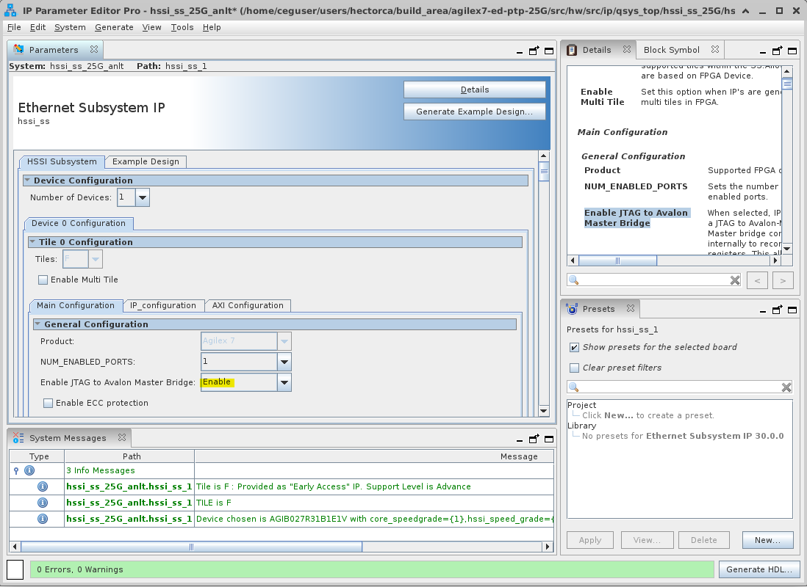

**Figure 11.** Set 'Enable JTAG to Avalon Master Bridge' for the Ethernet Subystem IP.

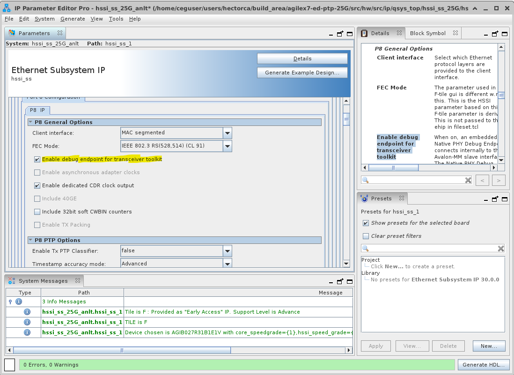

**Figure 12.** Set 'Enable debug endpoint for transceiver toolkit' for both Ethernet Subystem IP ports.


## Reference

- [Ethernet Subsystem FPGA IP User Guide](https://docs.altera.com/r/docs/773413/current)
- [F-Tile Ethernet Hard IP User Guide](https://docs.altera.com/r/docs/683023/current)
- [Ethernet Design Example Components User Guide](https://docs.altera.com/r/docs/683044/current)
- [Embedded Peripherals IP User Guide](https://docs.altera.com/r/docs/683130/current)
- [F-Tile Architecture and PMA and FEC Direct PHY IP User Guide](https://docs.altera.com/r/docs/683872/current)

## Notices & Disclaimers

Altera® Corporation technologies may require enabled hardware, software or service activation. No product or component can be absolutely secure. Performance varies by use, configuration and other factors. Your costs and results may vary. You may not use or facilitate the use of this document in connection with any infringement or other legal analysis concerning Altera or Intel products described herein. You agree to grant Altera Corporation a non-exclusive, royalty-free license to any patent claim thereafter drafted which includes subject matter disclosed herein. No license (express or implied, by estoppel or otherwise) to any intellectual property rights is granted by this document, with the sole exception that you may publish an unmodified copy. You may create software implementations based on this document and in compliance with the foregoing that are intended to execute on the Altera or Intel product(s) referenced in this document. No rights are granted to create modifications or derivatives of this document. The products described may contain design defects or errors known as errata which may cause the product to deviate from published specifications. Current characterized errata are available on request. Altera disclaims all express and implied warranties, including without limitation, the implied warranties of merchantability, fitness for a particular purpose, and non-infringement, as well as any warranty arising from course of performance, course of dealing, or usage in trade. You are responsible for safety of the overall system, including compliance with applicable safety-related requirements or standards. © Altera Corporation. Altera, the Altera logo, and other Altera marks are trademarks of Altera Corporation. Other names and brands may be claimed as the property of others.

OpenCL* and the OpenCL* logo are trademarks of Apple Inc. used by permission of the Khronos Group™.
