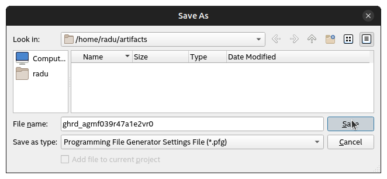
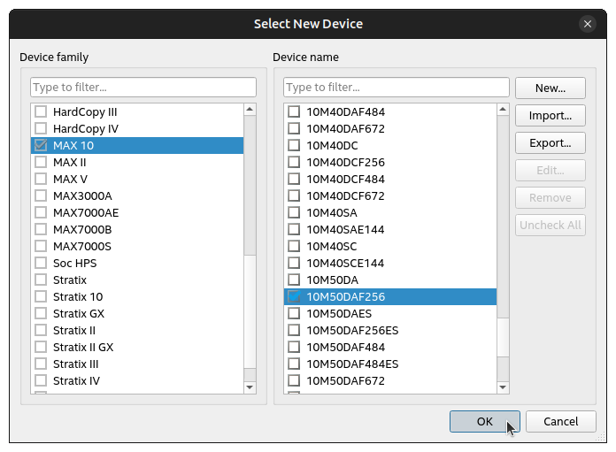
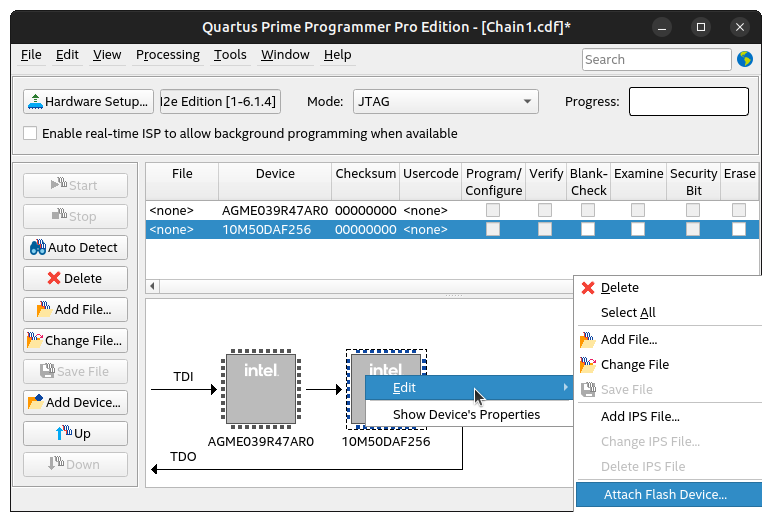
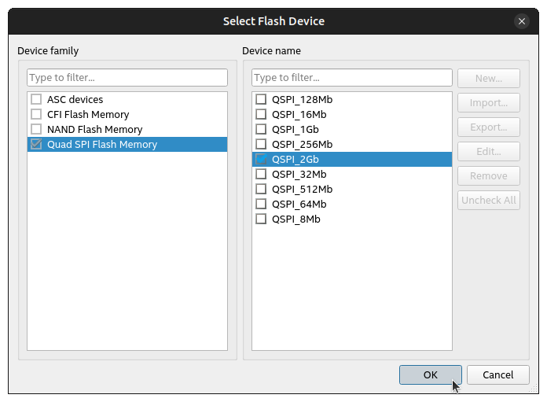
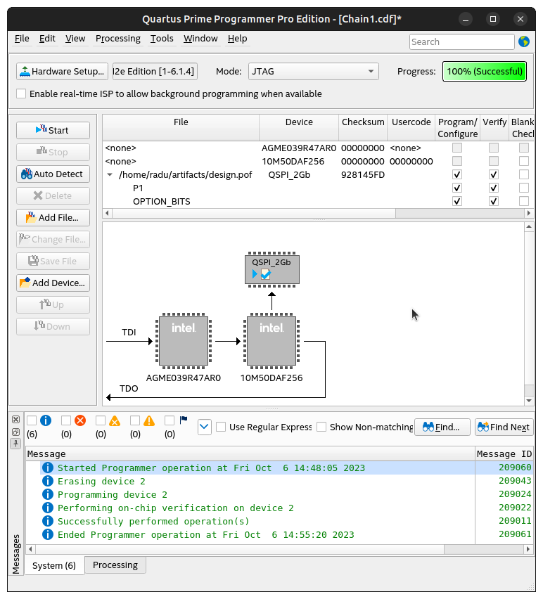

## Overview 

This page presents the Golden System Reference Design for the [Intel Agilex™ 7 FPGA M-Series Development Kit - HBM2e Edition (3x F-Tile & 1x R-Tile)](https://www.intel.com/content/www/us/en/products/details/fpga/development-kits/agilex/agm039.html). The GSRD demonstrates the following: 

- HPS side 
  - Linux, booted by U-Boot and ATF 
  - Board web server 
  - Sample applications 
  - Hello world 
  - System check application 

### Prerequisites 

The following are required in order to be able to fully exercise the GSRD: 

- Intel Agilex™ 7 FPGA M-Series Development Kit - HBM2e Edition (3x F-Tile & 1x R-Tile), ordering code DK-DEV-AGM039FES 
  - SD/MMC HPS Daughtercard 
  - Mini USB cable for serial output 
  - Micro USB cable for on-board Intel FPGA Download Cable II 
  - Micro SD card (4GB or greater) 
- Host PC with 
  - Linux - Ubuntu 22.04LTS was used to create this page, other versions and distributions may work too 
  - Serial terminal (for example Minicom on Linux and TeraTerm or PuTTY on Windows) 
  - Micro SD card slot or Micro SD card writer/reader 
  - Altera&reg; Quartus<sup>&reg;</sup> Prime Pro Edition Version 24.3.1
- Local Ethernet network, with DHCP server (will be used to provide IP address to the board) 

The U-Boot and Linux compilation, Yocto compilation and creating the SD card image require a Linux host PC. The rest of the operations can be performed on either a Windows or Linux host PC. 

### Release Notes 

The Intel FPGA HPS Embedded Software release notes can be accessed from the following link: [https://github.com/altera-opensource/gsrd-socfpga/releases/tag/QPDS24.3.1_REL_GSRD_PR](https://github.com/altera-opensource/gsrd-socfpga/releases/tag/QPDS24.3.1_REL_GSRD_PR)

### Binary Release Contents 

The binary release files are accessible at [https://releases.rocketboards.org/2024.04/gsrd/agilex7_dk_dev_agm039fes_gsrd/](https://releases.rocketboards.org/2025.01/gsrd/agilex7_dk_dev_agm039fes_gsrd/).

The source code is also included on the SD card in the Linux rootfs path `/home/root`: 

| File | Description | 
| :-- | :-- | 
| linux-socfpga-v6.6.51-lts-src.tar.gz | Source code for Linux kernel | 
| u-boot-socfpga-v2024.07-src.tar.gz | Source code for U-Boot | 
| arm-trusted-firmware-v2.11.1-src.tar.gz | Source code for Arm Trusted Firmware | 

Before downloading the hardware design please read the agreement in the link [https://www.intel.com/content/www/us/en/programmable/downloads/software/license/lic-prog_lic.html](https://www.intel.com/content/www/us/en/programmable/downloads/software/license/lic-prog_lic.html)

#### Component Versions

Altera&reg; Quartus<sup>&reg;</sup> Prime Pro Edition Version 24.3.1 and the following software component versions are used to build the GSRD: 

| Component | Location | Branch | Commit ID/Tag |
| :-- | :-- | :-- | :-- |
| GHRD | [https://github.com/altera-opensource/ghrd-socfpga](https://github.com/altera-opensource/ghrd-socfpga) | master | QPDS24.3.1_REL_GSRD_PR |
| Linux | [https://github.com/altera-opensource/linux-socfpga](https://github.com/altera-opensource/linux-socfpga) | socfpga-6.6.51-lts | QPDS24.3.1_REL_GSRD_PR |
| Arm Trusted Firmware | [https://github.com/arm-trusted-firmware](https://github.com/arm-trusted-firmware) | socfpga_v2.11.1 | QPDS24.3.1_REL_GSRD_PR |
| U-Boot | [https://github.com/altera-opensource/u-boot-socfpga](https://github.com/altera-opensource/u-boot-socfpga) | socfpga_v2024.07 | QPDS24.3.1_REL_GSRD_PR |
| Yocto Project | [https://git.yoctoproject.org/poky](https://git.yoctoproject.org/poky) | styhead | latest | 
| Yocto Project: meta-intel-fpga | [https://git.yoctoproject.org/meta-intel-fpga](https://git.yoctoproject.org/meta-intel-fpga) | styhead | latest |
| Yocto Project: meta-intel-fpga-refdes | [https://github.com/altera-opensource/meta-intel-fpga-refdes](https://github.com/altera-opensource/meta-intel-fpga-refdes) | styhead | QPDS24.3.1_REL_GSRD_PR |

## Development Kit 

The Agilex™ 7 M-Series HBM Development Kit is shown below: 

 

Refer to the following for more information about the Development Kit: 

- [Installer Package](https://cdrdv2.intel.com/v1/dl/getContent/792725) 
- [Board User Guide](https://www.intel.com/content/www/us/en/docs/programmable/782461/current.html) 

## Running GSRD with Pre-Built Binaries 

### Booting Linux 

1\. Connect the following cables to the board: 

- Power: from board to power supply 
- HPS UART Console: from vertical mini USB connector on the HPS daughtercard to host PC 
- JTAG: from micro USB cable on edge of the board to host PC 

2\. Download, extract and write to SD card the following SD card image: [https://releases.rocketboards.org/2025.01/gsrd/agilex7_dk_dev_agm039fes_gsrd/sdimage.tar.gz](https://releases.rocketboards.org/2025.01/gsrd/agilex7_dk_dev_agm039fes_gsrd/sdimage.tar.gz). Then insert SD card into the HPS OOBE Daughtercard socket. 

3\. Configure board to the default settings, making sure set S24 dipswitch to OFF-OFF-OFF-ON, to select MSEL=JTAG, so that board does not configure on power up. 

4\. Power up the board 

5\. Download the HPS RBF file and configure the HPS RBF file over JTAG: 

```bash 
wget https://releases.rocketboards.org/2025.01/gsrd/agilex7_dk_dev_agm039fes_gsrd/ghrd.hps.rbf 
quartus_pgm -c 1 -m jtag -o "p;ghrd_agmf039r47a1e2vr0.hps.rbf" 
```

6\. Linux will boot, use 'root' as username to log in, no password will be required. 

### Run Hello World Application 

Change to IntelFPGA folder, and run the hello application, which will display a meesage as shown below: 

```bash 
root@agilex7dkdevagm039fes:~# cd intelFPGA/ 
root@agilex7dkdevagm039fes:~/intelFPGA# ./hello 
Hello SoC FPGA! 
```

### Run SysCheck Application 

Run the SysCheck application: 

```bash 
root@agilex7dkdevagm039fes:~/intelFPGA# ./syschk 
```

It will display some system information: 

```bash 
 ALTERA SYSTEM CHECK 
 
lo : 127.0.0.1 usb1 : DWC OTG Controller 
eth0 : 192.168.1.52 
 serial@ffc02100 : disabled 
hps_led2 : OFF serial@ffc02000 : okay 
hps_led0 : OFF 
hps_led1 : OFF 
```

Press **Q** to exit the appplication. 

### Connect to Web Server 

1\. Boot Linux as described in previous section. 

2\. Determine the IP address of the board using 'ifconfig' as shown above. Note there will be network interfaces of them, either can be used. 

3\. Open a web browser on the host PC and type *http://* on the address box, then type the IP of your board and hit Enter. 

 

**Caution**: The web server is intended to allow users to control FPGA connected LEDs on the board. Due to an issue in this release, this functionality is not yet enabled. It will be enabled in the next release. 

### Connect over SSH 

1\. The lower bottom of the web page presents instructions on how to connect to the board using an SSH connection. 

 

2\. If the SSH client is not installed on your host computer, you can install it by running the following command on CentOS: 

```bash 
$ sudo yum install openssh-clients 
```

or the following command on Ubuntu: 

```bash 
$ sudo apt-get install openssh-client 
```

3\. Connect to the board, and run some commands, such as **pwd**, **ls** and **uname** to see Linux in action: 

```bash 
ssh root@192.168.1.106 
```

 

## Build the GSRD 


### Set up Environment 


Create a top folder for this example, as the rest of the commands assume this location: 


```bash 
sudo rm -rf agilex7m.gsrd 
mkdir agilex7m.gsrd 
cd agilex7m.gsrd 
export TOP_FOLDER=`pwd` 
```


Download the compiler toolchain, add it to the PATH variable, to be used by the GHRD makefile to build the HPS Debug FSBL:


```bash
cd $TOP_FOLDER
wget https://developer.arm.com/-/media/Files/downloads/gnu/11.2-2022.02/binrel/\
gcc-arm-11.2-2022.02-x86_64-aarch64-none-linux-gnu.tar.xz
tar xf gcc-arm-11.2-2022.02-x86_64-aarch64-none-linux-gnu.tar.xz
rm -f gcc-arm-11.2-2022.02-x86_64-aarch64-none-linux-gnu.tar.xz
export PATH=`pwd`/gcc-arm-11.2-2022.02-x86_64-aarch64-none-linux-gnu/bin:$PATH
export ARCH=arm64
export CROSS_COMPILE=aarch64-none-linux-gnu-
```

Enable Quartus tools to be called from command line:


```bash
export QUARTUS_ROOTDIR=~/intelFPGA_pro/24.3.1/quartus/
export PATH=$QUARTUS_ROOTDIR/bin:$QUARTUS_ROOTDIR/linux64:$QUARTUS_ROOTDIR/../qsys/bin:$PATH
```


### Build Hardware Design 


Use the following commands to build the hardware design: 


```bash 
cd $TOP_FOLDER 
rm -rf ghrd-socfpga agilex_soc_devkit_ghrd 
git clone -b QPDS24.3.1_REL_GSRD_PR https://github.com/altera-opensource/ghrd-socfpga 
mv ghrd-socfpga/agilex_soc_devkit_ghrd . 
rm -rf ghrd-socfpga 
cd agilex_soc_devkit_ghrd 
make BOARD_TYPE=devkit_fp82 CONFIG_SCHEME="AVST\ X8" BOARD_PWRMGT=linear ENABLE_HPS_EMIF_ECC=0 ENABLE_WATCHDOG_RST=0 HPS_F2S_IRQ_EN=0 HPS_STM_EN=0 generate_from_tcl all
cd .. 
```


The following files are created: 

- `$TOP_FOLDER/agilex_soc_devkit_ghrd/output_files/ghrd_agmf039r47a1e2vr0.sof` - FPGA configuration file, without HPS FSBL 
- `$TOP_FOLDER/agilex_soc_devkit_ghrd/software/hps_debug/hps_debug.ihex` - HPS Debug FSBL 
- `$TOP_FOLDER/agilex_soc_devkit_ghrd/output_files/ghrd_agmf039r47a1e2vr0_hps_debug.sof` - FPGA configuration file, with HPS Debug FSBL 


### Create Core RBF 


```bash 
cd $TOP_FOLDER 
rm -f *jic* *rbf* 
quartus_pfg -c agilex_soc_devkit_ghrd/output_files/ghrd_agmf039r47a1e2vr0_hps_debug.sof \ 
 ghrd_agmf039r47a1e2vr0.rbf \ 
 -o hps=1 
rm ghrd_agmf039r47a1e2vr0.hps.rbf 
```


The following files will be created: 

- `$TOP_FOLDER/ghrd_agmf039r47a1e2vr0.core.rbf` - HPS First configuration bitstream, phase 2: FPGA fabric 

Note we are also creating an HPS RBF file, but we are discarding it, as it has the HPS Debug FSBL, while the final image needs to have the U-Boot SPL created by the Yocto recipes. 


### Set Up Yocto


1\. Make sure you have Yocto system requirements met: https://docs.yoctoproject.org/5.0.1/ref-manual/system-requirements.html#supported-linux-distributions.

The command to install the required packages on Ubuntu 22.04 is:

```bash
sudo apt-get update
sudo apt-get upgrade
sudo apt-get install openssh-server mc libgmp3-dev libmpc-dev gawk wget git diffstat unzip texinfo gcc \
build-essential chrpath socat cpio python3 python3-pip python3-pexpect xz-utils debianutils iputils-ping \
python3-git python3-jinja2 libegl1-mesa libsdl1.2-dev pylint xterm python3-subunit mesa-common-dev zstd \
liblz4-tool git fakeroot build-essential ncurses-dev xz-utils libssl-dev bc flex libelf-dev bison xinetd \
tftpd tftp nfs-kernel-server libncurses5 libc6-i386 libstdc++6:i386 libgcc++1:i386 lib32z1 \
device-tree-compiler curl mtd-utils u-boot-tools net-tools swig -y
```

On Ubuntu 22.04 you will also need to point the /bin/sh to /bin/bash, as the default is a link to /bin/dash:

```bash
 sudo ln -sf /bin/bash /bin/sh
```

**Note**: You can also use a Docker container to build the Yocto recipes, refer to https://rocketboards.org/foswiki/Documentation/DockerYoctoBuild for details. When using a Docker container, it does not matter what Linux distribution or packages you have installed on your host, as all dependencies are provided by the Docker container.

Then clone the Yocto script and prepare the build: 


```bash 
cd $TOP_FOLDER 
rm -rf gsrd-socfpga 
git clone -b QPDS24.3.1_REL_GSRD_PR  https://github.com/altera-opensource/gsrd-socfpga 
cd gsrd-socfpga 
. agilex7_dk_dev_agm039fes-gsrd-build.sh 
build_setup 
```


### Customize Yocto

1\. Copy the rebuilt files to `$WORKSPACE/meta-intel-fpga-refdes/recipes-bsp/ghrd/files` the name `agilex7_dk_dev_agm039fes_gsrd_ghrd.core.rbf` as expected by the recipes using the following command: 


```bash 
RECIPE=$WORKSPACE/meta-intel-fpga-refdes/recipes-bsp/ghrd/hw-ref-design.bb 
CORE_RBF=$WORKSPACE/meta-intel-fpga-refdes/recipes-bsp/ghrd/files/agilex7_dk_dev_agm039fes_gsrd_ghrd.core.rbf 
ln -s $TOP_FOLDER/ghrd_agmf039r47a1e2vr0.core.rbf $CORE_RBF 
```


2\. In the Yocto recipe `$WORKSPACE/meta-intel-fpga-refdes/recipes-bsp/ghrd/hw-ref-design.bb` modify the agilex_gsrd_code file location to point to the local file: 


```bash 
OLD_URI="\${GHRD_REPO}\/agilex7_dk_dev_agm039fes_gsrd_\${ARM64_GHRD_CORE_RBF};name=agilex7_dk_dev_agm039fes_gsrd_core" 
NEW_URI="file:\/\/agilex7_dk_dev_agm039fes_gsrd_ghrd.core.rbf" 
sed -i "s/$OLD_URI/$NEW_URI/g" $RECIPE 
```


3\. In the same Yocto recipe update the SHA256 checksum for the file: 


```bash 
CORE_SHA=$(sha256sum $CORE_RBF | cut -f1 -d" ") 
OLD_SHA="SRC_URI\[agilex7_dk_dev_agm039fes_gsrd_core\.sha256sum\] = .*" 
NEW_SHA="SRC_URI[agilex7_dk_dev_agm039fes_gsrd_core.sha256sum] = \"$CORE_SHA\"" 
sed -i "s/$OLD_SHA/$NEW_SHA/g" $RECIPE 
```


4\. Optionally change the following files in `$WORKSPACE/meta-intel-fpga-refdes/recipes-bsp/u-boot/files/`: 

- [uboot.txt](https://github.com/altera-opensource/meta-intel-fpga-refdes/blob/master/recipes-bsp/u-boot/files/uboot.txt) - distroboot script 
- [uboot_script.its](https://github.com/altera-opensource/meta-intel-fpga-refdes/blob/master/recipes-bsp/u-boot/files/uboot_script.its) - its file for creating FIT image from the above script 

5\. Optionally change the following file in `$WORKSPACE/meta-intel-fpga-refdes/recipes-kernel/linux/linux-socfpga-lts`: 

- [fit_kernel_agilex7_dk_dev_agm039fes.its](https://github.com/altera-opensource/meta-intel-fpga-refdes/blob/master/recipes-kernel/linux/linux-socfpga-lts/fit_kernel_agilex7_dk_dev_agm039fes.its) - its file for creating the kernel.itb image 

### Build Yocto 

Build Yocto: 


```bash 
bitbake_image 
```


Gather files: 


```bash 
package 
```


Once the build is completed successfully, you will see the following two folders are created: 

- `agilex7_dk_dev_agm039fes-gsrd-rootfs`: area used by OpenEmbedded build system for builds. Description of build directory structure - https://docs.yoctoproject.org/ref-manual/structure.html#the-build-directory-build 
- `agilex7_dk_dev_agm039fes-gsrd-images`: the build script copies here relevant files built by Yocto from the `agilex7_dk_dev_agf027f1es-gsrd-rootfs/tmp/deploy/images/agilex7_dk_dev_agm039fes/` folder, but also other relevant files. 

The two most relevant files created in the `$TOP_FOLDER/gsrd-socfpga/agilex7_dk_dev_agm039fes-gsrd-images` folder are: 

| File | Description | 
| :-- | :-- | 
| sdimage.tar.gz | SD Card Image, to be written on SD card | 
| u-boot-agilex7-socdk-gsrd-atf/u-boot-spl-dtb.hex | U-Boot SPL Hex file, to be used for generating the bootable SOF file | 


### Create Bootable HPS RBF File 


```bash 
cd $TOP_FOLDER 
rm -f *rbf* 
quartus_pfg -c agilex_soc_devkit_ghrd/output_files/ghrd_agmf039r47a1e2vr0.sof \ 
 ghrd_agmf039r47a1e2vr0.rbf \ 
 -o hps_path=gsrd-socfpga/agilex7_dk_dev_agm039fes-gsrd-images/u-boot-agilex7-socdk-gsrd-atf/u-boot-spl-dtb.hex \ 
 -o hps=1 
```


The following files will be created: 

- $TOP_FOLDER/ghrd_agmf039r47a1e2vr0.hps.rbf - RBF file to configure the device for HPS first, phase 1 


## Configure Through AVSTx8 

This section presents the details on how the GSRD can be configured automatically at power up through AVSTx8, instead of using JTAG. 

The required steps are: 

1\. Create the PFG file (optional, PFG file already provided here: [ghrd_agmf039r47a1e2vr0.pfg](https://altera-fpga.github.io/rel-24.3.1/embedded-designs/agilex-7/m-series/hbm2e/collateral/ghrd_agmf039r47a1e2vr0.pfg)) 
2\. Create the POF file, using the above PFG file 
3\. Create the CDF file, used by Quartus Programmer to know how to write the POF file 
4\. Write the the POF file to MAX10 board controller flash, using the Quartus Programmer 
5\. Configure board through AVSTx8 

**Warning**: When using the AVSTx8 configuration method on the DevKit, the 'reboot' command from U-Boot and Linux will not work. This is because the 'reboot' command issues a Cold Reset to HPS, resulting in SDM wiping HPS and waiting for the configuration bitstream to be re-sent through AVSTx8 which is not implemented on this board. In order to make this work you need to inform the external configuration agent to re-send the configuration bitstream once the Cold Reset happens. 

### Create Programmer Generator Configuration for AVSTx8 

The PFG file contains information needed by the Quartus Programming File Generator to create the POF file to be stored on the QSPI flash attached to the MAX 10 board controller. The MAX 10 board controller reads the information from that QSPI file and configures the FPGA device over AVST. 

This section provides the details on how the PFG file is created. A copy of the file is also attached to this page: [ghrd_agmf039r47a1e2vr0.pfg](https://altera-fpga.github.io/rel-24.3.1/embedded-designs/agilex-7/m-series/hbm2e/collateral/ghrd_agmf039r47a1e2vr0.pfg). 

The steps required to create the file are: 

1\. Start Programmer File Generator GUI: 

```bash 
qpfgw & 
```

2\. In the **Output Files** tab: 

- Select **Device family**: Agilex™ 7 
- Select **Configuration mode**: AVSTx8 
- Edit **Name**: ghrd_agmf039r47a1e2vr0 
- Check **Programmer Object File (.pof)** 
- Check **Memory Map File (.map)** 

The window will look similar to this: 

 

3\. Click on the **Input Files** tab, then click on **Add Bitstream...** , then select **Files of type** to be "Raw Binary File (*.rbf)" then browse to the `ghrd_agmf039r47a1e2vr0.hps.rbf` file and click **Open**. 

 

The window will look similar to this: 

 

4\. Go to **Configuration Device** tab, click **Add Device**, select the **CFI_2Gb** option and click **OK**. 

5\. Click on the **OPTIONS** partition to select it, then click the **Edit** button: 

 

6\. In the **Edit Partition** window, select the following: 

- **Address Mode**: Start 
- **Start Address**: 0x00002000 

 

Press **OK**. 

7\. Click on **CFI_2Gb** then click **Add Partition** and select the following: 

- **Name**: P1 
- **Input file**: Bitstream_1 
- **Address mode**: Start 
- **Start address**: 0x00004000 

 

Press **OK**. 

8\. Go to **File** > **Save** menu and save the configuration file as "ghrd_agmf039r47a1e2vr0.pfg" 

 

 

**Note**: The created PFG file contains absolute paths. The attached PFG file was manually edited to use relative paths instead, so it can be used even when moving files in other folders on the host PC. 

9\. At this point you can generate the POF directly by clicking the **Generate** button. 

 

**Caution**: Please use the addresses 0x00002000 for OPTIONS and 0x00004000 for P1, as they are required by the MAX10 board controller. 

### Create POF AVSTx8 Configuration File 

The POF file is created by using the PFG file and running the following command: 

```bash 
cd $TOP_FOLDER 
wget https://altera-fpga.github.io/rel-24.3.1/embedded-designs/agilex-7/m-series/hbm2e/collateral/ghrd_agmf039r47a1e2vr0.pfg
quartus_pfg -c ghrd_agmf039r47a1e2vr0.pfg 
```

The following file is created: 

- $TOP_FOLDER/ghrd_agmf039r47a1e2vr0.pof - contains the MAX 10 flash image required to configure the Agilex™ 7 device over AVST 

### Create CDF Programmer Configuration File 

The provided [ghrd_agmf039r47a1e2vr0.cdf](https://altera-fpga.github.io/rel-24.3.1/embedded-designs/agilex-7/m-series/hbm2e/collateral/ghrd_agmf039r47a1e2vr0.cdf)) file contains the configuration required for the Quartus Programmer to be able to write the POF file to the QSPI attached to the MAX 10 Board Controller. 

This section provides instructions on how this CDF file was created, for reference purposes. 

1\. Set dipswitch S24 to OFF-OFF-OFF-ON so that board configures through JTAG. 

2\. Power up the board 

3\. Start Programmer GUI: 

```bash 
cd $TOP_FOLDER 
quartus_pgmw & 
```

 

4\. In the Programmer window, click on **Hardware Setup** and select the following: 

- **Currently selected hardware**: Intel Agilex™ M-Series Development Kit - HBM2e Edition 
- **Hardware Frequency**: 16000000 

 

Then click **Close**. 

5\. In the **Programmer** window click **Autodetect**, then select either option from the **Select Device** window as shown below: 

 

6\. In the Programmer window, select the **VTAP10** device, then right-click it, and select **Edit** > **Change Device** 

 

Select the **MAX 10** > **10M50DAF256** device then click **OK**. 

 

7\. Right click the MAX10 device, and select **Edit** > **Attach Flash Device** 

 

Select **Quad SPI Flash Memory** > **QSPI_2Gb** option and click **OK** 

 

8\. Right click the **QSPI_2Gb** entry on the top panel, then click **Change File** 

 

Browse to "ghrd_agmf039r47a1e2vr0.pof" and click **Open**. 

9\. In the Programmer window, select the **Program/Configure** and **Verify** checkboxes for both "P1" and "OPTION_BITS" partitions 

 

10\. Go to **File** > **Save** and save the configuration file as "board.cdf" 

**Note**: The output file "ghrd_agmf039r47a1e2vr0.cdf" has an absolute path to the "ghrd_agmf039r47a1e2vr0.pof" file. The provided file was hand edited to use a relative path instead, so files could be located anywhere on the host PC file system. 

11\. At this stage you can also click the **Start** button, for the Programmer to write the file to flash. A progress bar will be shown: 

 

12\. On successfull completion, the Programmer will show 100% completed: 

 

### Write POF File Using the CDF File 

1\. Connect the following cables to the board: 

- Power: from board to power supply 
- JTAG: from micro USB cable on edge of the board to host PC 

2\. Configure board to the default settings, except set S24 dipswitch to OFF-OFF-OFF-ON, to select MSEL=JTAG, so that board does not configure on power up. 

3\. Power up the board 

4\. Make sure you have the following files in the current folder: 

- ghrd_agmf039r47a1e2vr0.cdf 
- ghrd_agmf039r47a1e2vr0.pof 

5\. Run the following command to flash the POF file: 

```bash 
cd $TOP_FOLDER 
wget https://altera-fpga.github.io/rel-24.3.1/embedded-designs/agilex-7/m-series/hbm2e/collateral/ghrd_agmf039r47a1e2vr0.cdf
quartus_pgm ghrd_agmf039r47a1e2vr0.cdf 
```

### Boot Linux 

1\. Power down the board 

2\. Set S24 to ON-OFF-OFF-ON to set MSEL=AVSTx8, so that the FPGA device gets configured with the POF on the next power cycle. 

3\. Power up the board 

4\. FPGA device will get configured, the U-Boot SPL will be ran, then U-Boot and then Linux. Log in with 'root' when prompted, no passowrd will be required, just like when configuring board with the RBF file.

## Notices & Disclaimers

Altera<sup>&reg;</sup> Corporation technologies may require enabled hardware, software or service activation.
No product or component can be absolutely secure. 
Performance varies by use, configuration and other factors.
Your costs and results may vary. 
You may not use or facilitate the use of this document in connection with any infringement or other legal analysis concerning Altera or Intel products described herein. You agree to grant Altera Corporation a non-exclusive, royalty-free license to any patent claim thereafter drafted which includes subject matter disclosed herein.
No license (express or implied, by estoppel or otherwise) to any intellectual property rights is granted by this document, with the sole exception that you may publish an unmodified copy. You may create software implementations based on this document and in compliance with the foregoing that are intended to execute on the Altera or Intel product(s) referenced in this document. No rights are granted to create modifications or derivatives of this document.
The products described may contain design defects or errors known as errata which may cause the product to deviate from published specifications.  Current characterized errata are available on request.
Altera disclaims all express and implied warranties, including without limitation, the implied warranties of merchantability, fitness for a particular purpose, and non-infringement, as well as any warranty arising from course of performance, course of dealing, or usage in trade.
You are responsible for safety of the overall system, including compliance with applicable safety-related requirements or standards. 
<sup>&copy;</sup> Altera Corporation.  Altera, the Altera logo, and other Altera marks are trademarks of Altera Corporation.  Other names and brands may be claimed as the property of others. 

OpenCL* and the OpenCL* logo are trademarks of Apple Inc. used by permission of the Khronos Group™. 