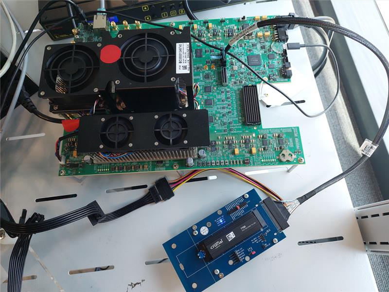
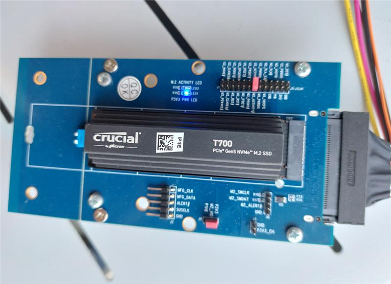
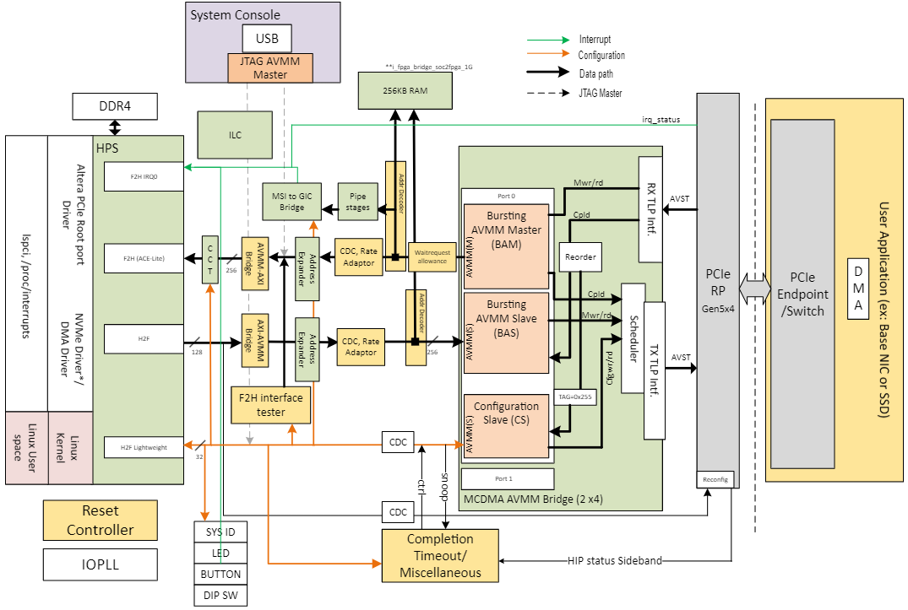
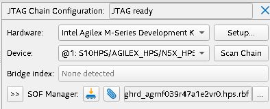

 

 

 

 


## Summary

PCIe root port is the downstream port of Root Complex which establish the PCIe link with any PCIe Endpoint or PCIe Bridge.

This reference design demonstrates a PCIe root port running on Altera® Agilex™ 7 FPGA M-Series FPGA Transceiver-SoC Development Kit connected to end point. A Gen5x4 link is shown.

Refer to the [GitHub repository](https://github.com/altera-fpga/agilex7-ed-pcie-rp) for the Quartus Project and Yocto Project files.

## Required Components

- Root Port Host Board.
  * Agilex™ 7 FPGA M-Series Development Kit – HBM2e.

- Hardware needed for End Point.
  * PCI Express NVMe Gen 5.0 x4 M.2 SSD[^1]
  * PCIe Gen5 capable x4 U.2 to M.2 Adapter
  * PCIe Gen5 MCIO x4 for U.2 2x2 Dual Port[^2]
- [Pre-compiled Software/Firmware](https://github.com/altera-fpga/agilex7-ed-pcie-rp/releases/tag/24.3-rc1).

- Tools and software.
  * System with supported Linux distribution with Ubuntu 22.04 (LTS)
  * Altera® Quartus® Prime Design Suite software 24.3 version 
  * Serial terminal application such as Putty


{ width="700"}

*Full setup with the Agilex™ 7 FPGA M-Series Development Kit – HBM2e, MCIO cables, adapter & NVMe.


{ width="500"}

*NVMe connected to the U.2 to M.2 adapter.


## Helpful Reference Documentation 

* [Altera® Agilex ® 7 FPGA M-Series Development Kit – HBM2e](https://www.intel.com/content/www/us/en/products/details/fpga/development-kits/agilex/agm039.html)

* [Multi Channel DMA Altera® FPGA IP for PCI Express User Guide](https://www.intel.com/content/www/us/en/docs/programmable/683821/24-2/before-you-begin.html)

* [R-Tile Avalon® Altera® FPGA IP for PCI Express](https://www.intel.com/content/www/us/en/docs/programmable/683501/24-3/about-the-r-tile-streaming-fpga-ip-for.html)

 

## Build Agilex PCIe Root Port 

Here are the steps to build either SW and HW files:

- [SW_Readme](https://github.com/altera-fpga/agilex7-ed-pcie-rp/blob/main/src/sw/README.md)
- [HW_Readme](https://github.com/altera-fpga/agilex7-ed-pcie-rp/tree/main/src/hw)

Both links show how to build the files needed for the project, acording with the [Altera® SoC FPGA Golden Software Reference Design (GSRD)](https://github.com/altera-opensource/gsrd-socfpga)

## Hardware Description




### Memory Map

#### HPS H2F Memory Map
| Address Offset | Size (Bytes) | Peripheral      | Remarks         |
|----------------|--------------|-----------------|-----------------|
|0x80000000      |256K          |On Chip Memory   |Block memory implemented in the FPGA fabric|
|0x90000000      |256M          |BAS              |	Avalon MM Slave of PCIe BAS port|
|0xA0000000      |2M            |PCIe HIP Reconfig|Avalon MM Slave of PCIe HIP Reconfiguration port|

#### HPS LWH2F Memory Map
| Address Offset | Size (Bytes) | Peripheral      | Remarks         |
|----------------|--------------|-----------------|-----------------|
|0xF9000000      |8             |System ID        |Hardware configuration system ID|
|0xF9001080      |16            |LED PIO          ||
|0xF9001060      |16            |Button PIO       |Push Button|
|0xF9001070      |16            |DIPSW PIO        |DIP Switch|
|0xF9001100      |256           |ILC              |Interrupt Latency Counter|
|0xF9010000      |32k           |PCIe CRA         |Avalon MM Slave of PCIe HIP CRA port|
|0xF9018000      |128           |MSI-to-GIC Vector||
|0xF9018080      |16            |MSI-to-GIC CSR   |Avalon MM Slave of MSI-to-GIC CSR port|
|0xF90180A0      |32            |Performance Counter|Hardware timer for benchmarking purposes|
|0xF9000210      |8             |CCT              |	Cache Coherent Translator CSR for changing AxCACHE/PROT/DOMAIN signals of ACE-Lite |
|0xF9000300      |32            |F2H interface tester|HPS can indirectly initiate F2H request through LW H2F interface. |
|0xF9001070      |16            |DIPSW PIO        |DIP Switch|
|0xF90180C0      |256           |AVMM CS Cpl TimeOut & System level Reg. map |Error registers along with Timeout values |


#### PCIe BAM interface
| Address Offset | Size (Bytes) | Peripheral      | Remarks         |
|----------------|--------------|-----------------|-----------------|
|0x80000000      |256k          |On Chip Memory   |Block memory implemented in the FPGA fabric|
|0xF9018000      |128           |MSI-to-GIC Vector||
|0x00000000      |8G            |HPS F2H          | HPS FPGA to HPS interface (SDRAM access)|

## Run Example

The instructions from this section present how to get the boot up process of the PCIe Root Port:

* Load the [hps.rbf](https://github.com/altera-fpga/agilex7-ed-pcie-rp/releases/download/24.3-1/agilex7_dk_dev_agm039fes_rped_ghrd.hps.rbf) file

	Using command line: 
	
	```bash
	quartus_pgm -c 1 -m jtag -o p;MY_DESIGN.hps.rbf@1
	```
	Using the Altera® Quartus ®Prime Programer 24.3 version GUI:
	
	
	
    


* Open the Putty serial terminal, it will show a partial bootup process
  

!!! Info "Console Output:"

    ```bash
    U-Boot SPL 2024.04 (Oct 16 2024 - 02:54:45 +0000)
    Reset state: Cold
    MPU     1200000 kHz
    L4 Main    400000 kHz
    L4 sys free  100000 kHz
    L4 MP     200000 kHz
    L4 SP     100000 kHz
    SDMMC     50000 kHz
    DDR: Populating DDR handoff
    populate_ddr_handoff: MPFE-EMIF is in multichannel mode
    populate_ddr_handoff: Memory type is DDR
    populate_ddr_handoff: IO96B 0xf8400000 CSR enabled
    populate_ddr_handoff: returned num_instance 0x1
    DDR: Address MPFE 0xf8020000
    is_ddr_init_hang: 0x0
    DDR: SDRAM init in progress ...
    DDR: MPFE configuration in progress ...
    config_mpfe_sideband_mgr: F2SDRAM_SIDEBAND_FLAGOUTSTATUS0: 0x110
    config_mpfe_sideband_mgr: Multichannel bit is set
    DDR: MPFE configuration completed
    DDR: Waiting for NOCPLL locked ...
    DDR: NOCPLL locked
    DDR: Checking calibration...
    io96b_cal_status: Calibration for IO96B instance 0xf8400400 done at 7641 msec!
    init_mem_cal: Initial DDR calibration IO96B_0 succeed
    io96b_mb_init: num_instance 1
    io96b_mb_init: get memory interface IO96B 0
    io96b_mb_req: Write 0x10001 to IOSSM_CMD_REQ_OFFSET 0xf840043c
    io96b_mb_req: CMD_RESPONSE_STATUS 0xf840045c: 0x10001
    io96b_mb_req: IOSSM_CMD_RESPONSE_DATA_0_OFFSET 0xf8400458: 0x20000000
    io96b_mb_req: IOSSM_CMD_RESPONSE_DATA_1_OFFSET 0xf8400454: 0x0
    io96b_mb_req: CMD_RESPONSE_STATUS 0xf840045c: 0x10001
    io96b_mb_req: CMD_RESPONSE_READY 0xf840045c: 0x10000
    io96b_mb_init: get response from memory interface IO96B 0
    io96b_mb_init: IO96B 0: num_mem_interface: 0x1
    io96b_mb_init: IO96B 0 mem_interface 0: ip_type_ret: 0x1
    io96b_mb_init: IO96B 0 mem_interface 0: instance_id_ret: 0x0
    DDR: Calibration success
    io96b_mb_req: Write 0x20020002 to IOSSM_CMD_REQ_OFFSET 0xf840043c
    io96b_mb_req: CMD_RESPONSE_STATUS 0xf840045c: 0x10001
    io96b_mb_req: CMD_RESPONSE_STATUS 0xf840045c: 0x10001
    io96b_mb_req: CMD_RESPONSE_READY 0xf840045c: 0x10000
    io96b_mb_req: Write 0x20020004 to IOSSM_CMD_REQ_OFFSET 0xf840043c
    io96b_mb_req: CMD_RESPONSE_STATUS 0xf840045c: 0x1
    io96b_mb_req: IOSSM_CMD_RESPONSE_DATA_0_OFFSET 0xf8400458: 0x120
    io96b_mb_req: IOSSM_CMD_RESPONSE_DATA_1_OFFSET 0xf8400454: 0x20
    io96b_mb_req: CMD_RESPONSE_STATUS 0xf840045c: 0x1
    io96b_mb_req: CMD_RESPONSE_READY 0xf840045c: 0x0
    DDR: Warning: DRAM size from device tree (2048 MiB)
     mismatch with hardware (4096 MiB).
    DDR5: 2048 MiB
    io96b_mb_req: Write 0x20040102 to IOSSM_CMD_REQ_OFFSET 0xf840043c
    io96b_mb_req: CMD_RESPONSE_STATUS 0xf840045c: 0x1
    io96b_mb_req: CMD_RESPONSE_STATUS 0xf840045c: 0x1
    io96b_mb_req: CMD_RESPONSE_READY 0xf840045c: 0x0
    ecc_enable_status: ECC enable status: 0
    DDR5: size check success
    DDR5: firewall init success
    DDR5 init success
    WDT:  Started watchdog@ffd00200 with servicing every 1000ms (10s timeout)
    denali-nand-dt nand@ffb90000: timeout while waiting for irq 0x2000
    denali-nand-dt nand@ffb90000: reset not completed.
    Trying to boot from MMC1
      
    \## Checking hash(es) for config board-0 ... OK
    \## Checking hash(es) for Image atf ... crc32+ OK
    \## Checking hash(es) for Image uboot ... crc32+ OK
    \## Checking hash(es) for Image fdt-0 ... crc32+ OK
      
    NOTICE: BL31: v2.10.0 (release):v2.3-6541-gdc434c310
    NOTICE: BL31: Built : 01:18:01, Jan 26 2024
      
    U-Boot 2023.10 (Feb 02 2024 - 07:15:25 +0000)socfpga_agilex7
    CPU:  Altera® FPGA SoCFPGA Platform (ARMv8 64bit Cortex-A53)
    Model: SoCFPGA Agilex7-M SoCDK
    DRAM: 2 GiB
    Core: 27 devices, 22 uclasses, devicetree: separate
    WDT:  Started watchdog@ffd00200 with servicing every 1000ms (10s timeout)
    NAND: denali-nand-dt nand@ffb90000: timeout while waiting for irq 0x2000
    denali-nand-dt nand@ffb90000: reset not completed.
    Failed to initialize Denali NAND controller. (error -5)
    0 MiB
    MMC:  dwmmc0@ff808000: 0
    Loading Environment from FAT... Unable to read "uboot.env" from mmc0:1...
    Loading Environment from UBI... denali-nand-dt nand@ffb90000: timeout while waiting for irq 0x2000
    denali-nand-dt nand@ffb90000: reset not completed.
    Could not find a valid device for ffb90000.nand.0
    Partition root not found!
      
    ** Cannot find mtd partition "root"
      
    In:  serial0@ffc02000
    Out:  serial0@ffc02000
    Err:  serial0@ffc02000
    Net:
    Warning: ethernet@ff800000 (eth0) using random MAC address - e6:80:0a:7c:d8:14
    eth0: ethernet@ff800000
    Hit any key to stop autoboot: 0
    ```


* Load the [core.rbf](https://github.com/altera-fpga/agilex7-ed-pcie-rp/releases/download/24.3-1/agilex7_dk_dev_agm039fes_rped_ghrd.core.rbf) file.

```bash
dhcp $loadaddr XX.XXX.XXX.XX:your_reposiroty_path/image_256mps.core.rbf;
```

!!! Info "Console Output:"

    ```bash
    Speed: 1000, full duplex
    BOOTP broadcast 1
    BOOTP broadcast 2
    BOOTP broadcast 3
    DHCP client bound to address 10.244.177.41 (984 ms)
    Using ethernet@ff800000 device
    TFTP from server XX.XXX.XXX.XX; our IP address is XX.XXX.XXX.XX
    Filename 'your_reposiroty_path/image_256mps.core.rbf'.
    Load address: 0x2000000
    Loading: #################################################################
         #################################################################
         #################################################################
         #################################################################
         #################################################################
         #################################################################
         #################################################################
         #################################################################
         #################################################################
         ###
         8.7 MiB/s
    done
    Bytes transferred = 8617984 (838000 hex)
    ```


* Enable the bridge with the following command: 

```bash
dcache flush; fpga load 0 $loadaddr $filesize; bridge enable;
```

!!! Info "Console Output:"

    ```bash
    .........FPGA reconfiguration OK!
    ```


* Execute the following commands to load the kernel.itb:

    ```bash
    * SOCFPGA_AGILEX7 # setenv bootargs earlycon panic=-1 root=/dev/mmcblk0p2 rw rootwait;
    * SOCFPGA_AGILEX7 # dhcp $loadaddr XX.XXX.XXX.XX:your_reposiroty_path/image_256mps/kernel.itb-775d75991e1d;
    ```

!!! Info "Console Output:"

    ```bash
    Speed: 1000, full duplex
    BOOTP broadcast 1
    DHCP client bound to address XX.XXX.XXX.XX (108 ms)
    Using ethernet@ff800000 device
    TFTP from server XX.XXX.XXX.XX; our IP address is XX.XXX.XXX.XX
    Filename 'your_reposiroty_path/image_256mps/kernel.itb-775d75991e1d'.
    Load address: 0x2000000
    Loading: #################################################################
     #################################################################
     #################################################################
     #################################################################
     #################################################################
     #################################################################
     #################################################################
     #################################################################
     #################################################################
     #################################################################
     ##########################################
     8.7 MiB/s
    done
    Bytes transferred = 10148942 (9adc4e hex)
    ```


* Execute this `bootm ${loadaddr}#board-2;` to start the bootup process
  At the end type `root`

```bash
    SOCFPGA_AGILEX7 # bootm ${loadaddr}#board-2;
```

  At the end type `root`

```bash
    agilex7dkdevagm039fes login: root
```

!!! Info  "Console Output:"

    ```bash
    Loading kernel from FIT Image at 02000000 ...
    
       Using 'board-2' configuration
       Verifying Hash Integrity ... OK
       Trying 'kernel' kernel subimage
         Description:  Linux Kernel
         Type:         Kernel Image
         Compression:  lzma compressed
         Data Start:   0x020000dc
         Data Size:    10127394 Bytes = 9.7 MiB
         Architecture: AArch64
         OS:           Linux
         Load Address: 0x06000000
         Entry Point:  0x06000000
         Hash algo:    crc32
         Hash value:   ce31562a
       Verifying Hash Integrity ... crc32+ OK
    
    Loading fdt from FIT Image at 02000000 ...
    
       Using 'board-2' configuration
       Verifying Hash Integrity ... OK
      Trying 'fdt-4' fdt subimage
         Description:  socfpga_socdk_combined
         Type:         Flat Device Tree
         Compression:  uncompressed
         Data Start:   0x029a89e4
         Data Size:    19670 Bytes = 19.2 KiB
         Architecture: AArch64
         Hash algo:    crc32
         Hash value:   53ebb81a
       Verifying Hash Integrity ... crc32+ OK
       Booting using the fdt blob at 0x29a89e4
     Working FDT set to 29a89e4
       Uncompressing Kernel Image
       Loading Device Tree to 000000007eada000, end 000000007eae1cd5 ... OK
    Working FDT set to 7eada000
    
    Starting kernel ...
    
    Deasserting all peripheral resets
    [    0.000000] Booting Linux on physical CPU 0x0000000000 [0x410fd034]
    [    0.000000] Linux version 6.6.51-altera-g775d75991e1d (pcolberg@ttolabhlds034u.tor.altera.com) (aarch64-poky-linux-gcc (GCC) 13.3.0, GNU ld (GNU Binutils) 2.42.0.20240716) #15 SMP PREEMPT Fri Nov 22 23:34:36 UTC 2024
    [    0.000000] KASLR disabled due to lack of seed
    [    0.000000] Machine model: SoCFPGA Agilex7-M SoCDK
    [    0.000000] efi: UEFI not found.
    [    0.000000] Reserved memory: created DMA memory pool at 0x0000000000000000, size 32 MiB
    [    0.000000] OF: reserved mem: initialized node svcbuffer@0, compatible id shared-dma-pool
    [    0.000000] OF: reserved mem: 0x0000000000000000..0x0000000001ffffff (32768 KiB) nomap non-reusable svcbuffer@0
    [    0.000000] earlycon: uart0 at MMIO32 0x00000000ffc02000 (options '115200n8')
    [    0.000000] printk: bootconsole [uart0] enabled
    [    0.000000] NUMA: No NUMA configuration found
    [    0.000000] NUMA: Faking a node at [mem 0x0000000000000000-0x000000007fffffff]
    [    0.000000] NUMA: NODE_DATA [mem 0x7fbf19c0-0x7fbf3fff]
    [    0.000000] Zone ranges:
    [    0.000000]   DMA      [mem 0x0000000000000000-0x000000007fffffff]
    [    0.000000]   DMA32    empty
    [    0.000000]   Normal   empty
    [    0.000000] Movable zone start for each node
    [    0.000000] Early memory node ranges
    [    0.000000]   node   0: [mem 0x0000000000000000-0x0000000001ffffff]
    [    0.000000]   node   0: [mem 0x0000000002000000-0x000000007fffffff]
    [    0.000000] Initmem setup node 0 [mem 0x0000000000000000-0x000000007fffffff]
    [    0.000000] cma: Reserved 32 MiB at 0x000000007aa00000 on node -1
    [    0.000000] psci: probing for conduit method from DT.
    [    0.000000] psci: PSCIv1.1 detected in firmware.
    [    0.000000] psci: Using standard PSCI v0.2 function IDs
    [    0.000000] psci: MIGRATE_INFO_TYPE not supported.
    [    0.000000] psci: SMC Calling Convention v1.4
    [    0.000000] percpu: Embedded 22 pages/cpu s50792 r8192 d31128 u90112
    [    0.000000] Detected VIPT I-cache on CPU0
    [    0.000000] CPU features: detected: ARM erratum 845719
    [    0.000000] alternatives: applying boot alternatives
    [    0.000000] Kernel command line: earlycon panic=-1 root=/dev/mmcblk0p2 rw rootwait
    [    0.000000] Dentry cache hash table entries: 262144 (order: 9, 2097152 bytes, linear)
    [    0.000000] Inode-cache hash table entries: 131072 (order: 8, 1048576 bytes, linear)
    [    0.000000] Fallback order for Node 0: 0
    [    0.000000] Built 1 zonelists, mobility grouping on.  Total pages: 516096
    [    0.000000] Policy zone: DMA
    [    0.000000] mem auto-init: stack:all(zero), heap alloc:off, heap free:off
    [    0.000000] software IO TLB: area num 4.
    [    0.000000] software IO TLB: mapped [mem 0x0000000076a00000-0x000000007aa00000] (64MB)
    [    0.000000] Memory: 1882196K/2097152K available (17600K kernel code, 4282K rwdata, 10816K rodata, 9280K init, 608K bss, 182188K reserved, 32768K cma-reserved)
    [    0.000000] SLUB: HWalign=64, Order=0-3, MinObjects=0, CPUs=4, Nodes=1
    [    0.000000] rcu: Preemptible hierarchical RCU implementation.
    [    0.000000] rcu:     RCU event tracing is enabled.
    [    0.000000] rcu:     RCU restricting CPUs from NR_CPUS=256 to nr_cpu_ids=4.
    [    0.000000]  Trampoline variant of Tasks RCU enabled.
    [    0.000000]  Tracing variant of Tasks RCU enabled.
    [    0.000000] rcu: RCU calculated value of scheduler-enlistment delay is 25 jiffies.
    [    0.000000] rcu: Adjusting geometry for rcu_fanout_leaf=16, nr_cpu_ids=4
    [    0.000000] NR_IRQS: 64, nr_irqs: 64, preallocated irqs: 0
    [    0.000000] Root IRQ handler: gic_handle_irq
    [    0.000000] GIC: Using split EOI/Deactivate mode
    [    0.000000] rcu: srcu_init: Setting srcu_struct sizes based on contention.
    [    0.000000] arch_timer: cp15 timer(s) running at 400.00MHz (phys).
    [    0.000000] clocksource: arch_sys_counter: mask: 0x7ffffffffffffff max_cycles: 0x5c4093a7d1, max_idle_ns: 440795210635 ns
    [    0.000001] sched_clock: 59 bits at 400MHz, resolution 2ns, wraps every 4398046511103ns
    [    0.008926] Console: colour dummy device 80x25
    [    0.013367] printk: console [tty0] enabled
    [    0.017459] printk: bootconsole [uart0] disabled
    [    0.000000] Booting Linux on physical CPU 0x0000000000 [0x410fd034]
    [    0.000000] Linux version 6.6.51-altera-g775d75991e1d (pcolberg@ttolabhlds034u.tor.altera.com) (aarch64-poky-linux-gcc (GCC) 13.3.0, GNU ld (GNU Binutils) 2.42.0.20240716) #15 SMP PREEMPT Fri Nov 22 23:34:36 UTC 2024
    [    0.000000] KASLR disabled due to lack of seed
    [    0.000000] Machine model: SoCFPGA Agilex7-M SoCDK
    [    0.000000] efi: UEFI not found.
    [    0.000000] Reserved memory: created DMA memory pool at 0x0000000000000000, size 32 MiB
    [    0.000000] OF: reserved mem: initialized node svcbuffer@0, compatible id shared-dma-pool
    [    0.000000] OF: reserved mem: 0x0000000000000000..0x0000000001ffffff (32768 KiB) nomap non-reusable svcbuffer@0
    [    0.000000] earlycon: uart0 at MMIO32 0x00000000ffc02000 (options '115200n8')
    [    0.000000] printk: bootconsole [uart0] enabled
    [    0.000000] NUMA: No NUMA configuration found
    [    0.000000] NUMA: Faking a node at [mem 0x0000000000000000-0x000000007fffffff]
    [    0.000000] NUMA: NODE_DATA [mem 0x7fbf19c0-0x7fbf3fff]
    [    0.000000] Zone ranges:
    [    0.000000]   DMA      [mem 0x0000000000000000-0x000000007fffffff]
    [    0.000000]   DMA32    empty
    [    0.000000]   Normal   empty
    [    0.000000] Movable zone start for each node
    [    0.000000] Early memory node ranges
    [    0.000000]   node   0: [mem 0x0000000000000000-0x0000000001ffffff]
    [    0.000000]   node   0: [mem 0x0000000002000000-0x000000007fffffff]
    [    0.000000] Initmem setup node 0 [mem 0x0000000000000000-0x000000007fffffff]
    [    0.000000] cma: Reserved 32 MiB at 0x000000007aa00000 on node -1
    [    0.000000] psci: probing for conduit method from DT.
    [    0.000000] psci: PSCIv1.1 detected in firmware.
    [    0.000000] psci: Using standard PSCI v0.2 function IDs
    [    0.000000] psci: MIGRATE_INFO_TYPE not supported.
    [    0.000000] psci: SMC Calling Convention v1.4
    [    0.000000] percpu: Embedded 22 pages/cpu s50792 r8192 d31128 u90112
    [    0.000000] Detected VIPT I-cache on CPU0
    [    0.000000] CPU features: detected: ARM erratum 845719
    [    0.000000] alternatives: applying boot alternatives
    [    0.000000] Kernel command line: earlycon panic=-1 root=/dev/mmcblk0p2 rw rootwait
    [    0.000000] Dentry cache hash table entries: 262144 (order: 9, 2097152 bytes, linear)
    [    0.000000] Inode-cache hash table entries: 131072 (order: 8, 1048576 bytes, linear)
    [    0.000000] Fallback order for Node 0: 0
    [    0.000000] Built 1 zonelists, mobility grouping on.  Total pages: 516096
    [    0.000000] Policy zone: DMA
    [    0.000000] mem auto-init: stack:all(zero), heap alloc:off, heap free:off
    [    0.000000] software IO TLB: area num 4.
    [    0.000000] software IO TLB: mapped [mem 0x0000000076a00000-0x000000007aa00000] (64MB)
    [    0.000000] Memory: 1882196K/2097152K available (17600K kernel code, 4282K rwdata, 10816K rodata, 9280K init, 608K bss, 182188K reserved, 32768K cma-reserved)
    [    0.000000] SLUB: HWalign=64, Order=0-3, MinObjects=0, CPUs=4, Nodes=1
    [    0.000000] rcu: Preemptible hierarchical RCU implementation.
    [    0.000000] rcu:     RCU event tracing is enabled.
    [    0.000000] rcu:     RCU restricting CPUs from NR_CPUS=256 to nr_cpu_ids=4.
    [    0.000000]  Trampoline variant of Tasks RCU enabled.
    [    0.000000]  Tracing variant of Tasks RCU enabled.
    [    0.000000] rcu: RCU calculated value of scheduler-enlistment delay is 25 jiffies.
    [    0.000000] rcu: Adjusting geometry for rcu_fanout_leaf=16, nr_cpu_ids=4
    [    0.000000] NR_IRQS: 64, nr_irqs: 64, preallocated irqs: 0
    [    0.000000] Root IRQ handler: gic_handle_irq
    [    0.000000] GIC: Using split EOI/Deactivate mode
    [    0.000000] rcu: srcu_init: Setting srcu_struct sizes based on contention.
    [    0.000000] arch_timer: cp15 timer(s) running at 400.00MHz (phys).
    [    0.000000] clocksource: arch_sys_counter: mask: 0x7ffffffffffffff max_cycles: 0x5c4093a7d1, max_idle_ns: 440795210635 ns
    [    0.000001] sched_clock: 59 bits at 400MHz, resolution 2ns, wraps every 4398046511103ns
    [    0.008926] Console: colour dummy device 80x25
    [    0.013367] printk: console [tty0] enabled
    [    0.017459] printk: bootconsole [uart0] disabled
    [    0.022166] Calibrating delay loop (skipped), value calculated using timer frequency.. 800.00 BogoMIPS (lpj=1600000)
    [    0.022190] pid_max: default: 32768 minimum: 301
    [    0.022274] LSM: initializing lsm=capability,integrity
    [    0.022381] Mount-cache hash table entries: 4096 (order: 3, 32768 bytes, linear)
    [    0.022405] Mountpoint-cache hash table entries: 4096 (order: 3, 32768 bytes, linear)
    [    0.023515] cacheinfo: Unable to detect cache hierarchy for CPU 0
    [    0.024210] RCU Tasks: Setting shift to 2 and lim to 1 rcu_task_cb_adjust=1.
    [    0.024299] RCU Tasks Trace: Setting shift to 2 and lim to 1 rcu_task_cb_adjust=1.
    [    0.024499] rcu: Hierarchical SRCU implementation.
    [    0.024511] rcu:     Max phase no-delay instances is 1000.
    [    0.025712] EFI services will not be available.
    [    0.025931] smp: Bringing up secondary CPUs ...
    [    0.026524] Detected VIPT I-cache on CPU1
    [    0.026622] CPU1: Booted secondary processor 0x0000000001 [0x410fd034]
    [    0.027181] Detected VIPT I-cache on CPU2
    [    0.027224] CPU2: Booted secondary processor 0x0000000002 [0x410fd034]
    [    0.027713] Detected VIPT I-cache on CPU3
    [    0.027752] CPU3: Booted secondary processor 0x0000000003 [0x410fd034]
    [    0.027816] smp: Brought up 1 node, 4 CPUs
    [    0.027866] SMP: Total of 4 processors activated.
    [    0.027878] CPU features: detected: 32-bit EL0 Support
    [    0.027888] CPU features: detected: 32-bit EL1 Support
    [    0.027901] CPU features: detected: CRC32 instructions
    [    0.027983] CPU: All CPU(s) started at EL2
    [    0.028018] alternatives: applying system-wide alternatives
    [    0.031080] devtmpfs: initialized
    [    0.035508] clocksource: jiffies: mask: 0xffffffff max_cycles: 0xffffffff, max_idle_ns: 7645041785100000 ns
    [    0.035545] futex hash table entries: 1024 (order: 4, 65536 bytes, linear)
    [    0.036766] pinctrl core: initialized pinctrl subsystem
    [    0.038462] DMI not present or invalid.
    [    0.039280] NET: Registered PF_NETLINK/PF_ROUTE protocol family
    [    0.040479] DMA: preallocated 256 KiB GFP_KERNEL pool for atomic allocations
    [    0.040654] DMA: preallocated 256 KiB GFP_KERNEL|GFP_DMA pool for atomic allocations
    [    0.040851] DMA: preallocated 256 KiB GFP_KERNEL|GFP_DMA32 pool for atomic allocations
    [    0.040918] audit: initializing netlink subsys (disabled)
    [    0.041085] audit: type=2000 audit(0.032:1): state=initialized audit_enabled=0 res=1
    [    0.042216] thermal_sys: Registered thermal governor 'step_wise'
    [    0.042223] thermal_sys: Registered thermal governor 'power_allocator'
    [    0.042286] cpuidle: using governor menu
    [    0.042494] hw-breakpoint: found 6 breakpoint and 4 watchpoint registers.
    [    0.042591] ASID allocator initialised with 65536 entries
    [    0.044541] Serial: AMBA PL011 UART driver
    [    0.055361] Modules: 22080 pages in range for non-PLT usage
    [    0.055374] Modules: 513600 pages in range for PLT usage
    [    0.056321] HugeTLB: registered 1.00 GiB page size, pre-allocated 0 pages
    [    0.056351] HugeTLB: 0 KiB vmemmap can be freed for a 1.00 GiB page
    [    0.056364] HugeTLB: registered 32.0 MiB page size, pre-allocated 0 pages
    [    0.056376] HugeTLB: 0 KiB vmemmap can be freed for a 32.0 MiB page
    [    0.056388] HugeTLB: registered 2.00 MiB page size, pre-allocated 0 pages
    [    0.056399] HugeTLB: 0 KiB vmemmap can be freed for a 2.00 MiB page
    [    0.056411] HugeTLB: registered 64.0 KiB page size, pre-allocated 0 pages
    [    0.056422] HugeTLB: 0 KiB vmemmap can be freed for a 64.0 KiB page
    [    0.058251] ACPI: Interpreter disabled.
    [    0.060000] iommu: Default domain type: Translated
    [    0.060014] iommu: DMA domain TLB invalidation policy: strict mode
    [    0.060304] SCSI subsystem initialized
    [    0.060677] usbcore: registered new interface driver usbfs
    [    0.060716] usbcore: registered new interface driver hub
    [    0.060754] usbcore: registered new device driver usb
    [    0.060880] usb_phy_generic usbphy: dummy supplies not allowed for exclusive requests
    [    0.061530] pps_core: LinuxPPS API ver. 1 registered
    [    0.061543] pps_core: Software ver. 5.3.6 - Copyright 2005-2007 Rodolfo Giometti <giometti@linux.it>
    [    0.061568] PTP clock support registered
    [    0.061696] EDAC MC: Ver: 3.0.0
    [    0.063944] stratix10-svc soc:firmware:svc: Failed to get IRQ, falling back to polling mode
    [    0.064081] Intel Service Layer Driver Initialized
    [    0.064241] scmi_core: SCMI protocol bus registered
    [    0.064875] FPGA manager framework
    [    0.065013] Advanced Linux Sound Architecture Driver Initialized.
    [    0.066115] vgaarb: loaded
    [    0.066565] clocksource: Switched to clocksource arch_sys_counter
    [    0.066832] VFS: Disk quotas dquot_6.6.0
    [    0.066874] VFS: Dquot-cache hash table entries: 512 (order 0, 4096 bytes)
    [    0.067086] pnp: PnP ACPI: disabled
    [    0.073349] NET: Registered PF_INET protocol family
    [    0.073554] IP idents hash table entries: 32768 (order: 6, 262144 bytes, linear)
    [    0.075189] tcp_listen_portaddr_hash hash table entries: 1024 (order: 2, 16384 bytes, linear)
    [    0.075267] Table-perturb hash table entries: 65536 (order: 6, 262144 bytes, linear)
    [    0.075291] TCP established hash table entries: 16384 (order: 5, 131072 bytes, linear)
    [    0.075414] TCP bind hash table entries: 16384 (order: 7, 524288 bytes, linear)
    [    0.075959] TCP: Hash tables configured (established 16384 bind 16384)
    [    0.076093] UDP hash table entries: 1024 (order: 3, 32768 bytes, linear)
    [    0.076148] UDP-Lite hash table entries: 1024 (order: 3, 32768 bytes, linear)
    [    0.076298] NET: Registered PF_UNIX/PF_LOCAL protocol family
    [    0.076671] RPC: Registered named UNIX socket transport module.
    [    0.076686] RPC: Registered udp transport module.
    [    0.076697] RPC: Registered tcp transport module.
    [    0.076706] RPC: Registered tcp-with-tls transport module.
    [    0.076716] RPC: Registered tcp NFSv4.1 backchannel transport module.
    [    0.076744] PCI: CLS 0 bytes, default 64
    [    0.077250] kvm [1]: IPA Size Limit: 40 bits
    [    0.079438] kvm [1]: vgic interrupt IRQ9
    [    0.079495] kvm [1]: Hyp mode initialized successfully
    [    0.080895] Initialise system trusted keyrings
    [    0.081059] workingset: timestamp_bits=42 max_order=19 bucket_order=0
    [    0.081399] squashfs: version 4.0 (2009/01/31) Phillip Lougher
    [    0.081630] NFS: Registering the id_resolver key type
    [    0.081680] Key type id_resolver registered
    [    0.081691] Key type id_legacy registered
    [    0.081720] nfs4filelayout_init: NFSv4 File Layout Driver Registering...
    [    0.081735] nfs4flexfilelayout_init: NFSv4 Flexfile Layout Driver Registering...
    [    0.081771] jffs2: version 2.2. (NAND) © 2001-2006 Red Hat, Inc.
    [    0.081966] 9p: Installing v9fs 9p2000 file system support
    [    0.115568] Key type asymmetric registered
    [    0.115583] Asymmetric key parser 'x509' registered
    [    0.115652] Block layer SCSI generic (bsg) driver version 0.4 loaded (major 245)
    [    0.115670] io scheduler mq-deadline registered
    [    0.115683] io scheduler kyber registered
    [    0.115726] io scheduler bfq registered
    [    0.121214] pinctrl-single ffd13000.pinctrl: 40 pins, size 160
    [    0.121359] pinctrl-single ffd13100.pinconf: 8 pins, size 32
    [    0.125742] altera-pcie 90100000.pcie: host bridge /soc/bridge@80000000/pcie@200000000 ranges:
    [    0.125798] altera-pcie 90100000.pcie:      MEM 0x0090100000..0x009fffffff -> 0x0000100000
    [    0.126237] altera-pcie 90100000.pcie: PCI host bridge to bus 0000:00
    [    0.126257] pci_bus 0000:00: root bus resource [bus 00-ff]
    [    0.126275] pci_bus 0000:00: root bus resource [mem 0x90100000-0x9fffffff] (bus address [0x00100000-0x0fffffff])
    [    0.126350] pci 0000:00:00.0: [1172:0000] type 01 class 0x060400
    [    0.126541] pci 0000:00:00.0: PME# supported from D0 D3hot
    [    0.127615] pci 0000:00:00.0: bridge configuration invalid ([bus 00-00]), reconfiguring
    [    0.127786] pci 0000:01:00.0: [c0a9:5419] type 00 class 0x010802
    [    0.127865] pci 0000:01:00.0: reg 0x10: [mem 0x00000000-0x00003fff 64bit]
    [    0.128007] pci 0000:01:00.0: Max Payload Size set to 256 (was 128, max 256)
    [    0.129341] pci_bus 0000:01: busn_res: [bus 01-ff] end is updated to 01
    [    0.129386] pci 0000:00:00.0: BAR 14: assigned [mem 0x90100000-0x901fffff]
    [    0.129407] pci 0000:01:00.0: BAR 0: assigned [mem 0x90100000-0x90103fff 64bit]
    [    0.129454] pci 0000:00:00.0: PCI bridge to [bus 01]
    [    0.129469] pci 0000:00:00.0:   bridge window [mem 0x90100000-0x901fffff]
    [    0.129578] pcieport 0000:00:00.0: enabling device (0000 -> 0002)
    [    0.130830] EINJ: ACPI disabled.
    [    0.152869] Serial: 8250/16550 driver, 4 ports, IRQ sharing enabled
    [    0.156015] ffc02000.serial: ttyS0 at MMIO 0xffc02000 (irq = 20, base_baud = 6250000) is a 16550A
    [    0.156106] printk: console [ttyS0] enabled
    [    1.285528] SuperH (H)SCI(F) driver initialized
    [    1.290489] msm_serial: driver initialized
    [    1.295191] STM32 USART driver initialized
    [    1.305512] loop: module loaded
    [    1.309768] megasas: 07.725.01.00-rc1
    [    1.314875] nvme nvme0: pci function 0000:01:00.0
    [    1.319645] nvme 0000:01:00.0: enabling device (0000 -> 0002)
    [    1.320875] tun: Universal TUN/TAP device driver, 1.6
    [    1.331262] thunder_xcv, ver 1.0
    [    1.334508] thunder_bgx, ver 1.0
    [    1.337764] nicpf, ver 1.0
    [    1.341534] hns3: Hisilicon Ethernet Network Driver for Hip08 Family - version
    [    1.348747] hns3: Copyright (c) 2017 Huawei Corporation.
    [    1.354095] hclge is initializing
    [    1.357450] e1000: Intel(R) PRO/1000 Network Driver
    [    1.362325] e1000: Copyright (c) 1999-2006 Intel Corporation.
    [    1.368091] e1000e: Intel(R) PRO/1000 Network Driver
    [    1.373053] e1000e: Copyright(c) 1999 - 2015 Intel Corporation.
    [    1.379011] igb: Intel(R) Gigabit Ethernet Network Driver
    [    1.384403] igb: Copyright (c) 2007-2014 Intel Corporation.
    [    1.389996] igbvf: Intel(R) Gigabit Virtual Function Network Driver
    [    1.392510] nvme nvme0: 4/0/0 default/read/poll queues
    [    1.396242] igbvf: Copyright (c) 2009 - 2012 Intel Corporation.
    [    1.396546] sky2: driver version 1.30
    [    1.412652] socfpga-dwmac ff800000.ethernet: IRQ eth_wake_irq not found
    [    1.419285] socfpga-dwmac ff800000.ethernet: IRQ eth_lpi not found
    [    1.425852] socfpga-dwmac ff800000.ethernet: User ID: 0x11, Synopsys ID: 0x37
    [    1.432983] socfpga-dwmac ff800000.ethernet:         DWMAC1000
    [    1.438208] socfpga-dwmac ff800000.ethernet: DMA HW capability register supported
    [    1.445675] socfpga-dwmac ff800000.ethernet: RX Checksum Offload Engine supported
    [    1.453139] socfpga-dwmac ff800000.ethernet: COE Type 2
    [    1.458354] socfpga-dwmac ff800000.ethernet: TX Checksum insertion supported
    [    1.465386] socfpga-dwmac ff800000.ethernet: Enhanced/Alternate descriptors
    [    1.472336] socfpga-dwmac ff800000.ethernet: Enabled extended descriptors
    [    1.479109] socfpga-dwmac ff800000.ethernet: Ring mode enabled
    [    1.484930] socfpga-dwmac ff800000.ethernet: Enable RX Mitigation via HW Watchdog Timer
    [    1.497288] usbcore: registered new device driver r8152-cfgselector
    [    1.503615] usbcore: registered new interface driver r8152
    [    1.509117] usbcore: registered new interface driver asix
    [    1.514535] usbcore: registered new interface driver ax88179_178a
    [    1.520636] usbcore: registered new interface driver cdc_ether
    [    1.526478] usbcore: registered new interface driver net1080
    [    1.532145] usbcore: registered new interface driver cdc_subset
    [    1.538072] usbcore: registered new interface driver zaurus
    [    1.543665] usbcore: registered new interface driver cdc_ncm
    [    1.549334] usbcore: registered new interface driver r8153_ecm
    [    1.556391] dwc2 ffb00000.usb: supply vusb_d not found, using dummy regulator
    [    1.563656] dwc2 ffb00000.usb: supply vusb_a not found, using dummy regulator
    [    1.571092] dwc2 ffb00000.usb: EPs: 16, dedicated fifos, 8064 entries in SPRAM
    [    1.578476] dwc2 ffb00000.usb: DWC OTG Controller
    [    1.583197] dwc2 ffb00000.usb: new USB bus registered, assigned bus number 1
    [    1.590249] dwc2 ffb00000.usb: irq 27, io mem 0xffb00000
    [    1.596269] hub 1-0:1.0: USB hub found
    [    1.600056] hub 1-0:1.0: 1 port detected
    [    1.606070] usbcore: registered new interface driver usb-storage
    [    1.614754] i2c_dev: i2c /dev entries driver
    [    1.626658] sdhci: Secure Digital Host Controller Interface driver
    [    1.632856] sdhci: Copyright(c) Pierre Ossman
    [    1.637836] Synopsys Designware Multimedia Card Interface Driver
    [    1.644227] dw_mmc ff808000.mmc: IDMAC supports 32-bit address mode.
    [    1.644680] sdhci-pltfm: SDHCI platform and OF driver helper
    [    1.650592] dw_mmc ff808000.mmc: Using internal DMA controller.
    [    1.662134] dw_mmc ff808000.mmc: Version ID is 280a
    [    1.662181] ledtrig-cpu: registered to indicate activity on CPUs
    [    1.667055] dw_mmc ff808000.mmc: DW MMC controller at irq 29,32 bit host data width,1024 deep fifo
    [    1.682002] SMCCC: SOC_ID: ARCH_SOC_ID not implemented, skipping ....
    [    1.682127] mmc_host mmc0: card is polling.
    [    1.693005] usbcore: registered new interface driver usbhid
    [    1.698574] usbhid: USB HID core driver
    [    1.705252] mmc_host mmc0: Bus speed (slot 0) = 50000000Hz (slot req 400000Hz, actual 396825HZ div = 63)
    [    1.714924] hw perfevents: enabled with armv8_pmuv3 PMU driver, 7 counters available
    [    1.727618] NET: Registered PF_PACKET protocol family
    [    1.732794] 9pnet: Installing 9P2000 support
    [    1.737152] Key type dns_resolver registered
    [    1.752012] registered taskstats version 1
    [    1.756353] Loading compiled-in X.509 certificates
    [    1.763052] mmc_host mmc0: Bus speed (slot 0) = 50000000Hz (slot req 50000000Hz, actual 50000000HZ div = 0)
    [    1.772884] mmc0: new high speed SDHC card at address 0001
    [    1.776251] dma-pl330 ffda0000.dma-controller: Loaded driver for PL330 DMAC-341330
    [    1.779157] mmcblk0: mmc0:0001 SD32G 28.8 GiB
    [    1.786045] dma-pl330 ffda0000.dma-controller:       DBUFF-512x8bytes Num_Chans-8 Num_Peri-32 Num_Events-8
    [    1.792465]  mmcblk0: p1 p2
    [    1.805891] of_cfs_init
    [    1.808434] of_cfs_init: OK
    [    1.811357] clk: Disabling unused clocks
    [    1.815340] ALSA device list:
    [    1.818302]   No soundcards found.
    [    1.821978] dw-apb-uart ffc02000.serial: forbid DMA for kernel console
    [    2.022277] EXT4-fs (mmcblk0p2): recovery complete
    [    2.029042] EXT4-fs (mmcblk0p2): mounted filesystem b684fca7-9a42-4537-ac5a-b4e272d39764 r/w with ordered data mode. Quota mode: none.
    [    2.041217] VFS: Mounted root (ext4 filesystem) on device 179:2.
    [    2.048274] devtmpfs: mounted
    [    2.054974] Freeing unused kernel memory: 9280K
    [    2.059698] Run /sbin/init as init process
    [    2.536036] systemd[1]: System time before build time, advancing clock.
    [    2.614649] systemd[1]: systemd 254.4^ running in system mode (-PAM -AUDIT -SELINUX -APPARMOR +IMA -SMACK +SECCOMP -GCRYPT -GNUTLS -OPENSSL +ACL +BLKID -CURL -ELFUTILS -FIDO2 -IDN2 -IDN -IPTC +KMOD -LIBCRYPTSETUP +LIBFDISK -PCRE2 -PWQUALITY -P11KIT -QRENCODE -TPM2 -BZIP2 -LZ4 -XZ -ZLIB +ZSTD -BPF_FRAMEWORK +XKBCOMMON +UTMP +SYSVINIT default-hierarchy=hybrid)
    [    2.646357] systemd[1]: Detected architecture arm64.
    
    Welcome to Poky (Yocto Project Reference Distro) 4.3.2 (nanbield)!
    
    [    2.704251] systemd[1]: Hostname set to <agilex7dkdevagm039fes>.
    [    3.067248] systemd[1]: Binding to IPv6 address not available since kernel does not support IPv6.
    [    3.076203] systemd[1]: Binding to IPv6 address not available since kernel does not support IPv6.
    [    3.286463] systemd[1]: Queued start job for default target Multi-User System.
    [    3.334952] systemd[1]: Created slice Slice /system/getty.
    [  OK  ] Created slice Slice /system/getty.
    [    3.360519] systemd[1]: Created slice Slice /system/modprobe.
    [  OK  ] Created slice Slice /system/modprobe.
    [    3.384329] systemd[1]: Created slice Slice /system/serial-getty.
    [  OK  ] Created slice Slice /system/serial-getty.
    [    3.407915] systemd[1]: Created slice User and Session Slice.
    [  OK  ] Created slice User and Session Slice.
    [    3.422955] systemd[1]: Started Dispatch Password Requests to Console Directory Watch.
    [  OK  ] Started Dispatch Password Requests to Console Directory Watch.
    [    3.442811] systemd[1]: Started Forward Password Requests to Wall Directory Watch.
    [  OK  ] Started Forward Password Requests to Wall Directory Watch.
    [    3.458865] systemd[1]: Reached target Host and Network Name Lookups.
    [  OK  ] Reached target Host and Network Name Lookups.
    [    3.474666] systemd[1]: Reached target Path Units.
    [  OK  ] Reached target Path Units.
    [    3.490702] systemd[1]: Reached target Remote File Systems.
    [  OK  ] Reached target Remote File Systems.
    [    3.506668] systemd[1]: Reached target Slice Units.
    [  OK  ] Reached target Slice Units.
    [    3.522695] systemd[1]: Reached target Swaps.
    [  OK  ] Reached target Swaps.
    [    3.569547] systemd[1]: Listening on RPCbind Server Activation Socket.
    [  OK  ] Listening on RPCbind Server Activation Socket.
    [    3.594896] systemd[1]: Reached target RPC Port Mapper.
    [  OK  ] Reached target RPC Port Mapper.
    [    3.612611] systemd[1]: Listening on Syslog Socket.
    [  OK  ] Listening on Syslog Socket.
    [    3.627013] systemd[1]: Listening on initctl Compatibility Named Pipe.
    [  OK  ] Listening on initctl Compatibility Named Pipe.
    [    3.643693] systemd[1]: Listening on Journal Audit Socket.
    [  OK  ] Listening on Journal Audit Socket.
    [    3.659044] systemd[1]: Listening on Journal Socket (/dev/log).
    [  OK  ] Listening on Journal Socket (/dev/log).
    [    3.675164] systemd[1]: Listening on Journal Socket.
    [  OK  ] Listening on Journal Socket.
    [    3.691248] systemd[1]: Listening on Network Service Netlink Socket.
    [  OK  ] Listening on Network Service Netlink Socket.
    [    3.708105] systemd[1]: Listening on udev Control Socket.
    [  OK  ] Listening on udev Control Socket.
    [    3.723011] systemd[1]: Listening on udev Kernel Socket.
    [  OK  ] Listening on udev Kernel Socket.
    [    3.739057] systemd[1]: Listening on User Database Manager Socket.
    [  OK  ] Listening on User Database Manager Socket.
    [    3.779054] systemd[1]: Mounting Huge Pages File System...
         Mounting Huge Pages File System...
    [    3.799738] systemd[1]: Mounting POSIX Message Queue File System...
         Mounting POSIX Message Queue File System...
    [    3.819915] systemd[1]: Mounting Kernel Debug File System...
         Mounting Kernel Debug File System...
    [    3.843323] systemd[1]: Kernel Trace File System was skipped because of an unmet condition check (ConditionPathExists=/sys/kernel/tracing).
    [    3.862150] systemd[1]: Mounting Temporary Directory /tmp...
         Mounting Temporary Directory /tmp...
    [    3.883327] systemd[1]: Create List of Static Device Nodes was skipped because of an unmet condition check (ConditionFileNotEmpty=/lib/modules/6.6.51-altera-g775d75991e1d/modules.devname).
    [    3.923396] systemd[1]: Starting Load Kernel Module configfs...
         Starting Load Kernel Module configfs...
    [    3.944273] systemd[1]: Starting Load Kernel Module drm...
         Starting Load Kernel Module drm...
    [    3.964514] systemd[1]: Starting Load Kernel Module fuse...
         Starting Load Kernel Module fuse...
    [    3.985756] systemd[1]: Starting RPC Bind...
         Starting RPC Bind...
    [    3.999048] systemd[1]: File System Check on Root Device was skipped because of an unmet condition check (ConditionPathIsReadWrite=!/).
    [    4.019226] systemd[1]: Starting Journal Service...
             Starting Journal Service...
    [    4.060980] systemd[1]: Load Kernel Modules was skipped because no trigger condition checks were met.
    [    4.103545] systemd[1]: Starting Generate network units from Kernel command line...
             Starting Generate network units from Kernel command line...
         [    4.115775] systemd-journald[99]: Collecting audit messages is enabled.
    
    [    4.140329] systemd[1]: Starting Remount Root and Kernel File Systems...
         Starting Remount Root and Kernel File Systems...
    [    4.168742] systemd[1]: Starting Apply Kernel Variables...
         Starting Apply Kernel Variables...
    [    4.201209] systemd[1]: Starting Create Static Device Nodes in /dev gracefully...
         Starting Create Static Device Nodes in /dev gracefully...
    [    4.210386] EXT4-fs (mmcblk0p2): re-mounted b684fca7-9a42-4537-ac5a-b4e272d39764 r/w. Quota mode: none.
    [    4.232859] systemd[1]: Starting Coldplug All udev Devices...
         Starting Coldplug All udev Devices...
    [    4.263193] systemd[1]: Started RPC Bind.
    [  OK  ] Started RPC Bind.
    [    4.283708] systemd[1]: Started Journal Service.
    [  OK  ] Started Journal Service.
    [  OK  ] Mounted Huge Pages File System.
    [  OK  ] Mounted POSIX Message Queue File System.
    [  OK  ] Mounted Kernel Debug File System.
    [  OK  ] Mounted Temporary Directory /tmp.
    [  OK  ] Finished Load Kernel Module configfs.
    [  OK  ] Finished Load Kernel Module drm.
    [  OK  ] Finished Load Kernel Module fuse.
    [  OK  ] Finished Generate network units from Kernel command line.
    [  OK  ] Finished Remount Root and Kernel File Systems.
    [  OK  ] Finished Apply Kernel Variables.
    [  OK  ] Finished Create Static Device Nodes in /dev gracefully.
             Mounting Kernel Configuration File System...
             Starting Flush Journal to Persistent Storage...
             Starting Create Static Device Nodes in /dev...
    [    4.592047] systemd-journald[99]: Received client request to flush runtime journal.
    [  OK  ] Mounted Kernel Configuration File System.
    [  OK  ] Finished Flush Journal to Persistent Storage.
    [  OK  ] Finished Create Static Device Nodes in /dev.
    [  OK  ] Reached target Preparation for Local File Systems.
             Mounting /var/volatile...
    [    4.749948] audit: type=1334 audit(1695209006.208:2): prog-id=5 op=LOAD
    [    4.756672] audit: type=1334 audit(1695209006.216:3): prog-id=6 op=LOAD
             Starting Rule-based Manager for Device Events and Files...
    [  OK  ] Mounted /var/volatile.
             Starting Load/Save OS Random Seed...
    [  OK  ] Reached target Local File Systems.
             Starting Create Volatile Files and Directories...
    [  OK  ] Finished Create Volatile Files and Directories.
    [  OK  ] Started Rule-based Manager for Device Events and Files.
             Starting Network Time Synchronization...
             Starting Record System Boot/Shutdown in UTMP...
    [    5.062903] audit: type=1334 audit(1695209006.516:4): prog-id=7 op=LOAD
    [    5.070543] audit: type=1334 audit(1695209006.516:5): prog-id=8 op=LOAD
            Starting User Database Manager...
    [  OK  ] Finished Record System Boot/Shutdown in UTMP.
    [  OK  ] Finished Coldplug All udev Devices.
    [  OK  ] Started User Database Manager.
    [  OK  ] Started Network Time Synchronization.
    [  OK  ] Reached target System Initialization.
    [  OK  ] Started Daily Cleanup of Temporary Directories.
    [  OK  ] Reached target System Time Set.
    [  OK  ] Reached target Timer Units.
    [  OK  ] Listening on Avahi mDNS/DNS-SD Stack Activation Socket.
    [    5.770646] random: crng init done
    [  OK  ] Listening on D-Bus System Message Bus Socket.
            Starting sshd.socket...
    [  OK  ] Finished Load/Save OS Random Seed.
    [  OK  ] Listening on sshd.socket.
    [  OK  ] Reached target Socket Units.
    [  OK  ] Reached target Basic System.
    [  OK  ] Started Kernel Logging Service.
    [  OK  ] Started System Logging Service.
            Starting D-Bus System Message Bus...
            Starting Applying Altera base device tree overlay...
    [  OK  ] Started Getty on tty1.
            Starting IPv6 Packet Filtering Framework...
            Starting IPv4 Packet Filtering Framework...
            Starting Lighttpd Daemon...
            Starting LSB: NFS support for both client and server...
            Starting Telephony service...
    [  OK  ] Started Serial Getty on ttyS0.
    [  OK  ] Reached target Login Prompts.
             Starting Altera SoCFPGA GSRD initialization...
    [    6.350702] audit: type=1334 audit(1706434961.744:6): prog-id=9 op=LOAD
    [    6.357503] audit: type=1334 audit(1706434961.752:7): prog-id=10 op=LOAD
            Starting User Login Management...
            Starting OpenSSH Key Generation...
    [  OK  ] Started D-Bus System Message Bus.
    [  OK  ] Finished Applying Altera base device tree overlay.
    [  OK  ] Finished IPv6 Packet Filtering Framework.
    [  OK  ] Finished IPv4 Packet Filtering Framework.
    [  OK  ] Started Lighttpd Daemon.
    [  OK  ] Started LSB: NFS support for both client and server.
    [  OK  ] Reached target Preparation for Network.
    [  OK  ] Reached target Hardware activated USB gadget.
            Starting Connection service...
            Starting Network Configuration...
            Starting Virtual Console Setup...
    [  OK  ] Started User Login Management.
    [  OK  ] Started Telephony service.
    [  OK  ] Finished OpenSSH Key Generation.
    [  OK  ] Started Connection service.
    [  OK  ] Finished Virtual Console Setup.
            Starting Avahi mDNS/DNS-SD Stack...
    [  OK  ] Started Network Configuration.
    [  OK  ] Reached target Network.
    [    7.055515] socfpga-dwmac ff800000.ethernet eth0: Register MEM_TYPE_PAGE_POOL RxQ-0
    [  OK  ] Started Avahi mDNS/DNS-SD Stack.
    [    7.134673] socfpga-dwmac ff800000.ethernet eth0: PHY [stmmac-0:04] driver [Micrel KSZ9031 Gigabit PHY] (irq=POLL)
    [    7.155129] socfpga-dwmac ff800000.ethernet eth0: No Safety Features support found
    [    7.162757] socfpga-dwmac ff800000.ethernet eth0: IEEE 1588-2008 Advanced Timestamp supported
    [    7.171682] socfpga-dwmac ff800000.ethernet eth0: registered PTP clock
    [    7.178777] socfpga-dwmac ff800000.ethernet eth0: configuring for phy/rgmii link mode
             Starting WPA supplicant...
    [    7.616327] audit: type=1334 audit(1706434963.012:8): prog-id=11 op=LOAD
    [    7.623165] audit: type=1334 audit(1706434963.020:9): prog-id=12 op=LOAD
             Starting Hostname Service...
    [  OK  ] Started WPA supplicant.
    [  OK  ] Started Hostname Service.
    [   10.243439] socfpga-dwmac ff800000.ethernet eth0: Link is Up - 1Gbps/Full - flow control off
    
    Poky (Yocto Project Reference Distro) 4.3.2 agilex7dkdevagm039fes ttyS0
    
    agilex7dkdevagm039fes login: root
    ```


* Execute the `lspci` command to display information about all PCI devices on the system

    ```bash
    lspci
    ```
    

!!! Info "Console Output:"
    
    
    ```bash
    user@agilex7dkdevagm039fes:~# lspci
    00:00.0 PCI bridge: Altera Corporation Device 0000 (rev 01)
    01:00.0 Non-Volatile memory controller: Micron/Crucial Technology Device 5419
    ```

There you will see both PCIe devices Rootport(00:00.0) & End Point(01:00.0)


* Run the following command to retrieve detailed information about the Agilex 7 M-Series PCIe Root Port:

    ```bash
    lspci -vvv -s 00:00.0
    ```

!!! Info "Console Output:"

    ```bash
    00:00.0 PCI bridge: Altera Corporation Device 0000 (rev 01) (prog-if 00 [Normal decode])
    Control: I/O- Mem+ BusMaster+ SpecCycle- MemWINV- VGASnoop- ParErr- Stepping- SERR- FastB2B- DisINTx-
    Status: Cap+ 66MHz- UDF- FastB2B- ParErr- DEVSEL=fast >TAbort- <TAbort- <MAbort- >SERR- <PERR- INTx-
    Latency: 0
    Interrupt: pin A routed to IRQ 0
    Bus: primary=00, secondary=01, subordinate=01, sec-latency=0
    I/O behind bridge: 0000f000-00000fff [disabled] [32-bit]
    Memory behind bridge: 90100000-901fffff [size=1M] [32-bit]
    Prefetchable memory behind bridge: 00000000fff00000-00000000000fffff [disabled] [64-bit]
    Secondary status: 66MHz- FastB2B- ParErr- DEVSEL=fast >TAbort- <TAbort- <MAbort- <SERR- <PERR-
    BridgeCtl: Parity- SERR+ NoISA- VGA- VGA16- MAbort- >Reset- FastB2B-
            PriDiscTmr- SecDiscTmr- DiscTmrStat- DiscTmrSERREn-
    Capabilities: [40] Power Management version 3
            Flags: PMEClk- DSI- D1- D2- AuxCurrent=0mA PME(D0+,D1-,D2-,D3hot+,D3cold-)
            Status: D0 NoSoftRst- PME-Enable- DSel=0 DScale=0 PME-
    Capabilities: [70] Express (v2) Root Port (Slot-), MSI 00
            DevCap: MaxPayload 256 bytes, PhantFunc 0
                    ExtTag+ RBE+
            DevCtl: CorrErr+ NonFatalErr+ FatalErr+ UnsupReq+
                    RlxdOrd+ ExtTag+ PhantFunc- AuxPwr- NoSnoop+
                    MaxPayload 256 bytes, MaxReadReq 512 bytes
            DevSta: CorrErr- NonFatalErr- FatalErr- UnsupReq- AuxPwr+ TransPend-
            LnkCap: Port #1, Speed 32GT/s, Width x4, ASPM not supported
                    ClockPM- Surprise- LLActRep+ BwNot+ ASPMOptComp+
            LnkCtl: ASPM Disabled; RCB 64 bytes, Disabled- CommClk-
                    ExtSynch- ClockPM- AutWidDis- BWInt+ AutBWInt+
            LnkSta: Speed 32GT/s, Width x4
                    TrErr- Train- SlotClk- DLActive+ BWMgmt- ABWMgmt+
            RootCap: CRSVisible+
            RootCtl: ErrCorrectable- ErrNon-Fatal- ErrFatal- PMEIntEna- CRSVisible+
            RootSta: PME ReqID 0000, PMEStatus- PMEPending-
            DevCap2: Completion Timeout: Range ABCD, TimeoutDis+ NROPrPrP+ LTR+
                     10BitTagComp+ 10BitTagReq+ OBFF Not Supported, ExtFmt+ EETLPPrefix+, MaxEETLPPrefixes 1
                     EmergencyPowerReduction Not Supported, EmergencyPowerReductionInit-
                     FRS- LN System CLS Not Supported, TPHComp+ ExtTPHComp- ARIFwd+
                     AtomicOpsCap: Routing+ 32bit+ 64bit+ 128bitCAS+
            DevCtl2: Completion Timeout: 50us to 50ms, TimeoutDis- LTR+ 10BitTagReq- OBFF Disabled, ARIFwd+
                     AtomicOpsCtl: ReqEn- EgressBlck-
            LnkCap2: Supported Link Speeds: 2.5-32GT/s, Crosslink- Retimer+ 2Retimers+ DRS-
            LnkCtl2: Target Link Speed: 32GT/s, EnterCompliance- SpeedDis-
                     Transmit Margin: Normal Operating Range, EnterModifiedCompliance- ComplianceSOS-
                     Compliance Preset/De-emphasis: -6dB de-emphasis, 0dB preshoot
            LnkSta2: Current De-emphasis Level: -6dB, EqualizationComplete+ EqualizationPhase1+
                     EqualizationPhase2+ EqualizationPhase3+ LinkEqualizationRequest-
                     Retimer- 2Retimers- CrosslinkRes: Downstream Port
    Capabilities: [100 v2] Advanced Error Reporting
            UESta:  DLP- SDES- TLP- FCP- CmpltTO- CmpltAbrt- UnxCmplt- RxOF- MalfTLP- ECRC- UnsupReq- ACSViol-
            UEMsk:  DLP- SDES- TLP- FCP- CmpltTO- CmpltAbrt- UnxCmplt- RxOF- MalfTLP- ECRC- UnsupReq- ACSViol-
            UESvrt: DLP+ SDES+ TLP- FCP+ CmpltTO- CmpltAbrt- UnxCmplt- RxOF+ MalfTLP+ ECRC- UnsupReq- ACSViol-
            CESta:  RxErr- BadTLP- BadDLLP- Rollover- Timeout- AdvNonFatalErr-
            CEMsk:  RxErr- BadTLP- BadDLLP- Rollover- Timeout- AdvNonFatalErr+
            AERCap: First Error Pointer: 00, ECRCGenCap+ ECRCGenEn- ECRCChkCap+ ECRCChkEn-
                    MultHdrRecCap- MultHdrRecEn- TLPPfxPres- HdrLogCap-
            HeaderLog: 00000000 00000000 00000000 00000000
            RootCmd: CERptEn- NFERptEn- FERptEn-
            RootSta: CERcvd- MultCERcvd- UERcvd- MultUERcvd-
                     FirstFatal- NonFatalMsg- FatalMsg- IntMsg 0
            ErrorSrc: ERR_COR: 0000 ERR_FATAL/NONFATAL: 0000
    Capabilities: [148 v1] Virtual Channel
            Caps:   LPEVC=0 RefClk=100ns PATEntryBits=1
            Arb:    Fixed- WRR32- WRR64- WRR128-
            Ctrl:   ArbSelect=Fixed
            Status: InProgress-
            VC0:    Caps:   PATOffset=00 MaxTimeSlots=1 RejSnoopTrans-
                    Arb:    Fixed- WRR32- WRR64- WRR128- TWRR128- WRR256-
                    Ctrl:   Enable+ ID=0 ArbSelect=Fixed TC/VC=ff
                    Status: NegoPending- InProgress-
    Capabilities: [184 v1] Secondary PCI Express
            LnkCtl3: LnkEquIntrruptEn- PerformEqu-
            LaneErrStat: 0
    Capabilities: [1a4 v1] Physical Layer 16.0 GT/s <?>
    Capabilities: [1cc v1] Lane Margining at the Receiver <?>
    Capabilities: [1f4 v1] Extended Capability ID 0x2a
    Capabilities: [46c v1] Data Link Feature <?>
    ```


* Run the following command to retrieve detailed information about the NVMe PCIe Gen5 EP:

    ```bash
    lspci -vvv -s 01:00.0
    ```

!!! Info "Console Output:"

    ```bash
    01:00.0 Non-Volatile memory controller: Micron/Crucial Technology Device 5419 (prog-if 02 [NVM Express])
        Subsystem: Micron/Crucial Technology Device 2100
        Control: I/O- Mem+ BusMaster+ SpecCycle- MemWINV- VGASnoop- ParErr- Stepping- SERR- FastB2B- DisINTx+
        Status: Cap+ 66MHz- UDF- FastB2B- ParErr- DEVSEL=fast >TAbort- <TAbort- <MAbort- >SERR- <PERR- INTx-
        Latency: 0
        Interrupt: pin A routed to IRQ 0
        Region 0: Memory at 90100000 (64-bit, non-prefetchable) [size=16K]
        Capabilities: [80] Express (v2) Endpoint, MSI 00
                DevCap: MaxPayload 256 bytes, PhantFunc 0, Latency L0s unlimited, L1 unlimited
                        ExtTag+ AttnBtn- AttnInd- PwrInd- RBE+ FLReset+ SlotPowerLimit 0W
                DevCtl: CorrErr+ NonFatalErr+ FatalErr+ UnsupReq+
                        RlxdOrd+ ExtTag+ PhantFunc- AuxPwr- NoSnoop+ FLReset-
                        MaxPayload 256 bytes, MaxReadReq 512 bytes
                DevSta: CorrErr- NonFatalErr- FatalErr- UnsupReq- AuxPwr- TransPend-
                LnkCap: Port #0, Speed 32GT/s, Width x4, ASPM L1, Exit Latency L1 unlimited
                        ClockPM- Surprise- LLActRep- BwNot- ASPMOptComp+
                LnkCtl: ASPM Disabled; RCB 64 bytes, Disabled- CommClk-
                        ExtSynch- ClockPM- AutWidDis- BWInt- AutBWInt-
                LnkSta: Speed 32GT/s, Width x4
                        TrErr- Train- SlotClk+ DLActive- BWMgmt- ABWMgmt-
                DevCap2: Completion Timeout: Range ABCD, TimeoutDis+ NROPrPrP- LTR+
                         10BitTagComp+ 10BitTagReq- OBFF Not Supported, ExtFmt+ EETLPPrefix-
                         EmergencyPowerReduction Not Supported, EmergencyPowerReductionInit-
                         FRS+ TPHComp- ExtTPHComp-
                         AtomicOpsCap: 32bit- 64bit- 128bitCAS-
                DevCtl2: Completion Timeout: 50us to 50ms, TimeoutDis- LTR+ 10BitTagReq- OBFF Disabled,
                         AtomicOpsCtl: ReqEn-
                LnkCap2: Supported Link Speeds: 2.5-32GT/s, Crosslink- Retimer+ 2Retimers+ DRS+
                LnkCtl2: Target Link Speed: 32GT/s, EnterCompliance- SpeedDis-
                         Transmit Margin: Normal Operating Range, EnterModifiedCompliance- ComplianceSOS-
                         Compliance Preset/De-emphasis: -6dB de-emphasis, 0dB preshoot
                LnkSta2: Current De-emphasis Level: -3.5dB, EqualizationComplete+ EqualizationPhase1+
                         EqualizationPhase2+ EqualizationPhase3+ LinkEqualizationRequest-
                         Retimer- 2Retimers- CrosslinkRes: unsupported
        Capabilities: [c0] Vital Product Data
                Product Name: CFexpress High Speed Memory Card
                Read-only fields:
                        [RV] Reserved: checksum bad, 21 byte(s) reserved
                End
        Capabilities: [d0] MSI-X: Enable+ Count=128 Masked-
                Vector table: BAR=0 offset=00002000
                PBA: BAR=0 offset=00003000
        Capabilities: [e0] MSI: Enable- Count=1/32 Maskable+ 64bit+
                Address: 0000000000000000  Data: 0000
                Masking: 00000000  Pending: 00000000
        Capabilities: [f8] Power Management version 3
                Flags: PMEClk- DSI- D1- D2- AuxCurrent=0mA PME(D0-,D1-,D2-,D3hot-,D3cold-)
                Status: D0 NoSoftRst+ PME-Enable- DSel=0 DScale=0 PME-
        Capabilities: [100 v1] Latency Tolerance Reporting
                Max snoop latency: 0ns
                Max no snoop latency: 0ns
        Capabilities: [110 v1] L1 PM Substates
                L1SubCap: PCI-PM_L1.2+ PCI-PM_L1.1+ ASPM_L1.2+ ASPM_L1.1+ L1_PM_Substates+
                          PortCommonModeRestoreTime=0us PortTPowerOnTime=800us
                L1SubCtl1: PCI-PM_L1.2- PCI-PM_L1.1- ASPM_L1.2- ASPM_L1.1-
                           T_CommonMode=0us LTR1.2_Threshold=0ns
                L1SubCtl2: T_PwrOn=10us
        Capabilities: [128 v1] Alternative Routing-ID Interpretation (ARI)
                ARICap: MFVC- ACS-, Next Function: 0
                ARICtl: MFVC- ACS-, Function Group: 0
        Capabilities: [1e0 v1] Data Link Feature <?>
        Capabilities: [200 v2] Advanced Error Reporting
                UESta:  DLP- SDES- TLP- FCP- CmpltTO- CmpltAbrt- UnxCmplt- RxOF- MalfTLP- ECRC- UnsupReq- ACSViol-
                UEMsk:  DLP- SDES- TLP- FCP- CmpltTO- CmpltAbrt- UnxCmplt- RxOF- MalfTLP- ECRC- UnsupReq- ACSViol-
                UESvrt: DLP+ SDES- TLP- FCP+ CmpltTO- CmpltAbrt- UnxCmplt- RxOF+ MalfTLP+ ECRC- UnsupReq- ACSViol-
                CESta:  RxErr- BadTLP- BadDLLP- Rollover- Timeout- AdvNonFatalErr-
                CEMsk:  RxErr- BadTLP- BadDLLP- Rollover- Timeout- AdvNonFatalErr+
                AERCap: First Error Pointer: 00, ECRCGenCap- ECRCGenEn- ECRCChkCap+ ECRCChkEn-
                        MultHdrRecCap- MultHdrRecEn- TLPPfxPres- HdrLogCap-
                HeaderLog: 00000000 00000000 00000000 00000000
        Capabilities: [294 v1] Device Serial Number 00-00-00-00-00-00-00-00
        Capabilities: [2a0 v1] Power Budgeting <?>
        Capabilities: [300 v1] Secondary PCI Express
                LnkCtl3: LnkEquIntrruptEn- PerformEqu-
                LaneErrStat: 0
        Capabilities: [340 v1] Physical Layer 16.0 GT/s <?>
        Capabilities: [378 v1] Lane Margining at the Receiver <?>
        Capabilities: [3d0 v1] Extended Capability ID 0x2a
        Kernel driver in use: nvme
    ```


### fio transactions 

Recommended command to perform write transactions on an NVMe SSD:

```bash
fio --filename=/dev/nvme0n1 --rw=write --gtod_reduce=1 --blocksize=64k --size=2G --iodepth=2 --group_reporting --name=myjob --ioengine=libaio --numjobs=num_of_job
```

Recommended command to perform read transactions on an NVMe SSD:

```bash
fio --filename=/dev/nvme0n1 --rw=read --gtod_reduce=1 --blocksize=64k --size=2G --iodepth=2 --group_reporting --name=myjob --ioengine=libaio --numjobs=num_of_job
```

!!! note 
    You could change the parameters ==--size=**xG**== with 2G or 8G, ==--rw=**x**== with write or read, ==--numjobs=**x**== with values 4, 8, 16 or 20, i.e.:
    

    * fio --filename=/dev/nvme0n1 --rw= ==**write**== --gtod_reduce=1 --blocksize=64k --size= ==**2G**== --iodepth=2 --group_reporting --name=myjob --ioengine=libaio --numjobs= ==**4**==
    
    * fio --filename=/dev/nvme0n1 --rw= ==**read**== --gtod_reduce=1 --blocksize=64k --size= ==**2G**== --iodepth=2 --group_reporting --name=myjob --ioengine=libaio --numjobs= ==**8**==
    
    * fio --filename=/dev/nvme0n1 --rw= ==**write**== --gtod_reduce=1 --blocksize=64k --size= ==**8G**== --iodepth=2 --group_reporting --name=myjob --ioengine=libaio --numjobs= ==**16**==
    
    * fio --filename=/dev/nvme0n1 --rw= ==**read**== --gtod_reduce=1 --blocksize=64k --size= ==**8G**== --iodepth=2 --group_reporting --name=myjob --ioengine=libaio --numjobs= ==**20**==


Example of the values that we got for the Wr & Rd fio transactions using the recommended commands:


| numjobs     |   Writes  |   Reads   |
| ----------- | --------- | --------- |
| 4           | 1109 MB/S | 1360 MB/S |
| 8           | 1407 MB/S | 1967 MB/S |
| 16          | 1544 MB/S | 2225 MB/S |
| 20          | 1697 MB/S | 2284 MB/S |


### fio Performance transactions

Performance command to manage write transactions:

```bash
fio --filename=/dev/nvme0n1 --rw=write --gtod_reduce=1 --blocksize=64k --size=2G --iodepth=2 --group_reporting --name=myjob --ioengine=libaio --numjobs=4
```

Performance command to manage read transactions:

```bash
fio --filename=/dev/nvme0n1 --rw=read --gtod_reduce=1 --blocksize=64k --size=2G --iodepth=2 --group_reporting --name=myjob --ioengine=libaio --numjobs=4
```

**Performance Results Gen5**

| numjobs     |   Writes  |   Reads   |
| ----------- | --------- | --------- |
| 4           | 1118 MB/S | 1358 MB/S |
| 8           | 1429 MB/S | 1966 MB/S |
| 16          | 1561 MB/S | 2222 MB/S |
| 20          | 1673 MB/S | 2281 MB/S |


[^1]: 
Crutial T700 1TB Solid State Drive - M.2 2280 Internal - PCI Express NVMe (PCI Express NVMe 5.0 x4) - 600TB TBW - 11700MB/s Maximum Read Transfer

[^2]: 
PCIe Gen5 MCIO x4 (SFF-TA-1016) 38P to Gen5 Multilink Drive Receptacle (SFF-8639) 68P, for U.2 2x2 Dual port, for use with Serial Cables Gen5 Switch cards 0.5M


## Notices & Disclaimers

Altera® Corporation technologies may require enabled hardware, software or service activation. No product or component can be absolutely secure. Performance varies by use, configuration and other factors. Your costs and results may vary. You may not use or facilitate the use of this document in connection with any infringement or other legal analysis concerning Altera or Intel products described herein. You agree to grant Altera Corporation a non-exclusive, royalty-free license to any patent claim thereafter drafted which includes subject matter disclosed herein. No license (express or implied, by estoppel or otherwise) to any intellectual property rights is granted by this document, with the sole exception that you may publish an unmodified copy. You may create software implementations based on this document and in compliance with the foregoing that are intended to execute on the Altera or Intel product(s) referenced in this document. No rights are granted to create modifications or derivatives of this document. The products described may contain design defects or errors known as errata which may cause the product to deviate from published specifications. Current characterized errata are available on request. Altera disclaims all express and implied warranties, including without limitation, the implied warranties of merchantability, fitness for a particular purpose, and non-infringement, as well as any warranty arising from course of performance, course of dealing, or usage in trade. You are responsible for safety of the overall system, including compliance with applicable safety-related requirements or standards. © Altera Corporation. Altera, the Altera logo, and other Altera marks are trademarks of Altera Corporation. Other names and brands may be claimed as the property of others.

 