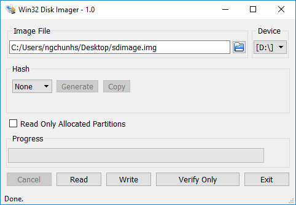

# HPS Linux Boot Tutorial Example User Guide for Arria® 10 SX SoC Development Kit

## Introduction

### Overview

This page contains instructions on how to build Linux systems from separate components: Hardware Design, U-Boot, Arm Trusted Firmware, Linux kernel and device tree, Linux root filesystem. This is different from the Golden System Reference Design, where all the software is built through Yocto. While the instructions use Yocto for building the root file system, alternatives could be used there, such as the buildroot utility for example.

The key differences versus the GSRD are:

* Fabric is configured from U-Boot directly with the rbf file, with `fpga load` command, instead of using the `bootm` command with the core.rbf part of the kernel.itb file
* The applications and drivers form `meta-intel-fpga-refdes` are not included. That includes accessing GPIOs in the fabric for LEDs, push buttons, dip switches, the webserver running on the board, etc.

The following scenarios are covered:

* Boot from SD Daughter card
* Boot from QSPI Daughter card
* Boot from NAND Daughter card

The instructions on this page are based on the [GSRD](https://altera-fpga.github.io/rel-25.3/embedded-designs/arria-10/sx/soc/gsrd/ug-gsrd-a10sx-soc/).

### Prerequisites

The following are required to be able to fully exercise the guides from this page:

* [Arria® 10 SX SoC Development Kit](https://www.intel.com/content/www/us/en/products/details/fpga/development-kits/arria/10-sx.html), ordering code DK-SOC-10AS066S-E.
  * DDR4 HILO memory card
  * Micro SD boot flash card
  * Mini USB cable for serial output
  * Micro USB cable for on-board Altera® FPGA Download Cable II
  * Micro SD card (4GB or greater)
* Host PC with
  * 64 GB of RAM or more
  * Linux OS installed. Ubuntu 22.04LTS was used to create this page, other versions and distributions may work too
  * Serial terminal (for example GtkTerm or Minicom on Linux and TeraTerm or PuTTY on Windows)
  * Altera&reg; Quartus<sup>&reg;</sup> Prime Pro Edition Version 25.3
  * TFTP server. This used to download the eMMC binaries to board to be flashed by U-Boot
* Local Ethernet network, with DHCP server
* Internet connection. For downloading the files.

### Component Versions

Altera&reg; Quartus<sup>&reg;</sup> Prime Pro Edition Version 25.3 and the following software component versions integrate the 25.3 release. 

**Note:** Regarding the GHRD components in the following table, only the device-specific GHRD is used in this page.

| Component                             | Location                                                     | Branch                       | Commit ID/Tag       |
| :------------------------------------ | :----------------------------------------------------------- | :--------------------------- | :------------------ |
| Agilex 3 GHRD | [https://github.com/altera-fpga/agilex3c-ed-gsrd](https://github.com/altera-fpga/agilex3c-ed-gsrd)    | main  | QPDS25.3_REL_GSRD_PR   |
| Agilex 5 GHRD - Include GSRD 2.0 baseline design + meta_custom | [https://github.com/altera-fpga/agilex5e-ed-gsrd](https://github.com/altera-fpga/agilex5e-ed-gsrd) | main                    | QPDS25.3_REL_GSRD_PR |
| Agilex 7 GHRD                         | [https://github.com/altera-fpga/agilex7f-ed-gsrd](https://github.com/altera-fpga/agilex7f-ed-gsrd) | main | QPDS25.3_REL_GSRD_PR |
| Stratix 10 GHRD                       | [https://github.com/altera-fpga/stratix10-ed-gsrd](https://github.com/altera-fpga/stratix10-ed-gsrd) | main | QPDS25.3_REL_GSRD_PR |
| Arria 10 GHRD                         | [https://github.com/altera-fpga/arria10-ed-gsrd](https://github.com/altera-fpga/arria10-ed-gsrd)  | main | QPDS25.3_REL_GSRD_PR |
| Linux                                 | [https://github.com/altera-fpga/linux-socfpga](https://github.com/altera-fpga/linux-socfpga) | socfpga-6.12.33-lts | QPDS25.3_REL_GSRD_PR |
| Arm Trusted Firmware                  | [https://github.com/altera-fpga/arm-trusted-firmware](https://github.com/altera-fpga/arm-trusted-firmware) | socfpga_v2.13.0   | QPDS25.3_REL_GSRD_PR |
| U-Boot                                | [https://github.com/altera-fpga/u-boot-socfpga](https://github.com/altera-fpga/u-boot-socfpga) | socfpga_v2025.07 | QPDS25.3_REL_GSRD_PR |
| Yocto Project                         | [https://git.yoctoproject.org/poky](https://git.yoctoproject.org/poky) | walnascar | latest              |
| Yocto Project: meta-altera-fpga (for GSRD 2.0) | [https://github.com/altera-fpga/meta-altera-fpga](https://github.com/altera-fpga/meta-altera-fpga) | walnascar | QPDS25.3_REL_GSRD_PR |
| Yocto Project: meta-intel-fpga (for Legacy GSRD) | [https://git.yoctoproject.org/meta-intel-fpga](https://git.yoctoproject.org/meta-intel-fpga) | walnascar | latest |
| Yocto Project: meta-intel-fpga-refdes (for Legacy GSRD) | [https://github.com/altera-fpga/meta-intel-fpga-refdes](https://github.com/altera-fpga/meta-intel-fpga-refdes) | walnascar | QPDS25.3_REL_GSRD_PR |
| Legacy GSRD | [https://github.com/altera-fpga/gsrd-socfpga](https://github.com/altera-fpga/gsrd-socfpga) | walnascar | QPDS25.3_REL_GSRD_PR |

**Note:** The combination of the component versions indicated in the table above has been validated through the use cases described in this page and it is strongly recommended to use these versions together. If you decided to use any component with different version than the indicated, there is not warranty that this will work.

### Development Kit

Refer to [Development Kit](https://altera-fpga.github.io/rel-25.3/embedded-designs/arria-10/sx/soc/gsrd/ug-gsrd-a10sx-soc/#ghrd-overview) for details about the board.

### Release Notes

Refer to [Release Notes](https://github.com/altera-fpga/gsrd-socfpga/releases/tag/QPDS25.1.1_REL_GSRD_PR) for release readiness information and known issues.

## Boot from SD Card

<h4>Setup Environment</h4>

<h4>Yocto Build Prerequisites</h4>

Make sure you have Yocto system requirements met: [https://docs.yoctoproject.org/ref-manual/system-requirements.html](https://docs.yoctoproject.org/ref-manual/system-requirements.html)

The command to install the required packages on Ubuntu 22.04 is:

```bash
sudo apt-get update
sudo apt-get upgrade
sudo apt-get install openssh-server mc libgmp3-dev libmpc-dev gawk wget git diffstat unzip texinfo gcc \
build-essential chrpath socat cpio python3 python3-pip python3-pexpect xz-utils debianutils iputils-ping \
python3-git python3-jinja2 libegl1-mesa libsdl1.2-dev pylint xterm python3-subunit mesa-common-dev zstd \
liblz4-tool git fakeroot build-essential ncurses-dev xz-utils libssl-dev bc flex libelf-dev bison xinetd \
tftpd tftp nfs-kernel-server libncurses5 libc6-i386 libstdc++6:i386 libgcc++1:i386 lib32z1 \
device-tree-compiler curl mtd-utils u-boot-tools net-tools swig -y
```

On Ubuntu 22.04 you will also need to point the /bin/sh to /bin/bash, as the default is a link to /bin/dash:

```bash
 sudo ln -sf /bin/bash /bin/sh
```

1\. Create the top folder to store all the build :

```bash
sudo rm -rf a10_example.sdmmc
mkdir a10_example.sdmmc
cd a10_example.sdmmc
export TOP_FOLDER=`pwd`
```

2\. Setup the environment

```bash
wget https://developer.arm.com/-/media/Files/downloads/gnu/14.3.rel1/binrel/arm-gnu-toolchain-14.3.rel1-x86_64-arm-none-linux-gnueabihf.tar.xz
tar xf arm-gnu-toolchain-14.3.rel1-x86_64-arm-none-linux-gnueabihf.tar.xz
rm arm-gnu-toolchain-14.3.rel1-x86_64-arm-none-linux-gnueabihf.tar.xz
export PATH=`pwd`/arm-gnu-toolchain-14.3.rel1-x86_64-arm-none-linux-gnueabihf/bin:$PATH
export ARCH=arm
export CROSS_COMPILE=arm-none-linux-gnueabihf-
```

Enable Quartus tools to be called from command line:


```bash
export QUARTUS_ROOTDIR=~/altera_pro/25.3/quartus/
export PATH=$QUARTUS_ROOTDIR/bin:$QUARTUS_ROOTDIR/linux64:$QUARTUS_ROOTDIR/../qsys/bin:$PATH
```


<h4>Build Hardware Design</h4>

```bash
cd $TOP_FOLDER
rm -rf arria10-ed-gsrd
git clone -b QPDS25.3_REL_GSRD_PR https://github.com/altera-fpga/arria10-ed-gsrd.git
cd arria10-ed-gsrd
make a10-soc-devkit-sdmmc-baseline-all 
```

The following files are created:

* `$TOP_FOLDER/arria10-ed-gsrd/a10_soc_devkit_ghrd_pro/hps_isw_handoff/hps.xml`
* `$TOP_FOLDER/arria10-ed-gsrd/a10_soc_devkit_ghrd_pro/output_files/ghrd_10as066n2.sof`

<h4>Build U-Boot</h4>

```bash
cd $TOP_FOLDER
rm -rf u-boot-socfpga
git clone -b QPDS25.3_REL_GSRD_PR https://github.com/altera-fpga/u-boot-socfpga
cd u-boot-socfpga
```

Convert hps.xml handoff file to include file to be used by the device tree:

```bash
./arch/arm/mach-socfpga/qts-filter-a10.sh \
$TOP_FOLDER/arria10-ed-gsrd/a10_soc_devkit_ghrd_pro/hps_isw_handoff/hps.xml \
arch/arm/dts/socfpga_arria10_socdk_sdmmc_handoff.h
```

Configure and build U-Boot:

```bash
make clean && make mrproper
make socfpga_arria10_defconfig
make -j 48
cd ..
```

The following files are created:

| File | Description |
| :-- | :-- |
| $TOP_FOLDER/u-boot-socfpga/spl/u-boot-splx4.sfp   | Bootable image, with four SPL binaries, in the format required by BootROM |
| $TOP_FOLDER/u-boot-socfpga/u-boot.img             | U-Boot image |

Create the FIT image with the FPGA programming files, used by SPL to configure FPGA:

```bash
cd $TOP_FOLDER/u-boot-socfpga
ln -s $TOP_FOLDER/arria10-ed-gsrd/a10_soc_devkit_ghrd_pro/output_files/ghrd_10as066n2.core.rbf .
ln -s $TOP_FOLDER/arria10-ed-gsrd/a10_soc_devkit_ghrd_pro/output_files/ghrd_10as066n2.periph.rbf .
tools/mkimage -E -f board/altera/arria10-socdk/fit_spl_fpga.its fit_spl_fpga.itb
```

The following file is created:

* `$TOP_FOLDER/u-boot-socfpga/fit_spl_fpga.itb`

<h4>Build Linux</h4>

```bash
cd $TOP_FOLDER
rm -rf linux-socfpga
git clone -b QPDS25.3_REL_GSRD_PR https://github.com/altera-fpga/linux-socfpga
cd linux-socfpga
make socfpga_defconfig
make -j 48 zImage Image dtbs modules
make -j 48 modules_install INSTALL_MOD_PATH=modules_install
rm -rf modules_install/lib/modules/*/build
rm -rf modules_install/lib/modules/*/source
cd ..
```

The following file is created:

* $TOP_FOLDER/linux-socfpga/arch/arm/boot/zImage
* $TOP_FOLDER/linux-socfpga/arch/arm/boot/Image
* $TOP_FOLDER/linux-socfpga/arch/arm/boot/dts/socfpga_cyclone5_socdk.dtb
* $TOP_FOLDER/linux-socfpga/arch/arm/boot/dts/socfpga_arria10_socdk_sdmmc.dtb
* $TOP_FOLDER/linux-socfpga/arch/arm/boot/dts/socfpga_arria10_socdk_qspi.dtb
* $TOP_FOLDER/linux-socfpga/arch/arm/boot/dts/socfpga_arria10_socdk_nand.dtb
* $TOP_FOLDER/linux-socfpga/modules_install/lib/modules

<h4>Build Rootfs</h4>

```bash
cd $TOP_FOLDER
rm -rf yocto && mkdir yocto && cd yocto
git clone -b walnascar https://git.yoctoproject.org/poky
git clone -b walnascar https://git.yoctoproject.org/meta-intel-fpga
source poky/oe-init-build-env ./build
echo 'MACHINE = "arria10"' >> conf/local.conf
echo 'BBLAYERS += " ${TOPDIR}/../meta-intel-fpga "' >> conf/bblayers.conf
echo 'CORE_IMAGE_EXTRA_INSTALL += "openssh gdbserver"' >> conf/local.conf
bitbake core-image-minimal
```

Link all the relevant files to $LINUX_BIN

```bash
cd $TOP_FOLDER
rm -rf linux-bin && mkdir linux-bin
export set LINUX_BIN=`pwd`/linux-bin
ln -s $TOP_FOLDER/linux-socfpga/arch/arm/boot/zImage $LINUX_BIN
ln -s $TOP_FOLDER/linux-socfpga/arch/arm/boot/Image $LINUX_BIN
ln -s $TOP_FOLDER/linux-socfpga/arch/arm/boot/dts/intel/socfpga/socfpga_arria10_socdk_sdmmc.dtb $LINUX_BIN
ln -s $TOP_FOLDER/linux-socfpga/arch/arm/boot/dts/intel/socfpga/socfpga_arria10_socdk_qspi.dtb $LINUX_BIN
ln -s $TOP_FOLDER/linux-socfpga/arch/arm/boot/dts/intel/socfpga/socfpga_arria10_socdk_nand.dtb $LINUX_BIN
ln -s $TOP_FOLDER/linux-socfpga/modules_install/lib/modules $LINUX_BIN
ln -s $TOP_FOLDER/yocto/build/tmp/deploy/images/arria10/core-image-minimal-arria10.tar.gz $LINUX_BIN
```

The following items are copied in the $LINUX_BIN folder:

| File | Description |
| :-- | :-- |
|zImage                             | compressed kernel image |
|Image                              | uncompressed kernel image |
|socfpga_arria10_socdk_sdmmc.dtb    | arria 10 device tree blob for sdmmc boot |
|socfpga_arria10_socdk_qspi.dtb     | arria 10 device tree blob for qspi boot |
|socfpga_arria10_socdk_nand.dtb     | arria 10 device tree blob for nand boot |
|modules                            | kernel loadable modules |
|core-image-minimal-arria10.tar.gz  | rootfs |

<h4>Create SD Card Image</h4>

Create SD card folder and the folder for the FAT partition and gather the files:
```bash
cd $TOP_FOLDER
sudo rm -rf sd_card && mkdir sd_card && cd sd_card
wget https://releases.rocketboards.org/release/2020.11/gsrd/tools/make_sdimage_p3.py
sed -i 's/\"\-F 32\",//g' make_sdimage_p3.py
chmod +x make_sdimage_p3.py
mkdir fatfs &&  cd fatfs
cp $TOP_FOLDER/linux-socfpga/arch/arm/boot/zImage .
cp $TOP_FOLDER/linux-socfpga/arch/arm/boot/dts/intel/socfpga/socfpga_arria10_socdk_sdmmc.dtb .
cp $TOP_FOLDER/u-boot-socfpga/fit_spl_fpga.itb .
cp $TOP_FOLDER/u-boot-socfpga/u-boot.img .
mkdir extlinux
echo "LABEL Arria10 SOCDK SDMMC" > extlinux/extlinux.conf
echo "    KERNEL ../zImage" >> extlinux/extlinux.conf
echo "    FDT ../socfpga_arria10_socdk_sdmmc.dtb" >> extlinux/extlinux.conf
echo "    APPEND root=/dev/mmcblk0p2 rw rootwait earlyprintk console=ttyS0,115200n8" >> extlinux/extlinux.conf
```

Create the folder for the rootfs partition:
```bash
cd $TOP_FOLDER/sd_card
mkdir rootfs && cd rootfs
sudo tar xf $TOP_FOLDER/yocto/build/tmp/deploy/images/arria10/core-image-minimal-arria10.tar.gz
sudo rm -rf lib/modules/*
```

Bring over the SPL binary:
```bash
cd $TOP_FOLDER/sd_card
cp $TOP_FOLDER/u-boot-socfpga/spl/u-boot-splx4.sfp .
```

Create the SD card image:
```bash
cd $TOP_FOLDER/sd_card
sudo python3 ./make_sdimage_p3.py -f \
-P u-boot-splx4.sfp,num=3,format=raw,size=10M,type=A2  \
-P sdfs/*,num=1,format=fat32,size=32M \
-P rootfs/*,num=2,format=ext3,size=32M \
-s 80M \
-n sdcard_a10.img
```

The following file is created:

* `$TOP_FOLDER/sd_card/sdcard_a10.img`

<h4>Write SD Card</h4>

Write the SD card image `sd_card/sdcard_a10.img` to the micro SD card using the included USB writer:

* On Linux, use the `dd` utility as shown next:

```bash
    # Determine the device asociated with the SD card on the host computer.	
    cat /proc/partitions
    # This will return for example /dev/sdx
    # Use dd to write the image in the corresponding device
    sudo dd if=sdcard.img of=/dev/sdx bs=1M
    # Flush the changes to the SD card
    sync
```

* On Windows, use the Win32DiskImager program, available at [https://sourceforge.net/projects/win32diskimager](https://sourceforge.net/projects/win32diskimager). Write the image as shown in the next figure:



<h4>Boot Linux</h4>

1\. Power cycle the board

2\. Wait for Linux to boot, use `root` as user name, and no password wil be requested.

## Boot from QSPI

This section demonstrates how to build Linux system from separate components, which boots from QSPI.

NOTE: This section assumes that the Boot from SD Card section has been already built and the environment setup in that section is still available.

1\. Create top folder:

```bash
sudo rm -rf a10_example.qspi
mkdir $TOP_FOLDER/a10_example.qspi
cd $TOP_FOLDER/a10_example.qspi
```

2\. Build GHRD for QSPI:

```bash
rm -rf arria10-ed-gsrd
git clone -b QPDS25.3_REL_GSRD_PR https://github.com/altera-fpga/arria10-ed-gsrd.git
cd arria10-ed-gsrd
make a10-soc-devkit-qspi-baseline-all
cd ..
```

The following files are created:

* `$TOP_FOLDER/arria10-ed-gsrd/hps_isw_handoff/hps.xml`
* `$TOP_FOLDER/arria10-ed-gsrd/output_files/ghrd_10as066n2.sof`

3\. Build U-Boot for QSPI:
```bash
rm -rf u-boot-socfpga
git clone -b QPDS25.3_REL_GSRD_PR https://github.com/altera-fpga/u-boot-socfpga
cd u-boot-socfpga
```

Convert hps.xml handoff file to include file to be used by the device tree:

```bash
./arch/arm/mach-socfpga/qts-filter-a10.sh \
$TOP_FOLDER/a10_example.qspi/arria10-ed-gsrd/a10_soc_devkit_ghrd_pro/hps_isw_handoff/hps.xml \
arch/arm/dts/socfpga_arria10_socdk_qspi_handoff.h
```

Configure and build U-Boot:

```bash
make socfpga_arria10_qspi_defconfig
make -j 48
```

The following files are created:

| File | Description | 
| :-- | :-- | 
| $TOP_FOLDER/a10_example.qspi/u-boot-socfpga/spl/u-boot-splx4.sfp    | Bootable image, with four SPL binaries, in the format required by BootROM |
| $TOP_FOLDER/a10_example.qspi/u-boot-socfpga/u-boot.img              | U-Boot image |

Create the FIT image with the FPGA programming files, used by SPL to configure FPGA:

```bash
cd $TOP_FOLDER/a10_example.qspi/u-boot-socfpga/
cp $TOP_FOLDER/a10_example.qspi/arria10-ed-gsrd/a10_soc_devkit_ghrd_pro/output_files/ghrd_10as066n2.core.rbf .
cp $TOP_FOLDER/a10_example.qspi/arria10-ed-gsrd/a10_soc_devkit_ghrd_pro/output_files/ghrd_10as066n2.periph.rbf .
tools/mkimage -E -f board/altera/arria10-socdk/fit_spl_fpga.its fit_spl_fpga.itb
```

The following file is created:

* `$TOP_FOLDER/a10_example.qspi/u-boot-socfpga/fit_spl_fpga.itb`

Create FIT image for the U-Boot:

```bash
cd $TOP_FOLDER/a10_example.qspi/u-boot-socfpga/
tools/mkimage -E -f board/altera/arria10-socdk/fit_uboot.its  fit_uboot.itb
```

4\. Create FIT image for the Linux kernel and device tree:
```bash
cd $TOP_FOLDER/a10_example.qspi/u-boot-socfpga/
cp $TOP_FOLDER/linux-socfpga/arch/arm/boot/Image .
cp $TOP_FOLDER/linux-socfpga/arch/arm/boot/dts/intel/socfpga/socfpga_arria10_socdk_qspi.dtb .
tools/mkimage -f  board/altera/arria10-socdk/fit_kernel_qspi.its kernel.itb
```

The following file is created:

* `$TOP_FOLDER/a10_example.qspi/u-boot-socfpga/kernel.itb`

Create qspi_bin folder and bring all the files:

```bash
cd $TOP_FOLDER/a10_example.qspi/
rm -rf qspi_bin && mkdir qspi_bin && cd qspi_bin
cp $TOP_FOLDER/a10_example.qspi/u-boot-socfpga/spl/u-boot-splx4.sfp .
cp $TOP_FOLDER/a10_example.qspi/u-boot-socfpga/fit_uboot.itb .
cp $TOP_FOLDER/a10_example.qspi/u-boot-socfpga/fit_spl_fpga.itb .
cp $TOP_FOLDER/a10_example.qspi/u-boot-socfpga/kernel.itb .
```

5\. Prepare JFFS2 rootfs image for booting Linux from QSPI:

```bash
cd $TOP_FOLDER/a10_example.qspi/qspi_bin/
mkdir core-image-minimal-arria10-rootfs
cd core-image-minimal-arria10-rootfs
sudo tar xf $TOP_FOLDER/yocto/build/tmp/deploy/images/arria10/core-image-minimal-arria10.tar.gz
sudo rm -rf lib/modules/*
cd ..
sudo mkfs.jffs2 -r core-image-minimal-arria10-rootfs -s 256 -e 64KiB --squash -o core-image-minimal-arria10-rootfs.jffs2
sudo chown $USER:$USER core-image-minimal-arria10-rootfs.jffs2
sudo rm -rf core-image-minimal-arria10-rootfs
```

At this point the following binaries are available in the $TOP_FOLDER/qspi_bin:

|File   | Description|
| :-- | :-- |
|$TOP_FOLDER/a10_example.qspi/qspi_bin/u-boot-splx4.sfp     |Four SPL binaries, with BootROM header|
|$TOP_FOLDER/a10_example.qspi/qspi_bin/fit_uboot.itb        |U-Boot image|
|$TOP_FOLDER/a10_example.qspi/qspi_bin/fit_spl_fpga.itb     |FPGA configuration files|
|$TOP_FOLDER/a10_example.qspi/qspi_bin/kernel.itb           |Linux kerned and device tree|
|$TOP_FOLDER/a10_example.qspi/qspi_bin/core-image-minimal-arria10-rootfs.jffs2  |Linux rootfs|


<h4>Write QSPI Flash</h4>

Program QSPI flash with all the binaries:

```bash
cd $TOP_FOLDER/a10_example.qspi/qspi_bin/
quartus_hps -c 1 -o e
quartus_hps -c 1 -o pv -a 0x0000000 u-boot-splx4.sfp
quartus_hps -c 1 -o pv -a 0x0100000 fit_uboot.itb
quartus_hps -c 1 -o pv -a 0x0300000 fit_spl_fpga.itb
quartus_hps -c 1 -o pv -a 0x1200000 kernel.itb
quartus_hps -c 1 -o pv -a 0x2720000 core-image-minimal-arria10-rootfs.jffs2
```

<h4>Write QSPI Flash via TFTP</h4>

Note that quartus_hps is slow, and a better alternative is to load U-Boot through debugger, download the files through TFTP and write them with U-Boot

1\. Erase the QSPI flash using quartus_hps, as that is faster than U-Boot:
```bash
quartus_hps -c 1 -o E
```

2\. Copy the binaries to the TFTP folder on your host machine. Run U-Boot from the debugger as shown in Arria 10 SoC **Run U-Boot from Debugger**

3\. Connnect your U-Boot to the network, and specify the IP address of you host machine:
```bash
setenv autoload no
dhcp
setenv serverip <your_server_ip>
```

4\. In U-Boot, download binaries over TFTP, and write the to QSPI:
```bash
sf probe
Erase QSPI if not done with quartus_hps::sf erase 0 8000000
tftp ${loadaddr} u-boot-splx4.sfp;sf write ${loadaddr} 0x0000000  ${filesize}
tftp ${loadaddr} fit_uboot.itb; sf write ${loadaddr} 0x0100000 ${filesize} 
tftp ${loadaddr} fit_spl_fpga.itb; sf write ${loadaddr} 0x0300000 ${filesize} 
tftp ${loadaddr} kernel.itb; sf write ${loadaddr} 0x1200000 ${filesize} 
tftp ${loadaddr} core-image-minimal-arria10-rootfs.jffs2 ;sf write ${loadaddr} 0x2720000 ${filesize}
```

<h4>Boot Linux</h4>

1\. Power cycle the board

2\. Wait for Linux to boot, use `root` as user name, and no password wil be requested.

## Boot from NAND

The instructions in this section assume the standard 1Gb NAND part is used (part number: MT29F1G08ABBEAH4:E, marking: NW360). Newer dev kits may be using a 8Gb part (part number: MT29F8G08ABBCAH4-IT:C, marking: NQ299).

The following changes will be needed if the newer 8Gb part number is used:

* Make sure that all items in flash are aligned to the new erase block size (256KB)
* Make sure the JFFS2 image uses the new parameters (256KB block erase size, 2048 page size)
* Increase the size of the rootfs partition, to use the rest of the flash

1\. Create a top folder:

```bash
sudo rm -rf a10_example.nand
mkdir a10_example.nand
cd a10_example.nand
```

2\. Build the GHRD for NAND boot:

```bash
rm -rf arria10-ed-gsrd
git clone -b QPDS25.3_REL_GSRD_PR https://github.com/altera-fpga/arria10-ed-gsrd.git
cd arria10-ed-gsrd
make a10-soc-devkit-nand-baseline-all
```

3\. Build U-Boot for NAND:

```bash
cd $TOP_FOLDER/a10_example.nand
rm -rf u-boot-socfpga
git clone -b QPDS25.3_REL_GSRD_PR https://github.com/altera-fpga/u-boot-socfpga
cd u-boot-socfpga
```

Convert hps.xml handoff file to include file to be used by the device tree:

```bash
./arch/arm/mach-socfpga/qts-filter-a10.sh \
$TOP_FOLDER/a10_example.nand/arria10-ed-gsrd/a10_soc_devkit_ghrd_pro/hps_isw_handoff/hps.xml \
arch/arm/dts/socfpga_arria10_socdk_nand_handoff.h
```

Configure and build U-Boot:

```bash
make socfpga_arria10_nand_defconfig
make -j 48
```

Create the FIT image with the FPGA programming files, used by SPL to configure FPGA:

```bash
cd $TOP_FOLDER/a10_example.nand/u-boot-socfpga
cp $TOP_FOLDER/a10_example.nand/arria10-ed-gsrd/a10_soc_devkit_ghrd_pro/output_files/ghrd_10as066n2.core.rbf .
cp -s $TOP_FOLDER/a10_example.nand/arria10-ed-gsrd/a10_soc_devkit_ghrd_pro/output_files/ghrd_10as066n2.periph.rbf .
tools/mkimage -E -f board/altera/arria10-socdk/fit_spl_fpga.its fit_spl_fpga.itb
```

The following file is created:

* `$TOP_FOLDER/a10_example.nand/u-boot-socfpga/fit_spl_fpga.itb`

Create FIT image for the U-Boot:

```bash
cd $TOP_FOLDER/a10_example.nand/u-boot-socfpga
tools/mkimage -E -f board/altera/arria10-socdk/fit_uboot.its  fit_uboot.itb
```

The following file is created:

* `$TOP_FOLDER/a10_example.nand/u-boot-socfpga/fit_uboot.itb`

Create FIT image for the Linux kernel and device tree:

```bash
cd $TOP_FOLDER/a10_example.nand/u-boot-socfpga
cp $TOP_FOLDER/linux-socfpga/arch/arm/boot/Image .
cp $TOP_FOLDER/linux-socfpga/arch/arm/boot/dts/intel/socfpga/socfpga_arria10_socdk_nand.dtb .
tools/mkimage -f  board/altera/arria10-socdk/fit_kernel_nand.its kernel.itb
```

The following file is created:

* `$TOP_FOLDER/a10_example.nand/u-boot-socfpga/fit_kernel.itb`

Create nand_bin folder and bring all the files:

```bash
cd $TOP_FOLDER/a10_example.nand/
rm -rf nand_bin && mkdir nand_bin && cd nand_bin
cp $TOP_FOLDER/a10_example.nand/u-boot-socfpga/spl/u-boot-splx4.sfp .
cp $TOP_FOLDER/a10_example.nand/u-boot-socfpga/fit_uboot.itb .
cp $TOP_FOLDER/a10_example.nand/u-boot-socfpga/fit_spl_fpga.itb .
cp $TOP_FOLDER/a10_example.nand/u-boot-socfpga/kernel.itb .
```

Prepare JFFS2 rootfs image for booting Linux from NAND:

```bash
cd $TOP_FOLDER/a10_example.nand/nand_bin
sudo rm -rf rootfs
mkdir rootfs
cd rootfs
sudo tar xf $TOP_FOLDER/yocto/build/tmp/deploy/images/arria10/core-image-minimal-arria10.tar.gz
sudo rm -rf lib/modules
cd ..
mkfs.jffs2 -r rootfs -n -p --faketime --output=rootfs.jffs2 --squash -s 2048 -e 128KiB
rm -rf rootfs
```

At this point the following binaries are available in the $TOP_FOLDER/nand_bin:

|File   |Description|
| :-- | :-- |
|u-boot-splx4.sfp   |Four SPL binaries, with BootROM header|
|fit_uboot.itb      |U-Boot image|
|fit_spl_fpga.itb   |FPGA configuration files|
|kernel.itb         |Linux kerned and device tree|
|rootfs.jffs2       |Linux rootfs|

<h4>Write NAND Flash</h4>

NAND Flash Layout:

|Address    |Size   |File   |Description|
| :-- | :-- | :-- | :-- |
|0x0000000  |0x00100000 |u-boot-splx4.sfp   |Four SPL binaries, with BootROM header|
|0x0100000  |0x00100000 |fit_uboot.itb      |U-Boot image|
|0x0200000  |0x00100000 |n/a                |U-Boot environment|
|0x0300000  |0x00F00000 |fit_spl_fpga.itb   |FPGA configuration files|
|0x1200000  |0x00E00000 |kernel.itb         |Linux kerned and device tree|
|0x0200000  |0x06000000 |rootfs.jffs2       |Linux rootfs|

Program NAND flash with all the binaries, by doing the following:

* Copy the binaries to the TFTP folder on your host machine
* Run U-Boot from the debugger as shown in Arria 10 SoC - Run U-Boot from Debugger
* Connnect your U-Boot to the network, and specify the IP address of you host machine:

```bash
setenv autoload no
dhcp
setenv serverip <your_server_ip>
```

In U-Boot, download binaries over TFTP, and write the to NAND:

```bash
nand erase clean 0x02000000 0x06000000; tftp ${loadaddr} rootfs.jffs2; nand write.trimffs ${loadaddr} 0x02000000 ${filesize}
nand erase 0x01200000 0x00E00000; tftp ${loadaddr} kernel.itb; nand write ${loadaddr} 0x01200000 ${filesize}
nand erase 0x00300000 0x00F00000; tftp ${loadaddr} fit_spl_fpga.itb; nand write ${loadaddr} 0x00300000 ${filesize}
nand erase 0x00100000 0x00100000; tftp ${loadaddr} fit_uboot.itb; nand write ${loadaddr} 0x00100000 ${filesize}
nand erase 0x00000000 0x00100000; tftp ${loadaddr} u-boot-splx4.sfp; nand write ${loadaddr} 0x00000000 ${filesize}
```

<h4>Boot Linux</h4>

1\. Power cycle the board

2\. Wait for Linux to boot, use `root` as user name, and no password wil be requested.
