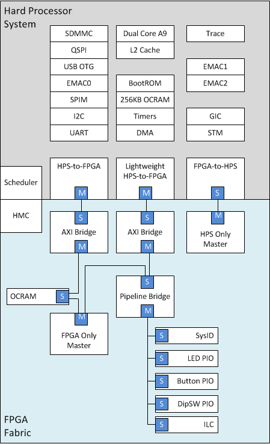
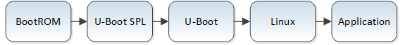
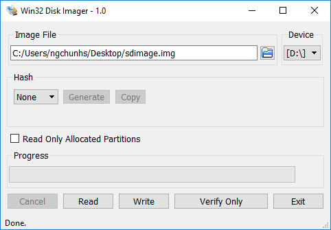
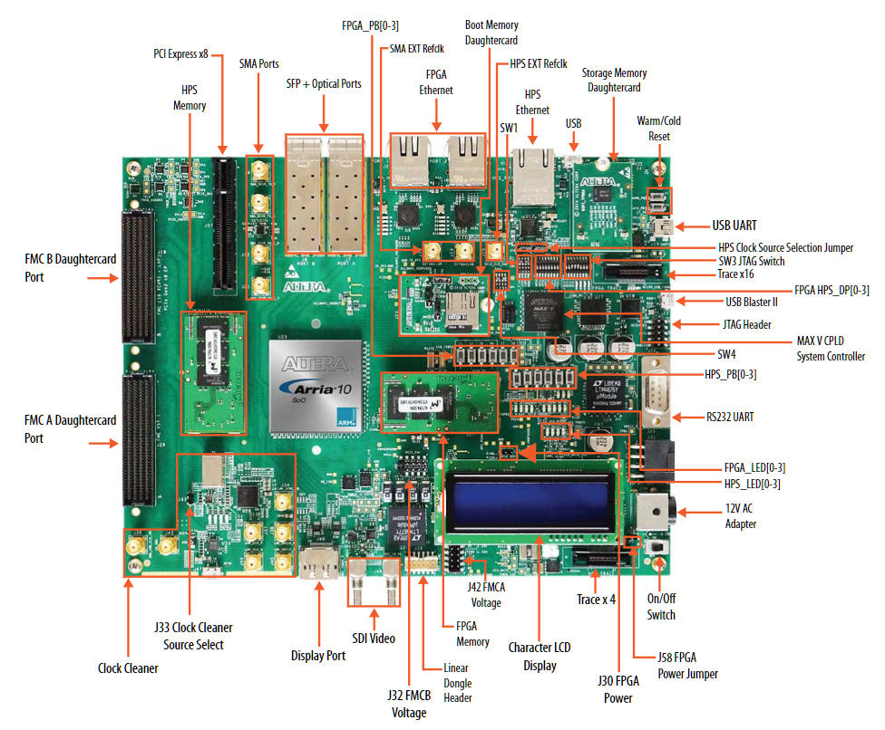
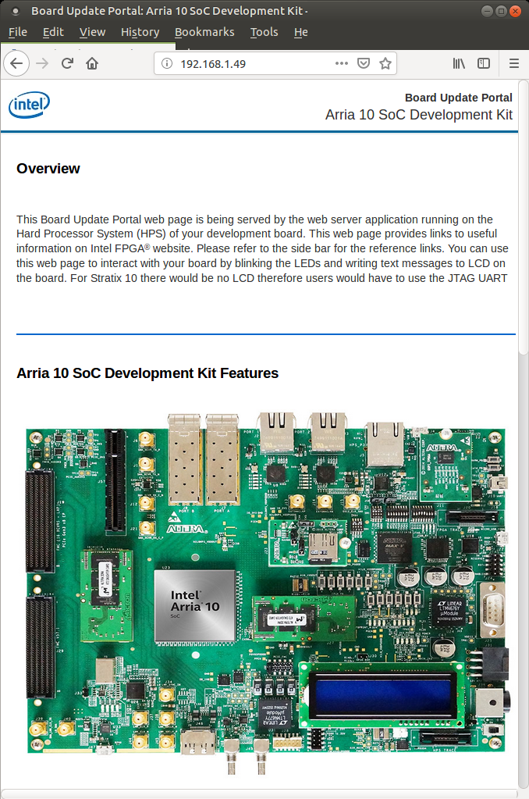
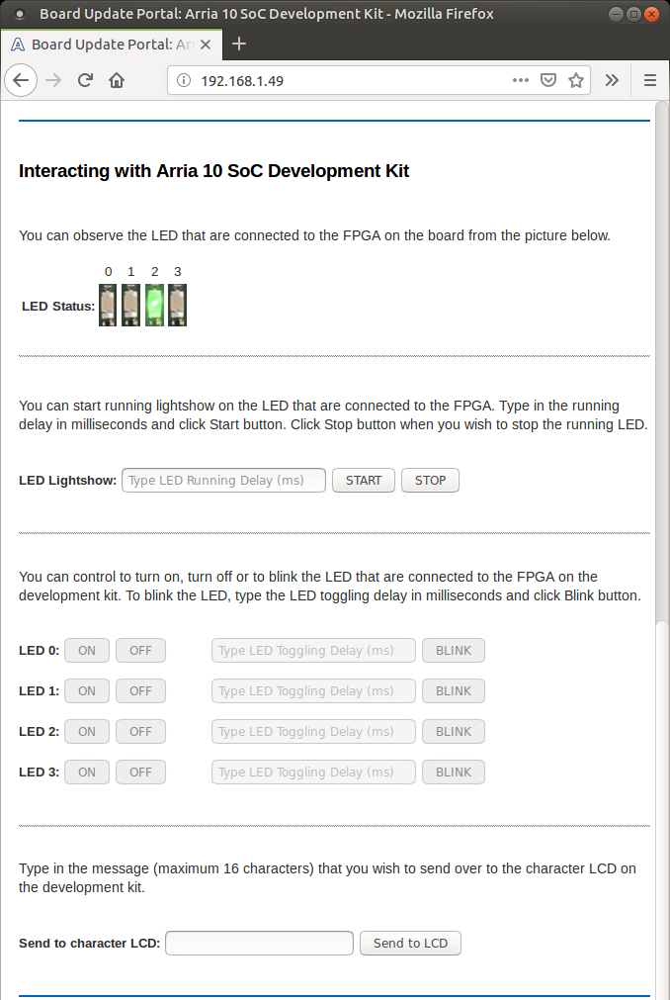
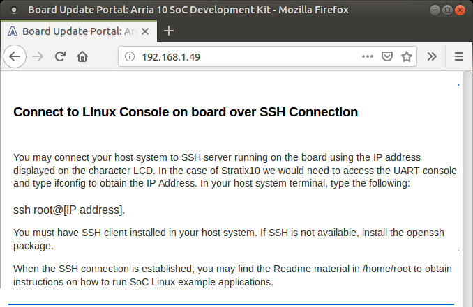
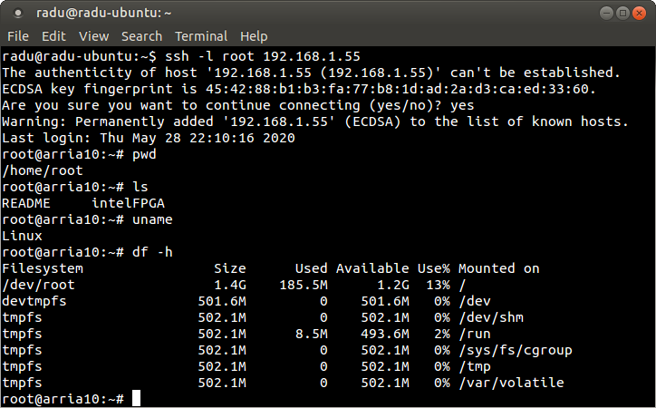
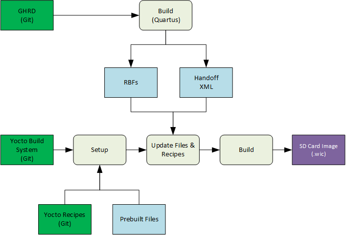

## Overview 
 
The Golden System Reference Design (GSRD) provides a set of essential hardware and software system components that can be used as a starting point for various custom user designs. 
 
The A10 GSRD consists of: 
 
- Arria 10 SoC Development Kit 
- Golden Hardware Reference Design (GHRD) 
- Linux release 
- U-Boot release 
- Linux sample drivers 
- Linux sample applications 
 
### Prerequisites 
 
The following are required in order to be able to fully exercise the A10 GSRD: 
 
- Arria 10 SoC Development Kit, rev. C, including 
  - DDR4 HILO memory card 
  - Micro SD boot flash card 
  - Mini USB cable for serial output 
  - Micro USB cable for on-board Intel FPGA Download Cable II 
- Micro SD card (4GB or greater) 
- Host PC with 
  - Linux - Ubuntu 20.04 was used to create this page, other versions and distributions may work too 
  - Serial terminal (for example Minicom on Linux and TeraTerm or PuTTY on Windows) 
  - Micro SD card slot or Micro SD card writer/reader 
  - Altera&reg; Quartus<sup>&reg;</sup> Prime Pro Edition Version 25.1
- Local Ethernet network, with DHCP server (will be used to provide IP address to the board) 
 
Note that the U-Boot and Linux compilation, Yocto compilation and creating the SD card image require a Linux host PC. The rest of the operations can be performed on either a Windows or Linux host PC. 
 
### Release Contents 
 
#### Intel FPGA HPS Embedded Software Release Notes 
 
The Intel FPGA HPS Embedded Software release notes can be accessed from the following link: [https://www.rocketboards.org/foswiki/Documentation/IntelFPGAHPSEmbeddedSoftwareRelease](https://www.rocketboards.org/foswiki/Documentation/IntelFPGAHPSEmbeddedSoftwareRelease) 
 
#### Latest Binaries Release Content 
 
The release files are accessible at [https://releases.rocketboards.org/2025.04/gsrd/a10_gsrd/](https://releases.rocketboards.org/2025.04/gsrd/a10_gsrd/) and contain the following: 
 
| File | Description | 
| :-- | :-- | 
| Image | Prebuilt Linux kernel image | 
| zImage | Prebuilt Compressed Linux kernel image | 
| a10_soc_devkit_ghrd_QPDS-25.1pro.tar.gz | Hardware project, including precompiled SOF | 
| hps.xml | Quartus handoff file to be used by U-Boot | 
| fit_spl_fpga.itb | Prebuilt FPGA Configuration files, used by SPL or U-Boot | 
| fit_uboot.itb | Prebuilt U-Boot image | 
| ghrd_10as066n2.core.rbf | Prebuilt FPGA core configuration file | 
| ghrd_10as066n2.periph.rbf | Prebuilt FPGA periphery configuration file | 
| ghrd_10as066n2.sof | Prebuilt FPGA configuration file | 
| sdimage.tar.gz | Prebuilt SD Card Image | 
| sdimage.tar.gz.md5sum | Checksum for prebuilt SD Card Image | 
| socfpga_arria10_socdk_sdmmc.dtb | Prebuilt Linux Device Tree Binary | 
| socfpga_arria10_ghrd.dtsi | Linux Device Tree Source Include File | 
| socfpga_arria10_socdk.dtsi | Linux Device Tree Source Include File | 
| u-boot-splx4.sfp | Prebuilt SPL image file | 
| u-boot.img | Prebuilt U-Boot image file | 
| rootfs/console-image-minimal-arria10.tar.gz | Prebuilt small root filesystem | 
| rootfs/gsrd-console-image-arria10.tar.gz | Prebuilt GSRD root filesystem | 
| rootfs/xvfb-console-image-arria10.tar.gz | Prebuilt Frame Buffer root filesystem | 
 
Before downloading the hardware design please read the agreement in the link [https://www.intel.com/content/www/us/en/programmable/downloads/software/license/lic-prog_lic.html](https://www.intel.com/content/www/us/en/programmable/downloads/software/license/lic-prog_lic.html) 
 
#### Source Code 
 
The source code is also included on the SD card in the Linux rootfs path `/home/root`: 
 
| File | Description | 
| :-- | :-- | 
| linux-socfpga-v6.12.11-lts-src.tar.gz | Source code for Linux kernel | 
| u-boot-socfpga_v2025.01-src.tar.gz | Source code for U-Boot | 
| arm-trusted-firmware-v2.12.0-src.tar.gz | Source code for Arm Trusted Firmware | 
 
#### Latest Source Code Release Contents - Branches and Commit IDs 
 
| Component | Location | Branch | Tag/Commit ID | 
| :-- | :-- | :-- | :-- | 
| GHRD | [https://github.com/altera-opensource/ghrd-socfpga/tree/master/a10_soc_devkit_ghrd_pro](https://github.com/altera-opensource/ghrd-socfpga/tree/master/a10_soc_devkit_ghrd_pro) | master | QPDS25.1_REL_GSRD_PR | 
| Linux | [https://github.com/altera-opensource/linux-socfpga](https://github.com/altera-opensource/linux-socfpga) | socfpga-6.12.11-lts | QPDS25.1_REL_GSRD_PR | 
| U-Boot | [https://github.com/altera-opensource/u-boot-socfpga](https://github.com/altera-opensource/u-boot-socfpga) | socfpga_v2025.01 | QPDS25.1_REL_GSRD_PR | 
| Arm Trusted Firmware | [https://github.com/arm-trusted-firmware](https://github.com/arm-trusted-firmware) | socfpga_v2.12.0 | QPDS25.1_REL_GSRD_PR | 
| Yocto Project: poky | [https://git.yoctoproject.org/poky](https://git.yoctoproject.org/poky) | styhead | - | 
| Yocto Project: meta-intel-fpga | [https://git.yoctoproject.org/meta-intel-fpga](https://git.yoctoproject.org/meta-intel-fpga) | styhead | QPDS25.1_REL_GSRD_PR | 
| Yocto Project: meta-intel-fpga-refdes | [https://github.com/altera-opensource/meta-intel-fpga-refdes](https://github.com/altera-opensource/meta-intel-fpga-refdes) | styhead | QPDS25.1_REL_GSRD_PR | 
 
### GHRD Overview 
 
The GHRD is an important part of the GSRD and consists of the following components: 
 
- Dual-core ARM Cortex*-A9 MPCore* Hard Processor System (HPS) 
- Hard Memory Controller (HMC) 
- Two user push-button inputs 
- Four user DIP switch inputs 
- Four user I/O for LED outputs 
- 256KB of FPGA on-chip memory 
- JTAG to Avalon Master Bridges 
- Interrupt Latency Counter 
- System ID 
 

 
The GHRD allows hardware engineers to access each peripheral in the FPGA portion of the SoC with System Console, through the JTAG master module. This signal-level access is independent of the driver readiness of each peripheral. 
 
#### Cortex-A9 MPU Address Maps 
 
This sections presents the address maps as seen from the MPU (Cortex-A9) side. 
 
#### HPS-to-FPGA Address Map 
 
The memory map of soft IP peripherals, as viewed by the microprocessor unit (MPU) of the HPS, starts at HPS-to-FPGA base address of 0xC000_0000. The following table lists the offset from 0xC000_0000 of each peripheral in the FPGA portion of the SoC. 
 
| Peripheral | Address Offset | Size (bytes) | Attribute | 
| :-- | :-- | :-- | :-- | 
| onchip_memory2_0 | 0x0 | 256K | On-chip RAM as scratch pad | 
 
#### Lightweight HPS-to-FPGA Address Map 
 
The memory map of system peripherals in the FPGA portion of the SoC as viewed by the MPU, which starts at the lightweight HPS-to-FPGA base address of 0xFF20_0000, is listed in the following table. 
 
| Peripheral | Address Offset | Size (bytes) | Attribute | 
| :-- | :-- | :-- | :-- | 
| sysid_qsys | 0x0000_0000 | 8 | Unique system ID | 
| led_pio | 0x0000_0010 | 8 | LED output | 
| button_pio | 0x0000_0020 | 8 | Push button input | 
| dipsw_pio | 0x0000_0030 | 8 | DIP switch input | 
| ILC | 0x0000_0100 | 256 | Interrupt latency counter | 
 
#### JTAG Master Address Map 
 
There are two JTAG master interfaces in the design, one for accessing non-secure peripherals in the FPGA fabric, and another for accessing secure peripherals in the HPS through the FPGA-to-HPS interface. 
 
The following table lists the address of each peripheral in the FPGA portion of the SoC, as seen through the non-secure JTAG master interface. 
 
| Peripheral | Address Offset | Size (bytes) | Attribute | 
| :-- | :-- | :-- | :-- | 
| sysid_qsys | 0x0000_0000 | 8 | Unique system ID | 
| led_pio | 0x0000_0010 | 8 | 4 LED outputs | 
| button_pio | 0x0000_0020 | 8 | 2 push button inputs | 
| dipsw_pio | 0x0000_0030 | 8 | 4 DIP switch inputs | 
| ILC | 0x0000_0100 | 256 | Interrupt latency counter | 
 
#### Interrupt Routing 
 
The HPS exposes 64 interrupt inputs for the FPGA logic. The following table lists the interrupt connections from soft IP peripherals to the HPS interrupt input interface. 
 
| Peripheral | Interrupt Number | Attribute | 
| :-- | :-- | :-- | 
| dipsw_pio | f2h_irq0[0] | 4 DIP switch inputs | 
| button_pio | f2h_irq0[1] | 2 push button inputs | 
 
The interrupt sources are also connected to an interrupt latency counter (ILC) module in the system, which enables System Console to be aware of the interrupt status of each peripheral in the FPGA portion of the SoC. 
 
### Typical HPS Boot Flow 
 
The GSRD boot flow includes the following stages: 
 
1. Boot ROM 
2. U-Boot 
3. Operating System (OS) 
4. Application 
 
 
 
The following table presents a short description of the different boot stages: 
 
| Stage | Description | 
| :-- | :-- | 
| Boot ROM | Performs minimal configuration and loads U-Boot into 256KB OCRAM | 
| U-Boot SPL | Configures IO, FPGA, brings up SDRAM | 
| U-Boot | Loads Linux kernel | 
| Linux | Operating system | 
| Application | User application | 
 
For more information, please refer to [Arria 10 SoC Boot User Guide](https://www.intel.com/content/www/us/en/docs/programmable/683735/current/arria-10-soc-boot-user-guide.html) and [Intel Arria 10 Hard Processor System Technical Reference Manual](https://www.intel.com/content/www/us/en/docs/programmable/683711/22-3/hard-processor-system-technical-reference.html) (Booting and Configuration chapter). 
 
## Running GSRD with Pre-Built Binaries 
 
### Booting Linux Using SD Card Image 
 
This section will guide you to boot the Linux with the Arria 10 SoC device according to the [HPS Boot Flow](#booting-linux). 
 
#### Creating SD Card 
 
This section explains how to create the SD card necessary to boot Linux, using the SD card image available with the pre-built Linux binaries package. Once the SD card has been created, insert the card into the SD slot of the Micro SD daughter card. 
 
##### Creating SD Card on Linux 
 
1. Download and extract the SD card image: 
 
```bash 
wget https://releases.rocketboards.org/2025.04/gsrd/a10_gsrd/sdimage.tar.gz 
tar xf sdimage.tar.gz 
``` 
 
The extacted file is named `gsrd-console-image-arria10.wic`. 
 
2. Determine the device associated with the SD card on the host by running the following command before and after inserting the card. 
 
```bash 
$ cat /proc/partitions 
``` 
 
Let's assume it is /dev/sdx. 
 
3. Use *dd* utility to write the SD image to the SD card. 
 
```bash 
$ sudo dd if=gsrd-console-image-arria10.wic of=/dev/sdx bs=1M 
``` 
 
Note we are using *sudo* to be able to write to the card. 
 
4. Use *sync* utility to flush the changes to the SD card. 
 
```bash 
$ sudo sync 
``` 
 
##### Creating SD Card on Windows 
 
1. Download and uncompress the SD card image from [https://releases.rocketboards.org/2025.04/gsrd/a10_gsrd/sdimage.tar.gz](https://releases.rocketboards.org/2025.04/gsrd/a10_gsrd/sdimage.tar.gz) The extacted file is named `gsrd-console-image-arria10.wic`. 
 
2. Rename the wic file as `sdimage.img` 
 
3. Use Win32DiskImager to write the image to the SD card. The tool can be downloaded from [https://sourceforge.net/projects/win32diskimager/files/latest/download](https://sourceforge.net/projects/win32diskimager/files/latest/download) 
 

 
#### Configuring Board 
 
This section presents the necessary board settings in order to run the GSRD on the Arria 10 SoC development board. 
 
 
 
First, confirm the following: 
 
- DDR4 memory card is installed on the HPS Memory slot 
- Micro SD boot flash card is installed on the Boot Memory Daughtercard slot 
 
Then, the board switches need to be configured as follows: 
 
- SW1: OFF-OFF-ON-ON 
- SW2: All OFF 
- SW3: OFF-ON-ON-ON-ON-OFF-OFF-OFF 
- SW4: All OFF 
 
Also, the board jumpers need to be configured as follows: 
 
- Leave the SD Card boot card jumpers placed in their default configuration 
- On the development board: 
 - Place jumpers J16, J17 
 - BSEL0(J3) = 1 (left) 
 - BSEL1(J4) = 0 (right) 
 - BSEL2(J5) = 1 (left) 
 - Leave all other board jumpers unplaced 
 
#### Configuring Serial Connection 
 
The board has a built-in FTDI USB to serial converter chip that allows the host computer to see the board as a virtual serial port. Ubuntu, CentOS and other modern Linux distributions have built-in drivers for the FTDI USB to serial converter chip, so no driver installation is necessary on those platforms. On Windows, the SoC EDS installer automatically installs the required drivers if necessary. 
 
The serial communication parameters are: 
 
- Baud rate: 115200 
- Parity: None 
- Flow control: None 
- Stop bits: 1 
 
On Windows, utilities such as TeraTerm or PuTTY can be used to connect the board. They are easily configured from the tool menus. 
 
On Linux, the Minicom utility can be used. Here is how to configure it: 
 
1. The virtual serial port is usually named */dev/ttyUSB0*. In order to determine the device name associated with the virtual serial port on your host PC, please perform the following: 
 
- Use the following command to determine which USB serial devices are already installed: 
 
```bash 
ls /dev/ttyUSB* 
``` 
 
- Connect mini USB cable from J10 to the PC. This will enable the PC to communicate with the board, even if the board is not powered yet. 
- Use the **ls /dev/ttyUSB** command again to determine which new USB serial device appeared. 
 
2. Install Minicom application on host PC, if not already installed. 
 
- On CentOS, use *sudo yum install minicom* 
- On Ubuntu, use *sudo apt-get install minicom* 
 
3. Configure Minicom 
 
```bash 
sudo minicom -s 
``` 
 
Under **Serial Port Setup** choose the following: 
 
- Serial Device: **/dev/ttyUSB0** (edit to match the system as necessary) 
- Bps/Par/Bits: **115200 8N1** 
- Hardware Flow Control: **No** 
- Software Flow Control: **No** 
- Hit **[ESC]** to return to the main configuration menu 
 
Select **Save Setup as dfl** to save the default setup. Then select **Exit**. 
 
#### Booting Linux 
 
This section presents how to boot Linux on the board. The required steps are: 
 
1. Start serial terminal (when using Minicom it will connect using the selected settings, for others connect manually). 
 
2. Power up the board. 
 
3. U-Boot SPL is ran (two banners are displayed) 
 
4. U-Boot is ran 
 
5. Linux boots. 
 
6. The IP address of the target board will be displayed on the first line of the LCD display. Note that the IP address is displayed only at boot time, it is not updated if the IP address is changed later, for example by the user. 
 
7. Login using 'root' and no password. 
 
```bash 
U-Boot SPL 2024.04 (Oct 16 2024 - 02:54:45 +0000) 
DDRCAL: Success 
DDRCAL: Scrubbing ECC RAM (1024 MiB). 
DDRCAL: SDRAM-ECC initialized success with 332 ms 
FPGA: Checking FPGA configuration setting … 
FPGA: Skipping configuration … 
WDT: Started watchdog@ffd00300 with servicing every 1000ms (10s timeout) 
Trying to boot from MMC1 
 
U-Boot 2024.04 (Oct 16 2024 - 02:54:45 +0000)socfpga_arria10 
 
CPU: Altera SoCFPGA Arria 10 
BOOT: SD/MMC External Transceiver (1.8V) 
Model: Altera SOCFPGA Arria 10 
DRAM: 1 GiB 
Core: 77 devices, 20 uclasses, devicetree: separate 
WDT: Started watchdog@ffd00300 with servicing every 1000ms (10s timeout) 
MMC: dwmmc0@ff808000: 0 
Loading Environment from MMC... *** Warning - bad CRC, using default environment 
 
In: serial 
Out: serial 
Err: serial 
Model: Altera SOCFPGA Arria 10 
Net: 
Warning: ethernet@ff800000 (eth0) using random MAC address - 76:b6:1f:1f:71:80 
eth0: ethernet@ff800000 
Hit any key to stop autoboot: 0 
Failed to load 'u-boot.scr' 
15000796 bytes read in 720 ms (19.9 MiB/s) 
FPGA core bitstream 
Full Configuration Succeeded. 
FPGA: Enter user mode. 
switch to partitions #0, OK 
mmc0 is current device 
Scanning mmc 0:1... 
Found /extlinux/extlinux.conf 
Retrieving file: /extlinux/extlinux.conf 
1: Arria10 SOCDK SDMMC 
Retrieving file: /extlinux/../zImage 
append: root=/dev/mmcblk0p2 rootwait rw earlyprintk memmap=16M$0x3F000000 console=ttyS0,115200n8 
Retrieving file: /extlinux/../socfpga_arria10_socdk_sdmmc.dtb 
Kernel image @ 0x1000000 [ 0x000000 - 0x64c298 ] 
## Flattened Device Tree blob at 02000000 
 Booting using the fdt blob at 0x2000000 
Working FDT set to 2000000 
 Loading Device Tree to 09ff5000, end 09fff20b … OK 
Working FDT set to 9ff5000 
 
Starting kernel … 
 
Deasserting all peripheral resets 
[ 0.000000] Booting Linux on physical CPU 0x0 
[ 0.000000] Linux version 6.6.37-altera-gb1e69f412732 (oe-user@oe-host) (arm-poky-linux-gnueabi-gcc (GCC) 13.3.0, GNU ld (GNU Binutils) 2.42.0.20240723) #1 SMP Mon Oct 14 01:56:39 UTC 2024 
[ 0.000000] CPU: ARMv7 Processor [414fc091] revision 1 (ARMv7), cr=10c5387d 
[ 0.000000] CPU: PIPT / VIPT nonaliasing data cache, VIPT aliasing instruction cache 
[ 0.000000] OF: fdt: Machine model: Altera SOCFPGA Arria 10 
[ 0.000000] Memory policy: Data cache writealloc 
[ 0.000000] Zone ranges: 
[ 0.000000] Normal [mem 0x0000000000000000-0x000000002fffffff] 
[ 0.000000] HighMem [mem 0x0000000030000000-0x000000003fffffff] 
[ 0.000000] Movable zone start for each node 
[ 0.000000] Early memory node ranges 
[ 0.000000] node 0: [mem 0x0000000000000000-0x000000003fffffff] 
[ 0.000000] Initmem setup node 0 [mem 0x0000000000000000-0x000000003fffffff] 
[ 0.000000] percpu: Embedded 15 pages/cpu s31636 r8192 d21612 u61440 
[ 0.000000] Kernel command line: root=/dev/mmcblk0p2 rootwait rw earlyprintk memmap=16M$0x3F000000 console=ttyS0,115200n8 
 
… 
 
[ OK ] Started Network Configuration. 
[ OK ] Started Avahi mDNS/DNS-SD Stack. 
[ OK ] Started WPA supplicant. 
[ OK ] Started Hostname Service. 
[ OK ] Reached target Network. 
[ 12.008639] socfpga-dwmac ff800000.ethernet eth0: Link is Up - 1Gbps/Full - flow control rx/tx 
 
Poky (Yocto Project Reference Distro) 5.0.5 arria10 ttyS0 
 
arria10 login: root 
root@arria10:~# 
``` 
 
### Running Sample Linux Applications 
 
The GSRD includes a number of sample Linux applications that help demonstrate some of the features of the platform: 
 
- Display Hello World message 
- Control LEDs 
- Detect interrupts from push buttons and DIP switches 
 
The sample applications can be used as a starting point for users to write their own applications that interact with software IP through Linux drivers. 
 
#### Prerequisites 
 
1. Boot Linux on the target board as described in [Booting Linux](#booting-linux). You will not need to use the serial terminal if you plan on using ssh connection. 
 
2. Connect to the board using one of the following options: 
 
- Connect using serial console, as described in [Booting Linux](#booting-linux) 
- Connect using ssh, as described in [Connect Using SSH](#connect-using-ssh) 
 
3. In serial console, or ssh client console, change current folder to be */home/root/altera*. This is where the application binaries are stored. 
 
```bash 
root@arria10:~# cd /home/root/intelFPGA/ 
``` 
 
#### Display Hello World Message 
 
Run the following command to display the Hello World message on the console: 
 
```bash 
root@arria10:~/intelFPGA# ./hello 
Hello SoC FPGA! 
``` 
 
#### Exercise Soft PIO Driver for LED Control 
 
The following LEDs are exercised: 
 
| LED Number | Corresponding Board LED | 
| :-- | :-- | 
| 0 | D26 | 
| 1 | D25 | 
| 2 | D28 | 
| 3 | D27 | 
 
1. In order to blink an LED in a loop, with a specific delay in ms, run the following command: 
 
```bash 
./blink <led_number> <delay_ms> 
``` 
 
- The **led_number** specifies the desired LED, and is a value between 0 and 3. 
- The **delay_ms** is a number that specifies the desired delay in ms between turning the LED on and off. 
 
2. In order to turn an individual LED on or off, run the following command: 
 
```bash 
./toggle <led_number> <state> 
``` 
 
- The **led_number** specifies the desired LED, and is a value between 0 and 3. 
- The **state** needs to be 0 to turn the LED off, and 1 to turn the LED on. 
 
3. In order to scroll the FPGA LEDs with a specific delay, please run the following command: 
 
```bash 
./scroll_client <delay> 
``` 
 
The **delay** specifies the desired scrolling behavior: 
 
- **delay > 0** - specify new scrolling delay in ms, and start scrolling 
- **delay < 0** - stop scrolling 
- **delay = 0** - display current scroll delay 
 
#### Register Interrupts and Call Interrupt Service Routine 
 
In order to register an interrupt handler to a specific GPIO, you will first need to determine the GPIO number used. 
 
1. Open the Linux Device Tree [socfpga_arria10_ghrd.dtsi](https://releases.rocketboards.org/2022.07/gsrd/a10_gsrd/socfpga_arria10_ghrd.dtsi) file and look up the labels for the DIP switches and Push button GPIOs: 
 
```xml 
 button_pio: gpio@0x100000020 { 
 compatible = "altr,pio-1.0"; 
 reg = <0xff200020 0x10>; 
 interrupt-parent = <&intc>; 
 interrupts = <0 19 1>; 
 altr,gpio-bank-width = <4>; 
 altr,interrupt-type = <2>; 
 altr,interrupt_type = <2>; 
 edge_type = <1>; 
 level_trigger = <0>; 
 resetvalue = <0>; 
 #gpio-cells = <2>; 
 gpio-controller; 
 }; 
 
 dipsw_pio: gpio@0x100000030 { 
 compatible = "altr,pio-1.0"; 
 reg = <0xff200030 0x10>; 
 interrupt-parent = <&intc>; 
 interrupts = <0 20 1>; 
 altr,gpio-bank-width = <4>; 
 altr,interrupt-type = <3>; 
 altr,interrupt_type = <3>; 
 edge_type = <2>; 
 level_trigger = <0>; 
 resetvalue = <0>; 
 #gpio-cells = <2>; 
 gpio-controller; 
 }; 
``` 
 
Determine which of the GPIO entries from */sys/class/gpio/* matches the offsets by searching for the address in the label entry. 
 
2. Run the following to determine the GPIO numbers for the DIP switches 
 
```bash 
root@arria10:~# grep -r "0x100000030" /sys/class/gpio/gpiochip*/label 
/sys/class/gpio/gpiochip1952/label:/soc/gpio@0x100000030 
``` 
 
This means that the GPIOs 1952 .. 1955 are allocated to the DIP switches (there are 4 of them). 
 
3. Run the followinig to determine the GPIO numbers for the pushbuttons 
 
```bash 
root@arria10:~# grep -r "0x100000020" /sys/class/gpio/gpiochip*/label 
/sys/class/gpio/gpiochip1984/label:/soc/gpio@0x100000020 
``` 
 
This means that the GPIOs 1984, 1985 are allocated to the push buttons (there are 2 of them). 
 
4. Register interrupt for one of the dipswiches, using the appropriate GPIO number, as determined in a previous step: 
 
```bash 
root@arria10:~# modprobe gpio_interrupt gpio_number=1952 intr_type=3 
[ 269.876015] gpio_interrupt: loading out-of-tree module taints kernel. 
[ 269.887086] Interrupt for GPIO:1952 
[ 269.887086] registered 
``` 
 
5. Toggle the dipswitch a few times, you will see messages from the interrupt handler 
 
```bash 
[ 269.882892] Interrupt happened at gpio:1952 
[ 279.913910] Interrupt happened at gpio:1952 
[ 279.923967] Interrupt happened at gpio:1952 
[ 280.700461] Interrupt happened at gpio:1952 
``` 
 
6. Remove the driver 
 
```bash 
root@arria10:~# rmmod gpio_interrupt 
``` 
 
7. Register the pushbutton interrupt, using the appropriate GPIO number as determine on a previous step 
 
```bash 
root@arria10:~# modprobe gpio_interrupt gpio_number=1984 intr_type=2 
[ 317.445090] Interrupt for GPIO:1984 
[ 317.445090] registered 
``` 
 
8. Push the pusbutton a few times, you will see interrupt handler messages 
 
```bash 
[ 325.824591] Interrupt happened at gpio:1984 
[ 326.428601] Interrupt happened at gpio:1984 
[ 326.966495] Interrupt happened at gpio:1984 
[ 327.554294] Interrupt happened at gpio:1984 
``` 
 
9. Once done, remove the handler 
 
```bash 
root@arria10:~# rmmod gpio_interrupt 
``` 
 
**Note**: If you are on the ssh console, you will need to run the program *dmesg* after pressing the button in order to see the messages: 
 
```bash 
root@arria10:~# dmesg 
``` 
 
#### System Check Application 
 
System check application provides a glance of system status of basic peripherals such as: 
 
- **USB**: USB device driver 
- **SysID**: FPGA system ID 
- **Network IP (IPv4)**: Network IP address 
- **HPS LEDs**: HPS LED state 
- **FPGA LEDs**: FPGA LED state 
 
You run the system check application as follows: 
 
```bash 
root@arria10:~/intelFPGA# ./syschk 
``` 
 
The interface of the application looks like this: 
 
```bash 
 ALTERA SYSTEM CHECK 
 
IPv4 Address : 192.168.1.49 usb1 : DWC OTG Controller 
 
a10sr-led3 : OFF serial0@ffc02000 : disabled 
fpga_led2 : OFF serial1@ffc02100 : okay 
a10sr-led1 : OFF 
fpga_led0 : OFF ff200000.sysid : 3221768200 
fpga_led3 : OFF 
a10sr-led2 : OFF 
fpga_led1 : OFF 
a10sr-led0 : OFF 
``` 
 
To quit the application, press **q**. 
 
**Note**: System check application works better when viewed via SSH to the target. USB-UART refreshes slower hence the user interface might flicker. 
 
### Connecting to Board Web Server and SSH Client 
 
The GSRD includes a web server running on the target board that can be used to exercise some of the board features: 
 
- Displaying text on the alphanumerical LCD screen 
- Turning LEDs ON and OFF 
- Scrolling LEDs in a sequence 
- Displaying the current status of the LEDs 
 
The web page served by the web server also contains links to some relevant information on the Intel website. 
 
#### Connect to Web Server 
 
1. Boot Linux as described in [Booting Linux](#booting-linux). 
 
2. Write down the IP address displayed on the first line of the LCD screen. Note that the IP address is displayed only at the boot time, it is not updated if the IP address is changed later, for example by the user. If your board is connected to a network that doesn't have a DHCP server, it will fallback to use IPv4LL IP address after Linux times out waiting for DHCP server's IP, which is about 2 minutes. 
 
Note: There are instances where the DHCP have not assigned an IP to the board before the timeout happens, in which case you may check the IP address via the UART by running *ifconfig*. 
 
```bash 
root@arria10:~# ifconfig 
eth0 Link encap:Ethernet HWaddr 02:3d:4f:72:c5:02 
 inet addr:192.168.1.49 Bcast:192.168.1.255 Mask:255.255.255.0 
 inet6 addr: fe80::3d:4fff:fe72:c502/64 Scope:Link 
 UP BROADCAST RUNNING MULTICAST DYNAMIC MTU:1500 Metric:1 
 RX packets:15 errors:0 dropped:0 overruns:0 frame:0 
 TX packets:54 errors:0 dropped:0 overruns:0 carrier:0 
 collisions:0 txqueuelen:1000 
 RX bytes:2387 (2.3 KiB) TX bytes:10237 (9.9 KiB) 
 Interrupt:27 Base address:0x2000 
``` 
 
3. Open a web browser on the host PC and type *http://* on the address box, then type the IP of your board and hit Enter. 
 
 
 
4. Scroll the webpage down to the section named **Interacting with Arria 10 SoC Development Kit**. 
 
 
 
You will be able to perform the following actions: 
 
- See which LEDs are ON and which are off in the **LED Status**. Note that if the LEDs are setup to be scrolling, the displayed scrolling speed will not match the actual scrolling speed on the board. 
- Stop LEDs from scrolling, by clicking **START** and **STOP** buttons. The delay between LEDs turning ON and OFF is set in the **LED Lightshow** box. 
- Turn individual LEDs ON and OFF with the **ON** and **OFF** buttons. Note that this action is only available when the LED scrolling/lightshow is stopped. 
- Blink individual LEDs by typing a delay value in ms then clicking the corresponding **BLINK** button. Note that this action is only available when the LED scrolling/lightshow is stopped. 
- Display text to the alphanumerical LDC display, by typing the text in the **Send to LCD** button. Note that the text is displayed in the second LCD line, and it is limited to 16 characters. 
 
#### Connect Using SSH 
 
1. The lower bottom of the web page presents instructions on how to connect to the board using an SSH connection. 
 
 
 
2. If the SSH client is not installed on your host computer, you can install it by running the following command on CentOS: 
 
```bash 
$ sudo yum install openssh-clients 
``` 
 
or the following command on Ubuntu: 
 
```bash 
$ sudo apt-get install openssh-client 
``` 
 
3. Connect to the board, and run some commands, such as **pwd**, **ls** and **uname** to see Linux in action. 
 
 
 
## Building the GSRD 
 

 
The current release tags are: 
 
| Component | Location | Branch | Tag/Commit ID | 
| :-- | :-- | :-- | :-- | 
| GHRD | [https://github.com/altera-opensource/ghrd-socfpga/tree/master/a10_soc_devkit_ghrd_pro](https://github.com/altera-opensource/ghrd-socfpga/tree/master/a10_soc_devkit_ghrd_pro) | master | QPDS25.1_REL_GSRD_PR  | 
| Linux | [https://github.com/altera-opensource/linux-socfpga](https://github.com/altera-opensource/linux-socfpga) | socfpga-6.12.11-lts | QPDS25.1_REL_GSRD_PR  | 
| U-Boot | [https://github.com/altera-opensource/u-boot-socfpga](https://github.com/altera-opensource/u-boot-socfpga) | socfpga_v2025.01 | QPDS25.1_REL_GSRD_PR  | 
| Arm Trusted Firmware | [https://github.com/arm-trusted-firmware](https://github.com/arm-trusted-firmware) | socfpga_v2.12.0 | QPDS25.1_REL_GSRD_PR  | 
| Yocto Project: poky | [https://git.yoctoproject.org/poky](https://git.yoctoproject.org/poky) | styhead | - | 
| Yocto Project: meta-intel-fpga | [https://git.yoctoproject.org/meta-intel-fpga](https://git.yoctoproject.org/meta-intel-fpga) | styhead | QPDS25.1_REL_GSRD_PR  | 
| Yocto Project: meta-intel-fpga-refdes | [https://github.com/altera-opensource/meta-intel-fpga-refdes](https://github.com/altera-opensource/meta-intel-fpga-refdes) | styhead | QPDS25.1_REL_GSRD_PR  | 
 
### Build Flow 
 
The following diagram illustrates the full build flow for the GSRD based on source code from GitHub. 
 

 
Not all the people involved in a project need to deal with the full flow. For example: 
 
- **Board Designer**: Typically works with the hardware engineer to decide the design of the custom board, pin muxing. 
- **Hardware Engineer**: Usually works only on the FPGA Quartus Project, and notifies the firmware engineer whenever the hardware files (.sof, .rbf, .sopcinfo, handoff folder) were changed. He also needs to notify the firmware engineer of any hardware interface changes. 
- **Firmware Engineer**: Typically updates the Linux drivers according to the changes that were performed in hardware, re-compiles the kernel if necessary. Updates the Device Tree when needed. 
- **Software Engineer**: Develops the applications that run on top of the Linux OS. May need to change the software when new drivers are added. 
 
### Setting Up Environment 
 
Create a top folder, and change the current folder to it. Define an environment variable to refer to the folder. 
 
```bash 
sudo rm -rf a10_gsrd 
mkdir a10_gsrd 
cd a10_gsrd 
export TOP_FOLDER=`pwd` 
``` 
 
### Compiling Hardware Design 
 
Enable Quartus tools to be called from command line:


```bash
export QUARTUS_ROOTDIR=~/altera_pro/25.1/quartus/
export PATH=$QUARTUS_ROOTDIR/bin:$QUARTUS_ROOTDIR/linux64:$QUARTUS_ROOTDIR/../qsys/bin:$PATH
```


 
```bash 
cd $TOP_FOLDER 
rm -rf ghrd-socfpga a10_soc_devkit_ghrd 
git clone -b QPDS25.1_REL_GSRD_PR https://github.com/altera-opensource/ghrd-socfpga 
mv ghrd-socfpga/a10_soc_devkit_ghrd_pro . 
rm -rf ghrd-socfpga 
cd a10_soc_devkit_ghrd_pro 
make clean && make scrub_clean && rm -rf software 
make generate_from_tcl_internal 
make rbf 
``` 
 
The following files will be created: 
 
- $TOP_FOLDER/a10_soc_devkit_ghrd/output_files/ghrd_10as066n2.periph.rbf: Peripheral configuration file 
- $TOP_FOLDER/a10_soc_devkit_ghrd/output_files/ghrd_10as066n2.core.rbf: Core FPGA configuration file 
 
### Setting Up Yocto Build System 

1\. Make sure you have Yocto system requirements met: https://docs.yoctoproject.org/5.0.1/ref-manual/system-requirements.html#supported-linux-distributions.

The command to install the required packages on Ubuntu 22.04 is:

```bash
sudo apt-get update
sudo apt-get upgrade
sudo apt-get install openssh-server mc libgmp3-dev libmpc-dev gawk wget git diffstat unzip texinfo gcc \
build-essential chrpath socat cpio python3 python3-pip python3-pexpect xz-utils debianutils iputils-ping \
python3-git python3-jinja2 libegl1-mesa libsdl1.2-dev pylint xterm python3-subunit mesa-common-dev zstd \
liblz4-tool git fakeroot build-essential ncurses-dev xz-utils libssl-dev bc flex libelf-dev bison xinetd \
tftpd tftp nfs-kernel-server libncurses5 libc6-i386 libstdc++6:i386 libgcc++1:i386 lib32z1 \
device-tree-compiler curl mtd-utils u-boot-tools net-tools swig -y
```

On Ubuntu 22.04 you will also need to point the /bin/sh to /bin/bash, as the default is a link to /bin/dash:

```bash
 sudo ln -sf /bin/bash /bin/sh
```

**Note**: You can also use a Docker container to build the Yocto recipes, refer to https://rocketboards.org/foswiki/Documentation/DockerYoctoBuild for details. When using a Docker container, it does not matter what Linux distribution or packages you have installed on your host, as all dependencies are provided by the Docker container.
 
2. Clone the Yocto script and prepare the build: 
 
```bash 
cd $TOP_FOLDER 
rm -rf gsrd-socfpga 
git clone -b QPDS25.1_REL_GSRD_PR https://github.com/altera-opensource/gsrd-socfpga 
cd gsrd_socfpga 
. arria10-gsrd-build.sh 
build_setup 
``` 
 
**Note**: Run the following commands to set up again the yocto build environments, if you closed the current window (for example when rebooting the Linux host) and want to resume the next steps: 
 
```bash 
cd $TOP_FOLDER/gsrd_socfpga 
. ./poky/oe-init-build-env arria10-gsrd-rootfs/ 
``` 
 
### Customize Yocto Build 
 
1. Make the handoff XML and RBF files resulted from compiling the hardware project available to the Yocto build system, with the specific filenames required by the Yocto recipes: 
 
- arria10_gsrd_ghrd_10as066n2.core.rbf 
- arria10_gsrd_ghrd_10as066n2.periph.rbf 
- arria10_gsrd_hps.xml 
 
using the following commands: 
 
```bash 
HANDOFF_XML=$WORKSPACE/meta-intel-fpga-refdes/recipes-bsp/ghrd/files/arria10_gsrd_hps.xml 
CORE_RBF=$WORKSPACE/meta-intel-fpga-refdes/recipes-bsp/ghrd/files/arria10_gsrd_ghrd_10as066n2.periph.rbf 
PERIPH_RBF=$WORKSPACE/meta-intel-fpga-refdes/recipes-bsp/ghrd/files/arria10_gsrd_ghrd_10as066n2.core.rbf 
ln -s $TOP_FOLDER/a10_soc_devkit_ghrd/output_files/ghrd_10as066n2.periph.rbf $CORE_RBF 
ln -s $TOP_FOLDER/a10_soc_devkit_ghrd/output_files/ghrd_10as066n2.core.rbf $PERIPH_RBF 
ln -s $TOP_FOLDER/a10_soc_devkit_ghrd/hps_isw_handoff/hps.xml $HANDOFF_XML 
``` 
 
2. In the Yocto recipe `$WORKSPACE/meta-intel-fpga-refdes/recipes-bsp/ghrd/hw-ref-design.bb` delete the following lines: 
 
```bash 
SRC_URI[arria10_gsrd_core.sha256sum] = "2f777d991527ca7b4fd27488bbdb8286c60942628e6c3614c917840574d4a10b" 
SRC_URI[arria10_gsrd_periph.sha256sum] = "2bdc776fc33c7e277785e1c054227297beb3afca5eb5228d4209d256964e4464" 
SRC_URI[arria10_gsrd_hps_xml.sha256sum] = "7a977bb69db241666cd06509eea63f2b726b064ccf0461e95fb6f524ca7efa3d 
``` 
 
using these commands: 
 
```bash 
sed -i "/SRC_URI\[arria10_gsrd_core.sha256sum\]/d" $WORKSPACE/meta-intel-fpga-refdes/recipes-bsp/ghrd/hw-ref-design.bb 
sed -i "/SRC_URI\[arria10_gsrd_periph.sha256sum\]/d" $WORKSPACE/meta-intel-fpga-refdes/recipes-bsp/ghrd/hw-ref-design.bb 
sed -i "/SRC_URI\[arria10_gsrd_hps_xml.sha256sum\]/d" $WORKSPACE/meta-intel-fpga-refdes/recipes-bsp/ghrd/hw-ref-design.bb 
``` 
 
3. In the same Yocto recipe replace the following lines: 
 
```bash 
SRC_URI:arria10 ?= "\
 ${GHRD_REPO}/arria10_${IMAGE_TYPE}_hps.xml;name=arria10_${IMAGE_TYPE}_hps_xml \
 ${GHRD_REPO}/arria10_${IMAGE_TYPE}_${A10_GHRD_CORE_RBF};name=arria10_${IMAGE_TYPE}_core \
 ${GHRD_REPO}/arria10_${IMAGE_TYPE}_${A10_GHRD_PERIPH_RBF};name=arria10_${IMAGE_TYPE}_periph \
 ${@bb.utils.contains("IMAGE_TYPE", "pr", "${GHRD_REPO}/arria10_${IMAGE_TYPE}_persona0.rbf;name=arria10_pr_persona0", "", d)} \
 ${@bb.utils.contains("IMAGE_TYPE", "pr", "${GHRD_REPO}/arria10_${IMAGE_TYPE}_persona1.rbf;name=arria10_pr_persona1", "", d)} \
 " 
``` 
 
with 
 
```bash 
SRC_URI:arria10 ?= "\
 file://arria10_gsrd_hps.xml;sha256sum=xxxx \
 file://arria10_gsrd_ghrd_10as066n2.periph.rbf;sha256sum=xxxx \
 file://arria10_gsrd_ghrd_10as066n2.core.rbf;sha256sum=xxxx \
 " 
``` 
 
using these commands: 
 
```bash 
CORE_SHA=$(sha256sum $CORE_RBF | cut -f1 -d" ") 
PERIPH_SHA=$(sha256sum $PERIPH_RBF | cut -f1 -d" ") 
HANDOFF_SHA=$(sha256sum $HANDOFF_XML | cut -f1 -d" ") 
NEW_URI="file:\/\/arria10_gsrd_hps.xml;sha256sum=$HANDOFF_SHA file:\/\/arria10_gsrd_ghrd_10as066n2.periph.rbf;sha256sum=$PERIPH_SHA file:\/\/arria10_gsrd_ghrd_10as066n2.core.rbf;sha256sum=$CORE_SHA" 
sed -i -e '/SRC_URI:arria10/{n;N;N;N;N;N;d}' $WORKSPACE/meta-intel-fpga-refdes/recipes-bsp/ghrd/hw-ref-design.bb 
sed -i "s/SRC_URI:arria10 .*/SRC_URI:arria10 ?= \"$NEW_URI\"/g" $WORKSPACE/meta-intel-fpga-refdes/recipes-bsp/ghrd/hw-ref-design.bb 
``` 
 
### Build Yocto 
 
Build Yocto: 
 
```bash 
bitbake_image 
``` 
 
Gather files: 
 
```bash 
package 
``` 
 
The following files will be created in the `$TOP_FOLDER/yocto/arria10-gsrd-images` folder: 
 
| File | Description | 
| :-- | :-- | 
| sdimage.tar.gz | SD card image | 
| sdimage.tar.gz.md5sum | SD card image checksum | 
| arria10_gsrd_ghrd/ghrd_10as066n2.core.rbf | Core RBF file | 
| arria10_gsrd_ghrd/ghrd_10as066n2.periph.rbf | Peripheral RBF file | 
| arria10_gsrd_ghrd/hps.xml | Quartus handoff for HPS | 
| u-boot-arria10-socdk-gsrd/u-boot-splx4.sfp | SPL bootable image | 
| u-boot-arria10-socdk-gsrd/u-boot.img | U-Boot image | 
| console-image-minimal-arria10.tar.gz | Minimal Linux rootfs in compressed archive format | 
| console-image-minimal-arria10.wic.xz | Minimal SD card image | 
| gsrd-console-image-arria10.tar.gz | Linux rootfs in compressed archive format | 
| gsrd-console-image-arria10.wic | SD card image | 
| xvfb-console-image-arria10.tar.gz | Linux rootfs with frame buffer support | 
| xvfb-console-image-arria10.wic.xz | SD card image with the frame buffer rootfs | 
| socfpga_arria10_socdk_sdmmc-arria10.dtb | Linux device tree | 
| socfpga_arria10_socdk_sdmmc.dtb | Linux device tree | 
| extlinux.conf | Linux configuration file | 
| fit_spl_fpga_gsrd.itb | FPGA configuration FIT file | 
| fit_uboot_gsrd.itb | U-Boot FIT file | 
| Image | Uncompressed Linux kernel image | 
| zImage | Compressed Linux kernel image |
