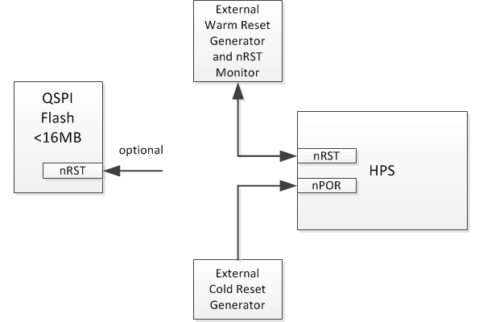
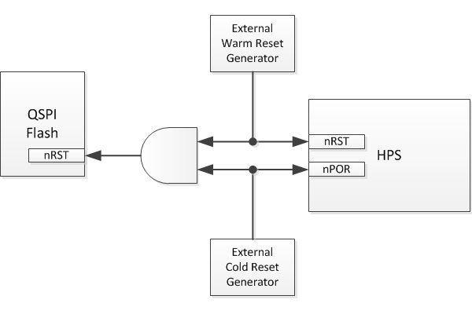
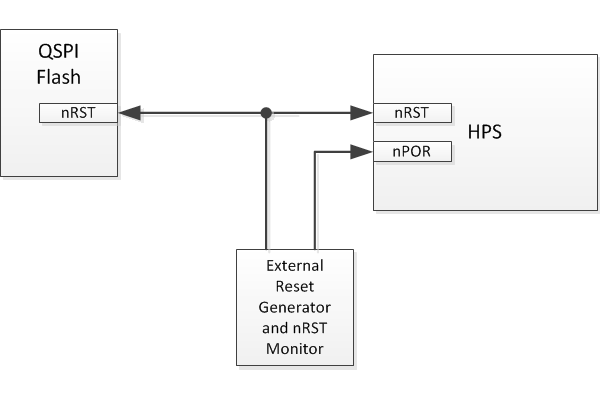
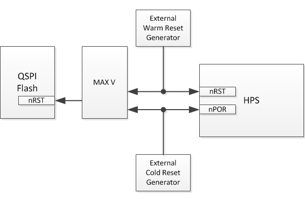

# Cyclone® V and Arria® V SoC QSPI Boot

The Altera SoC Cyclone® V and Arria® V Development board Rev C successfully boots from QSPI after a POR (power on reset) but in most situations it cannot re-boot from QSPI after either a COLD or WARM reset.

The problem arises from the fact that the Boot ROM needs the QSPI Flash part to be in the default 3-byte addressing mode, but the QSPI part is in fact configured by the software (Preloader, U-boot, Linux) to work in 4-byte addressing mode.

This document presents the problem in detail and explains the possible solutions. It also highlights the solution that will be used by the Altera SoC Development board Rev D, which involves resetting the QSPI flash part at each reboot.

## 1. Introduction

The Cyclone® V SoC and Arria® V SoC devices offer the ability to boot the Cortex A9 cluster from a serial NOR flash device using the Quad SPI Flash Controller.

The QSPI Flash Controller, which is built into the HPS core, supports operation with industrial standard SPI flash devices as well as higher performance dual- and quad-SPI flash devices.

The HPS Boot ROM that is executed by the Cortex A9 cluster following a cold or warm reset event is configured in such a way that it could support booting from any SPI flash device that can operate with the Quad SPI Flash Controller, SPI, Dual SPI or Quad SPI. It is accomplished by using a very common configuration setup that all of these devices share regardless of single, dual or quad signaling capability or device density.

Challenges can arise when using more advanced and high density serial flash devices that can operate in modes more capable than the common configuration that is assumed by the HPS boot ROM.

## 2. HPS Boot ROM Requirements

When booting from QSPI, the HPS accesses the Flash in read-only mode. It loads the Preloader image from Flash to OCRAM (On Chip RAM), validates it and then passes control to it.

To accomplish this goal, the HPS Boot ROM is implemented with the following requirements for the QSPI Flash part:

- Single Bit I/O mode (for both commands and data) must be enabled
- 3 byte address mode must be enabled
- Normal read command (0x03) must be available
- The baud rate of the SPI clock is compatible with the serial flash device.

These requirements are fundamentally supported by most serial flash devices from most vendors, as the default setting after powering up or resetting the QSPI Flash part. They represent the minimal requirements that allow the HPS Boot ROM to successfully read the targeted Preloader portion.

## 3. Serial Flash Challenges

There are many vendors of serial flash devices on the market today, they offer a broad selection of devices with various capabilities and densities.

A large number of the basic operations performed by these serial flash devices use common and compatible instructions and signaling characteristics. However, some vendors implement proprietary instructions and signaling requirements for their devices. There is no formal standardization of the communication protocols used by the serial flash vendors.

By necessity the Boot ROM has to use the common denominator of all the flash devices and use only features that are supported by all devices. Also, the Boot ROM has to make some assumptions about the state of the QSPI Flash part.
Some of the areas that can cause problems for the HPS boot ROM are these:

- **The 4-byte Addressing Mode**
  
  For serial flash devices exceeding 16 MB in size, a 4‑byte addressing mode is necessary to access the full memory range. Different vendors provide their own mechanisms for addressing this extended space - some of which are inter-operable across manufacturers, while others are not. Certain vendors use paging or segment registers, some include volatile or non‑volatile configuration bits to select the address mode, others define unique instructions for each mode, and a few support multiple combinations of these methods.

- **Multi-bit Command Signaling**
  
  Serial flash devices with more than single channel communication capability can offer multi-bit command signaling which can be setup with volatile and non-volatile configuration bits.

- **Persistent Segment or Page Register**
  
  Many serial flash devices offer a segment or page register to hold the upper 4th byte of addressing information while using the normal 3 byte addressing mode over the serial channel, However, configuring this register puts the device into a mode that the HPS boot ROM cannot communicate with.

- **Non-volatile Settings**
  
  Many serial flash devices contain *non-volatile configuration* bits that can alter the default power-on reset state and the run-time default reset state of the device i.e. the address mode, segment/page register, and even enabling multi-bit command modes as the default state. However, activating any of these non‑volatile settings can leave the device in a state the HPS boot ROM cannot recover from, even after a hardware reset or power cycle.

- **Serial Flash Reset**
  
  When a serial flash device enters 4‑byte addressing mode or multi‑bit command mode, it must be reset to return to a known state. However, reset mechanisms vary - some devices have reset pins, others use reset commands, and these commands are often vendor‑specific and incompatible. Because of this inconsistency, the Boot ROM cannot reliably reset the QSPI device on its own.

## 4. HPS Reset Considerations

HPS supports two types of resets: COLD and WARM.

**COLD resets** can be generated from the following main sources:

- nPOR pin input being pulled low
- Software writing rstmgr.ctrl.swcoldrstreq
- FPGA sending a COLD reset request

**WARM resets** can be generated from the following main sources:

- nRST pin input being pulled low
- Software writing rstmgr.ctrl.swwarmrstreq
- FPGA sending a WARM reset request
- Watchdogs

The following two signals are available as HPS pins:

| *Pin Name* | *Signal Type* | *Direction* | *Description* |
| :-- | :-- | :-- | :-- |
| nPOR | COLD reset signal | input only | Issues a COLD reset signal to HPS |
| nRST | WARM reset signal | bidirectional | Instructs HPS to perform a WARM reset. Or, driven by HPS when a WARM reset is invoked internally by software, watchdogs, or from FPGA |

**Note:**

1\. All WARM resets are visible outside the chip because the nRST signal is bidirectional. Contrary, the internally generated COLD resets are not visible outside the chip because the nPOR signal is input only.

2\. When a WARM reset is generated from internal sources (software, watchdog or FPGA) the nRST signal is asserted for a software-controlled amount of time. This is accomplished by writing to the rstmgr.counts.nrstcnt.

## 5. Possible Solutions

This section presents 4 different approaches to re-boot successfully from a QSPI Flash device.

### 5.1 Solution 1: Use QSPI Flash Part <16MB

Use a QSPI Flash device smaller than 16MB, 3-byte addressing mode can be used, there is no need to switch to the 4-byte addressing mode. Therefore, the re-boot after both COLD and WARM resets would be successful.

**Note:**
Even in this situation the software must still ensure that it does not use the rest of the potentially problematic issues listed in the ["Serial Flash Challenges"](#3-serial-flash-challenges) section. For example, if persistent multi-bit command modes or other conflicts arise in these smaller flash devices, then reset synchronization may be required.

### 5.2 Solution 2: Reset QSPI Flash Part before Reboot

This solution involves intentionally reset the QSPI Flash each time the HPS is re-booted.

It involves the following:

- Use a QSPI Part with a RESET pin.

- Combine the HPS WARM and COLD reset signals to drive the QSPI Flash reset whenever an HPS reset happens. (An AND gate shown in the diagram because the RESET signals have negative logic.)

In addition to the above change, since the internally-generated COLD resets are not visible outside, the following requirement must also be met:

- Internal COLD resets (from software or FPGA) must be preceded by manually resetting the QSPI flash part either by (1) using manufacturer specific QSPI commands, or (2) by using a GPIO connected to the QSPI flash RESET pin.

- Alternatively, the internal COLD resets can be avoided by design, since they are always intentionally issued, as opposed to WARM resets that be out of control by software or FPGA, e.g. a watchdog timeout.

### 5.3 Solution 3: Use QSPI Flash With Extended 4-byte Addressing Commands

Some QSPI flash manufacturers, like Spansion, offer an extended set of commands that allows 4-byte addressing to be used without switching the chip to 4-byte addressing mode.

**Note:**
Current software implementation of Preloader, U-boot, and Linux do not support the extended 4-byte addressing commands available on some QSPI flash parts.

Even in this situation the software must still ensure that it does not use the rest of the potentially problematic issues listed in the ["Serial Flash Challenges"](#3-serial-flash-challenges) section. For example, if persistent multi-bit command modes or other conflicts arise in these smaller flash devices, then reset synchronization may be required.

### 5.4 Solution 4: Promote WARM Resets to COLD Resets

This solution is similar with the solution implemented on the Altera SoC Development board Rev D with the exception that the external reset monitor and generator detects the WARM resets and converts them to COLD resets.

Whenever the reset generator and monitor detects a WARM reset, it will assert the COLD reset pin to HPS. When this happens, the WARM reset sequence will be aborted, and a COLD reset sequence will be initiated by HPS.

The advantages of this solution are:

- Internally-generated COLD resets will eventually result in a successful booting, even if software does not explicitly reset the QSPI flash part before issuing the COLD reset. This is because first the boot will fail, then after 1-2s (depending on external clock) the watchdog will generate a WARM reset, that will be observed by the reset monitor and converted to a COLD reset that will be successful. The boot will succeed because in this case the QSPI flash part is also reset by the monitor.

- Only one reset generator is required (instead of 2), thus reducing the amount of circuitry.

A few more observations about this solution:

- FPGA generated COLD reset events can occur, however, a recovery delay of the watchdog timeout period may result.
  
- This configuration essentially removes the unique features provided by WARM reset events, since any WARM reset event will create a COLD reset event.

## 6. Solution That Will be Implemented by Altera SoC Development Board Rev D

The Altera SoC Development board Rev D implements Solution #2: Reset QSPI Flash Part before Reboot.

Specific implementation details:

- Use QSPI Flash part with a RESET pin. QSPI Flash part N25Q00AA13GSF40F is replaced by N25Q512A83GSF40F.
- The HPS WARM and COLD reset pins are connected to the onboard MAX V CPLD device.
- QSPI Flash RESET pin is driven by the onboard MAX V CPLD that ANDs together the WARM and COLD reset signals.

## 7. Reference

- [N25Q00AA13GSF40F Datasheet](https://www.mouser.com/ProductDetail/Micron/N25Q00AA13GSF40F?qs=taEdVNyAfdEnWCrB5ksGOA%3D%3D)
- [N25Q512A83GSF40F Datasheet](https://www.mouser.com/ProductDetail/Micron/N25Q512A83GSF40F?qs=taEdVNyAfdEcD1JurtPQng%3D%3D)
