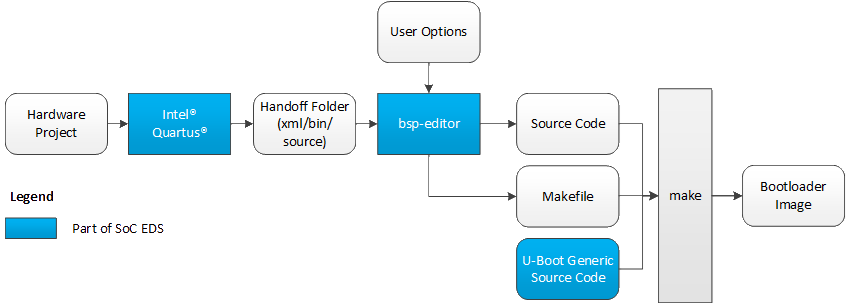
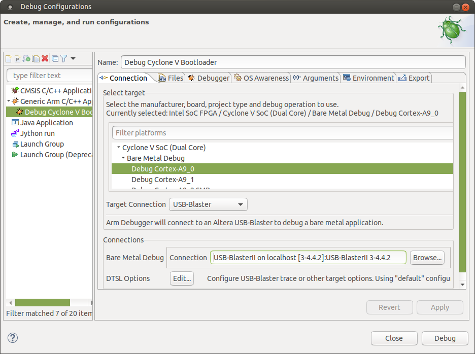

# HPS GHRD Linux Boot Examples for Cyclone® V SX Development Kit

## Introduction

This page contains instructions on how to build U-Boot in the following configurations:

| *Device* | *Quartus Version* | *U-Boot Branch* | *Linux Branch* |
| :-- | :-- | :-- | :-- |
| Cyclone V SoC | 24.1 Std | socfpga_v2024.07 | socfpga-6.6.51-lts |

Starting with SoC EDS Pro version 19.3 and SoC EDS Standard version 19.1, the following changes were made:
   * The bootloader source code was removed from SoC EDS. Instead, the user needs to clone the git trees from https://github.com/altera-opensource/u-boot-socfpga.
   * The same U-Boot branch is used for all SoC FPGA devices: Cyclone V SoC, Arria V SoC, Arria 10 SoC, Stratix 10 SoC, Agilex.
   * The bootloader generator (bsp-editor) still needs to be used for Cyclone V SoC, Arria V SoC and Arria 10 SoC, but:
      * Does not support custom user settings anymore. Instead all custom user settings must be done directly in U-Boot (device tree, configuration and source code).
      * Does not create a makefile which builds the bootloader. Instead the user is notified about this page, which contains instructions on how to build the bootloader.

Important Note:
   * SoC EDS is no longer required to generate the handoff folder for Cyclone V for releases 22.1std and after. Please refer to section below if you are using version 21.1std and older.
   * Arria V SoC flow and Cyclone V SoC flow are identical, the SoC flow is presented in the next section and it is applicable to both device families.
   * Starting with Quartus Pro 20.3, the SoC EDS was discontinued, and the functionality of the tools which were previously part of SoC EDS are provided separately. For Arria 10, the bsp-editor functionality was incorporated in an U-Boot script, and the tool is not needed anymore.

## U-Boot Branches

The official Altera SOCFPGA U-Boot repository is located at https://github.com/altera-opensource/u-boot-socfpga.

Refer to U-Boot documentation for more details: https://github.com/altera-fpga/u-boot-socfpga/blob/socfpga_v2024.07/README

**Note**:
   * A "RC" labeled branch is for internal active development use and customer early access without official customer support.
   * Latest stable branch (no RC labeled) is strongly recommended for development and production use outside of Altera.
   * See [https://github.com/altera-opensource/u-boot-socfpga/blob/HEAD/doc/README.socfpga](README.socfpga) for Quartus and Device support.

### U-Boot Build Flows

For Cyclone V SoC, the Handoff information created by Quartus compilation comes in several formats: C source code, XML, and binary files.
The bsp-editor consumes this information and turns it into source code which is used to build U-Boot.
For older versions of SoC EDS, the user could set various U-Boot parameters in bsp-editor. For the current version of SoC EDS, they have no effect.

### The Old Flow

Previous versions of SoC EDS builds U-boot using the following flow:



   * Most user options (like boot source, enabling ECC scrubbing, watchdog etc) were set through the bsp-editor GUI or the CLI equivalents.
   * U-Boot source code was part of SoC EDS
   * The makefile created by the bsp-editor allowed building the bootloader with a single 'make' command.

### The New Flow
Starting with this release of SoC EDS, the new build flow is depicted below:


   * All the user options defined in the bsp-editor are not applicable anymore. (The user options can be found in the GUI but setting them have no functional effect)
   * All customized user settings must be done directly in U-Boot, including device tree, configuration and source code.
   * The makefile generated by bsp-editor does not build U-Boot, instead it instructs the user to go to this page.
   * The U-boot source code needs to be retrieved by the user from github.
   * A tool called qts_filter (part of U-Boot) needs to be called to convert the handoff files and bsp-editor generated files to the format required by the new U-Boot version.

## U-Boot Examples

### Prerequisites

The following are required:
   1. A host machine running Linux OS. 
      * Ubuntu 20.04 was used in this example. For Ubuntu version 20.04, you are required to installed it manually as it is not included in the OS package.
   2. Internet required to download the U-Boot and tools from github. If you are behind a firewall you will need your system administrator to enable you to get to the git trees.
   3. Altera SoC FPGA Development Kit hardware (devkit): Cyclone V SoC, Arria 10 SoC, Stratix 10 SoC or Agilex
      * For Cyclone V SoC devices, use **Quartus Standard version 24.1**
      * Download Quartus installer from https://www.intel.com/content/www/us/en/software-kit/849752/intel-quartus-prime-standard-edition-design-software-version-24-1-for-linux.html 
      * Quartus® Prime Pro and Standard Software User Guides: https://www.intel.com/content/www/us/en/support/programmable/support-resources/design-software/user-guides.html 

Download and setup the toolchain required for Cyclone V SoC and Arria 10 SoC:
```bash
wget https://developer.arm.com/-/media/Files/downloads/gnu/11.2-2022.02/binrel/gcc-arm-11.2-2022.02-x86_64-arm-none-linux-gnueabihf.tar.xz
tar xf gcc-arm-11.2-2022.02-x86_64-arm-none-linux-gnueabihf.tar.xz
rm gcc-arm-11.2-2022.02-x86_64-arm-none-linux-gnueabihf.tar.xz
export PATH=`pwd`/gcc-arm-11.2-2022.02-x86_64-arm-none-linux-gnueabihf/bin:$PATH
```

**Note**: the examples in this page boots the devkit to U-boot shell and further to the Linux OS. This requires the Linux kernel, device tree and root filesystem. 
Without the OS binaries, the devkit would boot to the U-Boot shell only. You may use your own Linux binaries, a simple way to build them is in [Appendix 1 - Building Linux Binaries](#appendix-1---building-linux-binaries). In either case the boot instruction assumes the binaries are located in the _$LINUX_BIN_ folder.

## 1. Cyclone V SoC - Boot from SD Card

### 1.A. Setup

Create top folder:

```bash
mkdir cv_example.sdmmc
cd cv_example.sdmmc
export TOP_FOLDER=`pwd`
```

Compile Hardware Design:

```bash
cd $TOP_FOLDER
rm -rf  QPDS24.1STD_REL_GSRD_PR.zip ghrd-socfpga-QPDS24.1STD_REL_GSRD_PR
wget https://github.com/altera-opensource/ghrd-socfpga/archive/refs/tags/QPDS24.1STD_REL_GSRD_PR.zip
unzip QPDS24.1STD_REL_GSRD_PR.zip
mv ghrd-socfpga-QPDS24.1STD_REL_GSRD_PR/cv_soc_devkit_ghrd .
rm -rf  ghrd-socfpga-QPDS24.1STD_REL_GSRD_PR  QPDS24.1STD_REL_GSRD_PR.zip
cd cv_soc_devkit_ghrd
rm -rf software
~/intelFPGA/24.1std/nios2eds/nios2_command_shell.sh \
make generate_from_tcl
~/intelFPGA/24.1std/nios2eds/nios2_command_shell.sh \
make sof
~/intelFPGA/24.1std/nios2eds/nios2_command_shell.sh \
make rbf
```

### 1.B. Prepare U-Boot

Clone the U-Boot source code:

```bash
cd $TOP_FOLDER/cv_soc_devkit
mkdir software/bootloader && cd software/bootloader
git clone https://github.com/altera-opensource/u-boot-socfpga
cd u-boot-socfpga
```

Run the **cv_bsp_generator.py** script with python2. The script moves the source code from the handoff folder, format and copy them to the U-Boot source code.

```bash
cd $TOP_FOLDER/cv_soc_devkit_ghrd/software/bootloader/u-boot-socfpga/arch/arm/mach-socfpga/cv_bsp_generator

python cv_bsp_generator.py -i $TOP_FOLDER/cv_soc_devkit_ghrd/hps_isw_handoff/soc_system_hps_0 \
-o ../../../../board/altera/cyclone5-socdk/qts
```

After running the cv_bsp_generator.py script, these files will be in ../board/altera/cyclone5-socdk/qts:

   * iocsr_config.h
   * pll_config.h
   * pinmux_config.h
   * sdram_config.h

Configure and build U-Boot:

```bash
cd $TOP_FOLDER/cv_soc_devkit_ghrd/software/bootloader/u-boot-socfpga
export CROSS_COMPILE=arm-none-linux-gnueabihf-
make socfpga_cyclone5_defconfig
make -j 48
```

The following files will be in the $TOP_FOLDER/cv_soc_devkit_ghrd/software/bootloader/u-boot-socfpga folder:

| File | Description |
| :-- | :-- |
| spl/u-boot-spl | SPL ELF executable |
| u-boot | U-Boot ELF executable |
| u-boot-with-spl.sfp | Bootable file: four copies of SPL and one copy on U-Boot image |

### 1.C. Prepare SD Card Image

This section presents how to prepare a bootable SD card which boots up Linux OS. If you do not need Linux, you may ommit this part, the devkit will only boot to the U-Boot shell.

Prerequisite: The following Linux binaries are assumed to be pre-built in the $LINUX_BIN/a9 folder:

| File | Description |
| :-- | :-- |
| zImage | Compressed kernel image |
| socfpga_cyclone5_socdk.dtb | Linux device tree blob |
| core-image-minimal-cyclone5.tar.gz | Linux rootfilesystem |

Setup SD Card folder

```bash
cd $TOP_FOLDER/
sudo rm -rf sd_card && mkdir sd_card && cd sd_card
wget https://releases.rocketboards.org/2021.04/gsrd/tools/make_sdimage_p3.py
chmod +x make_sdimage_p3.py
```

Prepare FAT partition:

```bash
cd $TOP_FOLDER/sd_card
mkdir sdfs &&  cd sdfs
cp $LINUX_BIN/a9/zImage .
cp $LINUX_BIN/a9/socfpga_cyclone5_socdk.dtb .
cp $TOP_FOLDER/cv_soc_devkit_ghrd/output_files/soc_system.rbf .
wget https://releases.rocketboards.org/2025.03/gsrd/c5_gsrd/u-boot.scr

mkdir extlinux
echo "LABEL Linux Default" > extlinux/extlinux.conf
echo "    KERNEL ../zImage" >> extlinux/extlinux.conf
echo "    FDT ../socfpga_cyclone5_socdk.dtb" >> extlinux/extlinux.conf
echo "    APPEND root=/dev/mmcblk0p2 rw rootwait earlyprintk console=ttyS0,115200n8" >> extlinux/extlinux.conf
```

Prepare Rootfs partition:

```bash
cd $TOP_FOLDER/sd_card
sudo rm -rf rootfs
mkdir rootfs && cd rootfs
sudo tar xf $LINUX_BIN/a9/core-image-minimal-cyclone5.tar.gz
sudo rm -rf lib/modules/*
sudo cp -r $LINUX_BIN/a9/modules/* lib/modules
```

Copy the U-boot bootable binary file:

```bash
cd $TOP_FOLDER/sd_card
cp ../cv_soc_devkit_ghrd/software/bootloader/u-boot-socfpga/u-boot-with-spl.sfp .
```

Prepare SD card image:

```bash
cd $TOP_FOLDER/sd_card
sudo python3 ./make_sdimage_p3.py -f \
-P u-boot-with-spl.sfp,num=3,format=raw,size=10M,type=A2  \
-P sdfs/*,num=1,format=fat32,size=100M \
-P rootfs/*,num=2,format=ext3,size=300M \
-s 512M \
-n sdcard_cv.img
```

### 1.D. Board Setting to Boot from SD Card

Set the Boot Select jumpers to boot from the 3.3V SD device:
| Jumper Name | Component Label | Setting |
| :-- | :-- | :-- |
| BOOTSEL2 | J30 | 1 (left) |
| BOOTSEL1 | J29 | 0 (right) |
| BOOTSEL0 | J28 | 1 (left) |

### 1.E. Boot Up the Board

Power cycle the board - it will boot to Linux OS, use username 'root' with no password to log in:

**Note**: the Terminal log below is for reference only, the versions and output print may not match exactly as the version used in this build.

```bash
U-Boot SPL 2022.04-21237-gfda0d9176f-dirty (Dec 05 2022 - 22:57:54 -0600)
DDRCAL: Scrubbing ECC RAM (1024 MiB).
DDRCAL: SDRAM-ECC initialized success with 580 ms
Trying to boot from MMC1

U-Boot 2022.04-21237-gfda0d9176f-dirty (Dec 05 2022 - 22:57:54 -0600)

CPU:   Altera SoCFPGA Platform
FPGA:  Altera Cyclone V, SE/A6 or SX/C6 or ST/D6, version 0x0
BOOT:  SD/MMC Internal Transceiver (3.0V)
       Watchdog enabled
DRAM:  1 GiB
Core:  25 devices, 15 uclasses, devicetree: separate
MMC:   dwmmc0@ff704000: 0
Loading Environment from MMC... *** Warning - bad CRC, using default environment

In:    serial
Out:   serial
Err:   serial
Model: Altera SOCFPGA Cyclone V SoC Development Kit
Net:
Warning: ethernet@ff702000 (eth0) using random MAC address - 5e:9b:71:a1:db:35
eth0: ethernet@ff702000
Hit any key to stop autoboot:  0
Failed to load 'u-boot.scr'
switch to partitions #0, OK
mmc0 is current device
Scanning mmc 0:1...
Found /extlinux/extlinux.conf
Retrieving file: /extlinux/extlinux.conf
1:      Linux Default
Retrieving file: /extlinux/../zImage
append: root=/dev/mmcblk0p2 rw rootwait earlyprintk console=ttyS0,115200n8
Retrieving file: /extlinux/../socfpga_cyclone5_socdk.dtb
Kernel image @ 0x1000000 [ 0x000000 - 0x52fab0 ]
## Flattened Device Tree blob at 02000000
   Booting using the fdt blob at 0x2000000
   Loading Device Tree to 09ff6000, end 09fffa09 ... OK

Starting kernel ...

Deasserting all peripheral resets
[    0.000000] Booting Linux on physical CPU 0x0
[    0.000000] Linux version 5.10.70-75443-gdcd92725a9dd (theeban@test1-linux-lab) (arm-none-linux-gnueabihf-gcc (GNU Toolchain for the A-profile Architecture 10.2-2020.11 (arm-10.16)) 10.2.1 20201103, GNU ld (GNU Toolchain for the A-profile Architecture 10.2-2020.11 (arm-10.16)) 2.35.1.20201028) #1 SMP Mon Dec 27 21:58:00 CST 2021
[    0.000000] CPU: ARMv7 Processor [413fc090] revision 0 (ARMv7), cr=10c5387d
[    0.000000] CPU: PIPT / VIPT nonaliasing data cache, VIPT aliasing instruction cache
[    0.000000] OF: fdt: Machine model: Altera SOCFPGA Cyclone V SoC Development Kit

...

[    6.211413] socfpga-dwmac ff702000.ethernet eth0: No Safety Features support found
[    6.219217] socfpga-dwmac ff702000.ethernet eth0: registered PTP clock
[    6.226573] socfpga-dwmac ff702000.ethernet eth0: configuring for phy/rgmii link mode
udhcpc: started, v1.34.1
udhcpc: broadcasting discover
udhcpc: broadcasting discover
udhcpc: broadcasting discover
udhcpc: no lease, forking to background
done.
Starting syslogd/klogd: done

Poky (Yocto Project Reference Distro) 3.4.1 cyclone5 /dev/ttyS0

cyclone5 login: root
root@cyclone5:~#
```

## 2. Cyclone V SoC - Boot from QSPI

The methodology to boot from QSPI is similar to boot from SD card, with the following differences:
   * Additional U-Boot configuration is performed, to store environment in QSPI Flash Memory instead of SD card
   * Binaries are written to QSPI Flash Memory instead of SD card

See [Appendix 1 - Building Linux Binaries](#appendix-1---building-linux-binaries) for instructions on how to build the required Linux binaries for thisexample.

### 2.A. Setup


Create top folder:

```bash
mkdir cv_example.qspi
cd cv_example.qspi
export TOP_FOLDER=`pwd`
```

Compile hardware design:

```bash
cd $TOP_FOLDER
rm -rf  ghrd-socfpga-QPDS24.1STD_REL_GSRD_PR QPDS24.1STD_REL_GSRD_PR.zip cv_soc_devkit_ghrd
wget https://github.com/altera-opensource/ghrd-socfpga/archive/refs/tags/QPDS24.1STD_REL_GSRD_PR.zip
unzip QPDS24.1STD_REL_GSRD_PR.zip
mv ghrd-socfpga-QPDS24.1STD_REL_GSRD_PR/cv_soc_devkit_ghrd .
rm -rf  ghrd-socfpga-QPDS24.1STD_REL_GSRD_PR QPDS24.1STD_REL_GSRD_PR.zip
cd cv_soc_devkit_ghrd
rm -rf software
~/intelFPGA/24.1std/nios2eds/nios2_command_shell.sh \
make generate_from_tcl
~/intelFPGA/24.1std/nios2eds/nios2_command_shell.sh \
make sof
```

### 2.B. Prepare U-Boot

Clone the U-Boot source code:

```bash
cd $TOP_FOLDER/cv_soc_devkit_ghrd/software/bootloader
git clone https://github.com/altera-opensource/u-boot-socfpga
cd u-boot-socfpga
```

Run the **cv_bsp_generator.py** script with python2. The script moves the source code from the handoff folder, format and copy them to the U-Boot source code.

```bash
cd $TOP_FOLDER/cv_soc_devkit_ghrd/software/bootloader/u-boot-socfpga/arch/arm/mach-socfpga/cv_bsp_generator

python cv_bsp_generator.py -i $TOP_FOLDER/cv_soc_devkit_ghrd/hps_isw_handoff/soc_system_hps_0 \
-o ../../../../board/altera/cyclone5-socdk/qts
```

After running the cv_bsp_generator.py script, these files will be in ../board/altera/cyclone5-socdk/qts:

   * iocsr_config.h
   * pll_config.h
   * pinmux_config.h
   * sdram_config.h

Configure and build U-Boot:

```bash
cd $TOP_FOLDER/cv_soc_devkit_ghrd/software/bootloader/u-boot-socfpga
export CROSS_COMPILE=arm-none-linux-gnueabihf-
make socfpga_cyclone5_qspi_defconfig
make -j 48
```

The following files will be built in the $TOP_FOLDER/cv_soc_devkit_ghrd/software/bootloader/u-boot-socfpga folder:

| File | Description |
| :-- | :-- |
| spl/u-boot-spl | SPL ELF executable |
| u-boot | U-Boot ELF executable |
| u-boot-with-spl.sfp | Bootable file: four copies of SPL and one copy on U-Boot image |

### 2.C. Prepare QSPI Binaries

This section presents how to boot from QSPI Flash Memory which boots up Linux OS. If you do not need Linux, you may ommit this part, the devkit will only boot to the U-Boot shell.

The following Linux binaries are assumed to be pre-built in the $LINUX_BIN/a9 folder:

| File | Description |
| :-- | :-- |
| zImage | Compressed kernel image |
| socfpga_cyclone5_socdk.dtb | Linux device tree blob |
| core-image-minimal-cyclone5.tar.gz | Linux rootfilesystem |

Create qspi_bin folder:

```bash
cd $TOP_FOLDER/
sudo rm -rf qspi_bin && mkdir qspi_bin && cd qspi_bin
cp ../cv_soc_devkit_ghrd/software/bootloader/u-boot-socfpga/u-boot-with-spl.sfp .
cp $LINUX_BIN/a9/zImage .
cp $LINUX_BIN/a9/socfpga_cyclone5_socdk.dtb .
```

Build the rootfs JFFS2 image:

```bash
cd $TOP_FOLDER/qspi_bin
sudo rm -rf core-image-minimal-cyclone5-rootfs
mkdir core-image-minimal-cyclone5-rootfs
cd core-image-minimal-cyclone5-rootfs
sudo tar xf $LINUX_BIN/a9/core-image-minimal-cyclone5.tar.gz
sudo rm -rf lib/modules/*
cd ..
sudo mkfs.jffs2 -r core-image-minimal-cyclone5-rootfs -s 256 -e 64KiB --squash -o core-image-minimal-cyclone5-rootfs.jffs2
sudo chown $USER:$USER core-image-minimal-cyclone5-rootfs.jffs2
sudo rm -rf core-image-minimal-cyclone5-rootfs
```

The following files are built:

| File | Description |
| :-- | :-- |
| u-boot-with-spl.sfp | Four SPL images and U-Boot image|
| socfpga_cyclone5_socdk.dtb | Linux device tree blob |
| zImage | Compressed linu kernel |
| core-image-minimal-cyclone5-rootfs.jffs2 | Linux rootfs image |

### 2.D (1). Flash the QSPI using Quartus Programmer

Set the Boot Select jumpers to boot from the 3.3V QSPI device:

| Jumper Name | Component Label | Setting |
| :-- | :-- | :-- |
| BOOTSEL2 | J30 | 1 (left) |
| BOOTSEL1 | J29 | 1 (left) |
| BOOTSEL0 | J28 | 1 (left) |

Flash the QSPI Flash Memory following the addresses assigned below:

| Address | File | Description |
| :-- | :-- | :-- |
| 0x0000000 | u-boot-with-spl.sfp | Four SPL binaries and U-Boot image |
| 0x0200000 | n/a | U-Boot environment |
| 0x0220000 | socfpga_cyclone5_socdk.dtb | Linux device tree |
| 0x0230000 | zImage | Linux kernel |
| 0x0800000 | core-image-minimal-cyclone5-rootfs.jffs2 | Linux rootfs |

Flash the QSPI binaries:

```bash
cd $TOP_FOLDER/qspi_bin

~/intelFPGA/24.1std/nios2eds/nios2_command_shell.sh \
quartus_hps -c 1 -o pv -a 0x000000 u-boot-with-spl.sfp

~/intelFPGA/24.1std/nios2eds/nios2_command_shell.sh \
quartus_hps -c 1 -o pv -a 0x220000 socfpga_cyclone5_socdk.dtb

~/intelFPGA/24.1std/nios2eds/nios2_command_shell.sh \
quartus_hps -c 1 -o pv -a 0x230000 zImage

~/intelFPGA/24.1std/nios2eds/nios2_command_shell.sh \
quartus_hps -c 1 -o pv -a 0x800000 -s 0x3800000 core-image-minimal-cyclone5-rootfs.jffs2
```

### 2.D (2). Flash the QSPI using TFTP and U-Boot

Flashing the QSPI FLash Memory by using **quartus_hps** might be a slow process, a faster alternative is to load U-Boot through a **DS-5 debugger**, download the files through TFTP, and write them with U-Boot.

1. Erase the QSPI with quartus_hps:

```bash
~/intelFPGA/24.1std/nios2eds/nios2_command_shell.sh \
quartus_hps -c 1 -o E
```

2. Copy the binaries to a TFTP folder on your host machine.

3. Run U-Boot from the debugger as shown in [Appendix 2 - Run U-Boot with the Debugger from Command Line](#appendix-2---run-u-boot-with-the-debugger-from-command-line)

4. Connnect your U-Boot to the network, and specify the IP address of you host machine:
```bash
setenv autoload no
dhcp
setenv serverip <your_server_ip>
```

1. In U-Boot, download binaries over TFTP, and write the to QSPI:

```bash
sf probe
tftp ${loadaddr} u-boot-with-spl.sfp;sf write ${loadaddr} 0x000000 ${filesize}
tftp ${loadaddr} socfpga_cyclone5_socdk.dtb;sf write ${loadaddr} 0x220000 ${filesize}
tftp ${loadaddr} zImage;sf write ${loadaddr} 0x230000 ${filesize}
tftp ${loadaddr} core-image-minimal-cyclone5-rootfs.jffs2;sf write ${loadaddr} 0x800000 ${filesize}
```

### 2.E. Boot Up the Board

Power cycle the board - it will boot to Linux OS, use username 'root' with no password to log in:

**Note**: the Terminal log below is for reference only, the versions and output print may not match exactly as the version used in this build.

```bash
U-Boot SPL 2021.07-16360-gee63370553-dirty (Dec 20 2021 - 12:31:46 -0600)
DDRCAL: Scrubbing ECC RAM (1024 MiB).
DDRCAL: SDRAM-ECC initialized success with 579 ms
Trying to boot from SPI

U-Boot 2021.07-16360-gee63370553-dirty (Dec 20 2021 - 12:31:46 -0600)

CPU:   Altera SoCFPGA Platform
FPGA:  Altera Cyclone V, SE/A6 or SX/C6 or ST/D6, version 0x0
BOOT:  QSPI Flash (3.0V)
       Watchdog enabled
DRAM:  1 GiB
MMC:   dwmmc0@ff704000: 0
Loading Environment from SPIFlash... SF: Detected n25q512ax3 with page size 256 Bytes, erase size 64 KiB, total 64 MiB
*** Warning - bad CRC, using default environment

In:    serial
Out:   serial
Err:   serial
Model: Altera SOCFPGA Cyclone V SoC Development Kit
Net:   
Warning: ethernet@ff702000 (eth0) using random MAC address - 2e:d9:0c:64:69:0b
eth0: ethernet@ff702000
Hit any key to stop autoboot:  0 
SF: Detected n25q512ax3 with page size 256 Bytes, erase size 64 KiB, total 64 MiB
device 0 offset 0x230000, size 0x5d0000
SF: 6094848 bytes @ 0x230000 Read: OK
device 0 offset 0x220000, size 0x10000
SF: 65536 bytes @ 0x220000 Read: OK
Kernel image @ 0x1000000 [ 0x000000 - 0x52fbb0 ]
## Flattened Device Tree blob at 02000000
   Booting using the fdt blob at 0x2000000
   Loading Device Tree to 09ff6000, end 09fffa09 ... OK

Starting kernel ...

Deasserting all peripheral resets
[    0.000000] Booting Linux on physical CPU 0x0
[    0.000000] Linux version 5.10.70-75443-gdcd92725a9dd-dirty (radu@linux-machine) (arm-none-linux-gnueabihf-gcc (GNU Toolchain for the A-profile Architecture 10.2-2020.11 (arm-10.16)) 10.2.1 20201103, GNU ld (GNU Toolchain for the A-profile Architecture 10.2-2020.11 (arm-10.16)) 2.35.1.20201028) #1 SMP Mon Dec 20 11:18:16 CST 2021
[    0.000000] CPU: ARMv7 Processor [413fc090] revision 0 (ARMv7), cr=10c5387d
[    0.000000] CPU: PIPT / VIPT nonaliasing data cache, VIPT aliasing instruction cache
[    0.000000] OF: fdt: Machine model: Altera SOCFPGA Cyclone V SoC Development Kit

...

[    5.231684] socfpga-dwmac ff702000.ethernet eth0: configuring for phy/rgmii link mode
[    8.341623] socfpga-dwmac ff702000.ethernet eth0: Link is Up - 1Gbps/Full - flow control off
[    8.350073] IPv6: ADDRCONF(NETDEV_CHANGE): eth0: link becomes ready

Poky (Yocto Project Reference Distro) 3.4.1 cyclone5 /dev/ttyS0

cyclone5 login: root
root@cyclone5:~#
```

## Appendix 1 - Building Linux Binaries

This section details how to build the Linux binaries which are used in the boot examples above.
Building Linux is beyond the scope of this page, and minimal instructions are included for reference only.

### Prerequisites

This example is tested on Ubuntu 18.04LTS. The Linux libraries and packages required to be installed in order to build the Linux kernel and rootf are listed below:

```bash
sudo apt-get install gawk wget git-core diffstat unzip texinfo \
gcc-multilib  build-essential chrpath socat cpio python python3 \
python3-pip python3-pexpect  xz-utils debianutils iputils-ping \
python3-git python3-jinja2 libegl1-mesa libsdl1.2-dev  pylint3 xterm \
libncurses-dev gawk flex bison openssl libssl-dev
```

Prepare a **LINUX_BIN** directory for the binaries.

```bash
rm -rf linux-bin && mkdir linux-bin
export set LINUX_BIN=`pwd`/linux-bin
mkdir -p $LINUX_BIN/a9
```

### Building Linux Kernel

This section presents how to build the Linux kernel used for the boot examples on this page. Refer to https://rocketboards.org/foswiki/Main/GettingStarted for complete instructions.

Prepare a **LINUX_TOP** folder:

```bash
<rm -rf linux && mkdir linux
export set LINUX_TOP=`pwd`/linux
```

Download and setup the toolchain:

```bash
<pre>cd $LINUX_TOP
export ARCH=arm
export CROSS_COMPILE=arm-none-linux-gnueabihf-
```

Clone the Linux git tree to retrieve the code:

```bash
cd $LINUX_TOP
git clone https://github.com/altera-opensource/linux-socfpga linux-socfpga.a9
cd linux-socfpga.a9
```

Most Cyclone V SoC DevKits equipped with a 512MB QSPI flash device, while the Linux kernel DTS assumes the board is using a 1Gb (128MB). 
If the board has the standard 512MB one, change the file linux-socfpga/arch/arm/boot/dts/socfpga_cyclone5_socdk.dts accordingly before building dtbs:

```bash
         partition@qspi-rootfs {
         /* 56MB for jffs2 data. */
         label = "Flash 0 jffs2 Filesystem";
         reg = <0x800000 0x3800000>;
      };
```

The lines above can be added to the DTS by using a "sed" commands:

```bash
sed -i 's/120MB for jffs2 data/56MB for jffs2 data/g' arch/arm/boot/dts/socfpga_cyclone5_socdk.dts
sed -i 's/<0x800000 0x7800000>;/<0x800000 0x3800000>;/g' arch/arm/boot/dts/socfpga_cyclone5_socdk.dts
```

Build the Linux kernel:

```bash
make socfpga_defconfig
make -j 48 zImage Image dtbs modules
make -j 48 modules_install INSTALL_MOD_PATH=modules_install
rm -rf modules_install/lib/modules/*/build
rm -rf modules_install/lib/modules/*/source
```

Link all the relevant files to $LINUX_BIN

```bash
ln -s $LINUX_TOP/linux-socfpga.a9/arch/arm/boot/zImage $LINUX_BIN/a9/
ln -s $LINUX_TOP/linux-socfpga.a9/arch/arm/boot/Image $LINUX_BIN/a9/
ln -s $LINUX_TOP/linux-socfpga.a9/arch/arm/boot/dts/socfpga_cyclone5_socdk.dtb $LINUX_BIN/a9/
ln -s $LINUX_TOP/linux-socfpga.a9/arch/arm/boot/dts/socfpga_arria10_socdk_sdmmc.dtb $LINUX_BIN/a9/
ln -s $LINUX_TOP/linux-socfpga.a9/arch/arm/boot/dts/socfpga_arria10_socdk_qspi.dtb $LINUX_BIN/a9/
ln -s $LINUX_TOP/linux-socfpga.a9/arch/arm/boot/dts/socfpga_arria10_socdk_nand.dtb $LINUX_BIN/a9/
ln -s $LINUX_TOP/linux-socfpga.a9/modules_install/lib/modules $LINUX_BIN/a9/
```

The following items are linked in the $LINUX_BIN/a9 folder:

| Item | Description |
| :-- | :-- |
| zImage | compressed kernel image |
| Image | uncompressed kernel image |
| socfpga_cyclone5_socdk.dtb | cyclone v device tree blob for both sdmmc and qspi boot |
| socfpga_arria10_socdk_sdmmc.dtb | arria 10 device tree blob for sdmmc boot |
| socfpga_arria10_socdk_qspi.dtb | arria 10 device tree blob for qspi boot |
| socfpga_arria10_socdk_nand.dtb | arria 10 device tree blob for nand boot |
| modules | kernel loadable modules |

### Building Yocto Rootfs

This section presents how to build the Linux rootfs using the Yocto recipes. 
Note that the yocto recipes build everything by default, but only the rootfs is needed.

First, make sure the Yocto system requirements are met.
Refer to https://docs.yoctoproject.org/3.4.1/ref-manual/system-requirements.html#supported-linux-distributions

Tnstall the required packages on Ubuntu:

```bash
sudo apt install gawk wget git diffstat unzip texinfo gcc build-essential chrpath \
socat cpio python3 python3-pip python3-pexpect xz-utils debianutils iputils-ping \
python3-git python3-jinja2 libegl1-mesa libsdl1.2-dev pylint3 xterm python3-subunit \
mesa-common-dev zstd liblz4-tool
```

Prepare a top folder:

```bash
cd $LINUX_TOP
mkdir rootfs && cd rootfs
export set ROOTFS_TOP=`pwd`
```

Clone and build the Yocto image:

```bash
cd $ROOTFS_TOP
rm -rf cv && mkdir cv && cd cv
git clone -b kirkstone https://git.yoctoproject.org/poky
git clone -b kirkstone https://git.yoctoproject.org/meta-intel-fpga
source poky/oe-init-build-env ./build
echo 'MACHINE = "cyclone5"' >> conf/local.conf
echo 'BBLAYERS += " ${TOPDIR}/../meta-intel-fpga "' >> conf/bblayers.conf
# Uncomment next line to add more packages to the image
# echo 'CORE_IMAGE_EXTRA_INSTALL += "openssh gdbserver"' >> conf/local.conf
bitbake core-image-minimal
ln -s $ROOTFS_TOP/cv/build/tmp/deploy/images/cyclone5/core-image-minimal-cyclone5.tar.gz $LINUX_BIN/a9/
```

The following files will be in the $LINUX_BIN/a9 folder:

| File | Description |
| :-- | :-- |
| core-image-minimal-cyclone5.tar.gz | Cyclone V rootfs archive |

**Note**: You can also use a Docker container to build the Yocto recipes, refer to https://rocketboards.org/foswiki/Documentation/DockerYoctoBuild for details. When using a Docker container, it does not matter what Linux distribution or packages you have installed on your host, as all dependencies are provided by the Docker container.

## Appendix 2 - Run U-Boot with the Debugger from Command Line

This section presents examples on how to run U-Boot with the Arm Development Studio from command line. This offers a simple and convenient way to run U-Boot and use it for example to program onboard flash.

Use the binaries built for [**Cyclone V SoC Boot from SD Card**](#1-cyclone-v-soc---boot-from-sd-card) example:

```bash
cd cv_example.sdmmc
```

Create debugger script:

```bash
cat &lt;&lt;EOT &gt; cv_soc_devkit_ghrd/software/bootloader/run-u-boot.ds
# initialize system
stop
wait 5s
reset
stop
wait 5s
set trust-ro-sections-for-opcodes off

# load and run SPL
loadfile u-boot-socfpga/spl/u-boot-spl 0x0
start
wait
restore u-boot-socfpga/spl/u-boot-spl-dtb.bin binary 0xffff0000
tbreak spl_boot_device
# <- stop script here if you need to debug SPL
continue
wait 60s

# load and run U-Boot
delete
loadfile u-boot-socfpga/u-boot
start 
wait
restore u-boot-socfpga/u-boot.dtb binary &_end
# tbreak relocate_code
# continue
# wait 60s
# symbol-file "\$sdir/u-boot-socfpga/u-boot" ((gd_t*)\$r9)->reloc_off
# thbreak board_init_r
# continue
# wait 60s
# <- stop script here if you need to debug U-Boot
continue
EOT
```

4. Run =jtagconfig= to determine the connection parameters:
```bash
~/intelFPGA_pro/24.1std/nios2eds/nios2_command_shell.sh jtagconfig
1) USB-BlasterII [3-3.1.3]
  4BA00477   SOCVHPS
  02D020DD   5CSEBA6(.|ES)/5CSEMA6/..
```

1. Run the debugger from command line, using the connection parameters reported above by **jtagconfig** (In this example: USB-BlasterII 3-3.1.3):
```bash
cd cv_soc_devkit_ghrd/software/bootloader
~/intelFPGA_pro/24.1std/nios2eds/nios2_command_shell.sh \
/opt/arm/developmentstudio-2025.0-1/bin/armdbg  \
--cdb-entry="Altera SoC FPGA::Cyclone V SoC (Dual Core)::Bare Metal Debug::Bare Metal Debug::Debug Cortex-A9_0::USB-Blaster" \
--cdb-entry-param="rvi_address=USB-BlasterII on localhost [3-3.1.3]:USB-BlasterII 3-3.1.3" \
--continue_on_error=true \
--stop_on_connect=false \
-s run-u-boot.ds
```

6. The serial console will show SPL then U-Boot being run:
```bash
U-Boot SPL 2020.10-10892-gced41867be-dirty (Mar 16 2021 - 20:13:21 -0500)
DDRCAL: Scrubbing ECC RAM (1024 MiB).
DDRCAL: SDRAM-ECC initialized success with 579 ms

U-Boot 2020.10-10892-gced41867be-dirty (Mar 16 2021 - 20:13:21 -0500)
CPU:   Altera SoCFPGA Platform
FPGA:  Altera Cyclone V, SE/A6 or SX/C6 or ST/D6, version 0x0
BOOT:  SD/MMC Internal Transceiver (3.0V)
       Watchdog enabled
DRAM:  1 GiB
MMC:   dwmmc0@ff704000: 0
Loading Environment from MMC... Card did not respond to voltage select!
*** Warning - No block device, using default environment

In:    serial
Out:   serial
Err:   serial
Model: Altera SOCFPGA Cyclone V SoC Development Kit
Net:   
Warning: ethernet@ff702000 (eth0) using random MAC address - 9a:6b:16:ac:03:c1
eth0: ethernet@ff702000
Hit any key to stop autoboot:  0
=> 
```

## Appendix 3 - Debugging U-Boot with Arm DS Eclipse

This section presents examples of how to debug U-Boot with the Arm Development Studio Eclipse-based GUI.


1. Use the binaries built for [**Cyclone V SoC Boot from SD Card**](#1-cyclone-v-soc---boot-from-sd-card) example:
```bash
cd cv_example.sdmmc/software/bootloader
```

1. Start the Arm Development Studio Eclipse-based GUI:
```bash
~/intelFPGA/24.1std/nios2eds/nios2_command_shell.sh \
/opt/arm/developmentstudio-2025.0-1/bin/armds_ide -data workspace &
```

**Note**: the above creates a new workspace in the cv_example.sdmmc/software/bootloader folder.

1. In *Eclipse GUI*,  Go to **Run > Debug Configurations** to open the **Debug Configurations** window.

2. In the **Debug Configurations** window
   * Select the *Generic Arm C/C++ Application* on the left panel and right-click it. From the menu that appears, select *New Configuration*.
   * Edit the *Name* field from "New_configuration" to something more descriptive, such as "Debug Cyclone V Bootloader"
  
3. In the **Connection** tab:
   * Go to *Select target* section and select *Altera® SoC FPGA > Cyclone V SoC (Dual Core) > Bare Metal Debug > Debug Cortex-A9_0*
   * Select the *Target Connection* to be *USB Blaster*
   * Click the *Bare Metal Debug > Connection*  *Browse* button and select your cable.
   
      The **Debug Configurations** window should now look like this:

      

1. Go to the **Debugger** tab, and do the following
   * Select *Connect Only*
   * Check *Execute debugger commands* and enter the following commands:

      ```bash
      # initialize system
      stop
      wait 5s
      reset
      stop
      wait 5s
      set trust-ro-sections-for-opcodes off

      # load and start SPL
      loadfile u-boot-socfpga/spl/u-boot-spl 0x0
      start
      wait
      restore u-boot-socfpga/spl/u-boot-spl-dtb.bin binary 0xffff0000
      ```

   * Uncheck *Host working directory > Use default* and edit the value to add "/../" so that it looks in the parent folder of the workspace

      The **Debug Configurations** window should now look like this:

      


7. Click the *Debug* button. Arm Development Studio will run the debug commands, therefore downloading the SPL to board and starting it.
      The Eclipse window should now look like this:

      


8. At this point you can use standard debug techniques to debug U-Boot SPL: viewing registers, variables, putting breakpoints, running step-by-step, etc.

9. Debugging U-Boot is similiar to debugging SPL, just that a different script is used, as shown below:

```bash
# initialize system
stop
wait 5s
reset
stop
wait 5s
set trust-ro-sections-for-opcodes off

# load SPL and run up until spl_boot_device
loadfile u-boot-socfpga/spl/u-boot-spl 0x0
start
wait
restore u-boot-socfpga/spl/u-boot-spl.dtb binary &__bss_end
thbreak spl_boot_device
continue
wait 60s

# load and start U-Boot
delete
loadfile u-boot-socfpga/u-boot
start 
wait
restore u-boot-socfpga/u-boot.dtb binary &_end

# run until relocation, and adjust symbols accordingly
thbreak relocate_code
cont
wait 60s
symbol-file u-boot-socfpga/u-boot ((gd_t*)$r9)->reloc_off
thbreak board_init_r
continue
wait 60s
```


