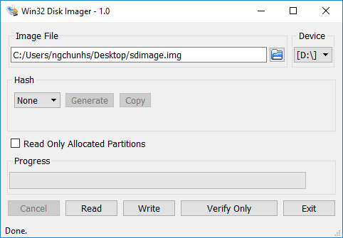

##  Introduction

### GSRD Overview

The Golden System Reference Design (GSRD) provides a set of essential hardware and software system components that can be used as a starting point for various custom user designs.

The GSRD is comprised of the following components:

- Golden Hardware Reference Design (GHRD)
- Reference HPS software including:
  - Cyclone V SoC Development Kit
  - Linux release
  - U-Boot release
  - Linux sample drivers
  - Linux sample applications

#### Prerequisites

The following are required in order to be able to fully exercise the CV GSRD:

* Cyclone V SoC Development Kit, rev. E, including
  * Mini USB cable for serial output
  * Micro USB cable for on-board Intel FPGA Download Cable II
* Micro SD card (4GB or greater)
* Host PC with
  * Linux - Ubuntu 20.04 was used to create this page, other versions and distributions may work too.
  * Serial terminal (for example Minicom on Linux and TeraTerm or PuTTY on Windows)
  * Micro SD card slot or Micro SD card writer/reader
  * Intel Quartus Prime Standard Edition v24.1         
* Local Ethernet network, with DHCP server (will be used to provide IP address to the board)


### Release Contents

#### Release Notes

The Intel FPGA HPS Embedded Software release notes can be accessed from the following link: [https://github.com/altera-fpga/gsrd-socfpga/releases/tag/QPDS24.1STD_REL_GSRD_PR](https://github.com/altera-fpga/gsrd-socfpga/releases/tag/QPDS24.1STD_REL_GSRD_PR)

#### Binaries

The release files are accessible at [https://releases.rocketboards.org/2025.03/gsrd/c5_gsrd/](https://releases.rocketboards.org/2025.03/gsrd/c5_gsrd/) and contain the following:

| *File* | *Description* |
| :-- | :-- |
| zImage | Pre-built compressed Linux kernel image |
| cv_soc_devkit_ghrd.zip | Hardware project, including pre-compiled SOF |
| rootfs/console-image-minimal-cyclone5.tar.gz | Pre-built small root filesystem |
| rootfs/gsrd-console-image-cyclone5.tar.gz | Pre-built GSRD root filesystem |
| sdimage.tar.gz | Pre-built SD card image |
| sdimage.tar.gz.md5sum | Checksum for pre-built SD card image |
| socfpga_cyclone5_socdk.dtb | Pre-built Linux device tree binary |
| u-boot-with-spl.sfp | Pre-built SPL and U-Boot image |
| extlinux.conf | Linux configuration |
| u-boot.scr | U-Boot script wrapped with mkimage |
| u-boot.txt | U-Boot script contents |

#### Source Code

| *Component* | *Location* | *Branch* | *Commit ID/Tag* |
| :-- | :-- | :-- | :-- |
| GHRD | [https://github.com/altera-opensource/ghrd-socfpga](https://github.com/altera-opensource/ghrd-socfpga) | master | e3bd58392f0b70b470c3afe67fd5e45f9ac5b00b |
| Linux | [https://github.com/altera-fpga/linux-socfpga](https://github.com/altera-fpga/linux-socfpga) | socfpga-6.6.51-lts | 7dddbad0a3a725b140b8fc4621159cd4628374a8 |
| U-Boot | [https://github.com/altera-fpga/u-boot-socfpga](https://github.com/altera-fpga/u-boot-socfpga) | socfpga_v2024.07 | c13fb267004c4c79d3573360f033f4a32e8a3c79 |
| Yocto Project | [https://git.yoctoproject.org/poky](https://git.yoctoproject.org/poky) | styhead | 9ddadbdeb45f335f3be01b7b33ab4e0ecfef97b6 |
| Yocto Project: meta-intel-fpga | [https://git.yoctoproject.org/meta-intel-fpga/](https://git.yoctoproject.org/meta-intel-fpga/) | styhead | 04565a4f3cd741b46792aa14137a51ecd146c15c |
| Yocto Project: meta-intel-fpga-refdes | [https://github.com/altera-fpga/meta-intel-fpga-refdes/](https://github.com/altera-fpga/meta-intel-fpga-refdes/) | styhead | b1d22ed3516d818ae804a56d64c5eac0932deaaf |

### GHRD Overview

The GHRD is an important part of the GSRD and consists of the following components:

 * Dual-core ARM Cortex*-A9 MPCore* Hard Processor System (HPS)
 * Two user push-button inputs
 * Four user DIP switch inputs
 * Four user I/O for LED outputs
 * 64KB of FPGA on-chip memory
 * JTAG to Avalon Master Bridges
 * Interrupt capturer for use with System Console
 * System ID


The GHRD allows hardware engineers to access each peripheral in the FPGA portion of the SoC with System Console, through the JTAG master module. This signal-level access is independent of the driver readiness of each peripheral.

<h4>Cortex-A9 MPU Address Maps</h4>

This sections presents the address maps as seen from the MPU (Cortex-A9) side.
<h5>HPS-to-FPGA Address Map</h5>

The memory map of soft IP peripherals, as viewed by the microprocessor unit (MPU) of the HPS, starts at HPS-to-FPGA base address of 0xC000_0000. The following table lists the offset from 0xC000_0000 of each peripheral in the FPGA portion of the SoC.

| *Peripheral* | *Address Offset* | *Size (bytes)* | *Attribute* |
| :-- | :-- | :-- | :-- |
| onchip_memory2_0 | 0x0 | 64K | On-chip RAM as scratch pad |

<h5>Lightweight HPS-to-FPGA Address Map</h5>

The memory map of system peripherals in the FPGA portion of the SoC as viewed by the MPU, which starts at the lightweight HPS-to-FPGA base address of 0xFF20_0000, is listed in the following table.

| *Peripheral* | *Address Offset* | *Size (bytes)* | *Attribute* |
| :-- | :-- | :-- | :-- |
| sysid_qsys | 0x0006_0008 | 8 | Unique system ID |
| led_pio | 0x0006_0040 | 8 | LED output |
| dipsw_pio | 0x0006_0080 | 8 | DIP switch input |
| button_pio | 0x0006_00C0 | 8 | Push button input |
| jtag_uart | 0x0006_0000 | 8 | JTAG UART console |
| ILC | 0x0007_0000 | 256 | Interrupt latency counter |

<h5>JTAG Master Address Map</h5>

There are two JTAG master interfaces in the design, one for accessing non-secure peripherals in the FPGA fabric, and another for accessing secure peripherals in the HPS through the FPGA-to-HPS interface.

The following table lists the address of each peripheral in the FPGA portion of the SoC, as seen through the non-secure JTAG master interface.

| *Peripheral* | *Address Offset* | *Size (bytes)* | *Attribute* |
| :-- | :-- | :-- | :-- |
| onchip_memory2_0 | 0x0000_0000 | 64K | On-chip RAM |
| sysid_qsys | 0x0006_0008 | 8 | Unique system ID |
| led_pio| 0x0006_0040 | 8 | 4 LED outputs |
| dipsw_pio| 0x0006_0080 | 8 | 4 DIP switch inputs |
| button_pio| 0x0006_00C0 | 8 | 2 push button inputs |
| jtag_uart| 0x0006_0000 | 8 | JTAG UART console |
| ILC | 0x0007_0000 | 256 | Interrupt latency counter |

<h5>Interrupt Routing</h5>

The HPS exposes 64 interrupt inputs for the FPGA logic. The following table lists the interrupt connections from soft IP peripherals to the HPS interrupt input interface.

| *Peripheral* | *Interrupt Number* | *Attribute* |
| :-- | :-- | :-- |
| dipsw_pio | f2h_irq0[0] | 4 DIP switch inputs |
| button_pio | f2h_irq0[1] | 2 push button inputs |
| jtag_uart | f2h_irq0[2] | JTAG UART |

The interrupt sources are also connected to an interrupt capturer module in the system, which enables System Console to be aware of the interrupt status of each peripheral in the FPGA portion of the SoC.

### Typical HPS Boot Flow

The GSRD boot flow includes the following stages:


The following table presents a short description of the different boot stages:

| *Stage* | *Description* |
| :-- | :-- |
| Boot ROM | Performs minimal configuration and loads Preloader into the 64KB OCRAM |
| Preloader | Configures clocks, IO, pin-muxing, brings up SDRAM, and loads U-Boot into SDRAM |
| U-Boot | Configures FPGA, loads Linux kernel |
| Linux | Operating system |
| Application | User application |

For more information, please refer to [https://www.intel.com/content/www/us/en/docs/programmable/683265/current/an-709-hps-soc-boot-guide-cyclone-v.html](HPS SoC Boot Guide - Cyclone V SoC Development Kit) and [https://www.intel.com/content/www/us/en/docs/programmable/683126/current/hard-processor-system-technical-reference.html](Cyclone V Hard Processor System Technical Reference Manual) - Booting and Configuration chapter.

### Running GSRD with Pre-Built Binaries

#### Booting Linux Using SD Card Image

This section will guide you to boot the Linux with the Cyclone V SoC device according to the [#typical-hps-boot-flow](HPS Typical Boot Flow).

<h4>Creating SD Card</h4>

This section explains how to create the SD card necessary to boot Linux, using the SD card image available with the pre-built Linux binaries package. Once the SD card has been created, insert the card into the SD slot of the Micro SD card socket.

<h4>(A) Creating SD Card on Linux</h4>

1\. Download the SD card image and extract it:
```bash
wget https://releases.rocketboards.org/2025.03/gsrd/c5_gsrd/sdimage.tar.gz
tar xf sdimage.tar.gz
```

2\. Determine the device associated with the SD card on the host by running the following command before and after inserting the card.
```bash
$ cat /proc/partitions </pre>
```
Let's assume it is /dev/sdx.

3\. Use _dd_ utility to write the SD image to the SD card.
```bash
$ sudo dd if=gsrd-console-image-cyclone5.wic of=/dev/sdx bs=1M
```

Note we are using _sudo_ to be able to write to the card.

4\. Use _sync_ utility to flush the changes to the SD card.
```bash
$ sudo sync
```

<h4>(B) Creating SD Card on Windows</h4>

1. Download the SD card image from [https://releases.rocketboards.org/2025.03/gsrd/c5_gsrd/sdimage.tar.gz](https://releases.rocketboards.org/2025.03/gsrd/c5_gsrd/sdimage.tar.gz)

2. Extract the archive, this will create the file gsrd-console-image-cyclone5.wic

3. Rename the file gsrd-console-image-cyclone5.wic to sdimage.img, as Win32DiskImager needs the .img extension.

4. Use Win32DiskImager to write the image to the SD card. The tool can be downloaded from [https://sourceforge.net/projects/win32diskimager/files/latest/download](https://sourceforge.net/projects/win32diskimager/files/latest/download)



#### Configuring Board

This section presents the necessary board settings in order to run the GSRD on the Cyclone V SoC development board.


The board jumpers configured as follows:

 * J5: Open
 * J6: Short
 * J7: Short
 * J9: Open
 * J13: Short
 * J16: Open
 * J26: Short pins 1-2
 * J27: Short pins 2-3
 * J28: Short pins 1-2
 * J29: Short pins 2-3
 * J30: Short pins 1-2
 * J31: Open

The board switches configured as follows:

 * SW1: All OFF
 * SW2: All OFF
 * SW3: ON-OFF-ON-OFF-ON-ON
 * SW4: OFF-OFF-ON-ON

#### Configuring Serial Connection

The board has a built-in FTDI USB to serial converter chip that allows the host computer to see the board as a virtual serial port. Ubuntu, CentOS and other modern Linux distributions have built-in drivers for the FTDI USB to serial converter chip, so no driver installation is necessary on those platforms. On Windows, the SoC EDS installer automatically installs the required drivers if necessary.

The serial communication parameters are:

 * Baud rate: 115200
 * Parity: None
 * Flow control: None
 * Stop bits: 1

On Windows, utilities such as **TeraTerm** or **PuTTY** can be used to connect the board. They are easily configured from the tool menus.

On Linux, the **Minicom** utility can be used. Here is how to configure it:

1\. The virtual serial port is usually named _/dev/ttyUSB0_. In order to determine the device name associated with the virtual serial port on your host PC, please perform the following:

Use the following command to determine which USB serial devices are already installed:
  
```bash
ls /dev/ttyUSB*
```

Connect mini USB cable from J8 to the PC. This will enable the PC to communicate with the board, even \if the board is not powered yet.

Use the command above to determine which new USB serial device appeared.

2\. Install Minicom application on host PC, if not already installed.

On CentOS, use 

```bash 
sudo yum install minicom
```
On Ubuntu, use 

```bash
sudo apt-get install minicom
```

3\. Configure Minicom

```bash
sudo minicom -s
```

Under *Serial Port Setup* choose the following:

 * Serial Device: */dev/ttyUSB0* (edit to match the system as necessary)
 * Bps/Par/Bits: *115200 8N1*
 * Hardware Flow Control: *No*
 * Software Flow Control: *No*
 * Hit *[ESC]* to return to the main configuration menu

Select *Save Setup as dfl* to save the default setup. Then select *Exit*.

### Booting Linux

This section presents the way to boot Linux OS on the board. The required steps are:

1. Start serial terminal (when using Minicom it will connect using the selected settings, for others connect manually).

2. Power up the board.

3. Preloader has completed.

4. U-Boot has completed.

5. Linux boot up.

6. The IP address of the target board will be displayed as the first line of the LCD display. Note that the IP address is displayed only once at the boot-up time, it will not be updated if the IP address is changed later, for example, modified by the user.

7. The four FPGA LEDs on the top right corner of the board will turn ON (lit) and OFF (dim) sequentially.

8. Login using 'root' with no password.

9. Example of booting screen:
    
    ```bash
    U-Boot SPL 2022.04 (Nov 02 2022 - 09:18:43 +0000)
    DDRCAL: Scrubbing ECC RAM (1024 MiB).
    DDRCAL: SDRAM-ECC initialized success with 579 ms
    Trying to boot from MMC1

    U-Boot 2022.04 (Nov 02 2022 - 09:18:43 +0000)

    CPU:   Altera SoCFPGA Platform
    FPGA:  Altera Cyclone V, SE/A6 or SX/C6 or ST/D6, version 0x0
    BOOT:  SD/MMC Internal Transceiver (3.0V)
        Watchdog enabled
    DRAM:  1 GiB
    Core:  25 devices, 15 uclasses, devicetree: separate
    MMC:   dwmmc0@ff704000: 0
    Loading Environment from MMC... *** Warning - bad CRC, using default environment

    In:    serial
    Out:   serial
    Err:   serial
    Model: Altera SOCFPGA Cyclone V SoC Development Kit
    Net:
    Warning: ethernet@ff702000 (eth0) using random MAC address - d2:d7:3d:a6:95:1f
    eth0: ethernet@ff702000
    Hit any key to stop autoboot:  0
    162 bytes read in 2 ms (79.1 KiB/s)
    ## Executing script at 02100000
                extlinux/
    2354604   soc_system.rbf
        29942   socfpga_cyclone5_socdk.dtb
        162   u-boot.scr
    5871648   zImage
                System Volume Information/

    4 file(s), 2 dir(s)

    2354604 bytes read in 119 ms (18.9 MiB/s)
    switch to partitions #0, OK
    mmc0 is current device
    Scanning mmc 0:1...
    Found /extlinux/extlinux.conf
    Retrieving file: /extlinux/extlinux.conf
    1:      Cyclone5 SOCDK SDMMC
    Retrieving file: /extlinux/../zImage
    append: root=/dev/mmcblk0p2 rootwait rw earlyprintk console=ttyS0,115200n8
    Retrieving file: /extlinux/../socfpga_cyclone5_socdk.dtb
    Kernel image @ 0x1000000 [ 0x000000 - 0x599820 ]
    ## Flattened Device Tree blob at 02000000
    Booting using the fdt blob at 0x2000000
    Loading Device Tree to 09ff5000, end 09fff4f5 ... OK

    Starting kernel ...

    Deasserting all peripheral resets
    [    0.000000] Booting Linux on physical CPU 0x0
    [    0.000000] Linux version 5.15.50-altera (oe-user@oe-host) (arm-poky-linux-gnueabi-gcc (GCC) 11.3.0, GNU ld (GNU Binutils) 2.38.20220708) #1 SMP Tue Nov 8 19:10:16 UTC 2022
    [    0.000000] CPU: ARMv7 Processor [413fc090] revision 0 (ARMv7), cr=10c5387d
    [    0.000000] CPU: PIPT / VIPT nonaliasing data cache, VIPT aliasing instruction cache
    [    0.000000] OF: fdt: Machine model: Altera SOCFPGA Cyclone V SoC Development Kit

    ...
    [  OK  ] Finished Load/Save Random Seed.
    [  OK  ] Started WPA supplicant.
    [  OK  ] Started Hostname Service.

    Poky (Yocto Project Reference Distro) 4.0.5 cyclone5 ttyS0

    cyclone5 login: root
    Last login: Thu Apr 28 17:43:20 +0000 2022 on /dev/ttyS0.
    root@cyclone5:~# 
    ```

#### Running Sample Linux Applications

The GSRD includes a number of sample Linux applications that help demonstrate some of the features of the platform:

 * Display a "Hello World" message
 * Control LEDs
 * Detect interrupts from push buttons and DIP switches

The sample applications can be used as a starting point for users to write their own applications that interact with software IP through Linux drivers.

<h5>Prerequisites</h5>

1\. Boot Linux on the target board as described in [Booting Linux](#boot-Linux). You will not need to use the serial terminal if you plan on using ssh connection.

2\. Connect to the board using one of the following options:

 * Connect using serial console, as described in [Booting Linux](#boot-linux)
 * Connect using ssh, as described in [Connect Using SSH](#connect-using-ssh)

3\. In serial console, or ssh client console, change current folder to be _/home/root/altera_. This is where the application binaries are stored.

```bash
root@cyclone5:~# cd /home/root/intelFPGA/
```

<h5>Display Hello World Message</h5>

Run the following command to display the Hello World message on the console:

```bash
root@cyclone5:~/intelFPGA# ./hello
%GRAY%Hello SoC FPGA!
```

<h5>Exercise Soft PIO Driver for LED Control</h5>

The following user FPGA LEDs are exercised:

| *LED Number* | *Corresponding Board LED* |
| :-- | :-- |
| 0 | D8 |
| 1 | D7 |
| 2 | D6 |
| 3 | D5 |

1\. In order to blink an LED in a loop, with a specific delay in ms, run the following command:

```bash
./blink &lt;led_number&gt; &lt;delay_ms&gt; 
```

 - The *led_number* specifies the desired LED, and is a value between 0 and 3.
 - The *delay_ms* is a number that specifies the desired delay in ms between turning the LED on and off.

2\. In order to turn an individual LED on or off, run the following command:

```bash
./toggle &lt;led_number&gt; &lt;state&gt;
```

 - The *led_number* specifies the desired LED, and is a value between 0 and 3.
 - The *state* needs to be 0 to turn the LED off, and 1 to turn the LED on.

3\. In order to scroll the FPGA LEDs with a specific delay, please run the following command:

```bash
./scroll_client &lt;delay&gt;
```

The **delay** specifies the desired scrolling behavior:

 - **delay > 0** - specify new scrolling delay in ms, and start scrolling
 - **delay < 0** - stop scrolling
 - **delay = 0** - display current scroll delay

<h5>Register Interrupts and Call Interrupt Service Routine</h5>

The following user FPGA DIP switches and push buttons are exercised:

| *DIP Switch Number* | *Corresponding Board DIP Switch* |
| :-- | :-- |
| 0 | SW1.5 |
| 1 | SW1.6 |
| 2 | SW1.7 |
| 3 | SW1.8 |

| *Push Button Number* | *Corresponding Board Push Button* |
| :-- | :-- |
| 0 | S6 |
| 1 | S5 |

In order to register an interrupt handler to a specific GPIO, you will first need to determine the GPIO number used.

1\. Open the Linux Device Tree [https://releases.rocketboards.org/2025.03/gsrd/c5_gsrd/socfpga_cyclone5_ghrd.dtsi](socfpga_cyclone5_ghrd.dtsi) file and look up the labels for the DIP switches and push button GPIOs:

```bash
    button_pio: gpio@0x1000600C0 {
    compatible = "altr,pio-19.1", "altr,pio-1.0";
    reg = <0x00000001 0x000600c0 0x00000010>;
    interrupt-parent = <&intc>;
    interrupts = <0 41 1>;
    clocks = <&clk_0>;
    altr,gpio-bank-width = <2>;
    altr,interrupt-type = <2>;
    altr,interrupt_type = <2>;
    edge_type = <1>;
    level_trigger = <0>;
    resetvalue = <0>;
    #gpio-cells = <2>;
    gpio-controller;
};

    dipsw_pio: gpio@%RED%0x100060080 {
    compatible = "altr,pio-19.1", "altr,pio-1.0";
    reg = <0x00000001 0x00060080 0x00000010>;
    interrupt-parent = <&intc>;
    interrupts = <0 40 1>;
    clocks = <&clk_0>;
    altr,gpio-bank-width = <4>;
    altr,interrupt-type = <3>;
    altr,interrupt_type = <3>;
    edge_type = <2>;
    level_trigger = <0>;
    resetvalue = <0>;
    #gpio-cells = <2>;
    gpio-controller;
};
```

Determine which of the GPIO entries from _/sys/class/gpio/_ matches the offsets by searching for the address in the label entry.

2\. Run the following to determine the GPIO numbers for the DIP switches.

```bash
root@cyclone5:~/intelFPGA# grep -r "0x100060080" /sys/class/gpio/gpiochip*/label
/sys/class/gpio/gpiochip1952/label:/soc/gpio@0x100060080
```

This means that the GPIOs 1952 .. 1955 are allocated to the DIP switches (there are 4 of them).

3\. Run the following to determine the GPIO numbers for the push buttons.

```bash
root@cyclone5:~/intelFPGA# grep -r "0x1000600c0" /sys/class/gpio/gpiochip*/label
/sys/class/gpio/gpiochip1984/label:/soc/gpio@0x1000600c0
```

This means that the GPIOs 1984, 1985 are allocated to the push buttons (there are 2 of them).

4\. Register interrupt for one of the DIP switches, using the appropriate GPIO number, as determined in a previous step:

```bash
root@cyclone5:~/intelFPGA# modprobe gpio_interrupt gpio_number=1952 intr_type=3
[  269.876015] gpio_interrupt: loading out-of-tree module taints kernel.
[  269.887086] Interrupt for GPIO:1952
[  269.887086]  registered
```

5\. Toggle the DIP switch a few times, you will see messages from the interrupt handler.

```bash
[  269.882892] Interrupt happened at gpio:1952
[  279.913910] Interrupt happened at gpio:1952
[  279.923967] Interrupt happened at gpio:1952
[  280.700461] Interrupt happened at gpio:1952
```

6\. Remove the driver.

```bash
root@cyclone5:~/intelFPGA# rmmod gpio_interrupt
```

7\. Register the push button interrupt, using the appropriate GPIO number as determine on a previous step

```bash
root@cyclone5:~/intelFPGA# modprobe gpio_interrupt gpio_number=1984 intr_type=2
[  317.445090] Interrupt for GPIO:1984
[  317.445090]  registered
```

8\. Press the push button a few times, you will see interrupt handler messages.

```bash
[  325.824591] Interrupt happened at gpio:1984
[  326.428601] Interrupt happened at gpio:1984
[  326.966495] Interrupt happened at gpio:1984
[  327.554294] Interrupt happened at gpio:1984
```

9\. Once done, remove the handler.

```bash
root@cyclone5:~/intelFPGA# rmmod gpio_interrupt
```

**Note**: If you are on the ssh console, you will need to run the program _dmesg_ after pressing the button in order to see the messages:

```bash
root@cyclone5:~/intelFPGA# dmesg
```

#### System Check Application

System check application provides a glance of system status of basic peripherals such as:

 * *USB*: USB device driver
 * *SysID*: FPGA system ID
 * *Network IP (IPv4)*: Network IP address
 * *HPS LEDs*: HPS LED state
 * *FPGA LEDs*: FPGA LED state

```bash
root@cyclone5:~/intelFPGA# ./syschk
```

```bash
Terminal Output:
                                                     ALTERA SYSTEM CHECK

IPv4 Address          : 137.57.118.4                      usb1                  : DWC OTG Controller

fpga_led2             : ON                                serial@0x100060000    : N/A
fpga_led0             : OFF                               serial1@ffc03000      : N/A
hps_led2              : OFF                               serial0@ffc02000      : N/A
hps_led0              : OFF
fpga_led3             : OFF                               ff260008.sysid        : 2899645696
fpga_led1             : OFF
hps_led3              : OFF
hps_led1              : OFF
```

To quit the application, press "q".

**Note**: System check application works better when viewed via SSH to the target. USB-UART refreshes slower hence the user interface might flicker.

#### Connecting to Board Web Server and SSH Client

The GSRD includes a web server running on the target board that can be used to exercise some of the board features:

 * Displaying text on the alphanumerical LCD screen
 * Turning LEDs ON and OFF
 * Scrolling LEDs in a sequence
 * Displaying the current status of the LEDs 

The web page served by the web server also contains links to some relevant information on the Intel website.

#### Connect to Web Server

1\. Boot Linux as described in [#booting-linux](Booting Linux).

2\. Write down the IP address displayed on the first line of the LCD screen. Note that the IP address is displayed only at the boot time, it is not updated if the IP address is changed later, for example by the user. If your board is connected to a network that doesn't have a DHCP server, it will fallback to use IPv4LL IP address after Linux times out waiting for DHCP server's IP, which is about 2 minutes.

**Note**: There are instances where the DHCP have not assigned an IP to the board before the timeout happens, in which case you may check the IP address via the UART by running _ifconfig_.

```bash
root@cyclone5:~/intelFPGA# ifconfig
eth0      Link encap:Ethernet  HWaddr a6:89:c2:1d:53:b0
          inet addr:137.57.118.4  Bcast:137.57.118.255  Mask:255.255.255.0
          inet6 addr: fe80::a489:c2ff:fe1d:53b0/64 Scope:Link
          UP BROADCAST RUNNING MULTICAST  MTU:1500  Metric:1
          RX packets:625 errors:0 dropped:0 overruns:0 frame:0
          TX packets:87 errors:0 dropped:0 overruns:0 carrier:0
          collisions:0 txqueuelen:1000
          RX bytes:48463 (47.3 KiB)  TX bytes:10361 (10.1 KiB)
          Interrupt:33 Base address:0x4000
```

3\. Open a web browser on the host PC and type _http://_ on the address box, then type the IP of your board and hit Enter.


4\. Scroll the webpage down to the section named *Interacting with Cyclone V SoC Development Kit*.


You will be able to perform the following actions:

 - See which LEDs are ON and which are off in the *LED Status*. Note that if the LEDs are setup to be     scrolling, the displayed scrolling speed will not match the actual scrolling speed on the board.
 - Stop LEDs from scrolling, by clicking *START* and *STOP* buttons. The delay between LEDs turning ON and    OFF is set in the *LED Lightshow* box.
 - Turn individual LEDs ON and OFF with the *ON* and *OFF* buttons. Note that this action is only available   when the LED scrolling/lightshow is stopped.
 - Blink individual LEDs by typing a delay value in ms then clicking the corresponding *BLINK* button. Note   that this action is only available when the LED scrolling/lightshow is stopped.

#### Connect Using SSH

1\. The lower bottom of the web page presents instructions on how to connect to the board using an SSH connection.


2\. If the SSH client is not installed on your host computer, you can install it by running the following command on CentOS:

```bash
$ sudo yum install openssh-clients
```

or the following command on Ubuntu:

```bash
$ sudo apt-get install openssh-client
```

3\. Connect to the board, and run some commands, such as *pwd*, *ls* and *uname* to see Linux in action.


## Rebuilding the GSRD Binaries

### Build Flow

The following diagram illustrates the full build flow for the GSRD.


### Setting Up Environment

Create a top folder, and change the current folder to it. Define an environment variable to refer to the folder.

```bash
mkdir cv_gsrd
cd cv_gsrd
export TOP_FOLDER=$(pwd) 
```

### Compiling Hardware Design

The hardware design is pre-compiled. If changes are made, it can be recompiled using the following instructions:

```bash
cd $TOP_FOLDER
rm -rf ghrd-socfpga cv_soc_devkit_ghrd
git clone https://github.com/altera-opensource/ghrd-socfpga.git
cd $TOP_FOLDER
mv ghrd-socfpga/cv_soc_devkit_ghrd .
rm -rf ghrd-socfpga
cd cv_soc_devkit_ghrd
rm -rf software
~/altera/24.1std/nios2eds/nios2_command_shell.sh \
make generate_from_tcl
~/altera/24.1std/nios2eds/nios2_command_shell.sh \
make rbf
```

The following files will be created:

| *File* | *Description* |
| :-- | :-- |
| $TOP_FOLDER/cv_soc_devkit_ghrd/output_files/soc_system.rbf | FPGA configuration file |

### Running CV BSP Generator to process handoff files

The *cv_bsp_generator.py* script is used to process the handoff files from Quartus and convert them to source code usable by U-Boot:

**Note**: Users are required to use python2 to execute *cv_bsp_generator.py script*. This script will be updated to python3 format in future release.

```bash
cd $TOP_FOLDER/gsrd_socfpga/cyclone5-gsrd-rootfs
cd tmp/work/cyclone5-poky-linux-gnueabi/u-boot-socfpga/1_v2022.04+gitAUTOINC+fda0d9176f-r0/git/arch/arm/mach-socfpga/cv_bsp_generator

# this command will generate new uboot files from handoff files, to replace those in qts folder
# Command: python cv_bsp_generator.py -i &lt;qpds_handoff_path&gt; -o &lt;qts_output_directory&gt;
python cv_bsp_generator.py -i $TOP_FOLDER/cv_soc_devkit_ghrd/hps_isw_handoff/soc_system_hps_0 \
-o board/altera/cyclone5-socdk/qts/
```

The handoff files from the `$TOP_FOLDER/cv_soc_devkit_ghrd/hps_isw_handoff/soc_system_hps_0` folder will be converted to source code in the `../board/altera/cyclone5-socdk/qts` folder.

**Note**: The *bsp-editor* tool from SoCEDS is replaced by the *cv_bsp_generator.py script*. You are required to run the *bitbake_image* command once in order to get the *cv_bsp_generator binaries*. (Please refer to the next section for *bitbake_image* command)

### Setting Up Yocto Build System

1\. First, make sure you have Yocto system requirements met: https://docs.yoctoproject.org/3.4.1/ref-manual/system-requirements.html#supported-linux-distributions. 

The command to install the required packages on Ubuntu is:
```bash
sudo apt install gawk wget git diffstat unzip texinfo gcc build-essential chrpath \
socat cpio python3 python3-pip python3-pexpect xz-utils debianutils iputils-ping \
python3-git python3-jinja2 libegl1-mesa libsdl1.2-dev pylint3 xterm python3-subunit \
mesa-common-dev zstd liblz4-tool
```

**Note**: You can also use a Docker container to build the Yocto recipes, refer to https://rocketboards.org/foswiki/Documentation/DockerYoctoBuild for details. When using a Docker container, it does not matter what Linux distribution or packages you have installed on your host, as all dependencies are provided by the Docker container.

2\. Clone the Yocto script and prepare the build:

```bash
cd $TOP_FOLDER
rm -rf gsrd_socfpga
git clone -b styhead https://github.com/altera-fpga/gsrd-socfpga
cd gsrd-socfpga
. cyclone5-gsrd-build.sh
build_setup
```

3\. (*Optional Step*) Disable the U-Boot patches which may intefer with the =devtool= functionality on some machines:

    ```bash
    sed -i '/file:.*patch/d' meta-intel-fpga-refdes/recipes-bsp/u-boot/u-boot-socfpga_v2021.07.bbappend
    sed -i '/file:.*patch/d' meta-intel-fpga-refdes/recipes-bsp/u-boot/u-boot-socfpga_v2021.10.bbappend
    ```

    The disabled patches are:
    - 0001-arm-Add-dwarf-4-to-compilation-flag.patch - used to change debug information format, to match Arm DS
    - 0001-arm-agilex-add-patch-to-enable-board-3-PR-configurat.patch - not used for Cyclone V

**Note**: Run the following commands to set up again the yocto build environments, if you closed the current window (for example when rebooting the Linux host) and want to resume the next steps:

```bash
cd $TOP_FOLDER/gsrd_socfpga
. ./poky/oe-init-build-env cyclone5-gsrd-rootfs/
```

### Customize Yocto Build

1\. Make the compiled RBF file available to the Yocto build system, with the exact filename required by the recipes:

```bash
ln -s $TOP_FOLDER/cv_soc_devkit_ghrd/output_files/soc_system.rbf  \
$WORKSPACE/meta-intel-fpga-refdes/recipes-bsp/ghrd/files/cyclone5_gsrd_soc_system.rbf
```

2\. Update the RBF file URI and hash in the Yocto recipe:
```bash
export NEW_HASH=$(sha256sum $WORKSPACE/meta-intel-fpga-refdes/recipes-bsp/ghrd/files/cyclone5_gsrd_soc_system.rbf | cut -f1 -d" ")
sed -i "s/SRC_URI:cyclone5.*/SRC_URI:cyclone5 ?= \"file:\/\/cyclone5_gsrd_soc_system.rbf;sha256sum=$NEW_HASH\"/g" $WORKSPACE/meta-intel-fpga-refdes/recipes-bsp/ghrd/hw-ref-design.bb
sed -i "/SRC_URI\[cyclone5_gsrd_core.sha256sum\]/d" $WORKSPACE/meta-intel-fpga-refdes/recipes-bsp/ghrd/hw-ref-design.bb
```

3\. If needed, update the file `$WORKSPACE/meta-intel-fpga-refdes/recipes-bsp/u-boot/files/cyclone5_u-boot.txt` which contains the following default script by default:

```bash
fatls mmc 0:1
load mmc 0:1 ${loadaddr} soc_system.rbf;
fpga load 0 ${loadaddr} $filesize;
```

4\. Update u-boot files based on handoff information:

```bash
cd $TOP_FOLDER/gsrd_socfpga/cyclone5-gsrd-rootfs/
devtool modify virtual/bootloader
cd workspace/sources/u-boot-socfpga
python arch/arm/mach-socfpga/cv_bsp_generator/cv_bsp_generator.py \
   -i $TOP_FOLDER/cv_soc_devkit_ghrd/hps_isw_handoff/soc_system_hps_0 \
   -o board/altera/cyclone5-socdk/qts
git commit -a -m "update handoff files for modified project"
```

5\. Create layer, add recipe with the u-boot changes to it:

```bash
bitbake-layers create-layer $TOP_FOLDER/gsrd_socfpga/meta-modified-project
devtool update-recipe -a $TOP_FOLDER/gsrd_socfpga/meta-modified-project u-boot-socfpga
cd $TOP_FOLDER/gsrd_socfpga/cyclone5-gsrd-rootfs/
bitbake-layers add-layer $TOP_FOLDER/gsrd_socfpga/meta-modified-project
```

6\. Remove devtool layer, and workspace:

```bash
bitbake-layers remove-layer $TOP_FOLDER/gsrd_socfpga/cyclone5-gsrd-rootfs/workspace
rm -rf $TOP_FOLDER/gsrd_socfpga/cyclone5-gsrd-rootfs/workspace
```

### Build Yocto

1\. Build Yocto:
```bash
bitbake_image
```

2\. Gather the files:
```bash
package
```

The following files will be created in `$TOP_FOLDER/gsrd_socfpga/cyclone5-gsrd-images`:

- console-image-minimal-cyclone5.jffs2
- console-image-minimal-cyclone5.tar.gz
- console-image-minimal-cyclone5.ubifs
- console-image-minimal-cyclone5.wic.xz
- extlinux.conf
- gsrd-console-image-cyclone5.jffs2
- gsrd-console-image-cyclone5.tar.gz
- gsrd-console-image-cyclone5.ubifs
- gsrd-console-image-cyclone5.wic
- sdimage.tar.gz
- sdimage.tar.gz.md5sum
- socfpga_cyclone5_socdk-cyclone5.dtb
- socfpga_cyclone5_socdk.dtb
- zImage
- cyclone5_gsrd_ghrd
  - soc_system.rbf
- u-boot-cyclone5-socdk-gsrd/      
  - u-boot
  - u-boot.dtb
  - u-boot-dtb.bin
  - u-boot-dtb.img
  - u-boot.img
  - u-boot.map
  - u-boot.scr
  - u-boot-spl
  - u-boot-spl.bin
  - u-boot-spl.dtb
  - u-boot-spl-dtb.bin
  - u-boot-spl.map
  - u-boot-spl.sfp
  - u-boot-splx4.sfp
  - u-boot.txt
  - u-boot-with-spl.sfp

You will also find the build artifacts in `$TOP_FOLDER/gsrd_socfpga/cyclone5-gsrd-rootfs/tmp/deploy/images/cyclone5`.