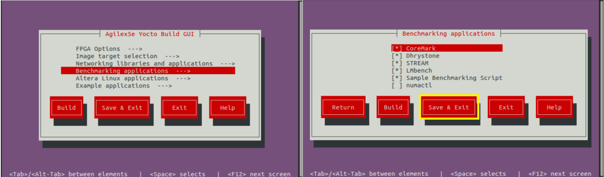
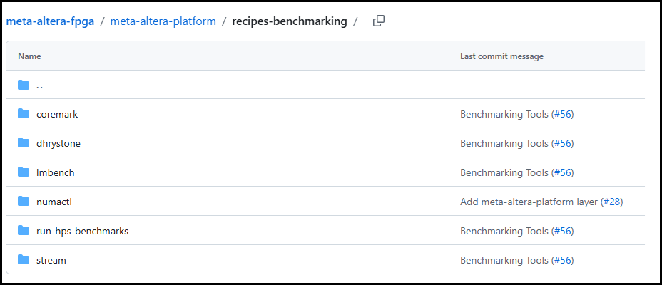
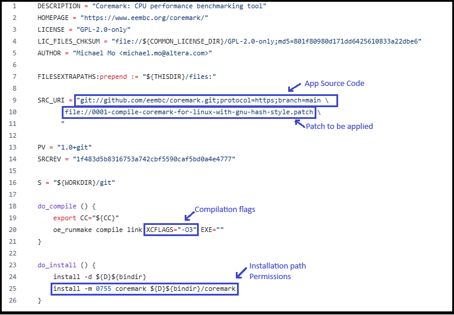

The HPS Baseline System Example Design provides you a set of Linux benchmarking applications that allow you to evaluate the performance of your system. These applications aim to evaluate areas such a CPUs performance and memory transfer performance among others.

You can control the inclusion/exclusion of each one of these applications individually using the KAS framework.

**Option 1. Use the Kas menu**

After you obtain the HPS Baseline System Example Design source content from the corresponding device HPS Baseline System Example Design repository and before you build Yocto with Kas, open the Kas menu with:

```bash
$ cd software/yocto_linux/
$ kas menu
```
This opens the Kas graphical interface menu. Navigate to the **Benchmarking applications** option. This switches to a menu window that allows you to select the benchmarking applications that you want to include in your Linux file system.



Once you complete the selection of the application, go to the **Save and Exit** option.

**Option 2.  Use the Kconfig Configuration file**

Alternatively, you can add or remove the benchmarking applications by manually editing Kas configuration file **software/yocto_linux/kas/gsrd/Kconfig.** Each one of these applications is associated with a **config** that you can set to **‘y’** to include it or with **‘n’** to exclude this. An extract  of this configuration file is shown next. After editing the file you must save it to keep these changes.

```bash
if GSRD_CONSOLE_IMAGE_BUILD
menu "Benchmarking applications"

config APP_COREMARK
    bool "CoreMark"
    default y
    help
      CoreMark - EEMBC benchmark for evaluating embedded CPU performance through lightweight core tests.

config BENCHMARK_APP_COREMARK
    string
    default "true" if APP_COREMARK
    default "false" if !APP_COREMARK
:
:
```

After you make your choose about the applications to be included or excluded, you can continue with the regular Kas Yocto Build.

> **NOTE:** By default, all of the benchmarking applications are already enabled to be built and added in to the Linux file system. You still can use any of the 2 options above to change this default configuration. Also, it is very important to note that **the benchmarking applications are only available when the target image is the gsrd-console-image** . This means that you will not see them when the target is Console Image Minimal (console-image-minimal) nor Core Image Minimal (core-image-minimal). Please observe the implementation of the **software/yocto_linux/kas/gsrd/Kconfig** and the [gsrd-console-image.bb](https://github.com/altera-fpga/meta-altera-fpga/tree/scarthgap/meta-altera-platform/recipes-images/poky/gsrd-console-image.bb) recipe.

Once your binaries build finishes, you can proceed to program these in to your dev kit.  After your board boots to Linux shell, you will see the benchmarking applications available in the file system under the **/bin/** directory, meaning that you can actually exercise these applications from any path by just entering the application name similarly to how you can run any other Linux command.

The following table provides a brief description of the Benchmarking Scripts available as part of the HPS Baseline System Example Design:

| Application         | Command                      | Description                          | Available<br> by default |
| :--------------------- | :----------------------- | :------------------------------------------------------- | :------------------ |
|CoreMark |*coremark* | CoreMark is tailored for benchmarking embedded CPUs. It tests core functionalities such as list processing, matrix manipulation, state machines, and cyclic redundancy checks. The main metric used by CoreMark is iterations per second, which quantifies how many times the benchmark workload can be completed in one second.<br> https://www.eembc.org/coremark/ |  Yes |
|Dhrystone |*dhry* |Dhrystone is a synthetic benchmark designed to measure CPU integer performance. It evaluates the processor's speed by executing non-floating-point instructions and reports results using the metric MIPS (Million Instructions Per Second), providing a standardized measure of general CPU throughput. https://github.com/sifive/benchmark-dhrystone | Yes |
|STREAM | *stream*<br>*stream.lmbench*<br>*stream.mccalpin* | STREAM is a memory bandwidth benchmark that measures how quickly data can be transferred between memory and the CPU. It focuses on simple vector operations—Copy, Scale, Add, and Triad—to assess the sustainable memory transfer rates. Memory operations are done on a large data array (10000000 64-bit doubles) so that memory transfers do not involve the cache. The metric reported by STREAM is bandwidth in megabytes per second (MB/s). https://www.cs.virginia.edu/stream/ref.html | Yes |
| LMbench | *lmbench-run*<br>*bw_mem* | In LMbench,  the **bw_mem** tool is specifically used to measure the memory  bandwidth of a system by performing various types of memory  operations. Among its commands, fcp (fast copy), fwr(fast write),  and frd(fast read) execute memory operations on  contiguous blocks of memory. LM Bench operates on variable  data sizes; users can specify a data size that is less than the HPS  cache size and bring in cache hits when the program executes memory  operations. Each of these commands provides results in megabytes per  second (MB/s), allowing users to analyze and compare the performance of  memory read, write, and copy operations independently.   https://lmbench.sourceforge.net/ | Yes |
| Sample Benchmark Script | run-hps-benchmarks | Altera provides this sample script that exercises automatically the different benchmarks applications supported. | Yes |

The applications are integrated into the Yocto build flow through recipes (**.bb** or **.bbappend** files). These recipes are located under the [**meta-altera-fpga/meta-altera-platform/recipes-benchmarking**](https://github.com/altera-fpga/meta-altera-fpga/tree/scarthgap/meta-altera-platform/recipes-benchmarking)  repository.



There is a Yocto recipe for each one of the application as you can see in the previous  figure. In each one of the recipes you may find:

* The repository from which the application source code is obtained.
* The compilation flags needed.
* Any patch that need to be applied over the source code.
* Any required license file.
* The installation directory in the Linux file system in which the application binary will stored and the application binary permissions.

> **Note:** Dhrystone and LMbench recipes already exist in [**meta-openembedded**](https://git.openembedded.org/meta-openembedded) repository, so for these, only a **.bbappend** file is provided under **meta-altera-fpga** indicating the compilation flags needed.

The following figure shows an extract of the *Coremark* benchmarking application recipe.



The following table shows few examples of how the benchmarking applications can be used.

| Application        | Example Description |
| :--------------------- | :--------------------- |
| **CoreMark** | Focus on single-threaded  execution to highlight the performance of individual cores. Performance increases for multi-threaded execution is also predictable for CPU workloads (approximately proportional to number of cores).<br>Example:<br>**taskset -c 0 “coremark 0x0 0x0 0x66 440000”**<br><br>CoreMark is executed by CPU0, with parameters:<br/>[*seed1*] [*seed2*] [*seed3*] [*#iterations*]<br/>*seed1* is for linked list test, *seed2* is for matrix manipulation test, *seed3* is for state machine test. |
| **Dhrystone** | Focus on single-threaded  execution to highlight the performance of individual cores. Performance increases for multi-threaded execution is also predictable for CPU workloads (approximately proportional to number of cores).<br>Example:<br>**echo 1000000000 \| taskset -c 0 dhry**<br><br>Dhrystone is executed by CPU0 passing 1000000000 as parameter indicating the number of Dhrystone iterations. |
| **STREAM** | Focus on single-threaded execution since all memory accesses are done through the same HPS-memory interface (no cache hits). Benchmarking runs will not significantly differ in multi-threaded execution when the memory interface is already fully utilized.<br>Example:<br/> **taskset -c 0 stream.mccalpin**<br><br>STREAM is executed by CPU0. By default, this application works on an array size of 10000000 bytes. |
| **LMbench** | Focus on single-threaded and multi-threaded execution. With multi-threaded execution, users can potentially see great performance increase if memory operations involve cache hits as well.<br>Example:<br>**taskset -c 0 bw_mem -N 1000 -P 1 4K fcp**<br>LMbench is single-threaded executed for by CPU0 using the **bw-mem** memory bandwidth microbenchmark with parameters:<br> -N [*#iterations*] -P [*#processes*] [*memory size tested*] [*type of memory operation*] <br><br>For multi-threaded execution (4 processes):<br>**bw_mem -N 1000 -P 4 4K fcp** |
| **Sample Benchmark Script** | The script receives as parameters the name of the application(s) that want to be executed. The script iterates over the cores enabled in the system (only one of the same family or CPU ID). <br>Example:<br>**run-hps-benchmarks coremark dhrystone stream lmbench**<br><br>You can see the parameters provided to each one of the applications in the corresponding **run_[application]** function included in [**run-hps-benchmarks.sh**](https://github.com/altera-fpga/meta-altera-fpga/tree/scarthgap/meta-altera-platform/recipes-benchmarking/run-hps-benchmarks/files/run-hps-benchmarks.sh) script .<br>The script produces an independent .log file with the results for each benchmarking application executed in a specific mode bound to a specific core. The output log file has the following format: **[*app_name*]-[*mode*]-[*#core*].log** |

**Note**: The **taskset** command in these examples enforces single-threaded execution on the CPU provided after the **-c** parameter.

> **Note:** Additionally to the benchmark applications, the Linux HPS Baseline System Example Design also provides the **numactl** application. This application can be used together with the other benchmark applications and allow bind the application to a specific CPU (similarly to the **taskset** command) and to a local memory node. This application is not included by default in the HPS Baseline System Example Design. This includes commands like **numactl**, **numademo** and **numastat**. This is normally used to analyze memory latency and bandwidth by pinning workloads to specific sockets (for mor information refer to https://github.com/numactl). Here are some examples:

* **numactl --show**: Shows the current Non-Uniform Memory Access (NUMA) policy settings of a process.
* **numastat**:  Monitors and displays per-node Non-Uniform Memory Access (NUMA) statistics.
* **numactl -m 0 [benchmark app command]**: Executes [benchmark app] application forcing all its memory allocations to come from NUMA node 0.

