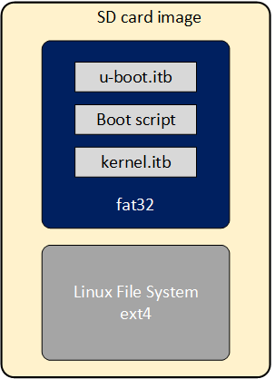

As part of the Yocto GSRD build flow, the SD Card image is built for the SD Card boot flow. This image includes a couple of partitions. One of these partition (a FAT32) includes the U-Boot proper, a Distroboot boot script and the Linux.itb - which includes the Linux kernel image, , the Linux device tree, the 2nd phase fabric design and board configuration (actually several versions of these last 3 components). The 2nd partition (an EXT3 or EXT4 ) includes the Linux file system. 

{: style="height:500px"}

If you want to replace any the components or add a new item in any of these partitions, without having to run again the Yocto build flow. 

This can be done through the **wic** application available on the **Poky** repository that is included as part of the GSRD build directory: **$TOP_FOLDER/gsrd-socfpga/poky/scripts/wic** 

This command allows you to inspect the content of a SD Card image, delete, add or replace any component inside of the image. This command is also provided with help support:

   ```bash
   $ $TOP_FOLDER/gsrd-socfpga/poky/scripts/wic help
   
   Creates a customized OpenEmbedded image.

   Usage:  wic [--version]
           wic help [COMMAND or TOPIC]
           wic COMMAND [ARGS]

       usage 1: Returns the current version of Wic
       usage 2: Returns detailed help for a COMMAND or TOPIC
       usage 3: Executes COMMAND

   COMMAND:

    list   -   List available canned images and source plugins
    ls     -   List contents of partitioned image or partition
    rm     -   Remove files or directories from the vfat or ext* partitions
    help   -   Show help for a wic COMMAND or TOPIC
    write  -   Write an image to a device
    cp     -   Copy files and directories to the vfat or ext* partitions
    create -   Create a new OpenEmbedded image
    :
    :
   ```
   The following steps show you how to replace the **kernel.itb** file inside of the fat32 partition in a .wic image.

1. The **wic ls** command allows you to inspect or navigate over the directory structure inside of the SD Card image. For example you can observe the partitions  in the SD Card image in this way:

   ```bash
   # Here you can inspect the content a wic image see the 2 partitions inside of the SD Card image
   $ $TOP_FOLDER/gsrd-socfpga/poky/scripts/wic ls my_image.wic
   Num     Start        End          Size      Fstype
   1       1048576    525336575    524288000  fat32    
   2     525336576   2098200575   1572864000  ext4   
   
   # Here you can naviagate inside of the partition 1
   $ $TOP_FOLDER/gsrd-socfpga/poky/scripts/wic ls my_image.wic:1
   Volume in drive : is boot       
   Volume Serial Number is 9D2B-6341
   Directory for ::/
   
   BOOTSC~1 UIM      2431 2011-04-05  23:00  boot.scr.uimg
   kernel   itb  15160867 2011-04-05  23:00 
   u-boot   itb   1052180 2011-04-05  23:00 
        3 files          16 215 478 bytes
                        506 990 592 bytes free
   ```
   
2. The **wic rm** command allows you to delete any of the components in the selected partition. For example, you can delete the **kernel.itb** image from the partition 1(fat32 partition).

   ```bash
   $ $TOP_FOLDER/gsrd-socfpga/poky/scripts/wic rm my_image.wic:1/kernel.itb
   ```

3. The **wic cp** command allows you to copy any new item or file from your Linux machine to a specific partition and location inside of the SD Card image. For example, you can copy a new **kernel.itb** to the partition 1.

   ```bash
   $ $TOP_FOLDER/gsrd-socfpga/poky/scripts/wic cp <path_new_kernel.itb> my_image.wic:1/kernel.itb
   ```

**NOTE**: The **wic** application also allows you to modify any image with compatible vfat and ext* type partitions which also covers images used for **eMMC** boot flow.