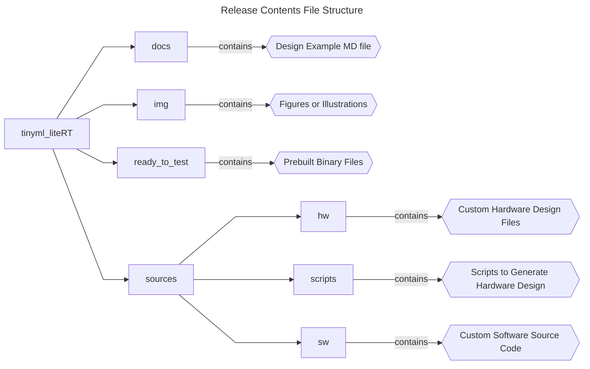
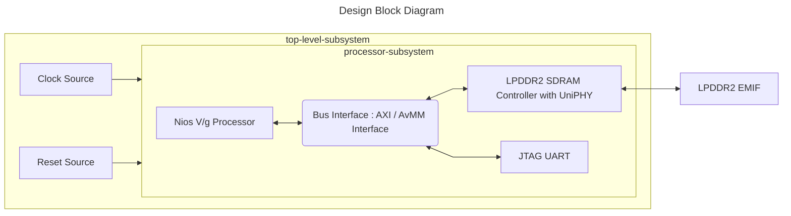

 


## Introduction

### Nios® V/g TinyML LiteRT System Example Design Overview

 This design demonstrates the TinyML application using LiteRT for microcontrollers software with Nios® V/g processor in MAX® 10 FPGA 10M50 Evaluation Kit. </br>
 The design is built with basic peripherals required for simple application execution:

 - JTAG UART for serial output.

### Prerequisites

 - MAX® 10 FPGA 10M50 Evaluation Kit, ordering code DK-DEV-10M50F484-B. </br> Refer to the board documentation for more information about the development kit.
 - Mini and Micro USB Cable. Included with the development kit.
 - Host PC with 64 GB of RAM. Less will be fine for only exercising the prebuilt binaries, and not rebuilding the design.
 - Quartus® Prime Standard Edition Software version 24.1
 - Ashling* RiscFree* IDE for Altera® FPGAs
 
### Release Contents  

Every Nios V processor design example is maintained based on this folder structure. </br>
Here is the Github link to root directory of this design example: [**Nios® V/g TinyML LiteRT Example Design Github link**](https://github.com/altera-fpga/max10-ed-nios/tree/rel/24.1std/max10-10m50-evaluation-dev-kit/niosv_g/tinyml_liteRT)



## Nios® V/g TinyML LiteRT Design Architecture
 This example design includes a Nios® V/g processor connected to the LPDDR2 SDRAM Controller with UniPHY and JTAG UART IP. </br>
 The objective of the design is to accomplish data transfer between the processor and soft IP peripherals:

 - Running TinyML application that identify Modified National Institute of Standards and Technology (MNIST) data samples.
 - Prints the classification result through JTAG UART IP.



### Nios® V/g Processor IP
- General-purpose 32-bit CPU for high performance applications with larger logic area utilization.
- Implements RV32IMZicsr_Zicbom instruction set (optionally with “F” and "Smclic" extension) instruction set.
- Supports five-stages pipelined datapath.
- It is a customizable soft-core processor, that can be tailored to meet specific application requirements, providing flexibility and scalability in embedded system designs.
 
### Embedded Peripheral IP Cores
The following embedded peripheral IPs are used in this design:

- LPDDR2 SDRAM Controller with UniPHY IP
- JTAG UART IP

### System Components
The following components are used in this design:

- Clock Source (Clock Bridge IP)
- Reset Source (Reset Release IP)

### Nios® V Processor Address Map Details
 |Address Offset	|Size (Bytes)	|Peripheral	| Description|
  |-|-|-|-|
  |0x0000_0000|128MB|LPDDR2 SDRAM Controller with UniPHY|To store application|
  |0x0803_0040|8|JTAG UART|Communication between a host PC and the Nios V processor system|
  ||||

## Development Kit Setup

Refer to [MAX® 10 FPGA 10M50 Evaluation Kit User Guide](https://docs.altera.com/r/docs/683447/current/max-10-fpga-10m50-evaluation-kit-user-guide/max-10-fpga-10m50-evaluation-kit-overview) to setup the development kit.


## Environment Setup

Download the Quartus® Prime Standard Edition and Ashling* RiscFree* IDE for Altera® FPGAs (software version 24.1) from the [Quartus® Prime Design Software - Download](https://www.altera.com/products/development-tools/quartus#download) from Altera website. </br>
Follow the on-screen instructions to complete the installation process.

Next, set up the Quartus® Prime Standard Edition and Ashling* RiscFree* IDE tools in the PATH.
```console
export QUARTUS_ROOTDIR=~/altera_standard/24.1std/quartus/
export PATH=$QUARTUS_ROOTDIR/bin:$QUARTUS_ROOTDIR/linux64:$QUARTUS_ROOTDIR/../qsys/bin:$QUARTUS_ROOTDIR/../riscfree/RiscFree:$QUARTUS_ROOTDIR/../niosv/bin/$PATH
```

## Exercising Prebuilt Binaries

### Program Hardware Binary SOF
1. Connect the development kit to the host PC using USB Blaster II.
2. Change the JTAG clock frequency to 6 MHz, and probe the JTAGServer to get the JTAG scan chain.
3. Execute the quartus_pgm command to program the SOF file with the correct device number. </br>Based on the JTAG scan chain below, the FPGA is at device number 1. You may require to provide a different device number if your JTAG chain is different from the given example.

```console
jtagconfig --setparam 1 JtagClock 6M
jtagconfig -d
quartus_pgm --cable=1 -m jtag -o 'p;ready_to_test/top.sof@1'
```

For example:
```console
1) USB-BlasterII
  031050DD   10M50DA(.|ES)/10M50DC (IR=10)
  020D10DD   VTAP10 (IR=10)
    + Node 1C106E00  JTAG Avalon #0

  Captured DR after reset = (00620A1BB020D10DD) [65]
  Captured IR after reset = (0AAD55) [21]
  Captured Bypass after reset = (2) [3]
  Captured Bypass chain = (0) [3]
  JTAG clock speed auto-adjustment is enabled. To disable, set JtagClockAutoAdjust parameter to 0
  JTAG clock speed 6 MHz
```


### Program Software Image ELF
1. Ensure that the development kit is successfully configured with the Hardware Binary SOF file.
2. Launch the Nios V Command Shell. You may skip this if the shell is active.
3. Execute the following command to download the ELF file.

```console
niosv-shell
niosv-download -g ready_to_test/tflite_app.elf -c 1
```

### Run Serial Console
You may proceed to to display the application printouts, and verify the design.

```console
juart-terminal -d 1 -c 1 -i 0 
```

For example, you should see similar display at the start of the application.


## Rebuilding the Design 

### Generate Hardware Binary SOF
Run the following command in the terminal from the *source* directory. </br> 
The script performs the following tasks, which generates the hardware binary SOF file of this design.

1. Create a new project
2. Create a new Platform Designer system
3. Configure assignments and constraints
4. Compile the project
5. Generate a hardware binary SOF file
 
```console
quartus_py ./scripts/build_sof.py
```

### Generate Software Image ELF
After the hardware binary SOF file is ready, you may begin building the software design. </br>
It consists of the following steps:

1. Create a board support package (BSP) project.
2. Create a Nios® V processor application project with TinyML source codes.
3. Build the TinyML application.
4. Generate a software image ELF file.

Launch the Nios V Command Shell. You may skip this if the shell is active. </br>
Run the following command in the shell from the *source* directory.
```console
niosv-shell

niosv-bsp -c --sopcinfo=hw/top.sopcinfo --type=hal --bsp-dir=sw/tflite_bsp --script=sw/bsp_script.tcl sw/tflite_bsp/settings.bsp

niosv-app --bsp-dir=sw/tflite_bsp --app-dir=sw/tflite_app --srcs-recursive=sw/tflite_app/image_classification,sw/tflite_app/signal,sw/tflite_app/tensorflow --incs=sw/tflite_app,sw/tflite_app/image_classification/model,sw/tflite_app/image_classification/image,sw/tflite_app/tensorflow,sw/tflite_app/third_party/flatbuffers/include,sw/tflite_app/third_party/gemmlowp,sw/tflite_app/third_party/kissfft,sw/tflite_app/third_party/ruy

cmake -S ./sw/tflite_app -B sw/tflite_app/build/Release -G "Unix Makefiles" -DCMAKE_BUILD_TYPE=Release

make -C sw/tflite_app/build/Release
```

### Program Hardware Binary SOF
1. Connect the development kit to the host PC using USB Blaster II.
2. Change the JTAG clock frequency to 6 MHz, and probe the JTAGServer to get the JTAG scan chain.
3. Execute the quartus_pgm command to program the SOF file with the correct device number. </br>Based on the JTAG scan chain below, the FPGA is at device number 2. You may require to provide a different device number if your JTAG chain is different from the given example.

```console
jtagconfig --setparam 1 JtagClock 6M
jtagconfig -d
quartus_pgm --cable=1 -m jtag -o 'p;hw/output_files/top.sof@1'
```

For example:
```console
1) USB-BlasterII
  031050DD   10M50DA(.|ES)/10M50DC (IR=10)
  020D10DD   VTAP10 (IR=10)
    + Node 1C106E00  JTAG Avalon #0

  Captured DR after reset = (00620A1BB020D10DD) [65]
  Captured IR after reset = (0AAD55) [21]
  Captured Bypass after reset = (2) [3]
  Captured Bypass chain = (0) [3]
  JTAG clock speed auto-adjustment is enabled. To disable, set JtagClockAutoAdjust parameter to 0
  JTAG clock speed 6 MHz
```


### Program Software Image ELF
1. Ensure that the development kit is successfully configured with the Hardware Binary SOF file.
2. Launch the Nios V Command Shell. You may skip this if the shell is active.
3. Execute the following command to download the ELF file.

```console
niosv-shell
niosv-download -g sw/tflite_app/build/Release/tflite_app.elf -c 1
```

### Run Serial Console
You may proceed to to display the application printouts, and verify the design.

```console
juart-terminal -d 1 -c 1 -i 0 
```

For example, you should see similar display at the start of the application.


