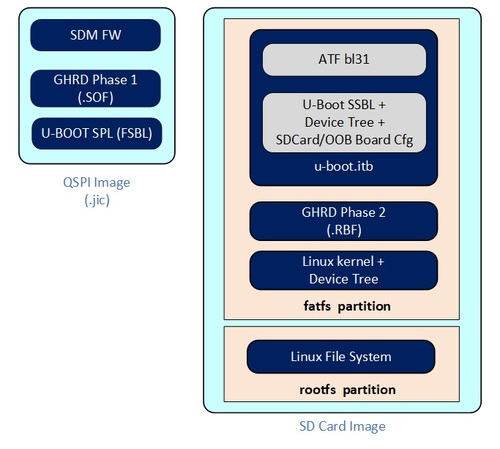
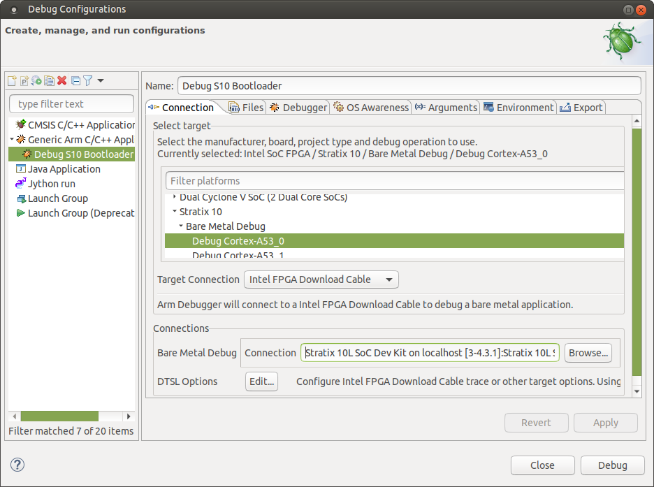
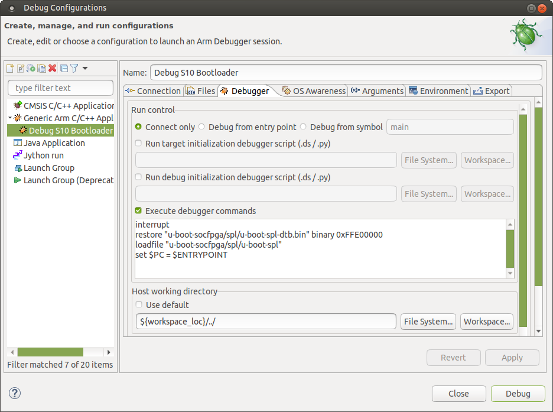
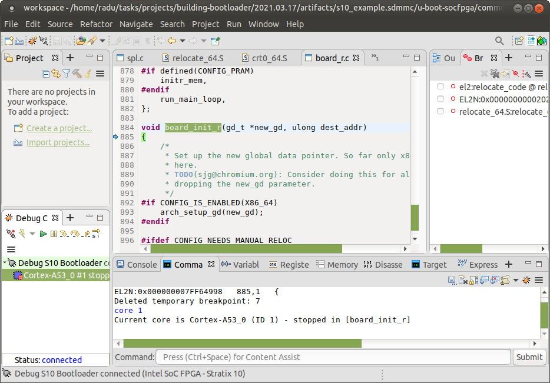

# HPS GHRD Linux Boot Tutorial Example Design: Stratix® 10 SX SoC Development Kit

## Intro

This page contains instructions on how to build Linux systems from separate components: Hardware Design, U-Boot, Arm Trusted Firmware, Linux kernel and device tree, Linux root filesystem. This is different from the Golden System Reference Design, where all the software is built through Yocto. While the instructions use Yocto for building the root file system, alternatives could be used there, such as the buildroot utility for example.

The key differences versus the GSRD are:

 * Fabric is configured from U-Boot directly with the rbf file, with `fpga load` command, instead of using the `bootm` command with the core.rbf part of the kernel.itb file
 * Single image boot is disabled in U-Boot, and it boots directly with the slected boot source, not trying them all
 * The applications and drivers form `meta-intel-fpga-refdes` are not included. That includes acessing GPIOs in the fabric for LEDs, pushbuttons, dip switches, the webserver running on the board, etc.

This instructions from this page target the Stratix® 10 SX SOC Development kit H-Tile (DK-SOC-1SSX-H-D). 

## Component Versions

Altera&reg; Quartus<sup>&reg;</sup> Prime Pro Edition Version 25.3 and the following software component versions integrate the 25.3 release. 

**Note:** Regarding the GHRD components in the following table, only the device-specific GHRD is used in this page.

| Component                             | Location                                                     | Branch                       | Commit ID/Tag       |
| :------------------------------------ | :----------------------------------------------------------- | :--------------------------- | :------------------ |
| Agilex 3 GHRD | [https://github.com/altera-fpga/agilex3c-ed-gsrd](https://github.com/altera-fpga/agilex3c-ed-gsrd)    | main  | QPDS25.3_REL_GSRD_PR   |
| Agilex 5 GHRD - Include GSRD 2.0 baseline design + meta_custom | [https://github.com/altera-fpga/agilex5e-ed-gsrd](https://github.com/altera-fpga/agilex5e-ed-gsrd) | main                    | QPDS25.3_REL_GSRD_PR |
| Agilex 7 GHRD                         | [https://github.com/altera-fpga/agilex7f-ed-gsrd](https://github.com/altera-fpga/agilex7f-ed-gsrd) | main | QPDS25.3_REL_GSRD_PR |
| Stratix 10 GHRD                       | [https://github.com/altera-fpga/stratix10-ed-gsrd](https://github.com/altera-fpga/stratix10-ed-gsrd) | main | QPDS25.3_REL_GSRD_PR |
| Arria 10 GHRD                         | [https://github.com/altera-fpga/arria10-ed-gsrd](https://github.com/altera-fpga/arria10-ed-gsrd)  | main | QPDS25.3_REL_GSRD_PR |
| Linux                                 | [https://github.com/altera-fpga/linux-socfpga](https://github.com/altera-fpga/linux-socfpga) | socfpga-6.12.33-lts | QPDS25.3_REL_GSRD_PR |
| Arm Trusted Firmware                  | [https://github.com/altera-fpga/arm-trusted-firmware](https://github.com/altera-fpga/arm-trusted-firmware) | socfpga_v2.13.0   | QPDS25.3_REL_GSRD_PR |
| U-Boot                                | [https://github.com/altera-fpga/u-boot-socfpga](https://github.com/altera-fpga/u-boot-socfpga) | socfpga_v2025.07 | QPDS25.3_REL_GSRD_PR |
| Yocto Project                         | [https://git.yoctoproject.org/poky](https://git.yoctoproject.org/poky) | walnascar | latest              |
| Yocto Project: meta-altera-fpga (for GSRD 2.0) | [https://github.com/altera-fpga/meta-altera-fpga](https://github.com/altera-fpga/meta-altera-fpga) | walnascar | QPDS25.3_REL_GSRD_PR |
| Yocto Project: meta-intel-fpga (for Legacy GSRD) | [https://git.yoctoproject.org/meta-intel-fpga](https://git.yoctoproject.org/meta-intel-fpga) | walnascar | latest |
| Yocto Project: meta-intel-fpga-refdes (for Legacy GSRD) | [https://github.com/altera-fpga/meta-intel-fpga-refdes](https://github.com/altera-fpga/meta-intel-fpga-refdes) | walnascar | QPDS25.3_REL_GSRD_PR |
| Legacy GSRD | [https://github.com/altera-fpga/gsrd-socfpga](https://github.com/altera-fpga/gsrd-socfpga) | walnascar | QPDS25.3_REL_GSRD_PR |

**Note:** The combination of the component versions indicated in the table above has been validated through the use cases described in this page and it is strongly recommended to use these versions together. If you decided to use any component with different version than the indicated, there is not warranty that this will work.

Starting with SoC EDS Pro version 19.3, the following changes were made:
The bootloader source code was removed from SoC EDS. Instead, the user needs to clone the git trees from https://github.com/altera-fpga/u-boot-socfpga.

The same U-Boot branch is used for all SoC FPGA devices: Cyclone® V SoC, Arria® V SoC, Arria® 10 SoC, Stratix® 10 SoC, Agilex™ 7 and Agilex™ 5.

Starting with Quartus® Pro 20.3, the SoC EDS was discontinued, and the functionality of the tools which were previously part of SoC EDS are provided separately.

## U-Boot Build Flow

For Stratix® 10, Agilex™ 7 and Agilex™ 5 devices, all the handoff information created by the Quartus® Pro compilation is part of the configuration bitstream. The **bsp-editor** is not used, and the bootloader build flow does not depend on the Quartus® outputs.

 

## Single Boot Image

Starting with U-Boot 2021.07, the following changes were made to enable a single set of binaries to be used with multiple boards and hardware projects:

* The Quartus hardware project defines a JTAG User Code which is used by the rest of the system as a board_id to identify the hardware.
* U-Boot has a single defconfig enabling all possible HPS hardware, and depending on the timeouts to determine which hardware is not actually available.
* U-Boot has a single device tree FIT file enabling all possible HPS hardware, but with different configurations inside, selected according to the board_id.
* Linux FIT file also has a different configuration for each board_id. Each configuration includes the kernel, the specific device file, and an optional core.rbf file. If the core.rbf file is specified, the fabric is configured with that file.


Refer to [Single Image Boot](https://www.rocketboards.org/foswiki/Documentation/SingleImageBoot) for more details about this feature.

The Stratix® 10 GSRDs are also updated to use this feature. See the GSRD documentation for details:

* [Stratix® 10 GSRD User Guide](https://altera-fpga.github.io/rel-24.3/embedded-designs/stratix-10/sx/soc/gsrd/ug-gsrd-s10sx-soc/)

## U-Boot Branches

The official Altera® SOCFPGA U-Boot repository is located at https://github.com/altera-fpga/u-boot-socfpga.

**Notes:**

* A "RC" labeled branch is for internal active development use and customer early access without official customer support.
* Latest stable branch (no RC labeled) is strongly recommended for development and production use outside of Altera®.
* See [doc/README.socfpga](https://github.com/altera-fpga/u-boot-socfpga/blob/HEAD/doc/README.socfpga) for Quartus® Pro and Device support.

## Boot From SD Card Example

This example shows a simple example booting Stratix® 10 from SD card.
Note the following:

* Hardware design was customized as follows: <br>
    -  Disable SGMII and PR to reduce compilation time and boot time.<br>
    -  Override the JTAG User Core to that board_id is 4, and the standard SD Card/OOBE configuration is used.


* U-Boot was customized as follows:<br>
    - Disable NAND in the unified defconfig file, as we do not need it.<br>
    - Boot only from SD card, as opposed to trying SD, QSPI and NAND.<br>
    - Use Dwarf4 for debug information, to be compatible with current Arm DS debugger.<br>
    - Configure FPGA fabric from boot command using fpga load command explicitly (instead of using the bootm command to do it).<br>
    - Use booti command to boot Linux, with separate files for kernel and device tree.


The above customizations may be useful for debugging purposes for example.

The following build instructions produce a QSPI(.jic) and an SDCard Image (.img) which includes the components indicated in the following figure:

{: style="height:500px"}

This example uses building U-Boot manually. See [Stratix® 10 SoC H-Tile GSRD](https://altera-fpga.github.io/latest/embedded-designs/stratix-10/sx/soc/gsrd/ug-gsrd-s10sx-soc/) for the full fledged booting from SD card example, where U-Boot is built through Yocto recipes.

### Prerequisites

The following are required:

* Host machine running Linux. Ubuntu 22.04 was used, but other versions may work too.
* Internet connection to download the tools and clone the U-Boot git tree from github. If you are behind a firewall you will need your system administrator to enable you to get to the git trees.
* Altera® Stratix® 10 H-Tile SoC FPGA Development Kit (DK-SOC-1SSX-H-D).
* Quartus<sup>&reg;</sup> Prime Pro Edition Version 25.3

Note that the examples presented on this page boot to Linux and they require Linux kernel, device tree and rootfilesystem to boot. However, you can omit the Linux binaries and just boot to U-Boot prompt if you want to.


### Setting Up Environment


  ```bash
  sudo rm -rf s10_example.sdmmc
  mkdir s10_example.sdmmc
  cd s10_example.sdmmc
  export TOP_FOLDER=`pwd`
  ```


Download the compiler toolchain, add it to the PATH variable, to be used by the GHRD makefile to build the HPS Debug FSBL:


```bash
cd $TOP_FOLDER
wget https://developer.arm.com/-/media/Files/downloads/gnu/14.3.rel1/binrel/\
arm-gnu-toolchain-14.3.rel1-x86_64-aarch64-none-linux-gnu.tar.xz
tar xf arm-gnu-toolchain-14.3.rel1-x86_64-aarch64-none-linux-gnu.tar.xz
rm -f arm-gnu-toolchain-14.3.rel1-x86_64-aarch64-none-linux-gnu.tar.xz
export PATH=`pwd`/arm-gnu-toolchain-14.3.rel1-x86_64-aarch64-none-linux-gnu/bin/:$PATH
export ARCH=arm64
export CROSS_COMPILE=aarch64-none-linux-gnu-
```

Enable Quartus tools to be called from command line:


```bash
export QUARTUS_ROOTDIR=~/altera_pro/25.3/quartus/
export PATH=$QUARTUS_ROOTDIR/bin:$QUARTUS_ROOTDIR/linux64:$QUARTUS_ROOTDIR/../qsys/bin:$PATH
```


### Build Hardware Design


  ```bash 
  cd $TOP_FOLDER
  wget https://github.com/altera-fpga/stratix10-ed-gsrd/archive/refs/tags/QPDS25.3_REL_GSRD_PR.zip
  unzip QPDS25.3_REL_GSRD_PR.zip
  rm QPDS25.3_REL_GSRD_PR.zip
  mv stratix10-ed-gsrd-QPDS25.3_REL_GSRD_PR stratix10-ed-gsrd
  cd stratix10-ed-gsrd
  make s10-htile-soc-devkit-oobe-baseline-all
  cd ..
  ```


After building the hardware design the following binary is created:

- $TOP_FOLDER/stratix10-ed-gsrd/install/designs/s10_htile_soc_devkit_oobe_baseline.sof

### Build Arm Trusted Firmware


  ```bash
  cd $TOP_FOLDER
  rm -rf arm-trusted-firmware
  git clone -b QPDS25.3_REL_GSRD_PR https://github.com/altera-fpga/arm-trusted-firmware
  cd arm-trusted-firmware
  make -j 64 bl31 PLAT=stratix10
  cd ..
  ```


After completing the above steps, the Arm Trusted Firmware binary file is created and is located here.

- $TOP_FOLDER/arm-trusted-firmware/build/stratix10/release/bl31.bin

### Build U-Boot


  ```bash
  cd $TOP_FOLDER
  rm -rf u-boot-socfpga
  git clone -b QPDS25.3_REL_GSRD_PR https://github.com/altera-fpga/u-boot-socfpga
  cd u-boot-socfpga
  # enable dwarf4 debug info, for compatibility with arm ds
  sed -i 's/PLATFORM_CPPFLAGS += -D__ARM__/PLATFORM_CPPFLAGS += -D__ARM__ -gdwarf-4/g' arch/arm/config.mk
  # only boot from SD, do not try QSPI and NAND
  sed -i 's/u-boot,spl-boot-order.*/u-boot\,spl-boot-order = \&mmc;/g' arch/arm/dts/socfpga_stratix10_socdk-u-boot.dtsi
  # disable NAND in the device tree
  sed -i '/&nand {/!b;n;c\\tstatus = "disabled";' arch/arm/dts/socfpga_stratix10_socdk-u-boot.dtsi
  # remove the NAND configuration from device tree
  sed -i '/images/,/binman/{/binman/!d}' arch/arm/dts/socfpga_stratix10_socdk-u-boot.dtsi

  # link to atf
  ln -s $TOP_FOLDER/arm-trusted-firmware/build/stratix10/release/bl31.bin .

  # Create configuration custom file. 
  cat << EOF > config-fragment-stratix10
  # use Image instead of kernel.itb
  CONFIG_BOOTFILE="Image"
  # - Disable NAND/UBI related settings from defconfig. 
  CONFIG_NAND_BOOT=n
  CONFIG_SPL_NAND_SUPPORT=n
  CONFIG_CMD_NAND_TRIMFFS=n
  CONFIG_CMD_NAND_LOCK_UNLOCK=n
  CONFIG_NAND_DENALI_DT=n
  CONFIG_SYS_NAND_U_BOOT_LOCATIONS=n
  CONFIG_SPL_NAND_FRAMEWORK=n
  CONFIG_CMD_NAND=n
  CONFIG_MTD_RAW_NAND=n
  CONFIG_CMD_UBI=n
  CONFIG_CMD_UBIFS=n
  CONFIG_MTD_UBI=n
  CONFIG_ENV_IS_IN_UBI=n
  CONFIG_UBI_SILENCE_MSG=n
  CONFIG_UBIFS_SILENCE_MSG=n
  # - Disable distroboot and use specific boot command. 
  CONFIG_DISTRO_DEFAULTS=n
  CONFIG_HUSH_PARSER=y
  CONFIG_SYS_PROMPT_HUSH_PS2="> "
  CONFIG_USE_BOOTCOMMAND=y
  CONFIG_BOOTCOMMAND="load mmc 0:1 \${loadaddr} ghrd.core.rbf; bridge disable; fpga load 0 \${loadaddr} \${filesize};bridge enable;setenv bootfile Image;run mmcload;run linux_qspi_enable;run rsu_status;run mmcboot"
  CONFIG_CMD_FAT=y
  CONFIG_CMD_FS_GENERIC=y
  CONFIG_DOS_PARTITION=y
  CONFIG_SPL_DOS_PARTITION=y
  CONFIG_CMD_PART=y
  CONFIG_SPL_CRC32=y
  CONFIG_LZO=y
  CONFIG_CMD_DHCP=y
  # Enable more QSPI flash manufacturers
  CONFIG_SPI_FLASH_MACRONIX=y
  CONFIG_SPI_FLASH_GIGADEVICE=y
  CONFIG_SPI_FLASH_WINBOND=y
  EOF

  # build U-Boot
  make clean && make mrproper
  make socfpga_stratix10_defconfig
  # Use created custom configuration file to merge with the default configuration obtained in .config file. 
  ./scripts/kconfig/merge_config.sh -O ./ ./.config ./config-fragment-stratix10
  make -j 64
  cd ..
  ```


After completing the above steps, the following files are created.

- $TOP_FOLDER/u-boot-socfpga/spl/u-boot-spl-dtb.hex - FSBL (U-boot SPL) hex file. 
- $TOP_FOLDER/u-boot-socfpga/u-boot.itb - FIT image file containing SSBL (U-Boot) and ATF (Arm Trusted Firmware) binaries. 

**Note:** The following commands are ran before starting Linux:

* **run linux_qspi_enable:** This passes the QSPI reference clock value to Linux. See [QSPI_Reference_Clock](#qspi-reference-clock) section.
* **run rsu_status:** This performs some RSU operations that must be done before booting Linux. Only needed when enabling RSU. See: [Stratix 10 HPS Remote System Update User Guide](https://www.intel.com/content/www/us/en/docs/programmable/683021/21-4.html?wapkw=stratix%2010%20hps%20rsu%20user%20guide).

**Important**:  Before running the **fpga load** command, you must first run the **bridge disable** command as shown in the above example.

### Prepare QSPI Image


  ```bash
  cd $TOP_FOLDER
  quartus_pfg -c stratix10-ed-gsrd/install/designs/s10_htile_soc_devkit_oobe_baseline.sof ghrd.jic \
  -o device=MT25QU128 \
  -o flash_loader=1SX280HU2F50E1VGAS \
  -o hps_path=u-boot-socfpga/spl/u-boot-spl-dtb.hex \
  -o mode=ASX4 \
  -o hps=1
  ```


The following files are created:

* $TOP_FOLDER/ghrd.hps.jic
* $TOP_FOLDER/ghrd.core.rbf

### Building Linux Kernel


Download and compile Linux:


  ```bash
  cd $TOP_FOLDER
  rm -rf linux-socfpga
  git clone -b QPDS25.3_REL_GSRD_PR https://github.com/altera-fpga/linux-socfpga
  cd linux-socfpga
  make clean && make mrproper
  # enable kernel debugging with RiscFree
  ./scripts/config --set-val CONFIG_DEBUG_INFO  y
  ./scripts/config --set-val CONFIG_GDB_SCRIPTS y
  make defconfig
  make -j 64 Image dtbs
  ```


The following items are built in $TOP_FOLDER:

* $TOP_FOLDER/linux-socfpga/arch/arm64/boot/dts/altera/socfpga_stratix10_socdk.dtb
* $TOP_FOLDER/linux-socfpga/arch/arm64/boot/Image

### Building Yocto Rootfs


This section presents how to build the Linux rootfs using Yocto recipes. Note that the yocto recipes actually build everything, but are only interested in the rootfs.

First, make sure you have Yocto system requirements met: https://docs.yoctoproject.org/3.4.1/ref-manual/system-requirements.html#supported-linux-distributions.

1\. Make sure you have Yocto system requirements met: https://docs.yoctoproject.org/5.0.1/ref-manual/system-requirements.html#supported-linux-distributions.

The command to install the required packages on Ubuntu 22.04 is:

```bash
sudo apt-get update
sudo apt-get upgrade
sudo apt-get install openssh-server mc libgmp3-dev libmpc-dev gawk wget git diffstat unzip texinfo gcc \
build-essential chrpath socat cpio python3 python3-pip python3-pexpect xz-utils debianutils iputils-ping \
python3-git python3-jinja2 libegl1-mesa libsdl1.2-dev pylint xterm python3-subunit mesa-common-dev zstd \
liblz4-tool git fakeroot build-essential ncurses-dev xz-utils libssl-dev bc flex libelf-dev bison xinetd \
tftpd tftp nfs-kernel-server libncurses5 libc6-i386 libstdc++6:i386 libgcc++1:i386 lib32z1 \
device-tree-compiler curl mtd-utils u-boot-tools net-tools swig -y
```

On Ubuntu 22.04 you will also need to point the /bin/sh to /bin/bash, as the default is a link to /bin/dash:

```bash
 sudo ln -sf /bin/bash /bin/sh
```

**Note**: You can also use a Docker container to build the Yocto recipes, refer to https://rocketboards.org/foswiki/Documentation/DockerYoctoBuild for details. When using a Docker container, it does not matter what Linux distribution or packages you have installed on your host, as all dependencies are provided by the Docker container.

**Note:** You can also use a Docker container to build the Yocto recipes, refer to https://rocketboards.org/foswiki/Documentation/DockerYoctoBuild for details. When using a Docker container, it does not matter what Linux distribution or packages you have installed on your host, as all dependencies are provided by the Docker container.


  ```bash 
  cd $TOP_FOLDER 
  rm -rf yocto && mkdir yocto && cd yocto
  git clone -b walnascar https://git.yoctoproject.org/poky
  git clone -b walnascar https://git.yoctoproject.org/meta-intel-fpga
  git clone -b walnascar   https://github.com/openembedded/meta-openembedded
  # work around issue
  echo 'do_package_qa[noexec] = "1"' >> $(find meta-intel-fpga -name linux-socfpga_6.6.bb)
  source poky/oe-init-build-env ./build
  echo 'MACHINE = "stratix10_htile"' >> conf/local.conf
  echo 'BBLAYERS += " ${TOPDIR}/../meta-intel-fpga "' >> conf/bblayers.conf
  echo 'BBLAYERS += " ${TOPDIR}/../meta-openembedded/meta-oe "' >> conf/bblayers.conf  
  echo 'CORE_IMAGE_EXTRA_INSTALL += "openssh gdbserver devmem2"' >> conf/local.conf
  bitbake core-image-minimal
  ```


The following file is created:

* $TOP_FOLDER/yocto/build/tmp/deploy/images/stratix10_htile/core-image-minimal-stratix10_htile.rootfs.tar.gz

### Prepare SD Card Image


  ```bash 
  cd $TOP_FOLDER/
  sudo rm -rf sd_card && mkdir sd_card && cd sd_card
  wget https://releases.rocketboards.org/release/2020.11/gsrd/tools/make_sdimage_p3.py
  # remove mkfs.fat parameter which has some issues on Ubuntu 22.04
  sed -i 's/\"\-F 32\",//g' make_sdimage_p3.py
  chmod +x make_sdimage_p3.py
  mkdir fatfs && cd fatfs
  cp $TOP_FOLDER/u-boot-socfpga/u-boot.itb .
  cp $TOP_FOLDER/linux-socfpga/arch/arm64/boot/Image .
  cp $TOP_FOLDER/linux-socfpga/arch/arm64/boot/dts/altera/socfpga_stratix10_socdk.dtb .
  cp $TOP_FOLDER/ghrd.core.rbf .
  cd ..
  mkdir rootfs && cd rootfs
  sudo tar xf $TOP_FOLDER/yocto/build/tmp/deploy/images/stratix10_htile/core-image-minimal-stratix10_htile.rootfs.tar.gz
  sudo rm -rf lib/modules/*
  cd ..
  sudo python3 make_sdimage_p3.py -f \
  -P fatfs/*,num=1,format=fat32,size=100M \
  -P rootfs/*,num=2,format=ext3,size=400M \
  -s 512M \
  -n sdcard.img
  ```


After completting the binaries build, the following files will be needed to boot Linux:

* $TOP_FOLDER/ghrd.hps.jic
* $TOP_FOLDER/sd_card/sdcard.img


### Boot Linux

Write SD card image to SD card and insert it in the slot.

Configure the S10 SoC Development Kit as follows:

* SW1: 1:OFF, rest:ON
* SW2: 1:ON 2:ON 3: ON 4: OFF (set MSEL to JTAG)
* SW3: all OFF
* SW4: 1:ON 2:OFF 3:OFF 4:ON


Use Quartus® Pro Programmer to program the QSPI flash:
  ```
  cd $TOP_FOLDER/
  quartus_pgm -m jtag -o "pvi;./ghrd.hps.jic"
  ```
**Note**:If there was no previous design running, or if the previous design has been running fine, the MSEL does not need to be set to JTAG. It can remain set to QSPI, and you can still program QSPI flash succesfully. In case there was a previous design running, run "jtagconfig" to determine if the Stratix® 10 (SDM) is first or second in the JTAG scan chain. If it is second, change the above command to:

  ```
  cd $TOP_FOLDER/
  quartus_pgm -m jtag -o "pvi;ghrd.hps.jic@2"  
  ```
Set MSEL back to QSPI:

* SW2: 1:ON 2:OFF 3:OFF 4: OFF

Power cycle the board.

Linux will boot up. Use 'root' as username, a password will not be required.

## Other Examples

### Boot from QSPI
See  [Stratix® 10 Boot From QSPI](https://altera-fpga.github.io/latest/embedded-designs/stratix-10/sx/soc/gsrd/ug-gsrd-s10sx-soc/#boot-from-qspi_1)

### Boot with NAND Storage on HPS

See [Stratix® 10 Boot From NAND](https://altera-fpga.github.io/latest/embedded-designs/stratix-10/sx/soc/gsrd/ug-gsrd-s10sx-soc/#boot-from-nand_1)

### Boot with eMMC Storage on HPS
See [Stratix® 10 HPS eMMC Boot Example](https://altera-fpga.github.io/latest/embedded-designs/stratix-10/sx/soc/emmc/ug-emmc-s10sx-soc/)

## Running U-Boot with the Debugger from Command Line

This section presents examples of how to run U-Boot with the Arm Development Studio from command line. This offers a simple and convenient way to run U-Boot and use it for example to program onboard flash.

  1.- Use the binaries built for the [Boot From SDCard Example](#boot-from-sd-card-example):
  ```
  cd s10_example.sdmmc
  ```

  2.-  Run **jtagconfig** command to determine if the HPS is currently in the JTAG scanchain:
  ```
  jtagconfig
  1) Stratix 10L SoC Dev Kit [3-3.4.4]
    6BA00477   S10HPS/AGILEX_HPS
    C321D0DD   1SX280LH(2|3)/1SX280LN2(|AS)/..
  ```
  If HPS is not present, the line with S10HPS/AGILEX_HPS above will not appear.

  3.- Configure the FPGA with the debug SOF:
  ```
  quartus_pgm -c 1 -m jtag -o "p;stratix10-ed-gsrd/install/designs/s10_htile_soc_devkit_oobe_baseline_hps_debug.sof@2"
  ```
  If the HPS is not present in the jtagconfig output above, please remove the "@2" from the command line above.

  4.-  Create debugger script:
  ```
  cat <<EOT > run-u-boot.ds
  interrupt
  restore "u-boot-socfpga/spl/u-boot-spl-dtb.bin" binary 0xFFE00000
  loadfile "u-boot-socfpga/spl/u-boot-spl"
  core 1
  set \$PC = \$ENTRYPOINT
  core 2
  set \$PC = \$ENTRYPOINT
  core 3
  set \$PC = \$ENTRYPOINT
  core 0
  set \$PC = \$ENTRYPOINT
  thbreak board_boot_order
  continue
  wait
  set spl_boot_list[0]=0
  set \$PC=\$LR
  restore "u-boot-socfpga/u-boot.itb" binary 0x2000000
  continue
  EOT
  ```

  5.- Run the debugger from command line, using the connection parameters reported above by jtagconfig, shown in red below:

  ```
  /opt/arm/developmentstudio-2025.0-1/bin/armdbg  \
  --cdb-entry="Altera SoC FPGA::Stratix 10::Bare Metal Debug::Bare Metal Debug::Debug Cortex-A53x4 SMP::Altera FPGA Download Cable" \
  --cdb-entry-param="rvi_address=Stratix 10L SoC Dev Kit on localhost [3-3.4.4]:Stratix 10L SoC Dev Kit 3-3.4.4" \
  --continue_on_error=true \
  --stop_on_connect=false \
  -s run-u-boot.ds
  ```
  6.- The serial console will show SPL then U-Boot being run:
  ```
  U-Boot SPL 2025.07-35102-g135e53726d-dirty (Jan 29 2025 - 11:04:08 -0600)
  Reset state: Cold
  MPU         1000000 kHz
  L3 main     400000 kHz
  Main VCO    2000000 kHz
  Per VCO     2000000 kHz
  EOSC1       25000 kHz
  HPS MMC     50000 kHz
  UART        100000 kHz
  DDR: 4096 MiB
  SDRAM-ECC: Initialized success with 1175 ms
  QSPI: Reference clock at 400000 kHz
  WDT:   Started watchdog@ffd00200 with servicing every 1000ms (10s timeout)
  Trying to boot from MMC1
  ## Checking hash(es) for config board-0 … OK
  ## Checking hash(es) for Image atf … crc32+ OK
  ## Checking hash(es) for Image uboot … crc32+ OK
  ## Checking hash(es) for Image fdt-0 … crc32+ OK
  NOTICE:  BL31: v2.13.0(release):QPDS25.3_REL_GSRD_PR
  NOTICE:  BL31: Built : 11:03:24, Jan 29 2025

  U-Boot 2025.07-35102-g135e53726d-dirty (Jan 29 2025 - 11:04:08 -0600)socfpga_stratix10

  CPU:   Altera® FPGA SoCFPGA Platform (ARMv8 64bit Cortex-A53)
  Model: SoCFPGA Stratix 10 SoCDK
  DRAM:  2 GiB (effective 4 GiB)
  Core:  26 devices, 21 uclasses, devicetree: separate
  WDT:   Started watchdog@ffd00200 with servicing every 1000ms (10s timeout)
  MMC:   dwmmc0@ff808000: 0
  Loading Environment from FAT... Unable to read "uboot.env" from mmc0:1...
  In:    serial0@ffc02000
  Out:   serial0@ffc02000
  Err:   serial0@ffc02000
  Net:   
  Warning: ethernet@ff800000 (eth0) using random MAC address - d2:31:2d:41:7e:a8
  eth0: ethernet@ff800000
  Hit any key to stop autoboot:  0 
  SOCFPGA_STRATIX10#
  ```

## Debugging U-Boot with Arm DS Eclipse

 This section presents examples of how to debug U-Boot with from the Arm Development Studio Eclipse-based GUI.

 ### Prerequisites
 1.- Use the binaries built for the [Boot From SDCard Example](#boot-from-sd-card-example):
  ```
  cd s10_example.sdmmc
  ```

  2.- Run jtagconfig to determine if the HPS is currently in the JTAG scanchain:
  ```
  jtagconfig
  1) Stratix 10L SoC Dev Kit [3-4.3.1]
    6BA00477   S10HPS/AGILEX_HPS
    C321D0DD   1SX280LH(2|3)/1SX280LN2(|AS)/..
  ```

  If HPS is not present, the line with S10HPS/AGILEX_HPS above will not appear.

  3.- Configure the FPGA with the debug SOF:
  ```
  quartus_pgm -c 1 -m jtag -o "p;stratix10-ed-gsrd/install/designs/s10_htile_soc_devkit_oobe_baseline_hps_debug.sof@2"  
  ```

  If the HPS is not present in the jtagconfig output above, please remove the "@2" from the command line above.

### Debugging SPL
  1.- Run the steps from **Prerequisites section**<br>
  2.- Start the Arm Development Studio Eclipse-based GUI:
  ```
  /opt/arm/developmentstudio-2025.0-1/bin/armds_ide -data workspace &
  ```

  Note the above creates a new workspace in the **s10_example.sdmmc** folder.<br>

  3.- In **Eclipse**, Go to **Run > Debug Configurations** to open the **Debug Configurations** window. <br>

  4.- In the **Debug Configurations** window: <br>
  a) Select the **Generic Arm C/C++ Application** on the left panel and right-click it. From the menu that appears, select **New Configuration**.<br>
  b) Edit the **Name** field from **New_configuration** to something more descriptive, such as **Debug S10 Bootloader**.<br>
    
  5.- In the **Connection** tab:<br>
  a) Go to **Select target** section and select **Altera® SoC FPGA > Stratix 10 > Bare Metal Debug > Debug Cortex-A53_0**<br>
  b) Select the **Target Connection** to be **Altera® FPGA Download Cable**<br>
  c) Click the **Bare Metal Debug > Connection Browse** button and select your cable.

  The **Debug Configurations** window should now look like this:
   

  6.- Go to the **Debugger** tab, and do the following:<br>
  a) Select **Connect Only**<br>
  b) Check **Execute debugger commands** and enter the following commands:
    
    ```
    interrupt
    restore "u-boot-socfpga/spl/u-boot-spl-dtb.bin" binary 0xFFE00000
    loadfile "u-boot-socfpga/spl/u-boot-spl"
    set $PC = $ENTRYPOINT
    ```

  c) Uncheck **Host working directory > Use default** and edit the value to add "/../" so that it looks in the parent folder of the workspace.<br>

 The **Debug Configurations** window should now look like this:

  
     
  7.- Click the **Debug** button. Arm Development Studio will run the commands, therefore downloading the SPL to board and starting it. The Eclipse window should now look like this: 
    
  

  8.- At this point you can use standard debug techniques to debug U-Boot SPL: viewing registers, variables, putting breakpoints, running step-by-step etc.

### Debugging U-Boot

  1.- Run the steps from **Prerequisites** section<br>
  2.- Create the **Debug S10 Bootloader** debug configuration as described in [Debugging SPL](#debugging-spl) section.<br>
  3.- Change the **Execute debugger commands** box to contain the following commands:

  ```
  interrupt
  restore "u-boot-socfpga/spl/u-boot-spl-dtb.bin" binary 0xFFE00000
  loadfile "u-boot-socfpga/spl/u-boot-spl"
  thb board_boot_order
  set $PC = $ENTRYPOINT
  continue
  wait 60s
  set spl_boot_list[0]=0
  set $PC=$LR
  restore "u-boot-socfpga/u-boot.itb" binary 0x2000000
  thb el3:0x1000
  continue
  wait 60s
  symbol-file "u-boot-socfpga/u-boot"
  thb el2:relocate_code
  continue
  wait 60s
  symbol-file "u-boot-socfpga/u-boot" ((gd_t*)$x18)->reloc_off
  thb board_init_r
  continue
  wait 60s
  ```
  What the above does is:<br>
  a) Load and run SPL<br>
  b) Make SPL report boot from RAM was selected <br>
  c) Load ATF+U-Boot image and run it up until U-Boot starts running<br>
  d) Load U-Boot symbols<br>
  e) Run U-Boot until the relocation routine is called<br>
  f) Relocate the U-Boot symbols<br>
  g) Run U-Boot until the *board_init_r* function<br>

  4.-  Click on the **Debug** button. All the above will be executed, and Eclipse will show the code stopped at *board_init_r* function. The **Eclipse** window should look like this:



  5.- At this point you can use standard debug techniques to debug U-Boot SPL: viewing registers, variables, putting breakpoints, running step-by-step etc.

## Managing Secure L3 Registers on Stratix® 10, Agilex™ and N5X®

On Stratix® 10, Agilex™ 7 and N5X® HPS there are specific peripherals which are critical for system operation which can only be accessed from software running at EL3.

The following HPS software components run at EL3 on these devices and can access Secure L3 registers:

* U-Boot SPL: initial values for the secure L3 registers are set here through the device tree 'secreg' entries. The user can customize them as needed by editing the device tree.
* Arm Trusted Firmware (ATF): Both U-Boot and Linux call the ATF SMC (Secure Monitor Call) handler to access a restricted subset of secure L3 registers needed for routine system operation.

This section presents the following:

* How to use the 'secreg' device tree entries to customize initial secure L3 registers values set by U-Boot SPL
* How to access registers from the restricted subset from U-Boot, for debug purposes.
* How to access other secure EL3 register from U-Boot, by by changing the ATF source code to add add them to the restricted subset.

### Setting Initial Values of Secure L3 Registers

The initial values for the Secure L3 registes are set from U-Boot SPL. The register values are specified in secreg entries in the U-Boot device tree file.

Refer to [u-boot-socfpga/blob/HEAD/doc/device-tree-bindings/misc/socfpga_secreg.txt](https://github.com/altera-opensource/u-boot-socfpga/blob/HEAD/doc/device-tree-bindings/misc/socfpga_secreg.txt) for documentation the **secreg**. The  socfpga_v2021.04 version shows the following:
  ```
  * Firewall and privilege register settings in device tree

  Required properties:
  --------------------
  - compatible: should contain "intel,socfpga-secreg"
  - intel,offset-settings: 32-bit offset address of block register, and then
						 followed by 32-bit value settings.
  Example:
  --------
		socfpga_secreg: socfpga-secreg {
			compatible = "intel,socfpga-secreg";
			#address-cells = <1>;
			#size-cells = <1>;
			u-boot,dm-pre-reloc;

			i_sys_mgr@ffd12000 {
				reg = <0xffd12000 0x00000228>;
				intel,offset-settings =
					<0x00000020 0xff010000>,
					<0x00000024 0xffffffff>;
				u-boot,dm-pre-reloc;
			};
		};
  ```
Notes about the example:

* The u-boot,dm-pre-reloc; statement in the example informs U-Boot the driver will be loaded in SPL.
* The i_sys_mgr@ffd12000 statement in the example is informative only to enable readers to quickly see what IP is being set up, it is not actually used by the code.
* The reg =<0xffd12000 0x00000228> entry specifies the IP module base address 0xffd12000 and span of 0x00000228 bytes.
* The <0x00000020 0xff010000>, specifies that the register at offset 0x00000020 from the IP module base address will be set to value 0xff010000.

These are the files which currently define the initial value of the Secure L3 registers:

* Common: u-boot-socfpga/arch/arm/dts/socfpga_soc64_u-boot.dtsi.
* Stratix® 10: u-boot-socfpga/arch/arm/dts/socfpga_stratix10-u-boot.dtsi.
* Agilex™ 7: arch/arm/dts/socfpga_agilex-u-boot.dtsi
* N5X®: u-boot-socfpga/arch/arm/dts/socfpga_n5x-u-boot.dtsi

You can edit the above files accordingly to change the default values, or set the initial value of more registers.

### Accessing Secure L3 Registers from U-Boot Command Line

A small subset of critical EL3 restricted access registers are made visible through the ATF SMC handler. The current list of registers is defined in [arm-trusted-firmware/blob/HEAD/plat/intel/soc/common/socfpga_sip_svc.c.](https://github.com/altera-opensource/arm-trusted-firmware/blob/HEAD/plat/intel/soc/common/socfpga_sip_svc.c).

The secure L3 registers accessible through the ATF SMC handler can also optionally be accessed from U-Boot command line for debug purposes. The feature can be enabled by setting **CONFIG_CMD_SMC=y** in the U-Boot configuration file.

Once the feature is enabled, the following command will be avaible from U-Boot command line interface:

  ```
  SOCFPGA # smc
  smc - Issue a Secure Monitor Call

  Usage:
  smc  [arg1 … arg6] [id]
    - fid Function ID
    - arg SMC arguments, passed to X1-X6 (default to zero)
    - id  Secure OS ID / Session ID, passed to W7 (defaults to zero)
  ```
The U-Boot environment already includes predefined ids to facilitate the usage of the command:
  ```
  smc_fid_rd=0xC2000007
  smc_fid_upd=0xC2000009
  smc_fid_wr=0xC2000008
  ```
The command can be used as follows:
  ```
  smc ${smc_fid_rd} <address>
  smc ${smc_fid_wr} <address> <value>
  smc ${smc_fid_upd} <address> <mask> <value>
  ```
See below using the new command to access the BOOT_SCRATCH_COLD0 register (note there is no need to access that register, this is just an example):

1.- Read the register:
  ```
  SOCFPGA_STRATIX10 # smc ${smc_fid_rd} 0xffd12200
  Res:  0 400000 4291895808 0
  ```
Note:

* First value from Res is the return code, 0 means operation succesfull.
* Second value represents the read register value in decimal 400000=0x00061a80.
* Third value is the address in decimal 4291895808=0xffd12200.

2.- Write the register with a new value:
  ```
  SOCFPGA_STRATIX10 # smc ${smc_fid_wr} 0xffd12200 0x00061a81
  Res:  0 400001 4291895808 0
  ```

3.-  Read back the register to confirm it has been updated:
  ```
  SOCFPGA_STRATIX10 # smc ${smc_fid_rd} 0xffd12200
  Res:  0 400001 4291895808 0
  ```
### Enabling Access to more Secure L3 Registers for Debug Purposes

By default, only a small subset of critical EL3 restricted access registers are made visible through the ATF SMC handler. The current list of registers is defined in [arm-trusted-firmware/blob/HEAD/plat/intel/soc/common/socfpga_sip_svc.c](https://github.com/altera-opensource/arm-trusted-firmware/blob/HEAD/plat/intel/soc/common/socfpga_sip_svc.c). For debug purposes, you can add more registers to the restricted register list that can be accessed through the ATF SMC handler.

**Warning: Changing the list of EL3 restricted access registers in ATF is risky, and must be done only for debug purposes only! Do not forget to remove the code once debugging has completed!**

When trying to access a register which is not made visible by the ATF SMC handler, an error will be reported. See below example trying to read the noc_fw_soc2fpga_soc2fpga_scr register:
  ```
  SOCFPGA_STRATIX10 # smc ${smc_fid_rd} 0xffd21200
  Res:  4 0 4291957248 0
  ```
Note:

* The non-zero (4) return code means the operation was not succesfull.

After editing the file [arm-trusted-firmware/blob/HEAD/plat/intel/soc/common/socfpga_sip_svc.c](https://github.com/altera-opensource/arm-trusted-firmware/blob/HEAD/plat/intel/soc/common/socfpga_sip_svc.c) to add this register to the list, and recompiling ATF, the operation is succesfull:

  ```
  SOCFPGA_STRATIX10 # smc ${smc_fid_rd} 0xffd21200
  Res:  0 268304641 4291957248
  ```
Note:

* Return code is zero, operation was succesfull.
* Read value is decimal 268304641=0xFFE0101.

## Boot Scratch Register Usage
On Stratix® 10 SoC, Agilex™ 7 and N5X® devices, the boot scratch registers are part of the System Manager and are used to pass values between various software components. The table below summarizes the usage.

**Note:**

* If no device is provided it means that it applies for all.
* If a cell is not specified for a device, then this could be used as a scratch memory.

| Address                      | Name                                       | Usage                                                        | SDM                                                          | U-Boot                                                       | ATF                                              | Linux               |
| :--------------------------- | :----------------------------------------- | :----------------------------------------------------------- | :----------------------------------------------------------- | :----------------------------------------------------------- | :----------------------------------------------- | :------------------ |
| 0xFFD1 2200                  | boot_scratch_cold0                         | Bits[31] N5X. DDR retention                                  | Sets this bit                                                | Read <br> (is_ddr_retention_enabled)                         |                                                  |                     |
| 0xFFD1 2200                  | boot_scratch_cold0                         | Bits[30:28] N5X, Agilex7M. DDR reset type                    | Sets this field                                              | Read <br> (get_reset_type)                                   |                                                  |                     |
| 0xFFD1 2200                  | boot_scratch_cold0                         | Bits[27:0] SOC 64-bit storing qspi ref clock(kHz)            | Sets this field                                              | Sets value cm_set_qspi_controller_clk_hz <br> Reads value cm_get_qspi_controller_clk_hz |                                                  |                     |
| 0xFFD1 2204                  | boot_scratch_cold1                         | osc1 clock freq                                              |                                                              | Sets and read(cm_get_osc_clk_hz)                             |                                                  |                     |
| 0xFFD1 2208                  | boot_scratch_cold 2                        | fpga clock freq                                              |                                                              | Sets and read (cm_get_fpga_clk_hz)                           |                                                  |                     |
| 0xFFD1 220C                  | boot_scratch_cold3                         | reserved for customer use                                    |                                                              |                                                              |                                                  |                     |
| 0xFFD1 2210 <br> 0xFFD1 2214 | boot_scratch_cold4 <br> boot_scratch_cold5 | Secondary CPU RELEASE ADDRESS                                |                                                              | Main core clears it (lowlevel_init)                          | Main CPU Write (bl31_platform_setup)             |                     |
| 0xFFD1 2218 <br> 0xFFD1 221C | boot_scratch_cold6 <br> boot_scratch_cold7 | 64-bit signature with L2 reset indication done.              | Writes signature (l2_reset_cpu) Reads the register (lowlevel_init) | Writes register (socfpga_system_reset2) Reads register (plat_get_my_entrypoint) |                                                  |                     |
| 0xFFD1 2220                  | boot_scratch_cold8                         | Bit[31:31] N5X, Agilex 7M. DBE status                        | Set by SDM                                                   | Check if bit is set (is_ddr_dbe_triggered)                   |                                                  |                     |
| 0xFFD1 2220                  | boot_scratch_cold8                         | Bit[30:30] N5X, Agilex 7M. DDR Init Progress                 |                                                              | Set and clear bit(ddr_init_inprogress) Read status (is_ddr_init_hang) |                                                  |                     |
| 0xFFD1 2220                  | boot_scratch_cold8                         | Bit[29:29] Agilex 7M. OCRAM_DBE  Error status                |                                                              |                                                              |                                                  |                     |
| 0xFFD1 2220                  | boot_scratch_cold8                         | Bits[28:27] Agilex 7M. Number of IO96B instances             |                                                              | Sets this field (update_io96b_assigned_to_hps)               |                                                  |                     |
| 0xFFD1 2220                  | boot_scratch_cold8                         | Bit[19:19] Agilex 7, Agilex 7M, S10. CPU power domain is about to be turned on. |                                                              |                                                              | Handled call under event (socfpga_pwr_domain_on) |                     |
| 0xFFD1 2220                  | boot_scratch_cold8                         | Bit[18:18] Agilex 7, S10. ACF DDR Data rate                  | Set this bit                                                 | Read this value (sdram_mmr_init_full)                        |                                                  |                     |
| 0xFFD1 2220                  | boot_scratch_cold8                         | Bit[17,16,1] ECC_DDR1 Error Flag, ECC_DDR0 Error Flag, ECC_OCRAM Error Flag |                                                              |                                                              |                                                  |                     |
| 0xFFD1 2220                  | boot_scratch_cold8                         | Checks if any of the flags are set (socfpga_system_reset2)   | Set via ATF SMC                                              |                                                              |                                                  |                     |
| 0xFFD1 2224                  | boot_scratch_cold9                         |                                                              |                                                              |                                                              |                                                  | Write (via ATF SMC) |

Links:

* [Stratix® 10 HPS Registers](https://www.intel.com/content/www/us/en/programmable/hps/stratix-10/hps.html)
* [Agilex™ 7 HPS Registers](https://www.intel.com/content/www/us/en/programmable/hps/agilex/hps.html)
* Review device-specific Boot User Guide for more information about these registers.


## QSPI Reference Clock
The QSPI peripheral clocks are provided by the SDM, based on the SDM input clocks and configuration clock settings defined in the Quartus® Pro project. However, the HPS needs to know the QSPI reference clock, so that it can properly set the dividers in the QSPI controller to create the desired external QSPI clock frequency.

The HPS obtains the QSPI controller reference clock frequency when it obtains exclusive access to the QSPI from the SDM. The frequency reported by the SDM is stored in the U-Boot environment variable called **${qspi_clock}**.

Before booting Linux, U-Boot loads the Linux device tree in memory, then runs the command **linux_qspi_enable** which sets the QSPI controller reference clock appropriately using the value from the **${qspi_clock}** environment variable.

## Reconfiguring Core Fabric from U-Boot
The GSRD configures the FPGA core fabric only once by U-boot during the Linux launch using the **bootm** command. In the bootloaders build flow, the reconfiguration is done in the U-Boot Shell through the **fpga load** command.

**Important**: If the FPGA fabric is already configured and bridges are enabled, you must call the **bridge disable** command from U-Boot before issuing the **bootm** or **fpga load** commands to reconfigure the fabric. Only do this if you are using an **arm-trusted-firmware** version more recent than the following:

* v2.7.1 = [https://github.com/altera-fpga/arm-trusted-firmware/commit/0a5edaed853e0dc1e687706ccace8e844b2a8db7](https://github.com/altera-fpga/arm-trusted-firmware/commit/0a5edaed853e0dc1e687706ccace8e844b2a8db7)
* v2.8.0 = [https://github.com/altera-fpga/arm-trusted-firmware/commit/bf933536d4582d63d0e29434e807a641941f3937](https://github.com/altera-fpga/arm-trusted-firmware/commit/bf933536d4582d63d0e29434e807a641941f3937)


The example below shows the steps to perform FPGA configuration from the U-boot.

1\. First, write the sdcard.img into an SD card. (Rename the wic file to 'sdcard.img')<br>
2\. Copy the configuration bitstream, ghrd.core.rbf, into the same SD Card.<br>
3\. Insert the SD Card to the board, boot the board up, and enter the U-boot shell when prompted.<br>
4\. In U-boot shell, run the following commands in sequence to perform FPGA configuration:<br>

* fatload mmc 0:1 [address] [ghrd.core.rbf]<br>
* fpga load [device] [address] [file_size]<br>

5\. The message "FPGA reconfiguration OK!" will be printed out upon successful transaction.<br>


Here is an example for Agilex® 7 device, but the same steps apply for Stratix® 10, Agilex® 5, and Agilex® 3 SoC FPGA devices.

```bash
Hit any key to stop autoboot:  0 /// Hit any key at this point to enter the U-boot Shell ///

SOCFPGA_AGILEX #
SOCFPGA_AGILEX # fatload mmc 0:1 ${loadaddr} ghrd.core.rbf
2404352 bytes read in 116 ms (19.8 MiB/s)
SOCFPGA_AGILEX # fpga load 0 ${loadaddr} ${filesize}
…FPGA reconfiguration OK!
```

## Enabling Bridges from U-Boot

U-Boot offers the **bridge** command for controlling the bridges.

The **bridge** command can be used with either **'enable'** or **'disable'** parameter, followed by an optional **'mask'** parameter indicating which of the bridges needs to be enabled or disabled. When the **'mask'** parameter is omitted, all bridges are either enabled or disabled.

See bellow the help message for the command:
  ```
  # bridge
  bridge - SoCFPGA HPS FPGA bridge control

  Usage:
  bridge enable [mask] - Enable HPS-to-FPGA (Bit 0), LWHPS-to-FPGA (Bit 1), FPGA-to-HPS (Bit 2), F2SDRAM0 (Bit 3), F2SDRAM1 (Bit 4), F2SDRAM2 (Bit 5) bridges 
  bridge disable [mask] - Disable HPS-to-FPGA (Bit 0), LWHPS-to-FPGA (Bit 1), FPGA-to-HPS (Bit 2), F2SDRAM0 (Bit 3), F2SDRAM1 (Bit 4), F2SDRAM2 (Bit 5) bridges
  Bit 3, Bit 4 and Bit 5 bridges only available in Stratix 10
  ```
The** 'mask'** is a hexadecimal number, with 3 bits available for Agilex™ 7, and 6 bits for Stratix® 10, as indicated above.

The following table shows examples of enabling and disabling various bridges:

| Command | Description |
| :-- | :-- | 
| bridge enable | Enable all bridges |
| bridge disable | Disable all bridges |
| bridge enable 1 | Enable HPS-to-FPGA bridge |
| bridge enable 2  | Enable LWHPS-to-FPGA bridge |
| bridge enable 4 | Enable FPGA-to-HPS bridge |
| bridge enable 7 | Enable HPS-to-FPGA, LWHPS-to-FPGA, FPGA-to-HPS bridges | 
| bridge enable 35 | Enable HPS-to-FPGA, FPGA-to-HPS, F2SDRAM1, F2SDRAM2 bridges(Stratix® 10 only)  |
| bridge disable 30 | Disable F2SDRAM1, F2SDRAM2 bridges (Stratix® 10 only) |


## Notices & Disclaimers

Altera<sup>&reg;</sup> Corporation technologies may require enabled hardware, software or service activation.
No product or component can be absolutely secure. 
Performance varies by use, configuration and other factors.
Your costs and results may vary. 
You may not use or facilitate the use of this document in connection with any infringement or other legal analysis concerning Altera or Intel products described herein. You agree to grant Altera Corporation a non-exclusive, royalty-free license to any patent claim thereafter drafted which includes subject matter disclosed herein.
No license (express or implied, by estoppel or otherwise) to any intellectual property rights is granted by this document, with the sole exception that you may publish an unmodified copy. You may create software implementations based on this document and in compliance with the foregoing that are intended to execute on the Altera or Intel product(s) referenced in this document. No rights are granted to create modifications or derivatives of this document.
The products described may contain design defects or errors known as errata which may cause the product to deviate from published specifications.  Current characterized errata are available on request.
Altera disclaims all express and implied warranties, including without limitation, the implied warranties of merchantability, fitness for a particular purpose, and non-infringement, as well as any warranty arising from course of performance, course of dealing, or usage in trade.
You are responsible for safety of the overall system, including compliance with applicable safety-related requirements or standards. 
<sup>&copy;</sup> Altera Corporation.  Altera, the Altera logo, and other Altera marks are trademarks of Altera Corporation.  Other names and brands may be claimed as the property of others. 

OpenCL* and the OpenCL* logo are trademarks of Apple Inc. used by permission of the Khronos Group™.   