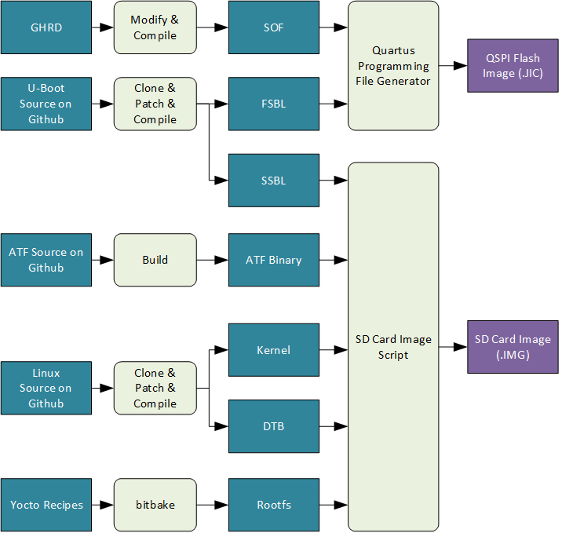

## Overview 
 
This project demonstrates how to boot to Linux on the Stratix&reg; SoC HPS using eMMC instead of the standard SD card. 
 
### Prerequisites 
 
You will need the following items: 
 
- Stratix&reg; 10 SX SoC Development Kit, production version, H-Tile (ordering code DK-SOC-1SSX-H-D):
  - NAND/eMMC HPS Daughtercard 
  - SDM QSPI Bootcard with MT25QU02G flash device 
- Linux host PC (Ubuntu 22.04LTS was used for developing this project, but other versions may work too) 
- Internet access (for downloading files attached to this page, and cloning git trees from github) 
- TFTP server running on host computer (or other accessible computer on the local network) 
- Altera&reg; Quartus<sup>&reg;</sup> Prime Pro Edition Version 24.3

Refer to [board documentation](https://www.intel.com/content/www/us/en/products/details/fpga/development-kits/stratix/10-sx.html) for more details about the development kit.

### NAND/eMMC Daughtercard 
 
The NAND/eMMC HPS daughtercard that comes with the S10 SoC DevKit supports both NAND and eMMC. 
 
To configure the card for eMMC operation, please set the jumpers as shown below: 
 
| Jumper | Setting | 
| :-- | :-- | 
| J2 | unpopulated | 
| J9 | unpopulated | 
| J10 | populated 1-2 | 
| J11 | populated 2-3 | 
 
For reference, the NAND/eMMC schematic is available at [https://www.intel.com/content/dam/altera-www/global/en_US/support/boards-kits/arria10/soc/hps_io48_nand_dc.pdf](https://www.intel.com/content/dam/altera-www/global/en_US/support/boards-kits/arria10/soc/hps_io48_nand_dc.pdf). 
 
### Deliverables 
 
The following files are available as part of this example: 
 
| File | Description | 
| :-- | :-- | 
| [stratix10-u-boot-emmc.patch](https://altera-fpga.github.io/rel-24.3/embedded-designs/stratix-10/sx/soc/emmc/collateral/stratix10-u-boot-emmc.patch) | U-Boot DTS patch to use eMMC - device tree changes only | 
| [stratix10-linux-emmc.patch](https://altera-fpga.github.io/rel-24.3/embedded-designs/stratix-10/sx/soc/emmc/collateral/stratix10-linux-emmc.patch) | Linux DTS patch to use eMMC - device tree changes only | 
 


## Build Instructions 


### Build Flow

 
 
The main changes vs. the standard SD card flow are: 
 
- Hardware project is modified to target the eMMC daughtercard 
- U-Boot device tree is patched to match the eMMC daughtercard 
- Linux device tree is patched to match the eMMC daughtercard 
- eMMC image is downloaded over TFTP and written by U-Boot which is ran by the debugger 
 
### Set Up Environment 
 
Create a top folder for this example, as the rest of the commands assume this location: 
 

```bash 
sudo rm -rf stratix10.emmc_boot
mkdir stratix10.emmc_boot
cd stratix10.emmc_boot
export set TOP_FOLDER=`pwd` 
``` 

 
Download the compiler toolchain, add it to the PATH variable, to be used by the GHRD makefile to build the HPS Debug FSBL:


```bash
cd $TOP_FOLDER
wget https://developer.arm.com/-/media/Files/downloads/gnu/11.2-2022.02/binrel/\
gcc-arm-11.2-2022.02-x86_64-aarch64-none-linux-gnu.tar.xz
tar xf gcc-arm-11.2-2022.02-x86_64-aarch64-none-linux-gnu.tar.xz
rm -f gcc-arm-11.2-2022.02-x86_64-aarch64-none-linux-gnu.tar.xz
export PATH=`pwd`/gcc-arm-11.2-2022.02-x86_64-aarch64-none-linux-gnu/bin:$PATH
export ARCH=arm64
export CROSS_COMPILE=aarch64-none-linux-gnu-
```

Enable Quartus tools to be called from command line:


```bash
export QUARTUS_ROOTDIR=~/intelFPGA_pro/24.3/quartus/
export PATH=$QUARTUS_ROOTDIR/bin:$QUARTUS_ROOTDIR/linux64:$QUARTUS_ROOTDIR/../qsys/bin:$PATH
```


 
### Build Hardware Design 

 
The hardware design is downloaded from Github, then it's configured to enable the eMMC HPS card, then it's compiled: 
 

```bash 
cd $TOP_FOLDER 
rm -rf ghrd-socfpga s10_soc_devkit_ghrd 
git clone -b QPDS24.3_REL_GSRD_PR https://github.com/altera-opensource/ghrd-socfpga
mv ghrd-socfpga/s10_soc_devkit_ghrd . 
rm -rf ghrd-socfpga 
cd s10_soc_devkit_ghrd 
# target the h-tile board
export QUARTUS_DEVICE=1SX280HU2F50E1VGAS
# use fpga configuration first instead of hps boot first 
export BOOTS_FIRST=fpga 
# select the emmc hps daughtercard 
export DAUGHTER_CARD=devkit_dc_emmc 
# disable sgmii and partial reconfiguration - to decrease build time 
export HPS_ENABLE_SGMII=0 
export ENABLE_PARTIAL_RECONFIGURATION=0 
make scrub_clean_all 
make generate_from_tcl 
make all
unset BOOTS_FIRST
unset DAUGHTER_CARD
cd .. 
``` 

 
The following relevant files are created in $TOP_FOLDER/s10_soc_devkit_ghrd/output_files/: 
 
- `ghrd_1sx280hu2f50e1vgas.sof` - FPGA configuration file, without HPS FSBL 
- `ghrd_1sx280hu2f50e1vgas_hps_debug.sof` - FPGA configuration file, with dummy HPS FSBL used for debugging 
 

### Build Arm* Trusted Firmware 


 
```bash 
cd $TOP_FOLDER 
rm -rf arm-trusted-firmware 
git clone -b QPDS24.3_REL_GSRD_PR https://github.com/altera-opensource/arm-trusted-firmware 
cd arm-trusted-firmware
make bl31 PLAT=stratix10 DEPRECATED=1 
cd .. 
``` 


 
### Build U-Boot 


 
```bash 
cd $TOP_FOLDER 
wget https://altera-fpga.github.io/rel-24.3/embedded-designs/stratix-10/sx/soc/emmc/collateral/stratix10-u-boot-emmc.patch
rm -rf u-boot-socfpga 
git clone -b QPDS24.3_REL_GSRD_PR https://github.com/altera-opensource/u-boot-socfpga 
cd u-boot-socfpga 
# change device tree to account for board differences 
patch -p 1 < ../stratix10-u-boot-emmc.patch
# enable dwarf4 debug info, for compatibility with arm ds 
sed -i 's/PLATFORM_CPPFLAGS += -D__ARM__/PLATFORM_CPPFLAGS += -D__ARM__ -gdwarf-4/g' arch/arm/config.mk 
# use 'Image' for kernel image instead of 'kernel.itb'
sed -i 's/kernel\.itb/Image/g' arch/arm/Kconfig
# only boot from SD, do not try QSPI and NAND 
sed -i 's/u-boot,spl-boot-order.*/u-boot\,spl-boot-order = \&mmc;/g' arch/arm/dts/socfpga_stratix10_socdk-u-boot.dtsi 
# disable NAND in the device tree 
sed -i '/&nand {/!b;n;c\\tstatus = "disabled";' arch/arm/dts/socfpga_stratix10_socdk-u-boot.dtsi 
# remove the NAND configuration from device tree 
sed -i '/images/,/binman/{/binman/!d}' arch/arm/dts/socfpga_stratix10_socdk-u-boot.dtsi 
 # Create configuration custom file. 
cat << EOF > config-fragment
# use Image instead of kernel.itb
CONFIG_BOOTFILE="Image"
# - Disable NAND/UBI related settings from defconfig. 
CONFIG_NAND_BOOT=n 
CONFIG_SPL_NAND_SUPPORT=n 
CONFIG_CMD_NAND_TRIMFFS=n 
CONFIG_CMD_NAND_LOCK_UNLOCK=n 
CONFIG_NAND_DENALI_DT=n 
CONFIG_SYS_NAND_U_BOOT_LOCATIONS=n 
CONFIG_SPL_NAND_FRAMEWORK=n 
CONFIG_CMD_NAND=n 
CONFIG_MTD_RAW_NAND=n 
CONFIG_CMD_UBI=n 
CONFIG_CMD_UBIFS=n 
CONFIG_MTD_UBI=n 
CONFIG_ENV_IS_IN_UBI=n 
CONFIG_UBI_SILENCE_MSG=n 
CONFIG_UBIFS_SILENCE_MSG=n 
# - Disable distroboot and use specific boot command. 
CONFIG_DISTRO_DEFAULTS=n 
CONFIG_HUSH_PARSER=y 
CONFIG_SYS_PROMPT_HUSH_PS2="> " 
CONFIG_USE_BOOTCOMMAND=y 
CONFIG_BOOTCOMMAND="bridge enable;run mmcload;run linux_qspi_enable;run rsu_status;run mmcboot" 
CONFIG_CMD_FAT=y 
CONFIG_CMD_FS_GENERIC=y 
CONFIG_DOS_PARTITION=y 
CONFIG_SPL_DOS_PARTITION=y 
CONFIG_CMD_PART=y 
CONFIG_SPL_CRC32=y 
CONFIG_LZO=y 
CONFIG_CMD_DHCP=y 
# Enable more QSPI flash manufacturers 
CONFIG_SPI_FLASH_MACRONIX=y 
CONFIG_SPI_FLASH_GIGADEVICE=y 
CONFIG_SPI_FLASH_WINBOND=y 
EOF
# build U-Boot 
make clean && make mrproper 
make socfpga_stratix10_defconfig 
# Use created custom configuration file to merge with the default configuration obtained in .config file. 
./scripts/kconfig/merge_config.sh -O ./ ./.config ./config-fragment
# link to atf 
ln -s $TOP_FOLDER/arm-trusted-firmware/build/stratix10/release/bl31.bin . 
make -j 64 
cd .. 
``` 

 
The following files will be created: 
 
- `$TOP_FOLDER/u-boot-socfpga/spl/u-boot-spl-dtb.hex` - SSBL/SPL hex file 
- `$TOP_FOLDER/u-boot-socfpga/u-boot.itb` - U-Boot and ATF combined image file 
 

### Create QSPI Image 

 
The QSPI image will contain the FPGA configuration data and the HPS FSBL and it can be built using the following command: 
 

```bash 
cd $TOP_FOLDER 
quartus_pfg -c s10_soc_devkit_ghrd/output_files/ghrd_1sx280hu2f50e1vgas.sof flash_image.jic \ 
 -o device=MT25QU128 \ 
 -o flash_loader=1SX280HU2 \ 
 -o hps_path=u-boot-socfpga/spl/u-boot-spl-dtb.hex \ 
 -o mode=ASX4 
``` 

 
The following image file will be created: 
 
- `$TOP_FOLDER/flash_image.jic` 
 

### Build Linux 

 
The following instructions are used to build Linux: 
 

```bash 
cd $TOP_FOLDER 
wget https://altera-fpga.github.io/rel-24.3/embedded-designs/stratix-10/sx/soc/emmc/collateral/stratix10-linux-emmc.patch
rm -rf linux-socfpga 
git clone -b QPDS24.3_REL_GSRD_PR https://github.com/altera-opensource/linux-socfpga 
cd linux-socfpga 
patch -p1 < ../stratix10-linux-emmc.patch
make clean && make mrproper 
make defconfig 
make -j 64 Image dtbs 
cd .. 
``` 

 
The following relevant files are created: 
 
- `$TOP_FOLDER/linux-socfpga/arch/arm64/boot/Image` - Linux kernel image 
- `$TOP_FOLDER/linux-socfpga/arch/arm64/boot/dts/altera/socfpga_stratix10_socdk.dtb` - Linux Device Tree Blob 
 

### Build Rootfs 

 
A root file system is required to boot Linux. There are a lot of ways to build a root file system, depending on your specific needs. This section shows how to build a small root file system using Yocto. 
 
1\. Make sure you have Yocto system requirements met: https://docs.yoctoproject.org/5.0.1/ref-manual/system-requirements.html#supported-linux-distributions.

The command to install the required packages on Ubuntu 22.04 is:

```bash
sudo apt-get update
sudo apt-get upgrade
sudo apt-get install openssh-server mc libgmp3-dev libmpc-dev gawk wget git diffstat unzip texinfo gcc \
build-essential chrpath socat cpio python3 python3-pip python3-pexpect xz-utils debianutils iputils-ping \
python3-git python3-jinja2 libegl1-mesa libsdl1.2-dev pylint3 xterm python3-subunit mesa-common-dev zstd \
liblz4-tool git fakeroot build-essential ncurses-dev xz-utils libssl-dev bc flex libelf-dev bison xinetd \
tftpd tftp nfs-kernel-server libncurses5 libc6-i386 libstdc++6:i386 libgcc++1:i386 lib32z1 \
device-tree-compiler curl mtd-utils u-boot-tools net-tools swig -y
```

On Ubuntu 22.04 you will also need to point the /bin/sh to /bin/bash, as the default is a link to /bin/dash:

```bash
 sudo ln -sf /bin/bash /bin/sh
```

**Note**: You can also use a Docker container to build the Yocto recipes, refer to https://rocketboards.org/foswiki/Documentation/DockerYoctoBuild for details. When using a Docker container, it does not matter what Linux distribution or packages you have installed on your host, as all dependencies are provided by the Docker container.
 
2\. Run the following commands to build the root file system: 
 

```bash 
cd $TOP_FOLDER 
rm -rf yocto && mkdir yocto && cd yocto 
git clone -b scarthgap http://git.yoctoproject.org/poky
git clone -b scarthgap http://git.yoctoproject.org/meta-intel-fpga
git clone -b scarthgap http://git.openembedded.org/meta-openembedded
source poky/oe-init-build-env ./build 
echo 'MACHINE = "stratix10"' >> conf/local.conf 
echo 'BBLAYERS += " ${TOPDIR}/../meta-intel-fpga "' >> conf/bblayers.conf 
echo 'BBLAYERS += " ${TOPDIR}/../meta-openembedded/meta-oe "' >> conf/bblayers.conf 
echo 'IMAGE_FSTYPES = "tar.gz"' >> conf/local.conf 
echo 'CORE_IMAGE_EXTRA_INSTALL += " fio"' >> conf/local.conf 
bitbake core-image-minimal 
``` 

 
After the build completes, which can take a few hours depending on your host system processing power and Internet connection speed, the following root file system archive will be created: 
 
- `$TOP_FOLDER/yocto/build/tmp/deploy/images/stratix10/core-image-minimal-stratix10.rootfs.tar.gz`

 

### Create eMMC Image 

 
The eMMC image is created with the same procedure used for creating SD card images: 
 

```bash 
cd $TOP_FOLDER 
sudo rm -rf sd_card 
mkdir sd_card 
cd sd_card 
wget https://releases.rocketboards.org/2021.04/gsrd/tools/make_sdimage_p3.py 
chmod +x make_sdimage_p3.py 
# remove mkfs.fat parameter which has some issues on Ubuntu 22.04 
sed -i 's/\"\-F 32\",//g' make_sdimage_p3.py 
mkdir fat && cd fat 
cp $TOP_FOLDER/u-boot-socfpga/u-boot.itb . 
cp $TOP_FOLDER/linux-socfpga/arch/arm64/boot/Image . 
cp $TOP_FOLDER/linux-socfpga/arch/arm64/boot/dts/altera/socfpga_stratix10_socdk.dtb . 
cd .. 
mkdir rootfs && cd rootfs 
sudo tar xf $TOP_FOLDER/yocto/build/tmp/deploy/images/stratix10/core-image-minimal-stratix10.rootfs.tar.gz 
sudo rm -rf lib/modules/* 
cd .. 
sudo python3 ./make_sdimage_p3.py -f \ 
 -P rootfs/*,num=2,format=ext3,size=64M \ 
 -P fat/*,num=1,format=fat32,size=48M \ 
 -s 128M \ 
 -n emmc.img 
cd .. 
``` 

 
The following image file will be created: 
 
- `$TOP_FOLDER/sd_card/emmc.img`
 


## Flash Instructions 
 
### Write QSPI Image 
 
1\. Install the QSPI SDM bootcard on the S10 SoC Development Kit and configure the S10 SoC Development Kit as follows: 
 
- SW1: 1:OFF, rest:ON 
- SW2: 1:ON 2:ON 3: ON 4: OFF 
- SW3: all OFF 
- SW4: 1:ON 2:OFF 3:OFF 4:ON 
 
2\. Run programmer to write the flash image: 
 
```bash 
cd $TOP_FOLDER 
quartus_pgm -c 1 -m jtag -o "pvi;flash_image.jic" 
``` 
 
### Write eMMC Image 
 
The flow for writing the eMMC image is: 
 
- Configure the FPGA over JTAG with an image containing a debug HPS FSBL, which just stays in an infinite loop 
- Load and run SPL and U-Boot to HPS over JTAG 
- From U-Boot command prompt, transfer the eMMC image to HPS SDRAM over TFTP 
- From U-Boot command prompt, write the eMMC image from SDRAM to eMMC 
 
1\. Configure the FPGA over JTAG with an image containing a dummy HPS SPL, which just stays in an infinite loop: 
 
```bash 
cd $TOP_FOLDER 
quartus_pgm --no_banner --mode=jtag -o "p;s10_soc_devkit_ghrd/output_files/ghrd_1sx280hu2f50e1vgas_hps_debug.sof" 
``` 
 
2\. Reduce JTAG clock to make sure it will work on older boards for connecting to HPS: 
 
```bash 
jtagconfig --setparam 1 JtagClock 6M 
``` 
 
3\. Run U-Boot from the debugger, as shown [here](https://www.rocketboards.org/foswiki/Documentation/BuildingBootloaderStratix10#Running_U_45Boot_with_the_Debugger_from_Command_Line)
 
4\. The above will cause the U-Boot to start running on HPS. Stop U-Boot counter by pressing any key on the serial console. 
 
5\. Copy the eMMC image to the TFTP folder on the host computer. Also determine the IP of the host computer by running the "ifconfig" command. 
 
6\. In U-Boot, download the eMMC image, compute the number of blocks, and write it to the eMMC: 
 
```bash 
tftp ${loadaddr} emmc.img 
setexpr blkcnt ${filesize} / 0x200 
mmc write ${loadaddr} 0 ${blkcnt} 
``` 
 
## Boot Linux 
 
1\. Configure the S10 SoC Development Kit to configure FPGA and load FSBL from QSPI: 
 
- SW1: 1:OFF, rest:ON 
- SW2: 1:ON 2:OFF 3:OFF 4: OFF 
- SW3: all OFF 
- SW4: 1:ON 2:OFF 3:OFF 4:ON 
 
2\. Power up the board 
 
3\. Linux will boot, use 'root' as username to log in - no password will be required.

## Notices & Disclaimers

Altera<sup>&reg;</sup> Corporation technologies may require enabled hardware, software or service activation.
No product or component can be absolutely secure. 
Performance varies by use, configuration and other factors.
Your costs and results may vary. 
You may not use or facilitate the use of this document in connection with any infringement or other legal analysis concerning Altera or Intel products described herein. You agree to grant Altera Corporation a non-exclusive, royalty-free license to any patent claim thereafter drafted which includes subject matter disclosed herein.
No license (express or implied, by estoppel or otherwise) to any intellectual property rights is granted by this document, with the sole exception that you may publish an unmodified copy. You may create software implementations based on this document and in compliance with the foregoing that are intended to execute on the Altera or Intel product(s) referenced in this document. No rights are granted to create modifications or derivatives of this document.
The products described may contain design defects or errors known as errata which may cause the product to deviate from published specifications.  Current characterized errata are available on request.
Altera disclaims all express and implied warranties, including without limitation, the implied warranties of merchantability, fitness for a particular purpose, and non-infringement, as well as any warranty arising from course of performance, course of dealing, or usage in trade.
You are responsible for safety of the overall system, including compliance with applicable safety-related requirements or standards. 
<sup>&copy;</sup> Altera Corporation.  Altera, the Altera logo, and other Altera marks are trademarks of Altera Corporation.  Other names and brands may be claimed as the property of others. 

OpenCL* and the OpenCL* logo are trademarks of Apple Inc. used by permission of the Khronos Group™. 