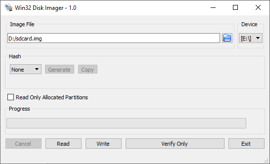
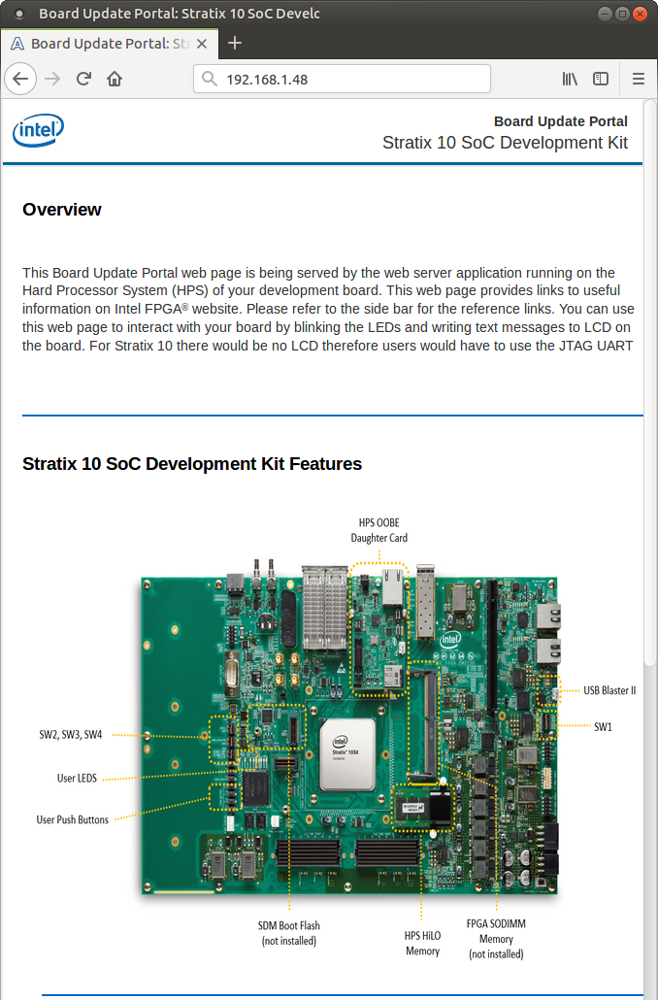
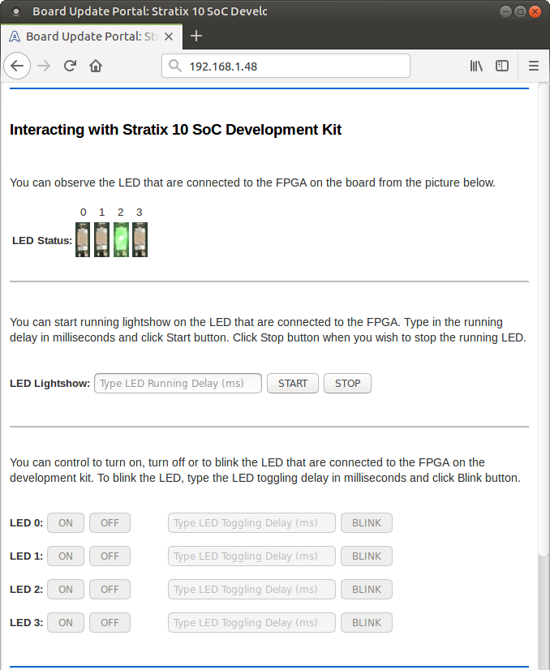
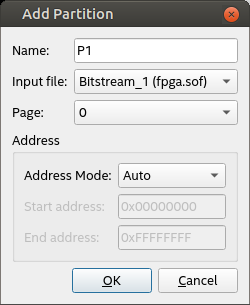

# HPS GSRD User Guide for the Stratix® 10 SX SoC Development Kit

## Overview

The Golden System Reference Design (GSRD) is a reference design running on the [Intel Stratix 10 SX SoC Development Kit](https://www.intel.com/content/www/us/en/products/details/fpga/development-kits/stratix/10-sx.html).

The GSRD is comprised of the following components:

- Golden Hardware Reference Design (GHRD)
- Reference HPS software including:
  - Arm Trusted Firmware
  - U-Boot
  - Linux Kernel
  - Linux Drivers
  - Sample Applications

 <b style="color: red;">Note</b>: This page and associated binaries refers to the current version of the board, with ordering code DK-SOC-1SSX-H-D, aka "H-Tile". There was an older version of this board, ordering code DK-SOC-1SSX-L-D, aka "L-Tile", which is now discontinued. See the previous version of this page [https://altera-fpga.github.io/rel-24.3/embedded-designs/stratix-10/sx/soc/gsrd/ug-gsrd-s10sx-soc/](https://altera-fpga.github.io/rel-24.3/embedded-designs/stratix-10/sx/soc/gsrd/ug-gsrd-s10sx-soc/) for an example on how to build the GSRD for that version of the board.

<b style="color: red;">Note</b>: Refer to the previous version of this page [https://altera-fpga.github.io/rel-24.3/embedded-designs/stratix-10/sx/soc/gsrd/ug-gsrd-s10sx-soc/](https://altera-fpga.github.io/rel-24.3/embedded-designs/stratix-10/sx/soc/gsrd/ug-gsrd-s10sx-soc/) for an example of Partial Reconfiguration (PR).

### Prerequisites

The following are required in order to be able to fully exercise the S10 GSRD:

- Stratix 10 SoC Development Kit, ordering code DK-SOC-1SSX-H-D
  - 4GB DDR4 HILO memory card
  - SD/MMC HPS Daughtercard
  - SDM QSPI Bootcard(MT25QU02G)
  - Mini USB cable for serial output
  - Micro USB cable for on-board Intel FPGA Download Cable II
  - Micro SD card (4GB or greater)

- Host PC with
  - Linux - Ubuntu 22.04 was used to create this page, other versions and distributions may work too
  - Serial terminal (for example Minicom on Linux and TeraTerm or PuTTY on Windows)
  - Micro SD card slot or Micro SD card writer/reader
  - Altera&reg; Quartus<sup>&reg;</sup> Prime Pro Edition Version 25.1
  - Local Ethernet network, with DHCP server (will be used to provide IP address to the board)

### Release Contents

#### Release Notes

The Intel FPGA HPS Embedded Software release notes can be accessed from the following link: [https://github.com/altera-opensource/gsrd-socfpga/releases/tag/QPDS25.1_REL_GSRD_PR](https://github.com/altera-opensource/gsrd-socfpga/releases/tag/QPDS25.1_REL_GSRD_PR)

#### Prebuilt Binaries

<h5>Binaries for SD Card Boot</h5>

The release files are accessible at [https://releases.rocketboards.org/2025.04/gsrd/s10_htile_gsrd/](https://releases.rocketboards.org/2025.04/gsrd/s10_htile_gsrd/)

The source code is also included on the SD card in the Linux rootfs path `/home/root`:

| **File** | **Description** | 
| :-- | :-- | 
| linux-socfpga-v6.12.11-lts-src.tar.gz | Source code for Linux kernel | 
| u-boot-socfpga-v2025.01-src.tar.gz | Source code for U-Boot | 
| arm-trusted-firmware-v2.12.0-src.tar.gz | Source code for Arm Trusted Firmware | 

Before downloading the hardware design please read the agreement in the link [https://www.intel.com/content/www/us/en/programmable/downloads/software/license/lic-prog_lic.html](https://www.intel.com/content/www/us/en/programmable/downloads/software/license/lic-prog_lic.html)

<h5>Binaries for NAND Boot</h5>

The release files are accessible at [https://releases.rocketboards.org/2025.04/nand/s10_htile_nand/](https://releases.rocketboards.org/2025.04/nand/s10_htile_nand/)

<h5>Binaries for QSPI Boot</h5>

The release files are accessible at [https://releases.rocketboards.org/2025.04/qspi/s10_htile_qspi/](https://releases.rocketboards.org/2025.04/qspi/s10_htile_qspi/)

**Note**: To boot from QSPI is needed to remove SD card memory as SD Card memory has higher precedence in the boot order.

#### Component Versions

Altera&reg; Quartus<sup>&reg;</sup> Prime Pro Edition Version 25.1 and the following software component versions are used to build the GSRD: 

| **Component** | **Location** | **Branch** | **Commit ID/Tag** |
| :-- | :-- | :-- | :-- |
| GHRD | [https://github.com/altera-fpga/stratix10-ed-gsrd](https://github.com/altera-fpga/stratix10-ed-gsrd) | master | QPDS25.1_REL_GSRD_PR |
| Linux | [https://github.com/altera-fpga/linux-socfpga](https://github.com/altera-fpga/linux-socfpga) | socfpga-6.12.11-lts | QPDS25.1_REL_GSRD_PR |
| Arm Trusted Firmware | [https://github.com/altera-fpga/arm-trusted-firmware](https://github.com/altera-fpga/arm-trusted-firmware) | socfpga_v2.12.0 | QPDS25.1_REL_GSRD_PR |
| U-Boot | [https://github.com/altera-fpga/u-boot-socfpga](https://github.com/altera-fpga/u-boot-socfpga) | socfpga_v2025.01 | QPDS25.1_REL_GSRD_PR |
| Yocto Project | [https://git.yoctoproject.org/poky](https://git.yoctoproject.org/poky) | styhead | latest |
| Yocto Project: meta-intel-fpga | [https://git.yoctoproject.org/meta-intel-fpga](https://git.yoctoproject.org/meta-intel-fpga) | styhead | latest |
| Yocto Project: meta-intel-fpga-refdes | [https://github.com/altera-fpga/meta-intel-fpga-refdes](https://github.com/altera-fpga/meta-intel-fpga-refdes) | styhead | QPDS25.1_REL_GSRD_PR |

### GHRD Overview

The Golden Hardware Reference Design is an important part of the GSRD and consists of the following components:

- Hard Processor System (HPS)
  - Quad Arm Cortex-A53 MPCore Processor
  - HPS Peripherals connected to Out-of-Box Experience (OOBE) Daughter Card:
    - Micro SD for HPS storage
    - EMAC
    - HPS JTAG debug
    - I2C
    - USB UART
    - USB 2.0 OTG
    - Two Push buttons and Three LEDs

  - Hard Memory Controller (HMC) for HPS External Memory Interface (EMIF)

- FPGA Peripherals connected to Lightweight HPS-to-FPGA (LWH2F) AXI Bridge and JTAG to Avalon Master Bridge
  - Three user LED outputs
  - Four user DIP switch inputs
  - Four user push-button inputs
  - Interrupt Latency Counter
  - System ID

- FPGA Peripherals connected to HPS-to-FPGA (H2F) AXI Bridge
  - 256KB of FPGA on-chip memory

- JTAG to Avalon Master Bridges connected to:
  - FPGA-to-SDRAM 0/1/2 Interfaces
  - FPGA-to-HPS AXI Bridge


The GHRD allows hardware designers to access each peripheral in the FPGA portion of the SoC with System Console, through the JTAG master module. This signal-level access is independent of the driver readiness of each peripheral.

#### MPU Address Maps

This section presents the address maps as seen from the MPU (Cortex-A53) side.

<h5>HPS-to-FPGA Address Map</h5>

The MPU region provide windows of 4 GB into the FPGA slave address space. The lower 1.5 GB of this space is mapped to two separate addresses - firstly from 0x8000_0000 to 0xDFFF_FFFF and secondly from 0x20_0000_0000 to 0x20_5FFF_FFFF. The following table lists the offset of each peripheral from the HPS-to-FPGA bridge in the FPGA portion of the SoC.

| Peripheral | Address Offset | Size (bytes) | Attribute |
| :-- | :-- | :-- | :-- |
| onchip_memory2_0 | 0x0 | 256K | On-chip RAM as scratch pad |

<h5>Lightweight HPS-to-FPGA Address Map</h5>

The the memory map of system peripherals in the FPGA portion of the SoC as viewed by the MPU (Cortex-A53), which starts at the lightweight HPS-to-FPGA base address of **0xF900_0000**, is listed in the following table.

| Peripheral | Address Offset | Size (bytes) | Attribute |
| :-- | :-- | :-- | :-- |
| sysid | 0x0000_0000 | 8 | Unique system ID |
| led_pio | 0x0000_1080 | 16 | LED outputs |
| button_pio | 0x0000_1060 | 16 | Push button inputs |
| dipsw_pio | 0x0000_1070 | 16 | DIP switch inputs |
| ILC | 0x0000_1100 | 256 | Interrupt latency counter (ILC) |

#### JTAG Master Address Map

There are two JTAG master interfaces in the design, one for accessing non-secure peripherals in the FPGA fabric, and another for accessing secure peripheral in the HPS through the FPGA-to-HPS Interface.

The following table lists the address of each peripheral in the FPGA portion of the SoC, as seen through the non-secure JTAG master interface.

| Peripheral | Address Offset | Size (bytes) | Attribute |
| :-- | :-- | :-- | :-- |
| onchip_memory2_0 | 0x0004_0000 | 256K | On-chip RAM |
| sysid | 0x0000_0000 | 8 | Unique system ID |
| led_pio | 0x0000_1080 | 16 | LED outputs |
| button_pio | 0x0000_1060 | 16 | Push button inputs |
| dipsw_pio | 0x0000_1070 | 16 | DIP switch inputs |
| ILC | 0x0000_1100 | 256 | Interrupt latency counter (ILC) |

#### Interrupt Routing

The HPS exposes 64 interrupt inputs for the FPGA logic. The following table lists the interrupt connections from soft IP peripherals to the HPS interrupt input interface.

| Peripheral | Interrupt Number | Attribute |
| :-- | :-- | :-- |
| dipsw_pio | f2h_irq0[0] | 4 DIP switch inputs |
| button_pio | f2h_irq0[1] | 4 Push button inputs |

The interrupt sources are also connected to an interrupt latency counter (ILC) module in the system, which enables System Console to be aware of the interrupt status of each peripheral in the FPGA portion of the SoC.

### Typical HPS Boot Flow

The GSRD boot flow includes the following stages:

1\. SDM

2\. U-Boot SPL

3\. ATF

4\. U-Boot

5\. Linux

6\. Application


The following table presents a short description of the different boot stages:

| Stage | Description |
| :-- | :-- |
| SDM | Secure Device Manager boots first |
| U-Boot SPL | Configures IO, FPGA, brings up SDRAM |
| ATF | Arm Trusted Firmware, provides SMC handler |
| U-Boot | Loads Linux kernel |
| Linux | Operating system |
| Application | User application |

For more information, please refer to [Intel Stratix 10 SoC Boot User Guide](https://www.intel.com/content/dam/www/programmable/us/en/pdfs/literature/ug/ug-s10-soc-boot.pdf) and [Intel Stratix 10 Hard Processor System Technical Reference Manual](https://www.intel.com/content/dam/www/programmable/us/en/pdfs/literature/hb/stratix-10/s10_5v4.pdf) (Booting and Configuration chapter).

## Exercise Prebuilt GSRD

This section presents how to use the prebuilt binaries included with the GSRD release.

The following topics are  included:

* Configure the board and serial terminal
* Boot from SD Card
* Boot from QSPI
* Boot from NAND

Most of the applications and features presented in the Boot from SD Card scenario are also available in the other scenarios.

### Configure Board

This section presents the necessary board settings in order to run the GSRD on the Intel FPGA Stratix 10 SoC development board.


First, confirm the following:

- DDR4 memory card is installed on HPS HiLo memory socket
- OOBE Daughter card is installed on HPS Daughter card socket

Then the board switches need to be configured as follows:

- SW1: OFF-OFF-ON-ON-ON-ON-ON-ON
- SW2: ON-ON-ON (SW2.4 is not connected)
- SW3: All OFF
- SW4: ON-OFF-OFF-ON

### Configure Serial Connection

The OOBE Daughter Card has a built-in FTDI USB to Serial converter chip that allows the host computer to see the board as a virtual serial port. Ubuntu and other modern Linux distributions have built-in drivers for the FTDI USB to Serial converter chip, so no driver installation is necessary on those platforms. On Windows, the SoC EDS Pro installer automatically installs the required drivers if necessary.

The serial communication parameters are:

- Baud-rate: 115,200
- Parity: none
- Flow control: none
- Stop bits: 1

On Windows, utilities such as TeraTerm and PuTTY can be used to connect to the board. They are easily configured from the tool menus.

On Linux, the minicom utility can be used. Here is how to configure it:

The virtual serial port is usually named /dev/ttyUSB0. In order to determine the device name associated with the virtual serial port on your host PC, please perform the following:

- Use the following command to determine which USB serial devices are already installed: ls /dev/ttyUSB*
- Connect mini USB cable from J7 to the PC. This will enable the PC to communicate with the board, even if the board is not powered yet.
- Use the ls /dev/ttyUSB* command command again to determine which new USB serial device appeared.
- Install **minicom** application on host PC, if not installed.

- On Ubuntu, use *sudo apt-get install minicom*
- Configure minicom.

```bash
$ sudo minicom -s
```

Under **Serial Port Setup** choose the following:

- Serial Device: **/dev/ttyUSB0** (edit to match the system as necessary)
- Bps/Par/Bits: **115200 8N1**
- Hardware Flow Control: **No**
- Software Flow Control: **No**
- Hit **[ESC]** to return to the main configuration menu

Select **Save Setup as dfl** to save the default setup. Then select **Exit**.

### Boot from SD Card

This section presents how to write the QSPI Flash and SD Card image files, configure the board and boot Linux.

#### Write QSPI Image

The QSPI JIC image contains the FPGA configuration bitstream, and the U-Boot SPL.

1\. Download and extract the image file:

```bash
wget https://releases.rocketboards.org/2025.04/gsrd/s10_htile_gsrd/ghrd_1sx280hu2f50e1vgas.jic.tar.gz

tar xf ghrd_1sx280hu2f50e1vgas.jic.tar.gz
```

2\. Configure MSEL to JTAG:

- SW2: ON-ON-ON (SW2.4 is not connected)

3\. Power cycle the board

4\. Write the image using the following commands:

```bash
quartus_pgm -c 1 -m jtag -o "pvi;ghrd_1sx280hu2f50e1vgas.jic"
```

5\. Configure MSEL back to QSPI:

- SW2: ON-OFF-OFF (SW2.4 is not connected)

#### Write SD Card Image

This section explains how to create the SD card necessary to boot Linux, using the SD card image available with the pre-built Linux binaries package. Once the SD card has been created, insert the card into the SD slot of the Micro SD daughter card.

<h5>Write SD Card on Linux</h5>

1\. Download the SD card image from [https://releases.rocketboards.org/2025.04/gsrd/s10_htile_gsrd/sdimage.tar.gz](https://releases.rocketboards.org/2025.04/gsrd/s10_htile_gsrd/sdimage.tar.gz) and extract it.

The extacted file is named `gsrd-console-image-stratix10.wic`.

2\. Determine the device associated with the SD card on the host by running the following command before and after inserting the card.

```bash
$ cat /proc/partitions
```

Let's assume it is /dev/sdx.

3\. Use *dd* utility to write the SD image to the SD card.

```bash
$ sudo dd if=gsrd-console-image-stratix10.wic of=/dev/sdx bs=1M
```

Note we are using *sudo* to be able to write to the card.

4\. Use *sync* utility to flush the changes to the SD card.

```bash
$ sudo sync
```

<h5>Write SD Card on Windows</h5>

1\. Download the SD card image from [https://releases.rocketboards.org/2025.04/gsrd/s10_htile_gsrd/sdimage.tar.gz](https://releases.rocketboards.org/2025.04/gsrd/s10_htile_gsrd/sdimage.tar.gz) and extract it.

The extacted file is named `gsrd-console-image-stratix10.wic`.

2\. Rename the wic file as `sdcard.img`

3\. Use Win32DiskImager to write the image to the SD card. The tool can be downloaded from [https://sourceforge.net/projects/win32diskimager/files/latest/download](https://sourceforge.net/projects/win32diskimager/files/latest/download)



#### Boot Linux

This section presents how to boot Linux on the board. The required steps are:

1\. Start serial terminal (when using Minicom it will connect using the selected settings, for others connect manually).

2\. Power up the board.

3\. U-Boot SPL is ran

4\. U-Boot is ran

5\. Linux boots.

6\. Login using 'root' and no password.

7\. Run 'ifconfig' command to determine the IP of the board

```bash
root@stratix10:~# ifconfig
eth0: flags=4163 mtu 1500
 inet 192.168.1.48 netmask 255.255.255.0 broadcast 192.168.1.255
 inet6 fe80::d429:5dff:fe20:d6f4 prefixlen 64 scopeid 0x20
 ether d6:29:5d:20:d6:f4 txqueuelen 1000 (Ethernet)
 RX packets 57 bytes 9330 (9.1 KiB)
 RX errors 0 dropped 0 overruns 0 frame 0
 TX packets 57 bytes 8062 (7.8 KiB)
 TX errors 0 dropped 0 overruns 0 carrier 0 collisions 0
 device interrupt 21 base 0x2000

eth1: flags=4099 mtu 1500
 ether 8a:c5:fe:e4:b5:97 txqueuelen 1000 (Ethernet)
 RX packets 0 bytes 0 (0.0 B)
 RX errors 0 dropped 0 overruns 0 frame 0
 TX packets 0 bytes 0 (0.0 B)
 TX errors 0 dropped 0 overruns 0 carrier 0 collisions 0
 device interrupt 22 base 0xc000

eth2: flags=4099 mtu 1500
 ether 66:fd:43:7f:bc:66 txqueuelen 1000 (Ethernet)
 RX packets 0 bytes 0 (0.0 B)
 RX errors 0 dropped 0 overruns 0 frame 0
 TX packets 0 bytes 0 (0.0 B)
 TX errors 0 dropped 0 overruns 0 carrier 0 collisions 0
 device interrupt 23 base 0xe000

lo: flags=73 mtu 65536
 inet 127.0.0.1 netmask 255.0.0.0
 inet6 ::1 prefixlen 128 scopeid 0x10
 loop txqueuelen 1000 (Local Loopback)
 RX packets 100 bytes 8440 (8.2 KiB)
 RX errors 0 dropped 0 overruns 0 frame 0
 TX packets 100 bytes 8440 (8.2 KiB)
 TX errors 0 dropped 0 overruns 0 carrier 0 collisions 0
```

**Note**: there are three network cards, one connected to the Ethernet port on the HPS Daughtercard, and two to the Ethernet ports on the DevKit, which are connected throgh SGMII.

#### Run Sample Applications

The GSRD includes a number of sample Linux applications that help demonstrate some of the features of the platform:

- Display Hello World message
- Control LEDs
- Detect interrupts from push buttons and DIP switches

The sample applications can be used as a starting point for users to write their own applications that interact with software IP through Linux drivers.

<h5>Prerequisites</h5>

1\. Boot Linux on the target board as described in [Booting Linux](https://www.rocketboards.org/foswiki/Documentation/Stratix10SoCGSRD#BootingLinux). You will not need to use the serial terminal if you plan on using ssh connection.

2\. Connect to the board using one of the following options:

- Connect using serial console, as described in [Booting Linux](https://www.rocketboards.org/foswiki/Documentation/Stratix10SoCGSRD#BootingLinux)
- Connect using ssh, as described in [Connect Using SSH](https://www.rocketboards.org/foswiki/Documentation/Stratix10SoCGSRD#ConnectSSH)

3\. In serial console, or ssh client console, change current folder to be */home/root/intelFPGA*. This is where the application binaries are stored.

```bash
root@stratix10:~# cd /home/root/intelFPGA/
```

<h5>Display Hello World Message</h5>

Run the following command to display the Hello World message on the console:

```bash
root@stratix10:~/intelFPGA# ./hello
Hello SoC FPGA!
```

<h5>Exercise Soft PIO Driver for LED Control</h5>

The following LEDs are exercised:

| User FPGA LED Number | Corresponding Board LED |
| :-- | :-- |
| 0 | D21 |
| 1 | D23 |
| 2 | D25 |

Note: User FPGA LED #3 / D27 is quickly blinking, and cannot be controlled from software.

1\. In order to blink an LED in a loop, with a specific delay in ms, run the following command:

```bash
./blink <led_number> <delay_ms>
```

- The **led_number** specifies the desired LED, and is a value between 0 and 3.
- The **delay_ms** is a number that specifies the desired delay in ms between turning the LED on and off.

2\. In order to turn an individual LED on or off, run the following command:

```bash
./toggle <led_number> <state>
```

- The **led_number** specifies the desired LED, and is a value between 0 and 3.
- The **state** needs to be 0 to turn the LED off, and 1 to turn the LED on.

3\. In order to scroll the FPGA LEDs with a specific delay, please run the following command:

```bash
./scroll_client <delay>
```

The **delay** specifies the desired scrolling behavior:

- **delay > 0** - specify new scrolling delay in ms, and start scrolling
- **delay < 0** - stop scrolling
- **delay = 0** - display current scroll delay

<h5>System Check Application</h5>

System check application provides a glance of system status of basic peripherals such as:

- **USB**: USB device driver
- **Network IP (IPv4)**: Network IP address
- **HPS LEDs**: HPS LED state
- **FPGA LEDs**: FPGA LED state

Run the application by issuing the following command:

```bash
root@stratix10:~/intelFPGA# ./syschk
```

The window will look as shown below - press 'q' to exit:

```bash
 ALTERA SYSTEM CHECK

IPv4 Address : 192.168.1.48 usb1 : DWC OTG Controller

fpga_led2 : OFF serial1@ffc02100 : disabled
hps_led2 : OFF serial0@ffc02000 : okay
fpga_led0 : OFF
hps_led0 : OFF
fpga_led3 : OFF
fpga_led1 : OFF
hps_led1 : OFF
```
#### Register Interrupts

The following are exercised:

- User FPGA DIP switches
  - SW3.1
  - SW3.2
  - SW3.3
  - SW3.4

- User FPGA push buttons
  - 0: S4
  - 1: S5
  - 2: S6
  - 3: S7


In order to register an interrupt handler to a specific GPIO, you will first need to determine the GPIO number used.

1\. Open the Linux Device Tree [socfpga_stratix10_qse_pcie_sgmii_ghrd.dtsi](https://raw.githubusercontent.com/altera-fpga/meta-intel-fpga-refdes/styhead/recipes-bsp/device-tree/files/socfpga_stratix10_qse_sgmii_ghrd.dtsi) file and look up the labels for the DIP switches and Push button GPIOs:

```bash
 button_pio: gpio@f9001060 {
 compatible = "altr,pio-1.0";
 reg = <0xf9001060 0x10>;
 interrupt-parent = <&intc>;
 interrupts = <0 18 4>;
 altr,gpio-bank-width = <4>;
 altr,interrupt-type = <2>;
 altr,interrupt_type = <2>;
 #gpio-cells = <2>;
 gpio-controller;
 };

 dipsw_pio: gpio@f9001070 {
 compatible = "altr,pio-1.0";
 reg = <0xf9001070 0x10>;
 interrupt-parent = <&intc>;
 interrupts = <0 17 4>;
 altr,gpio-bank-width = <4>;
 altr,interrupt-type = <3>;
 altr,interrupt_type = <3>;
 #gpio-cells = <2>;
 gpio-controller;
 };
```

2\. Run the following to determine the GPIO numbers for the DIP switches

```bash
root@stratix10:~/intelFPGA# grep -r "gpio@f9001070" /sys/class/gpio/gpiochip*/label
/sys/class/gpio/gpiochip1928/label:/soc/gpio@f9001070
```

This means that the GPIOs 1928 .. 1931 are allocated to the DIP switches (there are 4 of them).

3\. Run the followinig to determine the GPIO numbers for the pushbuttons

```bash
root@stratix10:~/intelFPGA# grep -r "gpio@f9001060" /sys/class/gpio/gpiochip*/label
/sys/class/gpio/gpiochip1960/label:/soc/gpio@f9001060
```

This means that the GPIOs 1960 … 1963 are allocated to the push buttons (there are 4 of them).

4\. Register interrupt for one of the dipswiches, using the appropriate GPIO number, as determined in a previous step:

```bash
root@stratix10:~/intelFPGA# modprobe gpio_interrupt gpio_number=1928 intr_type=3
[ 1090.973366] Interrupt for GPIO:1928
[ 1090.973366] registered
```

5\. Toggle the dipswitch a few times, you will see messages from the interrupt handler

```bash
[ 1096.537830] Interrupt happened at gpio:1928
[ 1096.547744] Interrupt happened at gpio:1928
[ 1098.736386] Interrupt happened at gpio:1928
[ 1098.740482] Interrupt happened at gpio:1928
```

6\. Remove the driver

```bash
root@stratix10:~/intelFPGA# rmmod gpio_interrupt
```

7\. Register the pushbutton interrupt, using the appropriate GPIO number as determine on a previous step

```bash
rroot@stratix10:~/intelFPGA# modprobe gpio_interrupt gpio_number=1960 intr_type=2
[ 1138.025297] Interrupt for GPIO:1960
[ 1138.025297] registered
```

8\. Push the pusbutton a few times, you will see interrupt handler messages

```bash
[ 1141.672192] Interrupt happened at gpio:1960
[ 1142.110673] Interrupt happened at gpio:1960
[ 1142.499468] Interrupt happened at gpio:1960
[ 1142.884199] Interrupt happened at gpio:1960
```

9\. Once done, remove the handler

```bash
root@stratix10:~/intelFPGA# rmmod gpio_interrupt
```

**Note**: If you are on the ssh console, you will need to run the program *dmesg* after pressing the button in order to see the messages:

```bash
root@stratix10:~/intelFPGA# dmesg
```

#### Connect to Web Server

The GSRD includes a web server running on the target board that can be used to exercise some of the board features:

- Turning LEDs ON and OFF
- Scrolling LEDs in a sequence
- Displaying the current status of the LEDs

The web page served by the web server also contains links to some relevant information on the Intel website.

Perform the following steps to connect to the board web server:

1\. Boot Linux as described in [Booting Linux](https://www.rocketboards.org/foswiki/Documentation/Stratix10SoCGSRD#BootingLinux).

2\. Determine the IP address of the board using 'ifconfig' as shown above. Note there will be three network interfaces, you can use anyone which is connected to the local network and gets an IP from the DHCP server.

Note: There are instances where the DHCP have not assigned an IP to the board before the timeout happens, in which case you may check the IP address via the UART by running *ifconfig*.

3\. Open a web browser on the host PC and type *http://* on the address box, then type the IP of your board and hit Enter.



4\. Scroll the webpage down to the section named **Interacting with Stratix 10 SoC Development Kit**.



You will be able to perform the following actions:

- See which LEDs are ON and which are off in the **LED Status**. Note that if the LEDs are setup to be scrolling, the displayed scrolling speed will not match the actual scrolling speed on the board.
- Stop LEDs from scrolling, by clicking **START** and **STOP** buttons. The delay between LEDs turning ON and OFF is set in the **LED Lightshow** box.
- Turn individual LEDs ON and OFF with the **ON** and **OFF** buttons. Note that this action is only available when the LED scrolling/lightshow is stopped.
- Blink individual LEDs by typing a delay value in ms then clicking the corresponding **BLINK** button. Note that this action is only available when the LED scrolling/lightshow is stopped.

#### Connect Using SSH

1\. The lower bottom of the web page presents instructions on how to connect to the board using an SSH connection.


2\. If the SSH client is not installed on your host computer, you can install it by running the following command on CentOS:

```bash
$ sudo yum install openssh-clients
```

or the following command on Ubuntu:

```bash
$ sudo apt-get install openssh-client
```

3\. Connect to the board, and run some commands, such as **pwd**, **ls** and **uname** to see Linux in action.

```bash
radu@ubuntu:~$ ssh root@192.168.1.48
The authenticity of host '192.168.1.40 (192.168.1.40)' can't be established.
ECDSA key fingerprint is SHA256:fTZa4u/xMgLj7LB0YbeVG0qDumxD2yKCLPsObHqcVXQ.
Are you sure you want to continue connecting (yes/no/[fingerprint])? yes
Warning: Permanently added '192.168.1.40' (ECDSA) to the list of known hosts.
Last login: Wed Jan 25 22:12:53 2023
root@stratix10:~# pwd
/home/root
root@stratix10:~# ls
README linux-socfpga-v5.15.70-lts-src.tar.gz
arm-trusted-firmware-v2.7-src.tar.gz u-boot-socfpga-v2022.07-src.tar.gz
intelFPGA
root@stratix10:~# uname -a
Linux stratix10 5.15.70-altera #1 SMP PREEMPT Thu Dec 15 08:50:33 UTC 2022 aarch64 GNU/Linux
root@stratix10:~#
```

### Boot from QSPI

This section presents how to boot HPS from QSPI. In this scenario, in addition to the initial FPGA configuration bitstream and the HPS FSBL, the QSPI also contains the rest of the HPS software: U-Boot, Linux and Linux rootfs.

#### Write QSPI Image

1\. Configure MSEL to JTAG:

- SW2: ON-ON-ON (SW2.4 is not connected)

2\. Power cycle the board

3\. Retrieve the QSPI image from the prebuilt location:

4\. Write the image using the following commands:

```bash
quartus_pgm -c 1 -m jtag -o "pvi;flash_image.hps.jic"
```

#### Boot Linux

1\. Configure MSEL back to QSPI:

- SW2: ON-OFF-OFF (SW2.4 is not connected)

2\. **Important!** Remove SD card, otherwise U-Boot may try to boot from it.

3\. Power cycle. Board will boot up to Linux prompt, where you can login as 'root' without a password.

**Note**: First time Linux is booted, the UBIFS rootfs will be initialized, the step taking approximately 3 minutes, as shown in the log below:

```bash
[ 12.523260] platform soc:leds: deferred probe pending
 … 3 minute 'gap' here ...
[ 205.105071] UBIFS (ubi0:4): free space fixup complete
[ 205.234501] UBIFS (ubi0:4): UBIFS: mounted UBI device 0, volume 4, name "rootfs"
[ 205.241896] UBIFS (ubi0:4): LEB size: 65408 bytes (63 KiB), min./max. I/O unit sizes: 8 bytes/256 bytes
[ 205.251273] UBIFS (ubi0:4): FS size: 167117440 bytes (159 MiB, 2555 LEBs), max 6500 LEBs, journal size 8650240 bytes (8 MiB, 133 LEBs)
```

On the first boot empty pages are identifies and erased, to ensure all pages are 0xFF and avoid problematic non-0xFF empty page. This is controlled by the "-F" parameter passed when creating the rootfs.ubifs image. The next boots will not have this this step. Refer to http://www.linux-mtd.infradead.org/faq/ubifs.html for more details.

### Boot from NAND

This section presents how to exercise the boot from NAND scenario for the GSRD.

#### NAND Daughtercard

The NAND/eMMC HPS daughtercard that comes with the S10 SoC DevKit supports both NAND and eMMC.

To configure the card for NAND operation, please set the jumpers as shown below:

| Jumper | Setting       |
| :----- | :------------ |
| J2     | unpopulated   |
| J9     | unpopulated   |
| J10    | populated 2-3 |
| J11    | populated 1-1 |

For reference, the NAND/eMMC schematic is available at https://www.intel.com/content/dam/altera-www/global/en_US/support/boards-kits/arria10/soc/hps_io48_nand_dc.pdf.

#### Write NAND Binaries

1\. Copy files to your TFTP server folder:

```bash
cp -f $TOP_FOLDER/gsrd-socfpga/stratix10_htile-gsrd-images/u-boot-stratix10-socdk-gsrd-atf/u-boot.itb<your-tftp-server-folder>
cp -f $TOP_FOLDER/nand-bin/root.ubi <your-tftp-server-folder>
```

2\. Run U-Boot with the debugger, similar to how it is described at [https://rocketboards.org/foswiki/Documentation/BuildingBootloader#Stratix_10_SOC_45_Run_U_45Boot_from_Debugger](https://rocketboards.org/foswiki/Documentation/BuildingBootloader#Stratix_10_SOC_45_Run_U_45Boot_from_Debugger) just change the script to use the binaries directly from `$TOP_FOLDER/gsrd-socfpga/stratix10_htile-gsrd-images/u-boot-stratix10-socdk-gsrd-atf/`.

3\. Stop at U-Boot prompt, and run the following instructions to download and write NAND binaries to flash:

```bash
setenv autoload no
dhcp
setenv serverip <your-tftp-server-ip>

tftp $loadaddr u-boot.itb
nand erase.part u-boot
nand write $loadaddr u-boot $filesize

tftp $loadaddr root.ubi
nand erase.part clean root
nand write.trimffs $loadaddr root $filesize
```

#### Write QSPI Image

1\. Power off board

2\. Set MSEL to JTAG

3\. Power on board

4\. Write jic image to QSPI:

```bash
cd $TOP_FOLDER
quartus_pgm -c 1 -m jtag -o "pvi;ghrd_1sx280hu2f50e1vgas.hps.jic"
```

#### Boot Linux

1\. Power off the board. Make sure MSEL is set to QSPI.

2\. Power on the board.

3\. Linux will boot, use 'root' as username, with no password.

## Rebuild the GSRD

This section presents how to rebuild the GSRD for various scenarios covered by this release.

### Boot from SD Card


#### Build Flow

The following diagram illustrates the full build flow for the GSRD based on source code from GitHub.


The current build flow creates a single boot image which is able to boot in different board configurations (either using OOBE or eMMC/NAND daughter card). For more information about how this single boot image is created, please refer to the following article: https://rocketboards.org/foswiki/Documentation/SingleImageBoot

#### Set up Environment


Create a top folder for this example, as the rest of the commands assume this location:


```bash
sudo rm -rf stratix10_gsrd
mkdir stratix10_gsrd
cd stratix10_gsrd
export TOP_FOLDER=$(pwd)
```


Download the compiler toolchain, add it to the PATH variable, to be used by the GHRD makefile to build the HPS Debug FSBL:


```bash
cd $TOP_FOLDER
wget https://developer.arm.com/-/media/Files/downloads/gnu/11.2-2022.02/binrel/\
gcc-arm-11.2-2022.02-x86_64-aarch64-none-linux-gnu.tar.xz
tar xf gcc-arm-11.2-2022.02-x86_64-aarch64-none-linux-gnu.tar.xz
rm -f gcc-arm-11.2-2022.02-x86_64-aarch64-none-linux-gnu.tar.xz
export PATH=`pwd`/gcc-arm-11.2-2022.02-x86_64-aarch64-none-linux-gnu/bin:$PATH
export ARCH=arm64
export CROSS_COMPILE=aarch64-none-linux-gnu-
```

Enable Quartus tools to be called from command line:


```bash
export QUARTUS_ROOTDIR=~/altera_pro/25.1/quartus/
export PATH=$QUARTUS_ROOTDIR/bin:$QUARTUS_ROOTDIR/linux64:$QUARTUS_ROOTDIR/../qsys/bin:$PATH
```


#### Build Hardware Design


```bash
cd $TOP_FOLDER
rm -rf stratix10-ed-gsrd
wget https://github.com/altera-fpga/stratix10-ed-gsrd/archive/refs/tags/QPDS25.1_REL_GSRD_PR.zip
unzip QPDS25.1_REL_GSRD_PR.zip
rm -f QPDS25.1_REL_GSRD_PR.zip
mv stratix10-ed-gsrd-QPDS25.1_REL_GSRD_PR stratix10-ed-gsrd
cd stratix10-ed-gsrd
make s10-htile-soc-devkit-oobe-baseline-all
cd ..
```


The following files are created in $TOP_FOLDER/s10_soc_devkit_ghrd/output_files:

- `$TOP_FOLDER/stratix10-ed-gsrd/install/designs/s10_htile_soc_devkit_oobe_baseline.sof`: FPGA SOF file, without HPS FSBL
- `$TOP_FOLDER/stratix10-ed-gsrd/install/designs/s10_htile_soc_devkit_oobe_baseline_hps_debug.sof`: FPGA SOF, with HPS Debug FSBL


#### Build Core RBF


Create the Core RBF file to be used in the rootfs created by Yocto by using the HPS Debug SOF built by the GHRD makefile:


```bash
cd $TOP_FOLDER
quartus_pfg -c stratix10-ed-gsrd/install/designs/s10_htile_soc_devkit_oobe_baseline_hps_debug.sof \
 ghrd_1sx280hu2f50e1vgas.jic \
 -o device=MT25QU02G \
 -o flash_loader=1SX280HU2 \
 -o mode=ASX4 \
 -o hps=1
rm ghrd_1sx280hu2f50e1vgas.hps.jic
```


The following files will be created:

- $TOP_FOLDER/ghrd_1sx280hu2f50e1vgas.core.rbf - HPS First configuration bitstream, phase 2: FPGA fabric

Note we are also creating an HPS JIC file, but we are discarding it, as it has the HPS Debug FSBL, while the final image needs to have the U-Boot SPL created by the Yocto recipes.


#### Set Up Yocto

1\. Make sure you have Yocto system requirements met: https://docs.yoctoproject.org/5.0.1/ref-manual/system-requirements.html#supported-linux-distributions.

The command to install the required packages on Ubuntu 22.04 is:

```bash
sudo apt-get update
sudo apt-get upgrade
sudo apt-get install openssh-server mc libgmp3-dev libmpc-dev gawk wget git diffstat unzip texinfo gcc \
build-essential chrpath socat cpio python3 python3-pip python3-pexpect xz-utils debianutils iputils-ping \
python3-git python3-jinja2 libegl1-mesa libsdl1.2-dev pylint xterm python3-subunit mesa-common-dev zstd \
liblz4-tool git fakeroot build-essential ncurses-dev xz-utils libssl-dev bc flex libelf-dev bison xinetd \
tftpd tftp nfs-kernel-server libncurses5 libc6-i386 libstdc++6:i386 libgcc++1:i386 lib32z1 \
device-tree-compiler curl mtd-utils u-boot-tools net-tools swig -y
```

On Ubuntu 22.04 you will also need to point the /bin/sh to /bin/bash, as the default is a link to /bin/dash:

```bash
 sudo ln -sf /bin/bash /bin/sh
```

**Note**: You can also use a Docker container to build the Yocto recipes, refer to https://rocketboards.org/foswiki/Documentation/DockerYoctoBuild for details. When using a Docker container, it does not matter what Linux distribution or packages you have installed on your host, as all dependencies are provided by the Docker container.

2\. Clone the Yocto script and prepare the build:


```bash
cd $TOP_FOLDER
rm -rf gsrd-socfpga
git clone -b QPDS25.1_REL_GSRD_PR https://github.com/altera-fpga/gsrd-socfpga
cd gsrd-socfpga
. stratix10_htile-gsrd-build.sh
build_setup
```


```bash
cd $TOP_FOLDER/gsrd-socfpga
. ./poky/oe-init-build-env stratix10-gsrd-rootfs/
```

#### Customize Yocto

1\. Copy the rebuilt files to `$WORKSPACE/meta-intel-fpga-refdes/recipes-bsp/ghrd/files` using the following names, as expected by the yocto recipes:

- stratix10_htile_gsrd_ghrd.core.rbf
- stratix10_htile_pr_persona0.rbf: not applicable, PR not enabled in this scenario
- stratix10_htile_pr_persona1.rbf: not applicable, PR not enabled in this scenario
- stratix10_htile_nand_ghrd.core.rbf: not applicable, as we have not rebuilt the NAND version

This can be accomplished using the following instructions:


```bash
GHRD_LOC=$WORKSPACE/meta-intel-fpga-refdes/recipes-bsp/ghrd/files
CORE_RBF=$GHRD_LOC/stratix10_htile_gsrd_ghrd.core.rbf
cp $TOP_FOLDER/ghrd_1sx280hu2f50e1vgas.core.rbf $CORE_RBF
```


2\. Update the Yocto recipe at `$WORKSPACE/meta-intel-fpga-refdes/recipes-bsp/ghrd/hw-ref-design.bb` to change the `SRC_URI:stratix10` from the orginal value:

```bash
SRC_URI:stratix10 ?= "\
 ${GHRD_REPO}/stratix10_htile_gsrd_${ARM64_GHRD_CORE_RBF};name=stratix10_htile_gsrd_core \
 ${GHRD_REPO}/stratix10_htile_nand_${ARM64_GHRD_CORE_RBF};name=stratix10_htile_nand_core \
 ${GHRD_REPO}/stratix10_htile_pr_persona0.rbf;name=stratix10_htile_pr_persona0 \
 ${GHRD_REPO}/stratix10_htile_pr_persona1.rbf;name=stratix10_htile_pr_persona1 \
 "
```

to be:

```bash
SRC_URI:stratix10 ?= "\
 file://stratix10_htile_gsrd_ghrd.core.rbf \
 ${GHRD_REPO}/stratix10_htile_nand_${ARM64_GHRD_CORE_RBF};name=stratix10_htile_nand_core \
 ${GHRD_REPO}/stratix10_htile_pr_persona0.rbf;name=stratix10_htile_pr_persona0 \
 ${GHRD_REPO}/stratix10_htile_pr_persona1.rbf;name=stratix10_htile_pr_persona1 \
 "
```

using the following commands from the console:


```bash
OLD_CORE_URI="\${GHRD_REPO}\/stratix10_htile_gsrd_\${ARM64_GHRD_CORE_RBF};name=stratix10_htile_gsrd_core"
NEW_CORE_URI="file:\/\/stratix10_htile_gsrd_ghrd.core.rbf"
RECIPE=$WORKSPACE/meta-intel-fpga-refdes/recipes-bsp/ghrd/hw-ref-design.bb
sed -i "s/$OLD_CORE_URI/$NEW_CORE_URI/g" $RECIPE
```


Note we have left the PR and NAND files alone, that will be downloaded from rocketboards.

3\. Update the same Yocto recipe to change the SHA checksums for the new files:

```bash
SRC_URI[stratix10_htile_gsrd_core.sha256sum] = "ea26a77ebc1b3141193de6dd32e22f332785e05c956de85118c3790392141d3c"
```

to the new values using the following commands:


```bash
CORE_SHA=$(sha256sum $CORE_RBF | cut -f1 -d" ")
OLD_CORE_SHA="SRC_URI\[stratix10_htile_gsrd_core\.sha256sum\] = .*"
NEW_CORE_SHA="SRC_URI[stratix10_htile_gsrd_core.sha256sum] = \"$CORE_SHA\""
sed -i "s/$OLD_CORE_SHA/$NEW_CORE_SHA/g" $RECIPE
```


4\. Optionally change the following files in `$WORKSPACE/meta-intel-fpga-refdes/recipes-bsp/u-boot/files/`:

- [uboot.txt](https://github.com/altera-fpga/meta-intel-fpga-refdes/blob/master/recipes-bsp/u-boot/files/uboot.txt) - distroboot script
- [uboot_script.its](https://github.com/altera-fpga/meta-intel-fpga-refdes/blob/master/recipes-bsp/u-boot/files/uboot_script.its) - its file for creating FIT image from the above script

5\. Optionally change the following file in `$WORKSPACE/meta-intel-fpga-refdes/recipes-kernel/linux/linux-socfpga-lts`:

- fit_kernel_stratix10.its - its file for creating the kernel.itb image, containing by default:

  - Kernel
  - Device trees for SD and NAND board configurations
  - Core RBF files for SD and NAND board configurations
  - Board configurations for SD and NAND cases

#### Build Yocto

Build Yocto:


```bash
bitbake_image
```


Gather files:


```bash
package
```


Once the build is completed successfully, you will see the following two folders are created:

- `stratix10_htile_gsrd_rootfs`: area used by OpenEmbedded build system for builds. Description of build directory structure - https://docs.yoctoproject.org/ref-manual/structure.html#the-build-directory-build
- `stratix10_htile_gsrd_images`: the build script copies here relevant files built by Yocto from the `stratix10_htile_gsrd_rootfs/tmp/deploy/images/agilex` folder, but also other relevant files.

The two most relevant files created in the `$TOP_FOLDER/gsrd-socfpga/stratix10_htile-gsrd-images` folder are:

| File | Description |
| :-- | :-- |
| sdimage.tar.gz | SD Card Image |
| u-boot-stratix10-socdk-gsrd-atf/u-boot-spl-dtb.hex | U-Boot SPL Hex file |


#### Create QSPI Image


The QSPI image will contain the FPGA configuration data and the HPS FSBL and it can be built using the following command:


```bash
cd $TOP_FOLDER
quartus_pfg -c stratix10-ed-gsrd/install/designs/s10_htile_soc_devkit_oobe_baseline.sof \
 ghrd_1sx280hu2f50e1vgas.jic \
 -o device=MT25QU02G \
 -o flash_loader=1SX280HU2 \
 -o hps_path=gsrd-socfpga/stratix10_htile-gsrd-images/u-boot-stratix10-socdk-gsrd-atf/u-boot-spl-dtb.hex \
 -o mode=ASX4 \
 -o hps=1
```


The following files will be created:

- $TOP_FOLDER/ghrd_1sx280hu2f50e1vgas.hps.jic - Flash image for HPS First configuration bitstream, phase 1: HPS and DDR
- $TOP_FOLDER/ghrd_1sx280hu2f50e1vgas.core.rbf - HPS First configuration bitstream, phase 2: FPGA fabric. We already have the same file on the SD card.


### Boot from QSPI


This section presents how to boot the Stratix 10 SoC from QSPI, using the rebuilt GSRD binaries.

The same binaries as when booting from SD card can be used to boot from QSPI, because:

- The QSPI resides on the DevKit board, and not on the HPS daughtercard, so there are no board changes:
 - The same GHRD configuration can be used
 - The same U-Boot devce tree can be used
 - The same Linux device tree can be used
- U-Boot uses distroboot, which will try first booting from SD/MMC, then from QSPI, then from NAND, so the same U-Boot can be used.

**Note**: As the QSPI has a much smaller size than the SD card (256MB vs 2GB) the rootfs is smaller, and less functionality is provided. The purpose of this section is just to show Linux booting.

**Note**: The HPS speed for accessing SDM QSPI is limited to ~4MB/s. It is up to you to decide whether this level of performance is sufficient for your application. If not, it is recommended you use an SD card or eMMC device to store the HPS components such as the rootfs. Note that the QSPI speed limitation does not apply when SDM accesses the QSPI, it is just for HPS accessing SDM QSPI.

#### QSPI Flash Layout

<table>
  <thead>
    <tr><th>MTD Partition</th><th>UBI Volume</th><th>Volume Name</th><th>Type</th><th>Image/File</th><th>Size</th></tr>
  </thead>
  <tbody>
    <tr><td rowspan="2">0 (bitstream &amp; uboot)</td><td>N/A</td><td>N/A</td><td>RAW</td><td>bitstream (FPGA image, SDM firmware)</td><td>64MB</td></tr>
    <tr><td>N/A</td><td>N/A</td><td>RAW</td><td>u-boot.itb</td><td>2MB</td></tr>
    <tr><td rowspan="5">1 (root.ubi)</td><td>0</td><td>env</td><td>UBI</td><td>u-boot.env</td><td>256KB</td></tr>
    <tr><td>1</td><td>script</td><td>UBI</td><td>u-boot.scr</td><td>128KB</td></tr>
    <tr><td>2</td><td>kernel</td><td>UBI</td><td>kernel.itb</td><td>24MB</td></tr>
    <tr><td>3</td><td>dtb</td><td>UBI</td><td>kernel.dtb</td><td>256KB</td></tr>
    <tr><td>4</td><td>rootfs</td><td>UBIFS</td><td>rootfs.ubifs</td><td>160MB</td></tr>
  </tbody>
</table>

#### Create QSPI Image

1\. Create a folder to contain all the qspi binaries, and create symlinks to actual location for all files:


```bash
cd $TOP_FOLDER
rm -rf qspi-boot && mkdir qspi-boot && cd qspi-boot
ln -s $TOP_FOLDER/stratix10-ed-gsrd/install/designs/s10_htile_soc_devkit_oobe_baseline.sof fpga.sof
ln -s $TOP_FOLDER/gsrd-socfpga/stratix10_htile-gsrd-images/u-boot-stratix10-socdk-gsrd-atf/u-boot-spl-dtb.hex spl.hex
ln -s $TOP_FOLDER/gsrd-socfpga/stratix10_htile-gsrd-images/u-boot-stratix10-socdk-gsrd-atf/boot.scr.uimg .
ln -s $TOP_FOLDER/gsrd-socfpga/stratix10_htile-gsrd-images/kernel.itb .
ln -s $TOP_FOLDER/gsrd-socfpga/stratix10_htile-gsrd-images/console-image-minimal-stratix10_nor.ubifs rootfs.ubifs
```


2\. Create U-Boot image:


```bash
cd $TOP_FOLDER/qspi-boot
cp $TOP_FOLDER/gsrd-socfpga/stratix10_htile-gsrd-images/u-boot-stratix10-socdk-gsrd-atf/u-boot.itb .
uboot_part_size=2*1024*1024
uboot_size=`wc -c < u-boot.itb`
uboot_pad="$((uboot_part_size-uboot_size))"
truncate -s +$uboot_pad u-boot.itb
mv u-boot.itb u-boot.bin
```


4\. Create hps.ubi file:


```bash
cd $TOP_FOLDER/qspi-boot
cat <<EOT >ubinize.cfg
[env]
mode=ubi
vol_id=0
vol_name=env
vol_size=256KiB
vol_type=dynamic

[script]
mode=ubi
image=boot.scr.uimg
vol_id=1
vol_name=script
vol_size=128KiB
vol_type=dynamic

[kernel]
mode=ubi
image=kernel.itb
vol_id=2
vol_name=kernel
vol_size=24MiB
vol_type=dynamic

[dtb]
mode=ubi
vol_id=3
vol_name=dtb
vol_size=256KiB
vol_type=dynamic

[rootfs]
mode=ubi
image=rootfs.ubifs
vol_id=4
vol_name=rootfs
vol_type=dynamic
vol_size=160MiB
vol_flag=autoresize

EOT
ubinize -o root.ubi -p 65536 -m 1 -s 1 ubinize.cfg
ln -s root.ubi hps.bin
```


5\. Create the QSPI image using the provided Quartus Programming File Generator (PFG) file:


```bash
cd $TOP_FOLDER/qspi-boot
wget https://altera-fpga.github.io/rel-25.1/embedded-designs/stratix-10/sx/soc/gsrd/collateral/stratix10_gsrd.pfg
quartus_pfg -c stratix10_gsrd.pfg
```


The following files will be generated:

- $TOP_FOLDER/qspi-boot/flash_image.hps.jic - JIC QSPI flash image
- $TOP_FOLDER/qspi-boot/s10_flash_image.core.rbf - fabric configuration file, already generated previously with the debug HPS FSBL


#### Create Programming File Generator File

This section presents how to manually re-create the PFG file provided at [https://altera-fpga.github.io/rel-25.1/embedded-designs/stratix-10/sx/soc/gsrd/collateral/stratix10_gsrd.pfg](https://altera-fpga.github.io/rel-25.1/embedded-designs/stratix-10/sx/soc/gsrd/collateral/stratix10_gsrd.pfg)

1\. Start Quartus Programming File Generator GUI:

```bash
cd $TOP_FOLDER/qspi-boot
qpfgw &
```

2\. In PFG **Output Files** tab:

- Select **Device Family** as "Stratix 10"
- Select **Configuration Mode** as "Active Serial x4"
- Edit **Name** as "flash_image"
- Check **Raw Binary File for HPS Core Configuration (.rbf)** option
- Check the following sub-options:
 - Check **JTAG Indirect Configuration File (.jic)**
 - Check **Memory Map File (.map)**


3\. In PFG **Input Files** tab:

- Click **Add Bitstream", then browse to "fpga.sof" link, and add click \*Open** to add it.
- Click **Bitstream_1>fpga.sof** then click **Properties** the click **HPS Bootloader**, browse to "spl.hex" then click **Open** to add it.
 Note: By the time the fpga.sof file is read the following error is displayed, this was addressed by adding the spl.hex file to the Bitstream:
  File fpga.sof is incomplete- HPS is present but bootloader information is missing.
- Click **Add Raw Data** then change the extension filter to **.bin** then browse to "u-boot.bin" and click **Open** to add it.
- Click on the "u-boot.bin" then click "*Properties*" then select **Bit swap** option to "On"
- Repeat the above 2 steps for the following file:
 - hps.bin

The **Input Files** tab will now look something like this:


4\. In the PFG **Configuration Device** tab:

- Click **Add Device**, select the Micron MT25QU02G device then click **Add**
- Click the **MT25QU02G** device, then click **Add Partition**, select the options as following then click **OK**:



- Click the **MT25QU02G** device, then click **Add Partition**, select the options as following then click **OK**:


- Repeat the above step for the rest of binary files, choosing the following offsets:
 - hps: 0x04200000
- Click **Flash Loader** > **Select** then browse to the device used on the devkit then click **OK**:


The **Configuration Device** tab will now look something like this:


3\. Go to **File** > **Save As** and save the configuration file as "s10_flash_image_qspi.pfg".

4\. [Optional] Open the file "stratix10_gsrd.pfg" with a text editor and change absolute paths to relative paths.

The file will look like this:

```xml
<pfg version="1">
    <settings custom_db_dir="./" mode="ASX4"/>
    <output_files>
        <output_file name="flash_image" hps="1" directory="./" type="PERIPH_JIC">
            <file_options/>
            <secondary_file type="MAP" name="flash_image_jic">
                <file_options/>
            </secondary_file>
            <flash_device_id>Flash_Device_1</flash_device_id>
        </output_file>
    </output_files>
    <bitstreams>
        <bitstream id="Bitstream_1">
            <path signing="OFF" finalize_encryption="0" hps_path="spl.hex">fpga.sof</path>
        </bitstream>
    </bitstreams>
    <raw_files>
        <raw_file bitswap="1" type="RBF" id="Raw_File_1">u-boot.bin</raw_file>
        <raw_file bitswap="1" type="RBF" id="Raw_File_2">hps.bin</raw_file>
    </raw_files>
    <flash_devices>
        <flash_device type="MT25QU02G" id="Flash_Device_1">
            <partition reserved="1" fixed_s_addr="1" s_addr="0x00000000" e_addr="0x000FFFFF" fixed_e_addr="1" id="BOOT_INFO" size="0"/>
            <partition reserved="0" fixed_s_addr="0" s_addr="auto" e_addr="auto" fixed_e_addr="0" id="P1" size="0"/>
            <partition reserved="0" fixed_s_addr="0" s_addr="0x04000000" e_addr="auto" fixed_e_addr="0" id="u-boot" size="0"/>
            <partition reserved="0" fixed_s_addr="0" s_addr="0x04200000" e_addr="auto" fixed_e_addr="0" id="hps" size="0"/>
        </flash_device>
        <flash_loader>1SX280HU2</flash_loader>
    </flash_devices>
    <assignments>
        <assignment page="0" partition_id="P1">
            <bitstream_id>Bitstream_1</bitstream_id>
        </assignment>
        <assignment page="0" partition_id="u-boot">
            <raw_file_id>Raw_File_1</raw_file_id>
        </assignment>
        <assignment page="0" partition_id="hps">
            <raw_file_id>Raw_File_2</raw_file_id>
        </assignment>
    </assignments>
</pfg>


```


### Boot from NAND


This section presents how to boot the Stratix 10 SoC from NAND, including how to build all binaries.

Build instructions are the same as for standard SD or QSPI boot. The U-Boot, ATF and Linux binaries are all the same. The only differences are:

- GHRD is configured for the NAND HPS Daughtercard, then recompiled
- The PR persona.rbf files are the ones compiled by the GHRD configured for NAND

**Note**: As the NAND used on the devkit has a smaller size than the SD card (1GB vs 2GB) the rootfs is smaller, and less functionality is provided. The purpose of this section is just to show Linux booting.

#### NAND Flash Layout

<table>
  <thead>
    <tr><th>MTD Partition</th><th>UBI Volume</th><th>Volume Name</th><th>Type</th><th>Image/File</th><th>Flash Offset</th><th>Size</th><th>Size in Hex</th></tr>
  </thead>
  <tbody>
    <tr><td rowspan="1">0 (u-boot)</td><td>N/A</td><td>N/A</td><td>RAW</td><td>u-boot.itb</td><td>0x00000000</td><td>2MB</td><td>0x00200000</td></tr>
    <tr><td rowspan="5">1 (root.ubi)</td><td>0</td><td>env</td><td>UBI</td><td>u-boot.env</td><td>0x00200000</td><td>256KB</td><td>0x40000</td></tr>
    <tr><td>1</td><td>script</td><td>UBI</td><td>u-boot.scr</td><td>0x00240000</td><td>128KB</td><td>0x0020000</td></tr>
    <tr><td>2</td><td>kernel</td><td>UBI</td><td>kernel.itb</td><td>0x00260000 onwards</td><td>64MB</td><td>0x04000000</td></tr>
    <tr><td>3</td><td>dtb</td><td>UBI</td><td>kernel.dtb</td><td></td><td>256KB</td><td>0x0004000</td></tr>
    <tr><td>4</td><td>rootfs</td><td>UBIFS</td><td>rootfs.ubifs</td><td></td><td>&lt;957MB</td><td>&lt;0x3BD70000</td></tr>
  </tbody>
</table>

#### Set up Environment


Create a top folder for this example, as the rest of the commands assume this location:


```bash
sudo rm -rf stratix10_gsrd.nand
mkdir stratix10_gsrd.nand
cd stratix10_gsrd.nand
export TOP_FOLDER=$(pwd)
```


Download the compiler toolchain, add it to the PATH variable, to be used by the GHRD makefile to build the HPS Debug FSBL:


```bash
cd $TOP_FOLDER
wget https://developer.arm.com/-/media/Files/downloads/gnu/11.2-2022.02/binrel/\
gcc-arm-11.2-2022.02-x86_64-aarch64-none-linux-gnu.tar.xz
tar xf gcc-arm-11.2-2022.02-x86_64-aarch64-none-linux-gnu.tar.xz
rm -f gcc-arm-11.2-2022.02-x86_64-aarch64-none-linux-gnu.tar.xz
export PATH=`pwd`/gcc-arm-11.2-2022.02-x86_64-aarch64-none-linux-gnu/bin:$PATH
export ARCH=arm64
export CROSS_COMPILE=aarch64-none-linux-gnu-
```

Enable Quartus tools to be called from command line:


```bash
export QUARTUS_ROOTDIR=~/altera_pro/25.1/quartus/
export PATH=$QUARTUS_ROOTDIR/bin:$QUARTUS_ROOTDIR/linux64:$QUARTUS_ROOTDIR/../qsys/bin:$PATH
```


#### Build Hardware Design


Build the GHRD targeting the NAND HPS daughtercard, by passing the correct parameter to the make utility:


```bash
cd $TOP_FOLDER
rm -rf stratix10-ed-gsrd
wget https://github.com/altera-fpga/stratix10-ed-gsrd/archive/refs/tags/QPDS25.1_REL_GSRD_PR.zip
unzip QPDS25.1_REL_GSRD_PR.zip
rm -f QPDS25.1_REL_GSRD_PR.zip
mv stratix10-ed-gsrd-QPDS25.1_REL_GSRD_PR stratix10-ed-gsrd
cd stratix10-ed-gsrd
make s10-htile-soc-devkit-nand-baseline-all  
cd ..
```


The following files are created in $TOP_FOLDER/s10_soc_devkit_ghrd/output_files:

- `$TOP_FOLDER/stratix10-ed-gsrd/install/designs/s10_htile_soc_devkit_nand_baseline.sof`: FPGA SOF file, without HPS FSBL
- `$TOP_FOLDER/stratix10-ed-gsrd/install/designs/s10_htile_soc_devkit_nand_baseline_hps_debug.sof`: FPGA SOF, with HPS Debug FSBL


#### Build Core RBF


Create the Core RBF file to be used in the rootfs created by Yocto by using the HPS Debug SOF built by the GHRD makefile:


```bash
cd $TOP_FOLDER
quartus_pfg -c stratix10-ed-gsrd/install/designs/s10_htile_soc_devkit_nand_baseline_hps_debug.sof \
 ghrd_1sx280hu2f50e1vgas.jic \
 -o device=MT25QU02G \
 -o flash_loader=1SX280HU2 \
 -o mode=ASX4 \
 -o hps=1
rm ghrd_1sx280hu2f50e1vgas.hps.jic
```


The following files will be created:

- `$TOP_FOLDER/ghrd_1sx280hu2f50e1vgas.core.rbf` - HPS First configuration bitstream, phase 2: FPGA fabric

Note we are also creating an HPS JIC file, but we are discarding it, as it has the HPS Debug FSBL, while the final image needs to have the U-Boot SPL created by the Yocto recipes.


#### Set Up Yocto
1\. Make sure you have Yocto system requirements met: https://docs.yoctoproject.org/5.0.1/ref-manual/system-requirements.html#supported-linux-distributions.

The command to install the required packages on Ubuntu 22.04 is:

```bash
sudo apt-get update
sudo apt-get upgrade
sudo apt-get install openssh-server mc libgmp3-dev libmpc-dev gawk wget git diffstat unzip texinfo gcc \
build-essential chrpath socat cpio python3 python3-pip python3-pexpect xz-utils debianutils iputils-ping \
python3-git python3-jinja2 libegl1-mesa libsdl1.2-dev pylint xterm python3-subunit mesa-common-dev zstd \
liblz4-tool git fakeroot build-essential ncurses-dev xz-utils libssl-dev bc flex libelf-dev bison xinetd \
tftpd tftp nfs-kernel-server libncurses5 libc6-i386 libstdc++6:i386 libgcc++1:i386 lib32z1 \
device-tree-compiler curl mtd-utils u-boot-tools net-tools swig -y
```

On Ubuntu 22.04 you will also need to point the /bin/sh to /bin/bash, as the default is a link to /bin/dash:

```bash
 sudo ln -sf /bin/bash /bin/sh
```

**Note**: You can also use a Docker container to build the Yocto recipes, refer to https://rocketboards.org/foswiki/Documentation/DockerYoctoBuild for details. When using a Docker container, it does not matter what Linux distribution or packages you have installed on your host, as all dependencies are provided by the Docker container.

2\. Clone the Yocto script and prepare the build:


```bash
cd $TOP_FOLDER
rm -rf gsrd-socfpga
git clone -b QPDS25.1_REL_GSRD_PR https://github.com/altera-fpga/gsrd-socfpga
cd gsrd-socfpga
. stratix10_htile-gsrd-build.sh
build_setup
```


**Note**: Run the following commands to set up again the yocto build environments, if you closed the current window (for example when rebooting the Linux host) and want to resume the next steps:

```bash
cd $TOP_FOLDER/gsrd-socfpga
. ./poky/oe-init-build-env stratix10-gsrd-rootfs/
```

#### Customize Yocto

1\. Copy the rebuilt files to `$WORKSPACE/meta-intel-fpga-refdes/recipes-bsp/ghrd/files` using the following names, as expected by the yocto recipes:

- stratix10_htile_gsrd_ghrd.core.rbf: not applicable, as we have not rebuilt the standard GSRD version supporting SD card in this case
- stratix10_htile_pr_persona0.rbf: not applicable, PR not enabled in this scenario
- stratix10_htile_pr_persona1.rbf: not applicable, PR not enabled in this scenario
- stratix10_htile_nand_ghrd.core.rbf

This can be accomplished using the following instructions:


```bash
GHRD_LOC=$WORKSPACE/meta-intel-fpga-refdes/recipes-bsp/ghrd/files
CORE_RBF=$GHRD_LOC/stratix10_htile_nand_ghrd.core.rbf
cp $TOP_FOLDER/ghrd_1sx280hu2f50e1vgas.core.rbf $CORE_RBF
```


2\. Update the Yocto recipe at `$WORKSPACE/meta-intel-fpga-refdes/recipes-bsp/ghrd/hw-ref-design.bb` to change the `SRC_URI:stratix10` from the orginal value:

```bash
SRC_URI:stratix10 ?= "\
 ${GHRD_REPO}/stratix10_htile_gsrd_${ARM64_GHRD_CORE_RBF};name=stratix10_htile_gsrd_core \
 ${GHRD_REPO}/stratix10_htile_nand_${ARM64_GHRD_CORE_RBF};name=stratix10_htile_nand_core \
 ${GHRD_REPO}/stratix10_htile_pr_persona0.rbf;name=stratix10_htile_pr_persona0 \
 ${GHRD_REPO}/stratix10_htile_pr_persona1.rbf;name=stratix10_htile_pr_persona1 \
 "
```

to be:

```bash
SRC_URI:stratix10 ?= "\
 ${GHRD_REPO}/stratix10_htile_gsrd_${ARM64_GHRD_CORE_RBF};name=stratix10_htile_gsrd_core \
 file://stratix10_htile_nand_ghrd.core.rbf \
 ${GHRD_REPO}/stratix10_htile_pr_persona0.rbf;name=stratix10_htile_pr_persona0 \
 ${GHRD_REPO}/stratix10_htile_pr_persona1.rbf;name=stratix10_htile_pr_persona1 \
 "
```

using the following commands from the console:


```bash
OLD_CORE_URI="\${GHRD_REPO}\/stratix10_htile_nand_\${ARM64_GHRD_CORE_RBF};name=stratix10_htile_nand_core"
NEW_CORE_URI="file:\/\/stratix10_htile_nand_ghrd.core.rbf"
RECIPE=$WORKSPACE/meta-intel-fpga-refdes/recipes-bsp/ghrd/hw-ref-design.bb
sed -i "s/$OLD_CORE_URI/$NEW_CORE_URI/g" $RECIPE
```


Note we have left the NAND file alone, that will be downloaded from rocketboards.

3\. Update the same Yocto recipe to change the SHA checksums for the new files:

```bash
SRC_URI[stratix10_htile_gsrd_core.sha256sum] = "ea26a77ebc1b3141193de6dd32e22f332785e05c956de85118c3790392141d3c"
SRC_URI[stratix10_htile_nand_core.sha256sum] = "d782c05085f8f13cb792b687fd002773e0897e4d7ecf5451994b1823d62cdc92"
```

to the new values using the following commands:


```bash
CORE_SHA=$(sha256sum $CORE_RBF | cut -f1 -d" ")
OLD_CORE_SHA="SRC_URI\[stratix10_htile_nand_core\.sha256sum\] = .*"
NEW_CORE_SHA="SRC_URI[stratix10_htile_nand_core.sha256sum] = \"$CORE_SHA\""
sed -i "s/$OLD_CORE_SHA/$NEW_CORE_SHA/g" $RECIPE
```


4\. Optionally change the following files in `$WORKSPACE/meta-intel-fpga-refdes/recipes-bsp/u-boot/files/`:

- [uboot.txt](https://github.com/altera-fpga/meta-intel-fpga-refdes/blob/master/recipes-bsp/u-boot/files/uboot.txt) - distroboot script
- [uboot_script.its](https://github.com/altera-fpga/meta-intel-fpga-refdes/blob/master/recipes-bsp/u-boot/files/uboot_script.its) - its file for creating FIT image from the above script

5\. Optionally change the following file in `$WORKSPACE/meta-intel-fpga-refdes/recipes-kernel/linux/linux-socfpga-lts`:

- fit_kernel_stratix10.its - its file for creating the kernel.itb image, containing by default:

  - Kernel
  - Device trees for SD and NAND board configurations
  - Core RBF files for SD and NAND board configurations
  - Board configurations for SD and NAND cases

#### Build Yocto

Build Yocto:


```bash
bitbake_image
```


Gather files:


```bash
package
```


Once the build is completed successfully, you will see the following two folders are created:

- `stratix10_htile_gsrd_rootfs`: area used by OpenEmbedded build system for builds. Description of build directory structure - https://docs.yoctoproject.org/ref-manual/structure.html#the-build-directory-build
- `stratix10_htile_gsrd_images`: the build script copies here relevant files built by Yocto from the `stratix10_htile_gsrd_rootfs/tmp/deploy/images/agilex` folder, but also other relevant files.

The two most relevant files created in the `$TOP_FOLDER/gsrd-socfpga/stratix10_htile-gsrd-images` folder are:

| File | Description |
| :-- | :-- |
| gsrd-console-image-stratix10_htile_nand.ubifs | UBI root partition image |
| u-boot-stratix10-socdk-gsrd-atf/u-boot.itb | U-Boot FIT image |
| u-boot-stratix10-socdk-gsrd-atf/u-boot-spl-dtb.hex | U-Boot SPL Hex file |


#### Create QSPI Image


The QSPI image will contain the FPGA configuration data and the HPS FSBL and it can be built using the following command:


```bash
cd $TOP_FOLDER
quartus_pfg -c stratix10-ed-gsrd/install/designs/s10_htile_soc_devkit_nand_baseline.sof \
 ghrd_1sx280hu2f50e1vgas.jic \
 -o device=MT25QU02G \
 -o flash_loader=1SX280HU2 \
 -o hps_path=gsrd-socfpga/stratix10_htile-gsrd-images/u-boot-stratix10-socdk-gsrd-atf/u-boot-spl-dtb.hex \
 -o mode=ASX4 \
 -o hps=1
```


The following files will be created:

- $TOP_FOLDER/ghrd_1sx280hu2f50e1vgas.hps.jic - Flash image for HPS First configuration bitstream, phase 1: HPS and DDR
- $TOP_FOLDER/ghrd_1sx280hu2f50e1vgas.core.rbf - HPS First configuration bitstream, phase 2: FPGA fabric. We already have the same file on the SD card.


#### Build NAND Binaries


1\. Gather the files into a single folder, using symlinks:


```bash
cd $TOP_FOLDER
rm -rf nand-bin && mkdir nand-bin && cd nand-bin
ln -s $TOP_FOLDER/gsrd-socfpga/stratix10_htile-gsrd-images/u-boot-stratix10-socdk-gsrd-atf/boot.scr.uimg .
ln -s $TOP_FOLDER/gsrd-socfpga/stratix10_htile-gsrd-images/kernel.itb .
ln -s $TOP_FOLDER/gsrd-socfpga/stratix10_htile-gsrd-images/gsrd-console-image-stratix10_nand.ubifs rootfs.ubifs
ln -s $TOP_FOLDER/gsrd-socfpga/stratix10_htile-gsrd-images/socfpga_stratix10_socdk_nand.dtb .
```


2\. Install `mtd-tools` if not already installed. On Ubuntu the command is:

```bash
sudo apt-get install mtd-tools
```

3\. Create UBI configuration file for the root partition;


```bash
cat <<EOT >ubinize.cfg
[env]
mode=ubi
vol_id=0
vol_name=env
vol_size=256KiB
vol_type=dynamic

[script]
mode=ubi
image=boot.scr.uimg
vol_id=1
vol_name=script
vol_size=128KiB
vol_type=dynamic

[kernel]
mode=ubi
image=kernel.itb
vol_id=2
vol_name=kernel
vol_size=64MiB
vol_type=dynamic

[dtb]
mode=ubi
image=socfpga_stratix10_socdk_nand.dtb
vol_id=3
vol_name=dtb
vol_size=256KiB
vol_type=dynamic

[rootfs]
mode=ubi
image=rootfs.ubifs
vol_id=4
vol_name=rootfs
vol_type=dynamic
vol_size=400MiB
vol_flag=autoresizeENDCOLOR%
EOT
```


4\. Create the `root.ubi` file:


```bash
ubinize -o root.ubi -p 128KiB -m 2048 -s 2048 ubinize.cfg
```


This is what the above parameters mean:

- -p: physical eraseblock size of the flash
- -m: minimum input/output unit size of the flash
- -s: sub-pages and sub-page size, ubinize will take into account and put the VID header to same NAND page as the EC header

The following file is created:

- $TOP_FOLDER/nand-bin/root.ubi


### How to Manually Update the kernel.itb file


The **kernel.itb** file is a Flattattened Image Tree (FIT) file that includes the following components:

* Linux kernel.
* Several board configurations that indicate what components from the **kernel.itb** (Linux kernel, device tree and 2nd Phase fabric design) should be used for a specific board.
* Linux device tree*.
* 2nd Phase Fabric Design*.

 \* One or more of these components to support the different board configurations.

The **kernel.itb** is created from a **.its** (Image Tree Source file) that describes its structure. In the GSRD, the  **kernel.itb** file is located in the following directory, where you can find also all the components needed to create it, including the .its file:

* **$TOP_FOLDER/gsrd-socfpga/<*device-devkit*>-gsrd-rootfs/tmp/work/<*device-devkit*>-poky-linux/linux-socfpga-lts/<*linux branch*>+git/linux-<*device devkit*>-standard-build/**

If you want to modify the kernel.itb by replacing one of the component or modifying any board configuration, you can do the following:

1. Install **mtools** package in your Linux machine.
   ```bash
   $ sudo apt update
   $ sudo apt install mtools
   ```
   
2. Go to the in which the **kernel.itb** is being created under the GSRD.
   ```bash
   $ cd $TOP_FOLDER/gsrd-socfpga/<device-devkit>-gsrd-rootfs/tmp/work/<device-devkit>-poky-linux/linux-socfpga-lts/<linux branch>+git/linux-<device-devkit>-standard-build/
   $ ls *.its
   fit_kernel_<device-devkit>.its
   ```
   
3. In the .its file, observe the components that integrates the kernel.itb identifying the nodes as indicated next:

   **images** node:<br>
   - **kernel** node - Linux kernel defined with the **data** parameter in the node.<br>
   - **fdt-X** node    - Device tree X defined with the **data** parameter in the node.<br>
   - **fpga-X** node -  2nd Phase FPGA Configuration .rbf defined with the **data** parameter in the node.
   
   **configurations** node:<br>
   - **board-X** node - Board configuration with the name defined with the **description** parameter. The components for a specific board configuration are defined with the **kernel**, **fdt** and **fpga** parameters.   

4. In this directory, you can replace any of the files corresponding to any of the components that integrate the **kernel.itb**, or you can also modify the **.its** to change the name/location of any of the components or change the board configuration.

5. Finally, you need to re-generate the new **kernel.itb** as indicated next.
   ```bash
   $ rm kernel.itb
   $ mkimage -f fit_kernel_<device-devkit>.its kernel.itb
   ```

At this point you can use the new **kernel.itb** as needed. Some options could be:

* Use U-Boot to bring it to your SDRAM board through TFTP to boot Linux or to write it to a SD Card device
* Update the flash image (QSPI, SD Card, eMMC or NAND) from your working machine.
 

### How to Manually Update the Content of the SD Card Image


As part of the Yocto GSRD build flow, the SD Card image is built for the SD Card boot flow. This image includes a couple of partitions. One of these partition (a FAT32) includes the U-Boot proper, a Distroboot boot script and the Linux.itb - which includes the Linux kernel image, , the Linux device tree, the 2nd phase fabric design and board configuration (actually several versions of these last 3 components). The 2nd partition (an EXT3 or EXT4 ) includes the Linux file system. 

{: style="height:500px"}

If you want to replace any the components or add a new item in any of these partitions, without having to run again the Yocto build flow. 

This can be done through the **wic** application available on the **Poky** repository that is included as part of the GSRD build directory: **$TOP_FOLDER/gsrd-socfpga/poky/scripts/wic** 

This command allows you to inspect the content of a SD Card image, delete, add or replace any component inside of the image. This command is also provided with help support:

   ```bash
   $ $TOP_FOLDER/gsrd-socfpga/poky/scripts/wic help
   
   Creates a customized OpenEmbedded image.

   Usage:  wic [--version]
           wic help [COMMAND or TOPIC]
           wic COMMAND [ARGS]

       usage 1: Returns the current version of Wic
       usage 2: Returns detailed help for a COMMAND or TOPIC
       usage 3: Executes COMMAND

   COMMAND:

    list   -   List available canned images and source plugins
    ls     -   List contents of partitioned image or partition
    rm     -   Remove files or directories from the vfat or ext* partitions
    help   -   Show help for a wic COMMAND or TOPIC
    write  -   Write an image to a device
    cp     -   Copy files and directories to the vfat or ext* partitions
    create -   Create a new OpenEmbedded image
    :
    :
   ```
   The following steps show you how to replace the **kernel.itb** file inside of the fat32 partition in a .wic image.

1. The **wic ls** command allows you to inspect or navigate over the directory structure inside of the SD Card image. For example you can observe the partitions  in the SD Card image in this way:

   ```bash
   # Here you can inspect the content a wic image see the 2 partitions inside of the SD Card image
   $ $TOP_FOLDER/gsrd-socfpga/poky/scripts/wic ls my_image.wic
   Num     Start        End          Size      Fstype
   1       1048576    525336575    524288000  fat32    
   2     525336576   2098200575   1572864000  ext4   
   
   # Here you can naviagate inside of the partition 1
   $ $TOP_FOLDER/gsrd-socfpga/poky/scripts/wic ls my_image.wic:1
   Volume in drive : is boot       
   Volume Serial Number is 9D2B-6341
   Directory for ::/
   
   BOOTSC~1 UIM      2431 2011-04-05  23:00  boot.scr.uimg
   kernel   itb  15160867 2011-04-05  23:00 
   u-boot   itb   1052180 2011-04-05  23:00 
        3 files          16 215 478 bytes
                        506 990 592 bytes free
   ```
   
2. The **wic rm** command allows you to delete any of the components in the selected partition. For example, you can delete the **kernel.itb** image from the partition 1(fat32 partition).

   ```bash
   $ $TOP_FOLDER/gsrd-socfpga/poky/scripts/wic rm my_image.wic:1/kernel.itb
   ```

3. The **wic cp** command allows you to copy any new item or file from your Linux machine to a specific partition and location inside of the SD Card image. For example, you can copy a new **kernel.itb** to the partition 1.

   ```bash
   $ $TOP_FOLDER/gsrd-socfpga/poky/scripts/wic cp <path_new_kernel.itb> my_image.wic:1/kernel.itb
   ```

**NOTE**: The **wic** application also allows you to modify any image with compatible vfat and ext* type partitions which also covers images used for **eMMC** boot flow. 

## Notices & Disclaimers

Altera<sup>&reg;</sup> Corporation technologies may require enabled hardware, software or service activation.
No product or component can be absolutely secure. 
Performance varies by use, configuration and other factors.
Your costs and results may vary. 
You may not use or facilitate the use of this document in connection with any infringement or other legal analysis concerning Altera or Intel products described herein. You agree to grant Altera Corporation a non-exclusive, royalty-free license to any patent claim thereafter drafted which includes subject matter disclosed herein.
No license (express or implied, by estoppel or otherwise) to any intellectual property rights is granted by this document, with the sole exception that you may publish an unmodified copy. You may create software implementations based on this document and in compliance with the foregoing that are intended to execute on the Altera or Intel product(s) referenced in this document. No rights are granted to create modifications or derivatives of this document.
The products described may contain design defects or errors known as errata which may cause the product to deviate from published specifications.  Current characterized errata are available on request.
Altera disclaims all express and implied warranties, including without limitation, the implied warranties of merchantability, fitness for a particular purpose, and non-infringement, as well as any warranty arising from course of performance, course of dealing, or usage in trade.
You are responsible for safety of the overall system, including compliance with applicable safety-related requirements or standards. 
<sup>&copy;</sup> Altera Corporation.  Altera, the Altera logo, and other Altera marks are trademarks of Altera Corporation.  Other names and brands may be claimed as the property of others. 

OpenCL* and the OpenCL* logo are trademarks of Apple Inc. used by permission of the Khronos Group™.  
