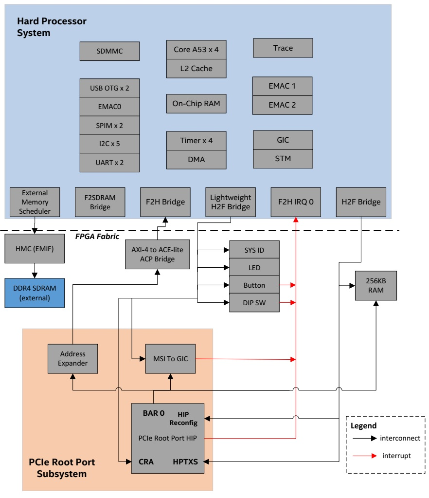
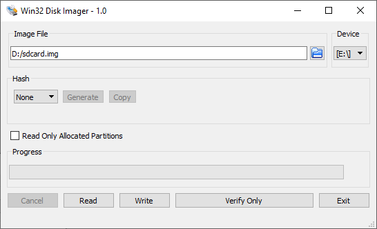
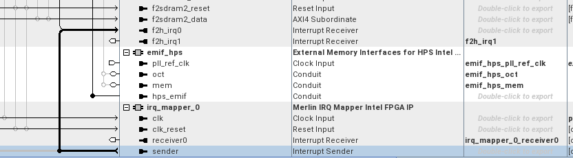

# HPS PCIe Root Port System Example Design for the Stratix® 10 SX SoC Development Kit

## Introduction

This reference design demonstrates a PCIe root port running on Stratix 10 SoC Development Kit connected to NVME end point. A Gen3 x8 PCIe link is shown.
The root port reference design is based on the Stratix 10 Golden System Reference Design, with PCIe root port and necessary Linux software infrastructure added.

This instructions from this page target the Stratix® 10 SX SOC Development kit H-Tile (DK-SOC-1SSX-H-D). 

## Component Versions

| Component                             | Location                                                     | Branch                       | Commit ID/Tag       |
| :------------------------------------ | :----------------------------------------------------------- | :--------------------------- | :------------------ |
| Stratix 10 GHRD                       | [https://github.com/altera-fpga/stratix10-ed-gsrd](https://github.com/altera-fpga/stratix10-ed-gsrd) | main | QPDS25.3_REL_GSRD_PR |
| Linux                                 | [https://github.com/altera-fpga/linux-socfpga](https://github.com/altera-fpga/linux-socfpga) | socfpga-6.12.33-lts | QPDS25.3_REL_GSRD_PR |
| Arm Trusted Firmware                  | [https://github.com/altera-fpga/arm-trusted-firmware](https://github.com/altera-fpga/arm-trusted-firmware) | socfpga_v2.13.0   | QPDS25.3_REL_GSRD_PR |
| U-Boot                                | [https://github.com/altera-fpga/u-boot-socfpga](https://github.com/altera-fpga/u-boot-socfpga) | socfpga_v2025.07 | QPDS25.3_REL_GSRD_PR |
| Yocto Project                         | [https://git.yoctoproject.org/poky](https://git.yoctoproject.org/poky) | walnascar | latest              |
| Yocto Project: meta-intel-fpga (for Legacy GSRD) | [https://git.yoctoproject.org/meta-intel-fpga](https://git.yoctoproject.org/meta-intel-fpga) | walnascar | latest |
| Yocto Project: meta-intel-fpga-refdes (for Legacy GSRD) | [https://github.com/altera-fpga/meta-intel-fpga-refdes](https://github.com/altera-fpga/meta-intel-fpga-refdes) | walnascar | QPDS25.3_REL_GSRD_PR |

## System Example Design Overview

The design extends the Stratix 10 GHRD by adding:

* PCIe Root Port subsystem
* 256 KB on-chip RAM
* Debug and benchmarking components (performance counters, JTAG Avalon Masters)



### Helpful Reference Documentation

* [L-Tile and H-Tile Avalon Memory-mapped IP for PCI Express User Guide](https://docs.altera.com/r/docs/683667/23.4/l-tile-and-h-tile-avalon-memory-mapped-ip-for-pci-express-user-guide/introduction)
* [Stratix 10 SX SoC Development Kit User Guide](https://docs.altera.com/r/docs/683303/current/stratix-10-sx-soc-development-kit-user-guide)

## Hardware Description

### Memory Map

#### HPS H2F Memory Map

HPS-to-FPGA Bridge base address start at 0x8000_0000.

| Address Offset | Size (Bytes) | Peripheral      | Remarks         |
|----------------|--------------|-----------------|-----------------|
|0x8000_0000     |256K          |On Chip Memory   |Block memory implemented in the FPGA fabric  |
|0x9000_0000     |256M          |PCIe HPTXS       |Avalon MM Slave of PCIe HIP HPTXS port |
|0xA000_0000     |2M            |PCIe HIP Reconfig |Avalon MM Slave of PCIe HIP Reconfig port |

#### HPS LWH2F Memory Map

Lightweight HPS-to-FPGA Bridge base address start at 0xF900_0000.

| Address Offset | Size (Bytes) | Peripheral      | Remarks         |
|----------------|--------------|-----------------|-----------------|
|0xF900_0000     |8             |System ID        |Hardware configuration system ID  |
|0xF900_1080     |16            |LED PIO          |LED |
|0xF900_1060     |16            |Button PIO       |Push Button |
|0xF900_1070     |16            |DIPSW PIO        |DIP Switch |
|0xF900_1100     |256           |ILC              |Interrupt Latency Counter|
|0xF901_0000     |32K           |PCIe CRA         |Avalon MM Slave of PCIe HIP CRA port  |
|0xF901_8000     |128           |MSI-to-GIC Vector| |
|0xF901_8080     |16            |MSI-to-GIC CSR   |Avalon MM Slave of MSI-to-GIC CSR port |
|0xF901_80A0     |32            |Performance Counter  |Hardware timer for benchmarking purposes |

#### PCIe HIP BAR0 Memory Map

| Address Offset | Size (Bytes) | Peripheral      | Remarks         |
|----------------|--------------|-----------------|-----------------|
|0x8000_0000     |256k          |On Chip Memory   |Block memory implemented in the FPGA fabric |
|0xF901_8000     |128           |MSI-to-GIC Vector|MSI/MSI-X Transactions from PCIe Endpoint. These should be aligned addresses to avoid any re-alignment on BAM AVMM interface.|
|0x0000_0000     |4G            |HPS F2H          | HPS FPGA to HPS interface (SDRAM access) |

### AXI-4 to ACE-lite Accelerator Coherency Port Bridge

AXI-4 to ACE-lite Accelerator Coherency Port Bridge is a custom IP block created for coherent access. This block fixed ACE-LITE interface with values below:

|Parameter      |Value          |
|---------------|---------------|
|AWSNOOP[2:0]   |3'b000         |
|AWDOMAIN[1:0]  |2b'10          |
|AWBAR[1:0]     |2'b00          |
|ARSNOOP[3:0]   |4'b0000        |
|ARDOMAIN[1:0]  |2'b10          |
|ARBAR[1:0]     |2'b00          |
|AWCACHE[3:0]   |4'b1111        |
|ARCACHE[3:0]   |4'b1111        |
|AWPROT[2:0]    |3'b011         |
|ARPROT[2:0]    |3'b011         |

## Setup Configuration

* [Stratix® 10 SX SoC](https://www.altera.com/products/devkit/a1jui0000049uu5mam/stratix-10-sx-soc-development-kit)

* Tested End Point:
  * Intel SSD DC P3500 NVMe
  * PCI Express Network Interface Card (Intel I350/I210)

* Tools and software:
  * System with supported Linux distribution with Ubuntu 22.04 (LTS)
  * Altera® Quartus® Prime Design Suite software 25.3 version
  * Serial terminal application such as Putty

## Building Stratix® 10 PCIe Root Port Design

### Setting up the environment

```bash
sudo rm -rf s10_example.pcie
mkdir s10_example.pcie
cd s10_example.pcie
export TOP_FOLDER=`pwd`
```

Download the compiler toolchain, add it to the PATH variable, to be used by the GHRD makefile to build the HPS Debug FSBL:
```bash
cd $TOP_FOLDER
wget https://developer.arm.com/-/media/Files/downloads/gnu/14.3.rel1/binrel/\
arm-gnu-toolchain-14.3.rel1-x86_64-aarch64-none-linux-gnu.tar.xz
tar xf arm-gnu-toolchain-14.3.rel1-x86_64-aarch64-none-linux-gnu.tar.xz
rm -f arm-gnu-toolchain-14.3.rel1-x86_64-aarch64-none-linux-gnu.tar.xz
export PATH=`pwd`/arm-gnu-toolchain-14.3.rel1-x86_64-aarch64-none-linux-gnu/bin/:$PATH
export ARCH=arm64
export CROSS_COMPILE=aarch64-none-linux-gnu-
```

Enable Quartus tools to be called from command line:
```bash
export QUARTUS_ROOTDIR=~/altera_pro/25.3/quartus/
export PATH=$QUARTUS_ROOTDIR/bin:$QUARTUS_ROOTDIR/linux64:$QUARTUS_ROOTDIR/../qsys/bin:$PATH
```

### Building the Hardware Design

```bash
cd $TOP_FOLDER
wget https://github.com/altera-fpga/stratix10-ed-gsrd/archive/refs/tags/QPDS25.3_REL_GSRD_PR.zip
unzip QPDS25.3_REL_GSRD_PR.zip
rm QPDS25.3_REL_GSRD_PR.zip
mv stratix10-ed-gsrd-QPDS25.3_REL_GSRD_PR stratix10-ed-gsrd
cd stratix10-ed-gsrd
make s10-htile-soc-devkit-oobe-pcie-gen3x8-all
cd ..
```

After building the hardware design the following binary is created:

* $TOP_FOLDER/stratix10-ed-gsrd/s10_soc_devkit_ghrd/output_files/ghrd_1sx280hu2f50e1vgas.sof

### Build Arm Trusted Firmware

```bash
cd $TOP_FOLDER
rm -rf arm-trusted-firmware
git clone -b QPDS25.3_REL_GSRD_PR https://github.com/altera-fpga/arm-trusted-firmware
cd arm-trusted-firmware
make -j 64 bl31 PLAT=stratix10
cd ..
```

After completing the above steps, the Arm Trusted Firmware binary file is created and is located here.

* $TOP_FOLDER/arm-trusted-firmware/build/stratix10/release/bl31.bin

### Build U-Boot

```bash
cd $TOP_FOLDER
rm -rf u-boot-socfpga
git clone -b QPDS25.3_REL_GSRD_PR https://github.com/altera-fpga/u-boot-socfpga
cd u-boot-socfpga
# enable dwarf4 debug info, for compatibility with arm ds
sed -i 's/PLATFORM_CPPFLAGS += -D__ARM__/PLATFORM_CPPFLAGS += -D__ARM__ -gdwarf-4/g' arch/arm/config.mk
# only boot from SD, do not try QSPI and NAND
sed -i 's/u-boot,spl-boot-order.*/u-boot\,spl-boot-order = \&mmc;/g' arch/arm/dts/socfpga_stratix10_socdk-u-boot.dtsi
# disable NAND in the device tree
sed -i '/&nand {/!b;n;c\\tstatus = "disabled";' arch/arm/dts/socfpga_stratix10_socdk-u-boot.dtsi
# remove the NAND configuration from device tree
sed -i '/images/,/binman/{/binman/!d}' arch/arm/dts/socfpga_stratix10_socdk-u-boot.dtsi

# link to atf
ln -s $TOP_FOLDER/arm-trusted-firmware/build/stratix10/release/bl31.bin .

# Create configuration custom file. 
cat << EOF > config-fragment-stratix10
# use Image instead of kernel.itb
CONFIG_BOOTFILE="Image"
# - Disable NAND/UBI related settings from defconfig. 
CONFIG_NAND_BOOT=n
CONFIG_SPL_NAND_SUPPORT=n
CONFIG_CMD_NAND_TRIMFFS=n
CONFIG_CMD_NAND_LOCK_UNLOCK=n
CONFIG_NAND_DENALI_DT=n
CONFIG_SYS_NAND_U_BOOT_LOCATIONS=n
CONFIG_SPL_NAND_FRAMEWORK=n
CONFIG_CMD_NAND=n
CONFIG_MTD_RAW_NAND=n
CONFIG_CMD_UBI=n
CONFIG_CMD_UBIFS=n
CONFIG_MTD_UBI=n
CONFIG_ENV_IS_IN_UBI=n
CONFIG_UBI_SILENCE_MSG=n
CONFIG_UBIFS_SILENCE_MSG=n
# - Disable distroboot and use specific boot command. 
CONFIG_DISTRO_DEFAULTS=n
CONFIG_HUSH_PARSER=y
CONFIG_SYS_PROMPT_HUSH_PS2="> "
CONFIG_USE_BOOTCOMMAND=y
CONFIG_BOOTCOMMAND="load mmc 0:1 \${loadaddr} ghrd.core.rbf; bridge disable; fpga load 0 \${loadaddr} \${filesize};bridge enable;setenv bootfile Image;run mmcload;run linux_qspi_enable;run rsu_status;run mmcboot"
CONFIG_CMD_FAT=y
CONFIG_CMD_FS_GENERIC=y
CONFIG_DOS_PARTITION=y
CONFIG_SPL_DOS_PARTITION=y
CONFIG_CMD_PART=y
CONFIG_SPL_CRC32=y
CONFIG_LZO=y
CONFIG_CMD_DHCP=y
# Enable more QSPI flash manufacturers
CONFIG_SPI_FLASH_MACRONIX=y
CONFIG_SPI_FLASH_GIGADEVICE=y
CONFIG_SPI_FLASH_WINBOND=y
EOF

# build U-Boot
make clean && make mrproper
make socfpga_stratix10_defconfig
# Use created custom configuration file to merge with the default configuration obtained in .config file. 
./scripts/kconfig/merge_config.sh -O ./ ./.config ./config-fragment-stratix10
make -j 64
cd ..
```

### Prepare QSPI Image

```bash
cd $TOP_FOLDER
quartus_pfg -c stratix10-ed-gsrd/s10_soc_devkit_ghrd/output_files/ghrd_1sx280hu2f50e1vgas.sof ghrd.jic \
-o device=MT25QU128 \
-o flash_loader=1SX280HU2F50E1VGAS \
-o hps_path=u-boot-socfpga/spl/u-boot-spl-dtb.hex \
-o mode=ASX4 \
-o hps=1
```

The following files are created:

* $TOP_FOLDER/ghrd.hps.jic
* $TOP_FOLDER/ghrd.core.rbf

### Build HPS RBF
This is an optional step, in which you can build an HPS RBF file, which can be used to configure the HPS through JTAG instead of QSPI though the JIC file.

```bash
cd $TOP_FOLDER
quartus_pfg -c stratix10-ed-gsrd/s10_soc_devkit_ghrd/output_files/ghrd_1sx280hu2f50e1vgas.sof ghrd.rbf \
-o hps_path=$TOP_FOLDER/u-boot-socfpga/spl/u-boot-spl-dtb.hex \
-o hps=1
```

### Building Linux Kernel

Download and compile Linux:

```bash
cd $TOP_FOLDER
rm -rf linux-socfpga
git clone -b QPDS25.3_REL_GSRD_PR https://github.com/altera-fpga/linux-socfpga
cd linux-socfpga
make clean && make mrproper
```

Adding PCIe node into dts -> arch/arm64/boot/dts/altera/socfpga_stratix10.dtsi b/arch/arm64/boot/dts/altera/socfpga_stratix10.dtsi
Or apply this patch, [arm64_dts_add_stratix_10_PCIe_node.patch](dts/arm64_dts_add_stratix_10_PCIe_node.patch)

```bash
		s10_hps_bridges: bridge@80000000 {
			compatible = "simple-bus";
			reg = <0x80000000 0x20200000>,
				<0xf9000000 0x00100000>;
			reg-names = "axi_h2f", "axi_h2f_lw";
			#address-cells = <2>;
			#size-cells = <1>;
			ranges = <0x00000000 0x00000000 0x80000000 0x00040000>,
				<0x00000000 0x10000000 0x90000000 0x10000000>,
				<0x00000000 0x20000000 0xa0000000 0x00200000>,
				<0x00000001 0x00010000 0xf9010000 0x00008000>,
				<0x00000001 0x00018000 0xf9018000 0x00000080>,
				<0x00000001 0x00018080 0xf9018080 0x00000010>;

			pcie_0_pcie_s10: pcie@A0000000 {
				compatible = "altr,pcie-root-port-2.0";
				reg = 	<0x00000000 0x20000000 0x00200000>,
					<0x00000000 0x10000000 0x10000000>,
					<0x00000001 0x00010000 0x00008000>;
				reg-names = "Hip", "Txs", "Cra";
				interrupt-parent = <&intc>;
				interrupts = <0 20 4>;
				interrupt-controller;
				#interrupt-cells = <1>;
				device_type = "pci";    /* embeddedsw.dts.params.device_type type STRING */
				bus-range = <0x00000000 0x000000ff>;
				ranges = <0x82000000 0x00000000 0x00000000 0x00000000 0x10000000 0x00000000 0x10000000>;
				msi-parent = <&pcie_0_msi_irq>;
				#address-cells = <3>;
				#size-cells = <2>;
				dma-coherent;
				interrupt-map-mask = <0 0 0 7>;
				interrupt-map = <0 0 0 1 &pcie_0_pcie_s10 1>,
						<0 0 0 2 &pcie_0_pcie_s10 2>,
						<0 0 0 3 &pcie_0_pcie_s10 3>,
						<0 0 0 4 &pcie_0_pcie_s10 4>;
			}; //end pcie@0x010000000 (pcie_0_pcie_s10)

			pcie_0_msi_irq: msi@10008080 {
				compatible = "altr,msi-1.0";
				reg = <0x00000001 0x00018080 0x00000010>,
					<0x00000001 0x00018000 0x00000080>;
				reg-names = "csr", "vector_slave";
				interrupt-parent = <&intc>;
				interrupts = <0 19 4>;
				msi-controller = <1>;   /* embeddedsw.dts.params.msi-controller type NUMBER */
				num-vectors = <32>;     /* embeddedsw.dts.params.num-vectors type NUMBER */
			}; //end msi@0x100008000 (pcie_0_msi_irq)
		};
```

```bash
# enable kernel debugging with RiscFree
./scripts/config --set-val CONFIG_DEBUG_INFO  y
./scripts/config --set-val CONFIG_GDB_SCRIPTS y
./scripts/config --set-val CONFIG_BLK_DEV_NVME y
make defconfig
make -j 64 Image dtbs
```

The following items are built in $TOP_FOLDER:

* $TOP_FOLDER/linux-socfpga/arch/arm64/boot/dts/altera/socfpga_stratix10_socdk.dtb
* $TOP_FOLDER/linux-socfpga/arch/arm64/boot/Image

### Building Yocto Rootfs

This section presents how to build the Linux rootfs using Yocto recipes. Note that the yocto recipes actually build everything, but are only interested in the rootfs.

First, make sure you have Yocto system requirements met: https://docs.yoctoproject.org/3.4.1/ref-manual/system-requirements.html#supported-linux-distributions.

1\. Make sure you have Yocto system requirements met: [https://docs.yoctoproject.org/scarthgap/ref-manual/system-requirements.html#supported-linux-distributions](https://docs.yoctoproject.org/scarthgap/ref-manual/system-requirements.html#supported-linux-distributions).

The command to install the required packages on Ubuntu 22.04 is:

```bash
sudo apt-get update
sudo apt-get upgrade
sudo apt-get install openssh-server mc libgmp3-dev libmpc-dev gawk wget git diffstat unzip texinfo gcc \
build-essential chrpath socat cpio python3 python3-pip python3-pexpect xz-utils debianutils iputils-ping \
python3-git python3-jinja2 libegl1-mesa libsdl1.2-dev pylint xterm python3-subunit mesa-common-dev zstd \
liblz4-tool git fakeroot build-essential ncurses-dev xz-utils libssl-dev bc flex libelf-dev bison xinetd \
tftpd tftp nfs-kernel-server libncurses5 libc6-i386 libstdc++6:i386 libgcc++1:i386 lib32z1 \
device-tree-compiler curl mtd-utils u-boot-tools net-tools swig -y
```

On Ubuntu 22.04 you will also need to point the /bin/sh to /bin/bash, as the default is a link to /bin/dash:

```bash
 sudo ln -sf /bin/bash /bin/sh
```

**Note**: You can also use a Docker container to build the Yocto recipes, refer to https://rocketboards.org/foswiki/Documentation/DockerYoctoBuild for details. When using a Docker container, it does not matter what Linux distribution or packages you have installed on your host, as all dependencies are provided by the Docker container.

**Note:** You can also use a Docker container to build the Yocto recipes, refer to https://rocketboards.org/foswiki/Documentation/DockerYoctoBuild for details. When using a Docker container, it does not matter what Linux distribution or packages you have installed on your host, as all dependencies are provided by the Docker container.

```bash 
cd $TOP_FOLDER 
rm -rf yocto && mkdir yocto && cd yocto
git clone -b walnascar  https://git.yoctoproject.org/poky
git clone -b walnascar  https://git.yoctoproject.org/meta-intel-fpga
git clone -b walnascar  https://github.com/openembedded/meta-openembedded
# work around issue
echo 'do_package_qa[noexec] = "1"' >> $(find meta-intel-fpga -name linux-socfpga_6.6.bb)
source poky/oe-init-build-env ./build
echo 'MACHINE = "stratix10_htile"' >> conf/local.conf
echo 'BBLAYERS += " ${TOPDIR}/../meta-intel-fpga "' >> conf/bblayers.conf
echo 'BBLAYERS += " ${TOPDIR}/../meta-openembedded/meta-oe "' >> conf/bblayers.conf  
echo 'CORE_IMAGE_EXTRA_INSTALL += "openssh gdbserver devmem2"' >> conf/local.conf
bitbake gsrd-console-image
```

The following file is created:

* $TOP_FOLDER/yocto/build/tmp/deploy/images/stratix10_htile/core-image-minimal-stratix10_htile.rootfs.tar.gz

### Prepare SD Card Image

```bash 
cd $TOP_FOLDER/
sudo rm -rf sd_card && mkdir sd_card && cd sd_card
wget https://releases.rocketboards.org/release/2020.11/gsrd/tools/make_sdimage_p3.py
# remove mkfs.fat parameter which has some issues on Ubuntu 22.04
sed -i 's/\"\-F 32\",//g' make_sdimage_p3.py
chmod +x make_sdimage_p3.py
mkdir fatfs && cd fatfs
cp $TOP_FOLDER/u-boot-socfpga/u-boot.itb .
cp $TOP_FOLDER/linux-socfpga/arch/arm64/boot/Image .
cp $TOP_FOLDER/linux-socfpga/arch/arm64/boot/dts/altera/socfpga_stratix10_socdk.dtb .
cp $TOP_FOLDER/ghrd.core.rbf .
cd ..
mkdir rootfs && cd rootfs
sudo tar xf $TOP_FOLDER/yocto/build/tmp/deploy/images/stratix10_htile/core-image-minimal-stratix10_htile.rootfs.tar.gz
sudo rm -rf lib/modules/*
cd ..
sudo python3 make_sdimage_p3.py -f \
-P fatfs/*,num=1,format=fat32,size=100M \
-P rootfs/*,num=2,format=ext3,size=800M \
-s 912M \
-n sdcard.img
```

After completting the binaries build, the following files will be needed to boot Linux:

* $TOP_FOLDER/sd_card/sdcard.img

## Running the System Example Design

### Write SD Card Image

Write the sdcard.img SD card image to the micro SD card using the included USB writer in the host computer:

On Windows, use the Win32DiskImager program, available at [https://sourceforge.net/projects/win32diskimager](https://sourceforge.net/projects/win32diskimager).



### Write QSPI Flash

1\. Set MSEL dipswitch to JTAG: "ON, ON, ON, ON"

2\. Power up the board

3\. Write the JIC file to QSPI:

```bash
quartus_pgm -c 1 -m jtag -o "pvi;ghrd.hps.jic"
```

4\. Configure MSEL back to QSPI: SW2: ON-OFF-OFF (SW2.4 is not connected)

### Booting up the system

Open the Putty serial terminal, it will show the board boot-up process.
  
Execute the `lspci` command to display information about all PCI devices on the system

```bash
        root@stratix10htile:~# lspci -v
        00:00.0 PCI bridge: Altera Corporation Device e000 (rev 01) (prog-if 00 [Normal decode])
                Flags: bus master, fast devsel, latency 0, IRQ 20
                Bus: primary=00, secondary=01, subordinate=01, sec-latency=0
                I/O behind bridge: [disabled] [16-bit]
                Memory behind bridge: 90000000-900fffff [size=1M] [32-bit]
                Prefetchable memory behind bridge: [disabled] [32-bit]
                Capabilities: [40] Power Management version 3
                Capabilities: [50] MSI: Enable+ Count=1/4 Maskable+ 64bit+
                Capabilities: [70] Express Root Port (Slot-), IntMsgNum 0
                Capabilities: [100] Advanced Error Reporting
                Capabilities: [148] Virtual Channel
                Capabilities: [188] Secondary PCI Express
                Capabilities: [b80] Vendor Specific Information: ID=1172 Rev=0 Len=05c <?>
                Kernel driver in use: pcieport

        01:00.0 Non-Volatile memory controller: Intel Corporation PCIe Data Center SSD (rev 01) (prog-if 02 [NVM Express])
                Subsystem: Intel Corporation DC P3500 SSD [Add-in Card]
                Flags: fast devsel
                Memory at 90010000 (64-bit, non-prefetchable) [disabled] [size=16K]
                Expansion ROM at 90000000 [virtual] [disabled] [size=64K]
                Capabilities: [40] Power Management version 3
                Capabilities: [50] MSI-X: Enable- Count=32 Masked-
                Capabilities: [60] Express Endpoint, IntMsgNum 0
                Capabilities: [100] Advanced Error Reporting
                Capabilities: [150] Virtual Channel
                Capabilities: [180] Power Budgeting <?>
                Capabilities: [190] Alternative Routing-ID Interpretation (ARI)
                Capabilities: [270] Device Serial Number 55-cd-2e-40-4b-fc-59-3e
                Capabilities: [2a0] Secondary PCI Express
```

There you will see both PCIe devices Rootport(00:00.0) & End Point(01:00.0)

### fio transactions

Recommended command to perform write transactions on an NVMe SSD:
```bash
fio --filename=/dev/nvme0n1 --rw=write --gtod_reduce=1 --blocksize=64k --size=2G --iodepth=2 --group_reporting --name=myjob --ioengine=libaio --numjobs=num_of_job
```

Recommended command to perform read transactions on an NVMe SSD:
```bash
fio --filename=/dev/nvme0n1 --rw=read --gtod_reduce=1 --blocksize=64k --size=2G --iodepth=2 --group_reporting --name=myjob --ioengine=libaio --numjobs=num_of_job
```

You could change the parameters ==--size=**xG**== with 2G or 8G, ==--rw=**x**== with write or read, ==--numjobs=**x**== with values 4, 8, 16 or 20, i.e.:

* fio --filename=/dev/nvme0n1 --rw= ==**write**== --gtod_reduce=1 --blocksize=64k --size= ==**2G**== --iodepth=2 --group_reporting --name=myjob --ioengine=libaio --numjobs= ==**4**==
* fio --filename=/dev/nvme0n1 --rw= ==**read**== --gtod_reduce=1 --blocksize=64k --size= ==**2G**== --iodepth=2 --group_reporting --name=myjob --ioengine=libaio --numjobs= ==**8**==
* fio --filename=/dev/nvme0n1 --rw= ==**write**== --gtod_reduce=1 --blocksize=64k --size= ==**8G**== --iodepth=2 --group_reporting --name=myjob --ioengine=libaio --numjobs= ==**16**==
* fio --filename=/dev/nvme0n1 --rw= ==**read**== --gtod_reduce=1 --blocksize=64k --size= ==**8G**== --iodepth=2 --group_reporting --name=myjob --ioengine=libaio --numjobs= ==**20**==

#### NVMe Result with fio

Write result running on 20 jobs

`WRITE: bw=1150MiB/s (1206MB/s), 1150MiB/s-1150MiB/s (1206MB/s-1206MB/s), io=37.8GiB (40.5GB), run=33627-33627msec`

Read result running on 20 jobs

`READ: bw=2827MiB/s (2964MB/s), 2827MiB/s-2827MiB/s (2964MB/s-2964MB/s), io=38.0GiB (40.8GB), run=13765-13765msec`

## Stratix 10 PCIe Root Port device tree descriptions

```bash
s10_hps_bridges: bridge@80000000 {
        compatible = "simple-bus";           // <physical_base_address length>
        reg = <0x80000000 0x20200000>,       // axi_h2f physical base address and length
                <0xf9000000 0x00100000>;     // axi_h2f_lw physical base address and length
        reg-names = "axi_h2f", "axi_h2f_lw";
        #address-cells = <0x2>;
        #size-cells = <0x1>;
        ranges = <0x00000000 0x00000000 0x80000000 0x00040000>, // 256k OCRAM physical base address and length
                <0x00000000 0x10000000 0x90000000 0x10000000>,  // PCIe Txs physical base address and length
                <0x00000000 0x20000000 0xa0000000 0x00200000>,  // PCIe Hip physical base address and length
                <0x00000001 0x00010000 0xf9010000 0x00008000>,  // PCIe Cra physical base address and length
                <0x00000001 0x00018000 0xf9018000 0x00000080>,  // MSI vector_slave physical base address and length
                <0x00000001 0x00018080 0xf9018080 0x00000010>;  // MSI csr physical base address and length

                --Format of ranges--
                <bridge address_offset physical_base_address length>
                - bridge 0x00000000 refers to h2f, 0x00000001 refers to h2f_lw
                - bridge physical_base_address + address_offset(1st parameter + 2nd parameter) should be equal to physical_base_address (3rd parameter)
```

```bash
pcie_0_pcie_s10: pcie@200000000 {
        compatible = "altr,pcie-root-port-2.0";     // <bridge address_offset length>
        reg = <0x00000000 0x20000000 0x00200000>,   // PCIe Hip bridge, address offset and length
                <0x00000000 0x10000000 0x10000000>, // PCIe Txs bridge, address offset and length
                <0x00000001 0x00010000 0x00008000>; // PCIe Cra bridge, address offset and length
        reg-names = "Hip", "Txs", "Cra";
        interrupt-parent = <0x5>;
        interrupts = <0x0 0x14 0x4>;  // interrupt number mapping for PCIe
        interrupt-controller;
        #interrupt-cells = <0x1>;
        device_type = "pci";
        bus-range = <0x0000000 0x000000ff>;  // 1st cell: bus number assigned to this node; 2nd cell: maximum bus number of any of the subordinate
        ranges = <0x82000000 0x00000000 0x00000000 0x00000000 0x10000000 0x00000000 x10000000>; // <phys.hi phys.mid phys.low bridge address_offset length_hi length_low>
        msi-parent = <&pcie_0_msi_irq>;
        #address-cells = <0x3>;
        #size-cells = <0x2>;
        dma-coherent;
        interrupt-map-mask = <0x0 0x0 0x0 0x7>;
        interrupt-map = <0x0 0x0 0x0 0x1 &pcie_0_pcie_s10 0x1>,  // This is for PCIe legacy interrupt (not used in RP MSI design).
        <0x0 0x0 0x0 0x2 &pcie_0_pcie_s10 0x2>,
        <0x0 0x0 0x0 0x3 &pcie_0_pcie_s10 0x3>,
        <0x0 0x0 0x0 0x4 &pcie_0_pcie_s10 0x4>;
        }; //end pcie@0x010000000 (pcie_0_pcie_s10)

        --Format of ranges--
        <phys.hi phys.mid phys.low bridge address_offset length_hi length_low>
        *please refer to https://elinux.org/Device_Tree_Usage#PCI_Host_Bridge, PCI Address Translation for details
```

```bash
pcie_0_msi_irq: msi@10008080 {
                compatible = "altr,msi-1.0";                    <bridge address_offset length>
                reg = <0x00000001 0x00018080 0x00000010>,       <- MSI csr bridge, address offset and length
                <0x00000001 0x00018000 0x00000080>;             <- MSI vector_slave bridge, address offset and length
                reg-names = "csr", "vector_slave";
                interrupt-parent = <&intc>;
                interrupts = <0x0 0x13 0x4>;    <- interrupt number mapping for MSI
                msi-controller = <0x1>;
                num-vectors = <0x20>;
                }; //end msi@0x100008000
        };
```

## Steps to Enable PCIe Legacy Interrupt

To enable PCIe legacy interrupt,

* Update hardware design with legacy interrupt
* Update device tree with legacy interrupt
* Update PCIe drive

### Update the Quartus Design

1\. Add **IRQ Mapper Intel FPGA IP** in Platform Design

2\. Connect the following connection, **IRQ Mapper Intel FPGA IP(sender) --> Hard Processor System IP(f2h_irq0)**



3\. Add the IRQ Mapper Intel FPGA IP port in the qsys_top module.

```bash
qsys_top soc_inst (
.
.
.irq_mapper_0_receiver0_irq              (pcie_int_status[0]),
.
.
)
```

### Update the Device tree and PCIe drive with legacy interrupt

Update and make the changes to the following files or [Stratix10-Legacy-interrupt-changes.patch](dts/0001-Stratix10-Legacy-interrupt-changes.patch)

Update the arch/arm64/boot/dts/altera/socfpga_stratix10.dtsi with the following note

```bash
		s10_hps_bridges: bridge@80000000 {
			compatible = "simple-bus";
			reg = <0x80000000 0x20200000>,
				<0xf9000000 0x00100000>;
			reg-names = "axi_h2f", "axi_h2f_lw";
			#address-cells = <2>;
			#size-cells = <1>;
			ranges = <0x00000000 0x00000000 0x80000000 0x00040000>,
				<0x00000000 0x10000000 0x90000000 0x10000000>,
				<0x00000000 0x20000000 0xa0000000 0x00200000>,
				<0x00000001 0x00010000 0xf9010000 0x00008000>,
				<0x00000001 0x00018000 0xf9018000 0x00000080>,
				<0x00000001 0x00018080 0xf9018080 0x00000010>;

			pcie_0_pcie_s10: pcie@A0000000 {
				compatible = "altr,pcie-root-port-2.0";
				reg = 	<0x00000000 0x20000000 0x00200000>,
					<0x00000000 0x10000000 0x10000000>,
					<0x00000001 0x00010000 0x00008000>;
				reg-names = "Hip", "Txs", "Cra";
				interrupt-parent = <&intc>;
				interrupts = <0 20 4>;
				#interrupt-cells = <1>;
				device_type = "pci";    /* embeddedsw.dts.params.device_type type STRING */
				bus-range = <0x00000000 0x000000ff>;
				ranges = <0x82000000 0x00000000 0x00000000 0x00000000 0x10000000 0x00000000 0x10000000>;
				#address-cells = <3>;
				#size-cells = <2>;
				dma-coherent;
				interrupt-map-mask = <0 0 0 7>;
				interrupt-map = <0 0 0 1 &pcie_intc 1>,
						<0 0 0 2 &pcie_intc 2>,
						<0 0 0 3 &pcie_intc 3>,
						<0 0 0 4 &pcie_intc 4>;
				pcie_intc: legacy-interrupt-controller {
					interrupt-controller;
					#address-cells = <0>;
					#interrupt-cells = <1>;
				};
			}; //end pcie@0x010000000 (pcie_0_pcie_s10)

			pcie_0_msi_irq: msi@10008080 {
				compatible = "altr,msi-1.0";
				reg = <0x00000001 0x00018080 0x00000010>,
					<0x00000001 0x00018000 0x00000080>;
				reg-names = "csr", "vector_slave";
				interrupt-parent = <&intc>;
				interrupts = <0 19 4>;
				msi-controller = <1>;   /* embeddedsw.dts.params.msi-controller type NUMBER */
				num-vectors = <32>;     /* embeddedsw.dts.params.num-vectors type NUMBER */
			}; //end msi@0x100008000 (pcie_0_msi_irq)
		};		
 	};
```

Make this changes to drivers/pci/controller/pcie-altera.c
1. Remove this line

```bash
pcie->irq_domain = irq_domain_add_linear(node, PCI_NUM_INTX,
```

2. Replace with 
```bash
struct device_node *legacy_intc_np = of_get_child_by_name(node, "legacy-interrupt-controller");
if (!legacy_intc_np) {
        dev_err(dev, "Failed finding legacy intr controller node\n");
        return -ENODEV;
}
pcie->irq_domain = irq_domain_add_linear(legacy_intc_np, PCI_NUM_INTX,
                                                &intx_domain_ops, pcie);
if (!pcie->irq_domain) {
        dev_err(dev, "Failed to get a INTx IRQ domain\n");
```

## Notices & Disclaimers

Altera<sup>&reg;</sup> Corporation technologies may require enabled hardware, software or service activation.
No product or component can be absolutely secure. 
Performance varies by use, configuration and other factors.
Your costs and results may vary. 
You may not use or facilitate the use of this document in connection with any infringement or other legal analysis concerning Altera or Intel products described herein. You agree to grant Altera Corporation a non-exclusive, royalty-free license to any patent claim thereafter drafted which includes subject matter disclosed herein.
No license (express or implied, by estoppel or otherwise) to any intellectual property rights is granted by this document, with the sole exception that you may publish an unmodified copy. You may create software implementations based on this document and in compliance with the foregoing that are intended to execute on the Altera or Intel product(s) referenced in this document. No rights are granted to create modifications or derivatives of this document.
The products described may contain design defects or errors known as errata which may cause the product to deviate from published specifications.  Current characterized errata are available on request.
Altera disclaims all express and implied warranties, including without limitation, the implied warranties of merchantability, fitness for a particular purpose, and non-infringement, as well as any warranty arising from course of performance, course of dealing, or usage in trade.
You are responsible for safety of the overall system, including compliance with applicable safety-related requirements or standards. 
<sup>&copy;</sup> Altera Corporation.  Altera, the Altera logo, and other Altera marks are trademarks of Altera Corporation.  Other names and brands may be claimed as the property of others. 

OpenCL* and the OpenCL* logo are trademarks of Apple Inc. used by permission of the Khronos Group™.   