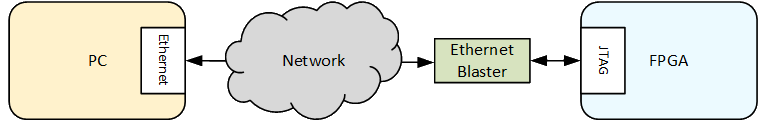
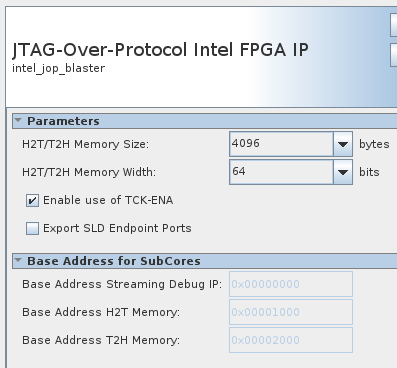

# SoC FPGA Remote Debug Tutorial Example Design User Guide: Stratix® 10 SX SoC Development Kit

##  Introduction

Altera offers an integrated set of System Level Debug (SLD) tools, including:

* SignalTap II Logic Analyzer
* In-System Sources and Probes (ISSP),
* In-System Memory Content Editor)

Typically, the System-Level Debugging (SLD) communication solution was interfacing with the outside world through the JTAG. Then either an USB or Ethernet Blaster could be used to interface JTAG to the host PC.




Another alternative approach is also available, to interface the SLD to the outside world directly through Ethernet on board, without requiring either an USB or Ethernet Blaster.


This page presents an example on how enable this remote debug feature on top of the [GSRD](https://www.rocketboards.org/foswiki/Documentation/Stratix10SoCGSRDHTile).

## Architecture

In the traditional approach the SLD communication solution was based on the Altera JTAG Interface (AJI) which interfaced with the JTAG TAP controller (hard atom in Altera devices which implements the JTAG protocol). The SLD tools used the JTAG channel for communication between software and hardware.


The remote FPGA debugging solution consists of the following:

* JTAG-Over Protocol (JOP) Component: Platform Designer component which enables access to debug information through an Avalon&reg;-MM slave bus
* Etherlink: HPS application exporting debug information over Ethernet, available on github: https://github.com/altera-opensource/remote-debug-for-intel-fpga


The JOP component requires reset and clocking and also provides an Avalon&reg;-MM slave bus through which is configured and debug information is accessed.

Th Etherlink application runs on HPS, accesses the JOP component slave bus to access the debug information, and provides a TCP/IP link from the host PC running the Quartus Pro debug tools to the board.

The etherlink works with the standard UIO Linux kernel driver.

## Example


This section shows an example of how to use the Remote Debug feature. Communication is established from the board to the host PC through Ethernet, so that the board appears as another JTAG device, listed by jtagconfig utility.

The example is based on the [GSRD](https://www.rocketboards.org/foswiki/Documentation/Stratix10SoCGSRDHTile), with the following changes:

 * Adding JOP component to the GHRD
 * Adding JOP to the Linux device tree

Notes:

 * UIO driver is enabled as module in the default kernel configuration file
 * etherlink is already part of the rootfs, built by the Yocto recipes

### Prerequisites

The following are required:

* Stratix&reg; 10 SX SoC Development Kit, production version, H-Tile (ordering code DK-SOC-1SSX-H-D)
  * 4GB DDR4 HILO memory card
  * SD/MMC HPS Daughtercard
  * SDM QSPI Bootcard(MT25QU02G)
  * Mini USB cable for serial output
  * Micro USB cable for on-board Intel&reg; FPGA Download Cable II
* Host PC with:
  * 64 GB of RAM. Less will be fine for only exercising the binaries, and not rebuilding the GSRD.
  * Linux OS installed. Ubuntu 22.04LTS was used to create this page, other versions and distributions may work too
  * Serial terminal (for example GtkTerm or Minicom on Linux and TeraTerm or PuTTY on Windows)
  * Altera Quartus<sup>&reg;</sup> Prime Pro Edition Version 25.1.1
* Local Ethernet network, with DHCP server
* Internet connection. For downloading the files, especially when rebuilding the GSRD.

Refer to [board documentation](https://www.intel.com/content/www/us/en/products/details/fpga/development-kits/stratix/10-sx.html) for more details about the development kit.

### Set up Environment


Create a top folder for this example, as the rest of the commands assume this location:


```bash
sudo rm -rf stratix10.remote_debug
mkdir stratix10.remote_debug
cd stratix10.remote_debug
export TOP_FOLDER=$(pwd)
```


Enable Quartus tools to be called from command line:


```bash
export QUARTUS_ROOTDIR=~/altera_pro/25.1.1/quartus/
export PATH=$QUARTUS_ROOTDIR/bin:$QUARTUS_ROOTDIR/linux64:$QUARTUS_ROOTDIR/../qsys/bin:$PATH
```


### Build Hardware Design


The hardware design is based on the GSRD, with the JOP component added.

1\. Generate the hardware design:


```bash
cd $TOP_FOLDER
rm -rf stratix10-ed-gsrd
wget https://github.com/altera-fpga/stratix10-ed-gsrd/archive/refs/tags/QPDS25.1.1_REL_GSRD_PR.zip
unzip QPDS25.1.1_REL_GSRD_PR.zip
rm -f QPDS25.1.1_REL_GSRD_PR.zip
mv stratix10-ed-gsrd-QPDS25.1.1_REL_GSRD_PR stratix10-ed-gsrd
cd stratix10-ed-gsrd
make s10-htile-soc-devkit-oobe-baseline-generate-design
cd ..
```


2\. Open the project in Quartus, open the `qsys_top.qsys` file in Platform Designer.

3\. In the IP Catalog search for jop and double-click the component to add it to the system:


4\. Configure the JOP component as follows:



5\. Connect the reset and clock to JOP component, also connect it's slave bus to the HPS LW bridge, and map it at offset 0x0002_0000:


6\. Alternatively, steps 2-5 can be peformed from command line, using the provided tcl script:


```bash
cd $TOP_FOLDER/stratix10-ed-gsrd
cd s10_soc_devkit_ghrd
wget https://altera-fpga.github.io/rel-25.1.1/embedded-designs/stratix-10/sx/soc/remote-debug/collateral/s10-ghrd-add-jop.tcl
qsys-script --qpf=ghrd_1sx280hu2f50e1vgas.qpf --script=s10-ghrd-add-jop.tcl --system-file=qsys_top.qsys
cd ..
make s10-htile-soc-devkit-oobe-baseline-package-design
make s10-htile-soc-devkit-oobe-baseline-prep
make s10-htile-soc-devkit-oobe-baseline-build
make s10-htile-soc-devkit-oobe-baseline-sw-build
make s10-htile-soc-devkit-oobe-baseline-test
make s10-htile-soc-devkit-oobe-baseline-install-sof
```


The following files are created:

- `$TOP_FOLDER/stratix10-ed-gsrd/install/designs/s10_htile_soc_devkit_oobe_baseline.sof`: FPGA SOF file, without HPS FSBL
- `$TOP_FOLDER/stratix10-ed-gsrd/install/designs/s10_htile_soc_devkit_oobe_baseline_hps_debug.sof`: FPGA SOF, with HPS Debug FSBL


### Build Core.RBF File


This section shows how to create the core RBF file, which is needed by the Yocto recipes:


```bash
cd $TOP_FOLDER
rm -f *jic* *rbf*
quartus_pfg -c stratix10-ed-gsrd/install/designs/s10_htile_soc_devkit_oobe_baseline_hps_debug.sof \
  ghrd_1sx280hu2f50e1vgas.jic \
  -o device=MT25QU02G \
  -o flash_loader=1SX280HU2F50E1VGAS \
  -o mode=ASX4 \
  -o hps=1
rm ghrd_1sx280hu2f50e1vgas.hps.jic
```


The following file is created:

* `$TOP_FOLDER/ghrd_1sx280hu2f50e1vgas.core.rbf`


### Build Yocto


Perform the following steps to build Yocto:

1\. Make sure you have Yocto system requirements met: https://docs.yoctoproject.org/5.0.1/ref-manual/system-requirements.html#supported-linux-distributions.

The command to install the required packages on Ubuntu 22.04 is:

```bash
sudo apt-get update
sudo apt-get upgrade
sudo apt-get install openssh-server mc libgmp3-dev libmpc-dev gawk wget git diffstat unzip texinfo gcc \
build-essential chrpath socat cpio python3 python3-pip python3-pexpect xz-utils debianutils iputils-ping \
python3-git python3-jinja2 libegl1-mesa libsdl1.2-dev pylint xterm python3-subunit mesa-common-dev zstd \
liblz4-tool git fakeroot build-essential ncurses-dev xz-utils libssl-dev bc flex libelf-dev bison xinetd \
tftpd tftp nfs-kernel-server libncurses5 libc6-i386 libstdc++6:i386 libgcc++1:i386 lib32z1 \
device-tree-compiler curl mtd-utils u-boot-tools net-tools swig -y
```

On Ubuntu 22.04 you will also need to point the /bin/sh to /bin/bash, as the default is a link to /bin/dash:

```bash
 sudo ln -sf /bin/bash /bin/sh
```

**Note**: You can also use a Docker container to build the Yocto recipes, refer to https://rocketboards.org/foswiki/Documentation/DockerYoctoBuild for details. When using a Docker container, it does not matter what Linux distribution or packages you have installed on your host, as all dependencies are provided by the Docker container.

2\. Clone the Yocto script and prepare the build:


```bash
cd $TOP_FOLDER
rm -rf gsrd_socfpga
git clone -b QPDS25.1.1_REL_GSRD_PR https://github.com/altera-opensource/gsrd_socfpga
cd gsrd_socfpga
. stratix10_htile-gsrd-build.sh
build_setup
```


3\. Enable the JOP UIO driver in the Linux device tree, by editing the file `meta-intel-fpga-refdes` to inlcude the changes shown below:

```patch
diff --git a/recipes-bsp/device-tree/files/socfpga_ilc.dtsi b/recipes-bsp/device-tree/files/socfpga_ilc.dtsi
index 387d8bd..156dbb8 100644
--- a/recipes-bsp/device-tree/files/socfpga_ilc.dtsi
+++ b/recipes-bsp/device-tree/files/socfpga_ilc.dtsi
@@ -14,5 +14,10 @@
 			status = "disabled";
 			altr,sw-fifo-depth = <32>;
 		};
+		 jop@f9008000{
+                                compatible = "generic-uio";
+                                reg = <0xf9008000 0x5000>;
+                                reg-names = "jop";
+                };
 	};
 };
```

Note that the range of memory where the JOP is located is `0xf9008000` .. `0xf900dfff`.

This can be done with the provided patch file:


```bash
rm -f s10-dts-add-jop.patch
wget https://altera-fpga.github.io/rel-25.1.1/embedded-designs/stratix-10/sx/soc/remote-debug/collateral/s10-dts-add-jop.patch
pushd meta-intel-fpga-refdes
patch -p1 < ../s10-dts-add-jop.patch
popd
```


4\. Update the recipe to not use a broken version of =etherlink=:


```bash
sed -i 's/3a3eb126321429c0845276ef9c200df7786dbf74/b6a13b03fe7e9566063eae65d99bd8bc1190ce62/g' meta-intel-fpga-refdes/recipes-tools/remote-debug-app/remote-debug-app_1.0.bb
```


5\. Update your Yocto recipes to use the core RBF file you have built, similar to how the GSRD does it:


```bash
GHRD_LOC=$WORKSPACE/meta-intel-fpga-refdes/recipes-bsp/ghrd/files
CORE_RBF=$GHRD_LOC/stratix10_htile_gsrd_ghrd.core.rbf
cp $TOP_FOLDER/ghrd_1sx280hu2f50e1vgas.core.rbf $CORE_RBF
OLD_CORE_URI="\${GHRD_REPO}\/stratix10_htile_gsrd_\${ARM64_GHRD_CORE_RBF};name=stratix10_htile_gsrd_core"
NEW_CORE_URI="file:\/\/stratix10_htile_gsrd_ghrd.core.rbf"
RECIPE=$WORKSPACE/meta-intel-fpga-refdes/recipes-bsp/ghrd/hw-ref-design.bb
sed -i "s/$OLD_CORE_URI/$NEW_CORE_URI/g" $RECIPE
CORE_SHA=$(sha256sum $CORE_RBF | cut -f1 -d" ")
OLD_CORE_SHA="SRC_URI\[stratix10_htile_gsrd_core\.sha256sum\] = .*"
NEW_CORE_SHA="SRC_URI[stratix10_htile_gsrd_core.sha256sum] =  \"$CORE_SHA\""
sed -i "s/$OLD_CORE_SHA/$NEW_CORE_SHA/g" $RECIPE
```


6\. Build the Yocto recipes:


```bash
bitbake_image
```


7\. Gather the Yocto binaries:


```bash
package
```


The following relevant files are created:

* `$TOP_FOLDER/gsrd-socfpga/stratix10_htile-gsrd-images/u-boot-agilex7-socdk-gsrd-atf/u-boot-spl-dtb.hex`
* `$TOP_FOLDER/gsrd_socfpga/stratix10_htile-gsrd-images/gsrd-console-image-stratix10.wic`
* `$TOP_FOLDER/gsrd-socfpga/stratix10_htile-gsrd-images/sdimage.tar.gz`


### Build QSPI Image


Run the following commands to build the QSPI image:


```bash
cd $TOP_FOLDER
quartus_pfg -c stratix10-ed-gsrd/install/designs/s10_htile_soc_devkit_oobe_baseline.sof \
  ghrd_1sx280hu2f50e1vgas.jic \
  -o device=MT25QU128 \
  -o flash_loader=1SX280HU2 \
  -o hps_path=gsrd_socfpga/stratix10_htile-gsrd-images/u-boot-stratix10-socdk-gsrd-atf/u-boot-spl-dtb.hex \
  -o mode=ASX4 \
  -o hps=1
```


The following file is created:

* `$TOP_FOLDER/ghrd_1sx280hu2f50e1vgas.hps.jic`


### Run Example

The instructions from this section present how to run the remote debug example. Refer to the [GSRD](https://www.rocketboards.org/foswiki/Documentation/Stratix10SoCGSRDHTile) for more detailed instructions on how to set up the board, serial port, and write the binaries.

1\. Write the QSPI image `$TOP_FOLDER/ghrd_1sx280hu2f50e1vgas.jic` to flash.

2\. Extract and write the SD card image `$TOP_FOLDER/gsrd_socfpga/stratix10_htile-gsrd-images/gsrd-console-image-stratix10.wic` to the SD card

3\. Boot board and log into Linux.

4\. Determine board IP address by running the `ifconfig` command:


```bash
root@stratix10:~# ifconfig
eth0: flags=4163  mtu 1500
        inet 10.122.105.175  netmask 255.255.255.0  broadcast 10.122.105.255
        inet6 fe80::b830:37ff:fe25:aa4b  prefixlen 64  scopeid 0x20
        ether ba:30:37:25:aa:4b  txqueuelen 1000  (Ethernet)
        RX packets 35  bytes 5398 (5.2 KiB)
        RX errors 0  dropped 1  overruns 0  frame 0
        TX packets 51  bytes 8687 (8.4 KiB)
        TX errors 0  dropped 0 overruns 0  carrier 0  collisions 0
        device interrupt 19  base 0x2000  
```

5\. Remove pre-existing instances of the driver, and load it again:

```bash
root@stratix10:~# rmmod uio_pdrv_genirq
root@stratix10:~# modprobe uio_pdrv_genirq of_id="generic-uio"
```

6\. Start the etherlink application, specifying which port to accept connections on as shown below:

```bash
root@stratix10:~# etherlink --port=33301
INFO: Etherlink Server Configuration:
INFO:    H2T/T2H Memory Size  : 4096
INFO:    Listening Port       : 33301
INFO:    IP Address           : 0.0.0.0
INFO: UIO Platform Configuration:
INFO:    Driver Path: /dev/uio0
INFO:    Address Span: 20480
INFO:    Start Address: 0x0
INFO: Server socket is listening on port: 33301
```

7\. On the host, establish the JTAG communication to the board through Ethernet, using the board IP and the selected port number:

```bash
$ jtagconfig --add JTAG-over-protocol sti://localhost:0/intel/remote-debug/10.122.105.175:33301/0
```

8\. Also on the host, run the 'jtagconfig' command to show the newly added connection:

```bash
$ jtagconfig
1) JTAG-over-protocol [sti://localhost:0/intel/remote-debug/10.122.105.175:33301/0]
  020D10DD   VTAP10
```

At this point, the connection can be used by the tools which need a JTAG connection, like SignalTap.


## Notices & Disclaimers

Altera<sup>&reg;</sup> Corporation technologies may require enabled hardware, software or service activation.
No product or component can be absolutely secure. 
Performance varies by use, configuration and other factors.
Your costs and results may vary. 
You may not use or facilitate the use of this document in connection with any infringement or other legal analysis concerning Altera or Intel products described herein. You agree to grant Altera Corporation a non-exclusive, royalty-free license to any patent claim thereafter drafted which includes subject matter disclosed herein.
No license (express or implied, by estoppel or otherwise) to any intellectual property rights is granted by this document, with the sole exception that you may publish an unmodified copy. You may create software implementations based on this document and in compliance with the foregoing that are intended to execute on the Altera or Intel product(s) referenced in this document. No rights are granted to create modifications or derivatives of this document.
The products described may contain design defects or errors known as errata which may cause the product to deviate from published specifications.  Current characterized errata are available on request.
Altera disclaims all express and implied warranties, including without limitation, the implied warranties of merchantability, fitness for a particular purpose, and non-infringement, as well as any warranty arising from course of performance, course of dealing, or usage in trade.
You are responsible for safety of the overall system, including compliance with applicable safety-related requirements or standards. 
<sup>&copy;</sup> Altera Corporation.  Altera, the Altera logo, and other Altera marks are trademarks of Altera Corporation.  Other names and brands may be claimed as the property of others. 

OpenCL* and the OpenCL* logo are trademarks of Apple Inc. used by permission of the Khronos Group™. 
