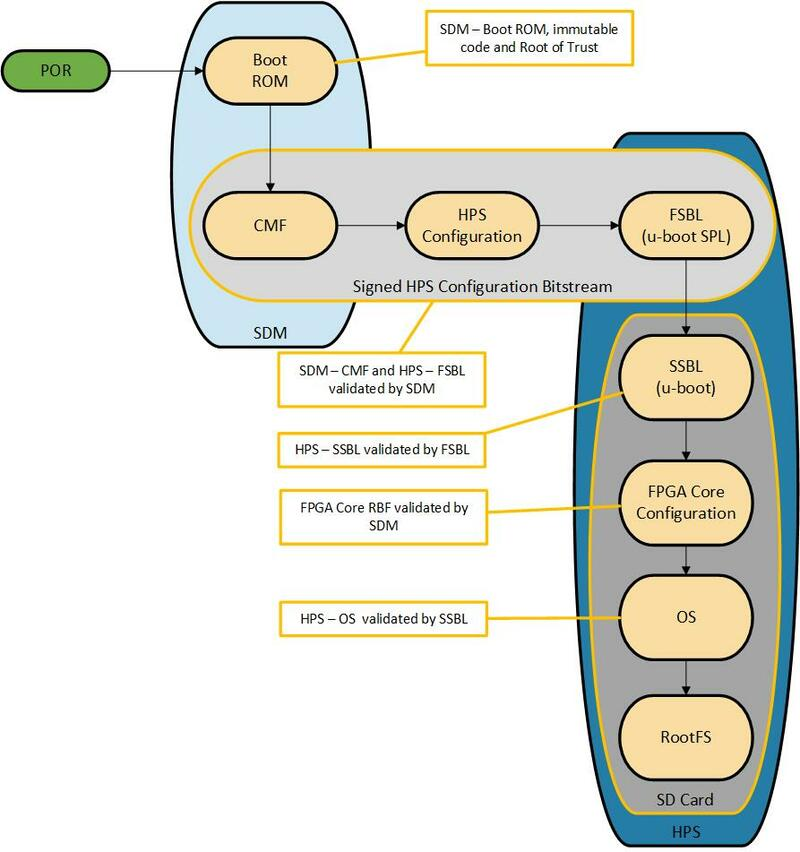

# Secure Boot Tutorial Example Design User Guide

## Introduction 

The secure boot demo design demonstrates an end-to-end authenticated boot flow, from device power on until the Linux kernel is loaded. There are two main components of this design - the Secure Device Manager (SDM) which authenticates the configuration bitstream, and U-boot with the Verified Boot feature. This design is demonstrated on the  [Intel Stratix® 10 H-Tile SoC FPGA Development Kit (DK-SOC-1SSX-H-D)](https://www.intel.com/content/www/us/en/products/details/fpga/development-kits/stratix/10-sx.html)  but can be easily ported to other boards as well. 

This demo design requires: 

- QKY file to program virtual key for SDM authentication 
- Signed RBF file (configuration bitstream) that consists of Intel Stratix 10 GHRD and U-boot FSBL 
- U-boot FSBL and SSBL with Verified Boot features 
- Linux LTSI 

## Overview 

The main purpose of a secure boot system is to ensure that the software running in the Hard Processor System (HPS) is trusted. Upon power-up, a trusted first stage of the boot will be executed - subsequent stages are only loaded and executed if it is authenticated by the current boot stage. In the Intel Stratix® 10 SoC  device, the Secure Device Manager (SDM) is the entry point for all configuration and booting scenarios. As such, the SDM is the root of trust and will be authenticating the configuration bitstream before any HPS software is loaded. 

**Note:** In this demo design, only the authentication feature of the SDM is being demonstrated. The SDM supports other security features such as bitstream encryption, Physically Unclonable Function (PUF), and many more. For more information regarding the SDM or Intel Stratix® 10 security features, refer to the [Intel Stratix 10 Device Security User Guide](https://cdrdv2.intel.com/v1/dl/getContent/774240?fileName=ug-s10-security-683642-774240.pdf). 

A detailed diagram of the authenticated boot flow is shown below: 

  

Detailed explanation of each Boot Stage 

1. Power on reset

- Upon power up, the SDM will read the security state of the eFuses and obtain the configuration bitstream from the boot source (as determined by the MSEL pins). By default, all SDM firmware authentication is enforced when user creates the configuration bitstream in Intel Quartus Prime Pro. 

2. SDM

- On top of the SDM firmware authentication, the user can enable the owner authentication feature to increase the security state of the device. 
- SDM will then check and ensure that the hash of the public root key used to sign the bitstream matches the value stored in the virtual keys or eFuses (indicated by the red key and lock symbol). For this design example, **virtual keys are used (provided via JTAG)** 
- If authentication is successful, SDM will configure the device, copies the U-boot FSBL to the HPS on-chip RAM and release the HPS from reset. 

3. U-boot FSBL 

- Once U-boot FSBL is loaded and running, it will retrieve the U-boot SSBL from the HPS Flash Storage (in this example, the HPS SD card is used). Alternatively user have the option to store the U-boot SSBL in the SDM Flash. 
- The U-boot SSBL image contains a hash signature that is created when the user hash and sign the image with private key (indicated by the blue lock). 
- Using the public key information in its DTB (indicated by the blue key), U-boot FSBL will hash the image and ensures that the hash signature matches. 
- If authentication is successful, the U-boot FSBL will load and hand over the control to SSBL. 

4. U-Boot SSBL

- U-boot SSBL will load the Flat Image Tree (FIT) Image file from HPS Flash Storage (in this example, the HPS SD Card is used). 

- The FIT image contains a signature that is created when the user hashes and signs the image with a private key (indicated by the green lock). 

- Similarly, using the public key information in its DTB (indicated by the green key), U-boot SSBL will hash the image and ensure that the signature matches. 

- If authentication is successful U-boot SSBL will load and hand over the control to kernel. 

5. Operating System

- Once Linux is loaded, the secure boot process is complete 

## Environment Setup

1. Create the main directory of the design: 

```bash 
cd ~ 
mkdir S10_Secure && cd S10_Secure && export TOP_DIR=$(pwd) 
```

2. Download and extract the Linaro toolchain. Then, configure your environment to access the Linaro cross compiler: 

```bash 
cd $TOP_DIR 
wget https://developer.arm.com/-/media/Files/downloads/gnu/11.2-2022.02/binrel/gcc-arm-11.2-2022.02-x86_64-aarch64-none-linux-gnu.tar.xz 
tar xf gcc-arm-11.2-2022.02-x86_64-aarch64-none-linux-gnu.tar.xz 
rm -f gcc-arm-11.2-2022.02-x86_64-aarch64-none-linux-gnu.tar.xz 
export PATH=$TOP_DIR/gcc-arm-11.2-2022.02-x86_64-aarch64-none-linux-gnu/bin:$PATH 
export ARCH=arm64 
export CROSS_COMPILE=aarch64-none-linux-gnu- 
```

3. Enable Quartus tools to be called from command line:

```bash
export QUARTUS_ROOTDIR=~/intelFPGA_pro/24.3.1/quartus/
export PATH=$QUARTUS_ROOTDIR/bin:$QUARTUS_ROOTDIR/linux64:$QUARTUS_ROOTDIR/../qsys/bin:$PATH
```

## Building the System Image

### Build Arm Trusted Firmware

```bash 
cd $TOP_DIR 
git clone https://github.com/altera-opensource/arm-trusted-firmware 
cd arm-trusted-firmware 
git checkout -b socfpga_v2.8.1_vab origin/socfpga_v2.8.1 
make realclean 
make bl31 CROSS_COMPILE=aarch64-none-linux-gnu- PLAT=stratix10 DEPRECATED=1 HANDLE_EA_EL3_FIRST=1 
cd .. 
```

### Build U-Boot

```bash 
cd $TOP_DIR 
git clone https://github.com/altera-opensource/u-boot-socfpga 
cd u-boot-socfpga/ 
git checkout -b test -t origin/socfpga_v2023.07 
ln $TOP_DIR/arm-trusted-firmware/build/stratix10/release/bl31.bin . 
cat << EOF > config-fragment-stratix10 
# - Disable distroboot and use specific boot command. 
CONFIG_DISTRO_DEFAULTS=n 
CONFIG_HUSH_PARSER=y 
CONFIG_SYS_PROMPT_HUSH_PS2="> " 
CONFIG_USE_BOOTCOMMAND=y 
CONFIG_BOOTCOMMAND="setenv bootargs 'earlycon panic=-1 root=/dev/mmcblk0p2 rw rootwait'; load mmc 0:1 $loadaddr signed_bitstream_core.rbf; fpga load 0 $loadaddr $filesize; bridge enable; load mmc 0:1 0x10000000 kernel-sign.fit; bootm 0x10000000" 
CONFIG_CMD_FAT=y 
CONFIG_CMD_FS_GENERIC=y 
CONFIG_DOS_PARTITION=y 
CONFIG_CMD_PART=y 
# Some Security features for U-boot 
CONFIG_FIT_ENABLE_SHA256_SUPPORT=y 
CONFIG_FIT_SIGNATURE=y 
CONFIG_FIT_VERBOSE=y 
CONFIG_CMD_CACHE=y 
CONFIG_CMD_DHCP=y 
CONFIG_ENV_IS_NOWHERE=n 
CONFIG_ENV_IS_MMC=y 
CONFIG_SPL_SHA256_SUPPORT=y 
CONFIG_SPL_CRYPTO_SUPPORT=y 
CONFIG_SPL_HASH_SUPPORT=y 
CONFIG_RSA=y 
CONFIG_SPL_RSA=y 
CONFIG_SHA256=y 
EOF 
make clean && make mrproper 
make socfpga_stratix10_defconfig 
./scripts/kconfig/merge_config.sh -O ./ ./.config ./config-fragment-stratix10 
make -j 24 
```

### Build Linux Kernel 

```bash 
cd $TOP_DIR 
git clone https://github.com/altera-opensource/linux-socfpga 
cd linux-socfpga 
git checkout -b test-kernel -t origin/socfpga-6.1.55-lts 
make clean && make mrproper 
make defconfig 
make -j 64 Image dtbs 
```

### Generate Signature Chains

```bash 
cd $TOP_DIR 
mkdir -p privatekeys && mkdir -p publickeys && mkdir -p qky 
~/intelFPGA_pro/23.4/nios2eds/nios2_command_shell.sh 
quartus_sign --family=stratix10 --operation=make_private_pem --curve=secp384r1 --no_passphrase privatekeys/root0.pem 
quartus_sign --family=stratix10 --operation=make_public_pem privatekeys/root0.pem publickeys/root0_public.pem 
quartus_sign --family=stratix10 --operation=make_root publickeys/root0_public.pem qky/root0.qky 
quartus_sign --family=stratix10 --operation=make_private_pem --curve=secp384r1 --no_passphrase privatekeys/sign0.pem 
quartus_sign --family=stratix10 --operation=make_public_pem privatekeys/sign0.pem publickeys/sign0_public.pem 
quartus_sign --family=stratix10 --operation=make_private_pem --curve=secp384r1 --no_passphrase privatekeys/software0.pem 
quartus_sign --family=stratix10 --operation=make_public_pem privatekeys/software0.pem publickeys/software0_public.pem 
quartus_sign --family=stratix10 --operation=append_key --previous_pem=privatekeys/root0.pem --previous_qky=qky/root0.qky --permission=6 --cancel=0 --input_pem=publickeys/sign0_public.pem qky/sign0_cancel1.qky 
```

### Build the Hardware Design

#### Build the GHRD

```bash 
cd $TOP_DIR 
git clone -b QPDS23.2_REL_GSRD_PR https://github.com/altera-opensource/ghrd-socfpga 
mv ghrd-socfpga/s10_soc_devkit_ghrd . 
rm -rf ghrd-socfpga 
cd s10_soc_devkit_ghrd 
export QUARTUS_DEVICE=1SX280HU2F50E1VGAS 
make scrub_clean_all 
make generate_from_tcl 
make all 
```

#### Enable Security Features: Authentication

For the FPGA configuration bitstream to be properly signed, enable the Quartus key File in the Quartus Project. 

- Open the GHRD project in Quartus. 
- From the Assignments Menu, navigate to Device > Device and Pin Options > Security. Under the Quartus key file, browse and select qky/sign0_cancel1.qky. 
- Alternatively, you can add the following assignment to the .qsf file: "set_global_assignment -name QKY_FILE " 

Regenerate the sof by running the Assembler. 

- From the Processing menu, select Compilation Dashboard. In the Compilation Dashboard, select Assembler to regenerate the sof. 

#### Generate and Sign FPGA and HPS RBF Files

```bash 
cd $TOP_DIR 
mkdir bitstreams 
cd $TOP_DIR/s10_soc_devkit_ghrd/output_files 
quartus_pfg -c ghrd_1sx280hu2f50e1vgas.sof ghrd.rbf -o hps_path=$TOP_DIR/u-boot-socfpga/spl/u-boot-spl-dtb.hex -o hps=1 -o sign_later=ON 
quartus_sign --family=stratix10 --operation=sign --qky=../../qky/sign0_cancel1.qky --pem=../../privatekeys/sign0.pem ghrd.core.rbf ../../bitstreams/signed_bitstream_core.rbf 
quartus_sign --family=stratix10 --operation=sign --qky=../../qky/sign0_cancel1.qky --pem=../../privatekeys/sign0.pem ghrd.hps.rbf ../../bitstreams/signed_bitstream_hps.rbf 
```

### Prepare the Signed Images

#### Create the U-Boot and Linux Keypair Files

Create the keypair used for U-Boot verification: 

```bash 
cd $TOP_DIR 
mkdir uboot-key && cd uboot-key 
openssl genrsa -F4 -out uboot.key 4096 
openssl req -batch -new -x509 -key uboot.key -out uboot.crt 
```

Create the keypair used for Linux and DTB verification: 

```bash 
cd $TOP_DIR 
mkdir linux-key && cd linux-key 
openssl genrsa -F4 -out linux.key 4096 
openssl req -batch -new -x509 -key linux.key -out linux.crt 
```

#### Sign Linux kernel and DTB Files

Create the kernel-sign.its file using the following commands: 

```bash 
cd $TOP_DIR/u-boot-socfpga/ 
cat <<EOF > kernel-sign.its 
/dts-v1/;

/ {
	description = "Linux kernel image with FDT blob";
	#address-cells = <1>;

	images {
		kernel {
			description = "Linux Kernel";
			data = /incbin/("Image");
			type = "kernel";
			arch = "arm64";
			os = "linux";
			compression = "none";
			load = <0x6000000>;
			entry = <0x6000000>;
			hash {
				algo = "sha256";
			};
		};
		fdt {
			description = "Linux DTB";
			data = /incbin/("socfpga_stratix10_socdk.dtb");
			type = "flat_dt";
			arch = "arm64";
			compression = "none";
			hash {
				algo = "sha256";
			};
		};
	};
	configurations {
		default = "conf";
		conf {
			description = "Linux boot configuration";
			kernel = "kernel";
			fdt = "fdt";
			signature {
				algo = "sha256,rsa4096";
				key-name-hint = "linux";
				sign-images = "fdt", "kernel";
			};
		};
	};
}; 
EOF
```

Copy the Linux Image and DTB files from Linux Build: 

```bash 
cp $TOP_DIR/linux-socfpga/arch/arm64/boot/Image . 
cp $TOP_DIR/linux-socfpga/arch/arm64/boot/dts/altera/socfpga_stratix10_socdk.dtb . 
```

Build U-Boot to include the key information for Linux and DTB signatures. The generated file is the kernel-sign.fit has the kernel image and the dtb file that will be used for Linux boot. 

```bash 
tools/mkimage -k /home/fawaz/hps/S10_Secure/linux_key/ -K socfpga_stratix10_socdk.dtb -f kernel-sign.its -r kernel-sign.fit 
make 
```

#### Sign U-Boot File

Create the uboot-sign.its file using the following commands: 

```bash 
cd $TOP_DIR/u-boot-socfpga/ 
cat <<EOF > uboot-sign.its 
/dts-v1/;

/ {
        description = "Authenticator";
        #address-cells = <1>;

        images {
                standalone {
                        description = "Authenticator binary";
                        data = /incbin/("u-boot-dtb.bin");
                        type = "standalone";
                        arch = "arm64";
                        compression = "none";
                        load = <0x00200000>;
                        entry = <0x00200000>;
                        os = "u-boot";
                        hash {
                                algo = "sha256";
                        };
                };
                atf {
                        description = "ARM Trusted Firmware";
                        data = /incbin/("bl31.bin");
                        type = "firmware";
                        os = "arm-trusted-firmware";
                        arch = "arm64";
                        compression = "none";
                        load = <0x00001000>;
                        entry = <0x00001000>;
                        hash {
                                algo = "sha256";
                        };
                };
        };

        configurations {
                default = "conf";
                conf {
                        description = "Authenticator fitImage";
                        firmware = "atf";
                        loadables = "standalone";
                        signature {
                                algo = "sha256,rsa4096";
                                key-name-hint = "uboot";
                                sign-images = "firmware", "loadables";
                        };
                };
        };
};
EOF
```

Build U-Boot to include the key information for FSBL and U-Boot DTB signatures. The generated file is the uboot-sign.fit must be renamed to u-boot.itb after generating it. 

```bash 
tools/mkimage -k $TOP_DIR/uboot-key/ -K spl/u-boot-spl.dtb -f uboot-sign.its -r u-boot-sign.fit 
make 
```

### Create Rootfs

```bash 
cd $TOP_DIR 
mkdir yocto && cd yocto 
git clone -b nanbield https://git.yoctoproject.org/poky 
git clone -b nanbield https://git.yoctoproject.org/meta-intel-fpga 
git clone -b nanbield https://github.com/openembedded/meta-openembedded 
source poky/oe-init-build-env ./build 
echo 'MACHINE = "stratix10"' >> conf/local.conf 
echo 'BBLAYERS += " ${TOPDIR}/../meta-intel-fpga "' >> conf/bblayers.conf 
echo 'BBLAYERS += " ${TOPDIR}/../meta-openembedded/meta-oe "' >> conf/bblayers.conf 
echo 'CORE_IMAGE_EXTRA_INSTALL += "openssh gdbserver devmem2"' >> conf/local.conf 
bitbake core-image-minimal 
```

### Create SD Card Image

Create the required directories and download the python script to create the sdcard image: 

```bash 
cd $TOP_DIR 
mkdir sdcard && cd sdcard 
mkdir sdfs rootfs 
wget https://releases.rocketboards.org/2020.11/gsrd/tools/make_sdimage_p3.py 
chmod +x make_sdimage_p3.py 
```

Copy the kernel, dtb, uboot, and core rbf files: 

```bash 
cd sdfs 
cp $TOP_DIR/u-boot-socfpga/kernel-sign.fit . 
cp $TOP_DIR/u-boot-socfpga/u-boot-sign.fit u-boot.itb 
cp $TOP_DIR/bitstreams/signed_bitstream_core.rbf . 
```

Extract the generated rootfs: 

```bash 
cd ../rootfs 
sudo tar xf $TOP_DIR/yocto/build/tmp/deploy/images/stratix10/core-image-minimal-stratix10.rootfs.tar.gz 
cd .. 
```

Run the python script to generate the sdcard image file: 

```bash 
sudo python3 make_sdimage_p3.py -f \ 
-P sdfs/*,num=1,format=fat,size=70M \ 
-P rootfs/*,num=2,format=ext3,size=400M \ 
-s 512M \ 
-n s10_secure_boot.img 
```

### Run the Design on Stratix® 10 SoC Development Kit

Once the sdcard image file is written to the sdcard, mount it to the board, and make sure to set the MSEL to JTAG configuration MSEL[1111]. 

Next, connect your board to the HPS UART and JTAG connection, then power-up. After that, download the quartus key and hps rbf files using the following commands: 

```bash 
cd $TOP_DIR 
quartus_pgm -c 1 -m jtag -o "pi;qky/root0.qky" 
quartus_pgm -c 1 -m jtag -o "p;bitstreams/signed_bitstream_hps.rbf" 
```

You should see your HPS UART terminal showing the SPL boot message as below. The messages in the red color indicate the authentication of U-Boot and ATF. The messages in blue color indicate the authenticated FPGA core configuration. Finally, the green color messages indicate the authentication of Linux kernel and DTB. 

```bash 
U-Boot SPL 2023.07-rc6-30089-gdab86d36f1-dirty (Jan 08 2024 - 21:06:00 -0600) 
Reset state: Cold 
MPU 1200000 kHz 
L3 main 400000 kHz 
Main VCO 2400000 kHz 
Per VCO 2000000 kHz 
EOSC1 25000 kHz 
HPS MMC 50000 kHz 
UART 100000 kHz 
DDR: 4096 MiB 
SDRAM-ECC: Initialized success with 987 ms 
QSPI: Reference clock at 400000 kHz 
WDT: Started watchdog@ffd00200 with servicing every 1000ms (10s timeout) 
denali-nand-dt nand@ffb90000: timeout while waiting for irq 0x2000 
denali-nand-dt nand@ffb90000: reset not completed. 
Trying to boot from MMC1 
## Checking hash(es) for config conf ... sha256,rsa4096:uboot+ OK 
## Checking hash(es) for Image atf ... sha256+ OK 
## Checking hash(es) for Image standalone ... sha256+ OK 
NOTICE: BL31: bl31_setup 
NOTICE: BL31: bl31_plat_arch_setup 
NOTICE: BL31: v2.8.1(release):QPDS23.2_REL_GSRD_PR 
NOTICE: BL31: Built : 14:09:49, Dec 8 2023 U-Boot 2023.07-rc6-30089-gdab86d36f1-dirty (Jan 08 2024 - 21:05:44 -0600)socfpga_stratix10 CPU: Intel FPGA SoCFPGA Platform (ARMv8 64bit Cortex-A53) 
Model: SoCFPGA Stratix 10 SoCDK 
DRAM: 2 GiB (effective 4 GiB) 
Core: 27 devices, 22 uclasses, devicetree: separate 
Warning: Device tree includes old 'u-boot,dm-' tags: please fix by 2023.07! 
WDT: Started watchdog@ffd00200 with servicing every 1000ms (10s timeout) 
NAND: denali-nand-dt nand@ffb90000: timeout while waiting for irq 0x2000 
denali-nand-dt nand@ffb90000: reset not completed. 
Failed to initialize Denali NAND controller. (error -5) 
0 MiB 
MMC: dwmmc0@ff808000: 0 
Loading Environment from FAT... Unable to read "uboot.env" from mmc0:1... 
Loading Environment from UBI... denali-nand-dt nand@ffb90000: timeout while waiting for irq 0x2000 
denali-nand-dt nand@ffb90000: reset not completed. 
SF: Detected mt25qu02g with page size 256 Bytes, erase size 64 KiB, total 256 MiB 
Could not find a valid device for ffb90000.nand.0 
Volume env not found! \** Unable to read env from root:env \** 
In: serial0@ffc02000 
Out: serial0@ffc02000 
Err: serial0@ffc02000 
Net: 
Warning: ethernet@ff800000 (eth0) using random MAC address - 7a:88:78:08:67:59 
eth0: ethernet@ff800000 
Hit any key to stop autoboot: 0 
3788800 bytes read in 177 ms (20.4 MiB/s) 
....FPGA reconfiguration OK! 
38844038 bytes read in 1789 ms (20.7 MiB/s) 
## Loading kernel from FIT Image at 10000000 ... 
 Using 'conf' configuration 
 Verifying Hash Integrity ... sha256,rsa4096:linux+ OK 
Trying 'kernel' kernel subimage Description: Linux Kernel 
Type: Kernel Image 
 Compression: uncompressed 
 Data Start: 0x100000d0 
 Data Size: 38822400 Bytes = 37 MiB 
 Architecture: AArch64 
 OS: Linux 
 Load Address: 0x06000000 
 Entry Point: 0x06000000 
 Hash algo: sha256 
 Hash value: 5a01fea3cdb4c53108c907cecb5176a1f6d298b1621e1da2d2c64536c08681fa 
 Verifying Hash Integrity ... sha256+ OK 
## Loading fdt from FIT Image at 10000000 ... 
 Using 'conf' configuration 
 Verifying Hash Integrity ... sha256,rsa4096:linux+ OK 
 Trying 'fdt' fdt subimage 
 Description: Linux DTB 
 Type: Flat Device Tree 
 Compression: uncompressed 
 Data Start: 0x125063c0 
 Data Size: 18744 Bytes = 18.3 KiB 
 Architecture: AArch64 
 Hash algo: sha256 
 Hash value: 3f864bacd52ca036f866b2ebab5048d717260b82b197c535bfafa8ba9a933b2d 
 Verifying Hash Integrity ... sha256+ OK 
 Booting using the fdt blob at 0x125063c0 
Working FDT set to 125063c0 
 Loading Kernel Image 
 Loading Device Tree to 000000007eace000, end 000000007ead5937 ... OK 
....... 
```
