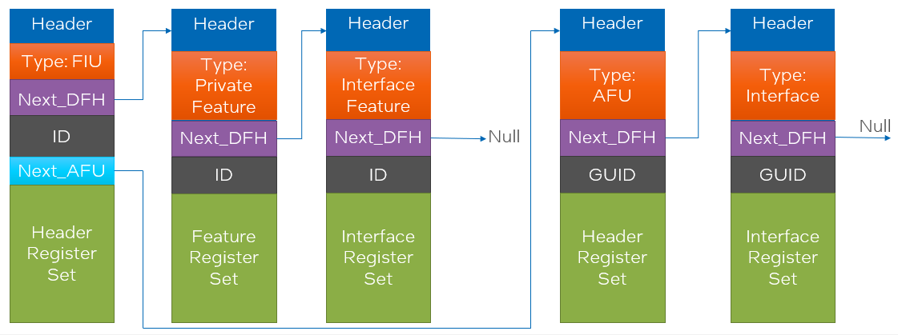
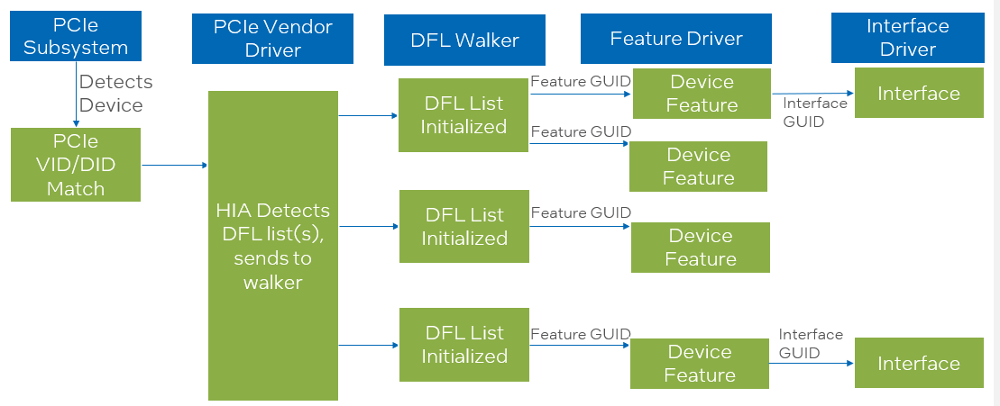
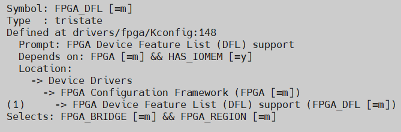

# **Device Feature List Driver**

Last updated: **January 23, 2026** 

**Upstream Status**: [Upstreamed](https://git.kernel.org/pub/scm/linux/kernel/git/torvalds/linux.git/tree/drivers/fpga/dfl.c?h=master)

**Devices supported**: Stratix 10, Agilex 7

## **Introduction**

This driver defines a feature list structure that creates a linked list of feature headers (DFHs) within the MMIO space to provide an extensible way of adding features for FPGA. The driver can walk through feature headers to enumerate feature devices (e.g. FPGA Management Engine, Port and Accelerator Function Unit) and their private features for FPGA devices that support the DFL structure. This linked list is then itself traversed and each feature/private feature is associated with a driver.

|Driver|Mapping|Source(s)|Required for DFL|
|---|---|---|---|
|dfl.ko|Device Feature List Driver|drivers/fpga/dfl.c|Y|

An example DFL:

Also known as the DFL "walker", `dfl-ko` walks the DFL and instantiates other DFL-enabled drivers. The same driver is used on both host-attach and in HPS, assuming they are connected by either a soft or hard PCIe IP. The same DFL walker is used regardless of the chosen OFS attach method (PCIe Attach, Direct Attach). This driver is required for all DFL-enabled FPGA designs.

The following chart visualizes DFL discovery:

## **Driver Sources**

The GitHub source code for this driver can be found at [https://github.com/OFS/linux-dfl/blob/master/drivers/fpga/dfl.c](https://github.com/OFS/linux-dfl/blob/master/drivers/fpga/dfl.c)

The Upstream source code for this driver can be found at [https://git.kernel.org/pub/scm/linux/kernel/git/torvalds/linux.git/tree/drivers/fpga/dfl.c?h=master](https://git.kernel.org/pub/scm/linux/kernel/git/torvalds/linux.git/tree/drivers/fpga/dfl.c?h=master).

## **Driver Capabilities**

* Access PCIe BAR to create a linked list within MMIO for all DFL features

## **Kernel Configurations**

FPGA_DFL

## **Known Issues**

None known

## **Example Designs**

This driver is found in all DFL enabled OFS designs. Examples include the the FIM design for [PCIe Attach supporting DFL](https://github.com/OFS/ofs-agx7-pcie-attach), [Stratix 10 PCIe Attach](https://github.com/OFS/ofs-d5005.git), and [SoC Attach](https://github.com/OFS/ofs-f2000x-pl). Please refer to [site](https://ofs.github.io/) for more information about these designs.

## Notices & Disclaimers

Altera&reg; Corporation technologies may require enabled hardware, software or service activation.
No product or component can be absolutely secure. 
Performance varies by use, configuration and other factors.
Your costs and results may vary. 
You may not use or facilitate the use of this document in connection with any infringement or other legal analysis concerning Altera or Intel products described herein. You agree to grant Altera Corporation a non-exclusive, royalty-free license to any patent claim thereafter drafted which includes subject matter disclosed herein.
No license (express or implied, by estoppel or otherwise) to any intellectual property rights is granted by this document, with the sole exception that you may publish an unmodified copy. You may create software implementations based on this document and in compliance with the foregoing that are intended to execute on the Altera or Intel product(s) referenced in this document. No rights are granted to create modifications or derivatives of this document.
The products described may contain design defects or errors known as errata which may cause the product to deviate from published specifications.  Current characterized errata are available on request.
Altera disclaims all express and implied warranties, including without limitation, the implied warranties of merchantability, fitness for a particular purpose, and non-infringement, as well as any warranty arising from course of performance, course of dealing, or usage in trade.
You are responsible for safety of the overall system, including compliance with applicable safety-related requirements or standards. 
&copy; Altera Corporation.  Altera, the Altera logo, and other Altera marks are trademarks of Altera Corporation.  Other names and brands may be claimed as the property of others. 

OpenCL* and the OpenCL* logo are trademarks of Apple Inc. used by permission of the Khronos Group™. 
