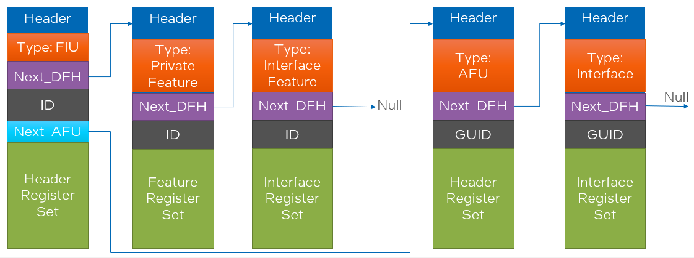
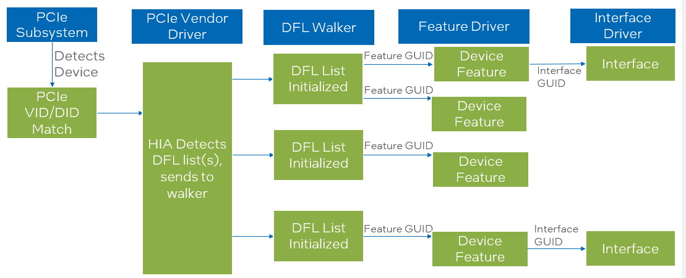
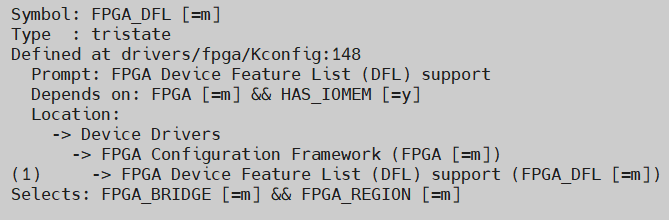

# **Device Feature List Driver**

Last updated: **September 18, 2026** 

**Upstream Status**: [Upstreamed](https://git.kernel.org/pub/scm/linux/kernel/git/torvalds/linux.git/tree/drivers/fpga/dfl.c?h=master)

**Devices supported**: Stratix 10, Agilex 7

## **Introduction**

This driver defines a feature list structure that creates a linked list of feature headers (DFHs) within the MMIO space to provide an extensible way of adding features for FPGA. The driver can walk through feature headers to enumerate feature devices (e.g. FPGA Management Engine, Port and Accelerator Function Unit) and their private features for FPGA devices that support the DFL structure. This linked list is then itself traversed and each feature/private feature is associated with a driver.

|Driver|Mapping|Source(s)|Required for DFL|
|---|---|---|---|
|dfl.ko|Device Feature List Driver|drivers/fpga/dfl.c|Y|

An example DFL:

Also known as the DFL "walker", `dfl-ko` walks the DFL and instantiates other DFL-enabled drivers. The same driver is used on both host-attach and in HPS, assuming they are connected by either a soft or hard PCIe IP. The same DFL walker is used regardless of the chosen OFS attach method (PCIe Attach, Direct Attach). This driver is required for all DFL-enabled FPGA designs.

The following chart visualizes DFL discovery:

## **Driver Sources**

The GitHub source code for this driver can be found at [https://github.com/OFS/linux-dfl/blob/master/drivers/fpga/dfl.c](https://github.com/OFS/linux-dfl/blob/master/drivers/fpga/dfl.c)

The Upstream source code for this driver can be found at [https://git.kernel.org/pub/scm/linux/kernel/git/torvalds/linux.git/tree/drivers/fpga/dfl.c?h=master](https://git.kernel.org/pub/scm/linux/kernel/git/torvalds/linux.git/tree/drivers/fpga/dfl.c?h=master).

## **Driver Capabilities**

* Access PCIe BAR to create a linked list within MMIO for all DFL features

## **Kernel Configurations**

FPGA_DFL

## **Known Issues**

None known

## **Example Designs**

This driver is found in all DFL enabled OFS designs. Examples include the the FIM design for [PCIe Attach supporting DFL](https://github.com/OFS/ofs-agx7-pcie-attach), [Stratix 10 PCIe Attach](https://github.com/OFS/ofs-d5005.git), and [SoC Attach](https://github.com/OFS/ofs-f2000x-pl). Please refer to [site](https://ofs.github.io/) for more information about these designs.

