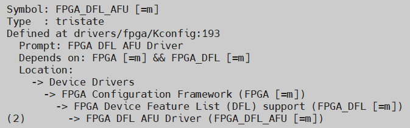

# **Accelerator Functional Unit (aka workload) Driver For Host Attach**

Last updated: **May 07, 2025** 

**Upstream Status**: [Upstreamed](https://git.kernel.org/pub/scm/linux/kernel/git/torvalds/linux.git/tree/drivers/fpga?h=master)

**Devices supported**: Stratix 10, Agilex 7

## **Introduction**

This driver extends the capability of the Accelerator Functional Unit or application workload by implementing management features. You can connect to FPGA infrastructure through the AFU's port interface. An application layer, called Open Programmable Acceleration Engine (OPAE) is built on top of the AFU driver group and can directly communicate with the AFU port regardless of whether the workload sits in a partial reconfiguration region or not. The AFU driver is composed of 4 source files that define its core functionality.

|Driver|Mapping|Source(s)|Required or Optional DFL Driver?|
|---|---|---|---|
|dfl-afu.ko|AFU Driver|drivers/fpga/dfl-afu.h|Optional|

`dfl-afu-dma-region.c` ([Upstream](https://git.kernel.org/pub/scm/linux/kernel/git/torvalds/linux.git/tree/drivers/fpga/dfl-afu-dma-region.c?h=master)) provides DMA region management. It can pin/unpin pages in memory for transfers to occur, create/destroy/find DMA regions, and map/unmap regions of memory.

`dfl-afu-error.c` ([Upstream](https://git.kernel.org/pub/scm/linux/kernel/git/torvalds/linux.git/tree/drivers/fpga/dfl-afu-error.c?h=master)) handles error reporting from the AFU / Port. It can mask/unmask port errors, clear errors, and show various errors associated with the AFU.

`dfl-afu-region.c` ([Upstream](https://git.kernel.org/pub/scm/linux/kernel/git/torvalds/linux.git/tree/drivers/fpga/dfl-afu-region.c?h=master)) provides the portion of the driver responsible for MMIO Region Management. It can add/destroy MMIO regions, and find regions by offset or index.

`dfl-afu-main.c` ([Upstream](https://git.kernel.org/pub/scm/linux/kernel/git/torvalds/linux.git/tree/drivers/fpga/dfl-afu-main.c?h=master)) handles management capabilities of the AFU / Port. It can enable/disable/reset AFU ports, open/close/probe access to AFU devices, and show the current state of the AFU's power consumption, `userclk` frequency, and AFU ID, and provides various other capabilities related to port management.

## **Accelerator Functional Unit**

The AFU region is the region where a user can put their custom application logic.  It can optionally contain a Partial Reconfiguration region for dynamic workload updates.

## **Driver Sources**

The GitHub source code for this driver can be found at [https://github.com/OFS/linux-dfl/tree/master/drivers/fpga](https://github.com/OFS/linux-dfl/tree/master/drivers/fpga).

The Upstream source code for this driver can be found at [(https://git.kernel.org/pub/scm/linux/kernel/git/torvalds/linux.git/tree/drivers/fpga?h=master]((https://git.kernel.org/pub/scm/linux/kernel/git/torvalds/linux.git/tree/drivers/fpga?h=master).

## **Driver Capabilities**

* Create AFU MMIO Regions, DMAs
* Report on AFU related errors
* Create Memory Mappings and pin memory between device and host

## **Kernel Configurations**

FPGA_DFL_AFU

## **Known Issues**

None known

## **Example Designs**

This driver is found in all DFL enabled OFS designs that support an AFU region. Examples include the the FIM design for [PCIe Attach supporting DFL](https://github.com/OFS/ofs-agx7-pcie-attach), [Stratix 10 PCIe Attach](https://github.com/OFS/ofs-d5005.git), and [SoC Attach](https://github.com/OFS/ofs-f2000x-pl). Please refer to [site](https://ofs.github.io/) for more information about these designs.

## Notices & Disclaimers

Altera&reg; Corporation technologies may require enabled hardware, software or service activation.
No product or component can be absolutely secure. 
Performance varies by use, configuration and other factors.
Your costs and results may vary. 
You may not use or facilitate the use of this document in connection with any infringement or other legal analysis concerning Altera or Intel products described herein. You agree to grant Altera Corporation a non-exclusive, royalty-free license to any patent claim thereafter drafted which includes subject matter disclosed herein.
No license (express or implied, by estoppel or otherwise) to any intellectual property rights is granted by this document, with the sole exception that you may publish an unmodified copy. You may create software implementations based on this document and in compliance with the foregoing that are intended to execute on the Altera or Intel product(s) referenced in this document. No rights are granted to create modifications or derivatives of this document.
The products described may contain design defects or errors known as errata which may cause the product to deviate from published specifications.  Current characterized errata are available on request.
Altera disclaims all express and implied warranties, including without limitation, the implied warranties of merchantability, fitness for a particular purpose, and non-infringement, as well as any warranty arising from course of performance, course of dealing, or usage in trade.
You are responsible for safety of the overall system, including compliance with applicable safety-related requirements or standards. 
&copy; Altera Corporation.  Altera, the Altera logo, and other Altera marks are trademarks of Altera Corporation.  Other names and brands may be claimed as the property of others. 

OpenCL* and the OpenCL* logo are trademarks of Apple Inc. used by permission of the Khronos Group™. 