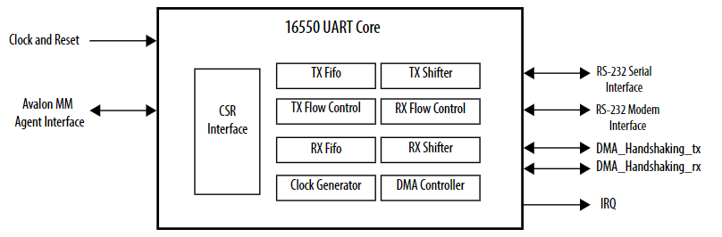

# **Host Attach Memory Subsystem IP Driver**

Last updated: **December 06, 2024** 

**Upstream Status**: [Upstreamed](https://git.kernel.org/pub/scm/linux/kernel/git/torvalds/linux.git/tree/drivers/memory/dfl-emif.c?h=master)

**Devices supported**: Stratix 10, Agilex 7

## **Introduction**

This driver is for the Memory Subsystem IP private feature implemented under FPGA Device Feature List (DFL) framework. It is used to expose memory interface status information as well as memory clearing control.

|Driver|Mapping|Source(s)|Required or Optional DFL Driver?|
|---|---|---|---|
|dfl-emif.ko|FPGA DFL EMIF Driver|drivers/memory/dfl-emif.c|Optional|

## **Agilex 7 F-Series and I-Series FPGA Memory Subsystem IP**

The memory subsystem IP is a high-level solution on top of the External Memory Interfaces Agilex® 7 FPGA IP, providing an easy way to instantiate up to 8 external memory interfaces (EMIFs) with application-level optimizations. 
The memory subsystem IP provides the following components:

* Up to 8 lookup IP instances.
* Up to 8 EMIF instances.
* A memory controller that implements all the memory commands and protocol-level requirements.
* A soft logic adapter to boost memory throughput by traffic shaping.

The memory subsystem supports DDR4 and DIMMs. For more information about this IP, please refer to the [Agilex 7 F-Series and I-Series FPGA Memory Subsystem IP User Guide](https://www.intel.com/content/www/us/en/docs/programmable/789389).

## **Stratix 10 External Memory Interface**

The External Memory Interfaces Stratix 10 FPGA IP provides an physical later interface which builds the data path and manages timing transfers between the FPGA and the memory device.  It also includes a memory controller which implements all the memory commands and protocol level requirements.  This IP supports a variety of memory types including DDR4, QDR-IV and DIMMs.

## **Driver Sources**

The GitHub source code for this driver can be found at [https://github.com/OFS/linux-dfl/blob/master/drivers/memory/dfl-emif.c#L4](https://github.com/OFS/linux-dfl/blob/master/drivers/memory/dfl-emif.c#L4)

The Upstream source code for this driver can be found at [https://git.kernel.org/pub/scm/linux/kernel/git/torvalds/linux.git/tree/drivers/memory/dfl-emif.c?h=master](https://git.kernel.org/pub/scm/linux/kernel/git/torvalds/linux.git/tree/drivers/memory/dfl-emif.c?h=master).

## **Driver Capabilities**

* Access status of memory calibration
* Memory clearing control

## **Kernel Configurations**
 
FPGA_DFL_EMIF

## **Known Issues**

None known

## **Example Designs**

This driver is used in the [PCIe Attach shell designs for Agilex 7](https://github.com/OFS/ofs-agx7-pcie-attach) and in the [PCIe Attach shell design for Stratix 10 FPGA](https://github.com/OFS/ofs-d5005).  Please refer to the [Open FPGA Documentation site](https://ofs.github.io/) for more information about these designs.

## Notices & Disclaimers

Altera&reg; Corporation technologies may require enabled hardware, software or service activation.
No product or component can be absolutely secure. 
Performance varies by use, configuration and other factors.
Your costs and results may vary. 
You may not use or facilitate the use of this document in connection with any infringement or other legal analysis concerning Altera or Intel products described herein. You agree to grant Altera Corporation a non-exclusive, royalty-free license to any patent claim thereafter drafted which includes subject matter disclosed herein.
No license (express or implied, by estoppel or otherwise) to any intellectual property rights is granted by this document, with the sole exception that you may publish an unmodified copy. You may create software implementations based on this document and in compliance with the foregoing that are intended to execute on the Altera or Intel product(s) referenced in this document. No rights are granted to create modifications or derivatives of this document.
The products described may contain design defects or errors known as errata which may cause the product to deviate from published specifications.  Current characterized errata are available on request.
Altera disclaims all express and implied warranties, including without limitation, the implied warranties of merchantability, fitness for a particular purpose, and non-infringement, as well as any warranty arising from course of performance, course of dealing, or usage in trade.
You are responsible for safety of the overall system, including compliance with applicable safety-related requirements or standards. 
&copy; Altera Corporation.  Altera, the Altera logo, and other Altera marks are trademarks of Altera Corporation.  Other names and brands may be claimed as the property of others. 

OpenCL* and the OpenCL* logo are trademarks of Apple Inc. used by permission of the Khronos Group™. 