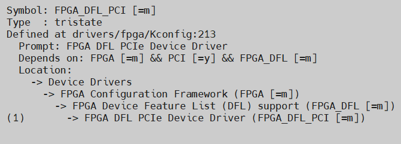

# **DFL PCI Express Subsystem IP Driver**

Last updated: **September 25, 2024** 

**Upstream Status**: [Upstreamed](https://git.kernel.org/pub/scm/linux/kernel/git/torvalds/linux.git/tree/drivers/fpga/dfl-pci.c?h=master)

**Devices supported**: Stratix 10, Agilex 7

## **Introduction**

This driver enables PCIe functionality for PCIe based FPGA solutions that implement the DFL. This driver provides interfaces for user-space applications to configure, enumerate, open and access FPGA accelerators on the FPGA DFL devices, enables system level management functions such as FPGA partial reconfiguration, power management and virtualization with DFL framework.

The `dfl-pci` driver is a DFL specific instantiation of the generic `pci.ko` driver.

|Driver|Mapping|Source(s)|Required for DFL|
|---|---|---|---|
|dfl-pci.ko|FPGA DFL PCIe Device Driver|drivers/fpga/dfl-pci.c|Y|

## **Agilex 7 PCIe Susbystem**

The PCIe Subsystem is one of three subsystems supported by the OFS FIM. It contains configuration registers for the Vendor, Device and Subsystem Vendor IDs. These registers are used in PCIe add-in cards to uniquely identify the card for assignment to software drivers.

The host-side PCIe SS supports PCIe Gen 4x16 speeds using an AXI-ST Data mover interface across a hardened P-Tile. Is natively supports multiple configurations - including 2 PFs, and 1 PF with multiple VFs. It contains optional support for DMA engines and Single-root I/O Virtualization (SR-IOV). Full documentation on the FPGA IP Subsystem for PCI Express IP User Guide can be found on [the Open FPGA Stack Git site](https://ofs.github.io/ofs-2023.3-2/hw/common/user_guides/ug_qs_pcie_ss.pdf).

## **Driver Sources**

The GitHub source code for this driver can be found at [https://github.com/OFS/linux-dfl/blob/master/drivers/fpga/dfl-pci.c](https://github.com/OFS/linux-dfl/blob/master/drivers/fpga/dfl-pci.c).

The Upstream source code for this driver can be found at [https://git.kernel.org/pub/scm/linux/kernel/git/torvalds/linux.git/tree/drivers/fpga/dfl-pci.c?h=master](https://git.kernel.org/pub/scm/linux/kernel/git/torvalds/linux.git/tree/drivers/fpga/dfl-pci.c?h=master).

## **Driver Capabilities**

* Initialize DFL-enabled PCIe SS instances
* Probe for DFLs in PCIe BAR space, and enumerate their features
* Configure SR-IOV

## **Kernel Configurations**
 
FPGA_DFL_PCI

## **Known Issues**

None known

## **Example Designs**

The PCIe SS is included as a part of the FIM design for [PCIe Attach supporting DFL](https://github.com/OFS/ofs-agx7-pcie-attach), [Stratix 10 PCIe Attach](https://github.com/OFS/ofs-d5005.git), and [SoC Attach](https://github.com/OFS/ofs-f2000x-pl). Please refer to [site](https://ofs.github.io/) for more information about these designs.

## Notices & Disclaimers

Altera&reg; Corporation technologies may require enabled hardware, software or service activation.
No product or component can be absolutely secure. 
Performance varies by use, configuration and other factors.
Your costs and results may vary. 
You may not use or facilitate the use of this document in connection with any infringement or other legal analysis concerning Altera or Intel products described herein. You agree to grant Altera Corporation a non-exclusive, royalty-free license to any patent claim thereafter drafted which includes subject matter disclosed herein.
No license (express or implied, by estoppel or otherwise) to any intellectual property rights is granted by this document, with the sole exception that you may publish an unmodified copy. You may create software implementations based on this document and in compliance with the foregoing that are intended to execute on the Altera or Intel product(s) referenced in this document. No rights are granted to create modifications or derivatives of this document.
The products described may contain design defects or errors known as errata which may cause the product to deviate from published specifications.  Current characterized errata are available on request.
Altera disclaims all express and implied warranties, including without limitation, the implied warranties of merchantability, fitness for a particular purpose, and non-infringement, as well as any warranty arising from course of performance, course of dealing, or usage in trade.
You are responsible for safety of the overall system, including compliance with applicable safety-related requirements or standards. 
&copy; Altera Corporation.  Altera, the Altera logo, and other Altera marks are trademarks of Altera Corporation.  Other names and brands may be claimed as the property of others. 

OpenCL* and the OpenCL* logo are trademarks of Apple Inc. used by permission of the Khronos Group™. 