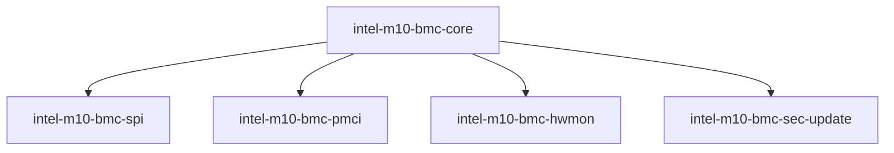
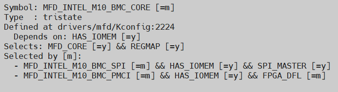
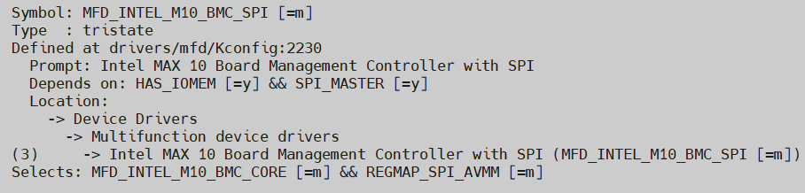
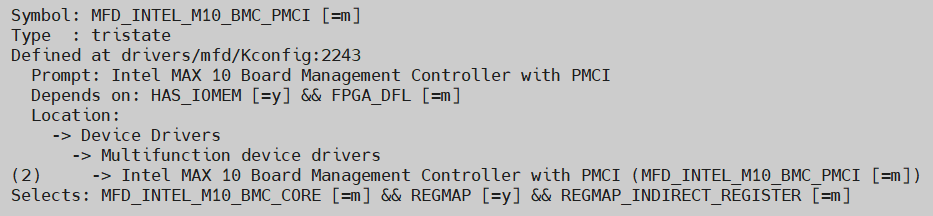
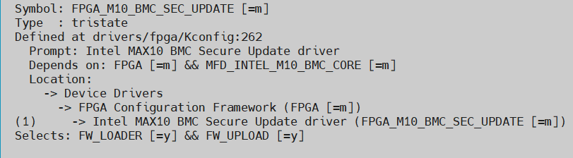
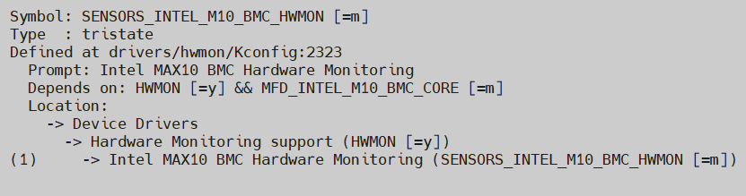

# **Max® 10 Board Management Controller Driver**

Last updated: **May 21, 2024** 

**Upstream Status**: [Upstreamed](https://git.kernel.org/pub/scm/linux/kernel/git/torvalds/linux.git/tree/drivers/mfd?h=master)

* `intel-m10-bmc-log` is not upstreamed.

**Devices supported**: Stratix 10, Agilex 7

## **Introduction**

This driver is designed to support the core functionality of the Max 10 Board Management Controller. It provides support for accessing the BMC, and supports all operations that are in turn supported by the BMC itself including configuring non-volatile FPGA flash, reading telemetry data, and remotely updating the FPGA and BMC images.

|Driver|Mapping|Source(s)|Required for DFL|
|---|---|---|---|
|intel-m10-bmc-core.ko|MAX 10 Board Management Controller|drivers/mfd/intel-m10-bmc-core.c|N|
|intel-m10-bmc-pmci.ko|MAX 10 Board Management Controller with PMCI|drivers/mfd/intel-m10-bmc-pmci.c|N|
|intel-m10-bmc-spi.ko|MAX 10 Board Management Controller with SPI|drivers/mfd/intel-m10-bmc-spi.c|N|
|intel-m10-bmc-sec-update.ko|MAX10 BMC Secure Update driver|drivers/fpga/intel-m10-bmc-sec-update.c|N|
|intel-m10-bmc-hwmon.ko|MAX10 BMC Hardware Monitoring|drivers/hwmon/intel-m10-bmc-hwmon.c|N|

`intel-m10-bmc-core` provides common code for the Board Management Controller chip. It polls the M10 handshake register, can access and update BMC CSRs, display version information, and read MAC statistics.

Either `intel-m10-bmc-spi` or `intel-m10-bmc-pmci` are required for a given BMC, depending on which communication standard is supported by the board as provide by its DFH. D5005 uses SPI, Agilex 7 devices use PMCI. Both of these drivers assist in communicating across the connection between the FPGA fabric and the Max 10 by acting as a master device. As the SPI master the driver will covert SPI messages to Avalon transactions. Both drivers consume the common code present in `intel-m10-bmc-core`.

`intel-m10-bmc-hwmon` hooks into the generic Linux `hwmon` framework already present in the Kernel and instantiations the Max 10 BMC instance. This includes support for all on-board sensors for voltage, current, and temperature.

## **Board Management Controller**

The Board Management Controller (BMC) supports features such as board power management, flash management, configuration management, and board telemetry monitoring and protection. The majority of the BMC logic is in a separate Max® 10 device; a small portion of the BMC known as the PMCI resides in the main Agilex FPGA.

## **Driver Sources**

The GitHub source code for this driver suite can be found at [https://github.com/OFS/linux-dfl/blob/master/drivers/](https://github.com/OFS/linux-dfl/blob/master/drivers/), and under the `fpga`, `mfd`, and `hwmon` directories.

The Upstream source code for this driver can be found at [https://git.kernel.org/pub/scm/linux/kernel/git/torvalds/linux.git/tree/drivers/mfd?h=master](https://git.kernel.org/pub/scm/linux/kernel/git/torvalds/linux.git/tree/drivers/mfd?h=master).

## **Driver Capabilities**

* Communicate with BMC handshake register, issue supported commands
* Read / write to BMC attached flash
* Register on-board sensors with kernel hwmon framework

## **Kernel Configurations**
 
MFD_INTEL_M10_BMC_CORE

MFD_INTEL_M10_BMC_SPI

MFD_INTEL_M10_BMC_PMCI

FPGA_M10_BMC_SEC_UPDATE

SENSORS_INTEL_M10_BMC_HWMON

## **Known Issues**

None known

## Notices & Disclaimers

Altera&reg; Corporation technologies may require enabled hardware, software or service activation.
No product or component can be absolutely secure. 
Performance varies by use, configuration and other factors.
Your costs and results may vary. 
You may not use or facilitate the use of this document in connection with any infringement or other legal analysis concerning Altera or Intel products described herein. You agree to grant Altera Corporation a non-exclusive, royalty-free license to any patent claim thereafter drafted which includes subject matter disclosed herein.
No license (express or implied, by estoppel or otherwise) to any intellectual property rights is granted by this document, with the sole exception that you may publish an unmodified copy. You may create software implementations based on this document and in compliance with the foregoing that are intended to execute on the Altera or Intel product(s) referenced in this document. No rights are granted to create modifications or derivatives of this document.
The products described may contain design defects or errors known as errata which may cause the product to deviate from published specifications.  Current characterized errata are available on request.
Altera disclaims all express and implied warranties, including without limitation, the implied warranties of merchantability, fitness for a particular purpose, and non-infringement, as well as any warranty arising from course of performance, course of dealing, or usage in trade.
You are responsible for safety of the overall system, including compliance with applicable safety-related requirements or standards. 
&copy; Altera Corporation.  Altera, the Altera logo, and other Altera marks are trademarks of Altera Corporation.  Other names and brands may be claimed as the property of others. 

OpenCL and the OpenCL logo are trademarks of Apple Inc. used by permission of the Khronos Group™. 