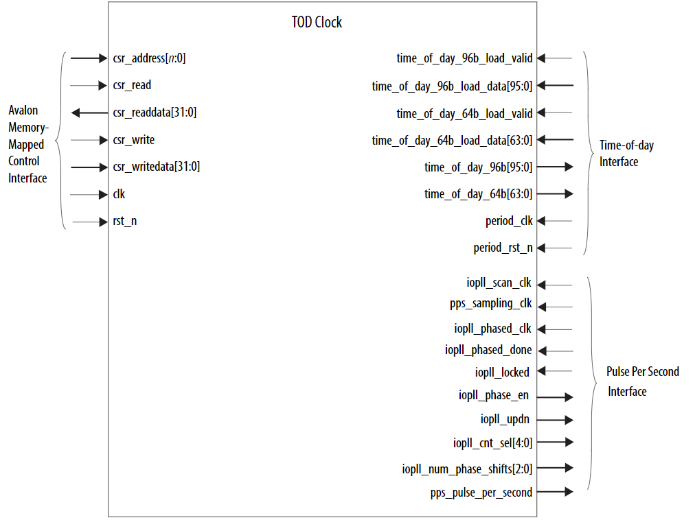
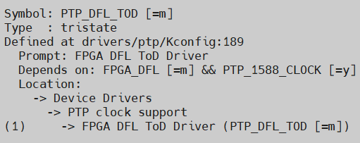

# **Ethernet IEEE 1588 Time of Day Clock FPGA IP Driver for Host Attach**

Last updated: **December 12, 2024** 

**Upstream Status**: [Upstreamed](https://git.kernel.org/pub/scm/linux/kernel/git/torvalds/linux.git/tree/drivers/ptp/ptp_dfl_tod.c?h=master)

## **Introduction**

This page provides an overview of the Time-of-day driver for the Time of Day Clock FPGA IP that is used in the 1588PTP Design examples.  The Time of Day Clock FPGA IP is exposed as PTP Hardware Clock (PHC) device to the Linux PTP stack to synchronize the system clock to its ToD information using phc2sys utility of the Linux PTP stack.

## **Time of Day Clock FPGA IP**

The Time-of-day (TOD) Clock streams 96-bit and 64-bit time-of-day to one or more timestamping units in an IEEE 1588v2 solution. For information regarding this soft IP core, please refer to the [Ethernet Design Example Components User Guide](https://www.intel.com/content/www/us/en/docs/programmable/683044/latest/time-of-day-clock.html).

{: style="height:500px"}

## **Driver Sources**

The GitHub source code for this driver can be found at [https://github.com/OFS/linux-dfl/blob/master/drivers/ptp/ptp_dfl_tod.c](https://github.com/OFS/linux-dfl/blob/master/drivers/ptp/ptp_dfl_tod.c).

The Upstream source code for this driver can be found at [https://git.kernel.org/pub/scm/linux/kernel/git/torvalds/linux.git/tree/drivers/ptp/ptp_dfl_tod.c?h=master](https://git.kernel.org/pub/scm/linux/kernel/git/torvalds/linux.git/tree/drivers/ptp/ptp_dfl_tod.c?h=master).

## **Driver Capabilities**

* Reads and writes time in Time of Day timestamp registers.
* Performs fine and course clock offset adjustment.
* Periodic time drift adjustment.
* Only tested on Host attach Agilex 7

## **Kernel Configurations**
 
CONFIG_PTP_DFL_TOD

## **Known Issues**

None known

## Notices & Disclaimers

Altera&reg; Corporation technologies may require enabled hardware, software or service activation.
No product or component can be absolutely secure. 
Performance varies by use, configuration and other factors.
Your costs and results may vary. 
You may not use or facilitate the use of this document in connection with any infringement or other legal analysis concerning Altera or Intel products described herein. You agree to grant Altera Corporation a non-exclusive, royalty-free license to any patent claim thereafter drafted which includes subject matter disclosed herein.
No license (express or implied, by estoppel or otherwise) to any intellectual property rights is granted by this document, with the sole exception that you may publish an unmodified copy. You may create software implementations based on this document and in compliance with the foregoing that are intended to execute on the Altera or Intel product(s) referenced in this document. No rights are granted to create modifications or derivatives of this document.
The products described may contain design defects or errors known as errata which may cause the product to deviate from published specifications.  Current characterized errata are available on request.
Altera disclaims all express and implied warranties, including without limitation, the implied warranties of merchantability, fitness for a particular purpose, and non-infringement, as well as any warranty arising from course of performance, course of dealing, or usage in trade.
You are responsible for safety of the overall system, including compliance with applicable safety-related requirements or standards. 
&copy; Altera Corporation.  Altera, the Altera logo, and other Altera marks are trademarks of Altera Corporation.  Other names and brands may be claimed as the property of others. 

OpenCL* and the OpenCL* logo are trademarks of Apple Inc. used by permission of the Khronos Group™. 