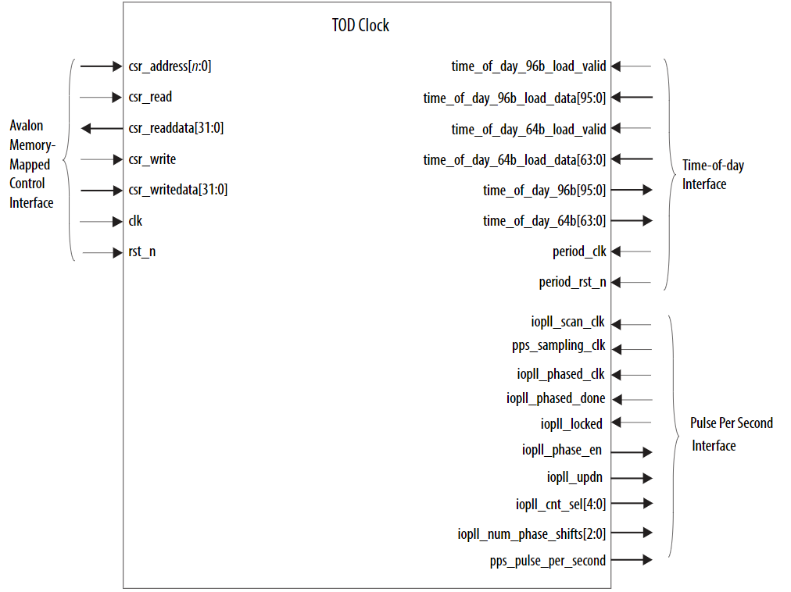
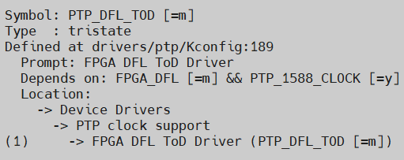

# **Ethernet IEEE 1588 Time of Day Clock FPGA IP Driver for Host Attach**

Last updated: **September 30, 2026** 

**Upstream Status**: [Upstreamed](https://git.kernel.org/pub/scm/linux/kernel/git/torvalds/linux.git/tree/drivers/ptp/ptp_dfl_tod.c?h=master)

## **Introduction**

This page provides an overview of the Time-of-day driver for the Time of Day Clock FPGA IP that is used in the 1588PTP Design examples.  The Time of Day Clock FPGA IP is exposed as PTP Hardware Clock (PHC) device to the Linux PTP stack to synchronize the system clock to its ToD information using phc2sys utility of the Linux PTP stack.

## **Time of Day Clock FPGA IP**

The Time-of-day (TOD) Clock streams 96-bit and 64-bit time-of-day to one or more timestamping units in an IEEE 1588v2 solution. For information regarding this soft IP core, please refer to the [Ethernet Design Example Components User Guide](https://www.intel.com/content/www/us/en/docs/programmable/683044/latest/time-of-day-clock.html).

{: style="height:500px"}

## **Driver Sources**

The GitHub source code for this driver can be found at [https://github.com/OFS/linux-dfl/blob/master/drivers/ptp/ptp_dfl_tod.c](https://github.com/OFS/linux-dfl/blob/master/drivers/ptp/ptp_dfl_tod.c).

The Upstream source code for this driver can be found at [https://git.kernel.org/pub/scm/linux/kernel/git/torvalds/linux.git/tree/drivers/ptp/ptp_dfl_tod.c?h=master](https://git.kernel.org/pub/scm/linux/kernel/git/torvalds/linux.git/tree/drivers/ptp/ptp_dfl_tod.c?h=master).

## **Driver Capabilities**

* Reads and writes time in Time of Day timestamp registers.
* Performs fine and course clock offset adjustment.
* Periodic time drift adjustment.
* Only tested on Host attach Agilex 7

## **Kernel Configurations**
 
CONFIG_PTP_DFL_TOD

## **Known Issues**

None known

