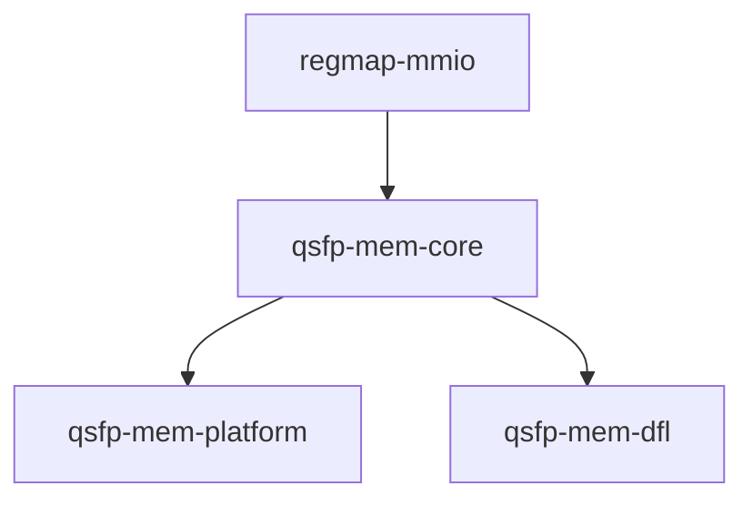
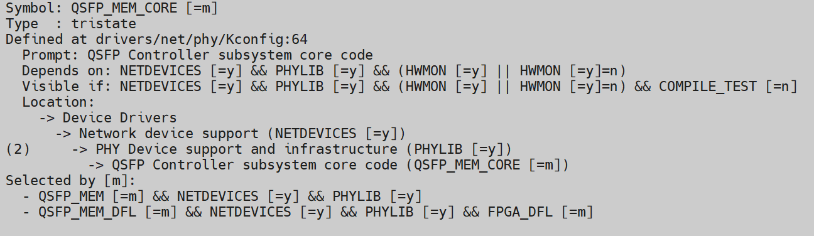
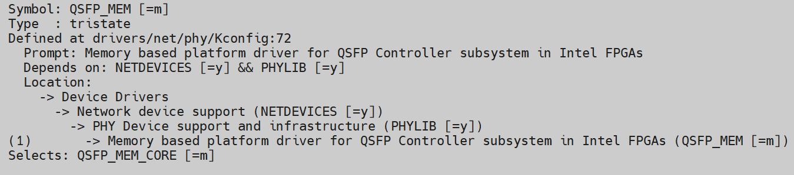
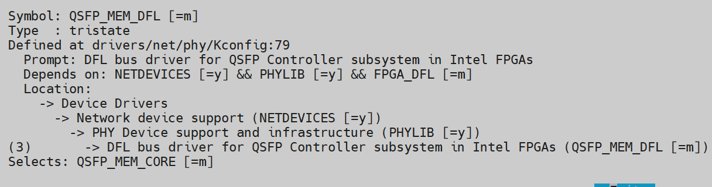

# **Memory Based QSFP Support Driver for Host Attach**

**Upstream Status**: Not Upstreamed

**Devices supported**: Stratix 10, Arria 10 GX

## **Introduction**

This legacy driver builds on top of the QSFP Module and Ethernet IP drivers and enables them in a DFL design. This DFL-based driver will shadow the QSFP module's memory pages in memory. It leverages the core driver code from `qsfp-mem-core.ko`.

|Driver|Mapping|Source(s)|Required for DFL|
|---|---|---|---|
|qsfp-mem-dfl.ko|Memory Based QSFP Support for DFL|drivers/net/phy/qsfp-mem-dfl.c|N|
|qsfp-mem-platform.ko|Memory based QSFP support|drivers/net/phy/qsfp-mem-platform.c|N|
|qsfp-mem-core.ko|Memory based QSFP support|drivers/net/phy/qsfp-mem-core.c|N|

## **Driver Sources**

The GitHub source code for this driver can be found at [https://github.com/OFS/linux-dfl/tree/fpga-ofs-dev-6.1-lts/drivers/net/phy](https://github.com/OFS/linux-dfl/tree/fpga-ofs-dev-6.1-lts/drivers/net/phy).

## **Driver Capabilities**

* Probe and match the corresponding DFL Device
* Init a QSFP Device
* Send data over I2C

## **Kernel Configurations**

QSFP_MEM_CORE

QSFP_MEM

QSFP_MEM_DFL

## **Known Issues**

None known

## **Example Designs**

N/A

