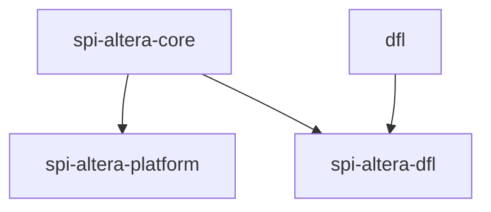
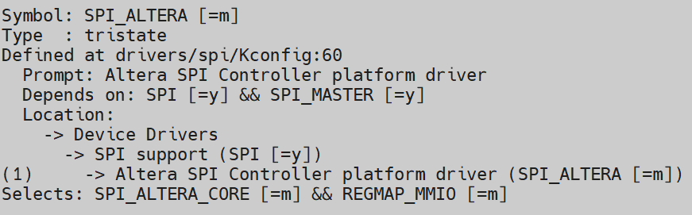
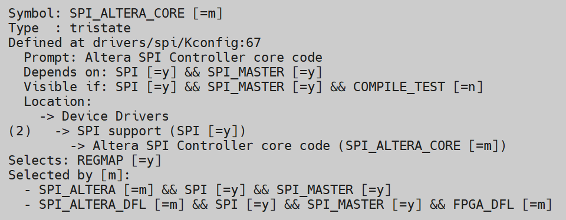
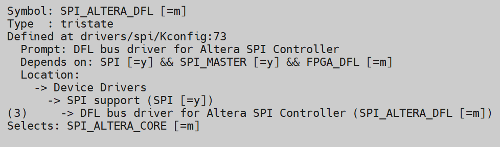

# **Generic Serial Flash Interface Altera® FPGA IP Driver**

**Upstream Status**: [Upstreamed](https://git.kernel.org/pub/scm/linux/kernel/git/torvalds/linux.git/tree/drivers/spi/spi-altera-dfl.c?h=master)

**Devices supported**: Stratix 10, Agilex 7

## **Introduction**

This driver is the DFL specific implementation of the Generic Serial Flash Interface Altera® FPGA IP driver, which provides access to Serial Peripheral Interface (SPI) flash devices. This is a DFL bus driver for the Altera SPI master controller, which is connected to a SPI slave to Avalon bridge in an Altera® Max10 BMC. It handles the probing for available DFL-enabled SPI devices, will initialize any discovered SPI devices, and allows you to read and write over an available interface. The driver supports writing both Configuration memory (configuration data for Active Serial configuration schemes) and General purpose memory. [Generic Serial Flash Interface Altera® FPGA IP User Guide](https://www.intel.com/content/www/us/en/docs/programmable/683419/23-1-20-2-3/user-guide.html). This driver also depends on the generic DFL driver.

|Driver|Mapping|Source(s)|Required for DFL|
|---|---|---|---|
|spi-altera-core.ko|Altera SPI Controller core code|drivers/spi/spi-altera-core.c|N|
|spi-altera-platform.ko|Device Feature List Driver|drivers/spi/spi-altera-platform.c|N|
|spi-altera-dfl.ko|Device Feature List Driver|drivers/spi/spi-altera-dfl.c|N|

## **Driver Sources**

The GitHub source code for this driver can be found at [https://github.com/OFS/linux-dfl/tree/master/drivers/spi]( https://github.com/OFS/linux-dfl/tree/master/drivers/spi).

The Upstream source code for this driver can be found at [https://git.kernel.org/pub/scm/linux/kernel/git/torvalds/linux.git/tree/drivers/fpga/dfl.c?h=master](https://git.kernel.org/pub/scm/linux/kernel/git/torvalds/linux.git/tree/drivers/fpga/dfl.c?h=master).

## **Driver Capabilities**

* Match and probe DFL-enabled SPI interfaces on the DFL
* Read / write into memory over a given interface

## **Kernel Configurations**

SPI_ALTERA

SPI_ALTERA_CORE

SPI_ALTERA_DFL

## **Known Issues**

None known

## **Example Designs**

This driver is found in all DFL enabled OFS designs. Examples include the the FIM design for [PCIe Attach supporting DFL](https://github.com/OFS/ofs-agx7-pcie-attach), [Stratix 10 PCIe Attach](https://github.com/OFS/ofs-d5005.git), and [SoC Attach](https://github.com/OFS/ofs-f2000x-pl). Please refer to [site](https://ofs.github.io/) for more information about these designs.

## Notices & Disclaimers

Altera&reg; Corporation technologies may require enabled hardware, software or service activation.
No product or component can be absolutely secure. 
Performance varies by use, configuration and other factors.
Your costs and results may vary. 
You may not use or facilitate the use of this document in connection with any infringement or other legal analysis concerning Altera or Intel products described herein. You agree to grant Altera Corporation a non-exclusive, royalty-free license to any patent claim thereafter drafted which includes subject matter disclosed herein.
No license (express or implied, by estoppel or otherwise) to any intellectual property rights is granted by this document, with the sole exception that you may publish an unmodified copy. You may create software implementations based on this document and in compliance with the foregoing that are intended to execute on the Altera or Intel product(s) referenced in this document. No rights are granted to create modifications or derivatives of this document.
The products described may contain design defects or errors known as errata which may cause the product to deviate from published specifications.  Current characterized errata are available on request.
Altera disclaims all express and implied warranties, including without limitation, the implied warranties of merchantability, fitness for a particular purpose, and non-infringement, as well as any warranty arising from course of performance, course of dealing, or usage in trade.
You are responsible for safety of the overall system, including compliance with applicable safety-related requirements or standards. 
&copy; Altera Corporation.  Altera, the Altera logo, and other Altera marks are trademarks of Altera Corporation.  Other names and brands may be claimed as the property of others. 

OpenCL* and the OpenCL* logo are trademarks of Apple Inc. used by permission of the Khronos Group™. 
