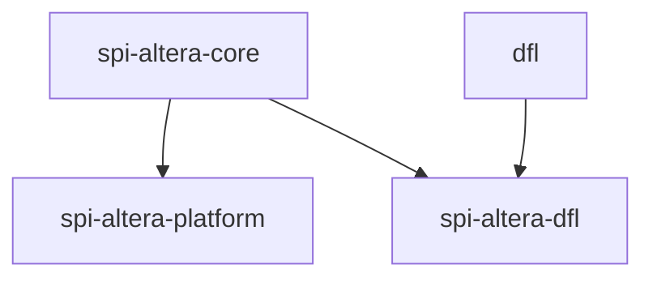
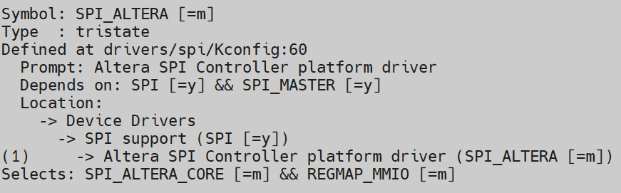
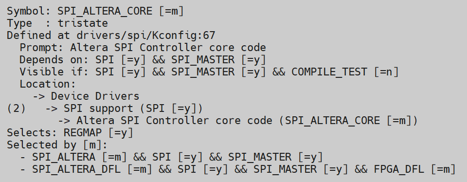
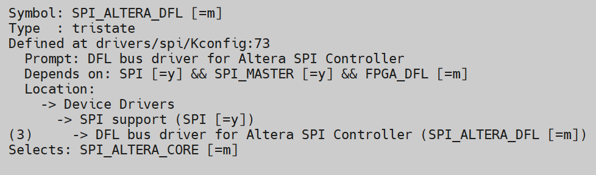

# **Generic Serial Flash Interface Altera® FPGA IP Driver**

**Upstream Status**: [Upstreamed](https://git.kernel.org/pub/scm/linux/kernel/git/torvalds/linux.git/tree/drivers/spi/spi-altera-dfl.c?h=master)

**Devices supported**: Stratix 10, Agilex 7

## **Introduction**

This driver is the DFL specific implementation of the Generic Serial Flash Interface Altera® FPGA IP driver, which provides access to Serial Peripheral Interface (SPI) flash devices. This is a DFL bus driver for the Altera SPI master controller, which is connected to a SPI slave to Avalon bridge in an Altera® Max10 BMC. It handles the probing for available DFL-enabled SPI devices, will initialize any discovered SPI devices, and allows you to read and write over an available interface. The driver supports writing both Configuration memory (configuration data for Active Serial configuration schemes) and General purpose memory. [Generic Serial Flash Interface Altera® FPGA IP User Guide](https://www.intel.com/content/www/us/en/docs/programmable/683419/23-1-20-2-3/user-guide.html). This driver also depends on the generic DFL driver.

|Driver|Mapping|Source(s)|Required for DFL|
|---|---|---|---|
|spi-altera-core.ko|Altera SPI Controller core code|drivers/spi/spi-altera-core.c|N|
|spi-altera-platform.ko|Device Feature List Driver|drivers/spi/spi-altera-platform.c|N|
|spi-altera-dfl.ko|Device Feature List Driver|drivers/spi/spi-altera-dfl.c|N|

```mermaid
graph TD;
    A[spi-altera-core]-->B[spi-altera-platform];
    A[spi-altera-core]-->C[spi-altera-dfl];
    D[dfl]-->C[spi-altera-dfl]; 
```

## **Driver Sources**

The GitHub source code for this driver can be found at [https://github.com/OFS/linux-dfl/tree/master/drivers/spi]( https://github.com/OFS/linux-dfl/tree/master/drivers/spi).

The Upstream source code for this driver can be found at [https://git.kernel.org/pub/scm/linux/kernel/git/torvalds/linux.git/tree/drivers/fpga/dfl.c?h=master](https://git.kernel.org/pub/scm/linux/kernel/git/torvalds/linux.git/tree/drivers/fpga/dfl.c?h=master).

## **Driver Capabilities**

* Match and probe DFL-enabled SPI interfaces on the DFL
* Read / write into memory over a given interface

## **Kernel Configurations**

SPI_ALTERA

SPI_ALTERA_CORE

SPI_ALTERA_DFL

## **Known Issues**

None known

## **Example Designs**

This driver is found in all DFL enabled OFS designs. Examples include the the FIM design for [PCIe Attach supporting DFL](https://github.com/OFS/ofs-agx7-pcie-attach), [Stratix 10 PCIe Attach](https://github.com/OFS/ofs-d5005.git), and [SoC Attach](https://github.com/OFS/ofs-f2000x-pl). Please refer to [site](https://ofs.github.io/) for more information about these designs.

