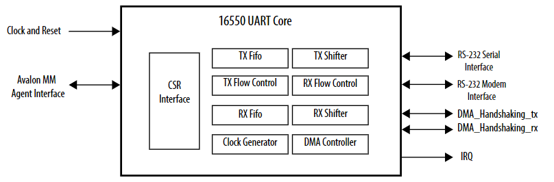
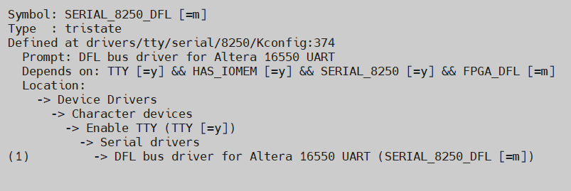

# **Altera 16550 Compatible UART Core Driver for Host Attach**

Last updated: **January 14, 2025** 

**Upstream Status**: [Upstreamed](https://git.kernel.org/pub/scm/linux/kernel/git/torvalds/linux.git/tree/drivers/tty/serial/8250/8250_dfl.c?h=master)

## **Introduction**

This driver for the 16550 Compatible UART Core to establish TTY communications to FPGA through PCIe.

## **16550 Compatible UART Core** 

The 16550 UART (Universal Asynchronous Receiver/Transmitter) soft IP core with Avalon® interface is designed to be register space compatible with the de-facto standard 16550 found in the PC industry. The core provides RS-232 Signaling interface, False start detection, Modem control signal and registers, Receiver error detection and Break character generation/detection. The core also has an Avalon® Memory-Mapped ( Avalon® -MM) agent interface that allows Avalon® -MM host peripherals (such as Nios® II and Nios® V processors) to communicate with the core simply by reading and writing control and data registers. For information regarding this soft IP core, please refer to the [Embedded Peripherals IP User Guide](https://www.intel.com/content/www/us/en/docs/programmable/683130/latest/fpga-16550-compatible-uart-core.html).

## **Driver Sources**

The GitHub source code for this driver can be found at [https://github.com/OFS/linux-dfl/blob/master/drivers/tty/serial/8250/8250_dfl.c](https://github.com/OFS/linux-dfl/blob/master/drivers/tty/serial/8250/8250_dfl.c).

The Upstream source code for this driver can be found at [https://git.kernel.org/pub/scm/linux/kernel/git/torvalds/linux.git/tree/drivers/tty/serial/8250/8250_dfl.c?h=master](https://git.kernel.org/pub/scm/linux/kernel/git/torvalds/linux.git/tree/drivers/tty/serial/8250/8250_dfl.c?h=master).

## **Driver Capabilities**

* Establishes serial connection with FPGA.

## **Kernel Configurations**
 
CONFIG_SERIAL_8250_DFL

## **Known Issues**

None known

## **Example Designs**

This driver is used in the [PCIe Attach shell designs for Agilex 7](https://github.com/OFS/ofs-agx7-pcie-attach).  Please refer to [site](https://ofs.github.io/) for more information about these designs.

## Notices & Disclaimers

Altera&reg; Corporation technologies may require enabled hardware, software or service activation.
No product or component can be absolutely secure. 
Performance varies by use, configuration and other factors.
Your costs and results may vary. 
You may not use or facilitate the use of this document in connection with any infringement or other legal analysis concerning Altera or Intel products described herein. You agree to grant Altera Corporation a non-exclusive, royalty-free license to any patent claim thereafter drafted which includes subject matter disclosed herein.
No license (express or implied, by estoppel or otherwise) to any intellectual property rights is granted by this document, with the sole exception that you may publish an unmodified copy. You may create software implementations based on this document and in compliance with the foregoing that are intended to execute on the Altera or Intel product(s) referenced in this document. No rights are granted to create modifications or derivatives of this document.
The products described may contain design defects or errors known as errata which may cause the product to deviate from published specifications.  Current characterized errata are available on request.
Altera disclaims all express and implied warranties, including without limitation, the implied warranties of merchantability, fitness for a particular purpose, and non-infringement, as well as any warranty arising from course of performance, course of dealing, or usage in trade.
You are responsible for safety of the overall system, including compliance with applicable safety-related requirements or standards. 
&copy; Altera Corporation.  Altera, the Altera logo, and other Altera marks are trademarks of Altera Corporation.  Other names and brands may be claimed as the property of others. 

OpenCL* and the OpenCL* logo are trademarks of Apple Inc. used by permission of the Khronos Group™. 