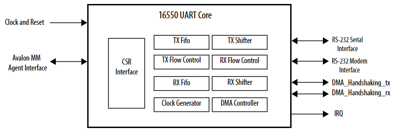
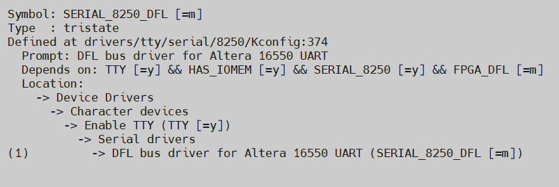

# **Altera 16550 Compatible UART Core Driver for Host Attach**

Last updated: **September 30, 2026** 

**Upstream Status**: [Upstreamed](https://git.kernel.org/pub/scm/linux/kernel/git/torvalds/linux.git/tree/drivers/tty/serial/8250/8250_dfl.c?h=master)

## **Introduction**

This driver for the 16550 Compatible UART Core to establish TTY communications to FPGA through PCIe.

## **16550 Compatible UART Core** 

The 16550 UART (Universal Asynchronous Receiver/Transmitter) soft IP core with Avalon® interface is designed to be register space compatible with the de-facto standard 16550 found in the PC industry. The core provides RS-232 Signaling interface, False start detection, Modem control signal and registers, Receiver error detection and Break character generation/detection. The core also has an Avalon® Memory-Mapped ( Avalon® -MM) agent interface that allows Avalon® -MM host peripherals (such as Nios® II and Nios® V processors) to communicate with the core simply by reading and writing control and data registers. For information regarding this soft IP core, please refer to the [Embedded Peripherals IP User Guide](https://www.intel.com/content/www/us/en/docs/programmable/683130/latest/fpga-16550-compatible-uart-core.html).

## **Driver Sources**

The GitHub source code for this driver can be found at [https://github.com/OFS/linux-dfl/blob/master/drivers/tty/serial/8250/8250_dfl.c](https://github.com/OFS/linux-dfl/blob/master/drivers/tty/serial/8250/8250_dfl.c).

The Upstream source code for this driver can be found at [https://git.kernel.org/pub/scm/linux/kernel/git/torvalds/linux.git/tree/drivers/tty/serial/8250/8250_dfl.c?h=master](https://git.kernel.org/pub/scm/linux/kernel/git/torvalds/linux.git/tree/drivers/tty/serial/8250/8250_dfl.c?h=master).

## **Driver Capabilities**

* Establishes serial connection with FPGA.

## **Kernel Configurations**
 
CONFIG_SERIAL_8250_DFL

## **Known Issues**

None known

## **Example Designs**

This driver is used in the [PCIe Attach shell designs for Agilex 7](https://github.com/OFS/ofs-agx7-pcie-attach).  Please refer to [site](https://ofs.github.io/) for more information about these designs.

