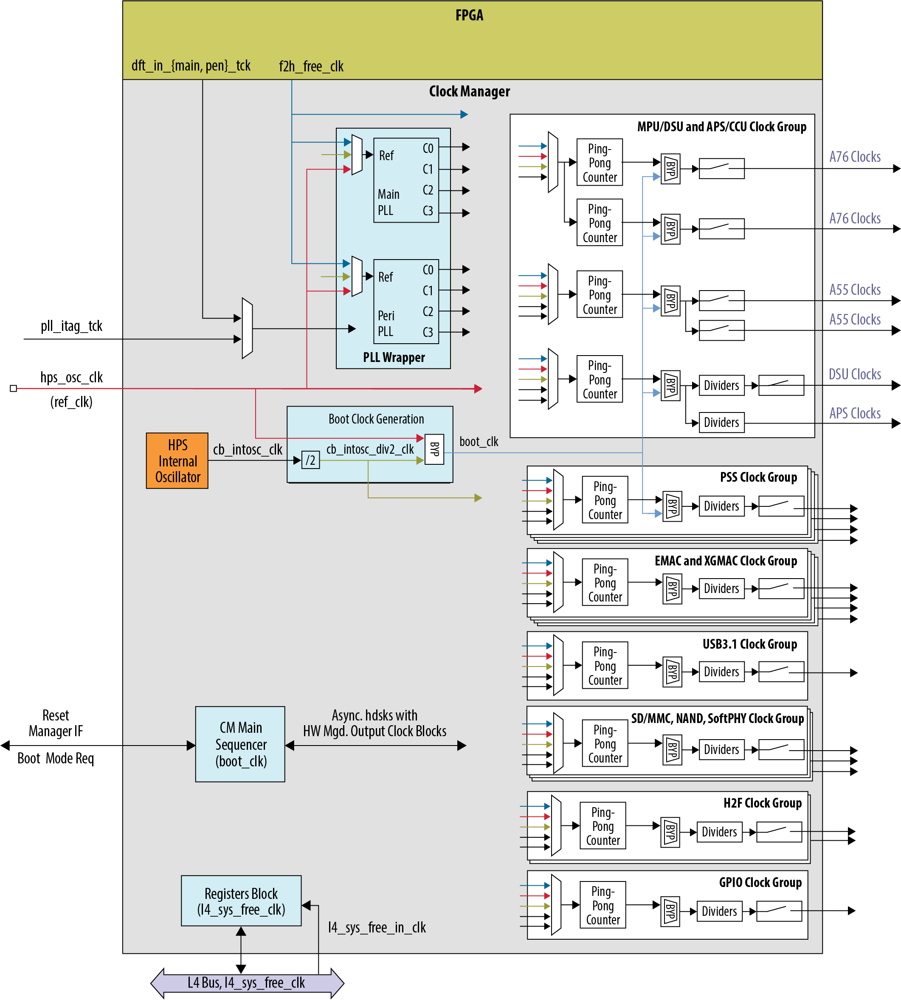
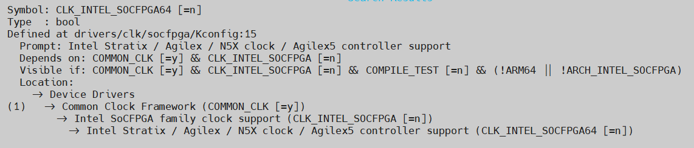

# **Clock Manager Driver for Hard Processor System**

Last updated: **May 25, 2024** 

**Upstream Status**: No

**Devices supported**: Agilex 5

## **Introduction**

Hard Processor System (HPS) clock generation is centralized in the clock manager. The clock manager is responsible for providing software-programmable clock control to configure all clocks generated in the HPS. Clocks are organized into clock groups.

A clock group is a set of clock signals that originate from the same clock source which may be synchronous to each other. The Clock Manager has a two Phase-Locked Loop (PLL) clock group where the clock source is a common PLL voltage-controlled oscillator (VCO). A clock group which is independent and asynchronous to other clocks may only have a single clock, also known as clock slice. Peripheral clocks are a group of independent clock slices.

For more information please refer to the [Intel Agilex 5 Hard Processor System Technical Reference Manual](https://www.intel.com/content/www/us/en/docs/programmable/814346).

{: style="height:650px"}

## **Features**

* Generates and manages clocks in the HPS.
* Contains two flexible PLL blocks Main PLL and Peripheral PLL.
* Generates clock gate controls for enabling and disabling most of the clocks.
* Allows software to program clock characteristics.
* Supports interrupting the Cortex-A53 MPCore on PLL-lock and loss-of-lock.

## **Driver Sources**

The source code for this driver can be found at [https://github.com/altera-opensource/linux-socfpga/blob/socfpga-6.1.55-lts/drivers/clk/socfpga/clk-agilex5.c](https://github.com/altera-opensource/linux-socfpga/blob/socfpga-6.1.55-lts/drivers/clk/socfpga/clk-agilex5.c).

## **Driver Capabilities**

* Support to configure peripherals clock through common clock framework.
* Support to enable or disable software-managed clocks.

## **Kernel Configurations**

CONFIG_CLK_INTEL_SOCFPGA64

## **Device Tree**

Example Device tree location:

[https://git.kernel.org/pub/scm/linux/kernel/git/torvalds/linux.git/tree/arch/arm64/boot/dts/intel/socfpga_agilex5.dtsi](https://git.kernel.org/pub/scm/linux/kernel/git/torvalds/linux.git/tree/arch/arm64/boot/dts/intel/socfpga_agilex5.dtsi)

Also dt-bindings can be found at:

[https://github.com/altera-opensource/linux-socfpga/blob/socfpga-6.1.55-lts/include/dt-bindings/clock/agilex5-clock.h](https://github.com/altera-opensource/linux-socfpga/blob/socfpga-6.1.55-lts/include/dt-bindings/clock/agilex5-clock.h)

## **Known Issues**

None known

## Notices & Disclaimers

Altera&reg; Corporation technologies may require enabled hardware, software or service activation.
No product or component can be absolutely secure. 
Performance varies by use, configuration and other factors.
Your costs and results may vary. 
You may not use or facilitate the use of this document in connection with any infringement or other legal analysis concerning Altera or Intel products described herein. You agree to grant Altera Corporation a non-exclusive, royalty-free license to any patent claim thereafter drafted which includes subject matter disclosed herein.
No license (express or implied, by estoppel or otherwise) to any intellectual property rights is granted by this document, with the sole exception that you may publish an unmodified copy. You may create software implementations based on this document and in compliance with the foregoing that are intended to execute on the Altera or Intel product(s) referenced in this document. No rights are granted to create modifications or derivatives of this document.
The products described may contain design defects or errors known as errata which may cause the product to deviate from published specifications.  Current characterized errata are available on request.
Altera disclaims all express and implied warranties, including without limitation, the implied warranties of merchantability, fitness for a particular purpose, and non-infringement, as well as any warranty arising from course of performance, course of dealing, or usage in trade.
You are responsible for safety of the overall system, including compliance with applicable safety-related requirements or standards. 
&copy; Altera Corporation.  Altera, the Altera logo, and other Altera marks are trademarks of Altera Corporation.  Other names and brands may be claimed as the property of others. 

OpenCL and the OpenCL logo are trademarks of Apple Inc. used by permission of the Khronos Group™. 