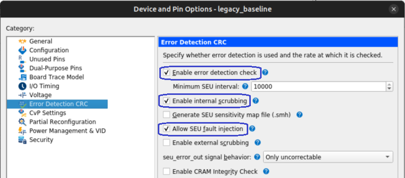

# **Altera Error Detection and Correction (EDAC) Driver for Hard Processor System**

Last updated: **January 23, 2026** 

**Upstream Status**: [Upstreamed](https://git.kernel.org/pub/scm/linux/kernel/git/torvalds/linux.git/tree/drivers/edac/altera_edac.c)

**Devices supported**: Agilex™ 3, Agilex™ 5, Agilex™ 7 and Stratix® 10

## **Introduction**

The Altera Error Detection and Correction (EDAC) driver supports use of the Error Checking and Correction (ECC) Controller in the HPS.  The ECC controllers are implemented in different components in the HPS including on-chip RAM, USB OTG 2.0 and 3.1, SDM QSPI, SDRAM, IO96B, SDMMC and Ethernet MACs in the HPS.  To find out more about the ECC controller please refer to the device specific Hard Processor Technical Reference Manual.

* [Agilex™ 3 Hard Processor Technical Reference Manual](https://www.intel.com/content/www/us/en/docs/programmable/848530)
* [Agilex™ 5 Hard Processor Technical Reference Manual](https://www.intel.com/content/www/us/en/docs/programmable/814346).
* [Agilex™ 7 Hard Processor Technical Reference Manual](https://www.intel.com/content/www/us/en/docs/programmable/683567/)
* [Stratix® 10 Hard Processor Technical Reference Manual](https://www.intel.com/content/www/us/en/docs/programmable/683222)

{: style="height:500px"}

## **Driver Sources**

The source code for the Altera EDAC driver can be found at [https://git.kernel.org/pub/scm/linux/kernel/git/torvalds/linux.git/tree/drivers/edac/altera_edac.c](https://git.kernel.org/pub/scm/linux/kernel/git/torvalds/linux.git/tree/drivers/edac/altera_edac.c).

## **Driver Capabilities**

The Altera Error Detection and Correction (EDAC) driver comprises the ECC manager main component and sub-components of the supported EDAC SoC components.

The driver's main functions are to register the EDAC platform drivers in Linux, initialize the EDAC sub-components by performing initial setup of the IRQ interrupt handlers and soft-error handling for uncorrected error events, and to support debugging features like soft-error injections and reads of the error counters.

The data flow diagram of EDAC is shown below:


## **Kernel and Device Tree Configurations**

CONFIG_EDAC_ALTERA


For debug purposes, the **CONFIG_EDAC_DEBUG Kernel** configuration can be used.

There are independent Kernel configuration for each of the components in whcih the ECC controller can operate. Also there are some 'compatibles' that are related to these Kernel configuration that need to be used in the ECC Manager node in the device tree. The following table indicates what are the Kernel configs and 'compatibles' needed for each hardware component and if this is available in each one of the devices.

| **Component**  | **Kernel Config** | **Compatible** | **Agilex™ 5/Agilex™ 3** | **Agilex™ 7** | **Stratix® 10** |
| ------------------- | ----------------------------- | -------------------------------- | ----------------------------- | ----------------------------- | ----------------------------- | 
| ECC Manager(1) | CONFIG_EDAC_ALTERA | altr,socfpga-a10-ecc-manager<br>altr,socfpga-s10-ecc-manager | Yes<br>No | Yes<br>Yes | Yes<br>Yes |
| OCRAM | CONFIG_EDAC_ALTERA_OCRAM | altr,socfpga-a10-ocram-ecc | Yes | Yes | Yes |
| ETHERNET | CONFIG_EDAC_ALTERA_ETHERNET | altr,socfpga-eth-mac-ecc | Yes | Yes | Yes |
| USB | CONFIG_EDAC_ALTERA_USB | altr,socfpga-usb-ecc<br>altr,socfpga-agilex5-usb3-ecc | Yes<br>Yes |  Yes<br>No | Yes<br>No |
| SDM QSPI | CONFIG_EDAC_ALTERA_SDM_QSPI | altr,socfpga-sdm-qspi-ecc | Yes | No | No |
| SDMMC | CONFIG_EDAC_ALTERA_SDMMC | altr,socfpga-sdmmc-ecc | No | Yes | Yes |
| SDRAM | CONFIG_EDAC_ALTERA_SDRAM | altr,sdram-edac-s10 | No | Yes | Yes |
| IO96B | CONFIG_EDAC_ALTERA_IO96B | altr,socfpga-io96b0-ecc<br>altr,socfpga-io96b1-ecc | Yes | No | No |
| CRAM SEU(2)(3) | CONFIG_EDAC_ALTERA_CRAM_SEU | altr,socfpga-cram-seu | Yes | Yes | Yes |

**(1) Note:** The ECC manager is always needed as this is part of the Altera EDAC driver.

**(2) Note:** The CRAM SEU component requires a specific hardware design configuration as shown in the following capture from Quartus Device Configuration:



**(3) Note:** For Agilex™ 7 CRAM SEU Data Injection, please refer to [4.7. Fault Injection and Read EMQ via HPS](https://www.intel.com/content/www/us/en/docs/programmable/683128/25-3/fault-injection-and-read-emq-via-hps.html). For Agilex™ 5 and Agilex™ 3 the similar documentation will be available soon.

The reference device tree for each one of the devices includes the configuration for the ECC manager and the supported components. This configuration is under the **eccmgr** node. 


* Agilex™ 5/Agilex™ 3: [socfpga_agilex5.dtsi](https://github.com/altera-fpga/linux-socfpga/blob/socfpga-6.12.43-lts/arch/arm64/boot/dts/intel/socfpga_agilex5.dtsi)
* Agilex™ 7: [socfpga_agilex.dtsi](https://github.com/altera-fpga/linux-socfpga/blob/socfpga-6.12.43-lts/arch/arm64/boot/dts/intel/socfpga_agilex.dtsi)
* Stratix® 10: [socfpga_stratix10.dtsi](https://github.com/altera-fpga/linux-socfpga/blob/socfpga-6.12.43-lts/arch/arm64/boot/dts/altera/socfpga_stratix10.dtsi)


## **Test Procedure**

**Note:** The examples shown in this section correspond to exercise the the Altera EDAC driver in Agilex™ 5 device, but the same applies for other devices.

### Error Injection

When the Kernel and Device tree are built with the configuration described in the table above, you can interact with the Altera EDAC driver to inject errors from the User Space using the devices created under **/sys/kernel/debug/edac/** directory:

```bash
  root@agilex5_dk_a5e065bb32aes1:~# cd /sys/kernel/debug/edac/
  root@agilex5_dk_a5e065bb32aes1:/sys/kernel/debug/edac# ls
  cram-seu        emac2-tx-ecc    sdm-qspi-ecc    usb1-rx-ecc
  emac2-rx-ecc    io96b0-ecc      usb1-cache-ecc  usb1-tx-ecc
```

Each one of these includes a **altr_trigger** file. When writng  **U** or **C** to this file, an Uncorrectable(U) or Correctable(C) error is triggered as shown next. By the time an error is injected into a component, a message is shown as consequence of the error detection. Next are shown some examples of the exercise of Error injection:

**CRAM SEU**
```bash
  root@agilex5_dk_a5e065bb32aes1:/sys/kernel/debug/edac# echo C > ./cram-seu/altr_trigger
  [   66.287002] EDAC Altera: SEU CE: Count=0x1, SecAddr=0x30000, ErrData=0x300700C8
  root@agilex5_dk_a5e065bb32aes1:/sys/kernel/debug/edac# echo U > ./cram-seu/altr_trigger 
  [  326.288594] EDAC Altera: SEU UE: Count=0x1, SecAddr=0x30000, ErrData=0x60000000
```
  For this component, it takes few seconds to show the errors detected.

**ETHERNET**

```bash
  root@agilex5_dk_a5e065bb32aes1:/sys/kernel/debug/edac# echo C > ./emac2-rx-ecc/altr_trigger 
  [  137.450919] EDAC DEVICE1: CE: Altera ECC Manager instance: emac2-rx-ecc0 block: emac2-rx-ecc0 count: 1 'emac2-rx-ecc'
  root@agilex5_dk_a5e065bb32aes1:/sys/kernel/debug/edac# echo C > ./emac2-tx-ecc/altr_trigger 
  [  147.089533] EDAC DEVICE2: CE: Altera ECC Manager instance: emac2-tx-ecc0 block: emac2-tx-ecc0 count: 1 'emac2-tx-ecc'
  root@agilex5_dk_a5e065bb32aes1:/sys/kernel/debug/edac# echo U > ./emac2-rx-ecc/altr_trigger 
  [  158.906016] EDAC DEVICE1: UE: Altera ECC Manager instance: emac2-rx-ecc0 block: emac2-rx-ecc0 count: 1 'emac2-rx-ecc'
  root@agilex5_dk_a5e065bb32aes1:/sys/kernel/debug/edac# echo U > ./emac2-tx-ecc/altr_trigger 
  [  165.538481] EDAC DEVICE2: UE: Altera ECC Manager instance: emac2-tx-ecc0 block: emac2-tx-ecc0 count: 1 'emac2-tx-ecc'
```

**IO96B0:**
```bash
  root@agilex5_dk_a5e065bb32aes1:/sys/kernel/debug/edac# echo C > ./io96b0-ecc/altr_trigger 
  [  261.437610] EDAC Altera: io96b0-ecc: SBE: word0:0x00400200, word1:0x00000000
  root@agilex5_dk_a5e065bb32aes1:/sys/kernel/debug/edac# [  261.444686] EDAC DEVICE6: CE: Altera ECC Manager instance: io96b0-ecc0 block: io96b0-ecc0 count: 1 'io96b0-ecc'
  root@agilex5_dk_a5e065bb32aes1:/sys/kernel/debug/edac# echo U > ./io96b0-ecc/altr_trigger 
  root@agilex5_dk_a5e065bb32aes1:/sys/kernel/debug/edac# echo U > ./io96b0-ecc/altr_trigger 
  [  294.514052] EDAC Altera: io96b0-ecc: DBE: word0:0x00406080, word1:0x00012FC0
  [  294.521119] Kernel panic - not syncing: 
  [  294.521119] EDAC:IO96B[Uncorrectable errors]
  [  294.529274] CPU: 0 UID: 0 PID: 71 Comm: irq/47-io96b0-e Not tainted 6.12.33-g3234b1ed8956-dirty #12
  [  294.538289] Hardware name: SoCFPGA Agilex5 SoCDK (DT)
  [  294.543323] Call trace:
  [  294.545763]  dump_backtrace.part.0+0xd4/0xe0
  [  294.550064]  show_stack+0x18/0x30
  [  294.553376]  dump_stack_lvl+0x60/0x80
  [  294.557049]  dump_stack+0x18/0x24
  [  294.560358]  panic+0x168/0x360
  [  294.563418]  altr_edac_io96b_device_trig+0x0/0x234
  [  294.568207]  irq_thread_fn+0x2c/0xa8
  [  294.571793]  irq_thread+0x170/0x300
  [  294.575276]  kthread+0x110/0x120
  [  294.578514]  ret_from_fork+0x10/0x20
  [  294.582089] SMP: stopping secondary CPUs
  [  294.586011] Kernel Offset: disabled
  [  294.589486] CPU features: 0x18,00000007,00280928,4200720b
  [  294.594867] Memory Limit: none
  [  294.597985] ---[ end Kernel panic - not syncing: 
  [  294.597985] EDAC:IO96B[Uncorrectable errors] ]---
```
In the error messages displayed, there are 2 fields referred as **word0** and **word1** whose meaning is this:

 * **word0:** ECC error information
 * **word1:** Lower 32 bits of the ECC error address

In the case of Uncorrectable errors in IO96B component, it is needed to trigger 2 errors to observe the error detection. After this, the system crashes as this is considered a catastrophic error.  

### Error Count

You can retrieve the number of Correctable or Uncorrectable ECC errors detected in each of the components using the **ce_count**(Correctable) and **ue_count**(Uncorrectable) files located at **/sys/devices/system/edac/&lt;component&gt;/&lt;component#&gt;/** path.

```bash
  root@agilex5_dk_a5e065bb32aes1: /home/root/# cd /sys/devices/system/edac
  root@agilex5_dk_a5e065bb32aes1:/sys/devices/system/edac# ls
  cram-seu        emac2-tx-ecc    mc              sdm-qspi-ecc    usb1-cache-ecc  usb1-tx-ecc
  emac2-rx-ecc    io96b0-ecc      power           uevent          usb1-rx-ecc
```

The following captures demonstrate an example of retreiven the error count.

**CRAM SEU**
```bash
  root@agilex5_dk_a5e065bb32aes1:/sys/devices/system/edac# cat ./cram-seu/cram-seu0/ce_count 
  2
  root@agilex5_dk_a5e065bb32aes1:/sys/devices/system/edac# cat ./cram-seu/cram-seu0/ue_count
  17
```

**ETHERNET**
```bash
  root@agilex5_dk_a5e065bb32aes1:/sys/devices/system/edac# cat emac2-rx-ecc/emac2-rx-ecc0/ce_count
  2
  root@agilex5_dk_a5e065bb32aes1:/sys/devices/system/edac# cat emac2-rx-ecc/emac2-rx-ecc0/ue_count
  3  
  root@agilex5_dk_a5e065bb32aes1:/sys/devices/system/edac# cat emac2-tx-ecc/emac2-tx-ecc0/ce_count
  3
  root@agilex5_dk_a5e065bb32aes1:/sys/devices/system/edac# cat emac2-tx-ecc/emac2-tx-ecc0/ue_count
  4
```

**IO96B0:**
```bash
  root@agilex5_dk_a5e065bb32aes1:/sys/devices/system/edac# cat ./io96b0-ecc/io96b0-ecc0/ce_count 
  3
  root@agilex5_dk_a5e065bb32aes1:/sys/devices/system/edac# cat ./io96b0-ecc/io96b0-ecc0/ue_count 
  0
```


## **Known Issues**

 * The ECC error injection for OCRAM component in Agilex™ 5 is only supported in production devices. For Engineering samples ECC error injection is not suppoered. This is documented as an Errata in [2.1.9. The On-Chip RAM Error Check and Correction (ECC) error injection will not work when using the Linux Altera EDAC driver](https://www.intel.com/content/www/us/en/docs/programmable/825514/current/the-on-chip-ram-error-check-and-correction.html).

## Notices & Disclaimers

Altera<sup>&reg;</sup> Corporation technologies may require enabled hardware, software or service activation.
No product or component can be absolutely secure. 
Performance varies by use, configuration and other factors.
Your costs and results may vary. 
You may not use or facilitate the use of this document in connection with any infringement or other legal analysis concerning Altera or Intel products described herein. You agree to grant Altera Corporation a non-exclusive, royalty-free license to any patent claim thereafter drafted which includes subject matter disclosed herein.
No license (express or implied, by estoppel or otherwise) to any intellectual property rights is granted by this document, with the sole exception that you may publish an unmodified copy. You may create software implementations based on this document and in compliance with the foregoing that are intended to execute on the Altera or Intel product(s) referenced in this document. No rights are granted to create modifications or derivatives of this document.
The products described may contain design defects or errors known as errata which may cause the product to deviate from published specifications.  Current characterized errata are available on request.
Altera disclaims all express and implied warranties, including without limitation, the implied warranties of merchantability, fitness for a particular purpose, and non-infringement, as well as any warranty arising from course of performance, course of dealing, or usage in trade.
You are responsible for safety of the overall system, including compliance with applicable safety-related requirements or standards. 
<sup>&copy;</sup> Altera Corporation.  Altera, the Altera logo, and other Altera marks are trademarks of Altera Corporation.  Other names and brands may be claimed as the property of others. 

OpenCL* and the OpenCL* logo are trademarks of Apple Inc. used by permission of the Khronos Group™. 
