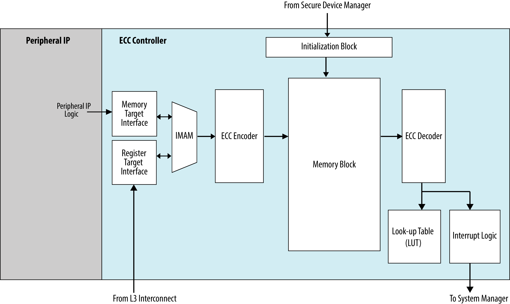
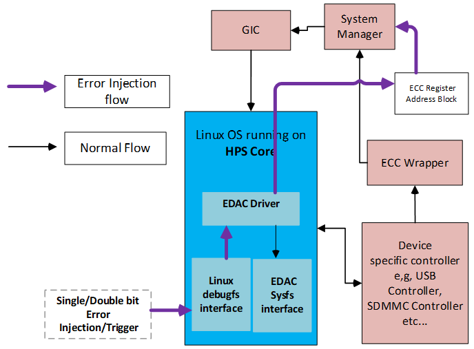
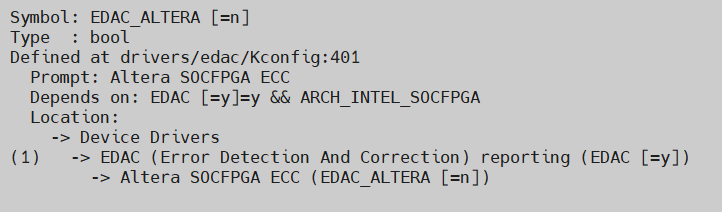

# **Error Detection and Correction (EDAC) Driver for Hard Processor System**

Last updated: **September 11, 2025** 

**Upstream Status**: [Upstreamed](https://git.kernel.org/pub/scm/linux/kernel/git/torvalds/linux.git/tree/drivers/edac/altera_edac.c)

**Devices supported**: Agilex3, Agilex 5

## **Introduction**

The Error Detection and Correction (EDAC) driver supports use of the Error Checking and Correction (ECC) Controller in the HPS.  The ECC controllers are implemented in the on-chip RAM, USB OTG 2.0 and 3.1 and Ethernet MACs in the HPS.  To find out more about the ECC controller please refer to the [Hard Processor Technical Reference Manual](https://www.intel.com/content/www/us/en/docs/programmable/814346).

{: style="height:500px"}

## **Driver Sources**

The source code for the driver can be found at [https://git.kernel.org/pub/scm/linux/kernel/git/torvalds/linux.git/tree/drivers/edac/altera_edac.c](https://git.kernel.org/pub/scm/linux/kernel/git/torvalds/linux.git/tree/drivers/edac/altera_edac.c).

## **Driver Capabilities**

The Error Detection and Correction (EDAC) driver comprises the ECC manager main component and sub-components of the supported EDAC SoC components.

The driver's main functions are to register the EDAC platform drivers in Linux, initialize the EDAC sub-components by performing initial setup of the IRQ interrupt handlers and soft-error handling for uncorrected error events, and to support debugging features like soft-error injections and reads of the error counters.

The data flow diagram of EDAC is shown below:

## **Kernel Configurations**

CONFIG_EDAC_ALTERA

## **Known Issues**

None known

## Notices & Disclaimers

Altera&reg; Corporation technologies may require enabled hardware, software or service activation.
No product or component can be absolutely secure. 
Performance varies by use, configuration and other factors.
Your costs and results may vary. 
You may not use or facilitate the use of this document in connection with any infringement or other legal analysis concerning Altera or Intel products described herein. You agree to grant Altera Corporation a non-exclusive, royalty-free license to any patent claim thereafter drafted which includes subject matter disclosed herein.
No license (express or implied, by estoppel or otherwise) to any intellectual property rights is granted by this document, with the sole exception that you may publish an unmodified copy. You may create software implementations based on this document and in compliance with the foregoing that are intended to execute on the Altera or Intel product(s) referenced in this document. No rights are granted to create modifications or derivatives of this document.
The products described may contain design defects or errors known as errata which may cause the product to deviate from published specifications.  Current characterized errata are available on request.
Altera disclaims all express and implied warranties, including without limitation, the implied warranties of merchantability, fitness for a particular purpose, and non-infringement, as well as any warranty arising from course of performance, course of dealing, or usage in trade.
You are responsible for safety of the overall system, including compliance with applicable safety-related requirements or standards. 
&copy; Altera Corporation.  Altera, the Altera logo, and other Altera marks are trademarks of Altera Corporation.  Other names and brands may be claimed as the property of others. 

OpenCL* and the OpenCL* logo are trademarks of Apple Inc. used by permission of the Khronos Group™. 
