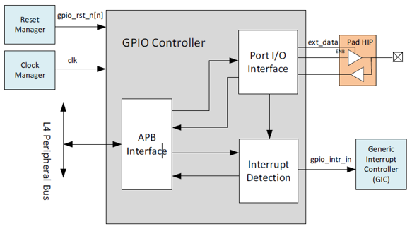
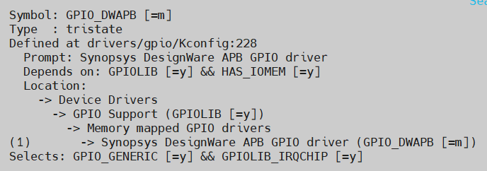
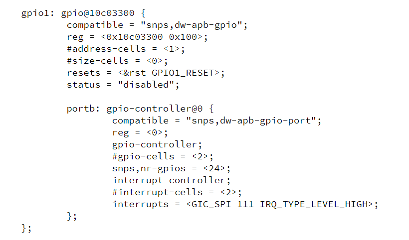

# **General Purpose I/O Driver for Hard Processor System**

Last updated: **June 21, 2025** 

**Upstream Status**: [Upstreamed](https://git.kernel.org/pub/scm/linux/kernel/git/torvalds/linux.git/tree/drivers/gpio/gpio-dwapb.c)

**Devices supported**: Agilex 5, Agilex 7

## **Introduction**

The Hard Processor System (HPS) provides two General-Purpose I/O (GPIO) interface modules.

The GPIO interface supports Digital debounce, configurable interrupt mode, and has up to 48 dedicated I/O pins. For more information please refer to the [Agilex 5 Hard Processor System Technical Reference Manual](https://www.intel.com/content/www/us/en/docs/programmable/814346).

The figure below shows a block diagram of the GPIO interface:



## **Driver Sources**

The source code for this driver can be found at [https://git.kernel.org/pub/scm/linux/kernel/git/torvalds/linux.git/tree/drivers/gpio/gpio-dwapb.c](https://git.kernel.org/pub/scm/linux/kernel/git/torvalds/linux.git/tree/drivers/gpio/gpio-dwapb.c).

## **Driver Capabilities**

* GPIO muxed between I2C and SPI.
* Interrupt propagation between the device and logic on board.
* Control other circuitry on board.
* Digital debounce.
* Configurable interrupt mode.

## **Kernel Configurations**
 CONFIG_GPIO_DWAPB



## **Device Tree**

Example Device tree location:

[https://git.kernel.org/pub/scm/linux/kernel/git/torvalds/linux.git/tree/arch/arm64/boot/dts/intel/socfpga_agilex5.dtsi](https://git.kernel.org/pub/scm/linux/kernel/git/torvalds/linux.git/tree/arch/arm64/boot/dts/intel/socfpga_agilex5.dtsi)



## Test Procedure

In the following sub-sections are described  some common GPIO operations that are performed through the GPIO driver. These are exercised from the Linux shell once the GPIO driver has been probed. The test procedures are exercised using the **/sys/class/gpio** interface.

This test procedure was exercised on Agilex 5 E-Series Premium Development Kit using the [GSRD for HPS Enablement Board (booting from SD Card)  from 24.3.1 release](https://altera-fpga.github.io/rel-24.3.1/embedded-designs/agilex-5/e-series/premium/gsrd/ug-gsrd-agx5e-premium/#build-sd-card-boot-binaries) which uses Linux Kernel 6.6.51.

When the driver has been initialized you will se the following under this GPIO interface:

```sh
  ls /sys/class/gpio/
export	gpiochip512  gpiochip536  gpiochip560  gpiochip592  gpiochip624  unexport

```

**NOTE:** You can determine which GPIOs are available using the information provided by the **gpiochipXYZ** directories  included in the **/sys/class/interface** interface. Each one of the **gpiochipXYZ** represents a GPIO controller. In the following example you can see that the GPIO controller referred as **gpiochip512** starts in the GPIO 512 and is extended to 24 pins going from 512 to 535 using the information provided by **base** and **ngpio**. You can also see which is the base address of this GPIO controller in the memory map using the information in **label**.


  ```sh
  ls /sys/class/gpio/gpiochip512/          
  base       device/    label      ngpio      power/     subsystem/ uevent
  cat /sys/class/gpio/gpiochip512/base
  512
  cat /sys/class/gpio/gpiochip512/ngpio 
  24  
  cat /sys/class/gpio/gpiochip512/label 
  10c03200.gpio    
  ```

 

### Step 1: Export a GPIO Pin

1. **Export a GPIO Pin**: You export a pin to make it available to the user for control through the **/sys/class/gpio/** interface. Use the `echo` command to export a GPIO pin. For example, to export GPIO pin 512:

  ```sh
  echo 512 > /sys/class/gpio/export
  ls /sys/class/gpio
  export	gpio512  gpiochip512  gpiochip536  gpiochip560	gpiochip592  gpiochip624  unexport
  ls /sys/class/gpio/gpio512
  active_low  device  direction  edge  power  subsystem  uevent  value
  ```
  Observe that once the pin has been export, a new interface named **gpio512** is created. This provides additional interfaced under this that will help to configure, control and get information from this pin.


2. **Set Direction**: Set the direction of the GPIO pin to either input or output. To set it as an output:

  ```sh
  echo out > /sys/class/gpio/gpio512/direction
  ```

### Step 2: Toggle GPIO Pin Value

1. **Write a Value**: Write a value (either 0 or 1) to the GPIO pin. Set a value of 1:

  ```sh
  echo 1 > /sys/class/gpio/gpio512/value
  ```

2. **Read the Value**: Read back the current value of the GPIO pin.

  ```sh
  cat /sys/class/gpio/gpio512/value
  ```

3. **Toggle the value**: Change the value to the opposite and verify it.

  ```sh
  echo 0 > /sys/class/gpio/gpio512/value
  cat /sys/class/gpio/gpio512/value
  ```

### Step 3: Unexport the GPIO Pin

1. **Unexport the GPIO Pin**: After you are done, unexport the GPIO pin to free up resources.

  ```sh
  echo 512 > /sys/class/gpio/unexport
  ```

## **Known Issues**

None known

## Notices & Disclaimers

Altera<sup>&reg;</sup> Corporation technologies may require enabled hardware, software or service activation.
No product or component can be absolutely secure. 
Performance varies by use, configuration and other factors.
Your costs and results may vary. 
You may not use or facilitate the use of this document in connection with any infringement or other legal analysis concerning Altera or Intel products described herein. You agree to grant Altera Corporation a non-exclusive, royalty-free license to any patent claim thereafter drafted which includes subject matter disclosed herein.
No license (express or implied, by estoppel or otherwise) to any intellectual property rights is granted by this document, with the sole exception that you may publish an unmodified copy. You may create software implementations based on this document and in compliance with the foregoing that are intended to execute on the Altera or Intel product(s) referenced in this document. No rights are granted to create modifications or derivatives of this document.
The products described may contain design defects or errors known as errata which may cause the product to deviate from published specifications.  Current characterized errata are available on request.
Altera disclaims all express and implied warranties, including without limitation, the implied warranties of merchantability, fitness for a particular purpose, and non-infringement, as well as any warranty arising from course of performance, course of dealing, or usage in trade.
You are responsible for safety of the overall system, including compliance with applicable safety-related requirements or standards. 
<sup>&copy;</sup> Altera Corporation.  Altera, the Altera logo, and other Altera marks are trademarks of Altera Corporation.  Other names and brands may be claimed as the property of others. 

OpenCL* and the OpenCL* logo are trademarks of Apple Inc. used by permission of the Khronos Group™. 
