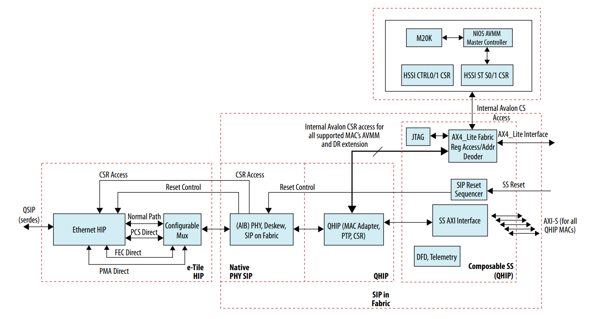
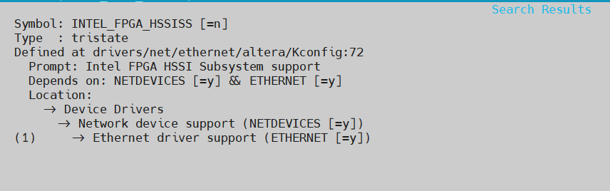
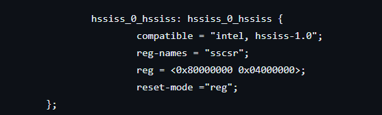

# **Ethernet Subsystem (HSSI) Driver for Hard Processor System**

Last updated: **January 08, 2026** 

**Upstream Status**: Not Upstreamed

**Devices supported**: Agilex 7

## **Introduction**

The Ethernet Subsystem FPGA IP driver acts as a bridge between the software operating in the HPS and the Ethernet Subsystem within the FPGA. It provides various levels of abstraction to simplify communication with the underlying Ethernet Subsystem IP. The Ethernet Subsystem driver exposes Ethernet `netdev` driver APIs that higher-level software layers can utilize to interact with the Ethernet Subsystem IP

## **Ethernet Subsystem FPGA IP**

The Ethernet Subsystem FPGA IP is a subsystem IP that includes a configurable,
Media Access Control (MAC) and Physical Coding Sublayer (PCS) presenting a
consistent interface to user logic. It consists of 20 ports. Depending on the tile chosen,
each port is implemented based on either the Agilex® 7 E-Tile Hard IP for
Ethernet FPGA IP Core or the F-Tile Hard IP for Ethernet FPGA IP core.

This IP provides a seamless and fast way to instantiate a multi-port design, given that
it integrates the required discrete Hard IP and Soft IP ingredients. Furthermore, the
Subsystem IP provides a user interface to facilitate enabling required features and
parameters of operation.

For E-Tile, this subsystem IP provides Ethernet data rate profiles of 10Gbps, 25Gbps,
and 100Gbps with optional RS-FEC and 1588 Precision Time Protocol (PTP). The
subsystem also provides profiles for PCS, OTN, FlexE and CPRI.

For F-Tile, this subsystem IP provides Ethernet data rate profiles of 10Gbps, 25Gbps,
40Gbps, 50Gbps, 100Gbps, 200Gbps, and 400Gbps with optional RS-FEC and 1588
Precision Time Protocol (PTP). Quartus® Prime software version 23.2 supports
only Media Access Control (MAC) and Physical Coding Sublayer (PCS) sub-profile.

For more information please refer to the [Ethernet Subsystem FPGA IP User Guide](https://www.intel.com/content/www/us/en/docs/programmable/773413/23-4-24-0-0/introduction.html).

## **Driver Sources**

The source code for this driver can be found at:

[https://github.com/altera-opensource/linux-socfpga/blob/socfpga-5.15.90-lts-ftile-1588ptp/drivers/net/ethernet/altera/intel_fpga_hssiss.c](https://github.com/altera-opensource/linux-socfpga/blob/socfpga-5.15.90-lts-ftile-1588ptp/drivers/net/ethernet/altera/intel_fpga_hssiss.c)

## **Driver Capabilities**

* Get Link state.
* Get MAC stats. These abstractions are used by the HSSI ethernet netdev driver to provide ethernet functionality to the above layers.

## **Kernel Configurations**

CONFIG_INTEL_FPGA_HSSISS

## **Device Tree**

Example Device tree location to configure the HSSI:

[https://github.com/altera-opensource/linux-socfpga/blob/socfpga-5.15.90-lts-ftile-1588ptp/arch/arm64/boot/dts/intel/fm87_ftile_25g_2port_ptp.dtsi](https://github.com/altera-opensource/linux-socfpga/blob/socfpga-5.15.90-lts-ftile-1588ptp/arch/arm64/boot/dts/intel/fm87_ftile_25g_2port_ptp.dtsi)

## **Known Issues**

None known

## **Example Designs**

HSSI SS driver is used in the [Agilex 7 SoC F-Tile Design Example for 25/10 GbE with IEEE1588PTP](https://www.rocketboards.org/foswiki/Projects/Agilex7SoCFTileDesignExampleWithIEEE1588PTP25GE).

## Notices & Disclaimers

Altera&reg; Corporation technologies may require enabled hardware, software or service activation.
No product or component can be absolutely secure. 
Performance varies by use, configuration and other factors.
Your costs and results may vary. 
You may not use or facilitate the use of this document in connection with any infringement or other legal analysis concerning Altera or Intel products described herein. You agree to grant Altera Corporation a non-exclusive, royalty-free license to any patent claim thereafter drafted which includes subject matter disclosed herein.
No license (express or implied, by estoppel or otherwise) to any intellectual property rights is granted by this document, with the sole exception that you may publish an unmodified copy. You may create software implementations based on this document and in compliance with the foregoing that are intended to execute on the Altera or Intel product(s) referenced in this document. No rights are granted to create modifications or derivatives of this document.
The products described may contain design defects or errors known as errata which may cause the product to deviate from published specifications.  Current characterized errata are available on request.
Altera disclaims all express and implied warranties, including without limitation, the implied warranties of merchantability, fitness for a particular purpose, and non-infringement, as well as any warranty arising from course of performance, course of dealing, or usage in trade.
You are responsible for safety of the overall system, including compliance with applicable safety-related requirements or standards. 
&copy; Altera Corporation.  Altera, the Altera logo, and other Altera marks are trademarks of Altera Corporation.  Other names and brands may be claimed as the property of others. 

OpenCL* and the OpenCL* logo are trademarks of Apple Inc. used by permission of the Khronos Group™. 
