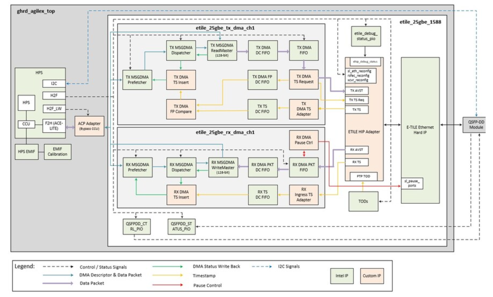

# **Ethernet Subsystem Intel FPGA IP Tile Specific Ethernet MAC Driver for Hard Processor System**

Last updated: **July 18, 2025** 

**Upstream Status**: Not Upstreamed

**Devices supported**: Agilex 7

## **Introduction**

The Ethernet MAC driver is used to manage the configuration parameters of the particular tile. It currently supports F-tile and E-tile of the Ethernet Subsystem Intel FPGA IP

## **F-tile and E-tile FPGA IP**

To get more information on F-tile Hard IP please refer to the [F-tile Architecture and PMA and FEC Direct PHY IP User Guide](https://www.intel.com/content/www/us/en/docs/programmable/683872/23-4-4-7-0/f-tile-overview.html).

And for E-tile Hard IP please refer to the [E-Tile Hard IP User Guide: E-Tile Hard IP for Ethernet and E-Tile CPRI PHY IPs](https://www.intel.com/content/www/us/en/docs/programmable/683468/23-2/intel-fpga-ip-overview.html).

## **Driver Sources**

The source code to generate `intel_fpga_hssi_xtile.o` can be found at the following directory location:

[https://github.com/altera-opensource/linux-socfpga/tree/socfpga-5.15.90-lts-ftile-1588ptp/drivers/net/ethernet/altera](https://github.com/altera-opensource/linux-socfpga/tree/socfpga-5.15.90-lts-ftile-1588ptp/drivers/net/ethernet/altera)

## **Driver Capabilities**

* To set the tile specific parameters, like enable support for interrupts, DMA and also the ethtool related configuration.

## **Kernel Configurations**

CONFIG_INTEL_FPGA_HSSI_XTILE

## **Device Tree**

Example of Device tree location to configure the hssi_xtile: 

[https://github.com/altera-opensource/linux-socfpga/blob/socfpga-5.15.90-lts-ftile-1588ptp/arch/arm64/boot/dts/intel/fm87_ftile_25g_2port_ptp.dtsi](https://github.com/altera-opensource/linux-socfpga/blob/socfpga-5.15.90-lts-ftile-1588ptp/arch/arm64/boot/dts/intel/fm87_ftile_25g_2port_ptp.dtsi)

## **Known Issues**

None known

## **Example Designs**

HSSI xtile (E-tile/F-tile) driver is used in the [Agilex 7 SoC F-Tile Design Example for 25/10 GbE with IEEE1588PTP](https://www.rocketboards.org/foswiki/Projects/Agilex7SoCFTileDesignExampleWithIEEE1588PTP25GE) 

## Notices & Disclaimers

Altera&reg; Corporation technologies may require enabled hardware, software or service activation.
No product or component can be absolutely secure. 
Performance varies by use, configuration and other factors.
Your costs and results may vary. 
You may not use or facilitate the use of this document in connection with any infringement or other legal analysis concerning Altera or Intel products described herein. You agree to grant Altera Corporation a non-exclusive, royalty-free license to any patent claim thereafter drafted which includes subject matter disclosed herein.
No license (express or implied, by estoppel or otherwise) to any intellectual property rights is granted by this document, with the sole exception that you may publish an unmodified copy. You may create software implementations based on this document and in compliance with the foregoing that are intended to execute on the Altera or Intel product(s) referenced in this document. No rights are granted to create modifications or derivatives of this document.
The products described may contain design defects or errors known as errata which may cause the product to deviate from published specifications.  Current characterized errata are available on request.
Altera disclaims all express and implied warranties, including without limitation, the implied warranties of merchantability, fitness for a particular purpose, and non-infringement, as well as any warranty arising from course of performance, course of dealing, or usage in trade.
You are responsible for safety of the overall system, including compliance with applicable safety-related requirements or standards. 
&copy; Altera Corporation.  Altera, the Altera logo, and other Altera marks are trademarks of Altera Corporation.  Other names and brands may be claimed as the property of others. 

OpenCL* and the OpenCL* logo are trademarks of Apple Inc. used by permission of the Khronos Group™. 
