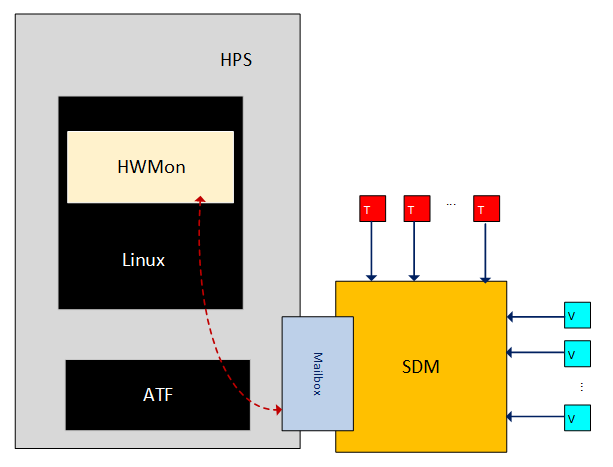
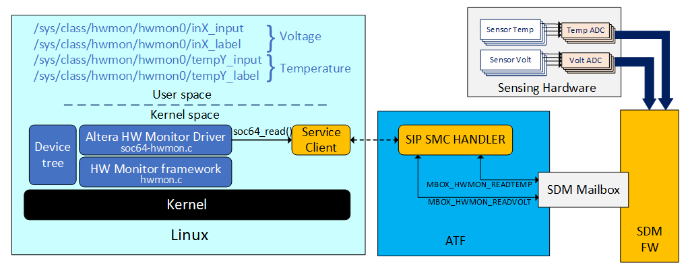
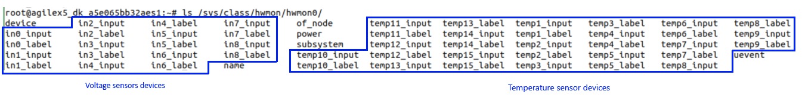

# **Altera® Hardware Monitor Driver for Hard Processor System**

Last updated: **September 11, 2025** 

**Upstream Status**:  Not Upstreamed

**Devices supported**: Agilex3, Agilex 5, Agilex 7

## **Introduction**

The devices in which this driver is supported provide you with on-chip voltage and temperature sensors. You can use these sensors to monitor on-chip operation conditions such as the internal power rail and on-chip junction temperature. Some of the sensors also allow you the measure external voltages.

The sensor monitoring system in the secure device manager (SDM) is in charge of sampling signals and keeping the latest digital value for each sensor available,  so this data can be provided under request. You can read the voltage and temperature values in the SDM by using the Mailbox Client FPGA IP or the Mailbox Client with Avalon® Streaming Interface Intel® FPGA IP.

The Hard Processor System (HPS) is also capable of retrieve the voltage and temperature levels from the HPS-to-SDM mailbox. The Linux driver performs all the operations needed to facilitate the access to the sampled values from the sensors from the user space.




## **Driver Sources**

The source code for this driver can be found at:

[https://github.com/altera-opensource/linux-socfpga/blob/HEAD/drivers/hwmon/soc64-hwmon.c](https://github.com/altera-opensource/linux-socfpga/blob/HEAD/drivers/hwmon/soc64-hwmon.c)

## **Driver Capabilities**

* The driver is supported by the Linux Kernel hardware monitor framework.
* Identification of meassurement points for voltage and temperature (i.e. sensor location) are defined through device tree nodes. Up to 16 sensors for each one can be defined.
* The driver registers each one of the meassurement point as a device under */sys/class/hwmon/hwmon0*. The voltage and temperature value is avaiable in the User space through the reading of the corresponding file.
* The driver performs an ATF SVC call to ask for the value in certain sensor identified through a parameter. The ATF interacts with SDM to ask for this value and once it gets it, this forwards the value to the driver.
* Voltage values are converted to mV (millivolts) while temperature values are provided in mC (milliCelsius).

## **Detailed Description**

The **Hardware Monitor** Linux driver allows you to read from the user space the voltage and temperature values from the on-chip sensors. These sensors are located at specific locations in the SoC so an application can monitor them either to observe the current state of the device or identify any possible fail condition. In Agilex™ 7 and Agilex™ 5 devices is possible also to use some of the sensors to monitor external signals.

The diagram below describes the components that are involved on the voltage and temperature monitor system in the SoC and the also the software flows related to this process. The diagram is described in detail next.



1. There are voltage and temperature sensors in different locations of the SoC. The sensors and their locations are defined  in the device corresponding *Power Management User Guide (Sensor Monitoring System chapter)*.  The SoC also includes ADCs  used to sample these variables and convert them to a digital value. The SDM is in charge of the sampling of the voltage and temperature signals and also convert them to a meaningful digital value using a reference voltage. This sampling is performed constantly and the corresponding last digital value is always available in case any agent request this to the SDM.

     **NOTE:** The temperature sensors in the SoC are active only if the corresponding location is also active in the device. For example, sensors in the core fabric are only available if the core fabric has been programed. The same case for sensors in the tiles, they will become active only if they has been instantiated in the design. The sensor in the SDM is always available. 

2. In the Linux side, the Altera® hardware monitor driver (*drivers/hwmon/soc64-hwmon.c*) performs the following actions:
  * Parses the device tree to identify the nodes for each one of the sensors described. Up to 16 voltage sensors and 16 temperature sensors can be defined. The sensor nodes are defined under firmware >> svc >> hwmon >> temperature and firmware >> svc >> hwmon >>  voltage nodes respectively. The driver, supported by the hardware monitor framework (drivers/hwmon/hwmon.c), creates a device (seen as a file) under /sys/class/hwmon/hwmon0 for each one of these nodes defined in the device tree. These devices are accessible from the user space and reading them corresponds to reading the lecture from the corresponding sensor. The driver also creates a file/device to identify the corresponding sensor returning the name of the sensor (referred as label). The following table describes the format of the device name created and also the starting index of these devices.
   
      | Sensor type | Device name (value) | Device name (identifier) | Starting index |
      | :-- | :-- | :-- | :-- |
      | Voltage | inX_input | inX_label | 0 |
      | Temperature | tempX_input | tempX_label | 1 |
      
    The following image shows an example of the device created when defining 9 voltage sensors and 15 temperature sensors.
    

    Refer to the [Device Tree](#device-tree) section for more information about the sensor definition in the device tree.
    
  * As indicated earlier, the SDM is in charge of capturing the voltage and temperature levels from the sensors. The Linux driver performs the voltage read operation through the *soc64_read()* function which uses SVC (service client) call to the ATF to ask this to request to the SDM the current value of a specific sensor. The driver indicates to the SVC if it wants to read a voltage or a temperature through a command (**COMMAND_HWMON_READTEMP** or **COMMAND_HWMON_READVOLT**). It also specifies which of the sensors need to be read using an argument in the SVC message. The driver obtains this argument information about the sensor to read from the **reg** field in the corresponding sensor node in the device tree (refer to [Device Tree](#device-tree) section for more information about this). Once the SVC message is sent, the driver waits for a response from the ATF. This response includes the value of the voltage or temperature that was returned by the SDM. The driver do some additional conversion so the value that this returns is in milli Celsius(mC) for temperature and milli Volts (mV) for voltage. The value that this function returns is the actual value that you will observe from the **inX_input** or **tempX_input** device under /sys/class.     

3. In the ATF side, the SVC message sent by the Linux driver to request the reading of a temperature or voltage level is received by the SIP SMC handler, *sip_smc_handler_V1()*. This handler process the incoming command to identify if  voltage or temperature read is requested. Following the software flow, the ATF converts the SVC message into a HPS to SDM mailbox message (MBOX_HWMON_READTEMP and MBOX_HWMON_READVOLT) to request the SDM to provide the latest temperature or voltage sample taken. Once that the SDM responds to this request, the ATF also responds to the SVC message with the signal level provided by the SDM.
4. As indicated earlier, the SDM already has available the latest value of temperature of voltage of all the sensors, so when it receives the mailbox request from ATF to provide the latest value taken from any of the sensors, the SDM just responds the mailbox message with the value requested.


## **Kernel Configurations**

In order to include into the Linux kernel the hardware monitor and all the components required for the voltage and temperature monitor system, the following Kernel configurations are required:

| Kernel Configuration | Description |
| :-- | :-- |
| CONFIG_HWMON=y | This enables the build and inclusion into the Linux kernel of the hardware monitor kernel framework (*drivers/hwmon/hwmon.c*) |
| CONFIG_SENSORS_SOC64=y | This enables the build inclusion into the Linux kernel of the Altera® hardware monitor driver to read temperature and voltage from the on-chip sensors (*drivers/hwmon/soc64-hwmon.c*). |
| CONFIG_INTEL_STRATIX10_SERVICE=y | This enables the build and inclusion into the Linux kernel of the SVC service client support needed to used the ATF resident software( */drivers/firmware/stratix10-svc.c*). |

## **Device Tree**

The Altera® hardware monitor driver relies on the definition of the temperature and voltage sensors in the device tree. Up to 16 sensors of each type can be defined in the device tree. Since there is dependency on the SVC services to get the value of the sampled data from the sensors, the voltage and temperature nodes need to be defined  under **svc** node. The Linux driver is probed using the **"intel,soc64-hwmon"** compatible statement, so a child node for the hardware monitor is defined and under these the voltage and temperature nodes are defined. An example of the structure is shown next:

  ```bash
  firmware {
			svc {
				compatible = "intel,agilex5-svc";
                :
                temp_volt: hwmon {
					compatible = "intel,soc64-hwmon";
				};
  };
  :
  &temp_volt {
	
		temperature {
			#address-cells = <1>;
			#size-cells = <0>;
		
			<temperature node>
			<temperature node>
			:
			<temperature node>
			
        };
  		voltage {
			#address-cells = <1>;
			#size-cells = <0>;
		
           <voltage node>
		   <voltage node>
		   :
		   <voltage node>
        };              
  };
  ```

The format of the node is shown next:
```bash
  input@sensor_id_value {
      label = "sensor_name";
      reg = <sensor_id_value>;
  };
```
Each one of the sensors nodes requires the following fields:

| Field | Description |
| -- | -- |
| label | Name of the sensor. The name may be related to the voltage that is being meassured or the location of the temperature sensor that is being meassured.  This text will be the one displayed when reading */sys/class/hwmon/hwmon0/<sensor_type>_label*. |
| reg | This is a 32-bit value that is used to identify the sensor to which the node corresponds to. The format of this identifier may varies depending on the type of sensor. In the case of voltage sensors the value indicates the ADC channel to read (0, 1, 2 ,3, etc.). For temperature sensors the value is composed by the sensor location (bits 31:16, values 0,1,2,3, etc.) and the sensor number in that location (bits 15:0, values 0,1,2,3,...). The driver converts the value in **reg** to the appropriate value that needs to be sent to the ATF and later to the SDM to read the sensor value.    For more information about the sensor identification please refer to the device corresponding *Power Management User Guide (Sensor Monitoring System chapter)*. |

You can refer to the following example in which the **Agilex™ 5** Linux device tree is patch to observe how some voltage and temperature nodes are defined under the **hwmon** node: [Example of sensors nodes definition for Agilex™ 5](https://github.com/altera-fpga/agilex5-demo-hps2fpga-interfaces/blob/HEAD/common_sw/linux_patches/brd_altera_a5e065_premium_es-arch-arm64-boot-dts-intel-socfpga_agilex5_socdk.dts.patch)

## **Reading of Voltage and Temperature Sensors from User Space**

The following Shell script shows an example about how the voltage and temperature from the sensors defined in the device tree can be read from the user space by reading the value and label from the devices created under */sys/class/hwmon/hwmon0/*. This was executed in an Agilex™ 5 Premium Devkit. In this example 9 voltage sensors and 15 temperature sensors were defined in the device tree. In the example the **cat** command is used to get the value of the voltage/temperature value.

```bash
#!/bin/bash
echo "Voltage Sensors:" 
for i in 0 1 2 3 4 5 6 7 8
do
  valPath="/sys/class/hwmon/hwmon0/in${i}_input"
  labelPath="/sys/class/hwmon/hwmon0/in${i}_label"
  val=$(cat $valPath)
  label=$(cat $labelPath)        
  echo "Sensor: ${i} ${label}: ${val} mv"    
done

echo "Temperature Sensors:" 
for i in 1 2 3 4 5 6 7 8 9 10 11 12 13 14 15
do
  valPath="/sys/class/hwmon/hwmon0/temp${i}_input"
  labelPath="/sys/class/hwmon/hwmon0/temp${i}_label"
  val=$(cat $valPath)
  label=$(cat $labelPath)        
  echo "Sensor: ${i} ${label}: ${val} mC" 
done
```
The output of the script is shown next:

```bash
root@agilex5_dk_a5e065bb32aes1:~# ./readSensors 
Voltage Sensors:
Sensor: 0 VSIGP: 1 mv
Sensor: 1 VSIGN: 0 mv
Sensor: 2 VCC: 693 mv
Sensor: 3 VCCIO_SDM: 1800 mv
Sensor: 4 VCCPT: 1800 mv
Sensor: 5 VCCRCORE: 1208 mv
Sensor: 6 VCCH_SDM: 924 mv
Sensor: 7 VCCL_SDM: 694 mv
Sensor: 8 VCCADC: 1816 mv
Temperature Sensors:
Sensor: 1 SDM: 32125 mC
Sensor: 2 LOWER LEFT MAX: 42500 mC
Sensor: 3 LOWER LEFT CORNER: 42500 mC
Sensor: 4 LOWER LEFT XCVR 2: 26125 mC
Sensor: 5 LOWER LEFT XCVR 3: 26125 mC
Sensor: 6 LOWER LEFT CENTER: 25750 mC
Sensor: 7 LOWER RIGHT MAX: 42500 mC
Sensor: 8 LOWER RIGHT CORNER: 42875 mC
Sensor: 9 LOWER RIGHT XCVR 2: 25500 mC
Sensor: 10 LOWER RIGHT XCVR 3: 25750 mC
Sensor: 11 UPPER RIGHT MAX: 43125 mC
Sensor: 12 UPPER RIGHT CORNER: 43125 mC
Sensor: 13 UPPER RIGHT XCVR 3: 26750 mC
Sensor: 14 UPPER RIGHT CENTER: 26375 mC
Sensor: 15 HPS: 27000 mC   
```


## **Known Issues**

* At the moment of the writing of this page, in Agilex™ 5, the Altera hardware monitor driver is being probed twice. The first time it fails since the SVC driver has not been initialized yet. By the time the SVC driver is initialized, the hardware monitor is probed again, succeeding this time.

## Notices & Disclaimers

Altera<sup>&reg;</sup> Corporation technologies may require enabled hardware, software or service activation.
No product or component can be absolutely secure. 
Performance varies by use, configuration and other factors.
Your costs and results may vary. 
You may not use or facilitate the use of this document in connection with any infringement or other legal analysis concerning Altera or Intel products described herein. You agree to grant Altera Corporation a non-exclusive, royalty-free license to any patent claim thereafter drafted which includes subject matter disclosed herein.
No license (express or implied, by estoppel or otherwise) to any intellectual property rights is granted by this document, with the sole exception that you may publish an unmodified copy. You may create software implementations based on this document and in compliance with the foregoing that are intended to execute on the Altera or Intel product(s) referenced in this document. No rights are granted to create modifications or derivatives of this document.
The products described may contain design defects or errors known as errata which may cause the product to deviate from published specifications.  Current characterized errata are available on request.
Altera disclaims all express and implied warranties, including without limitation, the implied warranties of merchantability, fitness for a particular purpose, and non-infringement, as well as any warranty arising from course of performance, course of dealing, or usage in trade.
You are responsible for safety of the overall system, including compliance with applicable safety-related requirements or standards. 
<sup>&copy;</sup> Altera Corporation.  Altera, the Altera logo, and other Altera marks are trademarks of Altera Corporation.  Other names and brands may be claimed as the property of others. 

OpenCL* and the OpenCL* logo are trademarks of Apple Inc. used by permission of the Khronos Group™. 