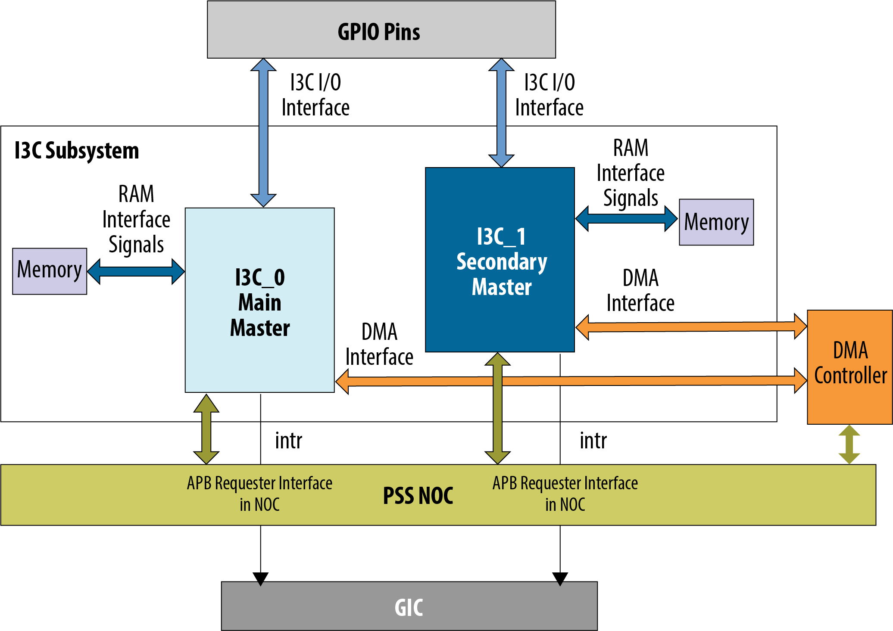
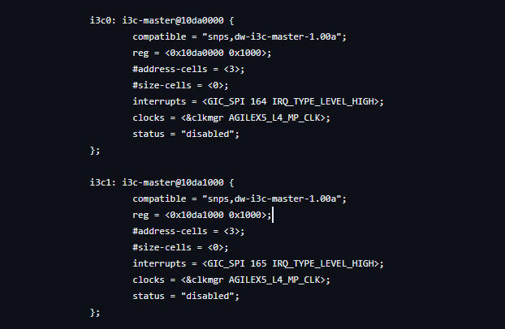

# **I3C Driver for Hard Processor System**

Last updated: **July 24, 2025** 

**Upstream Status**: [Upstreamed](https://git.kernel.org/pub/scm/linux/kernel/git/torvalds/linux.git/tree/drivers/i3c/master/dw-i3c-master.c)

**Devices supported**: Agilex 5

## **Introduction**

The I3C controller device driver only supports running as a master. The main master is a specialized master that comes up after power-on-reset, and is responsible for assigning dynamic addresses to the I3C devices. The secondary master is an I3C instance capable of both master and slave functionality. It comes up as a slave upon power-on-reset. The secondary master must get ownership of the I3C bus to become a current master before initiating any transfer to its associated slaves.

I3C slave controller is not supported. The latest Linux kernel does not support the slave I3C framework.

I3C master controller slave DMA is not be supported even though I3C also supports external DMA. The latest Linux kernel does not support DMA.

## **I3C FPGA IP**

The I3C interface is a high-bandwidth bus interface for connecting peripherals to HPS. The I3C interface is intended to improve upon the features of the I2C interface, while preserving backward compatibility. This interface is targeted for applications such as event camera sensors which require I3C interface capability.

The hard processor system (HPS) provides two I3C controllers to enable system software to communicate serially with I3C buses. For information regarding this soft IP core, please refer to the [Agilex 5 Hard Processor System Technical Reference Manual](https://www.intel.com/content/www/us/en/docs/programmable/814346).

{: style="height:450px;width:450px"}

## **Driver Sources**

The source code for this driver can be found at [https://git.kernel.org/pub/scm/linux/kernel/git/torvalds/linux.git/tree/drivers/i3c/master/dw-i3c-master.c](https://git.kernel.org/pub/scm/linux/kernel/git/torvalds/linux.git/tree/drivers/i3c/master/dw-i3c-master.c).

## **Driver Capabilities**

* Initialize and configure the I3C Controller driver at system boot-up.
* Provide support for device detection and enumeration for compatible I3C devices.
* Support the Dynamic address assignment.

## **Kernel Configurations**

CONFIG_I3C

## **Device Tree**

Example Device tree location to configure the I3C:

[https://git.kernel.org/pub/scm/linux/kernel/git/torvalds/linux.git/tree/arch/arm64/boot/dts/intel/socfpga_agilex5.dtsi](https://git.kernel.org/pub/scm/linux/kernel/git/torvalds/linux.git/tree/arch/arm64/boot/dts/intel/socfpga_agilex5.dtsi)

## **Known Issues**

* I3C slave controller shall not be supported. The latest Linux kernel does not support the slave i3c framework.
* I3C master controller slave DMA shall not be supported even-though I3C also supports external DMA. The latest Linux kernel does not support DMA

## Notices & Disclaimers

Altera&reg; Corporation technologies may require enabled hardware, software or service activation.
No product or component can be absolutely secure. 
Performance varies by use, configuration and other factors.
Your costs and results may vary. 
You may not use or facilitate the use of this document in connection with any infringement or other legal analysis concerning Altera or Intel products described herein. You agree to grant Altera Corporation a non-exclusive, royalty-free license to any patent claim thereafter drafted which includes subject matter disclosed herein.
No license (express or implied, by estoppel or otherwise) to any intellectual property rights is granted by this document, with the sole exception that you may publish an unmodified copy. You may create software implementations based on this document and in compliance with the foregoing that are intended to execute on the Altera or Intel product(s) referenced in this document. No rights are granted to create modifications or derivatives of this document.
The products described may contain design defects or errors known as errata which may cause the product to deviate from published specifications.  Current characterized errata are available on request.
Altera disclaims all express and implied warranties, including without limitation, the implied warranties of merchantability, fitness for a particular purpose, and non-infringement, as well as any warranty arising from course of performance, course of dealing, or usage in trade.
You are responsible for safety of the overall system, including compliance with applicable safety-related requirements or standards. 
&copy; Altera Corporation.  Altera, the Altera logo, and other Altera marks are trademarks of Altera Corporation.  Other names and brands may be claimed as the property of others. 

OpenCL* and the OpenCL* logo are trademarks of Apple Inc. used by permission of the Khronos Group™. 
