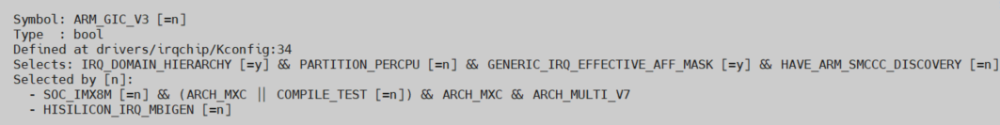
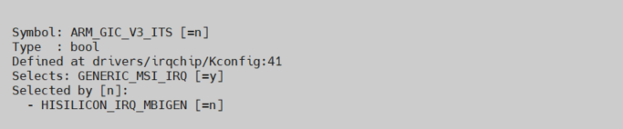
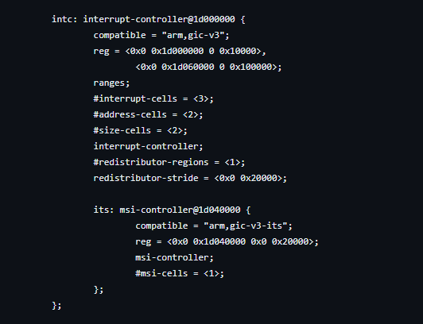

# **Interrupt controller (GICv3) Driver for Hard Processor System**

Last updated: **September 08, 2025** 

**Upstream Status**: [Upstreamed](https://git.kernel.org/pub/scm/linux/kernel/git/torvalds/linux.git/tree/drivers/irqchip/irq-gic-v3.c)

**Devices supported**: Agilex3, Agilex 5

## **Introduction**

The interrupt controller driver handles general initialization of the interrupt controller in the HPS.

The Arm&reg; Generic Interrupt Controller (GIC) handles interrupts from peripherals to the cores and between cores. To find out more about the features and functions of the GIC controller, please refer to [Agilex 5 Hard Processor System Technical Reference Manual](https://www.intel.com/content/www/us/en/docs/programmable/814346)

## **Driver Sources**

The source code for this driver can be found at:

[https://git.kernel.org/pub/scm/linux/kernel/git/torvalds/linux.git/tree/drivers/irqchip/irq-gic-v3.c](https://git.kernel.org/pub/scm/linux/kernel/git/torvalds/linux.git/tree/drivers/irqchip/irq-gic-v3.c)

## **Driver Capabilities**

* Initialize and configure the GICv3 interrupt controller hardware during system boot-up.
* Handles interrupts generated by various sources in the system.
* Routes interrupt from their sources to the appropriate CPU cores.
* Provides generic API to manage interrupts.
* Support distributed interrupts across multiple GIC instances.

## **Kernel Configurations**

CONFIG_ARM_GIC_V3

CONFIG_ARM_GIC_V3_ITS

## **Device Tree**

Example Device tree location to configure the irq_gic_v3:

[https://git.kernel.org/pub/scm/linux/kernel/git/torvalds/linux.git/tree/arch/arm64/boot/dts/intel/socfpga_agilex5.dtsi](https://git.kernel.org/pub/scm/linux/kernel/git/torvalds/linux.git/tree/arch/arm64/boot/dts/intel/socfpga_agilex5.dtsi)

## **Known Issues**

None Known

## Notices & Disclaimers

Altera&reg; Corporation technologies may require enabled hardware, software or service activation.
No product or component can be absolutely secure. 
Performance varies by use, configuration and other factors.
Your costs and results may vary. 
You may not use or facilitate the use of this document in connection with any infringement or other legal analysis concerning Altera or Intel products described herein. You agree to grant Altera Corporation a non-exclusive, royalty-free license to any patent claim thereafter drafted which includes subject matter disclosed herein.
No license (express or implied, by estoppel or otherwise) to any intellectual property rights is granted by this document, with the sole exception that you may publish an unmodified copy. You may create software implementations based on this document and in compliance with the foregoing that are intended to execute on the Altera or Intel product(s) referenced in this document. No rights are granted to create modifications or derivatives of this document.
The products described may contain design defects or errors known as errata which may cause the product to deviate from published specifications.  Current characterized errata are available on request.
Altera disclaims all express and implied warranties, including without limitation, the implied warranties of merchantability, fitness for a particular purpose, and non-infringement, as well as any warranty arising from course of performance, course of dealing, or usage in trade.
You are responsible for safety of the overall system, including compliance with applicable safety-related requirements or standards. 
&copy; Altera Corporation.  Altera, the Altera logo, and other Altera marks are trademarks of Altera Corporation.  Other names and brands may be claimed as the property of others. 

OpenCL* and the OpenCL* logo are trademarks of Apple Inc. used by permission of the Khronos Group™. 