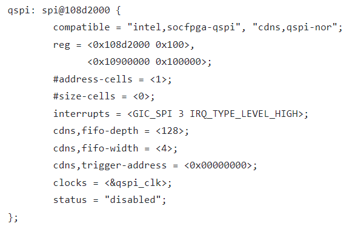

# **QSPI Driver for Hard Processor System (HPS)**

Last updated: **September 11, 2025** 

**Upstream Status**: Not Upstreamed

**Devices supported**: Agilex3, Agilex 5

## **Introduction**

The Quad Serial Peripheral Interface (QSPI) driver manages the QSPI controller in the HPS.  The QSPI has the capability to access serial NOR Flash connected to the Secure Device Manager (SDM) QSPI. The QSPI controller supports standard SPI Flash devices as well as high-performance dual and quad SPI Flash devices. The QSPI controller module features are:

* SPIx1, SPIx2, or SPIx4 (QSPI) serial NOR flash devices
* Supported clock frequencies up to 166 MHz
* Direct access and indirect access modes
* Single I/O, dual I/O, or quad I/O instructions
* Up to four chip selects
* Configurable clock polarity and phase
* Programmable write-protected regions
* Programmable delays between transactions

To find out more about the QSPI controller within the HPS please refer to the [Intel Agilex 5 Hard Processor System Technical Reference Manual](https://www.intel.com/content/www/us/en/docs/programmable/814346). 

## **Driver Capabilities**

* Initialize and configuration of the QSPI controller.
* Handles data transfer and address.

## **Driver Sources**

The source code for this driver can be found at [https://github.com/altera-opensource/linux-socfpga/blob/socfpga-6.1.55-lts/drivers/spi/spi-cadence-quadspi.c](https://github.com/altera-opensource/linux-socfpga/blob/socfpga-6.1.55-lts/drivers/spi/spi-cadence-quadspi.c).

## **Kernel Configurations**

CONFIG_SPI_CADENCE_QUADSPI


In Linux you can select the QSPI erase sector size to be 4 KB or 64 KB using **CONFIG_MTD_SPI_NOR_USE_4K_SECTORS** config:

* **CONFIG_MTD_SPI_NOR_USE_4K_SECTORS=Y**  indicates a Erase sector size of 4 KB.
* **CONFIG_MTD_SPI_NOR_USE_4K_SECTORS=N**  indicates a Erase sector size of 64 KB.


## Device Tree

Example Device tree location:

[https://github.com/altera-opensource/linux-socfpga/blob/socfpga-6.1.55-lts/arch/arm64/boot/dts/intel/socfpga_agilex5.dtsi](https://github.com/altera-opensource/linux-socfpga/blob/socfpga-6.1.55-lts/arch/arm64/boot/dts/intel/socfpga_agilex5.dtsi)




## **Test Procedure**

The following test procedure consist on performing erase, write and read operations into the QSPI flash device using the **mtd_debug** Linux application, which is included as part of the GSRD.

**Note:** In the Bootloaders build flow (building the software components independently),  the **mtd_debug** application is supported by including the **mtd-utils** package in **CORE_IMAGE_EXTRA_INSTALL** when building the file system. In this build flow, you also need to configure the Linux QSPI reference clock from U-Boot by running "**run  linux_qspi_enable**" after that the Linux device tree has been loaded.

As additional pre-requisites  to exercise this test procedure, you need to get enabled the QSPI controller enabled, Linux has booted  and this has loaded the QSPI driver. 

You can verify that the driver has been loaded by looking for messages from the QSPI driver in the boot log:

```
root@testsocfpga:~# dmesg | grep spi
[    1.540541] cadence-qspi 108d2000.spi: detected FIFO depth (1024) different from config (128)
[    1.550670] 2 fixed-partitions partitions found on MTD device 108d2000.spi.0
[    1.557731] Creating 2 MTD partitions on "108d2000.spi.0":
```

Observe that the 0x108d2000 address corresponds to the address of the QSPI controller in Agilex 5 device.

1. List the MTD partitions and verify these exist in the Linux file system:
   ```
   root@testsocfpga:~# cat /proc/mtd
   dev:    size   erasesize  name
   mtd0: 04200000 00010000 "u-boot"
   mtd1: 0be00000 00010000 "root"
   root@testsocfpga:~# ls /dev/mtd**
   /dev/mtd0  /dev/mtd0ro	/dev/mtd1  /dev/mtd1ro	/dev/mtdblock0	 /dev/mtdblock1
   ```
   Here you can see that 2 mtd partitions exists (these are defined in the device tree) and they have a 64KB erase sector size. The following table describes the memory regions of these partitions and the location of the last sector in these partitions. This test procedure will operate on the last sector of the **mtd1** partition.

| MTD Partition | Regions in Chip | Limits in Region | Last Sector Location <br>in the partition |
| ---| --- | --- | --- |
| mtd0 | 0x0000_0000 - 0x041F_FFFF | 0x0000_0000 - 0x041F_FFFF | 0x041f_0000 |
| mtd1 | 0x0420_0000 - 0x0FFE_FFFF | 0x0000_0000 - 0x0BDF_FFFF | **0x0BDF_0000** |

2. Back up the sector that will be erased and written, so it does not loose its original content. The sector size is 64 KB (0x10000). The original content is stored in the **readBackup.img** file.

   ```
   root@testsocfpga:~# mtd_debug read /dev/mtd1 0x0BDF0000 0x10000 readBackup.img
   Copied 65536 bytes from address 0x0bdf0000 in flash to readBackup.img
   ```
   
3. **Erase Test**. Erase the sector, so it can be written later:

   ```
   root@testsocfpga:~# mtd_debug erase /dev/mtd1 0x0BDF0000 0x10000
   Erased 65536 bytes from address 0x0bdf0000 in flash
   ```
   
4. Create one image with random content that later will be used to write in the QSPI sector selected. The image is stored in the **empty.img** file.

   ```
   root@testsocfpga:~# dd if=/dev/urandom of=empty.img bs=1k count=64
   64+0 records in
   64+0 records out
   65536 bytes (66 kB, 64 KiB) copied, 0.00205477 s, 31.9 MB/s
   ```
   
5. **Write Test**. Write the image with random data in the **empty.img** file to the sector selected.

   ```
   root@testsocfpga:~# mtd_debug write /dev/mtd1 0x0BDF0000 0x10000 empty.img
   Copied 65536 bytes from empty.img to address 0x0bdf0000 in flash
   ```
6. **Read Test**. Read back the data in the sector so it can later be compared against the original data. The data read is stored in the read.img file.

   ```
   root@testsocfpga:~# mtd_debug read /dev/mtd1 0x0BDF0000 0x10000 read.img
   Copied 65536 bytes from address 0x0bdf0000 in flash to read.img
   ```

7. Compare the data read in **read.img** file against the random data writen stored in the **empty.img** file. Observed that no output indicates that the files match.

   ```
   root@testsocfpga:~# diff -q empty.img read.img
   ```
8. Restore the original data in the QSPI sector selected so this could be unaffected by the testing. For that you need to erase and then write the content in the **readBackup.img** file.

   ```
   root@testsocfpga:~# mtd_debug erase /dev/mtd1 0x0BDF0000 0x10000
   Erased 65536 bytes from address 0x0bdf0000 in flash
   root@testsocfpga:~# mtd_debug write /dev/mtd1 0x0BDF0000 0x10000 readBackup.img
   Copied 65536 bytes from readBackup.img to address 0x0bdf0000 in flash 
   ```
   

At this point, you can power cycle the board and observe that the system is able to boot to Linux again.

## **Known Issues**

None Known

## Notices & Disclaimers

Altera<sup>&reg;</sup> Corporation technologies may require enabled hardware, software or service activation.
No product or component can be absolutely secure. 
Performance varies by use, configuration and other factors.
Your costs and results may vary. 
You may not use or facilitate the use of this document in connection with any infringement or other legal analysis concerning Altera or Intel products described herein. You agree to grant Altera Corporation a non-exclusive, royalty-free license to any patent claim thereafter drafted which includes subject matter disclosed herein.
No license (express or implied, by estoppel or otherwise) to any intellectual property rights is granted by this document, with the sole exception that you may publish an unmodified copy. You may create software implementations based on this document and in compliance with the foregoing that are intended to execute on the Altera or Intel product(s) referenced in this document. No rights are granted to create modifications or derivatives of this document.
The products described may contain design defects or errors known as errata which may cause the product to deviate from published specifications.  Current characterized errata are available on request.
Altera disclaims all express and implied warranties, including without limitation, the implied warranties of merchantability, fitness for a particular purpose, and non-infringement, as well as any warranty arising from course of performance, course of dealing, or usage in trade.
You are responsible for safety of the overall system, including compliance with applicable safety-related requirements or standards. 
<sup>&copy;</sup> Altera Corporation.  Altera, the Altera logo, and other Altera marks are trademarks of Altera Corporation.  Other names and brands may be claimed as the property of others. 

OpenCL* and the OpenCL* logo are trademarks of Apple Inc. used by permission of the Khronos Group™. 