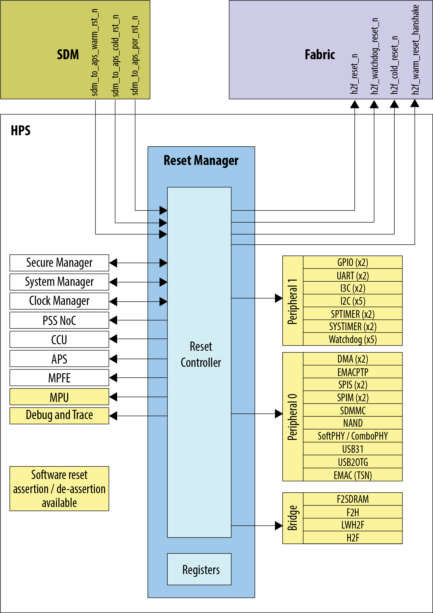
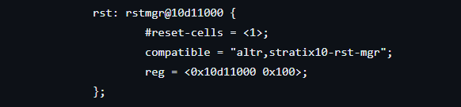

# **Reset Manager Driver for Hard Processor System**

Last updated: **June 21, 2025** 

**Upstream Status**: Not Upstreamed

**Devices supported**: Agilex 5

## **Introduction**

The reset manager generates module reset signals based on reset requests from various sources in the HPS, and performs software writing to the module-reset control registers.

The HPS contains multiple reset domains. Each reset domain can be reset
independently. A reset can be initiated externally, internally, or through software.  For more information about the reset manager, please refer to the [Intel Agilex 5 Hard Processor System Technical Reference Manual](https://www.intel.com/content/www/us/en/docs/programmable/814346).

{: style="height:450px;width:450px"}

## **Driver Sources**

The source code for this driver can be found at:

[https://github.com/altera-opensource/linux-socfpga/blob/socfpga-6.1.55-lts/drivers/reset/reset-simple.c](https://github.com/altera-opensource/linux-socfpga/blob/socfpga-6.1.55-lts/drivers/reset/reset-simple.c)

## **Driver Capabilities**

* Manage the system level reset.
* Support Assert and De-assert of the reset signal.
* Monitor the status of the reset signal.

## **Kernel Configurations**

CONFIG_RESET_SIMPLE

## **Device Tree**

Example Device tree location for reset signal parameter:

[https://github.com/altera-opensource/linux-socfpga/blob/socfpga-6.1.55-lts/arch/arm64/boot/dts/intel/socfpga_agilex5.dtsi](https://github.com/altera-opensource/linux-socfpga/blob/socfpga-6.1.55-lts/arch/arm64/boot/dts/intel/socfpga_agilex5.dtsi)

Also dt-bindings can be found at:

[https://github.com/altera-opensource/linux-socfpga/blob/socfpga-6.1.55-lts/include/dt-bindings/reset/altr%2Crst-mgr-agilex5.h](https://github.com/altera-opensource/linux-socfpga/blob/socfpga-6.1.55-lts/include/dt-bindings/reset/altr%2Crst-mgr-agilex5.h)

## **Known Issues**

None Known

## Notices & Disclaimers

Altera&reg; Corporation technologies may require enabled hardware, software or service activation.
No product or component can be absolutely secure. 
Performance varies by use, configuration and other factors.
Your costs and results may vary. 
You may not use or facilitate the use of this document in connection with any infringement or other legal analysis concerning Altera or Intel products described herein. You agree to grant Altera Corporation a non-exclusive, royalty-free license to any patent claim thereafter drafted which includes subject matter disclosed herein.
No license (express or implied, by estoppel or otherwise) to any intellectual property rights is granted by this document, with the sole exception that you may publish an unmodified copy. You may create software implementations based on this document and in compliance with the foregoing that are intended to execute on the Altera or Intel product(s) referenced in this document. No rights are granted to create modifications or derivatives of this document.
The products described may contain design defects or errors known as errata which may cause the product to deviate from published specifications.  Current characterized errata are available on request.
Altera disclaims all express and implied warranties, including without limitation, the implied warranties of merchantability, fitness for a particular purpose, and non-infringement, as well as any warranty arising from course of performance, course of dealing, or usage in trade.
You are responsible for safety of the overall system, including compliance with applicable safety-related requirements or standards. 
&copy; Altera Corporation.  Altera, the Altera logo, and other Altera marks are trademarks of Altera Corporation.  Other names and brands may be claimed as the property of others. 

OpenCL* and the OpenCL* logo are trademarks of Apple Inc. used by permission of the Khronos Group™. 