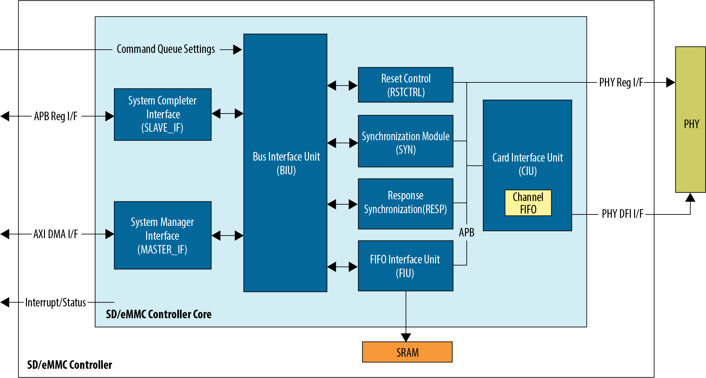
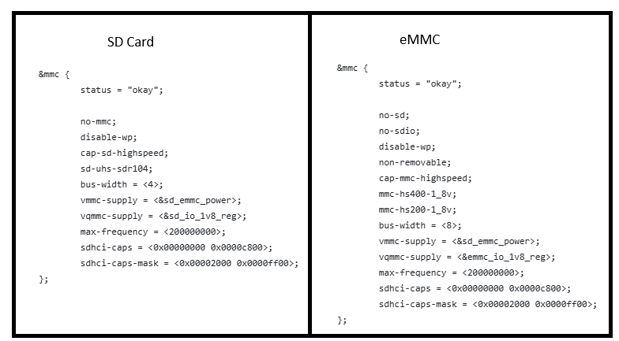

# **SD/eMMC Driver for Hard Processor System**

Last updated: **June 25, 2026** 

**Upstream Status**: [Upstreamed](https://git.kernel.org/pub/scm/linux/kernel/git/torvalds/linux.git/tree/drivers/mmc/host/sdhci-cadence.c)

**Devices supported**: Agilex™ 3, Agilex™ 5

## **Introduction**

The Secure Digital/Embedded Multimedia Card (SD/eMMC) driver supports the SD/eMMC controller in the Hard Processor System (HPS) which interfaces with external SD Flash cards, secure digital I/O (SDIO) devices, and eMMC storage devices.


For More information please refer to the [Altera® Agilex™ 5 Hard Processor System Technical Reference Manual](https://www.intel.com/content/www/us/en/docs/programmable/814346).




## **Driver Sources**

The source code for this driver can be found at:

[https://git.kernel.org/pub/scm/linux/kernel/git/torvalds/linux.git/tree/drivers/mmc/host/sdhci-cadence.c](https://git.kernel.org/pub/scm/linux/kernel/git/torvalds/linux.git/tree/drivers/mmc/host/sdhci-cadence.c)

## **Driver Capabilities**

* Manage SD/eMMC features such as configuration and reset and timeout clock frequency
* Supports SDMA and ADMA modes.
* Handles data transfer to/from the SD/eMMC.


## **Kernel Configurations**

CONFIG_MMC_SDHCI_CADENCE
```bash
Symbol: MMC_SDHCI_CADENCE [=y]
Type  : tristate                                  
Defined at drivers/mmc/host/Kconfig:291         
  Prompt: SDHCI support for the Cadence SD/SDIO/eMMC controller
  Depends on: MMC [=y] && MMC_SDHCI_PLTFM [=y] && OF [=y]
  Location: 
    -> Device Drivers?  
      -> MMC/SD/SDIO card support (MMC [=y])  
        -> Secure Digital Host Controller Interface support (MMC_SDHCI
          -> SDHCI platform and OF driver helper (MMC_SDHCI_PLTFM [=y])
(1)        -> SDHCI support for the Cadence SD/SDIO/eMMC controller (M 
Selects: MMC_SDHCI_IO_ACCESSORS [=y]
```
## **Device Tree**

Example Device tree location to configure the SD/eMMC:

**Agilex™ 5**

| Device Tree Target | File Path |
| :------------ | :---------- |
| SD Card | https://github.com/altera-fpga/linux-socfpga/blob/socfpga-6.18.2-lts/arch/arm64/boot/dts/intel/socfpga_agilex5_socdk.dts |
| eMMC | https://github.com/altera-fpga/linux-socfpga/blob/socfpga-6.18.2-lts/arch/arm64/boot/dts/intel/socfpga_agilex5_socdk_emmc.dts |
| SD Card<br/>DK-A5E013B | https://github.com/altera-fpga/linux-socfpga/blob/socfpga-6.18.2-lts/arch/arm64/boot/dts/intel/socfpga_agilex5_socdk_013b.dts |

**Agilex™ 3**

| Device Tree Target | File Path |
| :------------ | :---------- |
| SD Card | https://github.com/altera-fpga/linux-socfpga/blob/socfpga-6.18.2-lts/arch/arm64/boot/dts/intel/socfpga_agilex3_socdk.dts  |
| eMMC | https://github.com/altera-fpga/linux-socfpga/blob/socfpga-6.18.2-lts/arch/arm64/boot/dts/intel/socfpga_agilex3_socdk_emmc.dts |



### **Device Tree Configuration for Supported Operations Modes**

#### **Linux Device Tree Configuration for SD Card**

| Operation Mode ➜<br> Parameter ↓ | High Speed | SDR12 | SDR25 | SDR50 | DDR50² | SDR104³ |
| :------------ | :---------- | :----- | :----- | :----- | :----- | :------ |
|  sdhci-caps⁴  | <0x00000000<br>0x0000c800> | <0x00000000<br><0x0000c800> | <0x00000000<br>0x0000c800> | <0x00000000<br/>0x0000c800> | <0x00000000<br/>0x0000c800> | <0x00000000<br/>0x0000c800> |
| sdhci-caps-mask⁴ | <0x00002007<br> 0x0000ff00> | <0x00002007<br> 0x0000ff00> | <0x00002007<br> 0x0000ff00> | <0x00002006<br/>0x0000ff00> | <0x00002003<br/>0x0000ff00> | <0x00002000<br/>0x0000ff00> |
|    sd-uhs-sdr12         | No | Yes | No | No | No | No |
|     sd-uhs-sdr25       | No | No | Yes | No | No | No |
| sd-uhs-sdr50           | No | No | No | Yes | No | No |
| sd-uhs-ddr50        | No | No | No | No | Yes | No |
| sd-uhs-sdr104           | No | No | No | No | No | Yes |
|    bus-width        | 1,4 | 4 | 4 | 4 | 4 | 4 |
|    cap-sd-highspeed        | Yes | No | Yes | Yes | Yes | Yes |
|   max-frequency¹   | 200000000<br>Min: 50 MHz | 200000000<br/>Min: 25 MHz | 200000000<br/>Min: 50 MHz | 200000000<br/>Min: 100 MHz |   200000000<br/>Min: 50 MHz   | 200000000 |
| no-sd | No | No | No | No | No | No |
|      no-sdio      | No | No | No | No | No | No |
|    non-removable       | No | No | No | No | No | No |
|   cap-mmc-highspeed         | No | No | No | No | No | No |
|    mmc-hs200-1_8v        | No | No | No | No | No | No |
|  mmc-hs400-1_8v          | No | No | No | No | No | No |
|    no-mmc        | Yes | Yes | Yes | Yes | Yes | Yes |
|    no-1-8-v        | Yes | No | No | No | No | No |

¹ The frequency should be at least the minimum value provided in **Min** value.

² This mode may not be functional. Please refer to the [Known Issues](#known-issues) section for more details.

³ This mode may not be functional in Agilex™ 5 ES device. Please refer to the [Known Issues](#known-issues) section for more details.

⁴ The **sdhci-caps** and **sdhci-caps-mask** device tree parameters are used to override the value of the SRS16 and SRS17 capabilities registers in the SD/eMMC controller. The clock frequency value defined in **SRS16.BSDCLK** or the overridden value set by **sdhci-caps/sdhci-caps-mask** parameters **MUST** match the value defined for the **SOFT PHY** clock in the hardware design hence this is used as reference to calculate the clock divider value needed to get final clock frequency for the operation mode selected. In Agilex 5 Engineering Samples the **SRS16.BSDCLK** value is set to 50 MHz, so this value must be overridden with the **sdhci-caps/sdhci-caps-mask** parameters if wanted to run at higher frequency. In the Agilex 5 production silicon, the **SRS16.BSDCLK** value is set to 200 MHz, so if your project needs to run at a different frequency, this value must be also overridden with the **sdhci-caps/sdhci-caps-mask** parameters.

#### **Linux Device Tree Configuration for eMMC**

| Operation Mode ➜ <br> Parameter ↓ | High Speed | HS-200² | HS-400² |
| :------------ | :---------- | :----- | :----- |
|  sdhci-caps³  |  <0x00000000<br>0x0000c800>    |   <0x00000000<br>0x0000c800>   |   <0x00000000<br>0x0000c800>    |
|  sdhci-caps-mask³  |  <0x00002000<br>0x0000ff00>    | <0x00002000<br>0x0000ff00>     |  <0x00002000<br>0x0000ff00>     |
| bus-width | 4,8 | 4,8 | 8 |
| max-frequency¹ | 200000000<br>Min: 50 MHz | 200000000 | 200000000 |
| cap-sd-highspeed | No | No | No |
| no-sd | Yes | Yes | Yes |
| no-sdio | Yes | Yes | Yes |
| non-removable | Yes | Yes | Yes |
| cap-mmc-highspeed | Yes | Yes | Yes |
| mmc-hs200-1_8v | No | Yes | No |
| mmc-hs400-1_8v | No | No | Yes |
| no-mmc | No | No | No |
| no-1-8-v | Yes | No | No |

¹ The frequency should be at least the minimum value provided in **Min** value.

² This mode may not be functional in Agilex™ 5 ES device. Please refer to the [Known Issues](#known-issues) section for more details.

³ The **sdhci-caps** and **sdhci-caps-mask** device tree parameters are used to override the value of the SRS16 and SRS17 capabilities registers in the SD/eMMC controller. The clock frequency value defined in **SRS16.BSDCLK** or the overridden value set by **sdhci-caps/sdhci-caps-mask** parameters **MUST** match the value defined for the **SOFT PHY** clock in the hardware design hence this is used as reference to calculate the clock divider value needed to get final clock frequency for the operation mode selected. In Agilex 5 Engineering Samples the **SRS16.BSDCLK** value is set to 50 MHz, so this value must be overridden with the **sdhci-caps/sdhci-caps-mask** parameters if wanted to run at higher frequency. In the Agilex 5 production silicon, the **SRS16.BSDCLK** value is set to 200 MHz, so if your project needs to run at a different frequency, this value must be also overridden with the **sdhci-caps/sdhci-caps-mask** parameters.

The Linux SD/eMMC driver allow you to provide the PHY timing values that your board requires.  These are defined  through device tree parameters. In case these are not defined, the default values are being used instead. The following table describes these parameters:

| Parameter | Description | Default value | 
| :------------ | :---------- | :----- |
| cdns,iocell-input-delay   | Input delay across IO cells in picoseconds | SDHCI_CDNS6_PHY_DEFAULT_IOCELL_DELAY<br>2500 |
| cdns,iocell-output-delay  | Output delay across IO cells in picoseconds | SDHCI_CDNS6_PHY_DEFAULT_IOCELL_DELAY<br>2500 |
| cdns,delay-element | Delay element size in picoseconds | SDHCI_CDNS6_PHY_DEFAULT_DELAY_ELEMENT<br>24 |

**Note:** The Linux driver uses the above parameters to calculate the PHY timing values that need to be programmed in the Combo PHY registers.

#### **U-Boot Configuration for some SD/eMMC Operation Modes**

The following device trees and Config U-Boot files are the ones that define the operation mode as indicated in the following table:

**Agilex™ 5**

| Target | File Path |
| :------------ | :---------- |
| CONFIG SD Card | https://github.com/altera-fpga/u-boot-socfpga/blob/socfpga_v2026.01/configs/socfpga_agilex5_defconfig |
| CONFIG eMMC | https://github.com/altera-fpga/u-boot-socfpga/blob/socfpga_v2026.01/configs/socfpga_agilex5_emmc_defconfig |
| CONFIG SD Card <br/>DK-A5E013B | https://github.com/altera-fpga/u-boot-socfpga/blob/socfpga_v2026.01/configs/socfpga_agilex5_013b_defconfig ||
| Device Tree SD Card |  https://github.com/altera-fpga/u-boot-socfpga/blob/socfpga_v2026.01/arch/arm/dts/socfpga_agilex5_socdk-u-boot.dtsi |
| Device Tree eMMC | https://github.com/altera-fpga/u-boot-socfpga/blob/socfpga_v2026.01/arch/arm/dts/socfpga_agilex5_socdk_emmc-u-boot.dtsi |
| Device Tree SD Card <br/>DK-A5E013B | https://github.com/altera-fpga/u-boot-socfpga/blob/socfpga_v2026.01/arch/arm/dts/socfpga_agilex5_socdk_013b-u-boot.dtsi |

**Agilex™ 3**

| Target | File Path |
| :------------ | :---------- |
| CONFIG SDCard | https://github.com/altera-fpga/u-boot-socfpga/blob/socfpga_v2026.01/configs/socfpga_agilex3_defconfig |
| Device Tree SDCard | https://github.com/altera-fpga/u-boot-socfpga/blob/socfpga_v2026.01/arch/arm/dts/socfpga_agilex3_socdk-u-boot.dtsi |


The next table shows some U-Boot configurations that allow the SD/eMMC controller to operate in a specific mode:

| Operation Mode ➜ <br> Configuration ↓ | SD High Speed | SD SDR12² |SD SDR104³ | eMMC High Speed  | eMMC HS-200² | eMMC HS-400² |
| :------------ | :---------- |  :---------- | :---------- | :----- | :----- | :----- |
| sdhci-caps⁴ | <0x00000000<br> 0x0000c800> | <0x00000000<br/> 0x0000c800> | <0x00000000<br>0x0000c800> | <0x00000000<br>0x0004c800> | <0x00000000<br>0x0004c800> | <0x00000000<br>0x0004c800> |
| sdhci-caps-mask⁴ | <0x00002007<br>0x0000ff00> | <0x00002007<br/>0x0000ff00> |<0x00002000<br>0x0000ff00> | <0x00000000<br/>0x0004ff00> | <0x00000000<br/>0x0004ff00> | <0x00000000<br/>0x0004ff00> |
| cap-sd-highspeed | Yes |No| Yes | No | No | No |
| sd-uhs-sdr12 | No | Yes | No | No | No | No |
| sd-uhs-sdr104 | No | No | Yes | No | No | No |
| max-frequency¹ | 200000000<br>Min 50 MHz | 200000000<br/>Min 25 MHz | 200000000 | 200000000<br>Min 50 MHz |  200000000 | 200000000 |
| bus-width | 4 | 4 | 4 | 4,8 | 4,8 | 8 |
| no-sd | No | No | No | Yes | Yes | Yes |
| no-sdio | No | No | No | Yes | Yes | Yes |
| non-removable | No | No | No | Yes | Yes | Yes |
| cap-mmc-highspeed | No | No | No | Yes | Yes | Yes |
| mmc-hs200-1_8v | No | No | No | No | Yes | No |
| mmc-hs400-1_8v | No | No | No | No | No | Yes |
| no-mmc | Yes | Yes | Yes | No | No | No |
| no-1-8-v | Yes | No | No | Yes | No | No |
| U-Boot Configs<br>CONFIG_SPL_DM_REGULATOR_GPIO<br>CONFIG_DM_REGULATOR_GPIO<br>CONFIG_SPL_MMC_UHS_SUPPORT<br>CONFIG_MMC_UHS_SUPPORT<br>CONFIG_SPL_DWAPB_GPIO<br>CONFIG_MMC_HS200_SUPPORT<br>CONFIG_SPL_MMC_HS200_SUPPORT<br>CONFIG_MMC_HS400_SUPPORT<br>CONFIG_SPL_MMC_HS400_SUPPORT |<br>y<br>y<br>y<br>y<br>y<br>n<br>n<br>n<br>n | <br>y<br>y<br>y<br>y<br>y<br>n<br>n<br>n<br>n |<br>y<br>y<br>y<br>y<br>y<br>n<br>n<br>n<br>n | <br>n<br>n<br>n<br>n<br>n<br>n<br>n<br>n<br>n | <br>n<br>n<br>n<br>n<br>n<br>y<br>y<br>n<br>n | <br>n<br>n<br>n<br>n<br>n<br>y<br>y<br>y<br>y |

¹ The frequency should be at least the minimum value provided in **Min** value.

² This configuration requires a temporary workaroud the driver source code. Please refer to the [Known Issues](#known-issues) section for more details.

³ This mode may not be functional in Agilex™ 5 ES device. Please refer to the [Known Issues](#known-issues) section for more details.

⁴ The **sdhci-caps** and **sdhci-caps-mask** device tree parameters are used to override the value of the SRS16 and SRS17 capabilities registers in the SD/eMMC controller. The clock frequency value defined in **SRS16.BSDCLK** or the overridden value set by **sdhci-caps/sdhci-caps-mask** parameters **MUST** match the value defined for the **SOFT PHY** clock in the hardware design hence this is used as reference to calculate the clock divider value needed to get final clock frequency for the operation mode selected. In Agilex™ 5 Engineering Samples the **SRS16.BSDCLK** value is set to 50 MHz, so this value must be overridden with the **sdhci-caps/sdhci-caps-mask** parameters if wanted to run at higher frequency. In the Agilex™ 5 production silicon, the **SRS16.BSDCLK** value is set to 200 MHz, so if your project needs to run at a different frequency, this value must be also overridden with the **sdhci-caps/sdhci-caps-mask** parameters.

**Note:** The default PHY parameters defined in the device trees, were calculated to match the clock configuration in the hardware reference design (which uses a SOFT PHY clock of 200 MHz). For any other SOFT PHY clock frequency, the parameters need to be adjusted. Alternatively to the PHY parameters update and specifically for the case of SD High Speed mode, you can enable a PHY tunning mechanism, which consist on a runtime calibration process dedicated to finding the optimal data sampling point. Please refer to the  [Known Issues](#known-issues) list for  information about how to enable this tunning mechanism.

## Test Procedures

In Linux you can find out what is the current operation mode and the SM/eMMC configuration by inspecting the **/sys/kernel/debug/mmc0/ios** file as shown next:

```bash
root@agilex5_dk_a5e065bb32aes1:~# cat /sys/kernel/debug/mmc0/ios 
clock:		200000000 Hz
actual clock:	200000000 Hz
vdd:		21 (3.3 ~ 3.4 V)
bus mode:	2 (push-pull)
chip select:	0 (don't care)
power mode:	2 (on)
bus width:	3 (8 bits)
timing spec:	10 (mmc HS400)
signal voltage:	1 (1.80 V)
driver type:	0 (driver type B)
```


In U-Boot you can also find out the current operation mode using the **mmc info** command:

```bash
SOCFPGA_AGILEX5 # mmc info 
Device: mmc0@10808000
Manufacturer ID: 13
OEM: 4e
Name: G1M15L 
Bus Speed: 200000000
Mode: HS400 (200MHz)
Rd Block Len: 512
MMC version 5.1
High Capacity: Yes
Capacity: 29.6 GiB
Bus Width: 8-bit DDR
Erase Group Size: 512 KiB
HC WP Group Size: 8 MiB
User Capacity: 29.6 GiB WRREL
Boot Capacity: 31.5 MiB ENH
RPMB Capacity: 4 MiB ENH
Boot area 0 is not write protected
Boot area 1 is not write protected

```

**Note:** To observe the SD/eMMC operation mode from the **Mode** field above, you need to use set **CONFIG_MMC_VERBOSE=y** in your config.

In Linux,  if the file system is stored in the SD Card or eMMC device, then the content of this can be accessed directly by navigating in the directory structure of the file system. 

In U-Boot you can also use the  **mmc** command to read and write from the SD Card or eMMC device. For example:

```bash
SOCFPGA_AGILEX5 # mmc rescan
SOCFPGA_AGILEX5 # mmc list
mmc0@10808000: 0 (eMMC)
SOCFPGA_AGILEX5 # mmc part
Partition Map for mmc device 0  --   Partition Type: DOS

Part	Start Sector	Num Sectors	UUID		Type
  1	2048      	131073    	af519e93-01	0b
  2	133121    	131073    	af519e93-02	83

# Read 5000 bytes from block 2048 and load it into memory
SOCFPGA_AGILEX5 # mmc read ${loadaddr} 2048 5000
MMC read: dev # 0, block # 8264, count 20480 ... 20480 blocks read: OK
```

**Note:** If you have a FAT partition in your device, you can also access the content of this using the **fatinfo**, **fatload**, **fatls**, **fatmkdir**, **fatrm**, **fatsize**, **fatwrite** commands.


## **Known Issues**

* SD Card DDR50 mode is not functional in Agilex™ 5 and Agilex™ 3 device due to CRC errors observed in the SD Card interface. Please refer to the [350306](https://community.altera.com/kb/knowledge-base/why-does-agilex%E2%84%A2-5-agilex%E2%84%A2-3-fpgas-fail-to-boot-from-sd-card-in-ddr50-mode/350306) KDB.
* Agilex 5 ES (Engineering Sample) fails to boot from SD Card and eMMC devices operating in SDR104, HS400 and HS200 modes. Please refer to the [350691](https://community.altera.com/kb/knowledge-base/why-does-agilex%E2%84%A2-5-fpga-es-fails-to-boot-from-sdcard-and-emmc-devices-in-sdr104-/350691) KDB.
* SD Card SDR12 mode in U-Boot requires a driver source code workaround in 26.1 release.  Please refer to the [351127](https://community.altera.com/kb/knowledge-base/why-does-the-sdemmc-u-boot-driver-fail-to-select-the-sdr12-mode-for-agilex%C2%AE-5-fp/351127) KDB.
* U-Boot fails to boot from SD Card in High Speed Mode in 26.1 release in Agilex™ 5 and Agilex™ 3 production devices when the SOFT PHY  Clock is different than 200 MHz. A temporary workaround for this problem, you can enable a tuning mechanism. Please refer to [353736](https://community.altera.com/kb/knowledge-base/why-does-u-boot-fail-to-boot-from-sd-card-in-sd-high-speed-mode-in-agilex%C2%AE-5-and/353736) KDB.

## Notices & Disclaimers

Altera<sup>&reg;</sup> Corporation technologies may require enabled hardware, software or service activation.
No product or component can be absolutely secure. 
Performance varies by use, configuration and other factors.
Your costs and results may vary. 
You may not use or facilitate the use of this document in connection with any infringement or other legal analysis concerning Altera or Intel products described herein. You agree to grant Altera Corporation a non-exclusive, royalty-free license to any patent claim thereafter drafted which includes subject matter disclosed herein.
No license (express or implied, by estoppel or otherwise) to any intellectual property rights is granted by this document, with the sole exception that you may publish an unmodified copy. You may create software implementations based on this document and in compliance with the foregoing that are intended to execute on the Altera or Intel product(s) referenced in this document. No rights are granted to create modifications or derivatives of this document.
The products described may contain design defects or errors known as errata which may cause the product to deviate from published specifications.  Current characterized errata are available on request.
Altera disclaims all express and implied warranties, including without limitation, the implied warranties of merchantability, fitness for a particular purpose, and non-infringement, as well as any warranty arising from course of performance, course of dealing, or usage in trade.
You are responsible for safety of the overall system, including compliance with applicable safety-related requirements or standards. 
<sup>&copy;</sup> Altera Corporation.  Altera, the Altera logo, and other Altera marks are trademarks of Altera Corporation.  Other names and brands may be claimed as the property of others. 

OpenCL* and the OpenCL* logo are trademarks of Apple Inc. used by permission of the Khronos Group™. 