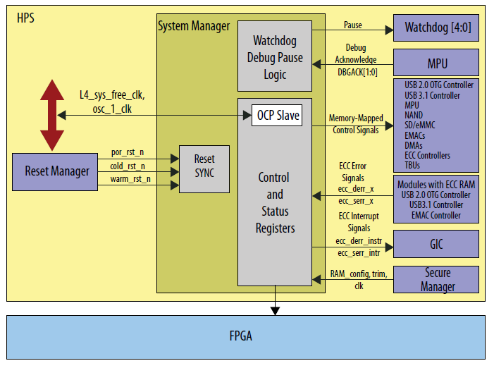
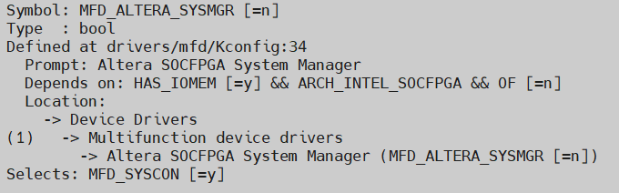
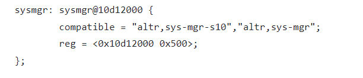

# **System Manager Driver for Hard Processor System**

Last updated: **September 30, 2026** 

**Upstream Status**: [Upstreamed](https://git.kernel.org/pub/scm/linux/kernel/git/torvalds/linux.git/tree/drivers/mfd/altera-sysmgr.c)

**Devices supported**: Agilex3, Agilex 5

## **Introduction**

The system manager contains the memory-mapped control and status registers (CSRs) and logic to control system level functionality in a hard processor system (HPS).

The system manager connects to different modules in the HPS such as a Direct memory access (DMA) controller, Microprocessor unit (MPU) system complex, NAND flash controller, Secure Digital/Embedded Multimedia Card (SD/eMMC) controller, or GPIO interface between HPS and other modules.

For more information please refer to the [Altera® Agilex 5 Hard Processor System Technical Reference Manual](https://www.intel.com/content/www/us/en/docs/programmable/814346).

## **Features**

* Provides memory-mapped control signals to other modules and peripherals
* Provides watchdogs stop functionality on debug requests.
* Provides software access to control and status signals of other HPS modules.
* Enables and disables HPS peripheral interfaces to the FPGA.
* Provides ten 32-bit registers to store handoff information between the preloader and the operating system.

## **Driver Capabilities**

* Handle the probing and resource allocation.
* Provides API to perform read/write operations.
* Access the CSRs in the system manager to control and monitor various functions of modules.

## **Driver Sources**

The source code for this driver can be found at [https://git.kernel.org/pub/scm/linux/kernel/git/torvalds/linux.git/tree/drivers/mfd/altera-sysmgr.c](https://git.kernel.org/pub/scm/linux/kernel/git/torvalds/linux.git/tree/drivers/mfd/altera-sysmgr.c).

## **Kernel Configurations**

CONFIG_MFD_ALTERA_SYSMGR

## **Device Tree**

Example Device tree location:

[https://github.com/torvalds/linux/blob/master/arch/arm64/boot/dts/intel/socfpga_agilex5.dtsi](https://github.com/torvalds/linux/blob/master/arch/arm64/boot/dts/intel/socfpga_agilex5.dtsi)

## **Known Issues**

None known

