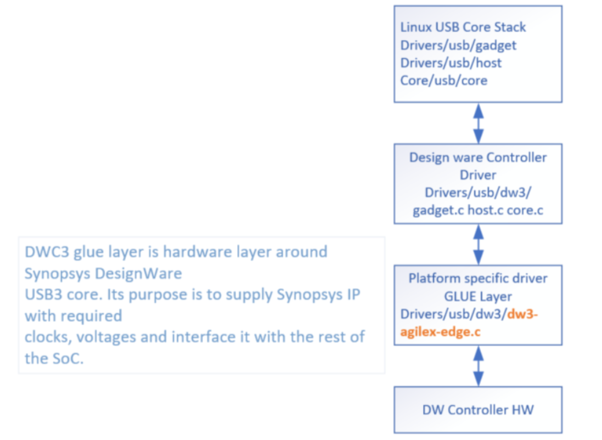

# **USB 3.1 Driver for Hard Processor System**

Last updated: **October 06, 2025** 

**Upstream Status**: [Upstreamed](https://git.kernel.org/pub/scm/linux/kernel/git/torvalds/linux.git/tree/drivers/usb/dwc3)

**Devices supported**: Agilex3, Agilex 5

## **Introduction**

The HPS provides a single instance of a USB 3.1 Gen 1 controller that supports both device and host functions for high-speed applications. The general use cases of USB 3.1 are for the HPS system to support all USB devices such as:

* Portable electronic devices
* High-bandwidth applications like audio and video.
* Debug trace applications

For More information please refer to the following link:

[Agilex 5 Hard Processor System Technical Reference Manual](https://www.intel.com/content/www/us/en/docs/programmable/814346)

{: style="height:450px;width:450px"}

### USB 3.1 Glue Driver

`drivers/usb/dwc3/dwc3-of-simple.c` is a USB glue driver for the `dw3-agilex-edge.c` component depicted in the diagram below. This glue driver is used to control dynamic mode switching.



## **Driver Sources**

The source code for this driver can be found at:

[https://git.kernel.org/pub/scm/linux/kernel/git/torvalds/linux.git/tree/drivers/usb/dwc3](https://git.kernel.org/pub/scm/linux/kernel/git/torvalds/linux.git/tree/drivers/usb/dwc3)

## **Driver Capabilities**

* It provides a reference to the Clock which is required by the rest of the interfaces.

## **Kernel Configurations**

CONFIG_USB_DWC3


**Note**: 
CONFIG_USB_DWC3_HOST or CONFIG_USB_DWC3_GADGET should be enabled only if the user wants to explicitly turn on Host or Device mode.
If CONFIG_USB_DWC3_DUAL_ROLE is enabled, both Host mode and Device mode drivers will be built.

## **Device Tree**

Example Device tree location to configure the usb3_1:

1\. The default Device Tree configures the USB3_1 in Host Mode: (dr_mode = "host";)

[https://github.com/altera-opensource/linux-socfpga/blob/socfpga-6.1.55-lts/arch/arm64/boot/dts/intel/socfpga_agilex5.dtsi](https://github.com/altera-opensource/linux-socfpga/blob/socfpga-6.1.55-lts/arch/arm64/boot/dts/intel/socfpga_agilex5.dtsi)

```
		usb31: usb1@11000000 {
			compatible = "intel,agilex5-dwc3";
			reg = <0x11000000 0x100000>;
			ranges;
			#address-cells = <1>;
			#size-cells = <1>;
			clocks = <&clkmgr AGILEX5_USB31_SUSPEND_CLK>,
				 <&clkmgr AGILEX5_USB31_BUS_CLK_EARLY>;
			resets = <&rst USB1_RESET>, <&rst USB1_OCP_RESET>;
			reset-names = "dwc3", "dwc3-ecc";
			status = "disabled";

			usb@11000000{
				compatible = "snps,dwc3";
				reg = <0x11000000 0x100000>;
				interrupts = <GIC_SPI 94 IRQ_TYPE_LEVEL_HIGH>;
				phys = <&usbphy0>, <&usbphy0>;
				phy-names = "usb2-phy", "usb3-phy";
				dr_mode = "host";
				maximum-speed = "super-speed-plus";
				snps,dis_u2_sysphy-quirk;
				snps,dma_set_40_bit_mask_quirk;
			};
		};
```

2\. To enable the USB3_1 in Device Mode, the "dr_mode" must be changed to "peripheral" in the Device Tree File:


```
		usb31: usb1@11000000 {
			compatible = "intel,agilex5-dwc3";
			reg = <0x11000000 0x100000>;
			ranges;
			#address-cells = <1>;
			#size-cells = <1>;
			clocks = <&clkmgr AGILEX5_USB31_SUSPEND_CLK>,
				 <&clkmgr AGILEX5_USB31_BUS_CLK_EARLY>;
			resets = <&rst USB1_RESET>, <&rst USB1_OCP_RESET>;
			reset-names = "dwc3", "dwc3-ecc";
			status = "disabled";

			usb@11000000{
				compatible = "snps,dwc3";
				reg = <0x11000000 0x100000>;
				interrupts = <GIC_SPI 94 IRQ_TYPE_LEVEL_HIGH>;
				phys = <&usbphy0>, <&usbphy0>;
				phy-names = "usb2-phy", "usb3-phy";
				dr_mode = "peripheral";
				maximum-speed = "super-speed-plus";
				snps,dis_u2_sysphy-quirk;
				snps,dma_set_40_bit_mask_quirk;
			};
		};
```

3\. To enable the USB3_1 in Dual-Role Device (DRD) Mode.

a. The "dr_mode" must be changed to "otg" in the Device Tree File

```
		usb31: usb1@11000000 {
			compatible = "intel,agilex5-dwc3";
			reg = <0x11000000 0x100000>;
			ranges;
			#address-cells = <1>;
			#size-cells = <1>;
			clocks = <&clkmgr AGILEX5_USB31_SUSPEND_CLK>,
				 <&clkmgr AGILEX5_USB31_BUS_CLK_EARLY>;
			resets = <&rst USB1_RESET>, <&rst USB1_OCP_RESET>;
			reset-names = "dwc3", "dwc3-ecc";
			status = "disabled";

			usb@11000000{
				compatible = "snps,dwc3";
				reg = <0x11000000 0x100000>;
				interrupts = <GIC_SPI 94 IRQ_TYPE_LEVEL_HIGH>;
				phys = <&usbphy0>, <&usbphy0>;
				phy-names = "usb2-phy", "usb3-phy";
				dr_mode = "otg";
				maximum-speed = "super-speed-plus";
				snps,dis_u2_sysphy-quirk;
				snps,dma_set_40_bit_mask_quirk;
			};
		};
```

b. Two extra nodes are to be added to the Device Tree File:

(User may add to gsrd-socfpga//meta-intel-fpga-refdes/recipes-bsp/device-tree/files/socfpga_agilex5_ghrd.dtsi)


```
        usb_pio: gpio@20010090 {
                compatible = "altr,pio-1.0";
                reg = <0x20010090 0x10>;
                interrupts = <GIC_SPI 20 IRQ_TYPE_EDGE_RISING>;
                altr,gpio-bank-width = <4>;
                altr,interrupt-type = <3>;
                #gpio-cells = <2>;
                gpio-controller;
        };

        extcon_usb: extcon-usb {
                compatible = "linux,extcon-usb-gpio";
                id-gpio = <&usb_pio 0 GPIO_ACTIVE_HIGH>;
                vbus-gpio = <&usb_pio 1 GPIO_ACTIVE_HIGH>;
        };
```

**Important Note**: For the full instructions to enable USB3.1 in Device mode and Dual-Role Device mode, please refer to the Example Design tutorial [https://altera-fpga.github.io/latest/embedded-designs/agilex-5/e-series/premium/usb3p1/ug-usb3p1-dev-drd-modes/](https://altera-fpga.github.io/latest/embedded-designs/agilex-5/e-series/premium/usb3p1/ug-usb3p1-dev-drd-modes/)

## **Test Procedure**

The procedure to test USB3.1 in Host mode, Device mode and Dual-Role Device mode are included in the Example Design tutorial [https://altera-fpga.github.io/latest/embedded-designs/agilex-5/e-series/premium/usb3p1/ug-usb3p1-dev-drd-modes/](https://altera-fpga.github.io/latest/embedded-designs/agilex-5/e-series/premium/usb3p1/ug-usb3p1-dev-drd-modes/)

## **Known Issues**

None Known

## Notices & Disclaimers

Altera<sup>&reg;</sup> Corporation technologies may require enabled hardware, software or service activation.
No product or component can be absolutely secure. 
Performance varies by use, configuration and other factors.
Your costs and results may vary. 
You may not use or facilitate the use of this document in connection with any infringement or other legal analysis concerning Altera or Intel products described herein. You agree to grant Altera Corporation a non-exclusive, royalty-free license to any patent claim thereafter drafted which includes subject matter disclosed herein.
No license (express or implied, by estoppel or otherwise) to any intellectual property rights is granted by this document, with the sole exception that you may publish an unmodified copy. You may create software implementations based on this document and in compliance with the foregoing that are intended to execute on the Altera or Intel product(s) referenced in this document. No rights are granted to create modifications or derivatives of this document.
The products described may contain design defects or errors known as errata which may cause the product to deviate from published specifications.  Current characterized errata are available on request.
Altera disclaims all express and implied warranties, including without limitation, the implied warranties of merchantability, fitness for a particular purpose, and non-infringement, as well as any warranty arising from course of performance, course of dealing, or usage in trade.
You are responsible for safety of the overall system, including compliance with applicable safety-related requirements or standards. 
<sup>&copy;</sup> Altera Corporation.  Altera, the Altera logo, and other Altera marks are trademarks of Altera Corporation.  Other names and brands may be claimed as the property of others. 

OpenCL* and the OpenCL* logo are trademarks of Apple Inc. used by permission of the Khronos Group™. 
