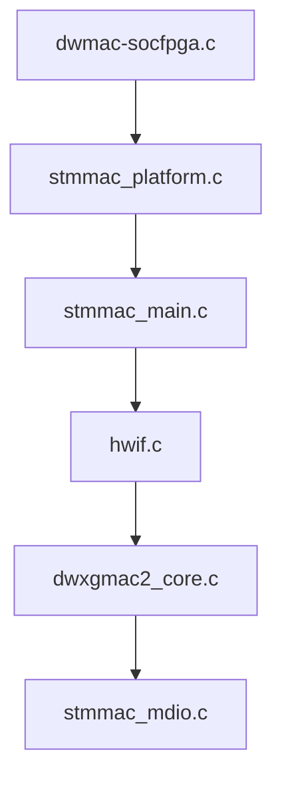
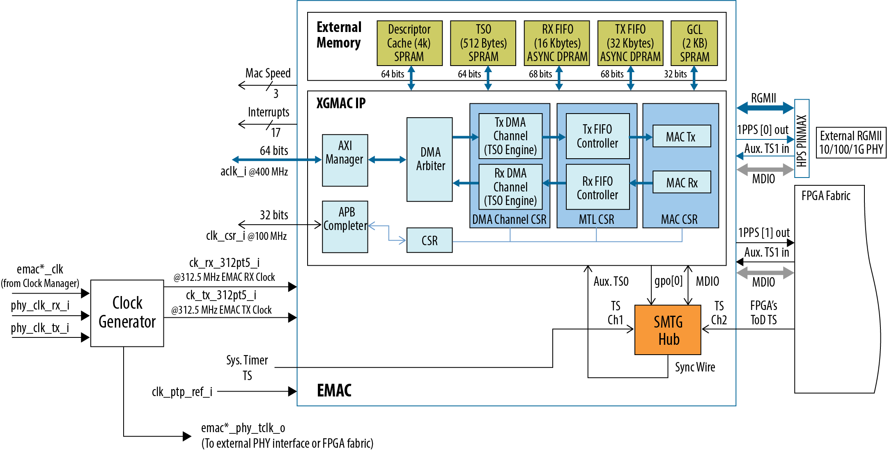
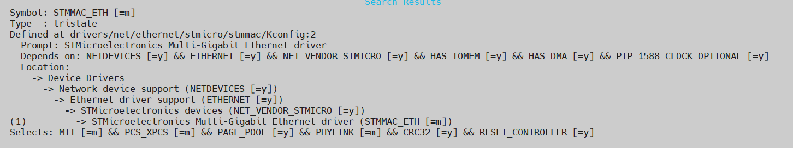
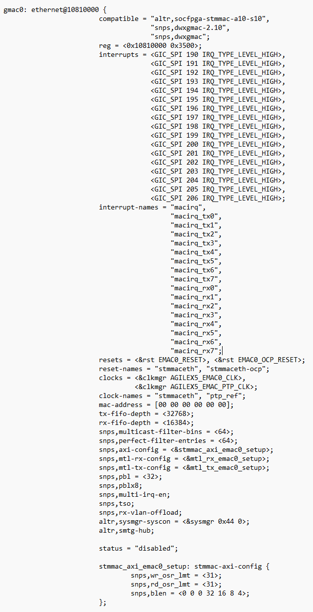

# **Ethernet Media Access Controller (EMAC) Driver for Hard Processor System**

Last updated: **May 25, 2024** 

**Upstream Status**: Not Upstreamed

**Devices supported**: Agilex 5

## **Introduction**

The Ethernet Media Access Controller (EMAC) Driver controls initialization, configuration and traffic shaping of the three EMACs in the Hard Processor System (HPS).

| Driver | Capability |
|:-------|:----------|
| /drivers/net/ethernet/stmicro/stmmac/dwmac-socfpga.c | Sets PHY layer configuration such as GMII, RGMII, RMII and speed. |
| /drivers/net/ethernet/stmicro/stmmac/stmmac_platform.c | Obtains the features EMAC features supported to main driver |
| /drivers/net/ethernet/stmicro/stmmac/stmmac_main.c | Sets ethtool operations  Initializes hardware  Initializes traffic control  Calls networking API (NAPI)  Registers IP as netdev  Initialize PHY, DMA, MAC Transaction Layer, Management MAC counters, Precision Time Protocol, Watchdog Timer, Ring Length, PCS protocol and TCP Segmentation Offload | 
| /drivers/net/ethernet/stmicro/stmmac/hwif.c | Initializes hardware interface and obtains device ID and IP version |
| /drivers/net/ethernet/stmicro/stmmac/dwxgmac2_core.c | Configures filters, link speed, MDIO/MII bus |
| /drivers/net/ethernet/stmicro/stmmac/stmmac_mdio.c | Provides bus interface for MII registers |

The following group of drivers is required to support EMAC functionality:

### **EMAC IP**

The hard processor system (HPS) provides three Ethernet media access controller
(EMAC) peripherals.
Each EMAC can be used to transmit and receive data at 10M/100M/1G/2.5G speeds
over Ethernet connections in compliance with the IEEE 802.3-2018 specification and
enable support for Time Sensitive Networking (TSN) applications.

The EMAC has an extensive memory-mapped Control and Status Register (CSR) set,
which can be accessed by the on-board Arm processors.

The EMAC is an integration of the Synopsys Ethernet XGMAC IP with the SMTG hub and
external memory. The EMAC can be accessed from HPS or FPGA fabric over an AXI
interface. For more information please refer to the [Agilex 5 Hard Processor System Technical Reference Manual](https://www.intel.com/content/www/us/en/docs/programmable/814346).

* IEEE 1588-2008 Advanced Timestamp: Precision Time Protocol (PTP), 2-steps, PTP offload and timestamping
* IEEE 802.1AS: Timing and synchronization
* IEEE 802.1Qav: Time-sensitive streams forwarding queuing
* The XGMAC supports the following features
  * Full-duplex operation at 10M/100M/1G/2.5 Gbps (GMII)
  * Full-duplex RGMII support (10M/100M/1 G)
  * Half-duplex operation in 10/100 Mbps modes
  * Separate transmission, reception, and configuration (control and status register) interfaces to the application
  * MDIO interface for multiple PHY devices and their configuration and management
  * Programmable frame length, supporting standard or jumbo Ethernet frames up to 9 KB

{: style="height:500px"}

## **Driver Sources**

The source code for this driver can be found at [https://github.com/altera-opensource/linux-socfpga/blob/socfpga-6.1.55-lts/drivers/net/ethernet/stmicro/stmmac/](https://github.com/altera-opensource/linux-socfpga/blob/socfpga-6.1.55-lts/drivers/net/ethernet/stmicro/stmmac/).  

## **Driver Capabilities**

* Set PHY layer configurations such as GMII, RGMII, RMII and speed.
* Initializes hardware, traffic control, calls networking API (NAPI), registers IP as netdev, initializes PHY, DMA, MAC Transaction Layer, Management MAC Counters, Precision Time Protocol, Watchdog Timer, Ring Length, PCS Protocol, and TCP Segmentation Offload.
* Initializes the hardware interface and obtains the device ID and IP version.
* Configures filters, link speed, MDIO/MII bus.
* Provides a bus interface for MII registers.

## **Kernel Configurations**

CONFIG_STMMAC_ETH

## **Device Tree**

Example Device tree location: [https://github.com/altera-opensource/linux-socfpga/blob/socfpga-6.1.55-lts/arch/arm64/boot/dts/intel/socfpga_agilex5.dtsi](https://github.com/altera-opensource/linux-socfpga/blob/socfpga-6.1.55-lts/arch/arm64/boot/dts/intel/socfpga_agilex5.dtsi)

## **Known Issues**

None known

## Notices & Disclaimers

Altera&reg; Corporation technologies may require enabled hardware, software or service activation.
No product or component can be absolutely secure. 
Performance varies by use, configuration and other factors.
Your costs and results may vary. 
You may not use or facilitate the use of this document in connection with any infringement or other legal analysis concerning Altera or Intel products described herein. You agree to grant Altera Corporation a non-exclusive, royalty-free license to any patent claim thereafter drafted which includes subject matter disclosed herein.
No license (express or implied, by estoppel or otherwise) to any intellectual property rights is granted by this document, with the sole exception that you may publish an unmodified copy. You may create software implementations based on this document and in compliance with the foregoing that are intended to execute on the Altera or Intel product(s) referenced in this document. No rights are granted to create modifications or derivatives of this document.
The products described may contain design defects or errors known as errata which may cause the product to deviate from published specifications.  Current characterized errata are available on request.
Altera disclaims all express and implied warranties, including without limitation, the implied warranties of merchantability, fitness for a particular purpose, and non-infringement, as well as any warranty arising from course of performance, course of dealing, or usage in trade.
You are responsible for safety of the overall system, including compliance with applicable safety-related requirements or standards. 
&copy; Altera Corporation.  Altera, the Altera logo, and other Altera marks are trademarks of Altera Corporation.  Other names and brands may be claimed as the property of others. 

OpenCL and the OpenCL logo are trademarks of Apple Inc. used by permission of the Khronos Group™. 
