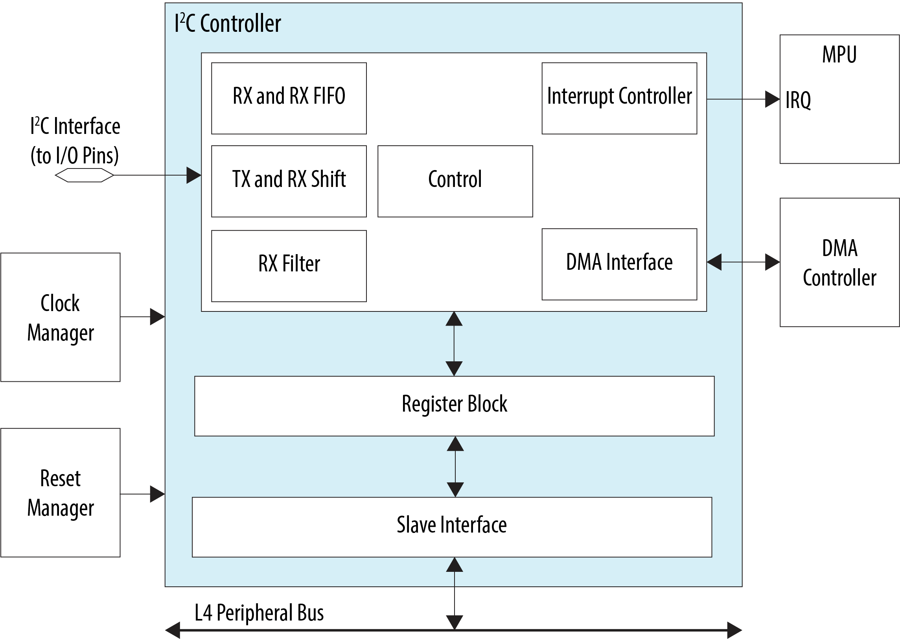
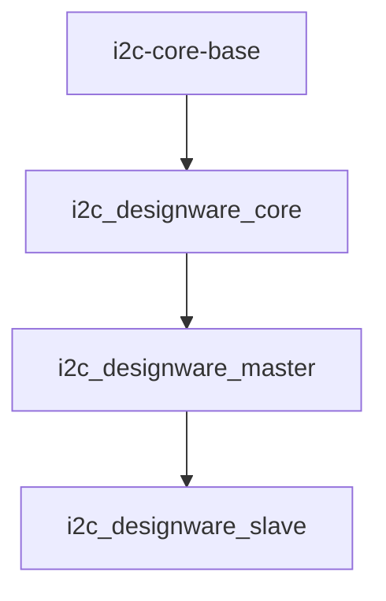
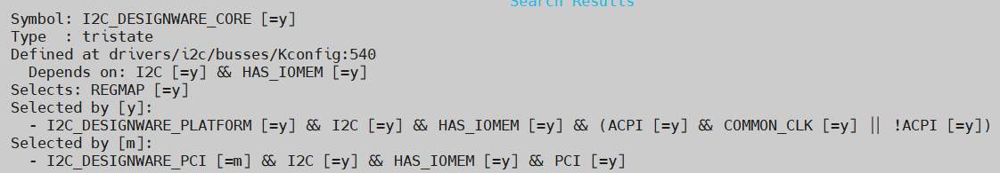
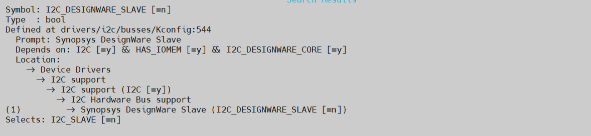
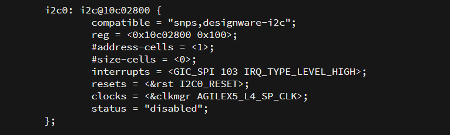

# **I2C Driver for Hard Processor System**

Last updated: **April 22, 2025** 

**Upstream Status**: [Upstreamed](https://git.kernel.org/pub/scm/linux/kernel/git/torvalds/linux.git/tree/drivers/i2c?h=master)

**Devices supported**: Agilex 7, Agilex 5

## **Introduction**

The I2C controller provides support for a communication link between integrated circuits on a board. It is a simple two-wire bus which consists of a serial data line (SDA) and a serial clock (SCL).

The hard processor system (HPS) provides five I2C controllers to enable system software to communicate serially with I2C buses. Each I2C controller can operate in master or slave mode and support standard mode of up to 100 Kbps or fast mode of up to 400 Kbps. These I2C controllers are instances of the Synopsys DesignWare controller.

Each I2C controller must be programmed to operate in either master or slave mode only. Operating as a master and slave simultaneously is not supported.

For More information please refer to the following link:

[Agilex 5 Hard Processor System Technical Reference Manual](https://www.intel.com/content/www/us/en/docs/programmable/814346)

{: style="height:450px;width:450px"}

## **Driver Sources**

The source code for this driver can be found at [https://git.kernel.org/pub/scm/linux/kernel/git/torvalds/linux.git/tree/drivers/i2c/busses](https://git.kernel.org/pub/scm/linux/kernel/git/torvalds/linux.git/tree/drivers/i2c/busses).

## **Driver Capabilities**

* Manage the communication for I2C Master buses as well as Slave.
* Handle the data transfer between connected devices over the I2C bus.

## **Kernel Configurations**

CONFIG_I2C_DESIGNWARE_CORE

CONFIG_I2C_DESIGNWARE_SLAVE

## **Device Tree**

Example Device tree location to configure the i2c:

[https://git.kernel.org/pub/scm/linux/kernel/git/torvalds/linux.git/tree/arch/arm64/boot/dts/intel/socfpga_agilex5.dtsi](https://git.kernel.org/pub/scm/linux/kernel/git/torvalds/linux.git/tree/arch/arm64/boot/dts/intel/socfpga_agilex5.dtsi)

## **Known Issues**

None Known

## Notices & Disclaimers

Altera&reg; Corporation technologies may require enabled hardware, software or service activation.
No product or component can be absolutely secure. 
Performance varies by use, configuration and other factors.
Your costs and results may vary. 
You may not use or facilitate the use of this document in connection with any infringement or other legal analysis concerning Altera or Intel products described herein. You agree to grant Altera Corporation a non-exclusive, royalty-free license to any patent claim thereafter drafted which includes subject matter disclosed herein.
No license (express or implied, by estoppel or otherwise) to any intellectual property rights is granted by this document, with the sole exception that you may publish an unmodified copy. You may create software implementations based on this document and in compliance with the foregoing that are intended to execute on the Altera or Intel product(s) referenced in this document. No rights are granted to create modifications or derivatives of this document.
The products described may contain design defects or errors known as errata which may cause the product to deviate from published specifications.  Current characterized errata are available on request.
Altera disclaims all express and implied warranties, including without limitation, the implied warranties of merchantability, fitness for a particular purpose, and non-infringement, as well as any warranty arising from course of performance, course of dealing, or usage in trade.
You are responsible for safety of the overall system, including compliance with applicable safety-related requirements or standards. 
&copy; Altera Corporation.  Altera, the Altera logo, and other Altera marks are trademarks of Altera Corporation.  Other names and brands may be claimed as the property of others. 

OpenCL* and the OpenCL* logo are trademarks of Apple Inc. used by permission of the Khronos Group™. 
