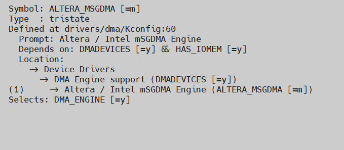
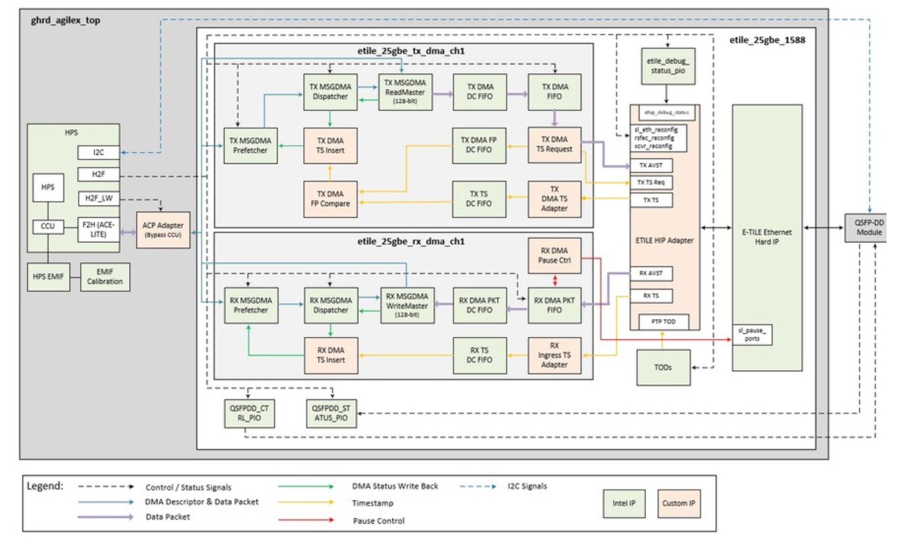

# **A Modular Scatter-Gather DMA (mSGDMA) Driver for Hard Processor System**

Last updated: **December 11, 2024** 

**Upstream Status**: Not Upstreamed

**Devices supported**: Agilex 7

## **Introduction**

In a processor subsystem, data transfers between two memory spaces can happen frequently. In order to offload the processor from moving data around a system, a Direct Memory Access (DMA) engine is introduced to perform this function instead. The Modular Scatter-Gather DMA (mSGDMA) is capable of performing data movement operations with preloaded instructions, called descriptors. Multiple descriptors with different transfer sizes, and source and destination addresses have the option to trigger interrupts.

## **mSGDMA FPGA IP**

The mSGDMA provides three configuration structures for handling data transfers: between the Avalon-MM to Avalon-MM, Avalon-MM to Avalon-ST, and Avalon-ST to Avalon-MM. The sub-core of the mSGDMA is instantiated automatically according to the structure configured for the mSGDMA use model. For more information on MSGDMA IP core please refer to [https://www.intel.com/content/www/us/en/docs/programmable/683130/23-1/modular-scatter-gather-dma-core.html](https://www.intel.com/content/www/us/en/docs/programmable/683130/23-1/modular-scatter-gather-dma-core.html).

## **Driver Sources**

The source code for this driver can be found at:

[https://github.com/altera-opensource/linux-socfpga/blob/socfpga-6.1.55-lts/drivers/dma/altera-msgdma.c](https://github.com/altera-opensource/linux-socfpga/blob/socfpga-6.1.55-lts/drivers/dma/altera-msgdma.c)

## **Driver Capabilities**

* Manage multiple DMA channels provided by the MSGDMA IP core.
* Provides support for interrupt handling.
* Provides support for Scatter-gather DMA operation through a set of buffer descriptors.
* Data transfer to non-contiguous memory space.

## **Kernel Configurations**
 
CONFIG_ALTERA_MSGDMA

## **Known Issues**

None Known

## **Example Designs**

Moified version of MSGDMA driver is used in the [Agilex 7 SoC F-Tile Design Example for 25/10 GbE with IEEE1588PTP](https://www.rocketboards.org/foswiki/Projects/Agilex7SoCFTileDesignExampleWithIEEE1588PTP25GE) and also the source code is available at [https://github.com/altera-opensource/linux-socfpga/tree/socfpga-6.1.55-lts/drivers/net/ethernet/altera](https://github.com/altera-opensource/linux-socfpga/tree/socfpga-6.1.55-lts/drivers/net/ethernet/altera).

## Notices & Disclaimers

Altera&reg; Corporation technologies may require enabled hardware, software or service activation.
No product or component can be absolutely secure. 
Performance varies by use, configuration and other factors.
Your costs and results may vary. 
You may not use or facilitate the use of this document in connection with any infringement or other legal analysis concerning Altera or Intel products described herein. You agree to grant Altera Corporation a non-exclusive, royalty-free license to any patent claim thereafter drafted which includes subject matter disclosed herein.
No license (express or implied, by estoppel or otherwise) to any intellectual property rights is granted by this document, with the sole exception that you may publish an unmodified copy. You may create software implementations based on this document and in compliance with the foregoing that are intended to execute on the Altera or Intel product(s) referenced in this document. No rights are granted to create modifications or derivatives of this document.
The products described may contain design defects or errors known as errata which may cause the product to deviate from published specifications.  Current characterized errata are available on request.
Altera disclaims all express and implied warranties, including without limitation, the implied warranties of merchantability, fitness for a particular purpose, and non-infringement, as well as any warranty arising from course of performance, course of dealing, or usage in trade.
You are responsible for safety of the overall system, including compliance with applicable safety-related requirements or standards. 
&copy; Altera Corporation.  Altera, the Altera logo, and other Altera marks are trademarks of Altera Corporation.  Other names and brands may be claimed as the property of others. 

OpenCL* and the OpenCL* logo are trademarks of Apple Inc. used by permission of the Khronos Group™. 
