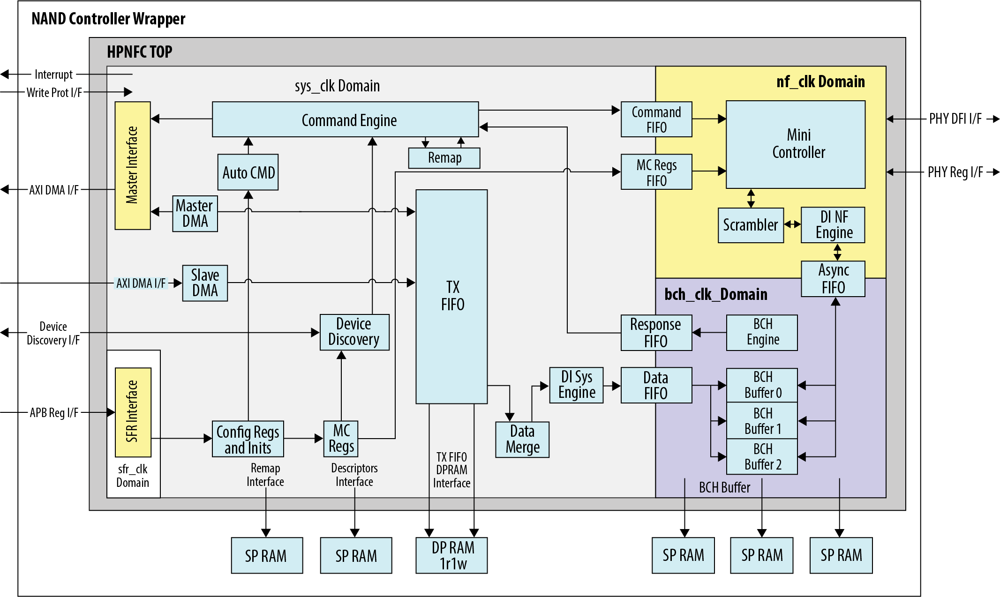
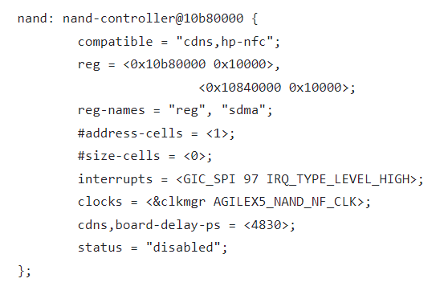

# **NAND Flash Controller Driver for Hard Processor System**

Last updated: **February 20, 2025** 

**Upstream Status**: [Upstreamed](https://git.kernel.org/pub/scm/linux/kernel/git/torvalds/linux.git/tree/drivers/mtd/nand/raw/cadence-nand-controller.c)

**Devices supported**: Agilex 5

## **Introduction**

The Hard Processor System (HPS) provides a NAND Flash controller to interface with external NAND Flash memory in Intel system-on-a-chip (SoC) systems. External Flash memory can be used to store software, or as extra storage capacity for large applications or user data. For more information please refer to the [Intel Agilex 5 Hard Processor System Technical Reference Manual](https://www.intel.com/content/www/us/en/docs/programmable/814346).

## **Features**

* The triple-level cell (TLC) devices are supported only in parts that are compatible with the ONFI specification
* Supports three operation modes that make the controller easy to operate while also providing enough flexibility to be adapted to your project's needs.
* Supports DMA data transfer which optimizes the transfer rate for read and write operations using DMA primary and DMA secondary interfaces.
* Supports devices with page sizes up to 64 KB.
* Support up to 8 operation threads that can be executed in parallel.
* Provides data buffering where necessary in order to achieve maximum performance.

{: style="height:650px"}

## **Driver Sources**

The source code for this driver can be found at [https://git.kernel.org/pub/scm/linux/kernel/git/torvalds/linux.git/tree/drivers/mtd/nand/raw/cadence-nand-controller.c](https://git.kernel.org/pub/scm/linux/kernel/git/torvalds/linux.git/tree/drivers/mtd/nand/raw/cadence-nand-controller.c).

## **Driver Capabilities**

* Initialization and configuration of the NAND controller hardware.
* Determine the characteristics like page size and block size.

## **Kernel Configurations**

CONFIG_MTD_NAND_CADENCE

## **Device Tree**

Example Device tree location:

[https://github.com/torvalds/linux/blob/master/arch/arm64/boot/dts/intel/socfpga_agilex5.dtsi](https://github.com/torvalds/linux/blob/master/arch/arm64/boot/dts/intel/socfpga_agilex5.dtsi)

## **Known Issues**

None known

## Notices & Disclaimers

Altera&reg; Corporation technologies may require enabled hardware, software or service activation.
No product or component can be absolutely secure. 
Performance varies by use, configuration and other factors.
Your costs and results may vary. 
You may not use or facilitate the use of this document in connection with any infringement or other legal analysis concerning Altera or Intel products described herein. You agree to grant Altera Corporation a non-exclusive, royalty-free license to any patent claim thereafter drafted which includes subject matter disclosed herein.
No license (express or implied, by estoppel or otherwise) to any intellectual property rights is granted by this document, with the sole exception that you may publish an unmodified copy. You may create software implementations based on this document and in compliance with the foregoing that are intended to execute on the Altera or Intel product(s) referenced in this document. No rights are granted to create modifications or derivatives of this document.
The products described may contain design defects or errors known as errata which may cause the product to deviate from published specifications.  Current characterized errata are available on request.
Altera disclaims all express and implied warranties, including without limitation, the implied warranties of merchantability, fitness for a particular purpose, and non-infringement, as well as any warranty arising from course of performance, course of dealing, or usage in trade.
You are responsible for safety of the overall system, including compliance with applicable safety-related requirements or standards. 
&copy; Altera Corporation.  Altera, the Altera logo, and other Altera marks are trademarks of Altera Corporation.  Other names and brands may be claimed as the property of others. 

OpenCL* and the OpenCL* logo are trademarks of Apple Inc. used by permission of the Khronos Group™. 
